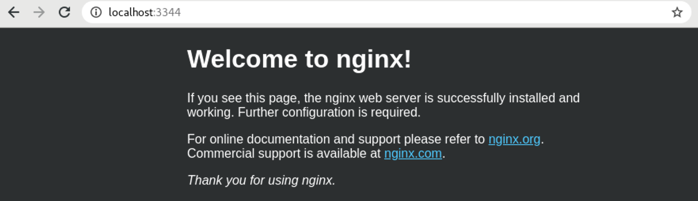
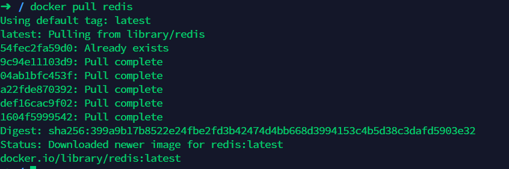
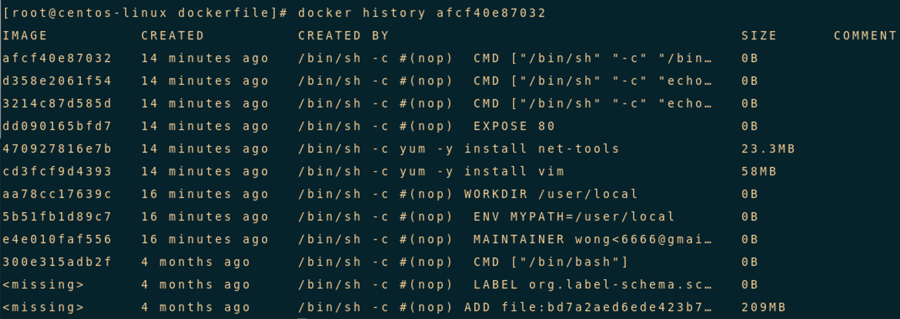
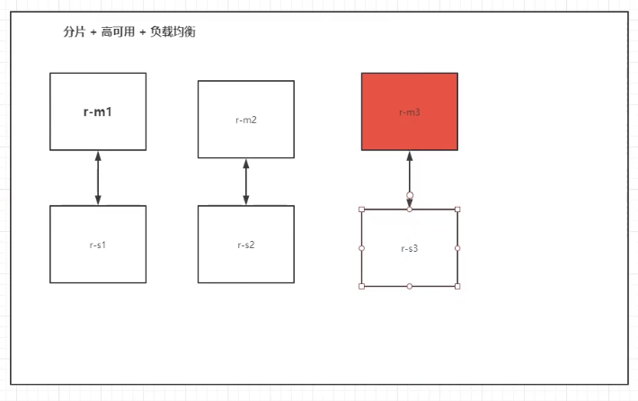
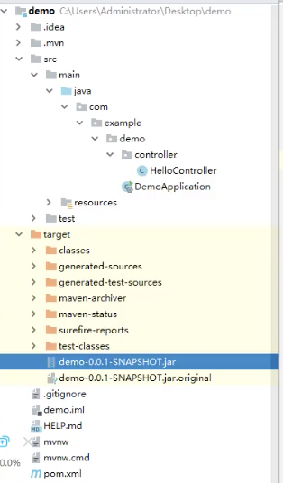

# Docker 入門

筆記整理來源B站UP主狂神說Java https://space.bilibili.com/95256449/

## Docker概述

Docker為什麼出現？

一款產品： 開發–上線兩套環境！應用環境，應用配置！

開發— 運維。問題：我在我的電腦上可以允許！版本更新，導致服務不可用！對於運維來說考驗十分大？

環境配置是十分的麻煩，每一個及其都要部署環境(集群Redis、ES、Hadoop…) !費事費力。

發布一個項目( jar + (Redis MySQL JDK ES) ),項目能不能帶上環境安裝打包！

之前在服務器配置一個應用的環境Redis MySQL JDK ES Hadoop 配置超麻煩了，不能夠跨平台。

開發環境Windows，最後發佈到Linux！

- 傳統：開發jar，運維來做！

- 現在：開發打包部署上線，一套流程做完！

- 安卓流程：java — apk —發布（應用商店）一張三使用apk一安裝即可用！

- docker流程： java-jar（環境） — 打包項目帯上環境（鏡像） — ( Docker倉庫：商店）-----

Docker給以上的問題，提出了解決方案！

Docker的思想就來自於集裝箱！

JRE –多個應用(端口衝突) –原來都是交叉的！
隔離：Docker核心思想！打包裝箱！每個箱子是互相隔離的。

Docker通過隔離機制，可以將服務器利用到極致！

本質：所有的技術都是因為出現了一些問題，我們需要去解決，才去學習！

### Docker歷史

2010年，幾個的年輕人，就在美國成立了一家公司 dotcloud

做一些pass的雲計算服務！LXC（Linux Container容器）有關的容器技術！

Linux Container容器是一種內核虛擬化技術，可以提供輕量級的虛擬化，以便隔離進程和資源。

他們將自己的技術（容器化技術）命名就是Docker
Docker剛剛延生的時候，沒有引起行業的注意！dotCloud，就活不下去！

> 開源

2013年，Docker開源！

越來越多的人發現docker的優點！火了。Docker每個月都會更新一個版本！

2014年4月9日，Docker1.0發布！

docker為什麼這麼火？十分的輕巧！

在容器技術出來之前，我們都是使用虛擬機技術！

虛擬機：在window中裝一個VMware，通過這個軟件我們可以虛擬出來一台或者多台電腦！笨重！

虛擬機也屬於虛擬化技術，Docker容器技術，也是一種虛擬化技術！

```
VMware : linux centos 原生鏡像（一個電腦！） 隔離、需要開啟多個虛擬機！幾個G 幾分鐘 
docker: 隔離，鏡像（最核心的環境 4m + jdk + mysql）十分的小巧，運行鏡像就可以了！小巧！幾個M 秒級啟動！
```

> 聊聊Docker

Docker基於Go語言開發的！開源項目！

docker官網：https://www.docker.com/

https://www.docker.com/get-started

文檔：https://docs.docker.com/ Docker的文檔是超級詳細的！

倉庫：https://hub.docker.com/

### docker能幹嘛

之前的虛擬機技術


虛擬機技術缺點：

1、 資源佔用十分多

2、 冗餘步驟多

3、 啟動很慢！

> 容器化技術

`容器化技術不是模擬一個完整的操作系統`


比較Docker和虛擬機技術的不同：

- 傳統虛擬機，虛擬出一條硬件，運行一個完整的操作系統，然後在這個系統上安裝和運行軟件
- 容器內的應用直接運行在宿主機的內容，`容器是沒有自己的內核的，也沒有虛擬我們的硬件`，所以就輕便了
- 每個容器間是互相隔離，每個容器內都有一個屬於自己的文件系統，互不影響

> DevOps（開發、運維）

1. 應用更快速的交付和部署

傳統：一對幫助文檔，安裝程序。

Docker：打包鏡像發布測試一鍵運行。

2. 更便捷的升級和擴縮容

使用了Docker之後，我們部署應用就和搭積木一樣
項目打包為一個鏡像，擴展服務器A！服務器B

更簡單的系統運維
在容器化之後，我們的開發，測試環境都是高度一致的

3. 更高效的計算資源利用

Docker是內核級別的虛擬化，可以在一個物理機上可以運行很多的容器實例！服務器的性能可以被壓榨到極致。

## Docker安裝

Docker的基本組成


鏡像（image)：

- docker鏡像就好比是一個模版，可以通過這個模版來創建容器服務，tomcat鏡像==>run==>容器（提供服務器），通過這個鏡像可以創建多個容器（最終服務運行或者項目運行就是在容器中的）。

容器(container)：

- Docker利用容器技術，獨立運行一個或者一組應用，通過鏡像來創建的.
- 啟動，停止，刪除，基本命令
- 目前就可以把這個容器理解為就是一個簡易的Linux系統。

倉庫(repository)：

- 倉庫就是存放鏡像的地方！
- 倉庫分為公有倉庫和私有倉庫。(很類似git)
- Docker Hub是國外的。
  阿里雲…都有容器服務器(配置鏡像加速!)

### 安裝Docker

[Linux 設定 NTP 同步系統時間，自動網路校時教學](https://blog.gtwang.org/linux/linux-ntp-installation-and-configuration-tutorial/)

> 環境準備

1.Linux要求內核3.0以上

2，CentOS 7

```java
[root@ ~]# uname -r
3.10.0-514.26.2.el7.x86_64	# 要求3.0以上
[root@ ~]# cat /etc/os-release 
NAME="CentOS Linux"
VERSION="7 (Core)"
ID="centos"
ID_LIKE="rhel fedora"
VERSION_ID="7"
PRETTY_NAME="CentOS Linux 7 (Core)"
ANSI_COLOR="0;31"
CPE_NAME="cpe:/o:centos:centos:7"
HOME_URL="https://www.centos.org/"
BUG_REPORT_URL="https://bugs.centos.org/"

CENTOS_MANTISBT_PROJECT="CentOS-7"
CENTOS_MANTISBT_PROJECT_VERSION="7"
REDHAT_SUPPORT_PRODUCT="centos"
REDHAT_SUPPORT_PRODUCT_VERSION="7"
```

> 安裝

幫助文檔：https://docs.docker.com/engine/install/
卸載與安裝

```shell
#1.卸載舊版本
yum remove docker \
                  docker-client \
                  docker-client-latest \
                  docker-common \
                  docker-latest \
                  docker-latest-logrotate \
                  docker-logrotate \
                  docker-engine
#2.需要的安裝包
yum install -y yum-utils

#3.設置鏡像的倉庫
yum-config-manager \
    --add-repo \
    https://download.docker.com/linux/centos/docker-ce.repo
#上述方法默認是從國外的
    
#更新yum軟件包索引
yum makecache fast

#4.安裝docker相關的 docker-ce 社區版 而ee是企業版
yum install docker-ce docker-ce-cli containerd.io # 這裡我們使用社區版即可

#5.啟動docker
systemctl start docker

#6. 使用docker version查看是否按照成功
docker version

#7. 測試
docker run hello-world

#8.查看已經下載的鏡像(從這裡可以查看已有鏡像的id)
[root@iz2zeak7sgj6i7hrb2g862z ~]# docker images
REPOSITORY TAG IMAGE ID CREATED SIZE
hello-world latest bf756fb1ae65 4 months ago 13.3kB
```


卸載docker

```shell
#1. 卸載依賴
yum remove docker-ce docker-ce-cli containerd.io
#2. 刪除資源
rm -rf /var/lib/docker

# /var/lib/docker 是docker的默認工作路徑！
```

#### 回顧HelloWorld流程


docker run 流程圖


底層原理
Docker是怎麼工作的？

Docker是一個Client-Server結構的系統，`Docker的守護進程運行在主機上`。通過Socket從客戶端訪問！

Docker-Server接收到Docker-Client的指令，就會執行這個命令！


為什麼Docker比Vm快
1、docker有著比虛擬機更少的抽象層。由`於docker不需要Hypervisor實現硬件資源虛擬化`,運行在docker容器上的程序直接使用的都是實際物理機的硬件資源。因此在CPU、內存利用率上docker將會在效率上有明顯優勢。

2、`docker利用的是宿主機的內核,而不需要Guest OS`。

- GuestOS： VM（虚拟机）里的的系统（OS）

- HostOS：物理机里的系统（OS）


因此,當新建一個容器時,docker不需要和虛擬機一樣重新加載一個操作系統內核。仍而避免引導、加載操作系統內核返個比較費時費資源的過程,當新建一個虛擬機時,虛擬機軟件需要加載GuestOS,返個新建過程是分鐘級別的。而docker由於直接利用宿主機的操作系統,則省略了這個複雜的過程,因此新建一個docker容器只需要幾秒鐘。

## Docker的常用命令

### 1.幫助命令

```shell
docker version #顯示docker的版本信息。
docker info #顯示docker的系統信息，包括鏡像和容器的數量
docker 命令 --help #幫助命令
```

幫助文檔的地址：https://docs.docker.com/engine/reference/commandline/build/

### 2.鏡像命令

```shell
docker images #查看所有本地主機上的鏡像 可以使用docker image ls代替

docker search #搜索鏡像

docker pull #下載鏡像 docker image pull

docker rmi #刪除鏡像 docker image rm
```


docker images查看所有本地的主機上的鏡像

```shell
[root@ ~]# docker images
REPOSITORY TAG IMAGE ID CREATED SIZE
hello-world latest bf756fb1ae65 5 weeks ago 13.3kB

# 解釋

#REPOSITORY # 鏡像的倉庫源
#TAG # 鏡像的標籤(版本) ---lastest 表示最新版本
#IMAGE ID # 鏡像的id
#CREATED # 鏡像的創建時間
#SIZE # 鏡像的大小

# 可選項
Options:
  -a, --all Show all images (default hides intermediate images) #列出所有鏡像
  -q, --quiet Only show numeric IDs # 只顯示鏡像的id

[root@ ~]# docker images -a #列出所有鏡像詳細信息
REPOSITORY TAG IMAGE ID CREATED SIZE
hello-world latest bf756fb1ae65 5 weeks ago 13.3kB

[root@ ~]# docker images -aq #列出所有鏡像的id
d5f28a0bb0d0
```

docker search 搜索鏡像

```shell
[root@~]# docker search mysql

# --filter=STARS=3000 #過濾，搜索出來的鏡像收藏STARS數量大於3000的

Options:
  -f, --filter filter Filter output based on conditions provided
      --format string Pretty-print search using a Go template
      --limit int Max number of search results (default 25)
      --no-trunc Don't truncate output
      
[root@ ~]# docker search mysql --filter=STARS=3000
NAME  DESCRIPTION 								STARS OFFICIAL AUTOMATED
mysql MySQL is a widely used, ... 10753 [OK]
mariadb MariaDB Server is a   ... 4047 [OK]
```

docker pull 下載鏡像

```shell
# 下載鏡像 docker pull 鏡像名[:tag]
[root@ ~]# docker pull tomcat:8
8: Pulling from library/tomcat #如果不寫tag，默認就是latest
90fe46dd8199: Already exists #分層下載： docker image 的核心 聯合文件系統
35a4f1977689: Already exists
bbc37f14aded: Already exists
74e27dc593d4: Already exists
93a01fbfad7f: Already exists
1478df405869: Pull complete
64f0dd11682b: Pull complete
68ff4e050d11: Pull complete
f576086003cf: Pull complete
3b72593ce10e: Pull complete
Digest: sha256:0c6234e7ec9d10ab32c06423ab829b32e3183ba5bf2620ee66de866df # 簽名防偽
Status: Downloaded newer image for tomcat:8
docker.io/library/tomcat:8 #真實地址

#等價於
docker pull tomcat:8
docker pull docker.io/library/tomcat:8
```

docker rmi 刪除鏡像

```shell
docker rmi -f 鏡像id #刪除指定id的鏡像
docker rmi -f 鏡像id 鏡像id 鏡像id #刪除多個指定id的鏡像，用空格分隔
[root@ ~]# docker rmi -f f19c56ce92a8

docker rmi -f $(docker images -aq) #刪除全部的鏡像
[root@ ~]# docker stop $(docker ps -a -q)
```

### 3.容器命令

說明：我們`有了鏡像才可以創建容器，Linux`，下載centos鏡像來學習

鏡像下載

```shell
#docker中下載centos
docker pull centos

docker run 鏡像id #新建容器並啟動

docker ps 列出所有運行的容器 docker container list

docker rm 容器id #刪除指定容器

docker start 容器id #啟動容器
docker restart 容器id #重啟容器
docker stop 容器id #停止當前正在運行的容器
docker kill 容器id #強制停止當前容器

[root@ ~]# docker container list #h和docker ps相同
```


新建容器並啟動

```shell
docker run [可選參數] image | docker container run [可選參數] image
#參書說明
  --name="Name" #容器名字 tomcat01 tomcat02 用來區分容器
  -d #後台方式運行
  -it #使用交互方式運行，進入容器查看內容
  -p #指定容器的端口 -p 8080(宿主機):8080(容器)
      -p ip:主機端口:容器端口
      -p 主機端口:容器端口(常用)
      -p 容器端口
      容器端口
  -P(大寫) 隨機指定端口

# 測試、啟動並進入容器
[root@ ~]# docker run -it centos /bin/bash
[root@392f44c3065b /]# ls 	#查看容器內的 centos
bin dev etc home lib lib64 lost+found media mnt opt proc root run sbin srv sys tmp usr var
[root@ /]# exit #從容器退回主機
exit
```


列出所有運行的容器

```shell
docker ps 命令 #列出當前正在運行的容器
  -a, --all #列出當前正在運行的容器 + 帶出歷史運行過的容器
  -n=?, --last int #列出最近創建的?個容器 ?為1則只列出最近創建的一個容器,為2則列出2個
  -q, --quiet #只列出容器的編號
```


退出容器

```shell
exit #容器直接退出
ctrl +P +Q #容器不停止退出 ---注意：這個很有用的操作
```


刪除容器

```shell
docker rm 容器id #刪除指定的容器，不能刪除正在運行的容器，如果要強制刪除 rm -rf
docker rm -f $(docker ps -aq) #刪除所有的容器
docker ps -a -q|xargs docker rm #刪除所有的容器
```


啟動和停止容器的操作

```shell
docker start 容器id #啟動容器
docker restart 容器id #重啟容器
docker stop 容器id #停止當前正在運行的容器
docker kill 容器id #強制停止當前容器
```


### 4.常用其他命令

#### 後台啟動命令

```shell
# 命令 docker run -d 鏡像名

[root@ ~]# docker run -d centos
a8f922c255859622ac45ce3a535b7a0e8253329be4756ed6e32265d2dd2fac6c

[root@ ~]# docker ps
CONTAINER ID IMAGE COMMAND CREATED STATUS PORTS NAMES

# 問題docker ps. 發現centos 停止了

# 常見的坑，docker容器使用後台運行，就必須要有要一個前台進程，docker發現沒有應用，就會自動停止
# nginx，容器啟動後，發現自己沒有提供服務，就會立刻停止，就是沒有程序了
```


查看日誌

```shell
docker logs --help
Options:
      --details Show extra details provided to logs

* -f, --follow Follow log output
   --since string Show logs since timestamp (e.g. 2013-01-02T13:23:37) or relative (e.g. 42m for 42 minutes)
* --tail string Number of lines to show from the end of the logs (default "all")
* -t, --timestamps Show timestamps
   --until string Show logs before a timestamp (e.g. 2013-01-02T13:23:37) or relative (e.g. 42m for 42 minutes)
  
  
  ➜ ~ docker run -d centos /bin/sh -c "while true;do echo 6666;sleep 1;done" #模擬日誌
   #顯示日誌
   -tf #顯示日誌信息（一直更新）
   --tail number #需要顯示日誌條數
   docker logs -t --tail n 容器id #查看n行日誌
   docker logs -ft 容器id #跟著日誌
```

查看容器中進程信息ps

```shell
命令 docker top 容器id
```


查看鏡像的元數據

```shell
# 命令
docker inspect 容器id

# 测试
➜  ~ docker inspect 55321bcae33d
[
    {
        "Id": "55321bcae33d15da8280bcac1d2bc1141d213bcc8f8e792edfd832ff61ae5066",
        "Created": "2021-04-16T05:22:15.515909071Z",
        "Path": "/bin/sh",
        "Args": [
            "-c",
            "while true;do echo 6666;sleep 1;done"
        ],
        "State": {
            "Status": "running",
            "Running": true,
            "Paused": false,
            "Restarting": false,
            "OOMKilled": false,
            "Dead": false,
            "Pid": 22973,
            "ExitCode": 0,
            "Error": "",
            "StartedAt": "2020-05-15T05:22:06.165904633Z",
            "FinishedAt": "0001-01-01T00:00:00Z"
        },
        "Image": "sha256:470671670cac686c7cf0081e0b37da2e9f4f768ddc5f6a26102ccd1c6954c1ee",
        "ResolvConfPath": "/var/lib/docker/containers/55321bcae33d15da8280bcac1d2bc1141d213bcc8f8e792edfd832ff61ae5066/resolv.conf",
        "HostnamePath": "/var/lib/docker/containers/55321bcae33d15da8280bcac1d2bc1141d213bcc8f8e792edfd832ff61ae5066/hostname",
        "HostsPath": "/var/lib/docker/containers/55321bcae33d15da8280bcac1d2bc1141d213bcc8f8e792edfd832ff61ae5066/hosts",
        "LogPath": "/var/lib/docker/containers/55321bcae33d15da8280bcac1d2bc1141d213bcc8f8e792edfd832ff61ae5066/55321bcae33d15da8280bcac1d2bc1141d213bcc8f8e792edfd832ff61ae5066-json.log",
        "Name": "/bold_bell",
        "RestartCount": 0,
        "Driver": "overlay2",
        "Platform": "linux",
        "MountLabel": "",
        "ProcessLabel": "",
        "AppArmorProfile": "docker-default",
        "ExecIDs": null,
        "HostConfig": {
            "Binds": null,
            "ContainerIDFile": "",
            "LogConfig": {
                "Type": "json-file",
                "Config": {}
            },
            "NetworkMode": "default",
            "PortBindings": {},
            "RestartPolicy": {
                "Name": "no",
                "MaximumRetryCount": 0
            },
            "AutoRemove": false,
            "VolumeDriver": "",
            "VolumesFrom": null,
            "CapAdd": null,
            "CapDrop": null,
            "Capabilities": null,
            "Dns": [],
            "DnsOptions": [],
            "DnsSearch": [],
            "ExtraHosts": null,
            "GroupAdd": null,
            "IpcMode": "private",
            "Cgroup": "",
            "Links": null,
            "OomScoreAdj": 0,
            "PidMode": "",
            "Privileged": false,
            "PublishAllPorts": false,
            "ReadonlyRootfs": false,
            "SecurityOpt": null,
            "UTSMode": "",
            "UsernsMode": "",
            "ShmSize": 67108864,
            "Runtime": "runc",
            "ConsoleSize": [
                0,
                0
            ],
            "Isolation": "",
            "CpuShares": 0,
            "Memory": 0,
            "NanoCpus": 0,
            "CgroupParent": "",
            "BlkioWeight": 0,
            "BlkioWeightDevice": [],
            "BlkioDeviceReadBps": null,
            "BlkioDeviceWriteBps": null,
            "BlkioDeviceReadIOps": null,
            "BlkioDeviceWriteIOps": null,
            "CpuPeriod": 0,
            "CpuQuota": 0,
            "CpuRealtimePeriod": 0,
            "CpuRealtimeRuntime": 0,
            "CpusetCpus": "",
            "CpusetMems": "",
            "Devices": [],
            "DeviceCgroupRules": null,
            "DeviceRequests": null,
            "KernelMemory": 0,
            "KernelMemoryTCP": 0,
            "MemoryReservation": 0,
            "MemorySwap": 0,
            "MemorySwappiness": null,
            "OomKillDisable": false,
            "PidsLimit": null,
            "Ulimits": null,
            "CpuCount": 0,
            "CpuPercent": 0,
            "IOMaximumIOps": 0,
            "IOMaximumBandwidth": 0,
            "MaskedPaths": [
                "/proc/asound",
                "/proc/acpi",
                "/proc/kcore",
                "/proc/keys",
                "/proc/latency_stats",
                "/proc/timer_list",
                "/proc/timer_stats",
                "/proc/sched_debug",
                "/proc/scsi",
                "/sys/firmware"
            ],
            "ReadonlyPaths": [
                "/proc/bus",
                "/proc/fs",
                "/proc/irq",
                "/proc/sys",
                "/proc/sysrq-trigger"
            ]
        },
        "GraphDriver": {
            "Data": {
                "LowerDir": "/var/lib/docker/overlay2/1f347949ba49c4dbee70cea9ff3af39a14e602bc8fac8331c46347bf6708757a-init/diff:/var/lib/docker/overlay2/5afcd8220c51854a847a36f52775b4ed0acb16fe6cfaec3bd2e5df59863835ba/diff",
                "MergedDir": "/var/lib/docker/overlay2/1f347949ba49c4dbee70cea9ff3af39a14e602bc8fac8331c46347bf6708757a/merged",
                "UpperDir": "/var/lib/docker/overlay2/1f347949ba49c4dbee70cea9ff3af39a14e602bc8fac8331c46347bf6708757a/diff",
                "WorkDir": "/var/lib/docker/overlay2/1f347949ba49c4dbee70cea9ff3af39a14e602bc8fac8331c46347bf6708757a/work"
            },
            "Name": "overlay2"
        },
        "Mounts": [],
        "Config": {
            "Hostname": "55321bcae33d",
            "Domainname": "",
            "User": "",
            "AttachStdin": false,
            "AttachStdout": false,
            "AttachStderr": false,
            "Tty": false,
            "OpenStdin": false,
            "StdinOnce": false,
            "Env": [
                "PATH=/usr/local/sbin:/usr/local/bin:/usr/sbin:/usr/bin:/sbin:/bin"
            ],
            "Cmd": [
                "/bin/sh",
                "-c",
                "while true;do echo 6666;sleep 1;done"
            ],
            "Image": "centos",
            "Volumes": null,
            "WorkingDir": "",
            "Entrypoint": null,
            "OnBuild": null,
            "Labels": {
                "org.label-schema.build-date": "20200114",
                "org.label-schema.license": "GPLv2",
                "org.label-schema.name": "CentOS Base Image",
                "org.label-schema.schema-version": "1.0",
                "org.label-schema.vendor": "CentOS",
                "org.opencontainers.image.created": "2020-01-14 00:00:00-08:00",
                "org.opencontainers.image.licenses": "GPL-2.0-only",
                "org.opencontainers.image.title": "CentOS Base Image",
                "org.opencontainers.image.vendor": "CentOS"
            }
        },
        "NetworkSettings": {
            "Bridge": "",
            "SandboxID": "63ed0c837f35c12453bae9661859f37a08541a0749afb86e881869bf6fd9031b",
            "HairpinMode": false,
            "LinkLocalIPv6Address": "",
            "LinkLocalIPv6PrefixLen": 0,
            "Ports": {},
            "SandboxKey": "/var/run/docker/netns/63ed0c837f35",
            "SecondaryIPAddresses": null,
            "SecondaryIPv6Addresses": null,
            "EndpointID": "b129d9a5a2cbb92722a2101244bd81a9e3d8af034e83f338c13790a1a94552a1",
            "Gateway": "172.17.0.1",
            "GlobalIPv6Address": "",
            "GlobalIPv6PrefixLen": 0,
            "IPAddress": "172.17.0.4",
            "IPPrefixLen": 16,
            "IPv6Gateway": "",
            "MacAddress": "02:42:ac:11:00:04",
            "Networks": {
                "bridge": {
                    "IPAMConfig": null,
                    "Links": null,
                    "Aliases": null,
                    "NetworkID": "ad5ada6a106f5ba3dda9ce4bc1475a4bb593bf5f7fbead72196e66515e8ac36a",
                    "EndpointID": "b129d9a5a2cbb92722a2101244bd81a9e3d8af034e83f338c13790a1a94552a1",
                    "Gateway": "172.17.0.1",
                    "IPAddress": "172.17.0.4",
                    "IPPrefixLen": 16,
                    "IPv6Gateway": "",
                    "GlobalIPv6Address": "",
                    "GlobalIPv6PrefixLen": 0,
                    "MacAddress": "02:42:ac:11:00:04",
                    "DriverOpts": null
                }
            }
        }
    }
]
```

#### 進入當前正在運行的容器

我們通常容器都是使用後台方式運行的，需要進入容器，修改一些配置

命令

```shell
docker exec -it 容器id bashshell

＃測試
[root @ /]# 〜docker ps

容器ID圖像命令創建的狀態端口名稱
55321bcae33d centos“ / bin / sh -c'while t…” 10分鐘前上10分鐘up
bold_bell a7215824a4db centos“ / bin / sh -c'while t…” 13分鐘前向上13分鐘zen_kepler
55a31b3f8613 centos“ / bin / bash” 15分鐘前向上15分鐘lucid_clarke➜〜docker
exec -it 55321bcae33d / bin / bash
[root @ /]＃
```


```shell
# 方式二
docker attach 容器id

#測試
[root @ /]# docker attach ea75508f4655

#docker exec #進入當前容器後開啟一個新的終端，可以在裡面操作。 （常用）
#docker attach # 進入容器正在執行的終端
```


#### 從容器內拷貝到主機上

```shell
docker cp 容器id:容器內路徑 主機目的路徑

[root@ ~]# docker ps
CONTAINER ID IMAGE COMMAND CREATED STATUS PORTS NAMES
56a5583b25b4 centos "/bin/bash" 7seconds ago Up 6 seconds

#1. 進入docker容器內部
[root@ ~]# docker exec -it 56a5583b25b4 /bin/bash
root@ 56a5583b25b4:/# ls
bin dev etc home lib lib64 lost+found media mnt opt proc root run sbin srv sys tmp usr var

#新建一個文件
root@ 56a5583b25b4:/# echo "hello" > java.java
root@ 56a5583b25b4:/# cat hello.java
hello
root@ 56a5583b25b4:/# exit
exit

#hello.java拷貝到home文件加下
[root@ /]# docker cp 56a5583b25b4:/hello.java /home
[root@ /]# cd /home
[root@ home]# ls -l #可以看見java.java存在
total 8
-rw-r--r-- 1 root root 0 May 19 22:09 haust.java
-rw-r--r-- 1 root root 6 May 22 11:12 java.java
drwx------ 3 www www 4096 May 8 12:14 www

# 拷貝是一個手動過程，未來可使用 -v 卷的技術，實現同步自動 /home /home
```


學習方式：將我的所有筆記敲一遍，自己記錄筆記！


小結：


命令大全


```shell
  attach Attach local standard input, output, and error streams to a running container
  #當前shell下 attach連接指定運行的鏡像
  build Build an image from a Dockerfile # 通過Dockerfile定製鏡像
  commit Create a new image from a container's changes #提交當前容器為新的鏡像
  cp Copy files/folders between a container and the local filesystem #拷貝文件
  create Create a new container #創建一個新的容器
  diff Inspect changes to files or directories on a container's filesystem #查看docker容器的變化
  events Get real time events from the server # 從服務獲取容器實時時間
  exec Run a command in a running container # 在運行中的容器上運行命令
  export Export a container's filesystem as a tar archive #導出容器文件系統作為一個tar歸檔文件[對應import]
  history Show the history of an image # 展示一個鏡像形成歷史
  images List images #列出系統當前的鏡像
  import Import the contents from a tarball to create a filesystem image #從tar包中導入內容創建一個文件系統鏡像
  info Display system-wide information # 顯示全系統信息
  inspect Return low-level information on Docker objects #查看容器詳細信息
  kill Kill one or more running containers # kill指定docker容器
  load Load an image from a tar archive or STDIN #從一個tar包或標準輸入中加載一個鏡像[對應save]
  login Log in to a Docker registry #
  logout Log out from a Docker registry
  logs Fetch the logs of a container
  pause Pause all processes within one or more containers
  port List port mappings or a specific mapping for the container
  ps List containers
  pull Pull an image or a repository from a registry
  push Push an image or a repository to a registry
  rename Rename a container
  restart Restart one or more containers
  rm Remove one or more containers
  rmi Remove one or more images
  run Run a command in a new container
  save Save one or more images to a tar archive (streamed to STDOUT by default)
  search Search the Docker Hub for images
  start Start one or more stopped containers
  stats Display a live stream of container(s) resource usage statistics
  stop Stop one or more running containers
  tag Create a tag TARGET_IMAGE that refers to SOURCE_IMAGE
  top Display the running processes of a container
  unpause Unpause all processes within one or more containers
  update Update configuration of one or more containers
  version Show the Docker version information
  wait Block until one or more containers stop, then print their exit codes

```

### 作業練習

#### 作業一：Docker 安裝Nginx

```shell
#1. 搜索鏡像 search 建議大家去docker搜索，可以看到幫助文檔
[root@ ~]# docker search nginx

#2. 拉取下載鏡像 pull
[root@ ~]# docker pull nginx

#3. 查看是否下載成功鏡像
[root@ ~]# docker images

#3. 運行測試
# -d 後台運行
# --name 給容器命名
# -p 宿主機端口：容器內部端口
# 通過外部3344端口可訪問容器內部80端口
[root@ ~]# docker run -d --name nginx01 -p 3344:80 nginx
aa664b0c8ed98f532453ce1c599be823bcc1f3c9209e5078615af416ccb454c2

#4. 查看正在啟動的鏡像
[root@ ~]# docker ps
CONTAINER ID IMAGE COMMAND CREATED STATUS PORTS NAMES
75943663c116 nginx"nginx -g 'daemon of…" 41 seconds ago Up 40 seconds 0.0.0.0:82->80/tcp nginx00
[root@ ~]# curl localhost:3344

#5. 進入容器
[root@ ~]# docker exec -it nginx01 /bin/bash #進入
root@aa664b0c8ed9:/# whereis nginx #找到nginx位置
nginx: /usr/sbin/nginx /usr/lib/nginx /etc/nginx /usr/share/nginx
root@aa664b0c8ed9:/# cd /etc/nginx/
root@aa664b0c8ed9:/etc/nginx# ls
conf.d fastcgi_params koi-utf koi-win mime.types modules nginx.conf scgi_params uwsgi_params win-utf

#6. 退出容器
root@aa664b0c8ed9:/etc/nginx# exit
exit

#7. 停止容器
[root@ ~]# docker ps
CONTAINER ID IMAGE COMMAND CREATED STATUS PORTS NAMES
aa664b0c8ed9 nginx "nginx -g 'daemon of…" 10 minutes ago Up 10 minutes 0.0.0.0:3344->80/tcp nginx01
[root@ ~]# docker stop aa664b0c8ed9
```





宿主機端口和容器內部端口以及端口暴露：


**問題：**我們每次改動nginx配置文件，都需要進入容器內部？十分麻煩，我要是可以在容器外部提供一個映射路徑，達到在容器外部修改文件名，容器內部就可以自動修改？ -v 數據卷技術！

#### 作業二：用docker 來裝一個tomcat

```shell
# 下載 tomcat9.0

# 之前的啟動都是後台，停止了容器，容器還是可以查到， docker run -it --rm 鏡像名 一般是用來測試，用完就刪除

[root@ ~]# docker run -it --rm tomcat:9.0

--rm Automatically remove the container when it exits 用完即刪

#下載 最新版
[root@ ~]# docker pull tomcat

#查看下載的鏡像
[root@ ~]# docker images

#以後台方式，暴露端口方式，啟動運行
[root@ ~]# docker run -d -p 3355:8080 --name tomcat01 tomcat

#測試訪問有沒有問題,但localhost:3344 --> 網頁404
curl localhost:8080

#根據容器id進入tomcat容器
[root@ ~]# docker exec -it 645596565d3f /bin/bash
root@645596565d3f:/usr/local/tomcat#
#查看tomcat容器內部內容：
root@645596565d3f:/usr/local/tomcat# ls -l
total 152
-rw-r--r-- 1 root root 18982 May 5 20:40 BUILDING.txt
-rw-r--r-- 1 root root 5409 May 5 20:40 CONTRIBUTING.md
-rw-r--r-- 1 root root 57092 May 5 20:40 LICENSE
-rw-r--r-- 1 root root 2333 May 5 20:40 NOTICE
-rw-r--r-- 1 root root 3255 May 5 20:40 README.md
-rw-r--r-- 1 root root 6898 May 5 20:40 RELEASE-NOTES
-rw-r--r-- 1 root root 16262 May 5 20:40 RUNNING.txt
drwxr-xr-x 2 root root 4096 May 16 12:05 bin
drwxr-xr-x 1 root root 4096 May 21 11:04 conf
drwxr-xr-x 2 root root 4096 May 16 12:05 lib
drwxrwxrwx 1 root root 4096 May 21 11:04 logs
drwxr-xr-x 2 root root 4096 May 16 12:05 native-jni-lib
drwxrwxrwx 2 root root 4096 May 16 12:05 temp
drwxr-xr-x 2 root root 4096 May 16 12:05 webapps
drwxr-xr-x 7 root root 4096 May 5 20:37 webapps.dist
drwxrwxrwx 2 root root 4096 May 5 20:36 work
root@645596565d3f:/usr/local/tomcat#
#進入webapps目錄
root@645596565d3f:/usr/local/tomcat# cd webapps
root@645596565d3f:/usr/local/tomcat/webapps# ls
root@645596565d3f:/usr/local/tomcat/webapps#

# 發現問題：1、linux命令少了。 2.webapps目錄為空

# 原因：默認下載的是最小的鏡像，所以不必要的都剔除掉
# 保證最小可運行的環境！
# 解決方案：
# 將webapps.dist下的文件都拷貝到webapps下即可

root@645596565d3f:/usr/local/tomcat/webapps# cd ..
root@645596565d3f:/usr/local/tomcat# ls 找到webapps.dist
BUILDING.txt LICENSE README.md RUNNING.txt conf logs temp webapps.dist
CONTRIBUTING.md NOTICE RELEASE-NOTES bin lib native-jni-lib webapps work

root@645596565d3f:/usr/local/tomcat# cd webapps.dist/ # 進入webapps.dist
root@645596565d3f:/usr/local/tomcat/webapps.dist# ls # 查看內容
ROOT docs examples host-manager manager

root@645596565d3f:/usr/local/tomcat/webapps.dist# cd ..
root@645596565d3f:/usr/local/tomcat# cp -r webapps.dist/* webapps # 拷貝webapps.dist 內容給webapps
root@645596565d3f:/usr/local/tomcat# cd webapps #進入webapps
root@645596565d3f:/usr/local/tomcat/webapps# ls #查看拷貝結果
ROOT docs examples host-manager manager
```


這樣docker部署tomcat就可以訪問了

問題:我們以後要部署項目，如果每次都要進入容器是不是十分麻煩？要是可以在容器外部提供一個映射路徑，比如webapps，我們在外部放置項目，就自動同步內部就好了！

#### 作業三：部署elasticsearch+kibana

````shell
# es 暴露的端口很多！
# es 十分耗內存
# es 的數據一般需要放置到安全目錄！掛載
# --net somenetwork ? 網絡配置
# 啟動elasticsearch

[root@ ~]# docker run -d --name elasticsearch -p 9200:9200 -p 9300:9300 -e "discovery.type=single-node" elasticsearch:7.6.2

# 測試一下es是否成功啟動

➜ ~ curl localhost:9200
{
  "name" : "d73ad2f22dd3",
  "cluster_name" : "docker-cluster",
  "cluster_uuid" : "atFKgANxS8CzgIyCB8PGxA",
  "version" : {
    "number" : "7.6.2",
    "build_flavor" : "default",
    "build_type" : "docker",
    "build_hash" : "ef48eb35cf30adf4db14086e8aabd07ef6fb113f",
    "build_date" : "2020-03-26T06:34:37.794943Z",
    "build_snapshot" : false,
    "lucene_version" : "8.4.0",
    "minimum_wire_compatibility_version" : "6.8.0",
    "minimum_index_compatibility_version" : "6.0.0-beta1"
  },
  "tagline" : "You Know, for Search"
}

#測試成功就關掉elasticSearch，防止耗內存
[root@ ~]# docker stop d834ce2bd306
d834ce2bd306

[root@ ~]# docker stats # 查看docker容器使用內存情況


#測試成功就關掉elasticSearch，可以添加內存的限制，修改配置文件 -e 環境配置修改
➜ ~ docker rm -f d73ad2f22dd3 # stop命令也行
➜ ~ docker run -d --name elasticsearch -p 9200:9200 -p 9300:9300 -e "discovery.type=single-node" -e ES_JAVA_OPTS="-Xms64m -Xmx512m" elasticsearch:7.6.2
➜ ~ curl localhost:9200
{
  "name" : "b72c9847ec48",
  "cluster_name" : "docker-cluster",
  "cluster_uuid" : "yNAK0EORSvq3Wtaqe2QqAg",
  "version" : {
    "number" : "7.6.2",
    "build_flavor" : "default",
    "build_type" : "docker",
    "build_hash" : "ef48eb35cf30adf4db14086e8aabd07ef6fb113f",
    "build_date" : "2020-03-26T06:34:37.794943Z",
    "build_snapshot" : false,
    "lucene_version" : "8.4.0",
    "minimum_wire_compatibility_version" : "6.8.0",
    "minimum_index_compatibility_version" : "6.0.0-beta1"
  },
  "tagline" : "You Know, for Search"
}
````


作業三：使用kibana連接es (elasticSearch)？思考網絡如何才能連接


### 可視化面板安裝

- portainer(先用這個)

```shell
# 安裝命令
docker run -d -p 8088:9000 \
--restart=always -v /var/run/docker.sock:/var/run/docker.sock --privileged=true portainer/portainer
```

- Rancher(CI/CD再用)

#### 什麼是portainer？

Docker圖形化界面管理工具！提供一個後檯面板供我們操作！

```shell
# 安裝命令
[root@ ~]# docker run -d -p 8080:9000 \
 --restart=always -v /var/run/docker.sock:/var/run/docker.sock --privileged=true portainer/portainer

Unable to find image 'portainer/portainer:latest' locally
latest: Pulling from portainer/portainer
d1e017099d17: Pull complete
a7dca5b5a9e8: Pull complete
Digest: sha256:4ae7f14330b56ffc8728e63d355bc4bc7381417fa45ba0597e5dd32682901080
Status: Downloaded newer image for portainer/portainer:latest
81753869c4fd438cec0e31659cbed0d112ad22bbcfcb9605483b126ee8ff306d

# test
[root@ ~]# curl localhost:8088
```

測試訪問：外網：8080 ：http://123.56.247.59:8080/

進入之後的面板


## 鏡像原理之聯合文件系統

鏡像是什麼

- 鏡像是一種輕量級、可執行的獨立軟件保，用來打包軟件運行環境和基於運行環境開發的軟件，他包含運行某個軟件所需的所有內容，包括代碼、運行時庫、環境變量和配置文件。

- 所有應用，直接打包docker鏡像，就可以直接跑起來！

如何得到鏡像

- 從遠程倉庫下載
- 別人拷貝給你
- 自己製作一個鏡像 DockerFile

### Docker鏡像加載原理

> UnionFs （聯合文件系統）

當我們下載時看到的一層層就是這個

UnionFs（聯合文件系統）：Union文件系統（UnionFs）是一種分層、輕量級並且高性能的文件系統，他支持對文件系統的修改作為一次提交來一層層的疊加，同時可以將不同目錄掛載到同一個虛擬文件系統下（ unite several directories into a single virtual filesystem)。 Union文件系統是 Docker鏡像的基礎。鏡像可以通過分層來進行繼承，基於基礎鏡像（沒有父鏡像），可以製作各種具體的應用鏡像
特性：一次同時加載多個文件系統，但從外面看起來，只能看到一個文件系統，聯合加載會把各層文件系統疊加起來，這樣最終的文件系統會包含所有底層的文件和目錄。

> Docker鏡像加載原理

docker的鏡像實際上由一層一層的文件系統組成，這種層級的文件系統UnionFS。
boots(boot file system）主要包含 bootloader和 Kernel, bootloader主要是引導加 kernel, Linux剛啟動時會加bootfs文件系統，在 Docker鏡像的最底層是 boots。這一層與我們典型的Linux/Unix系統是一樣的，包含boot加載器和內核。當boot加載完成之後整個內核就都在內存中了，此時內存的使用權已由 bootfs轉交給內核，此時系統也會卸載bootfs。
rootfs（root file system),在 bootfs之上。包含的就是典型 Linux系統中的/dev,/proc,/bin,/etc等標準目錄和文件。 rootfs就是各種不同的操作系統發行版，比如 Ubuntu, Centos等等。


平時我們安裝進虛擬機的CentOS都是好幾個G，為什麼Docker這裡才200M？


對於個精簡的OS,rootfs可以很小，只需要包合最基本的命令，工具和程序庫就可以了，因為底層直接用Host的kernel，自己只需要提供rootfs就可以了。由此可見對於不同的Linux發行版， boots基本是一致的， rootfs會有差別，因此不同的發行版可以公用bootfs.

虛擬機是分鐘級別，容器是秒級！

### 分層理解

#### 分層的鏡像

我們可以去下載一個鏡像，注意觀察下載的日誌輸出，可以看到是一層層的在下載




思考：為什麼Docker鏡像要採用這種分層的結構呢？

最大的好處，我覺得莫過於資源共享了！比如有多個鏡像都從相同的Base鏡像構建而來，那麼宿主機只需在磁盤上保留一份base鏡像，同時內存中也只需要加載一份base鏡像，這樣就可以為所有的容器服務了，而且鏡像的每一層都可以被共享。

查看鏡像分層的方式可以通過docker image inspect 命令

```shell
➜ / docker image inspect redis
[
    {
        "Id": "sha256:f9b9909726890b00d2098081642edf32e5211b7ab53563929a47f250bcdc1d7c",
        "RepoTags": [
            "redis:latest"
        ],
        "RepoDigests": [
            "redis@sha256:399a9b17b8522e24fbe2fd3b42474d4bb668d3994153c4b5d38c3dafd5903e32"
        ],
        "Parent": "",
        "Comment": "",
        "Created": "2020-05-02T01:40:19.112130797Z",
        "Container": "d30c0bcea88561bc5139821227d2199bb027eeba9083f90c701891b4affce3bc",
        "ContainerConfig": {
            "Hostname": "d30c0bcea885",
            "Domainname": "",
            "User": "",
            "AttachStdin": false,
            "AttachStdout": false,
            "AttachStderr": false,
            "ExposedPorts": {
                "6379/tcp": {}
            },
            "Tty": false,
            "OpenStdin": false,
            "StdinOnce": false,
            "Env": [
                "PATH=/usr/local/sbin:/usr/local/bin:/usr/sbin:/usr/bin:/sbin:/bin",
                "GOSU_VERSION=1.12",
                "REDIS_VERSION=6.0.1",
                "REDIS_DOWNLOAD_URL=http://download.redis.io/releases/redis-6.0.1.tar.gz",
                "REDIS_DOWNLOAD_SHA=b8756e430479edc162ba9c44dc89ac394316cd482f2dc6b91bcd5fe12593f273"
            ],
            "Cmd": [
                "/bin/sh",
                "-c",
                "#(nop) ",
                "CMD [\"redis-server\"]"
            ],
            "ArgsEscaped": true,
            "Image": "sha256:704c602fa36f41a6d2d08e49bd2319ccd6915418f545c838416318b3c29811e0",
            "Volumes": {
                "/data": {}
            },
            "WorkingDir": "/data",
            "Entrypoint": [
                "docker-entrypoint.sh"
            ],
            "OnBuild": null,
            "Labels": {}
        },
        "DockerVersion": "18.09.7",
        "Author": "",
        "Config": {
            "Hostname": "",
            "Domainname": "",
            "User": "",
            "AttachStdin": false,
            "AttachStdout": false,
            "AttachStderr": false,
            "ExposedPorts": {
                "6379/tcp": {}
            },
            "Tty": false,
            "OpenStdin": false,
            "StdinOnce": false,
            "Env": [
                "PATH=/usr/local/sbin:/usr/local/bin:/usr/sbin:/usr/bin:/sbin:/bin",
                "GOSU_VERSION=1.12",
                "REDIS_VERSION=6.0.1",
                "REDIS_DOWNLOAD_URL=http://download.redis.io/releases/redis-6.0.1.tar.gz",
                "REDIS_DOWNLOAD_SHA=b8756e430479edc162ba9c44dc89ac394316cd482f2dc6b91bcd5fe12593f273"
            ],
            "Cmd": [
                "redis-server"
            ],
            "ArgsEscaped": true,
            "Image": "sha256:704c602fa36f41a6d2d08e49bd2319ccd6915418f545c838416318b3c29811e0",
            "Volumes": {
                "/data": {}
            },
            "WorkingDir": "/data",
            "Entrypoint": [
                "docker-entrypoint.sh"
            ],
            "OnBuild": null,
            "Labels": null
        },
        "Architecture": "amd64",
        "Os": "linux",
        "Size": 104101893,
        "VirtualSize": 104101893,
        "GraphDriver": {
            "Data": {
                "LowerDir": "/var/lib/docker/overlay2/adea96bbe6518657dc2d4c6331a807eea70567144abda686588ef6c3bb0d778a/diff:/var/lib/docker/overlay2/66abd822d34dc6446e6bebe73721dfd1dc497c2c8063c43ffb8cf8140e2caeb6/diff:/var/lib/docker/overlay2/d19d24fb6a24801c5fa639c1d979d19f3f17196b3c6dde96d3b69cd2ad07ba8a/diff:/var/lib/docker /overlay2/a1e95aae5e09ca6df4f71b542c86c677b884f5280c1d3e3a1111b13644b221f9/diff:/var/lib/docker/overlay2/cd90f7a9cd0227c1db29ea992e889e4e6af057d9ab2835dd18a67a019c18bab4/diff",
                "MergedDir": "/var/lib/docker/overlay2/afa1de233453b60686a3847854624ef191d7bc317fb01e015b4f06671139fb11/merged",
                "UpperDir": "/var/lib/docker/overlay2/afa1de233453b60686a3847854624ef191d7bc317fb01e015b4f06671139fb11/diff",
                "WorkDir": "/var/lib/docker/overlay2/afa1de233453b60686a3847854624ef191d7bc317fb01e015b4f06671139fb11/work"
            },
            "Name": "overlay2"
        },
        "RootFS": {
            "Type": "layers",
            # 對應下載的日誌輸出，可以看到是一層層的在下載
            "Layers": [
                "sha256:c2adabaecedbda0af72b153c6499a0555f3a769d52370469d8f6bd6328af9b13",
                "sha256:744315296a49be711c312dfa1b3a80516116f78c437367ff0bc678da1123e990",
                "sha256:379ef5d5cb402a5538413d7285b21aa58a560882d15f1f553f7868dc4b66afa8",
                "sha256:d00fd460effb7b066760f97447c071492d471c5176d05b8af1751806a1f905f8",
                "sha256:4d0c196331523cfed7bf5bafd616ecb3855256838d850b6f3d5fba911f6c4123",
                "sha256:98b4a6242af2536383425ba2d6de033a510e049d9ca07ff501b95052da76e894"
            ]
        },
        "Metadata": {
            "LastTagTime": "0001-01-01T00:00:00Z"
        }
    }
]
```

理解：

所有的 Docker鏡像都起始於一個基礎鏡像層，當進行修改或培加新的內容時，就會在當前鏡像層之上，創建新的鏡像層。

舉一個簡單的例子，假如基於 Ubuntu Linux16.04創建一個新的鏡像，這就是新鏡像的第一層；如果在該鏡像中添加 Python包，
就會在基礎鏡像層之上創建第二個鏡像層；如果繼續添加一個安全補丁，就會創健第三個鏡像層該像當前已經包含3個鏡像層，如下圖所示（這只是一個用於演示的很簡單的例子）。

在添加額外的鏡像層的同時，鏡像始終保持是當前所有鏡像的組合，理解這一點.


在添加額外的鏡像層的同時，鏡像始終保持是當前所有鏡像的組合，理解這一點非常重要。下圖中舉了一個簡單的例子，每個鏡像層包含3個文件，而鏡像包含了來自兩個鏡像層的6個文件。


上圖中的鏡像層跟之前圖中的略有區別，主要目的是便於展示文件
下圖中展示了一個稍微複雜的三層鏡像，在外部看來整個鏡像只有6個文件，這是因為最上層中的文件7是文件5的一個更新版。


文種情況下，上層鏡像層中的文件覆蓋了底層鏡像層中的文件。這樣就使得文件的更新版本作為一個新鏡像層添加到鏡像當中

Docker通過存儲引擎（新版本採用快照機制）的方式來實現鏡像層堆棧，並保證多鏡像層對外展示為統一的文件系統

Linux上可用的存儲引撃有AUFS、 Overlay2、 Device Mapper、Btrfs以及ZFS。顧名思義，每種存儲引擎都基於 Linux中對應的
件系統或者塊設備技術，井且每種存儲引擎都有其獨有的性能特點。

Docker在 Windows上僅支持 windowsfilter 一種存儲引擎，該引擎基於NTFS文件系統之上實現了分層和CoW [1]。

下圖展示了與系統顯示相同的三層鏡像。所有鏡像層堆並合井，對外提供統一的視圖。


#### 特點

`Docker 鏡像都是只讀的，當容器啟動時，一個新的可寫層加載到鏡像的頂部`！

這一層就是我們通常說的容器層，容器之下的都叫鏡像層！


commit鏡像

```shell
docker commit 提交容器成為一個新的副本

# 命令和git原理類似
docker commit -m="描述信息" -a="作者" 容器id 目標鏡像名:[版本TAG]
```

實戰測試

```shell
# 1、啟動一個默認的tomcat

[root@ ~]# docker run -d -p 8080:8080 tomcat
de57d0ace5716d27d0e3a7341503d07ed4695ffc266aef78e0a855b270c4064e

# 2、發現這個默認的tomcat 是沒有webapps應用，官方的鏡像默認webapps下面是沒有文件的！

#docker exec -it 容器id /bin/bash
[root@ ~]# docker exec -it de57d0ace571 /bin/bash
root@de57d0ace571:/usr/local/tomcat#
root@de57d0ace571:/usr/local/tomcat# cd webapps
root@de57d0ace571:/usr/local/tomcat/webapps# ls
root@de57d0ace571:/usr/local/tomcat/webapps#

# 3、從webapps.dist拷貝文件進去webapp
root@de57d0ace571:/usr/local/tomcat/webapps# cd..
root@de57d0ace571:/usr/local/tomcat# cp -r webapps.dist/* webapps
root@de57d0ace571:/usr/local/tomcat# cd webapps
root@de57d0ace571:/usr/local/tomcat/webapps# ls
ROOT docs examples host-manager manager

# 4、將操作過的容器通過commit調教為一個鏡像！我們以後就使用我們修改過的鏡像即可，而不需要每次都重新拷貝webapps.dist下的文件到webapps了，這就是我們自己的一個修改的鏡像。

docker commit -m="描述信息" -a="作者" 容器id 目標鏡像名:[TAG]
docker commit -a="kuangshen" -m="add webapps app" 容器id tomcat02:1.0

[root@ ~]# docker commit -a="wong" -m="add webapps app" de57d0ace571 tomcat02.1.0
sha256:d5f28a0bb0d0b6522fdcb56f100d11298377b2b7c51b9a9e621379b01cf1487e

[root@i ~]# docker images
REPOSITORY TAG IMAGE ID CREATED SIZE
tomcat02.1.0 latest d5f28a0bb0d0 14 seconds ago 652MB
tomcat latest 1b6b1fe7261e 5 days ago 647MB
nginx latest 9beeba249f3e 5 days ago 127MB
mysql 5.7 b84d68d0a7db 5 days ago 448MB
elasticsearch 7.6.2 f29a1ee41030 8 weeks ago 791MB
portainer/portainer latest 2869fc110bf7 2 months ago 78.6MB
centos latest 470671670cac 4 months ago 237MB
hello-world latest bf756fb1ae65 4 months ago 13.3kB
```


如果你想要保存當前容器的狀態，就可以通過commit來提交，獲得一個鏡像，就好比我們我們使用虛擬機的快照。

入門成功！ ！ ！ ！


## 容器數據卷 

### 什麼是容器數據卷

docker的理念回顧

將應用和環境打包成一個鏡像！

數據？如果數據都在容器中，那麼我們容器刪除，數據就會丟失！需求：數據可以持久化

MySQL，容器刪除了，刪庫跑路！需求：MySQL數據可以存儲在本地！

容器之間可以有一個數據共享的技術！ Docker容器中產生的數據，同步到本地！

這就是卷技術！目錄的掛載，將我們容器內的目錄，掛載到Linux上面！

`總結一句話：容器的持久化和同步操作！容器間也是可以數據共享的！`


### 使用數據卷

方式一 ：直接使用命令掛載 -v

```shell
-v, --volume list Bind mount a volume

docker run -it -v 主機目錄:容器內目錄 -p 主機端口:容器內端口
➜ ~ docker run -it -v /home/ceshi:/home centos /bin/bash
```


```shell
#通過 docker inspect 容器id 查看
```


測試文件的同步，容器內添加文件被同步到容器外（宿主主機），反向操作也是可以的


再來測試！

1、停止容器

2、宿主機修改文件

3、啟動容器

4、容器內的數據依舊是同步的


好處：我們以後修改只需要在本地修改即可，容器內會自動同步！

#### 實戰：安裝MySQL

思考：MySQL的數據持久化的問題

```shell
# 獲取mysql鏡像
➜ ~ docker pull mysql:5.7

# 運行容器,需要做數據掛載 #安裝啟動mysql，需要配置密碼的，這是要注意點！

# 參考官網hub

docker run --name some-mysql -e MYSQL_ROOT_PASSWORD=my-secret-pw -d mysql:tag

#啟動我們得
-d 後台運行
-p 端口映射
-v 卷掛載
-e 環境配置
-- name 容器名字
➜ ~ docker run -d -p 3306:3306 -v /home/mysql/conf:/etc/mysql/conf.d -v /home/mysql/data:/var/lib/mysql -e MYSQL_ROOT_PASSWORD=123456 -- name mysql01 mysql:5.7

# 啟動成功之後，我們在本地使用sqlyog來測試一下

# sqlyog-連接到服務器的3306--和容器內的3306映射

# 在本地測試創建一個數據庫，查看一下我們映射的路徑是否ok！
```

假設我們將容器刪除


發現，我們掛載到本地的數據卷依舊沒有丟失，這就實現了容器數據持久化功能。

### 具名和匿名掛載

```shell
# 匿名掛載

-v 容器內路徑!
docker run -d -P --name nginx01 -v /etc/nginx nginx

# 查看所有的volume的情況

➜ ~ docker volume ls
DRIVER  VOLUME NAME
local 33ae588fae6d34f511a769948f0d3d123c9d45c442ac7728cb85599c2657e50d

# 這裡發現，這種就是匿名掛載，我們在 -v只寫了容器內的路徑，沒有寫容器外的路勁！
```


```shell
# 具名掛載

➜ ~ docker run -d -P --name nginx02 -v juming-nginx:/etc/nginx nginx
➜ ~ docker volume ls
DRIVER VOLUME NAME
local juming-nginx

# 通過 -v 卷名：容器內路徑

# 查看一下這個卷
```


- `所有的docker容器內的捲，沒有指定目錄的情況下都是在/var/lib/docker/volumes/xxxx/_data下`


```shell
# 三種掛載： 匿名掛載、具名掛載、指定路徑掛載

-v 容器內路徑 #匿名掛載
-v 卷名：容器內路徑 #具名掛載
-v /宿主機路徑：容器內路徑 #指定路徑掛載 docker volume ls 是查看不到的
```

拓展：

```shell
# 通過 -v 容器內路徑： ro rw 改變讀寫權限

ro #readonly 只讀
rw #readwrite 可讀可寫
docker run -d -P --name nginx05 -v juming:/etc/nginx:ro nginx
docker run -d -P --name nginx05 -v juming:/etc/nginx:rw nginx

# ro 只要看到ro就說明這個路徑只能通過宿主機來操作，容器內部是無法操作！
```

### 初試Dockerfile

Dockerfile 就是用來構建docker鏡像的構建文件！命令腳本！先體驗一下！

通過這個腳本可以生成鏡像，鏡像是一層一層的，腳本一個個命令，每個命令都是一層。

```shell
# 創建一個dockerfile文件，名字可以隨便 建議Dockerfile
[root@ ~]# cd /home
[root@ home]# mkdir docker-test-volume
[root@ home]# cd docker-test-volume
[root@ docker-test-volume]# pwd
/home/docker-test-volume
[root@ docker-test-volume]# vim dockerfile1
-
-
# 文件中的內容 指令(大寫) 參數
FROM centos

VOLUME ["volume01","volume02"]	#匿名掛載

CMD echo "----end----"
CMD /bin/bash
#這裡的每個命令，就是鏡像的一層！


[root@ docker-test-volume]# cat dockerfile1  # check
[root@ docker-test-volume]# docker build -f /home/docker-test-volume/dockerfile1 -t wengzhenyuan/centos:1.0 .

# 啟動自己寫的鏡像
[root@ docker-test-volume]# docker run -it d3af6dc0752b /bin/bash

or (since the self-defined images has specify version, remember to specify version while using docker run otherwise it may default finding lastest version)
[root@ docker-test-volume]# docker run -it wengzhenyuan/centos:1.0 /bin/bash
```


啟動自己寫的鏡像


這個捲和外部一定有一個同步的目錄

Test:

Create a file in volume目錄 in  container 


查看一下卷掛載 : `docker inspect 容器id`


測試一下剛才的文件是否同步出去了！


這種方式使用的十分多，因為我們通常會構建自己的鏡像！

假設構建鏡像時候沒有掛載卷，要手動鏡像掛載 -v 卷名：容器內路徑！

### 數據卷容器


#### Test :

Docker01

```shell
# 啟動自己寫的鏡像
[root@ home]# docker run -it --name docker01 d3af6dc0752b
[root@ e927244e7d03/]# cd volume01
[root@ e927244e7d03 volume01]# touch docker01
```

ocker02 --volumes-from docker01

```shell
[root@ home]# docker run -it --name docker02 --volumes-from docker01 d3af6dc0752b
[root@ 221f78d191c5/]# cd volume01
[root@ 221f78d191c5 volume01]# ls
docker01
```

docker03 --volumes-from docker01

```shell
[root@ home]# docker run -it --name docker03 --volumes-from docker01 d3af6dc0752b
[root@ 771f12l241de/]# cd volume01
[root@ 771f12l241de volume01]# ls
docker01
[root@ 771f12l241de volume01]# touch docker 03
[root@ 771f12l241de volume01]# ls
docker01 docker03
```

Docker stop docker 01

```shell
[root@ e927244e7d03/]# exit
exit
[root@ home]# Docker stop docker01
e927244e7d03
[root@ home]# Docker rm docker01
e927244e7d03
```

docker01

```shell
[root@ 771f12l241de volume01]# ls
docker01 docker03
# 測試：可以刪除docker01，查看一下docker02和docker03是否可以訪問這個文件
# 測試依舊可以訪問 --> 雙向備份機制
```


#### 多個MySQL同步數據！

命名的容器掛載數據卷！

```shell
--volumes-from list Mount volumes from the specified container(s)

# 測試，我們通過剛才啟動的
```


```shell
# 測試：可以刪除docker01，查看一下docker02和docker03是否可以訪問這個文件

# 測試依舊可以訪問
```


多個mysql實現數據共享

```shell
➜ ~ docker run -d -p 3306:3306 -v /home/mysql/conf:/etc/mysql/conf.d -v /home/mysql/data:/var/lib/mysql -e MYSQL_ROOT_PASSWORD=123456 -- name mysql01 mysql:5.7

➜ ~ docker run -d -p 3307:3306 -e MYSQL_ROOT_PASSWORD=123456 --name mysql02 --volumes-from mysql01 mysql:5.7

# 這個時候，可以實現兩個容器數據同步！
```


結論：

容器之間的配置信息的傳遞，數據卷容器的生命週期一直持續到沒有容器使用為止。

但是一旦你持久化到了本地，這個時候，本地的數據是不會刪除的！

## DockerFile

### DockerFile介紹

dockerfile是用來構建docker鏡像的文件！命令參數腳本！

構建步驟：

1、 編寫一個dockerfile文件

2、 docker build 構建稱為一個鏡像

3、 docker run運行鏡像

4、 docker push發布鏡像（DockerHub 、雲倉庫)


點擊後跳到一個Dockerfile


很多官方鏡像都是基礎包，很多功能沒有，我們通常會自己搭建自己的鏡像！

官方既然可以製作鏡像，那我們也可以！

### DockerFile構建過程

基礎知識：

1、每個保留關鍵字(指令）都是必須是大寫字母

2、執行從上到下順序

3、#表示註釋

4、每一個指令都會創建提交一個新的鏡像層，並提交！


Dockerfile是面向開發的，我們以後要發布項目，做鏡像，就需要編寫dockerfile文件，這個文件十分簡單！

Docker鏡像逐漸成企業交付的標準，必須要掌握！

DockerFile：構建文件，定義了一切的步驟，源代碼

DockerImages：通過DockerFile構建生成的鏡像，最終發布和運行產品。

Docker容器：容器就是鏡像運行起來提供服務。


### DockerFile的指令

```shell
FROM # 基礎鏡像，一切從這裡開始構建
MAINTAINER # 鏡像是誰寫的， 姓名+郵箱
RUN # 鏡像構建的時候需要運行的命令
ADD # 步驟，tomcat鏡像，這個tomcat壓縮包！添加內容 添加同目錄
WORKDIR # 鏡像的工作目錄
VOLUME # 掛載的目錄
EXPOSE # 保留端口配置
CMD # 指定這個容器啟動的時候要運行的命令，只有最後一個會生效，可被替代。
ENTRYPOINT # 指定這個容器啟動的時候要運行的命令，可以追加命令
ONBUILD # 當構建一個被繼承 DockerFile 這個時候就會運行ONBUILD的指令，觸發指令。
COPY # 類似ADD，將我們文件拷貝到鏡像中
ENV # 構建的時候設置環境變量！
```

Diff

```shell
CMD # 指定這個容器啟動的時候要運行的命令，只有最後一個會生效，可被替代。
	dockerfile: ls -a		terminal: docker ... -l	===> ls -l

ENTRYPOINT # 指定這個容器啟動的時候要運行的命令，可以追加命令
	dockerfile: ls -a		terminal: docker ... -l	===> ls -al
```

### 實戰測試

basic centos don't have  ` vim, iconfig...`  command, and its default `pwd` is `/`

創建一個自己的centos

```shell
# 1.編寫Dockerfile文件
vim mydockerfile-centos
-
-
FROM centos
MAINTAINER wong<6666@gmail.com>

ENV MYPATH /usr/local
WORKDIR $MYPATH

RUN yum -y install vim
RUN yum -y install net-tools

EXPOSE 80

CMD echo $MYPATH
CMD echo "-----end----"
CMD /bin/bash

# 2、通過這個文件構建鏡像
# 命令 docker build -f 文件路徑 -t 鏡像名:[tag] . 
docker build -f mydockerfile-centos -t mycentos:0.1 .

# 3、測試運行
docker run -it mycentos:0.1
```


我們可以列出本地進行的變更歷史

```shell
docker history 鏡像id
```



我們平時拿到一個鏡像，可以研究一下是什麼做的

#### CMD 和 ENTRYPOINT區別


```shell
CMD # 指定這個容器啟動的時候要運行的命令，只有最後一個會生效，可被替代。
ENTRYPOINT # 指定這個容器啟動的時候要運行的命令，可以追加命令
```

測試cmd

```shell
# 編寫dockerfile文件
$ vim dockerfile-test-cmd
FROM centos
CMD ["ls","-a"]

# 構建鏡像
$ docker build -f dockerfile-test-cmd -t cmd-test:0.1 .

# 運行鏡像，發現 ls -a 生效
$ docker run cmd-test:0.1
.
..
.dockerenv
bin
dev
etc
home
lib64
lost+found
# ...略

# 想追加一個命令 -l 成為ls -al
$ docker run cmd-test:0.1 -l
docker: Error response from daemon: OCI runtime create failed: container_linux.go:349: starting container process caused "exec: \"-l\":
 executable file not found in $PATH": unknown.
ERRO[0000] error waiting for container: context canceled

# cmd的情況下 -l 替換了CMD["ls","-l"]。 -l 不是命令所有報錯

$ docker run cmd-test:0.1 ls -al
total 60
drwxr-xr-x.		1		root		4096		Apr	18	04.46	.
drwxr-xr-x.		1		root		4096		Apr	18	04.46	..
-rwxr-xr-x.		1		root			 0		Apr	18	04.46	.dockerenv
lrwxrwxrwx.		1		root			 7		Nov	 3	15.22	bin -> user/bin
# ...略
```

測試ENTRYPOINT

```shell
# 編寫dockerfile文件

$ vim dockerfile-test-entrypoint
FROM centos
ENTRYPOINT ["ls","-a"]

# 構建鏡像
$ docker build -f dockerfile-test-entrypoint -t entrypointtest .


# 運行鏡像，發現 ls -a 生效
$ docker run entrypointtest
.
..
.dockerenv
bin
dev
etc
home
lib
lib64
lost+found ....

# 我們的命令，是直接拼接在我們得ENTRYPOINT命令後面的

$ docker run entrypointtest -l
total 56
drwxr-xr-x 1 root root 4096 May 16 06:32 .
drwxr-xr-x 1 root root 4096 May 16 06:32 ..
-rwxr-xr-x 1 root root 0 May 16 06:32 .dockerenv
lrwxrwxrwx 1 root root 7 May 11 2019 bin -> usr/bin
drwxr-xr-x 5 root root 340 May 16 06:32 dev
drwxr-xr-x 1 root root 4096 May 16 06:32 etc
drwxr-xr-x 2 root root 4096 May 11 2019 home
lrwxrwxrwx 1 root root 7 May 11 2019 lib -> usr/lib
lrwxrwxrwx 1 root root 9 May 11 2019 lib64 -> usr/lib64 ....
```

Dockerfile中很多命令都十分的相似，我們需要了解它們的區別，我們最好的學習就是對比他們然後測試效果！

### 實戰：Tomcat鏡像

1、準備鏡像文件

 準備tomcat 和 jdk到當前目錄，編寫好README

```shell
# home/wong/build/tomcat/
[root@ tomcat]# ls
apache-tomcat-9.0.35.tar.gz		jdk-8u231-linux-x64.tar.gz		readme.txt
```


2、編寫dokerfile，官方命名`Dockerfile`，build 會自動尋找這個文件，就不需要 -f 指定了

```shell
[root@ tomcat]# vim Dockerfile

FROM centos #
MAINTAINER wong<6666@gmail.com>
COPY README /usr/local/README #複製文件
ADD jdk-8u231-linux-x64.tar.gz /usr/local/ #複製解壓
ADD apache-tomcat-9.0.35.tar.gz /usr/local/ #複製解壓
RUN yum -y install vim

ENV MYPATH /usr/local #設置環境變量
WORKDIR $MYPATH #設置工作目錄

ENV JAVA_HOME /usr/local/jdk1.8.0_231 #設置環境變量
ENV CLASSPATH $JAVA_HOME/lib/dt.jar:$JAVA_HOME/lib/tools.jar
ENV CATALINA_HOME /usr/local/apache-tomcat-9.0.35 #設置環境變量
ENV CATALINA_BASH /usr/local/apache-tomcat-9.0.35 #設置環境變量
ENV PATH $PATH:$JAVA_HOME/bin:$CATALINA_HOME/lib:$CATALINA_HOME/bin #設置環境變量 分隔符是：

EXPOSE 8080 #設置暴露的端口
CMD /usr/local/apache-tomcat-9.0.35/bin/startup.sh && tail -F /usr/local/apache-tomcat-9.0.35/logs/catalina.out # 設置默認命令
```


3、構建鏡像

```shell
# 因為dockerfile命名使用默認命名 因此不用使用-f 指定文件
$ docker build -t mytomcat:0.1 .
```

4、run鏡像

```shell
$ docker run -d -p 8080:8080 --name tomcat01 -v /home/wong/build/tomcat/test:/usr/local/apache-tomcat-9.0.35/webapps/test -v /home/wong/build/tomcat/tomcatlogs/:/usr/local/apache-tomcat-9.0.35/logs mytomcat:0.1
```

5、訪問測試

6、發布項目(由於做了卷掛載，我們直接在本地編寫項目就可以發布了！)

```shell
# home/wong/build/tomcat/
[root@ tomcat]# ls
apache-tomcat-9.0.35.tar.gz		Dockerfile		jdk-8u231-linux-x64.tar.gz		readme.txt		test		tomcatlogs

# test for tomcat，在本地 test 修改文件，容器內部也會修改
[root@ tomcat]# cd test
[root@ test]# mkdir WEB-INF
[root@ test]# ls
WEB-INF
[root@ test]# cd WEB-INF/
[root@ WEB-INF]# vim web.xml
[root@ WEB-INF]# cd ..
[root@ test]# vim index.jsp
# visit localhost:8080 ==> success
# or curl localhost:8080 ==> success


# test for tomcat log
[root@ test]# cd ..
[root@ tomcat]# cd tomcatlogs/
[root@ tomcatlogs]# ll
total 28
-rw-r-----	1	root	root	6575	May	15 21:42 catalina.2021-05-01.log
-rw-r-----	1	root	root	6575	May	15 21:42 catalina.out
.....
[root@ tomcatlogs]# cat catalina.out
.....
```

web.xml

```xml
<?xml version="1.0" encoding="UTF-8"?>
<web-app xmlns="http://xmlns.jcp.org/xml/ns/javaee"
         xmlns:xsi="http://www.w3.org/2001/XMLSchema-instance"
         xsi:schemaLocation="http://xmlns.jcp.org/xml/ns/javaee http://xmlns.jcp.org/xml/ns/javaee/web-app_3_1.xsd"
         version="3.1" metadata-complete="true">
  ...
</web-app>
```

index.jsp

```jsp
<!DOCTYPE html>
<html>
  <head><title>Hello World</title></head>
  <body>
    Hello World!<br/>
    <%
      System.out.println("----my web test-----")
    %>
  </body>
</html>
```


發現：項目部署成功，可以直接訪問！

我們以後開發的步驟：需要掌握Dockerfile的編寫！我們之後的一切都是使用docker鏡像來發布運行！

### 發布自己的鏡像

Dockerhub

1、地址 https://hub.docker.com/

2、確定這個賬號可以登錄

3、登錄

```shell
$ docker login --help
Usage: docker login [OPTIONS] [SERVER]

Log in to a Docker registry.
If no server is specified, the default is defined by the daemon.

Options:
  -p, --password string Password
      --password-stdin Take the password from stdin
  -u, --username string Username
  
[root@ tomcat]# docker login -u username
Password:
```

4、提交 push鏡像

```shell
$ docker push mytomcat:0.1
....
denied: requested access to the resource is denied

# 會發現push不上去，因為如果沒有前綴的話默認是push到 官方的library

# 解決方法
$ docker push username/mytomcat:0.1

# 第一種 build的時候添加你的dockerhub用戶名，然後在push就可以放到自己的倉庫了
$ docker build -t username/mytomcat:0.1 .

# 第二種 使用docker tag #然後再次push
$ docker tag 容器id username/mytomcat:1.0 #然後再次push
```


提交時也是按鏡像的層級來一層層提交的


小結


## Docker 網絡

### 理解Docker 0

清空所有網絡

```shell
$ docker rm -f $(docker ps -aq)
$ docker rmi -f $(docker images -aq)
```

測試


三個網絡

問題： docker 是如果處理容器網絡訪問的？

```shell
# 測試 運行一個tomcat
$ docker run -d --name tomcat01 tomcat

$ ip addr
1: lo: <LOOPBACK,UP,LOWER_UP> mtu 65536 qdisc noqueue state UNKNOWN group default qlen 1000
    link/loopback 00:00:00:00:00:00 brd 00:00:00:00:00:00
    inet 127.0.0.1/8 scope host lo
       valid_lft forever preferred_lft forever
    inet6 ::1/128 scope host
       valid_lft forever preferred_lft forever
551: vethbfc37e3@if550: <BROADCAST,MULTICAST,UP,LOWER_UP> mtu 1500 qdisc noqueue master docker0 state UP group default
    link/ether 1a:81:06:13:ec:a1 brd ff:ff:ff:ff:ff:ff link-netnsid 0
    inet6 fe80::1881:6ff:fe13:eca1/64 scope link
       valid_lft forever preferred_lft forever
       
$ docker exec -it 容器id
$ ip addr
# docker exec -it tomcat01 ip addr
# 查看容器內部網絡地址 發現容器啟動的時候會得到一個 eth0@if551 ip地址，docker分配！

550: eth0@if551: <BROADCAST,MULTICAST,UP,LOWER_UP> mtu 1500 qdisc noqueue state UP group default
    link/ether 02:42:ac:11:00:02 brd ff:ff:ff:ff:ff:ff link-netnsid 0 inet 172.17.0.2/16 brd 172.17.255.255 scope global eth0
       valid_lft forever preferred_lft forever
       

# 思考？ linux能不能ping通容器內部！可以 容器內部可以ping通外界嗎？可以！

$ ping 172.17.0.2
PING 172.17.0.2 (172.17.0.2) 56(84) bytes of data.
64 bytes from 172.17.0.2: icmp_seq=1 ttl=64 time=0.069 ms
64 bytes from 172.17.0.2: icmp_seq=2 ttl=64 time=0.074 ms
....
```


原理

1、我們每啟動一個docker容器，docker就會給docker容器分配一個ip，我們只要按照了docker，就會有一個docker0橋接模式，使用的技術是veth-pair技術！

[Linux 虛擬網絡設備 veth-pair 詳解，看這一篇就夠了](https://www.cnblogs.com/bakari/p/10613710.html)

再次測試ip add


2 、在啟動一個容器測試，發現又多了一對網絡

```shell
$ docker run -d --name tomcat02 tomcat
$ docker exec -it tomcat02 ip addr
# 我們發現這個容器帶來網卡，都是一對對的

# veth-pair 就是一對的虛擬設備接口，他們都是成對出現的，一端連著協議，一端彼此相連

# 正因為有這個特性 veth-pair 充當一個橋樑，連接各種虛擬網絡設備的

# OpenStac,Docker容器之間的連接，OVS的連接，都是使用evth-pair技術
```


3、我們來測試下tomcat01和tomcat02是否可以ping通

```shell
$ docker exec -it tomcat01 ip addr	 #獲取tomcat01的ip 172.17.0.2
550: eth0@if551: <BROADCAST,MULTICAST,UP,LOWER_UP> mtu 1500 qdisc noqueue state UP group default
    link/ether 02:42:ac:11:00:02 brd ff:ff:ff:ff:ff:ff link-netnsid 0
    inet 172.17.0.2/16 brd 172.17.255.255 scope global eth0
       valid_lft forever preferred_lft forever
$ docker exec -it tomcat02 ping 172.17.0.2	#讓tomcat02ping tomcat01
PING 172.17.0.2 (172.17.0.2) 56(84) bytes of data.
64 bytes from 172.17.0.2: icmp_seq=1 ttl=64 time=0.098 ms
64 bytes from 172.17.0.2: icmp_seq=2 ttl=64 time=0.071 ms

# 可以ping通
```


結論：tomcat01和tomcat02公用一個路由器，docker0。

所有的容器不指定網絡的情況下，都是docker0路由的，docker會給我們的容器分配一個默認的可用ip。

小結：

Docker使用的是Linux的橋接，宿主機是一個Docker容器的網橋 docker0


Docker中所有網絡接口都是虛擬的，`虛擬的轉發效率高（內網傳遞文件）`

只要容器刪除，對應的網橋一對就沒了！

思考一個場景：我們編寫了一個微服務，database url=ip: 項目不重啟，數據ip換了，我們希望可以處理這個問題，可以通過名字來進行訪問容器？

### –link

```shell
# 通過名字來進行訪問容器
$ docker exec -it tomcat02 ping tomca01 # ping不通
ping: tomca01: Name or service not known

# 運行一個tomcat03 --link tomcat02
$ docker run -d -P --name tomcat03 --link tomcat02 tomcat
5f9331566980a9e92bc54681caaac14e9fc993f14ad13d98534026c08c0a9aef

# 通過名字來進行訪問容器, 用tomcat03 ping tomcat02 可以ping通
$ docker exec -it tomcat03 ping tomcat02
PING tomcat02 (172.17.0.3) 56(84) bytes of data.
64 bytes from tomcat02 (172.17.0.3): icmp_seq=1 ttl=64 time=0.115 ms
64 bytes from tomcat02 (172.17.0.3): icmp_seq=2 ttl=64 time=0.080 ms

# 用tomcat02 ping tomcat03 ping不通
```


探究：

```shell
$ docker network ls

$ docker network inspect 網絡id 網段相同

$ docker inspect tomcat03

# 查看tomcat03裡面的/etc/hosts發現有tomcat02的配置
$ docker exec -it tomcat03 cat /etc/hosts	# hosts文件==>配置本地綁定
```


–link 本質就是在hosts配置中添加映射

現在使用Docker已經不建議使用–link了！

自定義網絡，不適用docker0！

docker0問題：不支持容器名連接訪問！

### 自定義網絡

```shell
docker network
connect -- Connect a container to a network
create -- Creates a new network with a name specified by the
disconnect -- Disconnects a container from a network
inspect -- Displays detailed information on a network
ls -- Lists all the networks created by the user
prune -- Remove all unused networks
rm -- Deletes one or more networks
```

查看所有的docker網絡

$ docker network ls

網絡模式

bridge ：橋接 docker（默認，自己創建也是用bridge模式）

none ：不配置網絡，一般不用

host ：和所主機共享網絡

container ：容器網絡連通（用得少！局限很大）

測試

```shell
# 我們直接啟動的命令 --net bridge,而這個就是我們得docker0
# bridge就是docker0
$ docker run -d -P --name tomcat01 tomcat
等價於 => docker run -d -P --name tomcat01 --net bridge tomcat

# docker0，特點：默認，域名不能訪問。 --link可以打通連接，但是很麻煩！
# 我們可以 自定義一個網絡
# 192.168.0.0/16 ==> 192.168.0.1 ~ 192.168.255.255
$ docker network create --driver bridge --subnet 192.168.0.0/16 --gateway 192.168.0.1 mynet
$ docker network ls
```


```shell
$ docker network inspect mynet;
```


我們自己的網絡就創建好了


```shell
# 啟動兩個tomcat,再次查看網絡情況
$ docker run -d -P --name tomcat-net-01 --net mynet tomcat
$ docker run -d -P --name tomcat-net-02 --net mynet tomcat

$ docker network inspect mynet;
```


在自定義的網絡下，服務可以互相ping通，不用使用–link

```shell
$ docker exec -it tomcat-net-01 ping 192.168.0.3
PING 192.168.0.3 (192.168.0.3) 56(84) bytes of data.
64 bytes from 192.168.0.3: icmp_seq=1 ttl=64 time=0.115 ms
64 bytes from 192.168.0.3: icmp_seq=2 ttl=64 time=0.070 ms

$ docker exec -it tomcat-net-01 ping tomcat-net-02
PING tomcat-net-02 (192.168.0.3) 56(84) bytes of data.
64 bytes from tomcat-net-02 (192.168.0.3): icmp_seq=1 ttl=64 time=0.035 ms
64 bytes from tomcat-net-02 (192.168.0.3): icmp_seq=2 ttl=64 time=0.063 ms
```

我們自定義的網絡docker當我們維護好了對應的關係，推薦我們平時這樣使用網絡！

好處：

redis -不同的集群使用不同的網絡，保證集群是安全和健康的

mysql-不同的集群使用不同的網絡，保證集群是安全和健康的

### 網絡連通

```shell
# 測試兩個不同的網絡連通 再啟動兩個tomcat 使用默認網絡，即docker0

$ docker run -d -P --name tomcat01 tomcat
$ docker run -d -P --name tomcat02 tomcat

# 此時ping不通

$ docker exec -it tomcat01 ping tomcat-net-01
```


```shell
# 要將tomcat01 連通 tomcat—net-01 ，連通就是將 tomcat01加到 mynet網絡

# 一個容器兩個ip（tomcat01）
$ docker network --help
$ docker network connect --help
$ docker network connect mynet tomcat01

# 聯通之後，就是將 tomcat01 放到了 mynet 網絡下 ==> 一個容器兩個ip地址: 公網ip、私網ip
# tomcat01連通 ，加入後此時，已經可以 tomcat01 和 tomcat-01-net ping通了
$ docker exec -it tomcat01 ping tomcat-net-01

# tomcat02是依舊不通的
```


結論：假設要跨網絡操作別人，就需要使用docker network connect 連通！

#### 實戰：部署Redis集群



```shell
# 創建網卡

[root@ /]$ docker network create redis --subnet 172.38.0.0/16

# 通過腳本創建六個redis配置

[root@ /]$ for port in $(seq 1 6);\
do \
mkdir -p /mydata/redis/node-${port}/conf
touch /mydata/redis/node-${port}/conf/redis.conf
cat << EOF >> /mydata/redis/node-${port}/conf/redis.conf
port 6379
bind 0.0.0.0
cluster-enabled yes
cluster-config-file nodes.conf
cluster-node-timeout 5000
cluster-announce-ip 172.38.0.1${port}
cluster-announce-port 6379
cluster-announce-bus-port 16379
appendonly yes
EOF
done

[root@ /]$ cd /mydata/
[root@ mydata]$ ls
redis
[root@ mydata]$ cd redis/
[root@ redis]$ ls
node-1	node-2	node-3	node-4	node-5	node-6
[root@ redis]$ cd node-1
[root@ node-1]$ ls
conf
[root@ node-1]$ cd conf/
[root@ conf]$ ls
redis.conf
[root@ conf]$ cat redis.conf

# 通過腳本運行六個redis

[root@ conf]$ for port in $(seq 1 6);\
docker run -p 637${port}:6379 -p 1667${port}:16379 --name redis-${port} \
-v /mydata/redis/node-${port}/data:/data \
-v /mydata/redis/node-${port}/conf/redis.conf:/etc/redis/redis.conf \
-d --net redis --ip 172.38.0.1${port} redis:5.0.9-alpine3.11 redis-server /etc/redis/redis.conf


[root@ conf]$ docker exec -it redis-1 /bin/sh #redis默認沒有bash
/data # ls
appendonly.aof	nodes.conf

# 創建集群
/data # redis-cli --cluster create 172.38.0.11:6379 172.38.0.12:6379 172.38.0.13:6379 172.38.0.14:6379 172.38.0.15:6379 172.38.0.16:6379 --cluster-replicas 1

    redis-cli			# 單機
    redis-cli -c	# 集群
/data # redis-cli -c
127.0.0.1:6379> cluster info
....
127.0.0.1:6379> cluster nodes
....
```


docker搭建redis集群完成！


我們使用docker之後，所有的技術都會慢慢變得簡單起來！

## SpringBoot微服務打包Docker鏡像

1、構建SpringBoot項目

2、打包運行

```shell
....> mvn package
..../demo/target > java -jar jarname.jar		# test
```



3、編寫dockerfile


```shell
FROM java:8
COPY *.jar /app.jar
CMD ["--server.port=8080"]
EXPOSE 8080
ENTRYPOINT ["java","-jar","app.jar"]
```

4、構建鏡像

```shell
# 1.複製jar和DockerFIle到服務器

# 2.構建鏡像

$ docker build -t springboot-web .		# 鏡像name:version

$ docker images
$ docker run -d -P --name mytest springboot-web		# 鏡像name:version
$ docker ps		# get the ports
$ curl localhost:ports
```

5、發布運行

以後我們使用了Docker之後，給別人交付就是一個鏡像即可！
