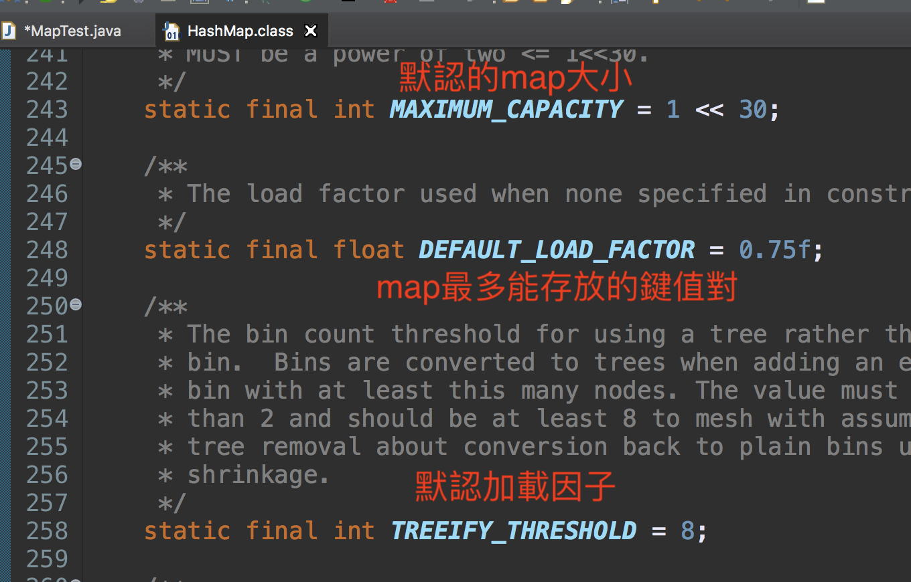
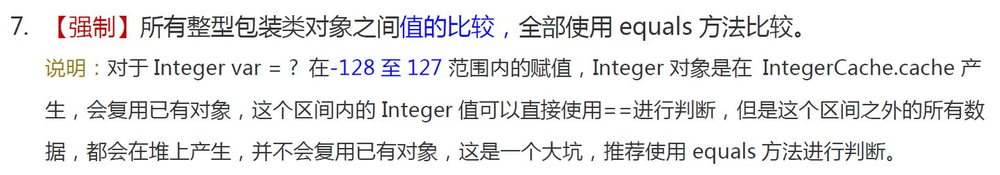

# 多線程進階==>JUC並發編程

## 1.什麼是JUC(java.util concurrent)


java.util工具包中的分類

**業務: 普通的線程代碼, 之前都是用的thread或者runnable接口**

但是相比於callable來說,thread沒有返回值,且效率沒有callable高


## 2. 線程和進程

> 線程,進程

**進程 :** 一個運行中的程序的集合; 一個進程(process)往往可以包含多個線程,至少包含一個線程

java默認有幾個線程? 兩個 main線程 gc線程

**線程 :** 線程（thread）是操作系統能夠進行運算調度的最小單位。

對於java而言如何創建thread: 繼承自thread,實現runnable接口,實現callable接口

**Java真的可以開啟線程嗎?** 開不了的,底層是用native關鍵詞修飾.調用本地實現

```java
 public synchronized void start() {
        /**
         * This method is not invoked for the main method thread or "system"
         * group threads created/set up by the VM. Any new functionality added
         * to this method in the future may have to also be added to the VM.
         *
         * A zero status value corresponds to state "NEW".
         */
        if (threadStatus != 0)
            throw new IllegalThreadStateException();

        /* Notify the group that this thread is about to be started
         * so that it can be added to the group's list of threads
         * and the group's unstarted count can be decremented. */
        group.add(this);

        boolean started = false;
        try {
            start0();
            started = true;
        } finally {
            try {
                if (!started) {
                    group.threadStartFailed(this);
                }
            } catch (Throwable ignore) {
                /* do nothing. If start0 threw a Throwable then
                  it will be passed up the call stack */
            }
        }
    }
//本地方法,調用底層c++, java無法操作硬件
    private native void start0();
```


> 並發編程: 並發和並行

並發編程: 並發和並行

並發（concurrent）與並行（parallel）

並發(多線程操作同一個資源,交替執行)

- CPU一核, 模擬出來多條線程,天下武功,唯快不破,快速交替

並行(多個人一起行走, 同時進行)

- CPU多核,多個線程同時進行 ; 使用線程池操作

```java
public static void main(String[] args) {
  //獲取CPU核數
  //CPU 密集型,IO密集型
  System.out.println(Runtime.getRuntime().availableProcessors());
}
```

並發編程的本質: **充分利用CPU的資源**

所有的公司都很看重!


> 線程有幾個狀態?

```java
Thread.State
public enum State {
       // 新生
        NEW,

        // 運行
        RUNNABLE,

        // 阻塞
        BLOCKED,

        // 等待 utill dead
        WAITING,

        //超時等待,wait for a time interval,when time up,no more waiting
        TIMED_WAITING,

        //終止
        TERMINATED;
    }
```


> wait/sleep的區

1. **來自不同的類**

    wait來自object類, sleep來自線程類(java.util.concurrent.TimeUnit)

2. **關於鎖的釋放**

    wait會釋放鎖

    sleep抱著鎖睡覺，不會釋放鎖

3. **使用的範圍不同**

    wait必須在同步代碼塊中

    sleep可以在任何地方睡

4. **是否需要捕獲異常**

    wait不需要捕獲異常

    sleep需要捕獲異常

## 3.Lock鎖(重點)

> 傳統synchronized

本質: 隊列和鎖,放在方法上鎖的是this,放在代碼塊中鎖的是()裡面的對象

```java
package com.can;
//基本的賣票例子
import java.util.concurrent.locks.ReentrantLock;

/**
 * 真正的多線程開發，公司中的開發，降低耦合性
 * 線程就是一個單獨的資源類，沒有任何附屬的操作
 * 只會有屬性、方法
 */
public class SaleTicket {
    public static void main(String[] args) {
        //並發，多線程操作同一資源類,把資源類丟入線程
        Ticket ticket = new Ticket();
        new Thread(()->{
          for(int i=0; i<40; i++)
            ticket.sale();
        }, "a").start();

        new Thread(()->{
          for(int i=0; i<40; i++)
            ticket.sale();
        }, "b").start();

        new Thread(()->{
          for(int i=0; i<40; i++)
            ticket.sale();
        }, "c").start();

    }
}

//資源類 OOP
class Ticket{
    //屬性、方法
    private int number=50;

    //賣票的方式
    // synchronized 本質：隊列，鎖
  //synchronized同步方法，默認鎖的值是 this.
    public synchronized void sale(){
    //synchronized同步塊：可以鎖任何對象，
//鎖的對象就是變化的量，需要增刪改的對象 or 類名.class
//synchronized(this){}
        if(number>0){
          System.out.println(Thread.currentThread().getName()+"賣出了第"+(number--)+"張票,剩餘"+number);
        }
    }
}
```


> Lock 接口


**Lock 接口**


Lock的**實現類**


#### ReentrantLock 實現原理

[ReentrantLock 實現原理](https://github.com/crossoverJie/JCSprout/blob/master/MD/ReentrantLock.md)

- 使用 synchronized 來做同步處理時，鎖的獲取和釋放都是隱式的，實現的原理是通過編譯後加上不同的機器指令來實現。
-  而 ReentrantLock 就是一個普通的類，它是基於 AQS(AbstractQueuedSynchronizer)來實現的。 是一個`重入鎖：一個線程獲得了鎖之後仍然可以反复的加鎖，不會出現自己阻塞自己的情況。 `
- AQS 是 Java 並發包裡實現鎖、同步的一個重要的基礎框架。

> reentrantLock構造器

```java
public ReentrantLock() {
  sync = new NonfairSync(); //無參默認非公平鎖
}
public ReentrantLock(boolean fair) {
  sync = fair ? new FairSync() : new NonfairSync();//傳參為true為公平鎖
}
```


**公平鎖: 十分公平: 可以先來後到,一定要排隊**

**非公平鎖: 十分不公平,可以插隊(默認)**


```java
package com.wong.JUC;

import java.util.concurrent.locks.Lock;
import java.util.concurrent.locks.ReentrantLock;
/**
 * 真正的多線程開發，公司中的開發，降低耦合性
 * 線程就是一個單獨的資源類，沒有任何附屬的操作
 * 1.屬性、方法
 */
public class SaleTicketLock {
  public static void main(String[] args) {
    //並發，多線程操作同一資源類,把資源類丟入線程
    Ticket2 ticket = new Ticket2();
    new Thread(()->{
      for(int i=0; i<40; i++)
        ticket.sale();
    }, "a").start();

    new Thread(()->{
      for(int i=0; i<40; i++)
        ticket.sale();
    }, "b").start();

    new Thread(()->{
      for(int i=0; i<40; i++)
        ticket.sale();
    }, "c").start();

  }
}

//資源類 OOP
//lock三部曲
//1.new ReentrantLock();
//2.lock.lock();加鎖
//3.finally=>lock.unlock();解鎖
class Ticket2{
  private int ticketNum = 30;
  Lock lock = new ReentrantLock();
  public void sale() {
    lock.lock();
    //lock.tryLock();//嘗試獲取鎖
    try {
      if(ticketNum>0) {
        System.out.println(Thread.currentThread().getName() + "賣出了" +(ticketNum--) + "票，剩餘" + ticketNum);
      }
    } catch (Exception e) {
      // TODO: handle exception
    }finally {
      lock.unlock();
    }
  }
}
```


> synchronized和lock鎖的區別

1. synchronized內置的java關鍵字,Lock是一個java類
2. synchronized無法判斷獲取鎖的狀態, Lock可以判斷是否獲取到了鎖
3. synchronized會自動釋放鎖,Lock必須要手動釋放鎖!如果不是釋放鎖,會產生死鎖
4. synchronized 線程1(獲得鎖,阻塞),線程2(等待); Lock鎖就不一定會等待下去(lock.tryLock();//嘗試獲取鎖)
5. synchronized 可重入鎖,不可以中斷的,非公平的; Lock鎖,可重入的,可以判斷鎖,非公平(可自己設置);
6. synchronized 適合鎖少量的代碼同步問題,Lock 適合鎖大量的同步代碼

***只要是併發編程，一定要有鎖才安全***

>鎖是什麼,如何判斷鎖的是誰!


## 4. 生產者和消費者問題

面試高頻: 單例模式, 八大排序,生產者消費者,死鎖

生產者和消費者問題Synchronized 版：實現 wait notify

生產者和消費者問題Juc版： lock

### Synchronized 版 : 實現 wait notify

> 生產者和消費者問題Synchronized 版：實現 wait notify

```java
package com.wong.JUC;

//線程之間的通信問題：生產者和消費者問題！等待喚醒，通知喚醒
//線程交替執行 A線程，B線程操作同一個變量， num=0
//A num+1
//B num-1
public class PC_Synchronized {
  public static void main(String[] args) {
    Data data = new Data();

    new Thread(()->{
      for(int i=0; i<10; i++) {
        try {
          data.increment();
        } catch (InterruptedException e) {
          e.printStackTrace();
        }
      }
    }, "a").start();

    new Thread(()->{
      for(int i=0; i<10; i++) {
        try {
          data.decrement();
        } catch (InterruptedException e) {
          e.printStackTrace();
        }
      }
    }, "b").start();
  }
}

//判斷是否需要 等待，業務，通知
//數字，資源類
class Data{
  private int number = 0;
  //+1
  public synchronized void increment() throws InterruptedException {
    //判斷是否需要等待
    if(number!=0){
      //等待
      this.wait();
    }
    number++;
    System.out.println(Thread.currentThread().getName()+"==>"+number);
    //通知其他線程，我+1完畢了
    this.notifyAll();
  }
  //-1
  public synchronized void decrement() throws InterruptedException {
    //判斷是否需要等待
    if(number==0){
      //等待
      this.wait();
    }
    number--;
    System.out.println(Thread.currentThread().getName()+"==>"+number);
    //通知其他線程，我-1完畢了
    this.notifyAll();
  }
}
```

**問題存在：A(加), B(減), C(加), D(減)或者兩個以上的線程(兩個加減操作)就會存在問題！虛假喚醒**

> 問題存在,ABCD4個線程是否安全, 不安全 會有虛假喚醒


if判斷改為while判斷

因為if只會執行一次，執行完會接著向下執行if（）外邊的

***而while不會，直到條件滿足才會向下執行while（）外邊的***

```java
package com.wong.JUC;

//線程之間的通信問題：生產者和消費者問題！等待喚醒，通知喚醒
//線程交替執行 A線程，B線程操作同一個變量， num=0
//A num+1
//B num-1
public class PC_Synchronized {
  public static void main(String[] args) {
    Data data = new Data();

    new Thread(()->{
      for(int i=0; i<10; i++) {
        try {
          data.increment();
        } catch (InterruptedException e) {
          e.printStackTrace();
        }
      }
    }, "a").start();

    new Thread(()->{
      for(int i=0; i<10; i++) {
        try {
          data.decrement();
        } catch (InterruptedException e) {
          e.printStackTrace();
        }
      }
    }, "b").start();

    //**問題存在：A,B,C,D或者兩個以上的線程就會存在問題！虛假喚醒**
    /*
if判斷改為while判斷
因為if只會執行一次，執行完會接著向下執行if（）外邊的
***而while不會，直到條件滿足才會向下執行while（）外邊的***
*/
    new Thread(()->{
      for(int i=0; i<10; i++) {
        try {
          data.increment();
        } catch (InterruptedException e) {
          e.printStackTrace();
        }
      }
    }, "c").start();

    new Thread(()->{
      for(int i=0; i<10; i++) {
        try {
          data.decrement();
        } catch (InterruptedException e) {
          e.printStackTrace();
        }
      }
    }, "d").start();
  }
}

//判斷是否需要等待，業務，通知
//數字，資源類
class Data{
  private int number = 0;
  //+1
  public synchronized void increment() throws InterruptedException {
    //判斷是否需要等待
    while(number!=0){
      //等待
      this.wait();
    }
    number++;
    System.out.println(Thread.currentThread().getName()+"==>"+number);
    //通知其他線程，我+1完畢了
    this.notifyAll();
  }
  //-1
  public synchronized void decrement() throws InterruptedException {
    //判斷是否需要等待
    while(number==0){
      //等待
      this.wait();
    }
    number--;
    System.out.println(Thread.currentThread().getName()+"==>"+number);
    //通知其他線程，我-1完畢了
    this.notifyAll();
  }
}
```

### JUC (lock) 版： 實現 await signal

> 生產者和消費者問題JUC (lock) 版： 實現 await signal


通过Lock找到Condition


```java
package com.wong.JUC;

import java.util.concurrent.locks.Condition;
import java.util.concurrent.locks.Lock;
import java.util.concurrent.locks.ReentrantLock;

public class PC_JUC {
  public static void main(String[] args) {
    Data2 data = new Data2();

    new Thread(()->{
      for(int i=0; i<10; i++) {
        try {
          data.increment();
        } catch (InterruptedException e) {
          e.printStackTrace();
        }
      }
    }, "a").start();

    new Thread(()->{
      for(int i=0; i<10; i++) {
        try {
          data.decrement();
        } catch (InterruptedException e) {
          e.printStackTrace();
        }
      }
    }, "b").start();

    //**問題存在：A,B,C,D或者兩個以上的線程就會存在問題！虛假喚醒**
    /*
    if判斷改為while判斷
    因為if只會執行一次，執行完會接著向下執行if（）外邊的
    ***而while不會，直到條件滿足才會向下執行while（）外邊的***
    */
    new Thread(()->{
      for(int i=0; i<10; i++) {
        try {
          data.increment();
        } catch (InterruptedException e) {
          e.printStackTrace();
        }
      }
    }, "c").start();

    new Thread(()->{
      for(int i=0; i<10; i++) {
        try {
          data.decrement();
        } catch (InterruptedException e) {
          e.printStackTrace();
        }
      }
    }, "d").start();
  }
}

//判斷是否需要等待，業務，通知
//數字，資源類
class Data2{
  private int number = 0;

  Lock lock = new ReentrantLock();
  Condition condition = lock.newCondition();
  //condition.await();//等待
  //condition.signalAll();//喚醒全部

  //+1
  public void increment() throws InterruptedException {
    lock.lock();
    try {
      //業務代碼
      //判斷是否需要等待
      while(number!=0){
        //等待
        condition.await();//
      }
      number++;
      System.out.println(Thread.currentThread().getName()+"==>"+number);
      //通知其他線程，我+1完畢了
      condition.signalAll();
    } catch (Exception e) {
      e.printStackTrace();
    }finally {
      lock.unlock();
    }
  }
  //-1
  public void decrement() throws InterruptedException {
    lock.lock();
    try {
      //業務代碼
      //判斷是否需要等待
      while(number==0){
        //等待
        condition.await();//
      }
      number--;
      System.out.println(Thread.currentThread().getName()+"==>"+number);
      //通知其他線程，我-1完畢了
      condition.signalAll();
    } catch (Exception e) {
      e.printStackTrace();
    }finally {
      lock.unlock();
    }
  }
}
```

### JUC (lock) 版： Condition實現精準的通知喚醒

**任何一個新的技術,絕對不是僅僅覆蓋了原來的技術,一定有優勢和補充**

**可以通過Condition精準的通知和喚醒線程，實現有序的喚醒**

> Condition實現精準的通知喚醒

Problem: random AB AB AB CB AB AD

What we want is : AB CD AB CD AB CD


`Lock`替換`synchronized`方法和語句的使用， `Condition`取代了對象監視器方法的使用

一個`Condition`實例本質上綁定到一個鎖。要獲得特定`Condition`實例的Condition實例，請使用其`newCondition()`方法。

```java
package com.wong.JUC;

import java.util.concurrent.locks.Condition;
import java.util.concurrent.locks.Lock;
import java.util.concurrent.locks.ReentrantLock;
//生產線：下單->支付->交易->物流
//A執行完，調用B，B執行完，調用C，C執行完，調用A
public class PC_JUC_ConditionalControl {
public static void main(String[] args) {
        Date3 data3 = new Date3();

        new Thread(()->{
            for (int i = 0; i < 10; i++) {
                data3.printA();
            }
        },"A").start();
        new Thread(()->{
            for (int i = 0; i < 10; i++) {
                data3.printB();
            }
        },"B").start();
        new Thread(()->{
            for (int i = 0; i < 10; i++) {
                data3.printC();
            }
        },"C").start();
    }
}
//資源類
//Lock鎖
class Date3{
  private Lock lock = new ReentrantLock();
  private Condition condition1 = lock.newCondition();
  private Condition condition2 = lock.newCondition();
  private Condition condition3 = lock.newCondition();
  private int number = 1; //假設number為1讓A執行，number為2讓B執行，number為3讓C執行

  public void printA() {
    lock.lock();
    try {
      //業務代碼
      //業務，判斷->執行->通知
      while (number!=1){
        //等待
        condition1.await();
      }
      //number==1, outprint
      System.out.println(Thread.currentThread().getName()+"==>AAA");
      number = 2;
      condition2.signal();//喚醒,喚醒指定的人,B
    } catch (Exception e) {
      e.printStackTrace();
    }finally {
      lock.unlock();
    }
  }
  public void printB() {
    lock.lock();
    try {
      //業務代碼
      //業務，判斷->執行->通知
      while(number!=2) {
        condition2.await();
      }
      System.out.println(Thread.currentThread().getName()+"==>BBB");
      number=3;
      condition3.signal();//喚醒指定的人，C
    } catch (Exception e) {
      e.printStackTrace();
    }finally {
      lock.unlock();
    }
  }
  public void printC() {
    lock.lock();
    try {
      //業務代碼
      //業務，判斷->執行->通知
      while(number!=3) {
        condition3.await();
      }
      System.out.println(Thread.currentThread().getName()+"==>CCC");
      number=1;
      condition1.signal();//喚醒指定的人，A
    } catch (Exception e) {
      e.printStackTrace();
    }finally {
      lock.unlock();
    }
  }
}
```

## 5. 8鎖現象

**如何判斷鎖的是誰？ **

> 深刻理解鎖

鎖只會鎖兩個東西，一個是new出來的對象，第二個對像是由一個class模板new出來的對象、class

### synchronized鎖的對像是方法的調用者

> synchronized鎖的對像是方法的調用者

```java
package com.wong.JUC;

import java.util.concurrent.TimeUnit;

//8鎖，就是關於鎖的8個問題
//1.標準情況下，兩個線程 先打印 發短信還是 打電話？ 1/發短信 2/打電話
//2.sendSms()方法延遲4秒，兩個線程 先打印 發短信還是 打電話？ 1/發短信 2/打電話
// because synchronized 鎖的對像是方法的調用者！兩個Thread方法用的是同一個鎖(new Phone())，誰先拿到誰執行！
public class Lock_8_Problem {
  public static void main(String[] args) {
    Phone phone = new Phone();
    //phone是先調用的，這個回答是錯誤的。
    //是因為，鎖的存在
    new Thread(()->{phone.sendSms();},"A").start();
    //JUC休息
    try {
      TimeUnit.SECONDS.sleep(1);
    } catch (InterruptedException e) {
      // TODO Auto-generated catch block
      e.printStackTrace();
    }

    new Thread(()->{phone.call();},"B").start();
  }
}
//資源類
class Phone{
  //synchronized 鎖的對像是方法的調用者！
  //兩個方法用的是同一個鎖，誰先拿到誰執行！
  public synchronized void sendSms() {
    try {
      TimeUnit.SECONDS.sleep(1);
    } catch (InterruptedException e) {
      // TODO Auto-generated catch block
      e.printStackTrace();
    }
    System.out.println("send message");
  }
  public synchronized void call() {
    System.out.println("call");
  }
}
```

### 兩個不同的對像兩個調用者兩把鎖

> 兩個不同的對像兩個調用者兩把鎖

```java
package com.wong.JUC;

import java.util.concurrent.TimeUnit;
//3、增加了一個普通方法hello() ，是先執行 發短信 還是hello？
//==> 1/hello 2/發短信 ==> 因為普通方法沒有鎖，不受鎖的影響
//4、兩個對象，兩個同步方法，發短信還是 打電話？
//==> 1/打電話 2/發短信 ==> 鎖的是對象調用者，每個對像都有一把鎖，這裡是兩個不同的對象，沒有延遲先行
public class Lock_8_Problem2 {
  public static void main(String[] args) {
    //兩個對象，兩個調用者，兩個不同的對象，兩把鎖
    Phone2 phone1 = new Phone2();
    Phone2 phone2 = new Phone2();

    new Thread(()->{phone1.sendSms();},"A").start();
    //JUC休息
    try {
      TimeUnit.SECONDS.sleep(1);
    } catch (InterruptedException e) {
      // TODO Auto-generated catch block
      e.printStackTrace();
    }

    new Thread(()->{phone2.call();},"B").start();
  }
}
//資源類
class Phone2{
  //synchronized 鎖的對像是方法的調用者！
  //兩個方法用的是同一個鎖，誰先拿到誰執行！
  public synchronized void sendSms() {
    try {
      TimeUnit.SECONDS.sleep(4);
    } catch (InterruptedException e) {
      // TODO Auto-generated catch block
      e.printStackTrace();
    }
    System.out.println("send message");
  }
  public synchronized void call() {
    System.out.println("call");
  }
  //這裡沒有鎖！不是同步方法，不受鎖的影響
  //普通方法沒有鎖(synchronized)，不受鎖的影響
  public void hello() {
    System.out.println("say hello");
  }
}
```

### static鎖的是class

> static鎖的是class

```java
package com.wong.JUC;
import java.util.concurrent.TimeUnit;

//5.增加兩個靜態的同步方法，static 靜態方法鎖的是Class模板，全局唯一==只有一個對象==只有一把鎖，發短信還是 打電話？ 1/發短信 2/打電話
//6.兩個對象！增加兩個靜態的同步方法，static 靜態方法鎖的是Class模板，全局唯一==只有一個對象==只有一把鎖，發短信還是 打電話？ 1/發短信 2/打電
public class Lock_8_Problem3 {
  public static void main(String[] args) {
    //兩個對象的Class類模板只有一個，static，鎖的是class
    Phone3 phone1 = new Phone3();
    Phone3 phone2 = new Phone3();

    new Thread(()->{phone1.sendSms();},"A").start();
    //JUC休息
    try {
      TimeUnit.SECONDS.sleep(1);
    } catch (InterruptedException e) {
      // TODO Auto-generated catch block
      e.printStackTrace();
    }

    new Thread(()->{phone2.call();},"B").start();
  }
}
//資源類
//Phone3唯一的一個 class對象
class Phone3{
  //synchronized 鎖的對像是方法的調用者！
  //static 靜態方法
  //類一加載就有了！鎖的是Class模板==Phone4.Class
  public static synchronized void sendSms() {
    try {
      TimeUnit.SECONDS.sleep(4);
    } catch (InterruptedException e) {
      // TODO Auto-generated catch block
      e.printStackTrace();
    }
    System.out.println("send message");
  }
  public static synchronized void call() {
    System.out.println("call");
  }
}
```

### 靜態同步方法和普通同步方法

> 靜態同步方法和普通同步方法

```java
package com.wong.JUC;

import java.util.concurrent.TimeUnit;

//7、1個靜態的同步方法，1個普通的同步方法，一個對象， 先發短信 還是打電話？ 1/打電話 2/發短信
		// because 靜態同步方法和普通同步方法鎖的試不同對象==兩把不同的鎖，不用等待對方釋放鎖 -->沒有延遲的先行
//8、1個靜態的同步方法，1個普通的同步方法，兩個對象， 先發短信 還是打電話？ 1/打電話 2/發短信
		// because 靜態同步方法和普通同步方法鎖的試不同對象==兩把不同的鎖，不用等待對方釋放鎖 -->沒有延遲的先行
public class Lock_8_Problem4 {
  public static void main(String[] args) {
    
    Phone4 phone1 = new Phone4();
    Phone4 phone2 = new Phone4();

    new Thread(()->{phone1.sendSms();},"A").start();
    //JUC休息
    try {
      TimeUnit.SECONDS.sleep(1);
    } catch (InterruptedException e) {
      // TODO Auto-generated catch block
      e.printStackTrace();
    }

    new Thread(()->{phone2.call();},"B").start();
  }
}
//資源類
//Phone3唯一的一個 class對象
class Phone4{
  //synchronized 鎖的對像是方法的調用者！
  //static 靜態方法
  //類一加載就有了！鎖的是Class模板

  //靜態的同步方法，鎖的是 Class類 模板==Phone4.Class
  public static synchronized void sendSms() {
    try {
      TimeUnit.SECONDS.sleep(4);
    } catch (InterruptedException e) {
      // TODO Auto-generated catch block
      e.printStackTrace();
    }
    System.out.println("send message");
  }

  //普通的同步方法,鎖的調用者==this(new Phone4())
  public synchronized void call() {
    System.out.println("call");
  }
}
```

### 小結

> 小結

- new：this具體的一個手機

- static：Class唯一的一個模板

  

## **7、集合類不安全**

> Learning method

1.先會用

2.貨比三家，尋找其他 Solution

3.分析源碼

### List不安全

> List不安全

只要再多線程下使用List類，會報錯 ==> java.util.ConcurrentModificationException 並發修改異常

```java
package com.wong.JUC.unsafeCollection;

import java.util.List;
import java.util.UUID;
import java.util.concurrent.CopyOnWriteArrayList;

//java.util.ConcurrentModificationException 並發修改異常
public class ListTest {
  public static void main(String[] args) {
    //並發下ArrayList是不安全的
    /**
         * 解決方案
         * 1、List<String> list = new Vector<>(); 源碼有synchronized解決的
         * 2、List<String> list = Collections.synchronizedList(new ArrayList<>()); Collections工具類解決
         * 3、List<String> list = new CopyOnWriteArrayList(); transient volatile關鍵字
         */
    //List<String> list = new Vector<>();
    //List<String> list = Collections.synchronizedList(new ArrayList<>());

    //CopyOnWrite寫入時復制 COW 計算機程序設計領域的一種優化策略;
    //多個線程調用的時候，list，讀取的時候，固定的，寫入的(覆蓋)
    //寫入時先複製一個數組出來，寫完再插回去，保證數據安全
    //在寫入的時候避免覆蓋，造成數據問題！
    //讀寫分離 MyCat
    //CopyOnWriteArrayList 比 Vector 好在哪裡？ ==> 前者是lock鎖，後則是 synchronized（效率較低）鎖

    List<String> list = new CopyOnWriteArrayList();
    //List<String> list = new ArrayList<String>();

    for(int i=0; i<=10; i++) {
      new Thread(()->{
        list.add(UUID.randomUUID().toString().substring(0, 5));
        System.out.println(list);
      }, String.valueOf(i)).start();
    }
  }
}
```

CopyOnWriteArrayList : use lock鎖, (寫入時先複製一個數組出來，寫完再插回去，保證數據安全)讀寫分離


### Set不安全

> Set不安全


```java
package com.wong.JUC.unsafeCollection;

import java.util.Set;
import java.util.UUID;
import java.util.concurrent.CopyOnWriteArraySet;
/**
 * 同理可證：java.util.ConcurrentModificationException
 * 解決方案
 * 1、Set<String> set = Collections.synchronizedSet(new HashSet<>()); 工具類寫法
 * 2、Set<String> set = new CopyOnWriteArraySet(); 寫入時復制 lock鎖
 */
public class SetTest {
  public static void main(String[] args) {
    //Set<String> set = new HashSet<String>(); ==> java.util.ConcurrentModificationException
    //如何解決hashSet線程安全問題
    //1. Set<String> set = Collections.synchronizedSet(new HashSet<>());
    //2. Set<String> set = new CopyOnWriteArraySet<>();
    Set<String> set = new CopyOnWriteArraySet<>();
    for(int i=0; i<=20; i++) {
      new Thread(()->{
        set.add(UUID.randomUUID().toString().substring(0, 5));
        System.out.println(set);
      },String.valueOf(i)).start();
    }
  }
}
```


### hashSet底層是什麼? hashMap

> hashSet底層是什麼? hashMap

```java
public HashSet() {
    map = new HashMap<>();
}

// add 的本質就是 map 的 key ,map 的 key是無法重複的
public boolean add(E e) {
    return map.put(e, PRESENT)==null;
}
private static final Object PRESENT = new Object();//這是一個不變的值

```


### Map 不安全

> Map 不安全

map的基本操作



```java
package com.wong.JUC.unsafeCollection;

import java.util.Map;
import java.util.UUID;
import java.util.concurrent.ConcurrentHashMap;
/*
 Map<String, String> map = new HashMap<>();
 ==> java.util.ConcurrentModificationException
 解決並發問題:
 1.Map<String,Object> map = Collections.synchronizedMap(new HashMap<>());
 2.Map<String, String> map = new ConcurrentHashMap<>();
*/
public class MapTest {
  public static void main(String[] args) {
    //map 是這樣用的嗎? 不是，工作中不用HashMap
    //默認等價於什麼？ new HashMap<>(16,0.75);
    //加載因子、初始化容量
    //Map<String,Object> map = new HashMap<>(16,0.75f);

    Map<String, String> map = new ConcurrentHashMap<>();
    for(int i=0; i<=30; i++) {
      new Thread(()->{
        map.put(Thread.currentThread().getName(), UUID.randomUUID().toString().substring(0, 5));
        System.out.println(map);
      }, String.valueOf(i)).start();
    }
  }
}
```

## 8、Callable


1. 可以有返回值
2. 可以拋出異常
3. 方法不同，run()/call()

> **Thread怎麼執行Callable**


```java
//泛型的參數等於方法返回值類型
class MyThread implements Callable<String>{
  @Override
  public String call() throws Exception {
    System.out.println("call()");
    return "10458577717";
  }
}
```


FutureTask.class


```java
package com.wong.JUC.Callable;

import java.util.concurrent.Callable;
import java.util.concurrent.ExecutionException;
import java.util.concurrent.FutureTask;

public class CallableTest {
  public static void main(String[] args) throws InterruptedException, ExecutionException {
    //new Thread(new MyThread()).start();

    //Thread怎麼啟動Callable
    // new Thread(new Runnable()).start();
    // new Thread(new FutureTask<V>()).start();
    // new Thread(new FutureTask<V>(Callable)).start();
    new Thread().start();

    MyThread myThread = new MyThread();
    FutureTask<String> futureTask = new FutureTask<>(myThread);//適配類
    new Thread(futureTask,"A").start(); //Thread調用Callable
    new Thread(futureTask,"B").start(); //結果會被緩存，效率高 ---> execute one time only
    
    //這個get方法可能會產生阻塞
    //解決方案：1. 放到最後 2. 使用異步通信來處理
    String o = (String) futureTask.get();//獲取Callable的返回值
    System.out.println(o);
  }
}
//泛型的參數等於方法返回值類型
class MyThread implements Callable<String>{
  @Override
  public String call() throws Exception {
    System.out.println("call()");
    return "10458577717";
  }
}
-------------console----------------
call()
10458577717
```

細節：

1. 有緩存
2. 結果可能需要等待，會阻塞！

Runnable和Callable的區別是，

1. Callable規定的方法是call(),Runnable規定的方法是run().
2. Callable在執行後可返回值，而Runnable在執行後不能返回值
3. call方法可以拋出異常，run方法不可以
4. 執行Callable會返回Future物件，表示非同步計算的結果。它提供了檢查計算是否完成的方法，以等待計算的完成，並檢索計算的結果。通過Future物件可以瞭解執行情況，可取消執行，還可獲取執行結果。

## 8. 常用的輔助類(important)

### 8.1 CountDownLatch 減法計數器


```java
package com.wong.JUC.Often_Use_Class;

import java.util.concurrent.CountDownLatch;

//計數器
public class CountDownLatchDemo {
  public static void main(String[] args) throws InterruptedException {
    // 倒計時總數是6, 必須要執行任務的時候,再使用!
    CountDownLatch countDownLatch = new CountDownLatch(6);

    for(int i=1; i<=6; i++) {
      new Thread(()->{
System.out.println(Thread.currentThread().getName()+" go out");
        countDownLatch.countDown(); //數量減1
      }, String.valueOf(i)).start();
    }
    countDownLatch.await();// 等待計數器歸零,然後再向下執行
    System.out.println(" close door ");
  }
}
```

**原理:**

`countDownLatch.countDown(); ` //數量減1

`countDownLatch.await();` // 等待計數器歸零,然後再向下執行

每次有線程調用countDown()數量-1,假設計數器變為0,countDownLatch.await();就會被喚醒,繼續執行


### 8.2 cyclicBarrier 加法計數器


```java
package com.wong.JUC.Often_Use_Class;

import java.util.concurrent.BrokenBarrierException;
import java.util.concurrent.CyclicBarrier;
/**
 * 集齊77個龍珠召喚神龍
 */
// 召喚龍珠的線程
public class CyclicBarrierDemo {
  public static void main(String[] args) {
    CyclicBarrier cyclicBarrier = new CyclicBarrier(7, ()->{
      System.out.println("召喚神龍成功!");
    });
    for(int i=1; i<=7; i++) {
      //通過 final 變量, 讓 new Thread 拿到 i 值(new Thread only can get final value)
      final int temp = i;
      new Thread(()->{
        System.out.println(Thread.currentThread().getName()+"收集" + temp + "個龍珠");
        try {
          cyclicBarrier.await();
        } catch (InterruptedException e) {
          // TODO Auto-generated catch block
          e.printStackTrace();
        } catch (BrokenBarrierException e) {
          // TODO Auto-generated catch block
          e.printStackTrace();
        }
      }).start();
    }
  }
}
```


### 8.3 Semaphore

Semaphore:信號量

假設搶車位！

6車—3個停車位置


```java
import java.util.concurrent.Semaphore;
import java.util.concurrent.TimeUnit;


public class SemaphoreDemo {
  public static void main(String[] args) {
    //線程數量：停車位！限流！
    Semaphore semaphore = new Semaphore(3);

    for(int i=1; i<=6; i++) {
      new Thread(()->{
        //acquire()都會阻塞
        try {
          semaphore.acquire();// 得到
          System.out.println(Thread.currentThread().getName()+"搶到車位");
          TimeUnit.MICROSECONDS.sleep(2);
          System.out.println(Thread.currentThread().getName()+"離開車位");
        } catch (InterruptedException e) {
          // TODO Auto-generated catch block
          e.printStackTrace();
        }finally {
          semaphore.release(); //release() 釋放
        }
      }, String.valueOf(i)).start();;
    }
  }
}
```

原理：

- `semaphore.acquire();` //獲得 +1，假設如果已經滿了，等待，等待被釋放為止！
- `semaphore.release();` //釋放 -1，會將當前的信號量釋放+1，然後喚醒等待的線程！

作用：

- 多個共享資源互斥的使用！並發限流，控制最大的線程數！

------

## 9.讀寫鎖ReadWriteLock


```java
package com.wong.JUC;

import java.util.HashMap;
import java.util.Map;
import java.util.concurrent.locks.ReadWriteLock;
import java.util.concurrent.locks.ReentrantReadWriteLock;

/**
 * 讀寫鎖: 更加細粒度的控制
 * 獨占鎖(寫鎖) 一次只能由一個線程佔有
 * 共享鎖(讀鎖) 一次可以有多個線程佔有
 * readWriteLock
 * 讀-讀 可以共存
 * 讀-寫 不能共存
 * 寫-寫 不能共存
 */
public class ReadWriteLockDemo {
  public static void main(String[] args) {
    MyCacheLock myCache = new MyCacheLock();

    for(int i=1; i<=5; i++) {
      final int temp = i;
      new Thread(()->{
        myCache.put(temp+"", temp+"");
      }, String.valueOf(i)).start();
    }

    for(int i=1; i<=5; i++) {
      final int temp = i;
      new Thread(()->{
        myCache.get(temp+"");
      }, String.valueOf(i)).start();
    }
  }
}
/**
 * 自定義緩存
 * 加鎖的
 */
class MyCacheLock{
  private volatile Map<String, Object> map = new HashMap<String, Object>();
  // private Lock lock = new ReentrantLock();
  //讀寫鎖: 更加細粒度的控制
  private ReadWriteLock readWriteLock = new ReentrantReadWriteLock();

  //存，寫入的時候，只希望同時只有一個線程寫
  public void put(String key, Object value) {
    // lock.lock();
    readWriteLock.writeLock().lock();

    try {
      //業務代碼
      System.out.println(Thread.currentThread().getName()+ " write in "+key);
      map.put(key, value);
      System.out.println(Thread.currentThread().getName()+ " sucessfully write in ");
    } catch (Exception e) {
      e.printStackTrace();
    }finally {
      readWriteLock.writeLock().unlock();
    }

  }
  //取，讀，所有人都可以同時讀！
  public void get(String key) {
    readWriteLock.readLock().lock();

    try {
      //業務代碼
      System.out.println(Thread.currentThread().getName()+ " read "+key);
      Object o = map.get(key);
      System.out.println(Thread.currentThread().getName()+ " sucessfully readed ");
    } catch (Exception e) {
      e.printStackTrace();
    }finally {
      readWriteLock.readLock().unlock();
    }
  }
}

class MyCache{
  private volatile Map<String, Object> map = new HashMap<String, Object>();
  //存，寫
  public void put(String key, Object value) {
    System.out.println(Thread.currentThread().getName()+ " write in "+key);
    map.put(key, value);
    System.out.println(Thread.currentThread().getName()+ " sucessfully write in ");
  }
  //取，讀
  public void get(String key) {
    System.out.println(Thread.currentThread().getName()+ " read "+key);
    Object o = map.get(key);
    System.out.println(Thread.currentThread().getName()+ " sucessfully readed ");

  }
}
```

## **11、阻塞隊列**

> FIFO：先進先出

阻塞發生的兩個情形

寫入：如果隊列滿了，就必須阻塞等待

取：如果隊列是空的，必須阻塞等待生產

> 阻塞隊列：BlockingQueue

***什麼情況下我們會使用阻塞隊列,多線程並發處理,線程池!***


**學會使用隊列** 

添加,移除

### ArrayBlockingQueue 四组 API

| 方式         | 拋出異常  | 不會拋出異常,有返回值 | 阻塞等待         | 超時等待                       |
| ------------ | --------- | --------------------- | ---------------- | ------------------------------ |
| 添加操作     | add()     | offer() 供應          | put() 沒有返回值 | offer(obj,int,timeunit.status) |
| 移除操作     | remove()  | poll() 獲得           | take()           | poll(int,timeunit.status)      |
| 判斷隊列首部 | element() | peek() 偷看,偷窺      |                  |                                |

> 拋出異常

```java
package com.wong.JUC.BlockingQueue;

import java.util.concurrent.ArrayBlockingQueue;

public class BlockingQueueTest {
  public static void main(String[] args) {
    test1();
  }
  /**
     * 拋出異常
     */
  public static void test1() {
    //隊列的大小
    ArrayBlockingQueue<String> blockingQueue = new ArrayBlockingQueue<>(3);
    System.out.println(blockingQueue.add("a"));//return true or false
    System.out.println(blockingQueue.add("b"));
    System.out.println(blockingQueue.add("c"));
    //java.lang.IllegalStateException: Queue full 拋出異常
    //System.out.println(blockingQueue.add("d"));
    System.out.println(blockingQueue.element()); //查看隊首元素是誰
    System.out.println("============================");

    System.out.println(blockingQueue.remove());
    System.out.println(blockingQueue.remove());
    System.out.println(blockingQueue.remove());
    //java.util.NoSuchElementException拋出異常
    //System.out.println(blockingQueue.remove());
  }
}
```


> 不會拋出異常,有返回值

```java
/**
     * 有返回值沒有異常
     */
public static void test2() {
  ArrayBlockingQueue<String> arrayBlockingQueue = new ArrayBlockingQueue<String>(3);

  System.out.println(arrayBlockingQueue.offer("e"));//return true or false
  System.out.println(arrayBlockingQueue.offer("f"));
  System.out.println(arrayBlockingQueue.offer("g"));
  //System.out.println(arrayBlockingQueue.offer("h")); // offer 不拋出異常, false
  System.out.println(arrayBlockingQueue.peek()); //查看隊首元素是誰
  System.out.println("===================");

  System.out.println(arrayBlockingQueue.poll());
  System.out.println(arrayBlockingQueue.poll());
  System.out.println(arrayBlockingQueue.poll());
  //System.out.println(arrayBlockingQueue.poll()); // poll() 不拋出異常, null
}
```


> 阻塞等待

```java
/**
* 等待，阻塞(一直等待)
* @throws InterruptedException
*/
public static void test3() throws InterruptedException {
  ArrayBlockingQueue<String> arrayBlockingQueue = new ArrayBlockingQueue<String>(3);

  arrayBlockingQueue.put("i");//沒有返回值
  arrayBlockingQueue.put("j");
  arrayBlockingQueue.put("k");
  //arrayBlockingQueue.put("m"); //隊列沒有位置了，它會一直等待

  System.out.println(arrayBlockingQueue.take());
  System.out.println(arrayBlockingQueue.take());
  System.out.println(arrayBlockingQueue.take());
  //System.out.println(arrayBlockingQueue.take()); //沒有這個元素，一直阻塞
}
```


> 超時等待

```java
/**
* 等待，阻塞(等待超時)
* @throws InterruptedException
*/
public static void test4() throws InterruptedException {
  ArrayBlockingQueue<String> arrayBlockingQueue = new ArrayBlockingQueue<String>(3);

  arrayBlockingQueue.offer("n");
  arrayBlockingQueue.offer("o");
  arrayBlockingQueue.offer("p");
  // offer(值,時間,時間單位) ===> 如果前面是滿，那麼久等待2秒，如果還是沒有位置，就超時退出
  arrayBlockingQueue.offer("q", 2, TimeUnit.SECONDS);
  System.out.println("============");
  System.out.println(arrayBlockingQueue.poll());
  System.out.println(arrayBlockingQueue.poll());
  System.out.println(arrayBlockingQueue.poll());
  // poll(時間,時間單位) 等待超過兩秒就退出
  System.out.println(arrayBlockingQueue.poll(2,TimeUnit.SECONDS));
}
```

### **SynchronousQueue 同步隊列**

沒有容量，進去一個元素，必須等待取出來之後，才能再往裡面放一個元素！（只能放一個）

put、take

`SynchronousQueue`是一個內部只能包含一個元素的隊列。插入元素到隊列的線程被阻塞，直到另一個線程從隊列中獲取了隊列中存儲的元素。同樣，如果線程嘗試獲取元素並且當前不存在任何元素，則該線程將被阻塞，直到線程將元素插入隊列。

> **SynchronousQueue 同步隊列**

```java
package com.wong.JUC.BlockingQueue;

import java.util.concurrent.BlockingQueue;
import java.util.concurrent.SynchronousQueue;
import java.util.concurrent.TimeUnit;

/**
 * 同步隊列
 * 和其他的BlockingQueue 不一樣， SynchronousQueue 不存儲元素
 * put了一個元素，必須從裡面先take取出來，否則不能再put進去值！
 * SynchronousQueue是一個內部只能包含一個元素的隊列。
 * 插入元素到隊列的線程被阻塞，直到另一個線程從隊列中獲取了隊列中存儲的元素。
 * 同樣，如果線程嘗試獲取元素並且當前不存在任何元素，則該線程將被阻塞，直到線程將元素插入隊列。
 */
public class SynchronousQueueDemo {
  public static void main(String[] args) {
    BlockingQueue<String> synchronousQueqe = new SynchronousQueue<>();

    new Thread(()->{
      try {
        System.out.println(Thread.currentThread().getName()+" put 1");
        synchronousQueqe.put("1");
        System.out.println(Thread.currentThread().getName()+" put 2");
        synchronousQueqe.put("2");
        System.out.println(Thread.currentThread().getName()+" put 3");
        synchronousQueqe.put("3");
      } catch (InterruptedException e) {
        e.printStackTrace();
      }

    },"Thread 1").start();

    new Thread(()->{
      try {
        TimeUnit.SECONDS.sleep(3);
        System.out.println(Thread.currentThread().getName()+" take "+synchronousQueqe.take());
        TimeUnit.SECONDS.sleep(3);
        System.out.println(Thread.currentThread().getName()+" take "+synchronousQueqe.take());
        TimeUnit.SECONDS.sleep(3);
        System.out.println(Thread.currentThread().getName()+" take "+synchronousQueqe.take());
      } catch (InterruptedException e) {
        e.printStackTrace();
      }

    },"Thread 2").start();
  }
}
-----------------console-----------------------
Thread 1 put 1
Thread 2 take 1
Thread 1 put 2
Thread 2 take 2
Thread 1 put 3
Thread 2 take 3
```

## **12、ThreadPoolExecutor 線程池(重點)**

ThreadPoolExecutor

線程池：**3大方法、7大參數、4種拒絕策略**

> 池化技術

程序的運行,本質: 佔用系統的資源 ! 優化CPU資源的使用 ===>池化技術

線程池, 連接池, 內存池, 對像池///…

池化技術: 實現準備好一些資源, 有人要用,就來我這裡拿,用完之後還給我

### 線程池的好處

> 線程池的好處

1. 降低資源消耗
2. 提高響應速度
3. 方便管理。

***線程復用、可以控制最大並發數、管理線程***

### 三大方法

> **三大方法**


```java
package com.wong.JUC.Pool;

import java.util.concurrent.ExecutorService;
import java.util.concurrent.Executors;

public class ExecutorsDemo01 {
  public static void main(String[] args) {
    //單個線程（最多1個線程執行）
    //ExecutorService threadPool = Executors.newSingleThreadExecutor();
    //創建一個固定的線程池的大小（最多5個線程同時執行）
    //ExecutorService threadPool = Executors.newFixedThreadPool(5);
    //可伸縮的，遇強則強，遇弱則弱
    ExecutorService threadPool = Executors.newCachedThreadPool();

    try {
      for(int i=0; i<100; i++) {
        threadPool.execute(()->{
          System.out.println(Thread.currentThread().getName()+" ok ");
        });
      }
    } catch (Exception e) {
      e.printStackTrace();
    }finally {
      //線程池用完，程序結束，關閉線程池
      threadPool.shutdown();
    }
  }
}
```


### **七大參數**

> **七大參數**

newSingleThreadExecutor構造器

```java
public static ExecutorService newSingleThreadExecutor() {
  return new FinalizableDelegatedExecutorService
    (new ThreadPoolExecutor(1, 1,
                            0L, TimeUnit.MILLISECONDS,
                            new LinkedBlockingQueue<Runnable>()));
}
```

newFixedThreadPool構造器

```java
public static ExecutorService newFixedThreadPool(int nThreads) {
  return new ThreadPoolExecutor(nThreads, nThreads,
                                0L, TimeUnit.MILLISECONDS,
                                new LinkedBlockingQueue<Runnable>());
}
```

newCachedThreadPool構造器

```java
public static ExecutorService newCachedThreadPool() {
  return new ThreadPoolExecutor(0, Integer.MAX_VALUE,//約21億
                                60L, TimeUnit.SECONDS,
                                new SynchronousQueue<Runnable>());
}
```

***本質 所有線程池最終都調用的ThreadPoolExecutor***

ThreadPoolExecutor底層構造器

```java
public ThreadPoolExecutor(int corePoolSize, //核心線程池大小
                          int maximumPoolSize, //最大的線程池大小
                          long keepAliveTime, //存活時間
                          TimeUnit unit, //時間單位
                          BlockingQueue<Runnable> workQueue, //阻塞隊列
                          ThreadFactory threadFactory,//線程工廠,創建線程的,一般不動
                          RejectedExecutionHandler handler) {//拒絕策略
  if (corePoolSize < 0 ||
      maximumPoolSize <= 0 ||
      maximumPoolSize < corePoolSize ||
      keepAliveTime < 0)
    throw new IllegalArgumentException();
  if (workQueue == null || threadFactory == null || handler == null)
    throw new NullPointerException();
  this.corePoolSize = corePoolSize;
  this.maximumPoolSize = maximumPoolSize;
  this.workQueue = workQueue;
  this.keepAliveTime = unit.toNanos(keepAliveTime);
  this.threadFactory = threadFactory;
  this.handler = handler;
}
```

七大參數

- corePoolSize：核心線程池大小
- maximumPoolSize：最大核心線程池大小
- keepAliveTime：超時了沒有人調用就會釋放
- unit：超時單位
- workQueue：阻塞隊列
- threadFactory：線程工程，創建線程的，一般不用動
- handler：拒絕策略


> 手動創建線程池

```java
package com.wong.JUC.Pool;

import java.util.concurrent.ExecutorService;
import java.util.concurrent.Executors;
import java.util.concurrent.LinkedBlockingDeque;
import java.util.concurrent.ThreadPoolExecutor;
import java.util.concurrent.TimeUnit;
//Executors不安全，所以要自定義new ThreadPoolExecutor
//自定義線程池
//new ThreadPoolExecutor.AbortPolicy()); //隊列滿了，還有人進來，不處理這個人的，拋出異常
//new ThreadPoolExecutor.DiscardPolicy()); //隊列滿了，還有人進來，不處理這個人的，不會拋出異常
//new ThreadPoolExecutor.DiscardOldestPolicy()); //隊列滿了，嘗試去和最早的競爭，不會拋出異常
//new ThreadPoolExecutor.CallerRunsPolicy()); //隊列滿了，哪來的去哪裡！打發 這裡是main線程去處理 ==> main ok
public class ExecutorsDemo02 {
  public static void main(String[] args) {
    //- corePoolSize：核心線程池大小
    //- maximumPoolSize：最大核心線程池大小
    //- keepAliveTime：最大線程池的大小,超時了沒有人調用就會釋放
    //- unit：超時單位
    //- workQueue：阻塞隊列,等候區滿了，使用最大線程池
    //- threadFactory：線程工程，創建線程的，一般不用動
    //- handler：拒絕策略
    ExecutorService threadPool = new ThreadPoolExecutor(
      2,
      5,
      3,
      TimeUnit.SECONDS,
      new LinkedBlockingDeque<Runnable>(3),//候客區
      Executors.defaultThreadFactory(),
      new ThreadPoolExecutor.DiscardOldestPolicy());//隊列滿了，嘗試去和最早的線程競爭，不會拋出異常

    try {
      //最大承載：Queue + max
      //超過 RejectedExecutionException
      for(int i=0; i<10; i++) {
        //使用了線程池之後，要使用線程池來創建線程
        threadPool.execute(()->{
          System.out.println(Thread.currentThread().getName()+" ok ");
        });
      }
    } catch (Exception e) {
      e.printStackTrace();
    }finally {
      //線程池用完，程序結束，關閉線程池
      threadPool.shutdown();
    }
  }
}
```


> 四種默認拒絕策略的實現類


```java
//Executors不安全，所以要自定義new ThreadPoolExecutor
//自定義線程池
//new ThreadPoolExecutor.AbortPolicy()); //隊列滿了，還有人進來，不處理這個人的，拋出異常
//new ThreadPoolExecutor.DiscardPolicy()); //隊列滿了，還有人進來，不處理這個人的，丟掉任務，不會拋出異常
//new ThreadPoolExecutor.DiscardOldestPolicy()); //隊列滿了，嘗試去和最早的競爭，競爭贏了就執行，失敗就丟掉任務，不會拋出異常
//new ThreadPoolExecutor.CallerRunsPolicy()); //隊列滿了，哪來的去哪裡！打發 這裡是main線程去處理 ==> main ok
```


### **小結擴展(IO密集型CPU密集型)**

> **小結擴展(IO密集型CPU密集型)**

池的最大的大小如何去設置！

了解：IO密集型，CPU密集型:（調優）

1. CPU密集型 幾核＝maximumPoolSize,可以保證CPU的效率最高
2. IO 密集型 判斷程序中十分耗I/O的線程, 大於兩倍


```java
public class ExecutorsDemo02 {
    public static void main(String[] args) {
        System.out.println(Runtime.getRuntime().availableProcessors());//獲取CPU核數
        ExecutorService threadPool = new ThreadPoolExecutor(
                2,
                //最大線程到底該如何定義
                //1.CPU 密集型，幾核，就是幾，可以保證CPU的效率最高！
                //2.IO 密集型 >判斷你程序中十分耗IO的線程，
                //程序 15個大型任務 io十分佔用資源
                Runtime.getRuntime().availableProcessors(),
                3,
                TimeUnit.SECONDS,
                new LinkedBlockingQueue<>(3),
                Executors.defaultThreadFactory(),
                new ThreadPoolExecutor.DiscardOldestPolicy());

        try {
            //最大承載：Queue + max
            for (int i = 0; i < 9; i++) {
                //使用了線程池之後，要使用線程池來創建線程
                threadPool.execute(()->{
                    System.out.println(Thread.currentThread().getName()+" OK");
                });
            }
        } catch (Exception e) {
            e.printStackTrace();
        } finally {
            //線程池用完，程序結束，關閉線程池
            threadPool.shutdown();
        }
    }
}
```

## **13、四大函數式接口(必須掌握)**

新時代程序員：lambda表達式，鍊式編程、函數式接口、Stream流式計算

### **@FunctionalInterface--function函數型接口**

- 只有一個方法的接口

```java
@FunctionalInterface
public interface Runnable {
    public abstract void run();
}
```

超級多 @FunctionalInterface
簡化編程模型，在新版本的框架底層大量應用

forEach(消費者類的函數式接口)

```java
List list = new ArrayList<E>();
list.forEach(action);

--->
      public interface Iterable<T> {
        Iterator<T> iterator();
        default void forEach(Consumer<? super T> action) {
              Objects.requireNonNull(action);
              for (T t : this) {
                  action.accept(t);
              }
          }
}
--->
            @FunctionalInterface
            public interface Consumer<T> {
                void accept(T t);
                default Consumer<T> andThen(Consumer<? super T> after) {
                    Objects.requireNonNull(after);
                    return (T t) -> { accept(t); after.accept(t); };
                }
            }
```

### @FunctionalInterface--四大函數式接口

> 四大函數式接口

**Module** java.base. ----- Package java.util.function

Consumer<T> Function<T,R> Predicate<T> Supplier<T>


> **Function<T,R>函數型接口**

- 工具類：輸出輸入的值


```java
package com.wong.JUC.new_character_java8;

import java.util.function.Function;

/**
 * Function 函數型接口
 * 有一個輸入參數，有一個輸出
 * 只要是函數式接口 可以 用Lambda表達式簡化
 */
public class functionDemo01 {
  public static void main(String[] args) {
    //工具類：輸出輸入的值
    /*
      Function<String, String> function = new Function<String, String>() {
      @Override
      public String apply(String str) {
      return str;
      }
      };
      System.out.println(function.apply("ads"));
		*/
    //用Lambda表達式簡化
    //()->{};
    Function<String, String> function = (str) ->{return str;};
    System.out.println(function.apply("ads"));
  }
}
```


> **Predicate<T>斷定型接口**

- 有一個輸入參數，返回值只能是 布爾值！


```java
package com.wong.JUC.new_character_java8;

import java.util.function.Predicate;
/**
 * 斷定型接口：
 * 有一個輸入參數，返回值只能是 布爾值！
 */
public class PredicateDemo01 {
  public static void main(String[] args) {
    /*
      //判斷字符串是否為空
      Predicate<String> predicate = new Predicate<String>() {
        @Override
        public boolean test(String str) {
          return str.isEmpty();
        }
      };
    */

    Predicate<String> predicate = (str)->{return str.isEmpty();};
    System.out.println(predicate.test("asd"));
  }
}
```


> **Consumer<T>消費型接口**

- 只有輸入，沒有返回值


```java
package com.wong.JUC.new_character_java8;

import java.util.function.Consumer;

/**
 * Consumer 消費型接口：
 * 只有輸入，沒有返回值
 */
public class ConsumerDemo01 {
  public static void main(String[] args) {
    /*
    Consumer<String> consumer = new Consumer<>() {
      @Override
      public void accept(String str) {
      	System.out.println(str);
      }
    };
    */
    Consumer<String> consumer = (str)->{System.out.println(str);};
    consumer.accept("asd");
  }
}
```


> Supplier<T>**供給型接口**

- 沒有參數，只有返回值


```java
package com.wong.JUC.new_character_java8;

import java.util.function.Supplier;

/**
 * Supplier 供給型接口：
 * 沒有參數，只有返回值
 */
public class SupplierDemo01 {
  public static void main(String[] args) {
    /*
    Supplier<Integer> supplier = new Supplier<>() {
      @Override
      public Integer get() {
        System.out.println("get()");
        return 1024;
      }
    };
    */
    Supplier<Integer> supplier = ()->{
      System.out.println("get()");
      return 1024;
    };
    System.out.println(supplier.get());
  }
}
```

## **14、Stream流式計算**

什麼是Stream流式計算

大數據：存儲+計算

集合、MYSQL本質就是存儲東西的。

計算機都應該交給流來操作！

```java
package com.wong.JUC.stream;

import java.util.Arrays;
import java.util.List;

import lombok.AllArgsConstructor;
import lombok.Data;
import lombok.NoArgsConstructor;
/**
 * 題目要求：一分鐘內完成此題，只能用一行代碼實現！
 * 現在有5個用戶！篩選:
 * 1、ID 必須是偶數
 * 2、年齡b必須大於23歲
 * 3、用戶名轉為大寫字母
 * 4、用戶名字母倒著排序
 * 5、只輸出一個用戶！
 */
public class Test {
public static void main(String[] args) {
User u1 = new User(1,"a",21);
        User u2 = new User(2,"b",22);
        User u3 = new User(3,"c",23);
        User u4 = new User(4,"d",24);
        User u5 = new User(6,"e",25);
        //集合就是存儲
        List<User> list = Arrays.asList(u1, u2, u3, u4, u5);
        //計算交給Stream流
        list.stream()
.filter(u-> u.getId()%2==0) //斷定型 一個參數，返回值布爾
.filter(u-> u.getAge()>23) //斷定型 一個參數，返回值布爾
.map(u-> u.getName().toUpperCase()) //函數式 一個參數，泛型key參數，返回類型泛型value)
        .sorted((uu1, uu2)->{return uu1.compareTo(uu2);})
        .limit(1)
        .forEach(System.out::println);
}
}
//用戶
@Data
@AllArgsConstructor
@NoArgsConstructor
class User{
  private int id;
  private String name;
  private int age;
}
```

## **15、ForkJoin詳解**（不適用小數據）

> 什麼是ForkJoin

ForkJoin在JDK1.7，並行執行任務！提高效率，大數據量！ (小量數據用不上)

大數據：Map Reduce(把大任務拆分為小任務)


### **ForkJoin特點**

>ForkJoin特點-->工作竊取

- 工作竊取（**雙端隊列，空閒線程主動執行負載高線程的任務**）

這個里面維護的都是雙端隊列


1. forkJoinPool : 通過它來執行

2. 計算任務 forkJoinPool.execute(ForkJoinTask<?> task)

    ==> 方法傳入參數類型為(ForkJoinTask<?> task)

3. 計算類要繼承ForkJoinTask（RecursiveTask）（需要有返回值的歸遞任務）


計算類

```java
package com.wong.JUC.stream;

import java.util.concurrent.RecursiveTask;

/**
 * 求和計算的任務
 * 3000 6000(ForkJoin) 9000(Stream並行流)
 * 如何使用ForkJoin：
 * 1.forkJoinPool 通過它來執行
 * 2.計算任務 forkJoinPool.execute(ForkJoinTask<?> task)
 * 3.計算類要繼承ForkJoinTask（RecursiveTask）
 */
@SuppressWarnings("serial")
public class ForkJoinDemo01 extends RecursiveTask<Long>{
  private Long start;
  private Long end;
  //臨界值
  private Long temp = 10000L;

  public ForkJoinDemo01(Long start, Long end) {
    this.start = start;
    this.end = end;
  }

  //計算方法
  @Override
  protected Long compute() {
    if((end-start) < temp) {
      Long sum = 0L;
      for(Long i=start; i<=end; i++) {
        sum+=i;
      }
      return sum;
    }else { //ForkJoin 遞歸
      long middle = (start+end)/2;
      ForkJoinDemo01 task1 = new ForkJoinDemo01(start, middle);
      task1.fork(); //拆分任務，把任務壓入線程隊列
      ForkJoinDemo01 task2 = new ForkJoinDemo01(middle, end);
      task2.fork(); //拆分任務，把任務壓入線程隊列
      return task1.join() + task2.join();
    }
  }
}

```

代碼測試

```java
package com.wong.JUC.stream;

import java.util.concurrent.ExecutionException;
import java.util.concurrent.ForkJoinPool;
import java.util.concurrent.ForkJoinTask;
import java.util.stream.LongStream;

/**
 * 同一個任務，別人效率比你高幾十倍
 */
public class ForkJoinTest01 {
  public static void main(String[] args) throws InterruptedException, ExecutionException {
    //test1(); //sum time : 8755
    //test2(); //sum time : 5272
    test3(); //sum time : 405
  }
  //普通程序員
  public static void test1() {
    Long sum = 0L;
    long start = System.currentTimeMillis();
    for(Long i=0L; i<10_0000_0000; i++) {
      sum+=i;
    }
    long end = System.currentTimeMillis();
    System.out.println("sum time : "+(end-start));
  }
  //會使用ForkJoin
  public static void test2() throws InterruptedException, ExecutionException {
    long start = System.currentTimeMillis();

    ForkJoinPool forkJoinPool = new ForkJoinPool();
    ForkJoinTask<Long> task = new ForkJoinDemo01(0L, 10_0000_0000L);
    ForkJoinTask<Long> submit = forkJoinPool.submit(task);
    // forkJoinPool.execute();//執行任務，無結果，同步，會阻塞
    // forkJoinPool.submit();//提交任務，有結果，異步
    Long sum = submit.get();//會阻塞
    long end = System.currentTimeMillis();
    System.out.println("sum time : "+(end-start));
  }
  //Stream並行流
  public static void test3() {
    long start = System.currentTimeMillis();
    //Stream並行流 () (]
    //rangeClosed包含最後的結束節點，range不包含。
    long sum = LongStream.rangeClosed(0L,10_0000_0000L).parallel().reduce(0, Long::sum);
    long end = System.currentTimeMillis();
    System.out.println("sum time : "+(end-start));
  }
}
```

## **16、異步回調**

一般多線程無返回值，利用異步回調可以自定義返回值

future

CompletableFuture

> Future 設計初衷-->對將來的某個事件的結果進行建模


```java
package com.wong.JUC.future;

import java.util.concurrent.CompletableFuture;
import java.util.concurrent.ExecutionException;
import java.util.concurrent.TimeUnit;

/**
 * 異步調用：Ajax
 * 異步執行
 * 成功回調
 * 失敗回調
 * CompletableFuture
 * Comple(康配額)
 * Future(費油特)
 */
public class Demo01 {
  public static void main(String[] args) throws InterruptedException, ExecutionException {
    //沒有返回值的異步回調
    //test1();
    //有返回值的異步調用
    test2();
  }

  //沒有返回值的 runAsync 異步回調
  private static void test1() throws InterruptedException, ExecutionException {
    CompletableFuture<Void> completableFuture = CompletableFuture.runAsync(()->{
      try {
        TimeUnit.SECONDS.sleep(2);
      } catch (InterruptedException e) {
        // TODO Auto-generated catch block
        e.printStackTrace();
      }
      System.out.println(Thread.currentThread().getName()+ " runAsync => Void");
    });
    System.out.println("888888");
    completableFuture.get();//獲取阻塞執行結果
  }
  
  

  //有返回值的 supplyAsync 異步回調
  //ajax，成功和失敗的回調
  private static void test2() throws InterruptedException, ExecutionException {
    CompletableFuture<Integer> completableFuture = CompletableFuture.supplyAsync(()->{
      System.out.println(Thread.currentThread().getName()+" supplyAsync => Integer");
      //int i = 10/0;
      return 1024;
    });
    //BiConsumer 只要是只有參數沒有返回值就是消費型接口
    //whenComplete參數t獲取supplyAsync的返回結果,u獲取錯誤的信息,沒有錯誤則為null
    System.out.println(completableFuture.whenCompleteAsync((t, u)->{
      System.out.println("t=> "+t);//正常的返回結果
      System.out.println("u=> "+u);//錯誤信息
      //u=> java.util.concurrent.CompletionException: java.lang.ArithmeticException: / by zero
    }).exceptionally((e)->{
      System.out.println(e.getMessage());//java.lang.ArithmeticException: / by zero
      return 233;//可以獲取到錯誤的返回結果
    }).get());
    /**
         * success Code 200
         * error Code 404 500
         */
  }
}

-------------------test1------------------------
888888
ForkJoinPool.commonPool-worker-3 runAsync => Void
-------------------test2------------------------
ForkJoinPool.commonPool-worker-3 supplyAsync => Integer
t=> 1024
u=> null
1024
-------------------test2	int i = 10/0; ------------------------
ForkJoinPool.commonPool-worker-3 supplyAsync => Integer
t=> null
u=> java.util.concurrent.CompletionException: java.lang.ArithmeticException: / by zero
java.lang.ArithmeticException: / by zero
233
```


## **17、JMM**

> 請你談談你對Volate的理解

Volate是java虛擬機提供**輕量級的同步機制**

1. 保證可見性
2. `不保證原子性`
3. 禁止指令重排

> JMM是什麼

JVM：Java虛擬機

JMM：Java內存模型，不存在的東西，概念！約定！

**關於JMM的一些同步的約定**

1. 線程解鎖前，必須把共享變量 ***立刻*** 刷回主存(線程在獲取主存變量時，是在自己線程**工作內存**中復制了一份變量)
2. 線程加鎖前，必須讀取主存中的最新值到工作內存中！
3. 加鎖和解鎖是同一把鎖

線程 工作內存 主內存

> **8種操作：**

**8種操作：**


問題: 程序不知道主內存中的值已經被修改過了


| 操作             | 說明                                                         |
| ---------------- | ------------------------------------------------------------ |
| lock（鎖定）：   | 作用於主內存的變量，把一個變量標識為線程獨占狀態             |
| unlock（解鎖）： | 作用於主內存的變量，它把一個處於鎖定狀態的變量釋放出來，釋放後的變量才可以被其他線程鎖定 |
| read（讀取）：   | 作用於主內存變量，它把一個變量的值從主內存傳輸到線程的工作內存中，以便隨後的load動作使用 |
| load（載入）：   | 作用於工作內存的變量，它把read操作從主存中變量放入工作內存中 |
| use（使用）：    | 作用於工作內存中的變量，它把工作內存中的變量傳輸給執行引擎，每當虛擬機遇到一個需要使用到變量的值，就會使用到這個指令 |
| assign（賦值）： | 作用於工作內存中的變量，它把一個從執行引擎中接受到的值放入工作內存的變量副本中 |
| store（存儲）：  | 作用於主內存中的變量，它把一個從工作內存中一個變量的值傳送到主內存中，以便後續的write使用 |
| write（寫入）：  | 作用於主內存中的變量，它把store操作從工作內存中得到的變量的值放入主內存的變量中 |


> 八種規則

- 不允許read和load、store和write操作之一單獨出現。即使用了read必須load，使用了store必須write
- 不允許線程丟棄他最近的assign操作，即工作變量的數據改變了之後，必須告知主存
- 不允許一個線程將沒有assign的數據從工作內存同步回主內存
- 一個新的變量必須在主內存中誕生，不允許工作內存直接使用一個未被初始化的變量。就是懟變量實施use、store操作之前，必須經過assign和load操作
- 一個變量同一時間只有一個線程能對其進行lock。多次lock後，必須執行相同次數的unlock才能解鎖
- 如果對一個變量進行lock操作，會清空所有工作內存中此變量的值，在執行引擎使用這個變量前，必須重新load或assign操作初始化變量的值
- 如果一個變量沒有被lock，就不能對其進行unlock操作。也不能unlock一個被其他線程鎖住的變量
- 對一個變量進行unlock操作之前，必須把此變量同步回主內存

> 問題: 程序不知道主內存中的值已經被修改過了

```java
public class JMMDemo{
  private static int num = 0;
  public static void main(String[] args){	//Thread a
    new Thread(()->{	// Thread b
      while(num==0){}
    }).start();
    
    try{
      TimeUnit.SECONDS.sleep(1);
    }catch(InterruptedException e){
      e.printStackTrace();
    }
    
    num = 1;
    System.out.print(num);
  }
}
--------------(keep running in while loop)-----------------
1
```


問題: 程序不知道主內存中的值已經被修改過了

### Java 多線程三大核心 

[Java 多線程三大核心 ](https://github.com/crossoverJie/JCSprout/blob/master/MD/Threadcore.md)

1. 原子性

   Java 的原子性就和數據庫事務的原子性差不多，一個操作中要么全部執行成功或者失敗。

2. 可見性

   每次讀取都會得到最新的數據，不管哪個線程對這個變量的修改都會立即刷新到主內存

3. 順序性

   有時 JVM 為了提高整體的效率會進行指令重排。但是 JVM 也不能是什麼都進行重排，是在保證最終結果和代碼順序執行結果一致的情況下才可能進行重排。

   

## 18. Volatile

> volatile 關鍵字只能保證可見性，順序性，不能保證原子性。

現代計算機中，由於CPU 直接從主內存中讀取數據的效率不高，所以都會對應的CPU 高速緩存，先將主內存中的數據讀取到緩存中，線程修改數據之後首先更新到緩存，之後才會更新到主內存。如果此時還沒有將數據更新到主內存其他的線程此時來讀取就是修改之前的數據。 

volatile 關鍵字就是用於保證內存可見性，當線程A更新了volatile 修飾的變量時，它會立即刷新到主線程，並且將其餘緩存中該變量的值清空，導致其餘線程只能去主內存讀取最新值。 使用 volatile 關鍵詞修飾的變量每次讀取都會得到最新的數據，不管哪個線程對這個變量的修改都會立即刷新到主內存。 synchronized和加鎖也能能保證可見性，實現原理就是在釋放鎖之前其餘線程是訪問不到這個共享變量的。但是和 volatile 相比開銷較大。

> 保證可見性( let 程序知道主內存中的值已經被修改過了)

```java
package com.wong.JUC.jmm;

import java.util.concurrent.TimeUnit;

public class JMMDemo {
  //不加volatile 程序就會死循環 ====> 問題: 程序不知道主內存中的值已經被修改過了
  //加上volatile 可以保證可見性
  private volatile static int number = 0;

  public static void main(String[] args) {
    new Thread(()->{
      while(number == 0) {

      }
    }).start();

    try {
      TimeUnit.SECONDS.sleep(2);
    } catch (InterruptedException e) {
      // TODO Auto-generated catch block
      e.printStackTrace();
    }finally {

    }

    number = 1;
    System.out.println(number);
  }
}
```


> 不保證原子性 ACID rule

原子性: 不可分割

 ====> 線程A在執行任務的時候.不能被打擾,也不能被分割,要么同時成功,要么同時失敗

```java
package com.wong.JUC.jmm;

//測試 volatile 不保證原子性
/* Solution:
 * 1.synchronized 保證只有一個線程加解鎖
*/
public class VDemo02 {
  //volatile不保證原子性
  private volatile static int num = 0;

  // public synchronized static void add() ---> 保證原子性 ---> result==20000
  public static void add() {
    num++;
  }

  public static void main(String[] args) {//main線程
    //理論上 num結果應該為20000
    for(int i=0; i<20; i++) {
      new Thread(()->{
        for(int j=0; j<1000; j++) {
          add();
        }
      }).start();
    }
    //Thread.activeCount()當前存活的線程數
    while(Thread.activeCount()>2) {// java 默認執行 main 、 gc
      Thread.yield();//yield將當前線程變為就緒狀態
    }
    System.out.println(Thread.currentThread().getName()+" "+num);//main 19623
  }
}
```

上面代碼如果不加lock鎖和synchronized，怎麼樣保證原子性;

從底層得到

```
javap -c VDemo02.class
```

通過class得到字節碼,這個不是一個原子性的操作


使用原子類，解決 原子性問題,就能保證原子性了


原子類為什麼這麼高級？

```java
package com.wong.JUC.jmm;

import java.util.concurrent.atomic.AtomicInteger;

//測試 volatile 不保證原子性
/* Solution:
 * 1.synchronized 保證只有一個線程加解鎖
*/
public class VDemo02 {
  //volatile不保證原子性
  //private volatile static int num = 0;

  //原子類的 Integer，解決原子性問題
  // AtomicInteger 調用的是底層的 CAS
  private volatile static AtomicInteger num = new AtomicInteger(0);

  public static void add() {
    //num++;//不是一個原子性操作
    num.getAndIncrement();//AtomicInteger +1方法 ,CAS,比synchronized高效多倍
  }

  public static void main(String[] args) {//main線程
    //理論上 num結果應該為20000
    for(int i=0; i<20; i++) {
      new Thread(()->{
        for(int j=0; j<1000; j++) {
          add();
        }
      }).start();
    }
    //Thread.activeCount()當前存活的線程數
    while(Thread.activeCount()>2) {// java 默認執行 main 、 gc
      Thread.yield();//yield將當前線程變為就緒狀態
    }
    System.out.println(Thread.currentThread().getName()+" "+num);//main 19623
  }
}
```

**這些類的底層都直接和操作系統掛鉤！在內存中修改值 Unsafe類是一個很特殊的存在！ **

> 禁止指令重排

**什麼是指令重排：你寫的程序，計算機並不是按照你寫的那樣去執行的。 **

**源代碼–>編譯器優化的重排–>指令並行也可能會重排–>內存系統也會重排–>執行**


== ***處理器在進行指令重排的時候，考慮：數據之間的依賴性！ *** ==

```java
int x = 1;//1
int y = 2;//2
x += 5;//3
y = 2 * x;//4

我們期望的是: 1234,但可能執行的時候會變成 2134 1324
可不可能是4123！ ==> impossible ==>. beacuse
 ***處理器在進行指令重排的時候，考慮：數據之間的依賴性！ ***
```

我們期望的是: 1234. ( a b x y 這四個值默認都是0) ;

| 線程A | 線程B |
| ----- | ----- |
| x = a | y = b |
| b = 1 | a = 2 |

===> 正常的結果: x = 0; y = 0;

但是可能由於指令重排,可能造成影響的結果

| 線程A | 線程B |
| ----- | ----- |
| b = 1 | a = 2 |
| x = a | y = b |

===> 指令重排導致的詭異結果x = 2; y = 1;

> 非計算機專業

**volatile可以避免指令重排**

內存屏障。 CPU指令。作用：

1. 保證特定的操作的執行順序！
2. 可以保證某些變量的內存可見性！ （利用這些特性volatile實現了可見性）

只要加了volatile就會有內存屏障:


==**Volatile是可以保證可見性，但不能保證原子性，由於內存屏障，可以保證避免指令重排的現象！ **==

內存屏障在單例模式中用得最多

## 19.單例模式==> must private constructor

### 餓漢模式

> 餓漢模式 ==> 構造器私有，別人無法 new 新的對象，保證內存中只有一個對象

```java
package com.wong.JUC.singleton;
/**
 * 餓漢式 單例模式
 * 構造器私有，別人無法 new 新的對象，保證內存中只有一個對象
 */
public class Hungry {
  //可能會浪費空間
  private byte[] data1 = new byte[1024*1024];
  private byte[] data2 = new byte[1024*1024];
  private byte[] data3 = new byte[1024*1024];
  private byte[] data4 = new byte[1024*1024];

  private Hungry() {}
  //直接加載唯一對象(new 內存中唯一一個對象)
  private final static Hungry HUNGRY = new Hungry();

  public static Hungry getInstance() {
    return HUNGRY;
  }
}
```


### 懶漢模式

> 懶漢模式. ==>. 單線程安全 多線程併發 ==> not safe, since the result is random

由於對象創建不是原子性操作, 可能會發生指令重排 == > 多線程併發 ==> not safe, since the result is random

```java
package com.wong.JUC.singleton;
//單線程安全
public class LazyMan {

  private LazyMan() {
    System.out.println(Thread.currentThread().getName()+" ok");
  };

  private static LazyMan lazyMan;

  public static LazyMan getInstance() {
    if(lazyMan == null) {
      lazyMan = new LazyMan();
    }
    return lazyMan;
  }
  //多線程併發 ==> not safe, since the result is random
  public static void main(String[] args) {
    for(int i=0; i<10; i++) {
      new Thread(()->{
        LazyMan.getInstance();
      }).start();
    }
  }
}
```


### DCL 懶漢式

> DCL 懶漢式

1. 雙重檢測鎖模式的 懶漢式單例 ==> 加鎖 ==> DCL懶漢式

```java
public static LazyMan getInstance() {
  //加鎖
  if(lazyMan == null) {
    synchronized (LazyMan.class) {
      if(lazyMan == null) {
        lazyMan = new LazyMan();
        /*
        	1. 分配內存空間
        	2. 執行構造方法，初始化對象
        	3. 把這個對象指向這個空間
        	1	2	3
        	可能發生指令重排
        	1	3	2	A
        		B// 此時lazyMan還沒有完成構造 lazyMan == null
        			
        */
      }
    }
  }
  return lazyMan;
}
```


2. 由於對象創建 `lazyMan = new LazyMan();` 不是原子性操作, 可能會發生指令重排, 這是就需使用volatile關鍵字來防止指令重排

```java
private volatile static LazyMan lazyMan;
```


3. 反射破壞

```java
public class LazyMan{
  private LazyMan(){
    System.out.println(Thread.currentThread().getName()+"  ok");
  }
  private volatile static LazyMan lazyMan;
  public static LazyMan getInstance() {
    //加鎖
    if(lazyMan == null) {
      synchronized (LazyMan.class) {
        if(lazyMan == null) {
          lazyMan = new LazyMan();
        }
      }
    }
    return lazyMan;
  }
  public static void main(String[] args) throws Exception{
    LazyMan instance = LazyMan.getInstance();
    Constructor<LazyMan> declaredConstructor = LazyMan.class.getDeclaredConstructor();//獲取空參構造器
    declaredConstructor.setAccessible(true);//無視私有構造器，可透過反射創建對象
    LazyMan instance2 = declaredConstructor.newInstance();
    
    System.out.println(instance);
		System.out.println(instance2);
  }
}
-------------------console-----------------------
main  ok
main  ok
com.wong.JUC.singleton.LazyMan@4dc63996
com.wong.JUC.singleton.LazyMan@d716361
					===> not same ==> 非單例
```

4. 升級三重檢測===> 私有構造器加入判斷==> 只能適用第一個線程默認用getInstance() （ 利用私有構造器創建對象）取得, 如果兩個對像都是透過反射取得==> 無法實現單例

```java
// 只能適用第一個線程默認用 getInstance() 取得
// ==>LazyMan instance = LazyMan.getInstance();
// 私有構造器加入判斷
private LazyMan() {
  synchronized (LazyMan.class){
    if(lazyMan != null){
      throw new RuntimeException("不要試圖反射破壞異常");
    }
  }
}

// 如果兩個對像都是透過反射取得==> 無法實現單例
public static void main(String[] args) throws Exception{
  //LazyMan instance = LazyMan.getInstance();
  Constructor<LazyMan> declaredConstructor = LazyMan.class.getDeclaredConstructor();//獲取空參構造器
  declaredConstructor.setAccessible(true);//無視私有構造器，可透過反射創建對象
  LazyMan instance2 = declaredConstructor.newInstance();
  LazyMan instance3 = declaredConstructor.newInstance();

  System.out.println(instance2);
  System.out.println(instance3);
}
-------------------console-----------------------
com.wong.JUC.singleton.LazyMan@6ff3c5b5
com.wong.JUC.singleton.LazyMan@3764951d
  -->紅綠燈 to solve 
```

5. 紅綠燈 can solve 三重檢測 problem ==> 反射找到隱藏的紅綠燈標誌變量，修改紅綠燈破壞單例

```java
==========紅綠燈=============
private static boolean can = false;

private LazyMan() {
  synchronized (LazyMan.class){
    if(can==false){
      can = true;
    }else{
      throw new RuntimeException("不要試圖反射破壞異常");
    }
    System.out.println(Thread.currentThread().getName()+" ok");
  }
}

=========反射破壞============
public static void main(String[] args) throws Exception{
  Field cracker = LazyMan.class.getDeclaredField("can");
  cracker.setAccessible(true);

  Constructor<LazyMan> declaredConstructor = LazyMan.class.getDeclaredConstructor();//獲取空參構造器
  declaredConstructor.setAccessible(true);//私有權限破壞，無視私有構造器，可透過反射創建對象

  LazyMan instance2 = declaredConstructor.newInstance();
  cracker.set(instance2, false);//但是通過反射，強行改變標識符，私有權限破壞，還是會有問題
  LazyMan instance = declaredConstructor.newInstance();

  System.out.println(instance);
  System.out.println(instance2);
}
==========output============
main ok
main ok
com.wong.JUC.singleton.LazyMan@6ff3c5b5 -->instance2
  //cracker.set(instance2, false);//但是通過反射，強行改變標識符，還是會有問題
com.wong.JUC.singleton.LazyMan@3764951d -->instance

```

== **最後發現單例都不安全，因為有反射，於是用枚舉類** ==

```java
package com.wong.JUC.singleton;

import java.lang.reflect.Constructor;
import java.lang.reflect.Field;
import java.lang.reflect.InvocationTargetException;


//單線程安全
public class LazyMan {
  //紅綠燈
  private static boolean can = false;

  //升級三重檢測
  private LazyMan() {
    /*
        //只能適用第一個線程默認用 getInstance() 取得
        // ==>LazyMan instance = LazyMan.getInstance();
        synchronized (LazyMan.class){
            if(lazyMan != null){
                throw new RuntimeException("不要試圖反射破壞異常");
            }
        }
        */
    synchronized (LazyMan.class){
      if(can==false){
        can = true;
      }else{
        throw new RuntimeException("不要試圖反射破壞異常");
      }
      System.out.println(Thread.currentThread().getName()+" ok");
    }
  }

  private volatile static LazyMan lazyMan;
  //雙重檢測鎖模式的 懶漢式單例==>DCL懶漢式
  public static LazyMan getInstance() {
    //加鎖
    if(lazyMan == null) {
      synchronized (LazyMan.class) {
        if(lazyMan == null) {
          lazyMan = new LazyMan();//不是原子性操作

          /**
            * 由於對象創建不是原子性操作
            * 1. 分配內存空間
            * 2. 使用構造器創建對象
            * 3. 將對象指向內存空間
            */
          /**
            * 可能會發生指令重排
            * 123
            *
            * 132 A
            * B //此時LazyMan還沒有構造
            * 這是就需使用volatile關鍵字來防止指令重排
            */
        }
      }
    }
    return lazyMan;
  }
  /*
    //多線程併發 ==> not safe, since the result is random
    public static void main(String[] args) {
    for(int i=0; i<10; i++) {
    new Thread(()->{
    LazyMan.getInstance();
    }).start();
    }
    }
    */
  //反射破壞
  public static void main(String[] args) throws SecurityException, NoSuchMethodException, InstantiationException, IllegalAccessException, IllegalArgumentException, NoSuchFieldException, InvocationTargetException {
    //LazyMan instance = LazyMan.getInstance();

    Field cracker = LazyMan.class.getDeclaredField("can");
    cracker.setAccessible(true);

    Constructor<LazyMan> declaredConstructor = LazyMan.class.getDeclaredConstructor();//獲取空參構造器
    declaredConstructor.setAccessible(true);//無視私有構造器，可透過反射創建對象
    LazyMan instance2 = declaredConstructor.newInstance();//兩個對像都用反射創建 ，那麼還是會有問題 //用標誌位解決這個問題

    cracker.set(instance2, false);//但是通過反射，強行改變標識符，還是會有問題

    LazyMan instance = declaredConstructor.newInstance();

    System.out.println(instance);
    System.out.println(instance2);
    /*
        main ok
        main ok
        com.wong.JUC.singleton.LazyMan@4dc63996
        com.wong.JUC.singleton.LazyMan@d716361
        ===> not same ==> 非單例
		* */
  }
}
```


> 靜態內部類

```java
package com.wong.JUC.singleton;
//靜態內部類
public class Holder {
	private Holder() {
	}
	
	public static Holder getInstance() {
		return InnerClass.HOLDER;
	}
	
	public static class InnerClass{
		private static final Holder HOLDER = new Holder();
	}
	
}
```


### **枚舉單例**

> **枚舉單例**

**最後發現單例都不安全，因為有反射，於是用枚舉類**

```java
    @CallerSensitive
    @ForceInline // to ensure Reflection.getCallerClass optimization
    public T newInstance(Object ... initargs)
        throws InstantiationException, IllegalAccessException,
               IllegalArgumentException, InvocationTargetException
    {
        Class<?> caller = override ? null : Reflection.getCallerClass();
        return newInstanceWithCaller(initargs, !override, caller);
    }

    /* package-private */
    T newInstanceWithCaller(Object[] args, boolean checkAccess, Class<?> caller)
        throws InstantiationException, IllegalAccessException,
               InvocationTargetException
    {
        if (checkAccess)
            checkAccess(caller, clazz, clazz, modifiers);

        if ((clazz.getModifiers() & Modifier.ENUM) != 0)
            throw new IllegalArgumentException("Cannot reflectively create enum objects");

        ConstructorAccessor ca = constructorAccessor;   // read volatile
        if (ca == null) {
            ca = acquireConstructorAccessor();
        }
        @SuppressWarnings("unchecked")
        T inst = (T) ca.newInstance(args);
        return inst;
    }
```


```java
//enum 是一個什麼？本身也是一個Class類
enum EnumSingle {
	INSTANCE;
	
	public EnumSingle getInstance() {
		return INSTANCE;
	}
}

class EnumSingleTest{
  public static void main(String[] args) throws NoSuchMethodException, SecurityException, InstantiationException, IllegalAccessException, IllegalArgumentException, InvocationTargetException {
    EnumSingle instance1 = EnumSingle.INSTANCE;
    EnumSingle instance2 = EnumSingle.INSTANCE;

    System.out.println(instance1);
    System.out.println(instance2);
    System.out.println(instance1.equals(instance2));

  }
}
-------------------console-----------------------
INSTANCE
INSTANCE
true
```

試圖透過反射破壞單例

```java
public static void main(String[] args) throws NoSuchMethodException, SecurityException, InstantiationException, IllegalAccessException, IllegalArgumentException, InvocationTargetException {
  EnumSingle instance1 = EnumSingle.INSTANCE;
	//獲取空參構造器
  Constructor<EnumSingle> declaredConstructor = EnumSingle.class.getDeclaredConstructor();
  declaredConstructor.setAccessible(true);

  EnumSingle instance2 = declaredConstructor.newInstance();

  System.out.println(instance1);
  System.out.println(instance2);

}
-------------------console-----------------------
Exception in thread "main" java.lang.NoSuchMethodException: com.wong.JUC.singleton.EnumSingle.<init>()
	at java.base/java.lang.Class.getConstructor0(Class.java:3350)
	at java.base/java.lang.Class.getDeclaredConstructor(Class.java:2554)
	at com.wong.JUC.singleton.EnumSingleTest.main(EnumSingleTest.java:20)
  	---> 報錯，空參構造器不存在
  	---> the error sould be "Cannot reflectively create enum objects"
```

反編譯


use ==> javap -p or jad


```java
package com.wong.JUC.singleton;

import java.lang.reflect.Constructor;
import java.lang.reflect.InvocationTargetException;

//enum 是一個什麼？本身也是一個Class類
enum EnumSingle {
  INSTANCE;

  public EnumSingle getInstance() {
    return INSTANCE;
  }
}

class EnumSingleTest{
  public static void main(String[] args) throws NoSuchMethodException, SecurityException, InstantiationException, IllegalAccessException, IllegalArgumentException, InvocationTargetException {
    EnumSingle instance1 = EnumSingle.INSTANCE;
		// 使用有參構造器
    Constructor<EnumSingle> declaredConstructor = EnumSingle.class.getDeclaredConstructor(String.class, int.class);
    declaredConstructor.setAccessible(true);

    EnumSingle instance2 = declaredConstructor.newInstance();

    System.out.println(instance1);
    System.out.println(instance2);
  }
}
-------------------console-----------------------
Exception in thread "main" java.lang.IllegalArgumentException: Cannot reflectively create enum objects
	at java.base/java.lang.reflect.Constructor.newInstanceWithCaller(Constructor.java:493)
	at java.base/java.lang.reflect.Constructor.newInstance(Constructor.java:481)
	at com.wong.JUC.singleton.EnumSingleTest.main(EnumSingleTest.java:24)
  	----> enum 確實不能通過反射破壞
```


> 枚舉最終反編譯代碼（ jad）

```java
// Decompiled by Jad v1.5.8g. Copyright 2001 Pavel Kouznetsov.
// Jad home page: http://www.kpdus.com/jad.html
// Decompiler options: packimports(3)
// Source File Name: EnumSingle.java

package com.czp.single;


public final class EnumSingle extends Enum
{

    public static EnumSingle[] values()
    {
        return (EnumSingle[])$VALUES.clone();
    }

    public static EnumSingle valueOf(String name)
    {
        return (EnumSingle)Enum.valueOf(com/czp/single/EnumSingle, name);
    }

    private EnumSingle(String s, int i)
    {
        super(s, i);
    }

    public EnumSingle getInstance()
    {
        return INSTANCE;
    }

    public static final EnumSingle INSTANCE;
    private static final EnumSingle $VALUES[];

    static
    {
        INSTANCE = new EnumSingle("INSTANCE", 0);
        $VALUES = (new EnumSingle[] {
            INSTANCE
        });
    }
}
```

## **20、深入理解CAS**

**什麼是CAS？ **

大廠必須要深入研究底層！所有突破！

### **Unsafe類**

> Unsafe類


valueOffset : 內存地址偏移值

使用volatile關鍵字來防止指令重排


== CAS: 比較當前工作內存中的值和主內存中的值,如果這個值是期望的,那麼則執行操作! 如果不是就一直循環==

**缺點:**

1. 循環會耗時
2. 一次性只能保證一個共享變量的原子性
3. ABA問題


> ABA問題 : 狸貓換太子


```java
package com.wong.JUC.cas;

import java.util.concurrent.atomic.AtomicInteger;

public class CASDemo {
  //CAS compareAndSet:比較並交換！
  public static void main(String[] args) {
    AtomicInteger atomicInteger = new AtomicInteger(2020);
    //對於我們平時寫的SQL：樂觀鎖！
    //public final boolean compareAndSet(int expect, int update) {
    //期望，更新
    //如果我期望的值達到了，那麼就更新，否則就不更新，CAS是CPU的並發原語！
    //============搗亂的線程===========
    System.out.println(atomicInteger.compareAndSet(2020, 2021));
    System.out.println(atomicInteger.get());

    System.out.println(atomicInteger.compareAndSet(2021, 2020));
    System.out.println(atomicInteger.get());
    //============期望的線程============
    System.out.println(atomicInteger.compareAndSet(2020, 6666));
    System.out.println(atomicInteger.get());
    /*
      * output:
      true
      2021
      true
      2020
      true
      2021
      == problem --> always true, but we want to be notified when the number was altered
      對於我們平時寫的SQL：樂觀鎖！
*/
  }
}
```

## 21 . 原子引用

> 解決ABA問題, 引入原子引用 ! 對應的思想: 樂觀鎖

== 帶版本號的原子操作！ ==

**注意點：**

==**Integer使用了對象緩存機制，默認範圍是-128~127，推薦使用靜態工廠方法valueOf獲取對象實例，而不是new，因為valueOf使用緩存，而new 一定會創建新的對象分配新的內存空間；**==

正常在業務操作，這裡比較的都是一個個對象



[為什麼阿里巴巴Java開發手冊中強制要求整型包裝類對象值用 equals 方法比較？](https://zhuanlan.zhihu.com/p/89062286)

源碼分析法 

首先我們可以通過源碼對該問題進行分析。 我們知道，Integer var = ? 形式聲明變量，會通過 java.lang.Integer#valueOf(int) 來構造 Integer 對象。 怎麼知道會調用 valueOf() 方法呢？ 大家可以通過打斷點，運行程序後會調到這裡。 先看 java.lang.Integer#valueOf(int) 源碼：

```java
public static Integer valueOf(int i) {
    if (i >= IntegerCache.low && i <= IntegerCache.high)
        return IntegerCache.cache[i + (-IntegerCache.low)];
    return new Integer(i);
}
```

通過源碼可以看出，如果用Ineger.valueOf(int) 來創建整數對象，參數大於等於整數緩存的最小值（ IntegerCache.low ）並小於等於整數緩存的最大值（ IntegerCache.high）, 會直接從緩存數組(java.lang.Integer.IntegerCache#cache) 中提取整數對象；否則會new 一個整數對象。在 JDK9 直接把 new 的構造方法標記為 deprecated，推薦使用 valueOf()，合理利用緩存，提升程序性能。

那麼我們再思考下一個問題： Integer 緩存的區間可以修改嗎？ 

通過上述源碼和註釋我們還無法回答這個問題，接下來，我們繼續看 java.lang.Integer.IntegerCache 的源碼：

```java
private static class IntegerCache {
    static final int low = -128;
    static final int high;
    static final Integer cache[];
    static {
            // high value may be configured by property
            int h = 127;
            String integerCacheHighPropValue =
                sun.misc.VM.getSavedProperty("java.lang.Integer.IntegerCache.high");
           // 省略其它代码
    }
      // 省略其它代码
}
```

通過IntegerCache 代碼和註釋我們可以看到，最小值是固定值-128， 最大值並不是固定值，緩存的最大值是可以通過虛擬機參數`-XX:AutoBoxCacheMax=<size> `或`-Djava.lang.Integer .IntegerCache.high=<value>`來設置的，未指定則為127。

反編譯法 

那麼究竟 Integer var = ? 形式聲明變量，是不是通過 java.lang.Integer#valueOf(int) 來構造 Integer 對象呢？總不能都是猜測 N 個可能的函數，然後斷點調試吧？ 

如果遇到其它類似的問題，沒人告訴我底層調用了哪個方法，該怎麼辦？ 

這類問題，可以通過對編譯後的 class 文件進行反編譯來查看。

首先編譯源代碼：javac IntegerTest.java 然後需要對代碼進行反編譯，

執行：javap -c IntegerTest 

如果想了解 javap 的用法，直接輸入 javap -help 查看用法提示（很多命令行工具都支持 -help 或 --help 給出用法提示）。


```java
package com.wong.JUC.cas;

import java.util.concurrent.TimeUnit;
import java.util.concurrent.atomic.AtomicStampedReference;

/*
 **注意點：**
Integer使用了對象緩存機制，默認範圍是-128~127，
推薦使用靜態工廠方法 valueOf獲取對象實例，而不是new，
因為valueOf使用緩存，而new 一定會創建新的對象分配新的內存空間；
 */
public class CASDemo02 {
  public static void main(String[] args) {
    //AtomicStampedReference 注意，如果泛型是一個包裝類(Integer)，注意對象的引用問題
    //Integer使用了對象緩存機制，默認範圍是-128~127，推薦使用靜態工廠方法 valueOf獲取對象實例，而不是new，因為valueOf使用緩存，而new 一定會創建新的對象分配新的內存空間
    //正常在業務操作，這裡比較的都是一個個對象
    AtomicStampedReference<Integer> atomicReference = new AtomicStampedReference<>(1,1);
    new Thread(()->{
      int stamp = atomicReference.getStamp();
      System.out.println("a1==>"+stamp);//獲得版本號
      try {
        TimeUnit.SECONDS.sleep(1);
      } catch (InterruptedException e) {
        e.printStackTrace();
      }
      // always get the newest version
      System.out.println(Thread.currentThread().getName()+" "+atomicReference.compareAndSet(1, 5,
                                                                                            atomicReference.getStamp(), atomicReference.getStamp() + 1));

      System.out.println("a2==>"+atomicReference.getStamp());

      System.out.println(Thread.currentThread().getName()+" "+atomicReference.compareAndSet(5, 1,
                                                                                            atomicReference.getStamp(), atomicReference.getStamp() + 1));
      System.out.println("a3==>"+atomicReference.getStamp());
    },"A").start();

    //樂觀鎖原理相同！
    new Thread(()->{
      int stamp = atomicReference.getStamp();
      System.out.println("b1==>"+stamp);//獲得版本號
      try {
        TimeUnit.SECONDS.sleep(2);
      } catch (InterruptedException e) {
        e.printStackTrace();
      }
      // always get the newest version
      System.out.println(Thread.currentThread().getName()+" "+atomicReference.compareAndSet(1, 5,
                                                                                            stamp, stamp + 1));
      System.out.println("b2==>"+atomicReference.getStamp());
    },"B").start();
  }
}
```


## **22、各種鎖的理解**

### **1.公平鎖，非公平鎖**

公平鎖：非常公平，不能夠插隊的，必須先來後到

非公平所：非常不公平，可以插隊(默認都是非公平鎖)

```java
public ReentrantLock() {
  sync = new NonfairSync(); //無參默認非公平鎖
}
public ReentrantLock(boolean fair) {
  sync = fair ? new FairSync() : new NonfairSync();//傳參為true為公平鎖
}
```

### 2. 可重入鎖(遞歸鎖)--- (test result are wierd)

釋義: **可重入鎖指的是可重複可遞歸調用的鎖，在外層使用鎖之後，在內層仍然可以使用，並且不發生死鎖（前提得是同一個對像或者class）**，這樣的鎖就叫做可重入鎖


> synchronized版本的可重入鎖 --> synchronized 就一耙鎖

```java
package com.wong.JUC.kind_of_lock;

/**
 * synchronized 就一耙鎖
 */
public class TestLock {
  public static void main(String[] args) {
    Phone phone = new Phone();

    new Thread(()->{
      //在調用 sms 的方法時已經為phone加上了一把鎖
      //而 call 方法由為其加上了一把鎖
      phone.sms();
    }, "A").start();

    new Thread(()->{
      //在調用 sms 的方法時已經為phone加上了一把鎖
      //而 call 方法由為其加上了一把鎖
      phone.sms();
    }, "B").start();
  }
}

class Phone{
  //synchronized 就一耙鎖
  //外門鎖
  public synchronized void sms() {
    System.err.println(Thread.currentThread().getName()+" sms");
    call();//這裡也有鎖（內門鎖）
  }

  public synchronized void call() {
    System.out.println(Thread.currentThread().getName()+" call");
  }
}
```


> Lock版本的可重入鎖 --> 兩把鎖 lock 鎖必須配對，否則會死鎖

```java
package com.wong.JUC.kind_of_lock;

import java.util.concurrent.locks.Lock;
import java.util.concurrent.locks.ReentrantLock;
/*
 Lock lock = new ReentrantLock();
 兩把鎖
 */
public class TestLock02 {
  public static void main(String[] args) {
    Phone2 phone2 = new Phone2();

    new Thread(()->{
      //在調用 sms 的方法時已經為phone加上了一把鎖
      //而 call 方法由為其加上了一把鎖
      phone2.sms();
    }, "A").start();

    new Thread(()->{
      phone2.sms();
    }, "B").start();
  }
}

class Phone2{
  Lock lock = new ReentrantLock();

  //外門鎖
  public void sms() {
    lock.lock();// 兩把鎖
    // lock 鎖必須配對，否則會死鎖
    try {
      System.err.println(Thread.currentThread().getName()+" sms");
      call();//這裡也有鎖（內門鎖）
    } catch (Exception e) {
      e.printStackTrace();
    } finally {
      lock.unlock();
    }

  }

  public void call() {
    lock.lock();
    try {
      System.out.println(Thread.currentThread().getName()+" call");
    } catch (Exception e) {
      e.printStackTrace();
    } finally {
      lock.unlock();
    }
  }
}
```


### 3, 自旋鎖


```java
package com.wong.JUC.kind_of_lock;

import java.util.concurrent.TimeUnit;
import java.util.concurrent.atomic.AtomicReference;

public class SpinLockDemo {
        // int: default 0
        // Thread: default null
				AtomicReference<Thread> atomicReference = new AtomicReference<>();
//加鎖
    public void myLock(){
        Thread thread = Thread.currentThread();

        System.out.println(thread.getName() + "=======>Lock");

        //自旋鎖
        //由兩個線程操作
        //第一個直接獲取成功不需要自旋
        //第二個由於thread不為null所以會自旋
        //if it is what we except==null, then put a thread and run
        while(!atomicReference.compareAndSet(null, thread)){

        }
    }

    //解鎖
    public void myUnLock(){
        Thread thread = Thread.currentThread();
        System.out.println(thread.getName() + "=====> unLock");
        //if it is what we except=thread, then turn it to null==unlock
        atomicReference.compareAndSet(thread, null);
    }

    public static void main(String[] args) throws InterruptedException {

        SpinLockDemo lock = new SpinLockDemo();

        new Thread(()->{
            lock.myLock();

            try {
                TimeUnit.SECONDS.sleep(3);
            } catch (Exception e) {
                e.printStackTrace();
            } finally {
                lock.myUnLock();
            }

        }).start();


        TimeUnit.SECONDS.sleep(1);

        new Thread(()->{
            lock.myLock();

            try {
                TimeUnit.SECONDS.sleep(3);
            } catch (Exception e) {
                e.printStackTrace();
            } finally {
                lock.myUnLock();
            }

        }).start();
    }
}
```

### 3. 死鎖

互斥

佔有等待

循環等待

不可搶占


```java package com.wong.JUC.kind_of_lock;
import java.util.concurrent.TimeUnit;

public class DeadLockDemo {
public static void main(String[] args) {
        String lockA="lockA";
        String lockB="lockB";

        //兩個線程拿兩個互斥資源，他們首先拿到了是不同的，後請求自己所沒有的
        new Thread(new MyThread(lockA,lockB),"T1").start();
        new Thread(new MyThread(lockB,lockA),"T2").start();
    }
}
class MyThread implements Runnable{
//定義兩個資源
    private String lockA;
    private String lockB;

    public MyThread(String lockA, String lockB) {
        this.lockA = lockA;
        this.lockB = lockB;
    }

    @Override
    public void run() {
        synchronized (lockA){
            System.out.println(Thread.currentThread().getName()+" lock:"+lockA+" ,want to get --> "+lockB);
            try {
                TimeUnit.SECONDS.sleep(2);
            } catch (InterruptedException e) {
                e.printStackTrace();
            }
            synchronized (lockB){
                System.out.println(Thread.currentThread().getName()+" lock:"+lockB+" ,want to get --> "+lockA);
            }
        }
    }
}
```

T1 lock:lockA ,want to get --> lockB
T2 lock:lockB ,want to get --> lockA

出現死鎖，無法執行

> 如何排查死鎖

**解決方法：**

1. 在終端使用 jps -l 定位進程號命令（31937 ）


2. 在終端使用 jstack 進程號（31937 ）找到死鎖問題


如何排查問題?

1. 日誌
2. 堆棧信息