# JVM探究

## 面試常見：

●請你談談你對JVM的理解? java8虛擬機和之前的變化更新?
 ●什麼是OOM，什麼是棧溢出StackOverFlowError? 怎麼分析?
 ●JVM的常用調優參數有哪些?
 ●內存快照如何抓取，怎麼分析Dump文件？
 ●談談JVM中，類加載器你的認識

## 1.JVM的位置

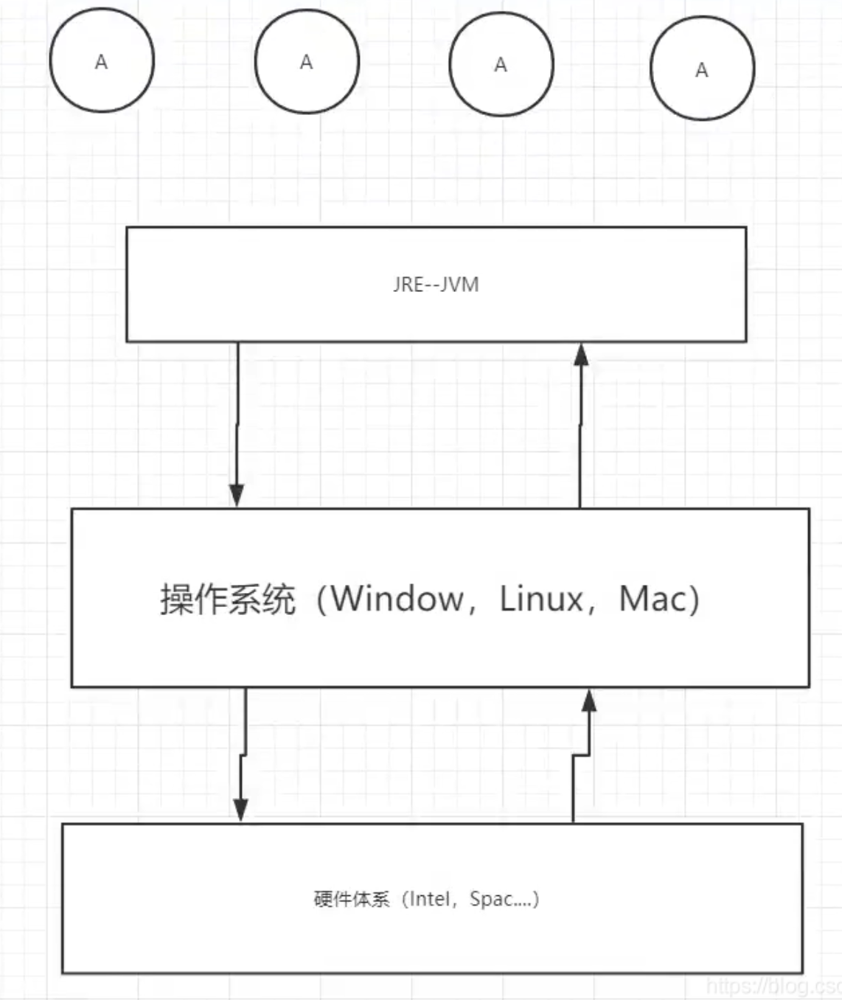

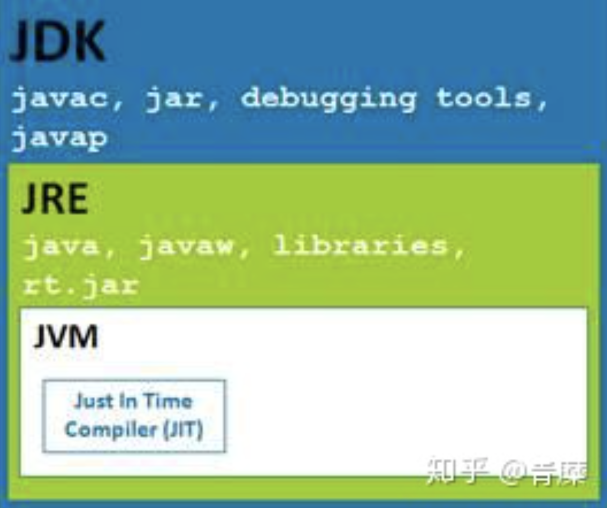

**JDK：**JDK是Java開發工具包，是Sun Microsystems針對Java開發員的產品。 JDK中包含JRE（在JDK的安裝目錄下有一個名為jre的目錄，<mark>裡面有兩個文件夾bin和lib，在這裡可以認為bin裡的就是jvm，lib中則是jvm工作所需要的類庫，而jvm和lib和起來就稱為jre）和一堆Java工具（javac/java/jdb等）和Java基礎的類庫（即Java API 包括rt.jar）。 </mark>

**Java Runtime Environment（JRE）：**是運行基於Java語言編寫的程序所不可缺少的運行環境。也是通過它，Java的開發者才得以將自己開發的程序發佈到用戶手中，讓用戶使用。 <mark>JRE中包含了Java virtual machine（JVM），runtime class libraries和Java application launcher，這些是運行Java程序的必要組件。 </mark>

**JVM（java virtual machine）：**就是我們常說的java虛擬機，它是整個java實現跨平台的最核心的部分，所有的java程序會首先被編譯為.class的類文件，這種類文件可以在虛擬機上執行。


## 2.JVM的體系結構

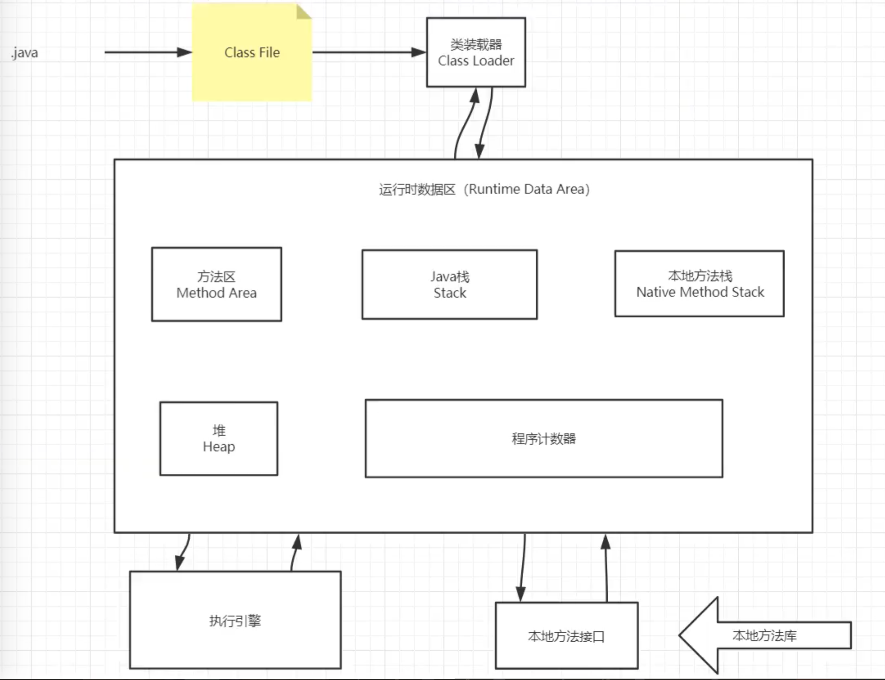

- 百分之99的JVM調優都是在堆(heap)中調優
- Java棧(stack)、本地方法棧、程序計數器是不會有垃圾存在的。
- 第三插件多在執行引擎(Execution Engine)操作

===============================================================

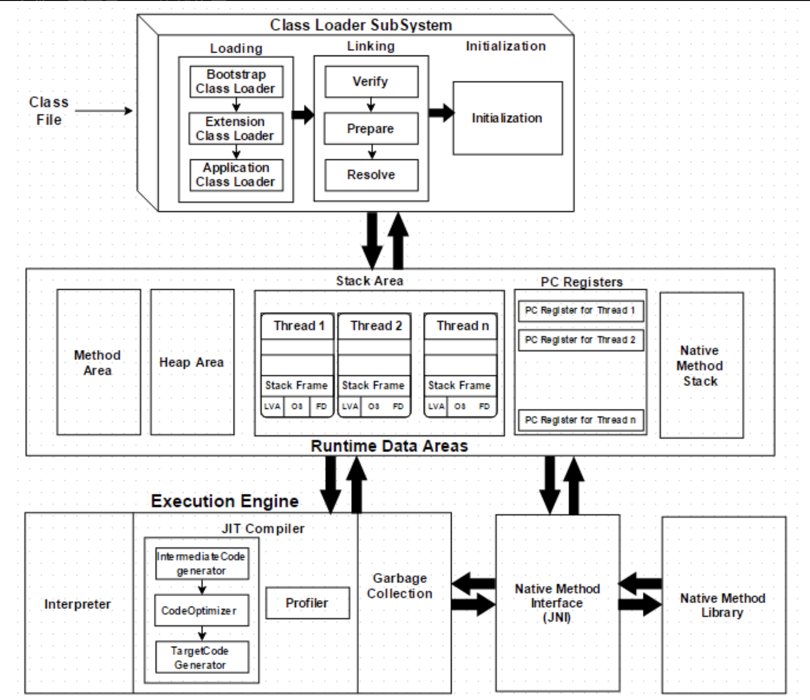

如圖所示，JVM分為三個主要子系統:

1. 類加載器子系統
2. 運行時數據區
3. 執行引擎

### 1. 類加載器子系統

Java的[動態類加載功能](http://www.javainterviewpoint.com/use-of-class-forname-in-java/)由類加載器子系統處理。它裝載的鏈接。在運行時而不是編譯時首次引用類時初始化類文件。

#### 1.1 加載

類將由該組件加載。引導類加載器、擴展類加載器和應用程序類加載器是有助於實現這一目標的三個類加載器。

1. **引導類加載器** – 負責從引導類路徑加載類，除了<mark>**rt.jar**</mark>什麼也沒有。這個加載程序將獲得<mark>最高優先級</mark>。
2. **擴展類加載器** – 負責加載<mark>ext文件夾**(jrelib)**中的類</mark>。
3. **應用程序類加載器** –負責加載<mark>應用程序級類路徑、所述環境變量的路徑等</mark>。

上述類加載器在加載類文件時將遵循委託層次結構算法。 (==>雙親委派機制 )

#### 1.2 鏈接

1. **驗證** – 字節碼驗證器將驗證生成的字節碼是否正確，如果驗證失敗，我們將得到驗證錯誤。
2. **準備** – 內存將為所有靜態變量分配默認值。
3. **解析** – 所有符號內存引用將被來自方法區域的原始引用所替換。

#### 1.3 初始化

這是類加載的最後階段;在這裡，所有[靜態變量](http://www.javainterviewpoint.com/use-of-static-keyword-in-java/)都將被賦初始值，並且[靜態塊](http://www.javainterviewpoint.com/java-static-import/)也會被執行。

### 2. 運行時數據區

運行時數據區被分為五個主要組件:

1. **方法區** – 所有<mark>類級數據都將存儲在這裡，包括靜態變量</mark>。 <mark>每個JVM只有一個方法區，它是資源共享的</mark>。
2. **堆** –所有對象及其對應的<mark>實例變量和數組</mark>都將存儲在這裡。 <mark>每個JVM也僅有一個堆</mark>。由於方法區和堆<mark>被多個線程共享內存，因此存儲的數據不是線程安全的</mark>。
3. **棧**–<mark>每個線程將創建一個單獨的運行時棧</mark>。每個方法調用都會在棧內存中生成一個條目，稱為<mark>棧幀</mark>。所有本地變量都將在棧內存中創建。 <mark>棧區域是線程安全的，因為它不是內存共享的</mark>。

棧區域被分為三個部分:

1. **局部變量數組** – 與方法相關，涉及到局部變量以及相應的值都將存儲在這裡。

2. **操作數堆棧** –如果需要執行任何中間操作，操作數堆棧充當運行時工作區來執行操作。

3. 幀數據

   – 所有與方法對應的符號都存儲在這裡。在任何

   異常

   情況下，catch塊信息都將保存在幀數據中。

   1. **PC寄存器** – 每個線程將有單獨的PC寄存器，以保持當前執行指令的地址一旦指令執行，PC寄存器能順利地更新到下一條指令。
   2. **本地方法棧** – 本機方法棧保存著本地方法信息。對於每個線程，都將創建一個單獨的本機方法棧。

### 3. 執行引擎

被分配給**運行時數據區**的字節碼將由執行引擎執行。執行引擎讀取字節碼並逐個執行。

1. **解釋器** – 解釋器更快地解釋字節碼，但執行速度很慢。解釋器的缺點是，當一個方法被多次調用時，每次都需要一個新的解釋。
2. JIT編譯器

– JIT編譯器消除了解釋器的缺點。執行引擎將在轉換字節碼時使用解釋器的幫助，但是當它發現重複的代碼時，它使用JIT編譯器，JIT編譯整個字節碼並將其更改為本機代碼。此本機代碼將直接用於重複的方法調用，從而提高系統的性能。

1. **中間代碼生成器** – 生成中間代碼

2. **代碼優化器** – 負責優化上面生成的中間代碼

3. **目標代碼生成器** – 負責生成機器代碼或本地代碼

4. 分析器

   – 一個特殊的組件，負責尋找熱點，即方法是否被多次調用。

   1. **垃圾收集器**:收集和刪除未引用的對象。可以通過調用 `System.gc()`觸發垃圾收集，但不能保證執行。 JVM的垃圾收集收集創建的對象。

**Java本地接口(JNI)**: JNI將與本地方法庫交互，並提供執行引擎所需的本地庫。

**本機方法庫**: 這是執行引擎所需的本機庫的集合。


鏈接：https://juejin.im/post/6844903935304531976

================================================== ========

## 3. 類加載器

作用：加載Class文件 --> new Student --> 具體實例

具體實例引用 ---> stack

具體人 ---> heap

```java
Car car1 = new Car();
Class<? extends Car> aClass1= car1.getClass();
ClassLoader classLoader = aClass1.getClassLoader();
```


1, 虛擬機自帶的加載器

2, 啟動類(根)加載器

3, 擴展類加載器

4,應用程序加載器

5, 雙親委派機制

======================

1. **引導類加載器** – 負責從引導類路徑加載類，除了**rt.jar**什麼也沒有。這個加載程序將獲得最高優先級。
2. **擴展類加載器** – 負責加載ext文件夾**(jrelib)**中的類。
3. **應用程序類加載器** –負責加載應用程序級類路徑、所述環境變量的路徑等。

=======================

## 4. 雙親委派機制

//雙親委派機制:安全
// 1. APP–>EXC—B0OT(最終執行)

```java
package java.lang
  
public class String{
  //雙親委派機制:安全
  // 1. APP –> EXC —> BOOT(最終執行)
  // BOOT中沒，從 EXC 找
  // EXC中沒，從 APP 找
  public String toString(){
    return "Hello";
  }
  
  public static void main(String[] args){
    String s = new String();
    s.toString();
  }
}
//output : can't find main method in java.lang.String() ---> beacuse rt.jar(BOOT has java.lang.String(), and there is no main method in it)
```

  

```java
public class Student{
  @Override
  public String toString(){
    return "Hello";
  }
  public static void main(String[] args){
    Student student = new Student();
    System.out.println(s.toString());
  }
}
//output : --> Hello --> work, because it get toString() method from Student student = new Student(); --> 從 APP 找(EXC、B0OT中沒)
```

Boot --> EXC --> APP

1. 類加載器收到類加載的請求
2. 將這個請求向上委託給父類加載器去完成，一 直向上委託，知道啟動類加載器

3. 啟動加載器檢查是否能夠加載當前這個類，能加載就結束， 使用當前的加載器，否則， 拋出異常，通知子加載器進行加載

4. 重複步驟3
   Class Not Found異常就是這麼來的
       Java早期的名字：C+±-
       Java = C++:去掉繁瑣的東西，指針，內存管理~

## 5. 沙箱安全機制

- Java安全模型的核心就是Java沙箱(sandbox) ,
- 什麼是沙箱?沙箱是一個限製程序運行的環境。沙箱機制就是**將Java代碼限定在虛擬機(JVM)特定的運行範圍中，並且嚴格限制代碼對本地系統資源訪問**，通過這樣的措施來保證對代碼的有效隔離，防止對本地系統造成破壞。
- 沙箱主要限制系統資源訪問，那系統資源包括什麼? CPU、內存、文件系統、網絡。不同級別的沙箱對這些資源訪問的限制也可以不一樣。
- 所有的Java程序運行都可以指定沙箱，可以定制安全策略。
- 在Java中將執行程序分成本地代碼和遠程代碼兩種，本地代碼默認視為可信任的，而遠程代碼則被看作是不受信的。對於授信的本地代碼,可以訪問一切本地資源。而對於非授信的遠程代碼在早期的Java實現中，安全依賴於沙箱Sandbox)機制。如下圖所示JDK1.0安全模型

 JDK1.0安全模型

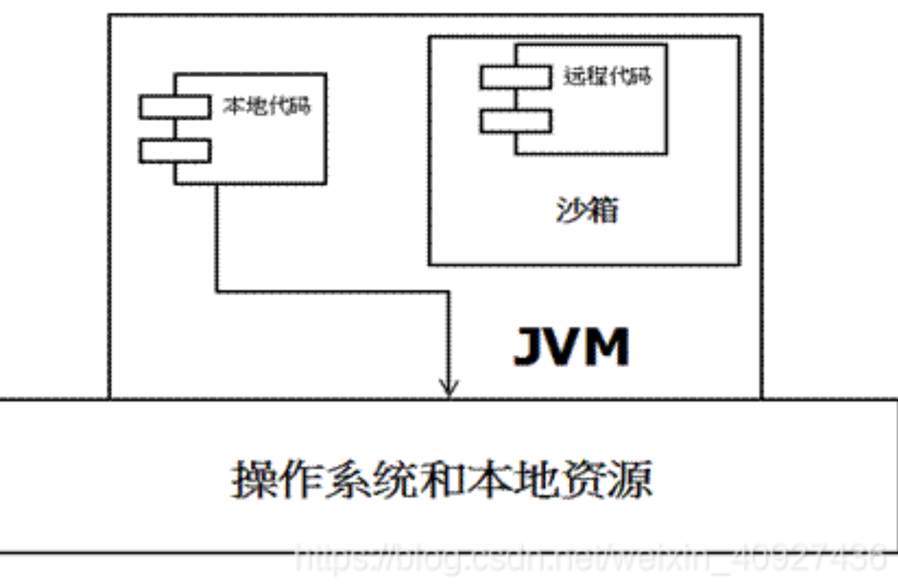

但如此嚴格的安全機制也給程序的功能擴展帶來障礙，比如當用戶希望遠程代碼訪問本地系統的文件時候，就無法實現。因此在後續的Java1.1版本中，針對安全機製做了改進，增加了安全策略，允許用戶指定代碼對本地資源的訪問權限。如下圖所示JDK1.1安全模型

JDK1.1安全模型

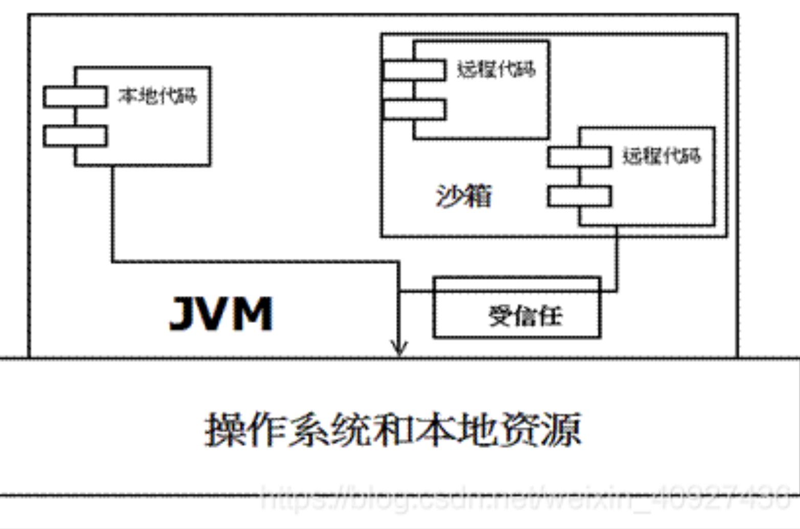

在Java1.2版本中，再次改進了安全機制，增加了代碼簽名。不論本地代碼或是遠程代碼，都會按照用戶的安全策略設定，由類加載器加載到虛擬機中權限不同的運行空間，來實現差異化的代碼執行權限控制。如下圖所示

Java1.2版本

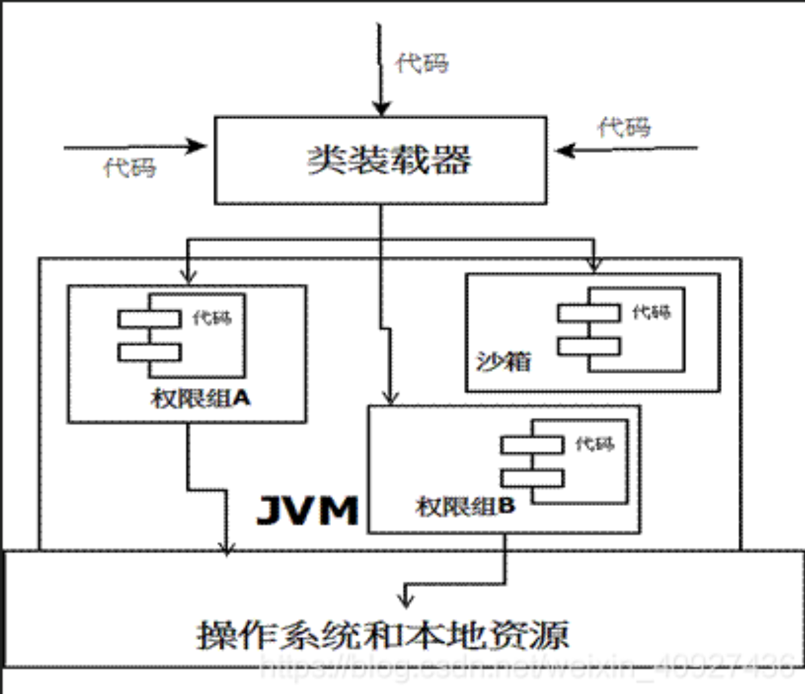


當前最新的安全機制實現，則引入了域(Domain)的概念。虛擬機會把所有代碼加載到不同的系統域和應用域,系統域部分專門負責與關鍵資源進行交互，而各個應用域部分則通過系統域的部分代理來對各種需要的資源進行訪問。虛擬機中不同的受保護域(Protected Domain),對應不一樣的權限(Permission)。存在於不同域中的類文件就具有了當前域的全部權限，如下圖所示最新的安全模型(jdk 1.6)

安全模型(jdk 1.6)

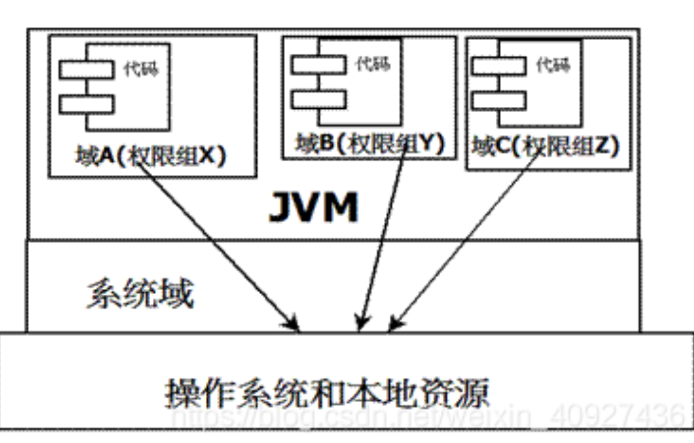


### 組成沙箱的基本組件

- 字節碼校驗器(bytecode verifier) :確保Java類文件遵循Java語言規範。這樣可以幫助Java程序實現內存保護。但並不是所有的類文件都會經過字節碼校驗，比如核心類。
- 類裝載器(class loader) :其中類裝載器在3個方面對Java沙箱起作用
  1. 它防止惡意代碼去干涉善意的代碼; --->. 雙親委派機制
  2. 它守護了被信任的類庫邊界;
  3. 它將代碼歸入保護域,確定了代碼可以進行哪些操作。

虛擬機為不同的類加載器載入的類提供不同的命名空間，命名空間由一系列唯一的名稱組成， 每一個被裝載的類將有一個名字，這個命名空間是由Java虛擬機為每一個類裝載器維護的，它們互相之間甚至不可見。
  類裝載器採用的機制是雙親委派模式。

    1. 從最內層JVM自帶類加載器開始加載,外層惡意同名類得不到加載從而無法使用;
       2. 由於嚴格通過包來區分了訪問域,外層惡意的類通過內置代碼也無法獲得權限訪問到內層類，破壞代碼就自然無法生效。

- 存取控制器(access controller) :存取控制器可以控制核心API對操作系統的存取權限，而這個控制的策略設定,可以由用戶指定。

  //Robot.class ---> 可以操作電腦

- 安全管理器(security manager) : 是核心API和操作系統之間的主要接口。實現權限控制，比存取控制器優先級高。

- 安全軟件包(security package) : java.security下的類和擴展包下的類，允許用戶為自己的應用增加新的安全特性，包括:

  1. 安全提供者
  2. 消息摘要
  3. 數字簽名 //keytools. https
  4. 加密
  5. 鑑別

## 6.Native

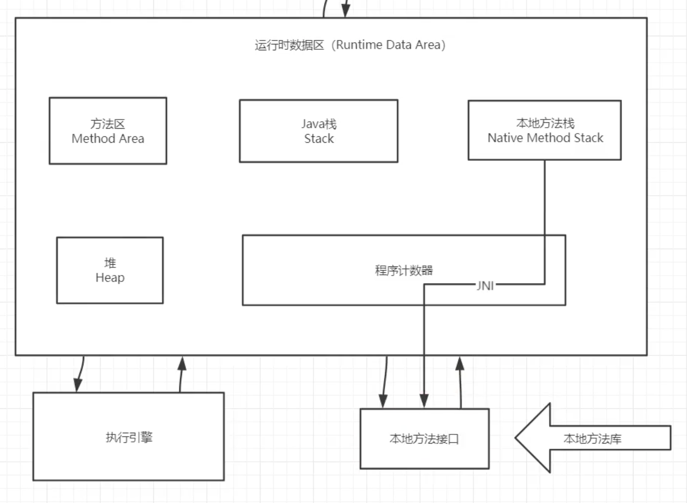

- native :凡是帶了native關鍵字的，說明java的作用範圍達不到了，**回去調用底層c語言的庫!**

- 會進入本地方法棧

- 調用本地方法本地接口 **JNI** (**Java Native Interface**)

- JNI作用:開拓Java的使用，融合不同的編程語言為Java所用!最初: C、C++

- Java誕生的時候C、C++橫行，想要立足，必須要有調用C、C++的程序

- 它在內存區域中專門開闢了一塊標記區域: Native Method Stack，登記native方法

- 在最終執行的時候，加載本地方法庫中的方法通過JNI

- 例如：Java程序驅動打印機，管理系統，掌握即可，在企業級應用比較少

- 調用其他語言方法 ===> 調用其他接口:Socket. . WebService~. .http~

   ---> input (PHP ) ---> NodeJS. --->. Socket. --->. C++ --->

### Native Method Stack

它的具體做法是Native Method Stack中登記native方法，在( Execution Engine )執行引擎執行的時候加載Native Libraies。

帶 Native 關鍵字 ---> 進入本地方法棧， java 的作用範圍達不到，去調用底層 C語言的庫

Other ---> java棧

### Native Interface本地接口

- 本地接口的作用是融合不同的編程語言為Java所用，它的初衷是融合C/C++程序, Java在誕生的時候是C/C++橫行的時候，想要立足，必須有調用C、C++的程序，於是就在內存中專門開闢了塊區域處理標記為native的代碼，它的具體做法是在Native Method Stack 中登記native方法,在( Execution Engine )執行引擎執行的時候加載Native Libraies。
- 目前該方法使用的越來越少了，除非是與硬件有關的應用，比如通過Java程序驅動打印機或者Java系統管理生產設備，在企業級應用中已經比較少見。因為現在的異構領域間通信很發達，比如可以使用Socket通信,也可以使用Web Service等等，不多做介紹!

## 7.PC寄存器

程序計數器: Program Counter Register

每個線程都有一個程序計數器，是線程私有的，就是一個指針, 指向方法區中的方法字節碼(用來存儲指向像一條指令的地址， 也即將要執行的指令代碼)，在執行引擎讀取下一條指令, 是一個非常小的內存空間，幾乎可以忽略不計


## 8.方法區 Method Area

 方法區是被所有線程共享,所有字段和方法字節碼，以及一些特殊方法，如構造函數,接口代碼也在此定義,簡單說，所有定義的方法的信息都保存在該區域<mark> ,此區域屬於共享區間;</mark>

<mark> **靜態變量、常量、類信息(構造方法、接口定義)、運行時的常量池存在方法區中，但是實例變量存在堆內存中，和方法區無關**</mark>

Static, final, class, 常量池

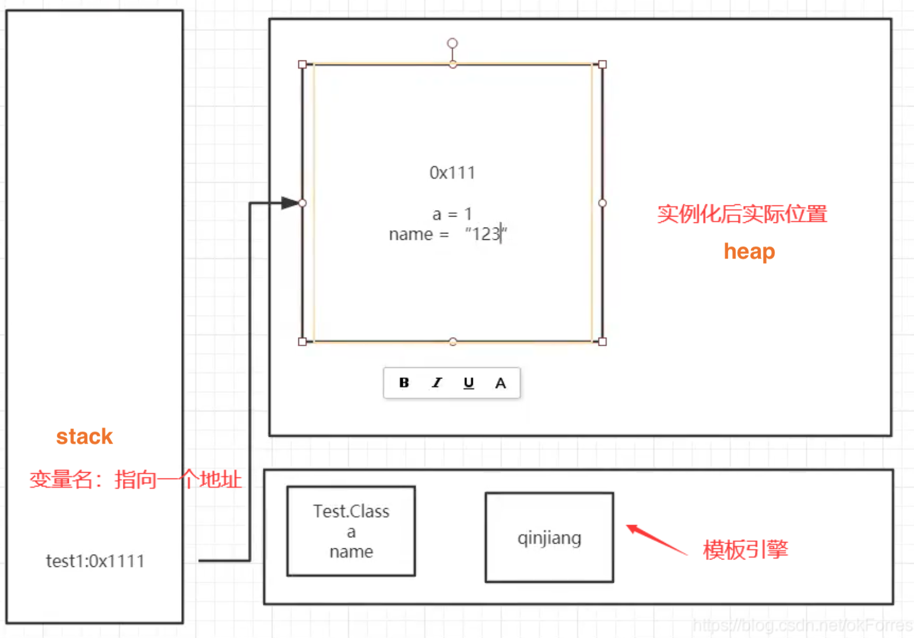

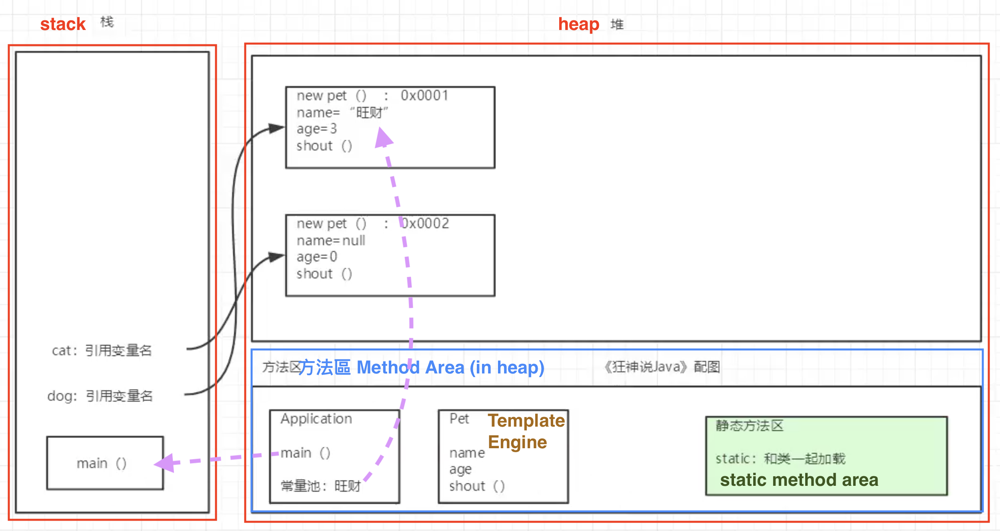

```java
public class Application{
  public static void main(String[] args){
    Pet dog = new Pet();
    dog.name = "旺財";
    dog.age = 3;
    dog.shout();
    
    System.out.println(dog.name);
    System.out.println(dog.age);
  }
}
-------------------------------------
public class Pst{
  public String name;
  public int age;
  public void shout(){
    System.out.println("Wof Wof");
  }
}
```

## 9.栈

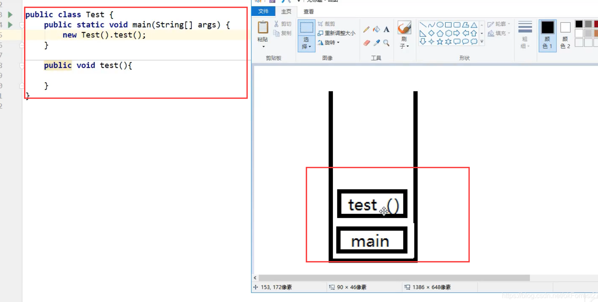

圖 為什麼main()先執行，最後結束~

 棧:先進後出
 桶:後進先出
 隊列:先進先出( FIFO : First Input First Output )

<mark>棧:**棧內存,主管程序的運行,生命週期和線程同步**;
 **線程結束，棧內存也就是釋放,對於棧來說,不存在垃圾回收問題**
 一旦線程結束，棧就Over!</mark>

<mark> 棧內存中 : ==>. **8大基本類型+對象引用+實例的方法**</mark>

<mark>**棧運行原理:棧幀**
棧滿了: StackOverflowError</mark>

<mark>程序正在執行的方法，一定在棧的頂部</mark> ====> 棧:先進後出


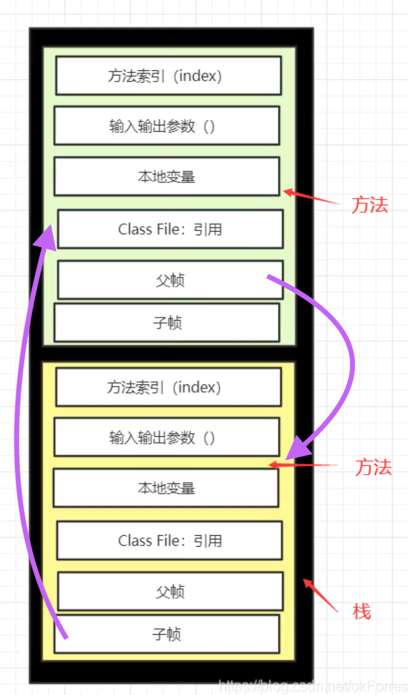

棧＋堆＋方法區交互關係：

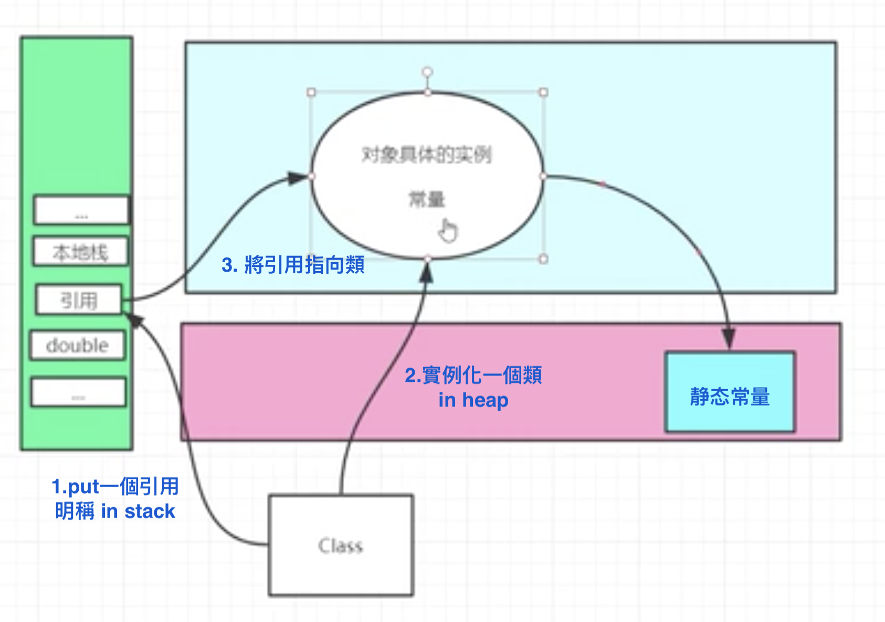

## 10.三種JVM

- Sun公司HotSpot Java Hotspot™ 64-Bit Server VM (build 25.181-b13,mixed mode)
- BEA JRockit
- IBM J9VM
  我們學習都是: Hotspot

## 11.堆

<mark>Heap, 一個JVM只有一個堆內存，堆內存的大小是可以調節的。 </mark>
Q ==> 類加載器讀取了類文件後，一般會把什麼東西放到堆中?
A ==> 類, 方法，常量,變量~，保存我們所有引用類型的真實對象;
 堆內存中還要細分為三個區域:

1. 新生區(伊甸園區) Young/New
2. 養老區old
3. 永久區Perm

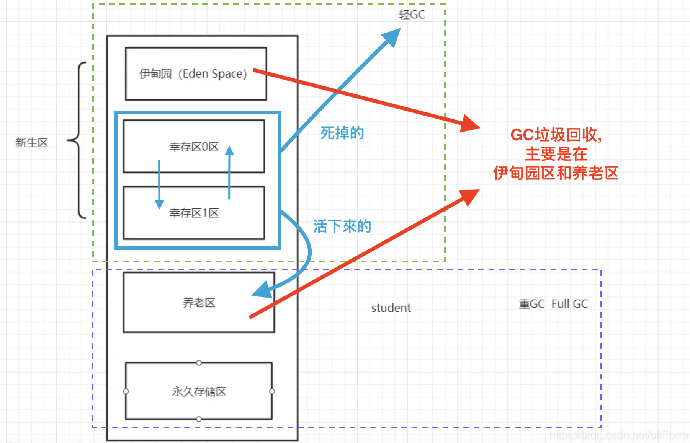

<mark>GC垃圾回收,主要是在伊甸園區和養老區~</mark>

<mark>假設內存滿了,OOM,堆內存不夠! ===> java.lang.OutOfMemoryError:Java heap space</mark>

```java
package com.wong.jvm;

import java.util.Random;

public class Hells {
	public static void main(String[] args) {
		String str = "fiogkhowaihf;lsdnvkfdlhgieshrgojea";
		while(true) {
			str += str + new Random().nextInt(888888888) + new Random().nextInt(999999999);
		}
	}
}

/*

Console : 
Exception in thread "main" java.lang.OutOfMemoryError: Java heap space
	at java.base/java.util.Arrays.copyOf(Arrays.java:3746)
	at java.base/java.lang.AbstractStringBuilder.ensureCapacityInternal(AbstractStringBuilder.java:227)
	at java.base/java.lang.AbstractStringBuilder.append(AbstractStringBuilder.java:593)
	at java.base/java.lang.StringBuilder.append(StringBuilder.java:172)
	at com.wong.jvm.Hells.main(Hells.java:9)

*/
```

永久存儲區裡存放的都是Java自帶的 例如lang包中的類 如果不存在這些，Java就跑不起來了

 在JDK8以後，永久存儲區改了個名字(元空間)


## 12.新生區、老年區

### 新生區

- 類:誕生和成長的地方，甚至死亡;
  1. 伊甸園，所有的對像都是在伊甸園區new出來的!
  2. 倖存者區0, 倖存者區1

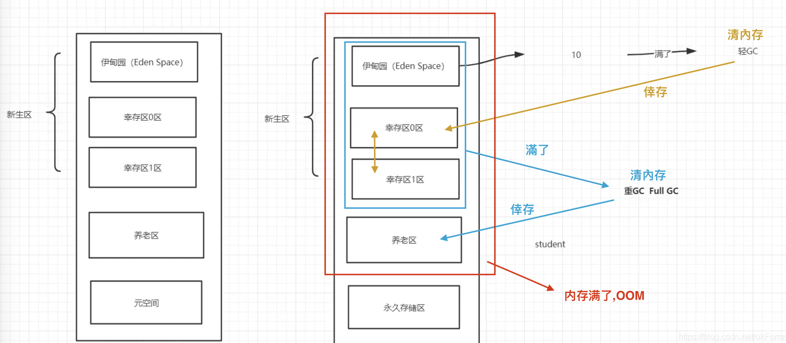

 圖 重GC和輕GC

<mark>**伊甸園滿了就觸發輕GC，經過輕GC存活下來的就到了倖存者區，倖存者區滿之後意味著新生區也滿了，則觸發重GC，經過重GC之後存活下來的就到了養老區。 **</mark>

<mark>真理:經過研究，99%的對像都是臨時對象!|</mark>


## 13.永久區

<mark>**這個區域常駐內存的。用來存放JDK自身攜帶的Class對象。 Interface元數據，存儲的是Java運行時的一些環境~** 這個區域不存在垃圾回收，關閉虛擬機就會釋放內存</mark>

<span style="color:orange">一個啟動類，加載太多第三方jar 包，Tomcat 部署太多應用，大量動態生成的反射類，不斷地被加載，直到內存滿，就會出現OOM ! </span>

- jdk1.6之前 : 永久代<span style="color:orange">,常量池是在方法區</span>;
- jdk1.7 : 永久代,但是慢慢的退化了，去永久代，<span style="color:orange">常量池在堆中</span>
- jdk1.8之後 : 無永久代<span style="color:orange">,常量池在元空間</span>

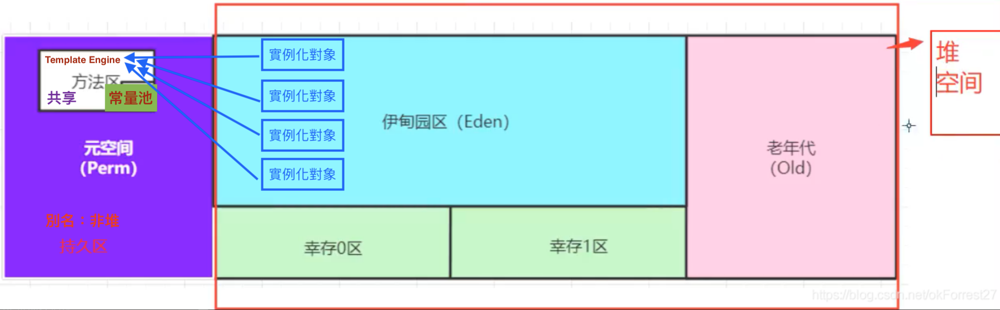

 圖 JVM探究

元空間：邏輯上存在，物理上不存在 (因為存儲在本地磁盤內) 所以最後並不算在JVM虛擬機內存中

## 14.堆內存調優

測試代碼

```java
package com.wong.jvm;

public class StorageDemo {
public static void main(String[] args) {
//返回虛擬機試圖使用（分配）的最大內存
long max = Runtime.getRuntime().maxMemory();
//返回虛擬機 jvm 初始化總內存
long total = Runtime.getRuntime().totalMemory();

System.out.println("max = "+max+" 字節 \t" + (max/(double)1024/1024) + "MB");
System.out.println("total = "+max+" 字節 \t" + (total/(double)1024/1024) + "MB");
/*
* Console:
max = 2147483648 字節 2048.0MB
total = 2147483648 字節 130.0MB
Conclision:
默認情況下，分配的總內存 是電腦內存的 1/4 而初始化總內存 1/64

-Xms1024m -Xmx1024m -XX:+PrintGCDetails ====> max
-Xms8m -Xmx8m -XX:+PrintGCDetails ===> small

-Xms 是設置java虛擬機的最小分配內存
-Xmx 是設置java虛擬機的最大分配內存
-XX:+PrintGCDetails //print out GC message
-XX:+HeapDumpOnOutOfMemoryError //when OOM ===> create dump
*/
}
}
```

[eclipse 設置jvm參數:](https://blog.csdn.net/shi2huang/article/details/80080006)

Eclipse設置JVM參數：->Run Configurations ->VM arguments，如下：

IDEA : 

打開 Windows -> Preferences -> Java -> Installed JREs -> 選中你所使用的 JDK，然後點擊 Edit，會出現如下圖：

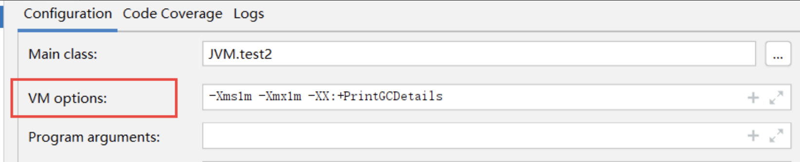

-Xms1024m -Xms1024m -XX:+PrintGCDetails ====> max

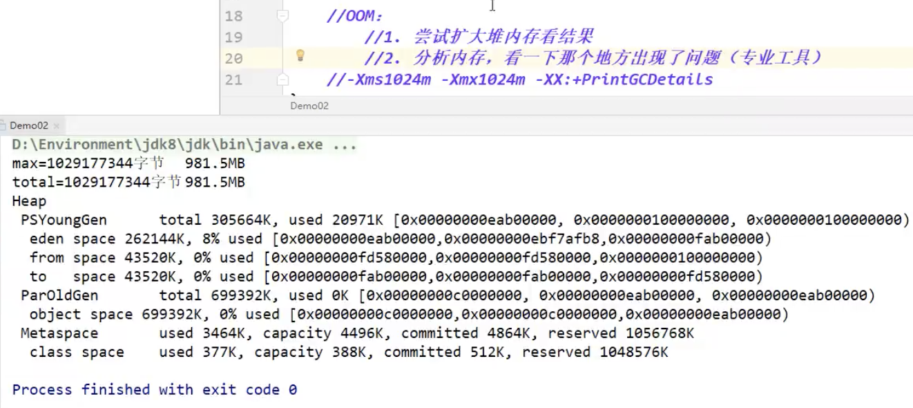

<span style="color:orange">( PSYoungGen ) 305664K + ( ParOldGen ) 699392K = 1,005,056K = 981.5M</span>

===> <mark> 元空間：邏輯上存在，物理上不存在 (因為存儲在本地磁盤內) 所以最後並不算在JVM虛擬機內存中</mark>


-Xms8m -Xms8m -XX:+PrintGCDetails ===> small

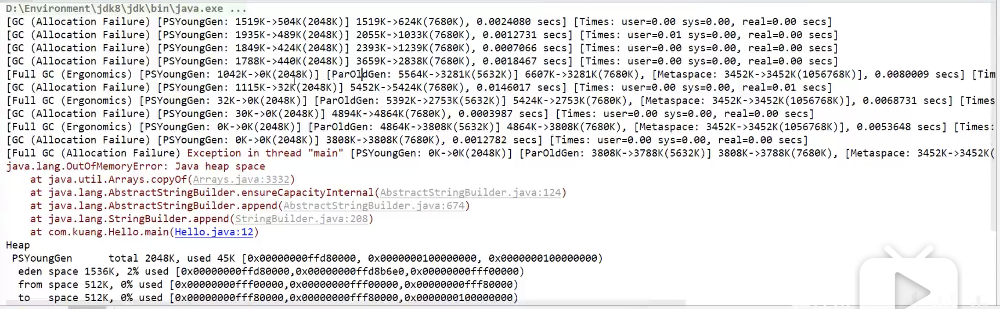

<mark> Question : </mark>

 在一個項目中，突然出現了OOM故障,那麼該如何排除 研究為什麼出錯?

<mark> Answer : </mark>

1. 嘗試擴大堆內存看結果 ( -Xms1024m -Xms1024m -XX:+PrintGCDetails )
2. 分析內存，看一下哪個敵方出問題（專業工具 ：能夠看到代碼第幾行出錯:內存快照分析工具，MAT, Jprofiler）
3. Dubug, 一行行分析代碼!

### MAT, Jprofiler作用

- 分析Dump內存文件,快速定位內存洩露;
- 獲得堆中的數據
- 獲得大的對象~

#### MAT是eclipse集成使用

[eclipse 設置jvm參數:](https://blog.csdn.net/csdnmrliu/article/details/82490986?utm_medium=distribute.pc_relevant.none-task-blog-BlogCommendFromMachineLearnPai2-2.nonecase&depth_1-utm_source=distribute.pc_relevant. none-task-blog-BlogCommendFromMachineLearnPai2-2.nonecaseMAT)

[MemoryAnalyzer中文使用指南 ](https://www.defcode01.com/cs106608727/)

[Eclipse Memory Analyzer 使用技巧 ](https://www.itread01.com/p/307383.html)

[JVM heap dump分析](https://www.jianshu.com/p/c34af977ade1)

[ 10 Tips for using the Eclipse Memory Analyzer](https://eclipsesource.com/blogs/2013/01/21/10-tips-for-using-the-eclipse-memory-analyzer/)

[ Eclipse MAT記憶體分析工具（Memory Analyzer Tool）](https://www.itread01.com/content/1541619079.html)

1. 打開 Windows -> Preferences -> Java -> Installed JREs -> 選中你所使用的 JDK，然後點擊 Edit，會出現如下圖：

2. 修改JVM引數：

   在 Default VM Arguments輸入框內輸入： -Xms512m -Xmx512m

    解釋：

    <span style="color:orange">. -Xms. 是設置java虛擬機的最小分配內存；-Xmx  則是最大分配內存；通常把-Xms和 -Xmx設置為一樣</span>

   我們首先需要獲得一個堆轉儲檔案。通常來說,只要你設定如下所示的 JVM 引數:

   -XX:+HeapDumpOnOutOfMemoryError

   JVM 就會在發生記憶體洩露時抓拍下當時的記憶體狀態,也就是我們想要的堆轉儲檔案。

   如果你不想等到發生崩潰性的錯誤時才獲得堆轉儲檔案,也可以通過設定如下 JVM 引數來按需獲取堆轉儲檔案。

   -XX:+HeapDumpOnCtrlBreak

3. MAT 不是一個萬能工具,它並不能處理所有型別的堆儲存檔案。但是比較主流的廠家和格式,例如 Sun, HP, SAP 所採用的 HPROF 二進位制堆儲存檔案,以及 IBM 的 PHD 堆儲存檔案等都能被很好的解析

4. 然後為你的eclipse或者TOMCAT加上生產.hprof 檔案的配置, Run as --> configurations --> 然後就到了引數設定的頁面, 按照A,B的順序設定B引數: (-XX :+HeapDumpOnOutOfMemoryError)避免寫錯誤可以copy

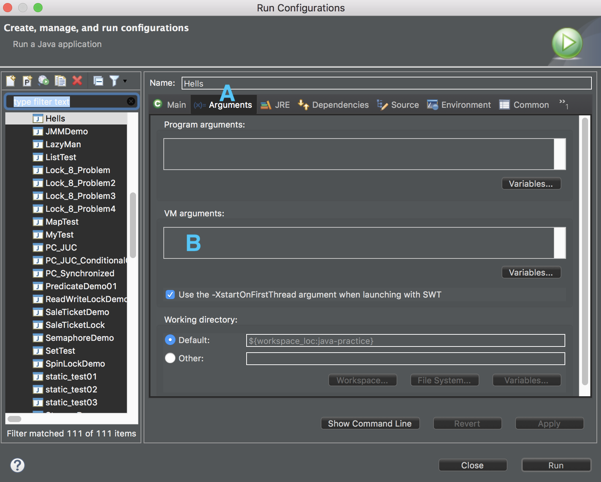

那麼這時候就生成了一個檔案 java_pid43984.hprof ,這個檔案 在你的專案的根目錄下

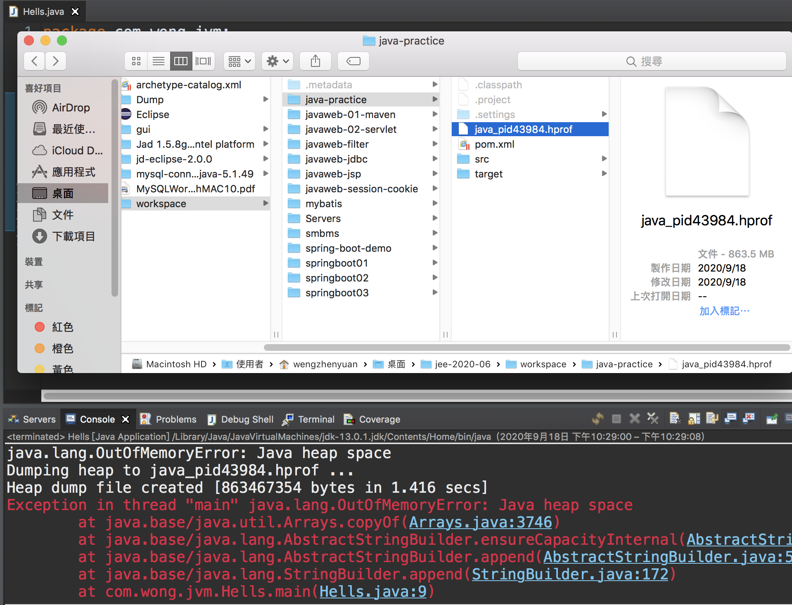

5. **生成分析報告** File --> open file --> 來載入需要分析的堆轉儲檔案 ( 在你的專案根目錄下的 java_pid43984 .hprof ) --> Leak Suspects Report

   匯入後，強出上面的對話盒：
   **Leak Suspects Report：** 漏洞疑點報告，自動檢查堆轉儲是否存在洩漏嫌疑，報告哪些物件被儲存起來，為什麼它們沒有被垃圾收集；
   **Component Report：** 元件報告，分析一組物件是否存在可疑的記憶體問題：重複的字串、空集合、終結器、弱引用等
   **Re-open previously run reports：** 開啟以前的執行報告；

6. 可以看到MAT 工具提供了一個很貼心的功能,將報告的內容壓縮打包到一個zip 檔案,並把它存放到原始堆轉儲檔案的存放目錄下,這樣如果您需要和同事一起分析這個記憶體問題的話,只需要把這個小小的zip 包發給他就可以了,不需要把整個堆檔案發給他。並且整個報告是一個 HTML 格式的檔案,用瀏覽器就可以輕鬆開啟。

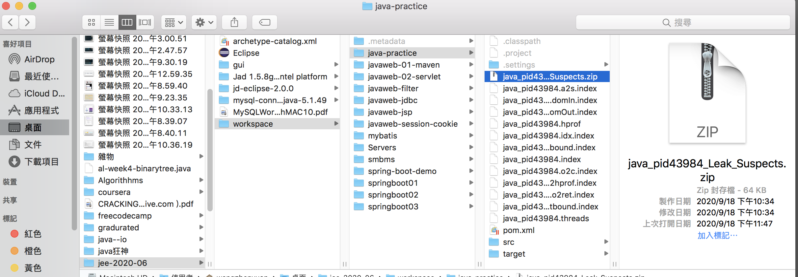

7. 接下來我們就可以來看看生成的報告都包括什麼內容,能不能幫我們找到問題所在吧。您可以點選工具欄上的 Leak Suspects 選單項來生成記憶體洩露分析報告,也可以直接點選餅圖下方的 Reports->Leak Suspects 連結來生成報告。

8. **<mark>分析三步曲</mark>**

   通常我們都會採用下面的“三步曲”來分析記憶體洩露問題:

   首先,對問題發生時刻的系統記憶體狀態獲取一個整體印象。

   第二步,找到最有可能導致記憶體洩露的元兇,通常也就是消耗記憶體最多的物件

   接下來,進一步去檢視這個記憶體消耗大戶的具體情況,看看是否有什麼異常的行為。

   下面將用一個基本的例子來展示如何採用“三步曲”來檢視生產的分析報告

   

9. 在Overview選項中，以餅狀圖的形式列舉出了程序內存消耗的一些基本信息，其中每一種不同顏色的餅塊都代表了不同比例的內存消耗情況。

- Histogram可以列出內存中的對象，對象的個數以及大小。

- Dominator Tree可以列出那個線程，以及線程下面的那些對象佔用的空間。
- Top consumers通過圖形列出最大的object。
- Leak Suspects通過MA自動分析洩漏的原因。

#### Jprofile使用

1. 在idea中下載jprofile插件
2. 聯網下載jprofile客戶端
3. 在idea中VM參數中寫參數 -Xms1m -Xmx8m -XX: +HeapDumpOnOutOfMemoryError
4. .運行程序後在jprofile客戶端中打開找到錯誤 告訴哪個位置報錯
   命令參數詳解
   // -Xms設置初始化內存分配大小/164
   // -Xmx設置最大分配內存，默以1/4
   // -XX: +PrintGCDetails // 打印GC垃圾回收信息
   // -XX: +HeapDumpOnOutOfMemoryError //oom DUMP

## 15. GC

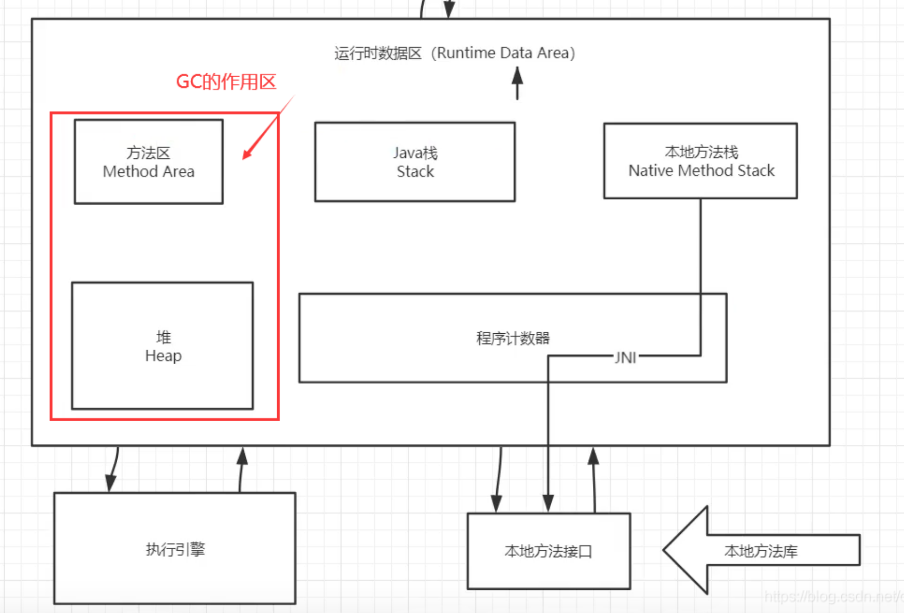

圖 GC的作用區

<mark>JVM在進行GC時，並不是對這三個區域統一回收。大部分時候，回收都是新生代~</mark>

- 新生代

- 倖存區 (form，to)

- 老年區

 <span style="color:orange">GC兩種類:輕GC (普通的GC)， 重GC (全局GC)</span>

 GC常見面試題目:

Ouestion : JVM的內存模型和分區~詳細到每個區放什麼?

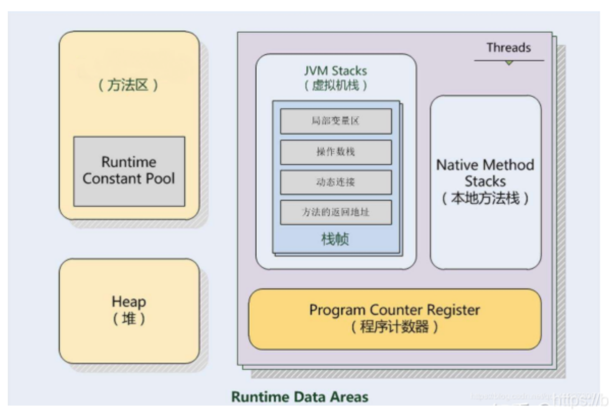

  圖 JVM內存模型和分區

Ouestion : 堆裡面的分區有哪些?

Answer : Eden, form, to, 老年區,說說他們的特點!

Question. : GC的算法有哪些?

Answer : 標記壓縮，標記清除法，,複製算法，引用計數器

Question. : 輕GC和重GC分別在什麼時候發生?


### 算法：

#### 1.引用計數器：

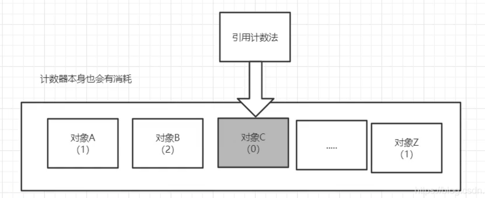

- Low efficency


#### 2.複製算法

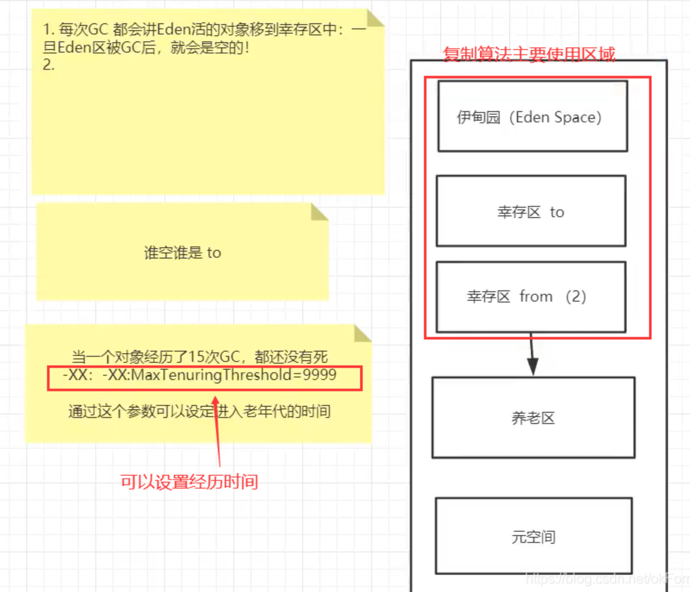

- 複製算法最佳使用場景 : <span style="color:orange">對象存活度較低的時候;新生區~</span>

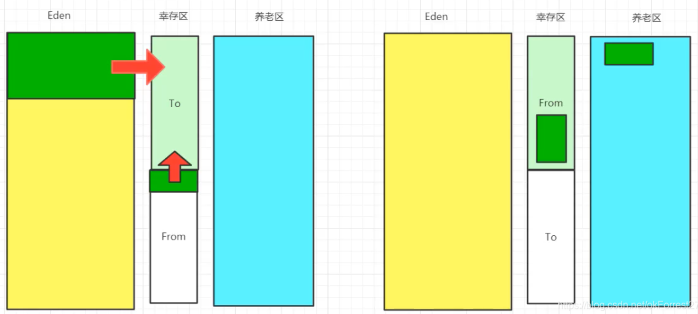


- 好處:沒有內存的碎片~

- 壞處 : <span style="color:orange"> 浪費了內存空間~ : 多了一半空間永遠是空to</span>。假設對象100%存活 ( 極端情況，效果差）


#### 3.標記清除法

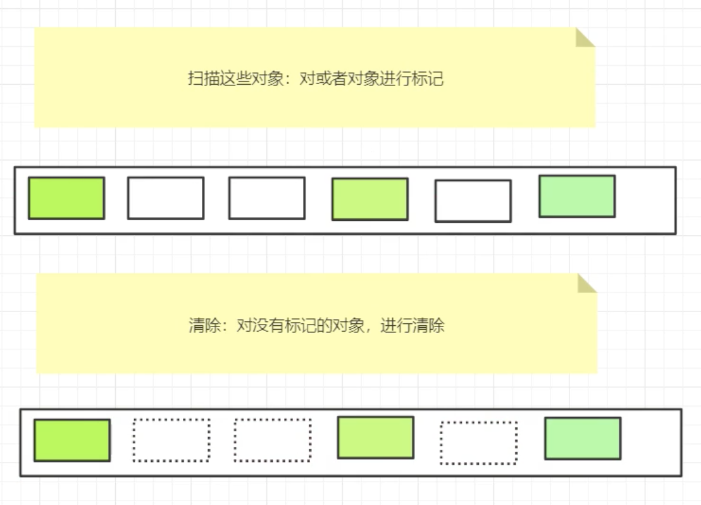


- 優點：不需要額外內存空間

- 缺點：<span style="color:orange">兩次掃瞄（第一次標記＋第二次清除） ：時間成本高，會產生內存的碎片（內存的碎片＝空格沒內存的區域分佈零碎＝查詢內存時耗時）</span>


#### 4.標記壓縮

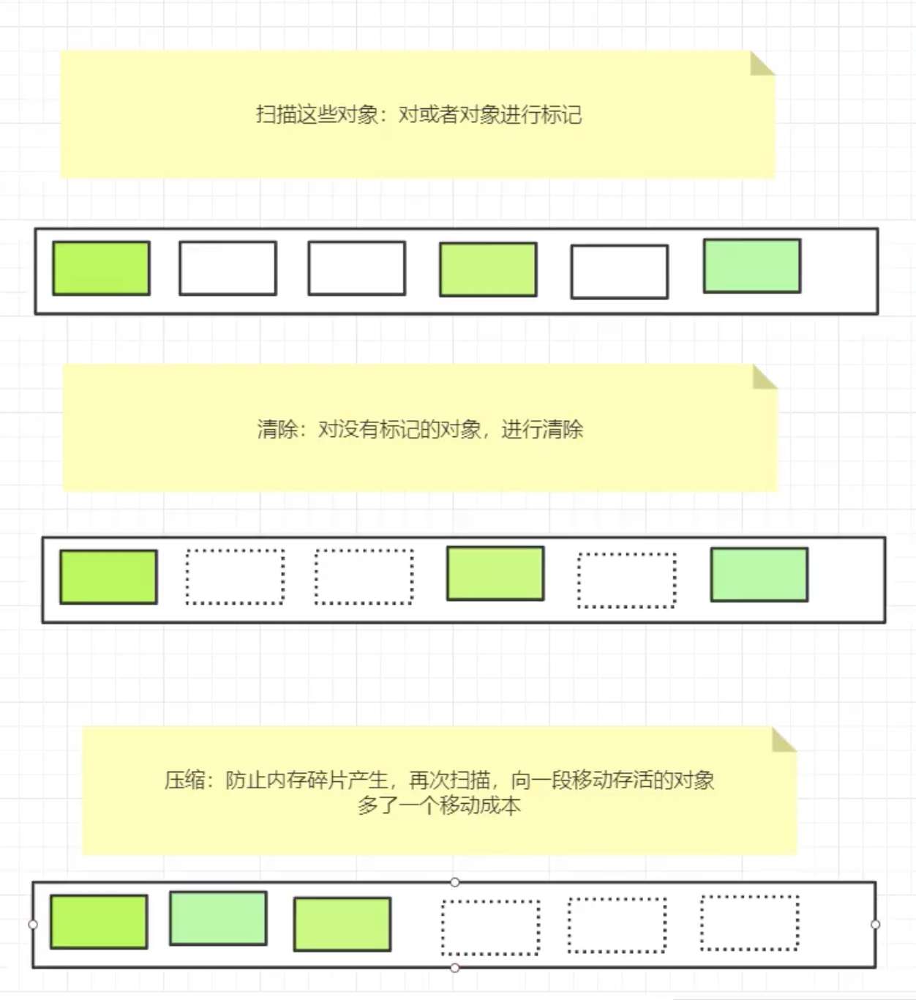

#### 5.標記清除壓縮


先標記清除幾次，再壓縮


#### 6. 總結

內存效率：複製算法 > 標記清除法 > 標記壓縮法（時間複雜度）

內存整齊度：複製算法 > 標記壓縮法 > 標記清除法

內存利用率： 標記壓縮法 > 標記清除法 > 複製算法


 <span style="color:orange">沒有最好的算法，只有最適合的算法 ：-----> GC : 分代收集算法</span>

- <mark>年輕代：存活率低 -----> 複製算法</mark>

- <mark>老年代：區域大：存活率高 -----> 標記清除法（內存的碎片不是太多時使用）＋ 標記壓縮法混合實現</mark>

## 16.JMM

Java Memory Model

Java內存模型（JMM）總結. https://zhuanlan.zhihu.com/p/29881777

作用：緩存一致性協議，用於定義數據讀寫的規則

`JMM是一種規範，是抽象的概念，目的是解決由於多線程並發編程通過內存共享進行通信時，存在的本地內存數據不一致、編譯器會對代碼指令重排序、處理器會對代碼亂序執行等帶來的問題，即保證內存共享的正確性（可見性、有序性、原子性）。`

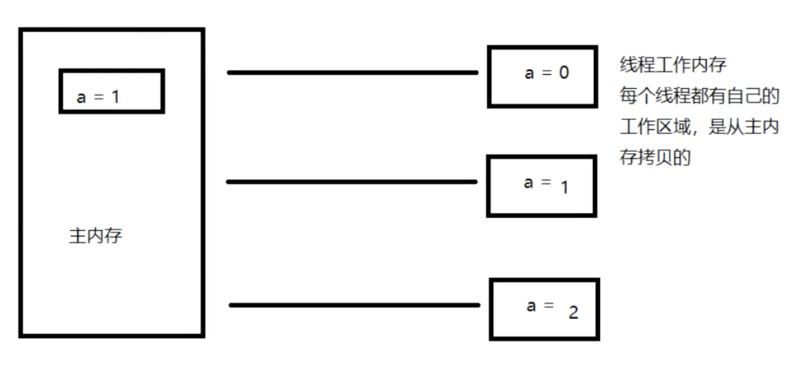

- 原子性：Java提供了兩個高級字節碼指令monitorenter和monitorexit，對應的是關鍵字synchronized,使用該關鍵字保證方法和代碼塊內的操作的原子性。
- 可見性：Java中的volatile關鍵字提供了一個功能，那就是被其修飾的變量在被修改後可以立即同步到主內存，被其修飾的變量在每次是用之前都從主內存刷新。因此，可以使用volatile來保證多線程操作時變量的可見性。
  除了volatile，Java中的synchronized和final兩個關鍵字也可以實現可見性，只不過實現方式不同。
- 有序性：用volatile關鍵字禁止指令重排，用synchronized關鍵字加鎖。


關於主內存與工作內存之間的具體交互協議，即一個變量如何從主內存拷貝到工作內存、如何從工作內存同步到主內存之間的實現細節，Java內存模型定義了以下八種操作來完成：

- **lock（鎖定）**：作用於主內存的變量，把一個變量標識為一條線程獨占狀態。
- **unlock（解鎖）**：作用於主內存變量，把一個處於鎖定狀態的變量釋放出來，釋放後的變量才可以被其他線程鎖定。
- **read（讀取）**：作用於主內存變量，把一個變量值從主內存傳輸到線程的工作內存中，以便隨後的load動作使用
- **load（載入）**：作用於工作內存的變量，它把read操作從主內存中得到的變量值放入工作內存的變量副本中。
- **use（使用）**：作用於工作內存的變量，把工作內存中的一個變量值傳遞給執行引擎，每當虛擬機遇到一個需要使用變量的值的字節碼指令時將會執行這個操作。
- **assign（賦值）**：作用於工作內存的變量，它把一個從執行引擎接收到的值賦值給工作內存的變量，每當虛擬機遇到一個給變量賦值的字節碼指令時執行這個操作。
- **store（存儲）**：作用於工作內存的變量，把工作內存中的一個變量的值傳送到主內存中，以便隨後的write的操作。
- **write（寫入）**：作用於主內存的變量，它把store操作從工作內存中一個變量的值傳送到主內存的變量中。

Java內存模型還規定了在執行上述八種基本操作時，必須滿足如下規則：

- 如果要把一個變量從主內存中復製到工作內存，就需要按順尋地執行read和load操作， 如果把變量從工作內存中同步回主內存中，就要按順序地執行store和write操作。但Java內存模型只要求上述操作必須按順序執行，而沒有保證必須是連續執行。
- 不允許read和load、store和write操作之一單獨出現
- 不允許一個線程丟棄它的最近assign的操作，即變量在工作內存中改變了之後必須同步到主內存中。
- 不允許一個線程無原因地（沒有發生過任何assign操作）把數據從工作內存同步回主內存中。
- 一個新的變量只能在主內存中誕生，不允許在工作內存中直接使用一個未被初始化（load或assign）的變量。即就是對一個變量實施use和store操作之前，必須先執行過了assign和load操作。
- 一個變量在同一時刻只允許一條線程對其進行lock操作，但lock操作可以被同一條線程重複執行多次，多次執行lock後，只有執行相同次數的unlock操作，變量才會被解鎖。 lock和unlock必須成對出現
- 如果對一個變量執行lock操作，將會清空工作內存中此變量的值，在執行引擎使用這個變量前需要重新執行load或assign操作初始化變量的值
- 如果一個變量事先沒有被lock操作鎖定，則不允許對它執行unlock操作；也不允許去unlock一個被其他線程鎖定的變量。
- 對一個變量執行unlock操作之前，必須先把此變量同步到主內存中（執行store和write操作）。


## 17.JVM內存分區和Java內存模型（Java Memory Model）

[JVM内存分区和Java内存模型（Java Memory Model）](https://blog.csdn.net/qxhly/article/details/104637822)

- JVM內存分區具體指的是JVM中運行時數據區的分區。
- JMM是一種規範，是抽象的概念，目的是解決由於多線程並發編程通過內存共享進行通信時，存在的本地內存數據不一致、編譯器會對代碼指令重排序、處理器會對代碼亂序執行等帶來的問題，即保證內存共享的正確性（可見性、有序性、原子性）。
- Java內存分區和JMM是完全不同層次的概念，更恰當說JMM描述的是一組規範，圍繞原子性，有序性、可見性，通過這組規範控製程序中各個變量在共享數據區域和私有數據區域的訪問方式。 JMM與Java內存區域其實都是抽象的概念，唯一相似點，都存在共享數據區域和私有數據區域。在JMM中主內存屬於共享數據區域，從某個程度上講應該包括了堆和方法區，而工作內存數據線程私有數據區域，從某個程度上講則應該包括程序計數器、虛擬機棧以及本地方法棧。或許在某些地方，我們可能會看見主內存被描述為堆內存，工作內存被稱為線程棧，實際上他們表達的都是同一個含義。

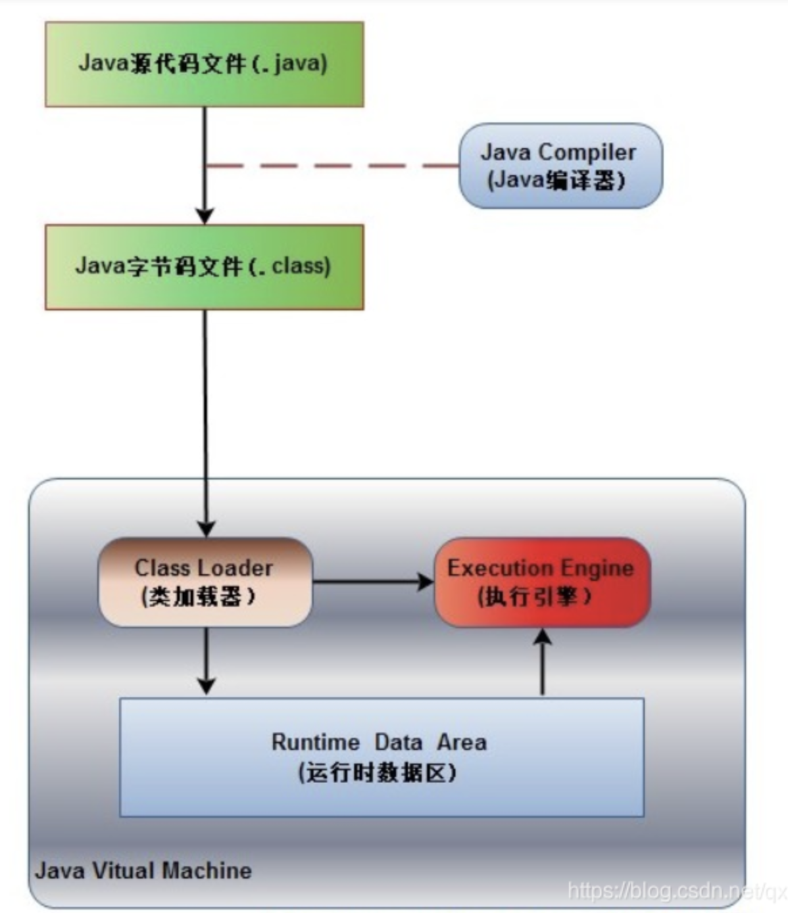

老生常談的問題：.java文件被Java Compiler編譯為.class字節碼文件,隨後Class loader加載各類的字節碼文件，加載完後交由Execution Engine執行。執行引擎負責具體的代碼調用及執行過程。就目前而言,所有的Java虛擬機的執行引擎都是一致的:輸入的是字節碼文件、處理過程是等效字節碼解析過程,輸出的是執行結果。 Runtime Data Area用來存放程序運行時的數據和相關信息，也就是常說的JVM內存。

#### Runtime Data Area


JVM規範了內存分區，由方法區、堆、虛擬機棧、程序計數器、本地方法棧組成。

- 方法區（Mehtod Area）：屬線程共享內存區域，作用是儲存已被JVM加載的類信息、常量、靜態變量、即時編譯後的代碼等。它是堆的一個邏輯部分，為了與堆區分開，又叫Non-Heap，相對而言，GC對於這個區域的收集是很少出現的。當方法區無法滿足內存分配需求時，將拋出OutOfMemoryError 異常。
  - 其中的Runtime Constant Pool（運行時常量池）， 用於存放編譯器生成的符號引用和字面量(就是這個量本身，如字符串“ “ABC” ”，int型"3"），由於Java不要求常量一定在編譯時產生，所以它具備動態性特徵，運行期間產生的新常量也會加入池中。
- Java堆（Heap）：屬線程共享內存區域，在虛擬機啟動時創建，佔用區域最大，用於存放對象實例，所有對象實例和數組都要在堆上分配內存，可以處理不連續的內存空間，可擴展，是GC機制管理的主要區域，所以也被叫做GC堆。當堆中沒有內存滿足實例分配需求，並且堆也無法再擴展時，將會拋出OutOfMemoryError 異常。
  為了支持垃圾收集，堆被分為三個部分：
  - 年輕代 ： 常常又被劃分為Eden區和Survivor（From Survivor To Survivor）區(Eden空間、From Survivor空間、To Survivor空間（空間分配比例是8：1：1）
  - 老年代
  - 永久代 （jdk 8已移除永久代）
- 虛擬機棧（JVM Stacks）：屬線程私有內存區域， 也是常說的棧。 Java棧是Java方法執行的內存模型。 Java棧中存放的是一個個的棧幀，每個棧幀對應一個被調用的方法，在棧幀中包括局部變量表(Local Variables)、操作數棧(Operand Stack)、指向當前方法所屬的類的運行時常量池（運行時常量池的概念在方法區部分會談到）的引用(Reference to runtime constant pool)、方法返回地址(Return Address)和一些額外的附加信息。當虛擬機棧中沒有內存滿足實例分配需求，會拋出StackOverflowError和OutOfMemoryError異常。
- 程序計數器（Program Counter Register）：屬線程私有內存區域，佔一小塊內存區域，用於指示當前執行字節碼的行號，通過改變這個計數器的值來選取下一條需要執行的字節碼指令，分支、循環、跳轉、異常處理、線程恢復等基礎功能都需要依賴這個計數器來完成。在JVM規範中規定，如果線程執行的是非native方法，則程序計數器中保存的是當前需要執行的指令的地址；如果線程執行的是native方法，則程序計數器中的值是undefined。由於程序計數器中存儲的數據所佔空間的大小不會隨程序的執行而發生改變，因此，此內存區域是唯一一個在JVM規範中沒有規定任何OutOfMemoryError情況的區域。
- 本地方法棧(Native Method Stacks)：屬線程私有內存區域，本地方法棧與虛擬機棧發揮的功能非常類似，只是虛擬機棧為虛擬機執行java方法而服務，而本地方法棧為虛擬機執行native方法而服務。當本地方法棧中沒有內存滿足實例分配需求，會拋出StackOverflowError和OutOfMemoryError異常。

#### Java內存模型（JMM）

JMM是一種抽象的概念，<mark>它是一種規範，定義了程序中各個變量訪問的方式</mark>。 JVM運行程序的實體是線程，每個線程創建時JVM會為其創建相應的工作內存（空棧間），用於儲存線程私有數據，JMM中規定所有變量都存儲在主內存上，所有線程都可訪問，線程對於變量的操作（賦值、讀取等）必須在工作內存進行，操作完成寫回主內存，這樣各線程之間就無法相互訪問，線程間的通信(傳值)必須通過主內存來完成。

- 主內存（堆內存）：主要存儲實例對象，所有線程創建的實例對象（成員、局部、靜態、常量等）都放在主內存中。存在線程安全問題（造成主內存與工作內存間數據存在一致性問題）。
- 工作區域（私有線程域）：主要存儲當前方法的所有本地變量信息（主內存中變量的複制，也包含字節碼行號指示器、相關Native方法信息）。線程中的本地變量對其他線程不可見，不存在線程安全問題。

#### 主內存與工作內存的數據存儲類型、操作方式及與硬件的關係

如果方法中的數據是基本數據類型，將直接存儲在棧幀結構中；如果本地變量是引用類型，那麼該引用會存儲在工作內存的棧幀中，而對象實例還是會存在主內存（堆）中。對於實例對象的成員變量，無論類型都被存在堆中。當兩個線程同時調用了一個對象的同一個方法時，兩條線程都會將所涉及的數據複製一份到自己的工作內存中，操作完成後刷新到主內存中。 JMM是一種抽象的概念，並不實際存在，在邏輯上分工作內存和主內存，但在物理上二者都可能在主存中也可能在Cache或者寄存器中。 Java內存分區也是這個道理。

#### Java線程的實現原理

在Windows和Linux系統上，Java線程實現是基於一對一的線程模型，即通過語言級的程序（JVM）去間接地調用操作系統內核的線程模型。由於我們編寫的多線程程序屬於語言層面的，程序一般不會直接去調用內核線程，取而代之的是一種輕量級的進程(Light Weight Process)，也是通常意義上的線程，由於每個輕量級進程都會映射到一個內核線程，因此我們可以通過輕量級進程調用內核線程，進而由操作系統內核將任務映射到各個CPU各個核心進行並發執行，這種輕量級進程與內核線程間1對1的關係就稱為一對一的線程模型。

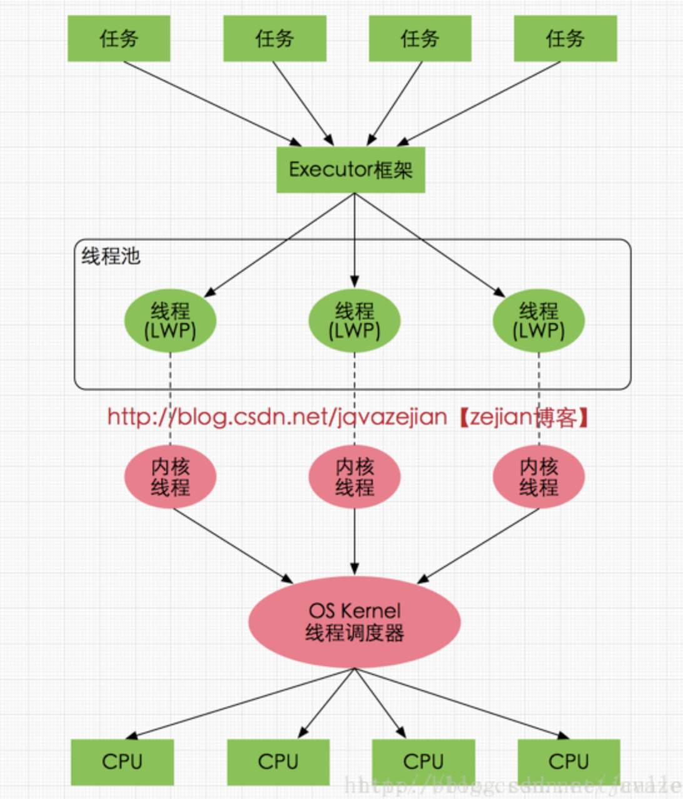

關於其中的內核線程(Kernel-Level Thread，KLT)，它是由操作系統內核(Kernel)支持的線程，這種線程是由操作系統內核來完成線程切換，內核通過操作調度器進而對線程執行調度，並將線程的任務映射到各個處理器上。每個內核線程可以視為內核的一個分身,這也就是操作系統可以同時處理多任務的原因。

#### 並發編程的問題

多線程並發編程會涉及到以下的問題：

- 原子性：指在一個操作中就是cpu不可以在中途暫停然後再調度，既不被中斷操作，要不執行完成，要不就不執行。
- 可見性：指當多個線程訪問同一個變量時，一個線程修改了這個變量的值，其他線程能夠立即看得到修改的值。
- 有序性：程序執行的順序按照代碼的先後順序執行，多線程中為了提高性能，編譯器和處理器的常常會對指令做重排（編譯器優化重排、指令並行重排、內存系統重排）。

#### JMM的具體實現

JMM還提供了一系列原語（由若干條指令組成的，用於完成一定功能的一個過程），封裝了底層實現。

- 原子性：Java提供了兩個高級字節碼指令monitorenter和monitorexit，對應的是關鍵字synchronized,使用該關鍵字保證方法和代碼塊內的操作的原子性。
- 可見性：Java中的volatile關鍵字提供了一個功能，那就是被其修飾的變量在被修改後可以立即同步到主內存，被其修飾的變量在每次是用之前都從主內存刷新。因此，可以使用volatile來保證多線程操作時變量的可見性。
  除了volatile，Java中的synchronized和final兩個關鍵字也可以實現可見性，只不過實現方式不同。
- 有序性：用volatile關鍵字禁止指令重排，用synchronized關鍵字加鎖。