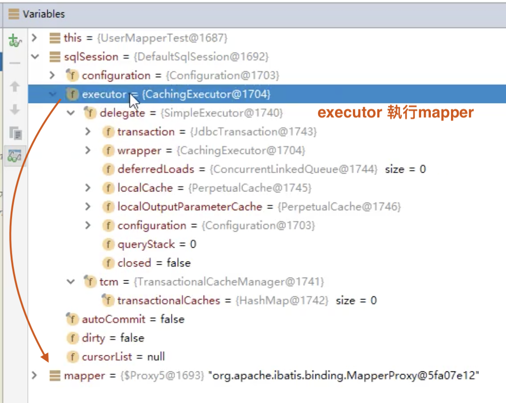

# MyBatis

> 環境說明：

- jdk 8 +
- MySQL 5.7.19
- maven-3.6.1

學習前需要掌握：

- JDBC
- MySQL
- Java 基礎
- Maven
- Junit

## 1、簡介

### 1.1 什麼是Mybatis

- **MyBatis 是一款優秀的持久層框架;**
- 它支持自定義 SQL、存儲過程以及高級映射。 MyBatis 免除了幾乎所有的 JDBC 代碼以及設置參數和獲取結果集的工作。 MyBatis 可以通過簡單的 XML 或註解來配置和映射原始類型、接口和 Java POJO（Plain Old Java Objects，普通老式 Java 對象）為數據庫中的記錄。
- MyBatis 本是apache的一個開源項目ibatis, 2010年這個項目由apache 遷移到了google code，並且改名為MyBatis 。
- 2013年11月遷移到**Github** .

### 1.2 持久化

數據持久化

- 持久化就是將程序的數據在持久狀態和瞬時狀態轉化的過程

- 即把數據（如內存中的對象）保存到可永久保存的存儲設備中（如磁盤）。持久化的主要應用是將內存中的對象存儲在數據庫中，或者存儲在磁盤文件中、XML數據文件中等等。

  JDBC就是一種持久化機制。文件IO也是一種持久化機制。

- 內存：**斷電即失**

- 數據庫（Jdbc）,io文件持久化。

**為什麼要持久化？ **

- 內存斷電後數據會丟失，但有一些對像是無論如何都不能丟失的
- 內存太貴

### 1.3 持久層

Dao層、Service層、Controller層

- 完成持久化工作的代碼塊 . ----> dao層 【DAO (Data Access Object) 數據訪問對象】
- 大多數情況下特別是企業級應用，數據持久化往往也就意味著將內存中的數據保存到磁盤上加以固化，而持久化的實現過程則大多通過各種**關係數據庫**來完成。
- 不過這裡有一個字需要特別強調，也就是所謂的“層”。對於應用系統而言，數據持久功能大多是必不可少的組成部分。我們的系統架構中，應該有一個相對獨立的邏輯層面，專注於數據持久化邏輯的實現.
- 與系統其他部分相對而言，這個層面應該具有一個較為清晰和嚴格的邏輯邊界。 【說白了就是用來操作數據庫存在的！ 】

- 層界限十分明顯

### 1.4 為什麼需要MyBatis

- 幫助程序員將數據存入到數據庫中
- 方便
- MyBatis 是一個半自動化的**ORM框架 (Object Relationship Mapping) -->對象關係映射**
- 傳統的JDBC代碼太複雜了， , 有很多重複代碼塊 .簡化，框架，自動化
- 不用MyBatis也可以，技術沒有高低之分
- 優點：
  - 簡單易學
  - 靈活
  - sql和代碼的分離，提高了可維護性。通過提供DAO層，將業務邏輯和數據訪問邏輯分離
  - 提供映射標籤，支持對象與數據庫的orm字段關係映射
  - 提供對象關係映射標籤，支持對象關係組建維護
  - 提供xml標籤，支持編寫動態sql

## 2、第一个Mybatis程序(CRUD)

思路：搭建環境 --> 導入MyBatis --> 編寫代碼 --> 測試

### 2.1 搭建环境

[mac下eclipse配置tomcat和server](https://blog.csdn.net/mlyjqx/article/details/82285939)

[Mac電腦Tomcat下載及安裝(詳細)](https://codertw.com/%E7%A8%8B%E5%BC%8F%E8%AA%9E%E8%A8%80/586347/)

[[Java学习]Mac下Eclipse使用JDBC连接MySql](https://www.jianshu.com/p/3cae846b8a91)

[構建Maven專案的完整過程--普通web專案（Eclipse](https://www.itread01.com/content/1543296122.html)

[Eclipse使用（十二）—— 创建Maven多模块（父子）项目演示Maven的聚合和继承以及模块之间的依赖关系](https://blog.csdn.net/Alexshi5/article/details/79627346)


### 2.2 新建項目

搭建實驗數據庫

```sql
CREATE DATABASE `mybatis`;

USE `mybatis`;

DROP TABLE IF EXISTS `user`;

CREATE TABLE `user` (
  `id` int(20) NOT NULL,
  `name` varchar(30) DEFAULT NULL,
  `pwd` varchar(30) DEFAULT NULL,
  PRIMARY KEY (`id`)
) ENGINE=InnoDB DEFAULT CHARSET=utf8;

insert  into `user`(`id`,`name`,`pwd`) values (1,'張山','123456'),(2,'李四','abcdef'),(3,'王高','987654');
```

1. 創建一個普通的maven項目

2. 刪除src目錄 （就可以把此工程當做父工程了，然後創建子工程）

3. 導入maven依賴(父工程pom.xml)


```xml
<?xml version="1.0" encoding="UTF-8"?>
<project xmlns="http://maven.apache.org/POM/4.0.0" xmlns:xsi="http://www.w3.org/2001/XMLSchema-instance" xsi:schemaLocation="http://maven.apache.org/POM/4.0.0 http://maven.apache.org/xsd/maven-4.0.0.xsd">
  <modelVersion>4.0.0</modelVersion>
<!-- =========parent========= -->
  <groupId>com.wong</groupId>
  <artifactId>mybatis</artifactId>
  <version>0.0.1-SNAPSHOT</version>
  <packaging>pom</packaging>

  <name>mybatis</name>
  <url>http://maven.apache.org</url>

  <properties>
    <project.build.sourceEncoding>UTF-8</project.build.sourceEncoding>
  </properties>
<!----------------------------------->
  <dependencies>
  <dependency>
	   <groupId>org.mybatis</groupId>
	   <artifactId>mybatis</artifactId>
	   <version>3.5.2</version>
	</dependency>
	<dependency>
	   <groupId>mysql</groupId>
	   <artifactId>mysql-connector-java</artifactId>
	   <version>5.1.47</version>
	</dependency>
    <dependency>
      <groupId>junit</groupId>
      <artifactId>junit</artifactId>
      <version>3.8.1</version>
      <scope>test</scope>
    </dependency>
  </dependencies>
<!---------------------------------->
  <modules>
  	<module>mybatis-01</module>
    <module>mybatis-02</module>
    <module>mybatis03</module>
    <module>mybatis-03</module>
    <module>mybatis-04</module>
    <module>mybatis-05</module>
    <module>mybatis-06</module>
    <module>mybatis-07</module>
    <module>mybatis-08</module>
  </modules>
  <!-- 可能出現問題說明：Maven靜態資源過濾問題 -->
	<build>
		<resources>
		   <resource>
		       <directory>src/main/java</directory>
		       <includes>
		           <include>**/*.properties</include>
		           <include>**/*.xml</include>
		       </includes>
		       <filtering>false</filtering>
		   </resource>
		   <resource>
		       <directory>src/main/resources</directory>
		       <includes>
		           <include>**/*.properties</include>
		           <include>**/*.xml</include>
		       </includes>
		       <filtering>false</filtering>
		   </resource>
		</resources>
	</build>
  
</project>
```

4. 創建一個Module


### 2.2 創建一個模塊(固定寫法)

5. 編寫mybatis的核心配置文件(mybatis-config.xml)
   - 查看幫助文檔

```xml
<?xml version="1.0" encoding="UTF-8" ?>
<!DOCTYPE configuration
       PUBLIC "-//mybatis.org//DTD Config 3.0//EN"
       "http://mybatis.org/dtd/mybatis-3-config.dtd">
       <!-- MyBatis核心配置文件 -->
<configuration>
   <environments default="development">
       <environment id="development">
           <transactionManager type="JDBC"/>
           <dataSource type="POOLED">
               <property name="driver" value="com.mysql.jdbc.Driver"/>
               <property name="url" value="jdbc:mysql://localhost:3306/mybatis?useSSL=false&amp;useUnicode=true&amp;characterEncoding=utf8"/>
               <property name="username" value="root"/>
               <property name="password" value="12345678"/>
           </dataSource>
       </environment>
   </environments>
</configuration>
```

6、編寫MyBatis工具類(MybatisUtils.java)

- 查看幫助文檔


```java
package com.wong.mybatis.utils;

import java.io.IOException;
import java.io.InputStream;

import org.apache.ibatis.io.Resources;
import org.apache.ibatis.session.SqlSession;
import org.apache.ibatis.session.SqlSessionFactory;
import org.apache.ibatis.session.SqlSessionFactoryBuilder;

//
public class MybatisUtils {
  private static SqlSessionFactory sqlSessionFactory;//提升作用域

  //加載資源
  static {
    try {
      //use mybatis step1:獲取sqlSessionFactory對象
      String resource = "mybatis-config.xml";
      InputStream inputStream = Resources.getResourceAsStream(resource);
      sqlSessionFactory = new SqlSessionFactoryBuilder().build(inputStream);
    } catch (IOException e) {
      e.printStackTrace();
    }
  }
  //創造對象
  //有了sqlSessionFactory，就可以從中獲得SqlSession實例
  //SqlSession完全包含面向數據庫執行 sql 命令所需的所有方法
  //獲取SqlSession連接
  public static SqlSession getSession(){
    return sqlSessionFactory.openSession();
  }
}
```

### 2.3 編寫代碼

7、創建實體類(User.java)

```java
package com.wong.mybatis.pojo;

public class User {
	
    private int id;  //id
    private String name;   //姓名
    private String pwd;   //password   
    
	public User() {}
	
	public User(int id, String name, String pwd) {
		super();
		this.id = id;
		this.name = name;
		this.pwd = pwd;
	}
	public int getId() {
		return id;
	}
	public void setId(int id) {
		this.id = id;
	}
	public String getName() {
		return name;
	}
	public void setName(String name) {
		this.name = name;
	}
	public String getPwd() {
		return pwd;
	}
	public void setPwd(String pwd) {
		this.pwd = pwd;
	}
	@Override
	public String toString() {
		return "User [id=" + id + ", name=" + name + ", pwd=" + pwd + "]";
	}
}
```

8、編寫Mapper接口類(UserMapper.java)

```java
package com.wong.mybatis.dao;

import java.util.List;
import java.util.Map;

import com.wong.mybatis.pojo.User;

public interface UserMapper {
	//look up all user
	List<User> getUserList();
	
	//look up user by ID
	User getUserById(int id);
	
	//insert a User
	int addUser(User user);
	
	//萬能Map
	int addUser2(Map<String, Object> map);
	
	//modified a User
	int updateUser(User user);
	
	//根據id删除用户
	int deleteUser(int id);
	//模糊查询like
	List<User> getUserLike(String value);
}
```

9、接口實現類 （由原來的UserDaoImpl轉變為一個Mapper配置文件）(UserMapper.xml)

<mark>namespace  --->  綁定接口   :   十分重要，不能寫錯！ </mark>

<mark>配置文件中namespace中的名稱為對應Mapper接口或者Dao接口的完整包名,必須一致！ </mark>

```xml
<?xml version="1.0" encoding="UTF-8" ?>
<!DOCTYPE mapper
       PUBLIC "-//mybatis.org//DTD Mapper 3.0//EN"
       "http://mybatis.org/dtd/mybatis-3-mapper.dtd">
<mapper namespace="com.wong.mybatis.dao.UserMapper"><!-- 綁定接口 -->
<!-- id = UserDaoImpl implements UserDao 時需重寫的方法 -->
	<select id="getUserList" resultType="com.wong.mybatis.pojo.User"><!-- 返回類型 -->
  		select * from mybatis.user
 	</select>
 	
 	<select id="getUserById" parameterType="int" resultType="com.wong.mybatis.pojo.User"><!-- 返回類型 -->
  		select * from mybatis.user where id = #{id}
 	</select>

 	<!-- 對象中的屬性，可以直接取出來 -->
 	<insert id="addUser" parameterType="com.wong.mybatis.pojo.User">
 		insert into mybatis.user (id, name, pwd) values (#{id}, #{name}, #{pwd});
 	</insert>
 	<!-- 萬能Map 
 		傳入 map 的 key -->
 	<insert id="addUser2" parameterType="com.wong.mybatis.pojo.User">
 		insert into mybatis.user (id, name, pwd) values (#{userid}, #{username}, #{userpwd});
 	</insert>
 	
 	<update id="updateUser" parameterType="com.wong.mybatis.pojo.User">
 		update mybatis.user set name=#{name}, pwd=#{pwd} where id=#{id};
 	</update>
 	<!-- when prarmeter only one, parameterType="int" can skip dont write -->
 	<delete id="deleteUser" parameterType="int">
	 	delete from mybatis.user where id = #{id}
	</delete>
	<!-- 第2種：在sql語句中拼接通配符，會引起sql注入
    	select * from foo where bar like "%"#{value}"%"
	 -->
	<select id="getUserLike" resultType="com.wong.mybatis.pojo.User">
	 	select * from mybatis.user where name like #{value}
	</select>
</mapper>
```

10、配置文件注冊 UserMapper.xml ---> mybatis-config.xml

<mark>每一個 Mapper.xml 都需要在 Mybatis-config 核心配置文件中註冊!</mark>

```xml
<?xml version="1.0" encoding="UTF-8" ?>
<!DOCTYPE configuration
       PUBLIC "-//mybatis.org//DTD Config 3.0//EN"
       "http://mybatis.org/dtd/mybatis-3-config.dtd">
       <!-- MyBatis核心配置文件 -->
<configuration>
   <environments default="development">
       <environment id="development">
           <transactionManager type="JDBC"/>
           <dataSource type="POOLED">
               <property name="driver" value="com.mysql.jdbc.Driver"/>
               <property name="url" value="jdbc:mysql://localhost:3306/mybatis?useSSL=false&amp;useUnicode=true&amp;characterEncoding=utf8"/>
               <property name="username" value="root"/>
               <property name="password" value="12345678"/>
           </dataSource>
       </environment>
   </environments>
<!-- 
org.apache.ibatis.binding.BindingException: Type interface com.wong.mybatis.dao.UserDao is not known to the MapperRegistry.
每一個 Mapper.xml 都需要在 Mybatis-config 核心配置文件中註冊!
 -->
	 <mappers>
	 	<mapper resource="com/wong/mybatis/dao/UserMapper.xml"/>
	 </mappers>
</configuration>
```

11、編寫測試類

- Junit 包測試

```java
package com.wong.mybatis.dao;

import java.util.HashMap;
import java.util.List;
import java.util.Map;

import org.apache.ibatis.session.SqlSession;
import org.junit.Test;

import com.wong.mybatis.pojo.User;
import com.wong.mybatis.utils.MybatisUtils;


public class UserMapperTest {
	 @Test
	 public void getUserList() {
	       SqlSession session = MybatisUtils.getSession();
	       //方法一:
	       //List<User> users = session.selectList("com.kuang.mapper.UserMapper.selectUser");
	       //方法二:
	       UserMapper mapper = session.getMapper(UserMapper.class);
	       List<User> users = mapper.getUserList();

	       for (User user: users){
	           System.out.println(user);
	       }
	       
	       session.close();//donnot forget

	  }
	 
	 @Test
	 public void getUserById() {
		 SqlSession session = MybatisUtils.getSession();
		 
		 //UserMaper mapper = new UserMapperImpl();
		 UserMapper mapper = session.getMapper(UserMapper.class);
		 User user = mapper.getUserById(1);
		 System.out.println(user);
		 
		 session.close();//donnot forget
	 }

  //增刪改需要提交事務（要碼全部成功，否則失敗）
  @Test
  public void addUser() {
    SqlSession session = MybatisUtils.getSession();

    UserMapper mapper = session.getMapper(UserMapper.class);
    int res = mapper.addUser(new User(6, "haha", "09876"));
    if(res>0)
      System.out.println("successly insert");
    //提交事務
    session.commit();//提交事務,重點!不寫的話不會提交到數據庫
    session.close();//donnot forget
  }
  //增刪改需要提交事務（要碼全部成功，否則失敗）
	 @Test
	 public void addUser2() {
		 SqlSession session = MybatisUtils.getSession();
		 
		 UserMapper mapper = session.getMapper(UserMapper.class);
		 Map<String, Object> map = new HashMap<>();
		 map.put("userid", 8);
		 map.put("username", "hello");
		 map.put("userpwd", "86875");
		 
		 mapper.addUser2(map);
		 session.close();//donnot forget
   }
  //增刪改需要提交事務（要碼全部成功，否則失敗）
  @Test
  public void updateUser() {
    SqlSession session = MybatisUtils.getSession();

    UserMapper mapper = session.getMapper(UserMapper.class);
    mapper.updateUser(new User(4,"lala", "58809"));
    //提交事務
    session.commit();//提交事務,重點!不寫的話不會提交到數據庫
    session.close();//donnot forget
  }
  //增刪改需要提交事務（要碼全部成功，否則失敗）
  @Test
  public void deleteUser() {
    SqlSession session = MybatisUtils.getSession();
    UserMapper mapper = session.getMapper(UserMapper.class);
    int i = mapper.deleteUser(5);
    System.out.println(i);
    session.commit(); //提交事務,重點!不寫的話不會提交到數據庫
    session.close();//donnot forget
  }
  @Test
	 public void getUserLike() {
		 SqlSession session = MybatisUtils.getSession();
	     UserMapper mapper = session.getMapper(UserMapper.class);
	     List<User> userList = mapper.getUserLike("%a%");
	     for(User user : userList) {
	    	 System.out.println(user);
	     }
	     
	     session.close();//donnot forget 
	 }
}
```

### 2.4**可能會遇到的問題：**

1. 配置文件沒有註冊
2. 綁定接口錯誤
3. 方法名不對
4. 返回類型不對
5. Maven導出資源問題

```xml
可能出現問題說明：Maven靜態資源過濾問題

<resources>
   <resource>
       <directory>src/main/java</directory>
       <includes>
           <include>**/*.properties</include>
           <include>**/*.xml</include>
       </includes>
       <filtering>false</filtering>
   </resource>
   <resource>
       <directory>src/main/resources</directory>
       <includes>
           <include>**/*.properties</include>
           <include>**/*.xml</include>
       </includes>
       <filtering>false</filtering>
   </resource>
</resources>
```

## 3、CURD

### 1. namespace

namespace中的包名要和Dao/Mapper接口的包名一致

### 2. select : 選擇，查詢語句

- select標籤是mybatis中最常用的標籤之一

- select語句有很多屬性可以詳細配置每一條SQL語句

- - SQL語句返回值類型。 【完整的類名或者別名】
  - 傳入SQL語句的參數類型 。 【萬能的Map，可以多嘗試使用】
  - 命名空間中唯一的標識符
  - 接口中的方法名與映射文件中的SQL語句ID 一一對應
  - id：就是對應的namespace中的方法名；
  - resultType : Sql語句執行的返回值；
  - parameterType : 參數類型

1. 編寫接口 ( UserMapper.java )

   ```java
   package com.wong.mybatis.dao;
   
   import java.util.List;
   import com.wong.mybatis.pojo.User;
   
   public interface UserMapper {
   	//look up all user
   	List<User> getUserList();
   	
   	//look up user by ID
   	User getUserById(int id);
   }
   ```

2. 編寫對應的 UserMapper.xml 中的sql語句

   ```xml
   <?xml version="1.0" encoding="UTF-8" ?>
   <!DOCTYPE mapper
          PUBLIC "-//mybatis.org//DTD Mapper 3.0//EN"
          "http://mybatis.org/dtd/mybatis-3-mapper.dtd">
   <mapper namespace="com.wong.mybatis.dao.UserMapper"><!-- 綁定接口 -->
   <!-- id = UserDaoImpl implements UserDao 時需重寫的方法 -->
   	<select id="getUserList" resultType="com.wong.mybatis.pojo.User"><!-- 返回類型 -->
     		select * from mybatis.user
    	</select>
    	
    	<select id="getUserById" parameterType="int" resultType="com.wong.mybatis.pojo.User"><!-- 返回類型 -->
     		select * from mybatis.user where id = #{id}
    	</select>
   </mapper>
   ```

3. 测試(.UserMapperTest.java )

   ```java
   public class UserMapperTest {
   	 @Test
   	 public void getUserList() {
   	       SqlSession session = MybatisUtils.getSession();
   	       //方法一:
   	       //List<User> users = session.selectList("com.kuang.mapper.UserMapper.selectUser");
   	       //方法二:
   	       UserMapper mapper = session.getMapper(UserMapper.class);
   	       List<User> users = mapper.getUserList();
   
   	       for (User user: users){
   	           System.out.println(user);
   	       }       
   	       session.close();//donnot forget
   	  }
   	 
   	 @Test
   	 public void getUserById() {
   		 SqlSession session = MybatisUtils.getSession();
   		 
   		 //UserMaper mapper = new UserMapperImpl();
   		 UserMapper mapper = session.getMapper(UserMapper.class);
   		 User user = mapper.getUserById(1);
   		 System.out.println(user);
   		 
   		 session.close();//donnot forget
   	 }
   ```

### 3. Insert

```java
//insert a User
int addUser(User user);
```

```xml
<!-- 對象中的屬性，可以直接取出來 -->
 	<insert id="addUser" parameterType="com.wong.mybatis.pojo.User">
 		insert into mybatis.user (id, name, pwd) values (#{id}, #{name}, #{pwd});
 	</insert>
```

```java
@Test
public void testAddUser() {
   SqlSession session = MybatisUtils.getSession();
   UserMapper mapper = session.getMapper(UserMapper.class);
   User user = new User(5,"王五","zxcvbn");
   int i = mapper.addUser(user);
   System.out.println(i);
   session.commit(); //提交事務,重點!不寫的話不會提交到數據庫
   session.close();
}
```

<mark>**注意點：增、刪、改操作需要提交事務！ **</mark>

### 4. update

```java
//modified a User
int updateUser(User user);
```

```xml
<update id="updateUser" parameterType="com.wong.mybatis.pojo.User">
 		update mybatis.user set name=#{name}, pwd=#{pwd} where id=#{id};
 	</update>
```

```java
@Test
public void testUpdateUser() {
   SqlSession session = MybatisUtils.getSession();
   UserMapper mapper = session.getMapper(UserMapper.class);
   User user = mapper.selectUserById(1);
   user.setPwd("asdfgh");
   int i = mapper.updateUser(user);
   System.out.println(i);
   session.commit(); //提交事務,重點!不寫的話不會提交到數據庫
   session.close();
}
```

<mark>**注意：增刪改查一定要提交事務：**</mark>

### 5. Delete

```java
//根据id删除用户
int deleteUser(int id);
```

```xml
<!-- when prarmeter only one, parameterType="int" can skip dont write -->
 	<delete id="deleteUser" parameterType="int">
	 	delete from mybatis.user where id = #{id}
	</delete>
```

```java
@Test
public void testDeleteUser() {
   SqlSession session = MybatisUtils.getSession();
   UserMapper mapper = session.getMapper(UserMapper.class);
   int i = mapper.deleteUser(5);
   System.out.println(i);
   session.commit(); //提交事務,重點!不寫的話不會提交到數據庫
   session.close();
}
```

<mark>**注意：增刪改查一定要提交事務：**</mark>

### 6. 萬能Map

> 思路一：直接在方法中傳遞參數

1、在接口方法的參數前加 @Param屬性

2、Sql語句編寫的時候，直接取@Param中設置的值即可，不需要單獨設置參數類型

```java
//接口方法中,通過密碼和名字查詢用戶(---UserMapper.java---)
User selectUserByNP(@Param("username") String username,@Param("pwd") String pwd);

/*
-----UserMapper.xml-----
    <select id="selectUserByNP" resultType="com.wong.mybatis.pojo.User">
      select * from user where name = #{username} and pwd = #{pwd}
    </select>
*/
```

> 思路二：使用萬能Map

1、在接口方法中( UserMapper.java )，參數直接傳遞Map；

```java
//用萬能Map插入用户
public void addUser2(Map<String,Object> map);
```

2、編寫sql語句的時候，需要傳遞參數類型，參數類型為map( UserMapper.xml )

```xml
<!--對像中的屬性可以直接取出來 傳遞map的key-->
<insert id="addUser2" parameterType="map">
    insert into user (id,name,password) values (#{userid},#{username},#{userpassword})
</insert>
```

3、在使用方法的時候，Map的 key 為 sql中取的值即可，沒有順序要求！

```java
@Test
    public void test3(){
        SqlSession sqlSession = MybatisUtils.getSqlSession();
        UserMapper mapper = sqlSession.getMapper(UserMapper.class);
        HashMap<String, Object> map = new HashMap<String, Object>();
        map.put("userid",4);
        map.put("username","王虎");
        map.put("userpassword",789);
        mapper.addUser2(map);
        //提交事務
        sqlSession.commit();
        //關閉資源
        sqlSession.close();
    }
```

#### Conclusion

`總結：如果參數過多，我們可以考慮直接使用Map實現（只要沒有非空NOT NULL限制，可以省略參數不寫，可自訂參數名），如果參數比較少，直接傳遞參數即可`

`假設，我們的實體類，或者數據庫中的表（必須寫出所有參數，一一對應，且參數名稱必須和實體類或者數據庫中的表名稱相同），字段或者參數過多，我們應該考慮使用Map!`

> Map傳遞參數，直接在sql中取出key即可！ 【parameter=“map”】
>
> 對像傳遞參數，直接在sql中取出對象的屬性即可！ 【parameter=“Object”】
>
> 只有一個基本類型參數的情況下，可以直接在sql中取到
>
> 多個參數 ---> 用Map , **或者註解！ **接口所有的普通參數，盡量都寫上@Param參數，尤其是多個參數時，必須寫上！

- 所有的增刪改操作都需要提交事務！
- 接口所有的普通參數，盡量都寫上@Param參數，尤其是多個參數時，必須寫上！
- 有時候根據業務的需求，可以考慮使用map傳遞參數！
- 為了規範操作，在SQL的配置文件中，我們盡量將Parameter參數和resultType都寫上！

### 7. 模糊查询

模糊查詢這麼寫？

1. 第1種：Java代碼執行的時候，傳遞通配符% %

   ```java
   //模糊查询like
   List<User> getUserLike(String value);
   ```

   ```xml
   <select id="getUserLike" resultType="com.wong.mybatis.pojo.User">
      <!--第1種 : Java代碼執行的時候，傳遞通配符% %-->
   	 	select * from mybatis.user where name like #{value}
   	</select>
   ```

   ```java
   @Test
   	 public void getUserLike() {
   		 SqlSession session = MybatisUtils.getSession();
   	     UserMapper mapper = session.getMapper(UserMapper.class);
   	     List<User> userList = mapper.getUserLike("%a%");
   	     for(User user : userList) {
   	    	 System.out.println(user);
   	     }
   	     
   	     session.close();//donnot forget 
   	 }
   ```

2. 第2種：在sql語句中拼接通配符，會引起sql注入

   ```xml
   	<select id="getUserLike" resultType="com.wong.mybatis.pojo.User">
       select * from foo where bar like "%"#{value}"%"
   	</select>
   ```

## 4. 配置解析

### 1. 核心配置文件

- mybatis-config.xml（官方建議檔案名稱）

- Mybatis的配置文件包含了會深深影響MyBatis行為的設置和屬性信息。

  ```xml
  <!--mybatis-config.xml 屬性信息順序擺放，擺放順序錯誤會報錯-->
  configuration（配置）
      properties（屬性）*****
      settings（設置）*****
      typeAliases（類型別名）*****
      typeHandlers（類型處理器）
      objectFactory（對象工廠）
      plugins（插件）
      environments（環境配置）
        environment（環境變量）
          transactionManager（事務管理器）
          dataSource（數據源）
      databaseIdProvider（數據庫廠商標識）
      mappers（映射器）
  ```

我們可以閱讀 mybatis-config.xml 上面的dtd的頭文件！

### 2. 環境配置 environments

詳情：點擊查看官方文檔

```xml
<environments default="development">
  <environment id="development">
    <transactionManager type="JDBC">
      <property name="..." value="..."/>
    </transactionManager>
    <dataSource type="POOLED">
      <property name="driver" value="${driver}"/>
      <property name="url" value="${url}"/>
      <property name="username" value="${username}"/>
      <property name="password" value="${password}"/>
    </dataSource>
  </environment>
</environments>
```

- MyBatis 可以配置成適應多種環境

  <mark>**不過要記住：儘管可以配置多個環境，但每個 SqlSessionFactory 實例只能選擇一種環境**</mark>

  學會使用配置多套運行環境！具體的一套環境，通過設置id進行區別，id保證唯一！

  `MyBatis默認的 --> 事務管理器就是JDBC ，--> 連接池：POOLED`

- 配置MyBatis的多套運行環境，將SQL映射到多個不同的數據庫上，必須指定其中一個為默認運行環境（通過default指定）


- 子元素節點：**environment**

  - 子元素節點：transactionManager - [ 事務管理器 ]

    ```xml
    <!-- 語法 -->
    <transactionManager type="[ JDBC | MANAGED ]"/>
    ```

    

    這兩種事務管理器類型都不需要設置任何屬性。

- - 子元素節點：**數據源（dataSource）**

  - dataSource 元素使用標準的 JDBC 數據源接口來配置 JDBC 連接對象的資源。

  - 數據源是必須配置的

  - 

    有三種內建的數據源類型

    ```xml
    type="[UNPOOLED|POOLED|JNDI]"）
    ```

  - unpooled：這個數據源的實現只是每次被請求時打開和關閉連接。

  - **pooled**：這種數據源的實現利用“池”的概念將 JDBC 連接對象組織起來 , 這是一種使得併發 Web 應用快速響應請求的流行處理方式。

  - jndi：這個數據源的實現是為了能在如 Spring 或應用服務器這類容器中使用，容器可以集中或在外部配置數據源，然後放置一個 JNDI 上下文的引用。

  - 數據源也有很多第三方的實現，比如dbcp，c3p0，druid等等....

### 3. 屬性 properties

我們可以通過properties屬性來實現引用配置文件

這些屬性可以在外部進行配置，並可以進行動態替換。你既可以在典型的 Java 屬性文件中配置這些屬性，也可以在 properties 元素的子元素中設置。 【db.poperties】


1. 第一步 ; 在資源目錄下新建一個db.properties

   db.properties （ ==> `優先使用外部配置文件`，如果properties導入的db.properties 內配置錯誤，即使mybatis-config.xml 內部<dataSource ...><property ...> 配置正確也會報錯）

   ```properties
   driver=com.mysql.jdbc.Driver
   url=jdbc:mysql://localhost:3306/mybatis?useSSL=false&useUnicode=true&characterEncoding=utf8
   username=root
   password=12345678
   ```

2. 第二步 : 將文件導入properties 配置文件 ( mybatis-config.xml )

   ```xml
   <?xml version="1.0" encoding="UTF-8" ?>
   <!DOCTYPE configuration
          PUBLIC "-//mybatis.org//DTD Config 3.0//EN"
          "http://mybatis.org/dtd/mybatis-3-config.dtd">
          <!-- MyBatis核心配置文件 -->
   <configuration>
   	<!--导入properties文件(xml中，所有標籤都可以規定其順序)-->
      <properties resource="db.properties"/>
      
      <!--配置别名,注意顺序-->
   	<typeAliases>
   	   <typeAlias type="com.wong.mybatis.pojo.User" alias="User"/>
   	</typeAliases>
   	
      <environments default="development">
          <environment id="development">
              <transactionManager type="JDBC"/>
              <dataSource type="POOLED">
                  <property name="driver" value="${driver}"/>
                  <property name="url" value="${url}"/>
                  <property name="username" value="${username}"/>
                  <property name="password" value="${password}"/>
              </dataSource>
          </environment>
      </environments>
   <!-- 
   org.apache.ibatis.binding.BindingException: Type interface com.wong.mybatis.dao.UserDao is not known to the MapperRegistry.
   每一個 Mapper.xml 都需要在 Mybatis-config 核心配置文件中註冊!
    -->
   	<mappers>
   	 	<mapper resource="com/wong/mybatis/dao/UserMapper.xml"/>
   	 </mappers>
   	 
   </configuration>
   ```

   - 可以直接引入外部文件
   - 可以在其中增加一些屬性配置
   - 如果兩個文件有同一個字段，優先使用外部配置文件的

### 4. 類型別名 typeAliases

- 類型別名可為 Java 類型設置一個縮寫名字。它僅用於 XML 配置.


- 意在降低冗餘的全限定類名書寫。

  ```xml
  <!--可以給實體類起別名-->
  <!--配置別名,注意順序-->
  <typeAliases>
    <typeAlias type="com.wong.mybatis.pojo.User" alias="User"/>
  </typeAliases>
  <!--當這樣配置時，User可以用在任何使用com.wong.mybatis.pojo.User的地方。 -->
  ```

  也可以指定一個包，每一個在包`com.wong.mybatis.pojo` 中的 Java Bean，在沒有註解的情況下，會使用 Bean 的首字母小寫的非限定類名來作為它的別名。比如`com.wong.mybatis.pojo.User`的別名為` user`,；若有註解，則別名為其註解值。見下面的例子：

  ```xml
  <!-- mybatis-config.xml -->
  <typeAliases>
      <package name="com.wong.mybatis.pojo"/>
  </typeAliases>
  
  <!-- UserMapper.xml -->
  <select id="getUserList" resultType="user"><!-- 返回類型 -->
    select * from mybatis.user
  </select>
  ```

  > 在實體類比較少的時候，使用第一種方式。
  >
  > 如果實體類十分多，建議用第二種掃描包的方式。
  >
  > 第一種可以DIY別名，第二種不行，如果非要改，需要在實體上增加註解。

@Alias註解 ---> 若有註解，則別名為其註解值。見下面的例子

```java
import org.apache.ibatis.type.Alias
  
@Alias("hello")
public class User {
    ...
}
```

```xml
<!-- UserMapper.xml -->
<select id="getUserList" resultType="user"><!-- 返回類型 -->
  select * from mybatis.user
</select>
```

去官網查看一下Mybatis默認的一些類型別名！

基本類型別名：_基本類型名稱

包裝類型別名：包裝類型名稱小寫

| 别名       | 映射的类型 |
| ---------- | ---------- |
| _byte      | byte       |
| _long      | long       |
| _short     | short      |
| _int       | int        |
| _integer   | int        |
| _double    | double     |
| _float     | float      |
| _boolean   | boolean    |
| string     | String     |
| byte       | Byte       |
| long       | Long       |
| short      | Short      |
| int        | Integer    |
| integer    | Integer    |
| double     | Double     |
| float      | Float      |
| boolean    | Boolean    |
| date       | Date       |
| decimal    | BigDecimal |
| bigdecimal | BigDecimal |
| map        | Map        |

### 5. 設置 Settings

這是 MyBatis 中極為重要的調整設置，它們會改變 MyBatis 的運行時行為。

- 設置（settings）相關 => 查看幫助文檔

- - 懶加載
  - 日誌實現
  - 緩存開啟關閉

- 一個配置完整的 settings 元素的示例如下：

```xml
<settings>
  <setting name="cacheEnabled" value="true"/>
  <setting name="lazyLoadingEnabled" value="true"/>
  <setting name="multipleResultSetsEnabled" value="true"/>
  <setting name="useColumnLabel" value="true"/>
  <setting name="useGeneratedKeys" value="false"/>
  <setting name="autoMappingBehavior" value="PARTIAL"/>
  <setting name="autoMappingUnknownColumnBehavior" value="WARNING"/>
  <setting name="defaultExecutorType" value="SIMPLE"/>
  <setting name="defaultStatementTimeout" value="25"/>
  <setting name="defaultFetchSize" value="100"/>
  <setting name="safeRowBoundsEnabled" value="false"/>
  <setting name="mapUnderscoreToCamelCase" value="false"/>
  <setting name="localCacheScope" value="SESSION"/>
  <setting name="jdbcTypeForNull" value="OTHER"/>
  <setting name="lazyLoadTriggerMethods" value="equals,clone,hashCode,toString"/>
</settings>
```

- **類型處理器**

  - 無論是 MyBatis 在預處理語句（PreparedStatement）中設置一個參數時，還是從結果集中取出一個值時， 都會用類型處理器將獲取的值以合適的方式轉換成 Java 類型。
  - 你可以重寫類型處理器或創建你自己的類型處理器來處理不支持的或非標準的類型。 【了解即可】

  **對象工廠**

  - MyBatis 每次創建結果對象的新實例時，它都會使用一個對象工廠（ObjectFactory）實例來完成。
  - 默認的對象工廠需要做的僅僅是實例化目標類，要么通過默認構造方法，要么在參數映射存在的時候通過有參構造方法來實例化。
  - 如果想覆蓋對象工廠的默認行為，則可以通過創建自己的對象工廠來實現。 【了解即可】


oracle 會將字符全轉換為大寫，或是數字增加可讀性 ---> 100_000_000


### 6. 其他配置

- [typeHandlers（类型处理器）](https://mybatis.org/mybatis-3/zh/configuration.html#typeHandlers)
- [objectFactory（对象工厂）](https://mybatis.org/mybatis-3/zh/configuration.html#objectFactory)
- plugins 插件
  - mybatis-generator-core
  - mybatis-plus
  - 通用mapper

### 7. 映射器 mappers

- 映射器 : 定義映射SQL語句文件
- 既然 MyBatis 的行為其他元素已經配置完了，我們現在就要定義 SQL 映射語句了。但是首先我們需要告訴 MyBatis 到哪裡去找到這些語句。 Java 在自動查找這方面沒有提供一個很好的方法，所以最佳的方式是告訴 MyBatis 到哪裡去找映射文件。你可以使用相對於類路徑的資源引用， 或完全限定資源定位符（包括 `file:///` 的 URL），或類名和包名等。映射器是MyBatis中最核心的組件之一，在MyBatis 3之前，只支持xml映射器，即：所有的SQL語句都必須在xml文件中配置。而從MyBatis 3開始，還支持接口映射器，這種映射器方式允許以Java代碼的方式註解定義SQL語句，非常簡潔。

**引入資源方式**

MapperRegistry：註冊綁定我們的Mapper文件；

方式一：<mark>【推薦使用】</mark>

```xml
<!--每一個Mapper.xml都需要在MyBatis核心配置文件mybatis-config.xml中註冊-->
<mappers>
    <mapper resource="com/wong/mybatis/dao/UserMapper.xml"/>
</mappers>
```

方式二：使用class文件綁定註冊

```xml
<!--每一個Mapper.xml都需要在MyBatis核心配置文件中註冊-->
<!--
使用映射器接口實現類的完全限定類名
需要配置文件名稱和接口名稱一致，並且位於同一目錄下
-->
<mappers>
    <mapper class="com.wong.mybatis.dao.UserMapper"/>
</mappers>
```

**注意点：**

- 接口和他的Mapper配置文件必须同名

  

  

- 接口和他的Mapper配置文件必须在同一个包下

  

方式三：使用包掃描進行注入

```xml
<!--
將包內的映射器接口實現全部註冊為映射器
但是需要配置文件名稱和接口名稱一致，並且位於同一目錄下
-->
<mappers>
    <package name="com.wong.mybatis.dao"/>
</mappers>
```

**注意點：**

- 接口和他的Mapper配置文件必須同名
- 接口和他的Mapper配置文件必須在同一個包下

**Mapper文件**

```xml
<?xml version="1.0" encoding="UTF-8" ?>
<!DOCTYPE mapper
        PUBLIC "-//mybatis.org//DTD Mapper 3.0//EN"
        "http://mybatis.org/dtd/mybatis-3-mapper.dtd">
<mapper namespace="com.wong.mapper.UserMapper">
    
</mapper>
```

- namespace中文意思：命名空間，作用如下：
- - namespace的命名必須跟某個接口同名
  - 接口中的方法與映射文件中sql語句id應該一一對應

- 1. namespace和子元素的id聯合保證唯一 , 區別不同的mapper
  2. 綁定DAO接口
  3. namespace命名規則 : 包名+類名

MyBatis 的真正強大在於它的映射語句，這是它的魔力所在。由於它的異常強大，映射器的 XML 文件就顯得相對簡單。如果拿它跟具有相同功能的 JDBC 代碼進行對比，你會立即發現省掉了將近 95% 的代碼。 MyBatis 為聚焦於 SQL 而構建，以盡可能地為你減少麻煩。

### 8. 作用域和生命周期

[mybatis](https://mybatis.org/mybatis-3/zh/getting-started.html)


<mark>聲明周期和作用域是至關重要的，因為錯誤的使用會導致非常嚴重的**並發問題**。 </mark>

**SqlSessionFactoryBuilder:**

- 一旦創建了SqlSessionFactory，就不再需要它了 ----> only to offer a SqlSessionFactory
- `局部變量`

**SqlSessionFactory:**

- 說白了就可以想像為：`數據庫連接池`
- SqlSessionFactory一旦被創建就應該在應用的運行期間一直存在，**沒有任何理由丟棄它或重新創建一個實例。 ** ----> 建立多個＝浪費資源
- 因此SqlSessionFactory的最佳作用域是`應用作用域`（ApplocationContext）。 ===> 程序開始SqlSessionFactory就開始， 程序結束SqlSessionFactory就結束
- 最簡單的就是使用**單例模式**或靜態單例模式。 ===> 保證全局為一

**SqlSession：**

- 連接到連接池的一個請求
- SqlSession 的實例不是線程安全的，因此是不能被共享的，所以它的最佳的作用域是`請求或方法作用域`。
- 用完之後需要趕緊關閉，否則資源被佔用！

**作用域理解**

- SqlSessionFactoryBuilder 的作用在於創建 SqlSessionFactory，創建成功後，SqlSessionFactoryBuilder 就失去了作用，所以它只能存在於創建 SqlSessionFactory 的方法中，而不要讓其長期存在。因此 **SqlSessionFactoryBuilder 實例的最佳作用域是方法作用域**（也就是局部方法變量）。
- SqlSessionFactory 可以被認為是一個數據庫連接池，它的作用是創建 SqlSession 接口對象。因為MyBatis 的本質就是Java 對數據庫的操作，所以SqlSessionFactory 的生命週期存在於整個MyBatis 的應用之中，所以一旦創建了SqlSessionFactory，就要長期保存它，直至不再使用MyBatis 應用，所以可以認為SqlSessionFactory 的生命週期就等同於MyBatis 的應用周期。
- 由於 SqlSessionFactory 是一個對數據庫的連接池，所以它佔據著數據庫的連接資源。如果創建多個 SqlSessionFactory，那麼就存在多個數據庫連接池，這樣不利於對數據庫資源的控制，也會導致數據庫連接資源被消耗光，出現系統宕機等情況，所以盡量避免發生這樣的情況。
- 因此在一般的應用中我們往往希望 SqlSessionFactory 作為一個單例，讓它在應用中被共享。所以說 **SqlSessionFactory 的最佳作用域是應用作用域。 **
- 如果說 SqlSessionFactory 相當於數據庫連接池，那麼 SqlSession 就相當於一個數據庫連接（Connection 對象），你可以在一個事務裡面執行多條 SQL，然後通過它的 commit、rollback 等方法，提交或者回滾事務。所以它應該存活在一個業務請求中，處理完整個請求後，應該關閉這條連接，讓它歸還給SqlSessionFactory，否則數據庫資源就很快被耗費精光，系統就會癱瘓，所以用try...catch ...finally... 語句來保證其正確關閉。
- **所以 SqlSession 的最佳的作用域是請求或方法作用域。 **


### 5、解決屬性名和字段名不一致的問題

### 1. 問題

**要解決的問題：屬性名和字段名不一致**

環境：新建一個項目，將之前的項目拷貝過來

1、查看之前的數據庫的字段名


2、Java中的實體類設計 User.java

```java
public class User {

    private int id; //id
    private String name; //姓名
    private String password; //密碼和數據庫不一樣！

    //構造
    //set/get
    //...
    public String getpassword() {
      return password;
    }
    public void setpassword(String password) {
      this.password = password;
    }
  	//...
    //toString()
}
```

3、接口  UserMapper.java

```java
//根據id查詢用戶
User selectUserById(int id);
```

4、mapper映射文件  UserMapper.xml

```xml
<select id="selectUserById" resultType="user">
    select * from user where id = #{id}
</select>
```

5、测試 UserMapperTest.java

```java
@Test
public void testSelectUserById() {
    SqlSession session = MybatisUtils.getSession();  //get SqlSession connection
    UserMapper mapper = session.getMapper(UserMapper.class);
    User user = mapper.selectUserById(1);
    System.out.println(user);
    session.close();
}
```

**結果:**

- User{id=1, name='小明', password='null'}
- 查詢出來發現 password 為空 . 說明出現了問題！

**分析：**

- select * from user where id = #{id} 可以看做

  select id,name,pwd from user where id = #{id}

- mybatis會根據這些查詢的列名(會將列名轉化為小寫,數據庫不區分大小寫) , 去對應的實體類中查找相應列名的set方法設值, 由於找不到`setPwd() ` , 所以password返回null ; 【自動映射】

解決方法：

方案一：為列名指定別名 , 別名和java實體類的屬性名一致 .

UserMapper.xml

```xml
<select id="getUserById" resultType="com.wong.mybatis.pojo.User">
    select id,name,pwd as password from USER where id = #{id}
</select>
```

**方案二：使用结果集映射--->ResultMap** 【推荐】

Mybatis-config.xml

```xml
<!--配置别名,注意顺序-->
	<typeAliases>
	   <typeAlias type="com.wong.mybatis.pojo.User" alias="User"/>
	</typeAliases>
```

UserMapper.xml

```xml
<?xml version="1.0" encoding="UTF-8" ?>
<!DOCTYPE mapper
       PUBLIC "-//mybatis.org//DTD Mapper 3.0//EN"
       "http://mybatis.org/dtd/mybatis-3-mapper.dtd">
<mapper namespace="com.wong.mybatis.dao.UserMapper"><!-- 綁定接口 -->

  <resultMap id="UserMap" type="User">
    <!-- column是數據庫表的列名 , property是對應實體類的屬性名 -->
    <!-- id為主鍵 -->
    <!-- 數據庫表的列名 ＝ 對應實體類的屬性名 ===> 不需映射-->
    <!-- <id column="id" property="id"/> -->
    <!-- <result column="name" property="name"/> -->
    <result column="pwd" property="password"/>
  </resultMap>

  <select id="getUserById" parameterType="int" resultMap="UserMap"><!-- 返回類型 -->
    select * from mybatis.user where id = #{id}
    <!-- select id , name , pwd from user where id = #{id} -->
  </select>

</mapper>
```

**自動映射**

- `resultMap` 元素是 MyBatis 中最重要最強大的元素。
- ResultMap 的設計思想是，對簡單的語句做到零配置，對於復雜一點的語句，只需要描述語句之間的關係就行了。

- ResultMap 的設計思想是，對於簡單的語句根本不需要配置顯式的結果映射，而對於復雜一點的語句只需要描述它們的關係就行了。


你已經見過簡單映射語句的示例了，但並沒有顯式指定 `resultMap`。比如：

```xml
<select id="selectUserById" resultType="map">
select id , name , pwd
    from user
    where id = #{id}
</select>
```

上述語句只是簡單地將所有的列映射到 `HashMap` 的鍵上，這由 `resultType` 屬性指定。雖然在大部分情況下都夠用，但是 HashMap 不是一個很好的模型。你的程序更可能會使用 JavaBean 或 POJO（Plain Old Java Objects，普通老式 Java 對象）作為模型。

`ResultMap` 最優秀的地方在於，雖然你已經對它相當了解了，但是根本就不需要顯式地用到他們。


## 6、日志

### 6.1 日志工厂

如果一个数据库操作，出现了异常，我们需要排错，日志就是最好的助手！

曾经：sout、debug

现在：日志工厂


- SLF4J
- LOG4J  【掌握】
- LOG4J2
- JDK_LOGGING
- COMMONS_LOGGING
- STDOUT_LOGGING  【掌握】
- NO_LOGGING

在MyBatis中具体使用哪一个日志实现，在设置中设定

**STDOUT_LOGGING**

```xml
<settings>
    <setting name="logImpl" value="STDOUT_LOGGING"/>
</settings>
```


### 6.2 Log4j

什麼是Log4j？

- Log4j是[Apache](https://baike.baidu.com/item/Apache/8512995)的一個開源項目，通過使用Log4j，我們可以控制日誌信息輸送的目的地是[控制台](https:/ /baike.baidu.com/item/控制台/2438626)、文件、[GUI](https://baike.baidu.com/item/GUI)組件；

- 我們也可以控制每一條日誌的輸出格式；

- 通過定義每一條日誌信息的級別，我們能夠更加細緻地控制日誌的生成過程；

- 最令人感興趣的就是，這些可以通過一個[配置文件](https://baike.baidu.com/item/配置文件/286550)來靈活地進行配置，而不需要修改應用的代碼。

  

1. 先導入log4j的包

   ```xml
   <dependency>
       <groupId>log4j</groupId>
       <artifactId>log4j</artifactId>
       <version>1.2.17</version>
   </dependency>
   ```

2. log4j.properties

   ```xml
   #將等級為DEBUG的日誌信息輸出到console和file這兩個目的地，console和file的定義在下面的代碼
   log4j.rootLogger=DEBUG,console,file
   
   #控制台輸出的相關設置
   log4j.appender.console = org.apache.log4j.ConsoleAppender
   log4j.appender.console.Target = System.out
   log4j.appender.console.Threshold=DEBUG
   log4j.appender.console.layout = org.apache.log4j.PatternLayout
   log4j.appender.console.layout.ConversionPattern=[%c]-%m%n
   #文件輸出的相關設置
   log4j.appender.file = org.apache.log4j.RollingFileAppender
   log4j.appender.file.File=./log/rzp.log
   log4j.appender.file.MaxFileSize=10mb
   log4j.appender.file.Threshold=DEBUG
   log4j.appender.file.layout=org.apache.log4j.PatternLayout
   log4j.appender.file.layout.ConversionPattern=[%p][%d{yy-MM-dd}][%c]%m%n
   #日誌輸出級別
   log4j.logger.org.mybatis=DEBUG
   log4j.logger.java.sql=DEBUG
   log4j.logger.java.sql.Statement=DEBUG
   log4j.logger.java.sql.ResultSet=DEBUG
   log4j.logger.java.sq1.PreparedStatement=DEBUG
   ```

3. 配置settings為log4j實現

   ```xml
   <?xml version="1.0" encoding="UTF-8" ?>
   <!DOCTYPE configuration
          PUBLIC "-//mybatis.org//DTD Config 3.0//EN"
          "http://mybatis.org/dtd/mybatis-3-config.dtd">
          <!-- MyBatis核心配置文件 -->
   <configuration>
   	<!--导入properties文件(xml中，所有標籤都可以規定其順許)-->
      <properties resource="db.properties"/>
      
      <settings>
      		<setting name="logImpl" value="LOG4J"/>
      </settings>
      
      <!--配置别名,注意顺序-->
   	<typeAliases>
   	   <typeAlias type="com.wong.mybatis.pojo.User" alias="User"/>
   	</typeAliases>
   	
      <environments default="development">
          <environment id="development">
              <transactionManager type="JDBC"/>
              <dataSource type="POOLED">
                  <property name="driver" value="${driver}"/>
                  <property name="url" value="${url}"/>
                  <property name="username" value="${username}"/>
                  <property name="password" value="${password}"/>
              </dataSource>
          </environment>
      </environments>
   <!-- 
   org.apache.ibatis.binding.BindingException: Type interface com.wong.mybatis.dao.UserDao is not known to the MapperRegistry.
   每一個 Mapper.xml 都需要在 Mybatis-config 核心配置文件中註冊!
    -->
   	<mappers>
   	 	<mapper resource="com/wong/mybatis/dao/UserMapper.xml"/>
   	 </mappers>
   	 
   </configuration>
   ```

4. 測試運行

   

**Log4j簡單使用**

1. 在要使用Log4j的類中，導入包 import org.apache.log4j.Logger;

2. 日誌對象，參數為當前類的class對象

   ```java
   Logger logger = Logger.getLogger(UserDaoTest.class);
   ```

3. 在程序中使用Log4j進行輸出

   ```java
   //注意導包：org.apache.log4j.Logger
   package com.wong.mybatis.dao;
   
   import org.apache.ibatis.session.RowBounds;
   import org.apache.ibatis.session.SqlSession;
   import org.apache.log4j.Logger;
   import org.junit.Test;
   
   import com.wong.mybatis.pojo.User;
   import com.wong.mybatis.utils.MybatisUtils;
   
   static Logger logger = Logger.getLogger(MyTest.class);
   
   public class UserMapperTest {
     static Logger logger = Logger.getLogger(UserMapperTest.class);
   	@Test
   	 public void getUserList() {
        SqlSession session = MybatisUtils.getSession();
        UserMapper mapper = session.getMapper(UserMapper.class);
        User user = mapper.getUserById(1);
        System.out.println(user);
        session.close();//donnot forget
   	  }	 
   
     @Test
     public void testLog4j() {
       logger.info("info：進入selectUser方法");
       logger.debug("debug：進入selectUser方法");
       logger.error("error: 進入selectUser方法");
     }
   }
   ```

4. 测试，看控制台输出！

   - 使用Log4j 输出日志
   - 可以看到还生成了一个日志的文件 【需要修改file的日志级别】

```
[INFO][20-09-02][com.wong.mybatis.dao.UserMapperTest]info：进入selectUser方法
[DEBUG][20-09-02][com.wong.mybatis.dao.UserMapperTest]debug：进入selectUser方法
[ERROR][20-09-02][com.wong.mybatis.dao.UserMapperTest]error: 进入selectUser方法
[DEBUG][20-09-02][org.apache.ibatis.logging.LogFactory]Logging initialized using 'class org.apache.ibatis.logging.log4j.Log4jImpl' adapter.
[DEBUG][20-09-02][org.apache.ibatis.logging.LogFactory]Logging initialized using 'class org.apache.ibatis.logging.log4j.Log4jImpl' adapter.
[DEBUG][20-09-02][org.apache.ibatis.datasource.pooled.PooledDataSource]PooledDataSource forcefully closed/removed all connections.
[DEBUG][20-09-02][org.apache.ibatis.datasource.pooled.PooledDataSource]PooledDataSource forcefully closed/removed all connections.
[DEBUG][20-09-02][org.apache.ibatis.datasource.pooled.PooledDataSource]PooledDataSource forcefully closed/removed all connections.
[DEBUG][20-09-02][org.apache.ibatis.datasource.pooled.PooledDataSource]PooledDataSource forcefully closed/removed all connections.
[DEBUG][20-09-02][org.apache.ibatis.transaction.jdbc.JdbcTransaction]Opening JDBC Connection
[DEBUG][20-09-02][org.apache.ibatis.datasource.pooled.PooledDataSource]Created connection 854487022.
[DEBUG][20-09-02][org.apache.ibatis.transaction.jdbc.JdbcTransaction]Setting autocommit to false on JDBC Connection [com.mysql.jdbc.JDBC4Connection@32ee6fee]
[DEBUG][20-09-02][com.wong.mybatis.dao.UserMapper.getUserById]==>  Preparing: select * from mybatis.user where id = ? 
[DEBUG][20-09-02][com.wong.mybatis.dao.UserMapper.getUserById]==> Parameters: 1(Integer)
[DEBUG][20-09-02][com.wong.mybatis.dao.UserMapper.getUserById]<==      Total: 1
[DEBUG][20-09-02][org.apache.ibatis.transaction.jdbc.JdbcTransaction]Resetting autocommit to true on JDBC Connection [com.mysql.jdbc.JDBC4Connection@32ee6fee]
[DEBUG][20-09-02][org.apache.ibatis.transaction.jdbc.JdbcTransaction]Closing JDBC Connection [com.mysql.jdbc.JDBC4Connection@32ee6fee]
[DEBUG][20-09-02][org.apache.ibatis.datasource.pooled.PooledDataSource]Returned connection 854487022 to pool.
```

## 7、分頁

**思考：為什麼分頁？ **

- 在學習mybatis等持久層框架的時候，會經常對數據進行增刪改查操作，使用最多的是對數據庫進行查詢操作，如果查詢大量數據的時候，我們往往使用分頁進行查詢，也就是每次處理小部分數據，這樣對數據庫壓力就在可控範圍內。

### 7.1 **使用Limit分頁**

**使用Limit實現分頁**

```sql
#語法
SELECT * FROM table LIMIT stratIndex，pageSize

SELECT * FROM table LIMIT 5,10; // 檢索記錄行 6-15

#為了檢索從某一個偏移量到記錄集的結束所有的記錄行，可以指定第二個參數為 -1：
SELECT * FROM table LIMIT 95,-1; // 檢索記錄行 96-last.

#如果只給定一個參數，它表示返回最大的記錄行數目：
SELECT * FROM table LIMIT 5; //檢索前 5 個記錄行
 
#換句話說，LIMIT n 等價於 LIMIT 0,n。
```

```sql
SELECT * from user limit startIndex,pageSize 
```

**使用MyBatis實現分頁，核心SQL**

**步驟：**

1. 接口，参數为map  UserMapper.java

   ```java
   //選擇全部用戶實現分頁
   List<User> getUserByLimit(Map<String,Integer> map);
   ```

2. UserMapper.xml

   ```xml
   mybatis-config.xml  
   <!--配置别名,注意顺序-->
   	<typeAliases>
   	   <typeAlias type="com.wong.mybatis.pojo.User" alias="User"/>
   	</typeAliases>
   ```

   

   ```xml
   UserMapper.xml
   <!--分頁查尋-->
   <select id="getUserByLimit" parameterType="map" resultMap="UserMap">
     select * from mybatis.user limit #{startIndex},#{pageSize}
   </select>
   ```

3. 測試

   在測試類中傳入參數測試

   - 推斷：起始位置 = （當前頁面 - 1 ） * 頁面大小

   ```java
   	@Test
   	 public void getUserByLimit() {
   		 SqlSession session = MybatisUtils.getSession();
   		 UserMapper mapper = session.getMapper(UserMapper.class);
   		 
   		 HashMap<String, Integer> map = new HashMap<String, Integer>();
   		 map.put("startIndex", 0);
   		 map.put("pageSize", 2);
   		 
   		 List<User> userList = mapper.getUserByLimit(map);
   		 for(User user : userList) {
   			 System.out.println(user);
   		 }
   		 session.close();//donnot forget
   	 }
   ```

   ```java
   //分頁查詢 , 兩個參數startIndex , pageSize
   @Test
   public void testSelectUser() {
      SqlSession session = MybatisUtils.getSession();
      UserMapper mapper = session.getMapper(UserMapper.class);
   
      int currentPage = 1;  //第幾頁
      int pageSize = 2;  //每頁顯示幾個
      Map<String,Integer> map = new HashMap<String,Integer>();
      map.put("startIndex",(currentPage-1)*pageSize);
      map.put("pageSize",pageSize);
   
      List<User> users = mapper.selectUser(map);
   
      for (User user: users){
          System.out.println(user);
     }
   
      session.close();
   }
   ```

### 7.2 RowBounds分頁

不再使用SQL實現分頁

1. 接口

   ```xml
   //分页2
   List<User> getUserByRowBounds();
   ```

2. mapper.xml

   ```xml
   <select id="getUserByRowBounds" resultType="UserMap">
   		select * from user
   	</select>
   ```

3. 测试

   ```java
   @Test
   	 //not recommand
   	 public void testUserByRowBounds() {
   	    SqlSession session = MybatisUtils.getSession();
   
         int currentPage = 2;  //第幾頁
         int pageSize = 2;  //每頁顯示幾個
   	    RowBounds rowBounds = new RowBounds((currentPage-1)*pageSize,pageSize);
   
   	    //通過session.**方法進行傳遞rowBounds，[此種方式現在已經不推薦使用了]
   	    List<User> users = session.selectList("com.wong.mybatis.dao.UserMapper.getUserByRowBounds", null, rowBounds);
   
   	    for (User user: users){
   	        System.out.println(user);
   	   }
   	    session.close();
   	 }
   ```

### 7.3 分頁插件

PageHelper

## 8、使用註解開發

### 8.1 面向接口開發

面向接口編程

- 大家之前都學過面向對象編程，也學習過接口，但在真正的開發中，很多時候我們會選擇面向接口編程
- **根本原因 : 解耦 , 可拓展 , 提高複用 , 分層開發中 , 上層不用管具體的實現 , 大家都遵守共同的標準 , 使得開髮變得容易 , 規範性更好**
- 在一個面向對象的系統中，系統的各種功能是由許許多多的不同對象協作完成的。在這種情況下，各個對象內部是如何實現自己的,對系統設計人員來講就不那麼重要了；
- 而各個對象之間的協作關係則成為系統設計的關鍵。小到不同類之間的通信，大到各模塊之間的交互，在系統設計之初都是要著重考慮的，這也是系統設計的主要工作內容。面向接口編程就是指按照這種思想來編程。


**關於接口的理解**

- 接口從更深層次的理解，應是定義（規範，約束）與實現（名實分離的原則）的分離。

- 接口的本身反映了系統設計人員對系統的抽象理解。

- 接口應有兩類：

- - 第一類是對一個個體的抽象，它可對應為一個抽象體(abstract class)；
  - 第二類是對一個個體某一方面的抽象，即形成一個抽象面（interface）；

- 一個體有可能有多個抽象面。抽象體與抽象面是有區別的。


**三個面向區別**

- 面向對像是指，我們考慮問題時，以對象為單位，考慮它的屬性及方法 .
- 面向過程是指，我們考慮問題時，以一個具體的流程（事務過程）為單位，考慮它的實現 .
- 接口設計與非接口設計是針對複用技術而言的，與面向對象（過程）不是一個問題.更多的體現就是對系統整體的架構

### 8.2 使用註解開發

<mark>**注意：**利用註解開發就不需要mapper.xml映射文件了 .</mark>

1、我們在我們的接口中添加註解 UserMapper.java

```java
//查詢全部用戶
@Select("select id,name,pwd password from user")
public List<User> getAllUser();
```

2、在mybatis的核心配置文件中註入 mybatis-config.xml

```xml
<!--使用class绑定接口-->
	<mappers>
		<mapper class="com.wong.mybatis.dao.UserMapper"/>
		<mapper resource="com/wong/mybatis/dao/*Mapper.xml"/>
	</mappers>
```

3、我們去進行測試 UserMapperTest.java

```java
@Test
public void testGetAllUser() {
    SqlSession session = MybatisUtils.getSession();
    //本質上利用了jvm的動態代理機制
    UserMapper mapper = session.getMapper(UserMapper.class);

    List<User> users = mapper.getAllUser();
    for (User user : users){
        System.out.println(user);
    }

    session.close();
}
```

> 利用註解開發

- **mybatis最初配置信息是基於 XML ,映射語句(SQL)也是定義在 XML 中的。而到MyBatis 3提供了新的基於註解的配置。不幸的是，Java 註解的的表達力和靈活性十分有限。最強大的 MyBatis 映射並不能用註解來構建**

- <mark>【注意點：增刪改一定記得對事務的處理】</mark>

- sql 類型主要分成 :

- - @select ()
  - @update ()
  - @Insert ()
  - @delete ()

---

### 8.3 注解CRUD


<mark>改造MybatisUtils工具類的getSession( ) 方法，重載實現。 </mark>

```java
//獲取SqlSession連接
   public static SqlSession getSession(){
       return getSession(true); //事務自動提交
   }
  
   public static SqlSession getSession(boolean flag){
       return sqlSessionFactory.openSession(flag);
   }
```

<mark>【注意】確保實體類和數據庫字段對應</mark>

MybatisUtils.java

 ---><mark> all the MybatisUtils.java of following example will use this template with auto commit</mark>

```java
package com.wong.mybatis.utils;

import java.io.IOException;
import java.io.InputStream;

import org.apache.ibatis.io.Resources;
import org.apache.ibatis.session.SqlSession;
import org.apache.ibatis.session.SqlSessionFactory;
import org.apache.ibatis.session.SqlSessionFactoryBuilder;

//SqlSessionFactory --> SqlSession
public class MybatisUtils {
	private static SqlSessionFactory sqlSessionFactory;//提升作用域
	
	//加載資源
	static {
	      try {
	    	   //use mybatis step1:獲取sqlSessionFactory對象
	           String resource = "mybatis-config.xml";
	           InputStream inputStream = Resources.getResourceAsStream(resource);
	           sqlSessionFactory = new SqlSessionFactoryBuilder().build(inputStream);
	      } catch (IOException e) {
	           e.printStackTrace();
	      }
	 }
	  //創造對象
	  //有了sqlSessionFactory，就可以從中獲得SqlSession實例
	  //SqlSession完全包含面向數據庫執行 sql 命令所需的所有方法
	  //获取SqlSession连接
	  public static SqlSession getSession(){
		  //auto commit
		  //在工具類創建時，實現自動提交事務
	      return sqlSessionFactory.openSession(true);
	 }
}
```

#### ---在工具類創建時，實現自動提交事務---

```java
//MybatisUtils.java
	public static SqlSession getSession(){
		  //auto commit
		  //在工具類創建時，實現自動提交事務
	      return sqlSessionFactory.openSession(true);
	 }
```


步驟：

1. 註解在接口上實現 UserMapper.java

   ```java
   package com.wong.mybatis.dao;
   
   import java.util.List;
   
   import org.apache.ibatis.annotations.Delete;
   import org.apache.ibatis.annotations.Insert;
   import org.apache.ibatis.annotations.Param;
   import org.apache.ibatis.annotations.Select;
   import org.apache.ibatis.annotations.Update;
   
   import com.wong.mybatis.pojo.User;
   
   public interface UserMapper {
     //查詢全部用戶
     @Select("select * from mybatis.user")
     public List<User> getAllUser();
   
     //方法存在多個參數，所有參數前面必須加上 @Param("參數name")
     //@Param("參數name") must match the name in sql #{參數name}
     //User getUserByID(@Param("id")int id, @Param("name") String name);
     @Select("select * from mybatis.user where id = #{idd}")
     User getUserByID(@Param("idd")int id);
   
     //添加一個用戶
     @Insert("insert into user (id,name,pwd) values (#{id},#{name},#{pwd})")
     int addUser(User user);
   
     //修改一個用戶
     @Update("update user set name=#{name},pwd=#{pwd} where id = #{id}")
     int updateUser(User user);
   
     //根據id刪除用
     @Delete("delete from user where id = #{id}")
     int deleteUser(@Param("id")int id);
   }
   ```

2. 需要在核心配置文件中綁定接口 mybatis-config.xml

   ```xml
   <?xml version="1.0" encoding="UTF-8" ?>
   <!DOCTYPE configuration
          PUBLIC "-//mybatis.org//DTD Config 3.0//EN"
          "http://mybatis.org/dtd/mybatis-3-config.dtd">
          <!-- MyBatis核心配置文件 -->
   <configuration>
   	<!--导入properties文件(xml中，所有標籤都可以規定其順許)-->
      <properties resource="db.properties"/>
      
      <settings>
      		<setting name="logImpl" value="STDOUT_LOGGING"/>
      </settings>
      
      <!--配置别名,注意顺序-->
   	<typeAliases>
   	   <typeAlias type="com.wong.mybatis.pojo.User" alias="User"/>
   	</typeAliases>
   	
      <environments default="development">
          <environment id="development">
              <transactionManager type="JDBC"/>
              <dataSource type="POOLED">
                  <property name="driver" value="${driver}"/>
                  <property name="url" value="${url}"/>
                  <property name="username" value="${username}"/>
                  <property name="password" value="${password}"/>
              </dataSource>
          </environment>
      </environments>
      
      <!--使用class绑定接口-->
   	<mappers>
   		<mapper class="com.wong.mybatis.dao.UserMapper"/>
   		<mapper resource="com/wong/mybatis/dao/*Mapper.xml"/>
   	</mappers>
   </configuration>
   ```

3. 测試 UserMapperTest.java

   ```java
   package com.wong.mybatis;
   
   import java.util.List;
   
   import org.apache.ibatis.session.SqlSession;
   import org.junit.Test;
   
   import com.wong.mybatis.dao.UserMapper;
   import com.wong.mybatis.pojo.User;
   import com.wong.mybatis.utils.MybatisUtils;
   //在工具類創建時，實現自動提交事務
   public class UserMapperTest {
   
   	@Test
   	public void getAllUser() {
   		SqlSession sqlSession = MybatisUtils.getSession();
   		UserMapper mapper = sqlSession.getMapper(UserMapper.class);
   		List<User> users = mapper.getAllUser();
   		for(User user : users) {
   			System.out.println(user);
   		}
   		sqlSession.close();
   	}
   
   	@Test
   	public void getUserByID() {
   		SqlSession sqlSession = MybatisUtils.getSession();
   		UserMapper mapper = sqlSession.getMapper(UserMapper.class);
   		User userByID = mapper.getUserByID(1);
    		System.out.println(userByID);
   		
   		sqlSession.close();
   	}
   	
   	@Test
   	public void addUser() {
   		SqlSession sqlSession = MybatisUtils.getSession();
   		UserMapper mapper = sqlSession.getMapper(UserMapper.class);
   		User user = new User(5,"dolaamo", "589027");
   		mapper.addUser(user);		
   		sqlSession.close();
   	}
   	
   	@Test
   	public void updateUser() {
   		SqlSession sqlSession = MybatisUtils.getSession();
   		UserMapper mapper = sqlSession.getMapper(UserMapper.class);
   		User user = new User(6,"dola", "589027");
   		mapper.updateUser(user);		
   		sqlSession.close();
   	}
   	
   	@Test
   	public void deleteUser() {
   		SqlSession sqlSession = MybatisUtils.getSession();
   		UserMapper mapper = sqlSession.getMapper(UserMapper.class);		
   		mapper.deleteUser(7);		
   		sqlSession.close();
   	}
   }
   ```

   

#### **關於@Param( )註解**

- 基本類型的參數或者String類型，需要加上
- 引用類型不需要加
- 如果只有一個基本類型的話，可以忽略，但是建議大家都加上
- 我們在SQL中引用的就是我們這裡的@Param()中設定的屬性名

#### \#與$的區別

- \#{} 的作用主要是替換預編譯語句(PrepareStatement)中的佔位符? <mark>【推薦使用】</mark>

  ```sql
  INSERT INTO user (name) VALUES (#{name});
  INSERT INTO user (name) VALUES (?);
  ```

- ${} 的作用是直接進行字符串替換

  ```sql
  INSERT INTO user (name) VALUES ('${name}');
  INSERT INTO user (name) VALUES ('kuangshen');
  ```

使用註解和配置文件協同開發，才是MyBatis的最佳實踐！

### 8.4利用Debug查看本質

eclipse breakpoints


本質：反射機制實現

底層：動態代理


本质上利用了jvm的动态代理机制


Mybatis详细的执行流程





## 9、Lombok

Lombok項目是一個Java庫，它會自動插入編輯器和構建工具中，Lombok提供了一組有用的註釋，用來消除Java類中的大量樣板代碼。僅五個字符(@Data)就可以替換數百行代碼從而產生乾淨，簡潔且易於維護的Java類。

使用步驟：

1. 在IDEA中安装Lombok插件

2. 在項目中導入lombok的jar包

   ```xml
   <dependency>
       <groupId>org.projectlombok</groupId>
       <artifactId>lombok</artifactId>
       <version>1.18.10</version>
       <scope>provided</scope>
   </dependency>
   123456
   ```

3. 在程序上加注解

```java
@Getter and @Setter
@FieldNameConstants
@ToString
@EqualsAndHashCode
@AllArgsConstructor, @RequiredArgsConstructor and @NoArgsConstructor
@Log, @Log4j, @Log4j2, @Slf4j, @XSlf4j, @CommonsLog, @JBossLog, @Flogger, @CustomLog
@Data
@Builder
@SuperBuilder
@Singular
@Delegate
@Value
@Accessors
@Wither
@With
@SneakyThrows
@val
```

说明：

```java
@Data
@AllArgsConstructor
@NoArgsConstructor
public class User {
    private int id;
    private String name;
    private String password;
}
```


## 10、多對一處理


> 多對一的理解：
>
> - 多個學生對應一個老師
> - 如果對於學生這邊，就是一個多對一的現象，即從學生這邊關聯一個老師！

```sql
CREATE TABLE `teacher` (
`id` INT(10) NOT NULL,
`name` VARCHAR(30) DEFAULT NULL,
PRIMARY KEY (`id`)
) ENGINE=INNODB DEFAULT CHARSET=utf8

INSERT INTO teacher(`id`, `name`) VALUES (1, '老師');

CREATE TABLE `student` (
`id` INT(10) NOT NULL,
`name` VARCHAR(30) DEFAULT NULL,
`tid` INT(10) DEFAULT NULL,
PRIMARY KEY (`id`),
KEY `fktid` (`tid`),
CONSTRAINT `fktid` FOREIGN KEY (`tid`) REFERENCES `teacher` (`id`)
) ENGINE=INNODB DEFAULT CHARSET=utf8


INSERT INTO `student` (`id`, `name`, `tid`) VALUES ('1', '小明', '1');
INSERT INTO `student` (`id`, `name`, `tid`) VALUES ('2', '小红', '1');
INSERT INTO `student` (`id`, `name`, `tid`) VALUES ('3', '小張', '1');
INSERT INTO `student` (`id`, `name`, `tid`) VALUES ('4', '小李', '1');
INSERT INTO `student` (`id`, `name`, `tid`) VALUES ('5', '小王', '1');
```

### **1. 测试环境搭建**


1、安装Lombok插件

2、引入Maven依賴 pom.xml

```xml
<!-- https://mvnrepository.com/artifact/org.projectlombok/lombok -->
<dependency>
  <groupId>org.projectlombok</groupId>
  <artifactId>lombok</artifactId>
  <version>1.16.10</version>
</dependency>
```

3、實體類：在代碼中增加注解  Student.java ,  Teacher.java

```java
package com.wong.mybatis.pojo;
import lombok.Data;
@Data//GET,SET,ToString，有參，無參構造
public class Student {
  private int id;
  private String name;

  //多個學生關聯同一個老師，即多對一
  private Teacher teacher;
}


package com.wong.mybatis.pojo;
import lombok.Data;
@Data//GET,SET,ToString，有參，無參構造
public class Student {
  private int id;
  private String name;

  //多個學生關聯同一個老師，即多對一
  private Teacher teacher;
}
```

4、編寫實體類對應的Mapper接口 【兩個】

- **無論有沒有需求，都應該寫上，以備後來之需！ **

```java
public interface StudentMapper {
}
public interface TeacherMapper {
}
```

5、編寫Mapper接口對應的 mapper.xml配置文件 【兩個】

- **無論有沒有需求，都應該寫上，以備後來之需！ **

```xml
<?xml version="1.0" encoding="UTF-8" ?>
<!DOCTYPE mapper
       PUBLIC "-//mybatis.org//DTD Config 3.0//EN"
       "http://mybatis.org/dtd/mybatis-3-mapper.dtd">
       <!-- MyBatis核心配置文件 -->
<mapper namespace="com.wong.mybatis.dao.StudentMapper">

</mapper>


<?xml version="1.0" encoding="UTF-8" ?>
<!DOCTYPE mapper
       PUBLIC "-//mybatis.org//DTD Config 3.0//EN"
       "http://mybatis.org/dtd/mybatis-3-mapper.dtd">
       <!-- MyBatis核心配置文件 -->
<mapper namespace="com.wong.mybatis.dao.TeacherMapper">

</mapper>
```

6、編寫完畢去Mybatis配置文件中，註冊Mapper ---> Mybatis-config.xml

```xml
<?xml version="1.0" encoding="UTF-8" ?>
<!DOCTYPE configuration
       PUBLIC "-//mybatis.org//DTD Config 3.0//EN"
       "http://mybatis.org/dtd/mybatis-3-config.dtd">
       <!-- MyBatis核心配置文件 -->
<configuration>
	<!--导入properties文件(xml中，所有標籤都可以規定其順許)-->
   <properties resource="db.properties"/>
   
   <settings>
   		<setting name="logImpl" value="STDOUT_LOGGING"/>
   </settings>
  
	
   <environments default="development">
       <environment id="development">
           <transactionManager type="JDBC"/>
           <dataSource type="POOLED">
               <property name="driver" value="${driver}"/>
               <property name="url" value="${url}"/>
               <property name="username" value="${username}"/>
               <property name="password" value="${password}"/>
           </dataSource>
       </environment>
   </environments>
   
   <mappers>
   	<mapper class="com.wong.mybatis.dao.StudentMapper"/>
   	<mapper class="com.wong.mybatis.dao.TeacherMapper"/>
   </mappers>
   
</configuration>
```

### 2. 按照查詢嵌套處理--->子查詢

1、給StudentMapper.java接口增加方法

```java
//獲取所有學生及對應老師的信息
public interface StudentMapper {
	public List<Student> getStudents();
}
```

TeacherMapper.java

```java
package com.wong.mybatis.dao;

import org.apache.ibatis.annotations.Param;
import org.apache.ibatis.annotations.Select;

import com.wong.mybatis.pojo.Teacher;

public interface TeacherMapper {
	
	@Select("select * from teacher where id = #{tid}")
	Teacher getTeacher(@Param("tid") int id);
}
```

2、編寫對應的Mapper文件

StudentMapper.xml

```xml
<?xml version="1.0" encoding="UTF-8" ?>
<!DOCTYPE mapper
       PUBLIC "-//mybatis.org//DTD Config 3.0//EN"
       "http://mybatis.org/dtd/mybatis-3-mapper.dtd">
       <!-- MyBatis核心配置文件 -->
<mapper namespace="com.wong.mybatis.dao.StudentMapper">
  
<!-- =============Method-1 子查詢 （按照查詢嵌套）================ -->
<!--
   需求：獲取所有學生及對應老師的信息
   思路：
       1. 獲取所有學生的信息
       2. 根據獲取的學生信息的老師ID->獲取該老師的信息
       3. 思考問題，這樣學生的結果集中應該包含老師，該如何處理呢，數據庫中我們一般使用關聯查詢？
           1. 做一個結果集映射：StudentTeacher
           2. StudentTeacher結果集的類型為 Student
           3. 學生中老師的屬性為teacher，對應數據庫中為tid。
              多個 [1,...）學生關聯一個老師=> 一對一，一對多
           4. 查看官網找到：association – 一個複雜類型的關聯；使用它來處理關聯查詢
   -->
<select id="getStudents" resultMap="StudentTeacher">
    select * from student
   </select>
   <resultMap id="StudentTeacher" type="com.wong.mybatis.pojo.Student">
   <result property="id" column="id"/><!-- 字段 -->
   <result property="name" column="name"/><!-- 字段 -->
   <!--
   複雜的屬性，我們需要單獨處理
   對象：association
   集合：collection
    javaType=""指定屬性的類型！
集合中的泛型信息，我們使用ofType獲取
-->
<!--association關聯屬性 property屬性名 javaType屬性類型 column在多的一方的表中的列名-->
<!-- property="pojo 中 class 對應變量名稱" -->
<!-- select=" 要關聯的 select 標籤中的 id 名稱" -->
    <association property="teacher" column="tid" javaType="com.wong.mybatis.pojo.Teacher" select="getTeacher"/><!-- 對象 -->
   </resultMap>
      <!--
   這里傳遞過來的id，只有一個屬性的時候，下面可以寫任何值
   association中column多參數配置：
       column="{key=value,key=value}"
       其實就是鍵值對的形式，key是傳給下個sql的取值名稱，value是片段一中sql查詢的字段名。
   -->
   <select id="getTeacher" resultType="com.wong.mybatis.pojo.Teacher">
      select * from teacher where id = #{tid}
   </select>
  
</mapper>
```

3、編寫完畢去Mybatis配置文件中，註冊Mapper！

```xml
	<mappers>
   	<mapper class="com.wong.mybatis.dao.StudentMapper"/>
   	<mapper class="com.wong.mybatis.dao.TeacherMapper"/>
   </mappers>
```

4、测试

```java
public class MyTest {
	public static void main(String[] args) {
		SqlSession sqlSession = MybatisUtils.getSession();
		TeacherMapper mapper = sqlSession.getMapper(TeacherMapper.class);
		Teacher teacher = mapper.getTeacher(1);
		System.out.println(teacher);
		sqlSession.close();
	}
```

### 3.按照結果嵌套處理--->聯表查詢

1、接口方法編寫

```java
public interface StudentMapper {
	public List<Student> getStudent2();
}

```

2、編寫對應的mapper文件

StudentMapper.xml

```xml
<!-- ================== Method-2 聯表查詢（按照結果嵌套） ================ ===== -->
   <!--
    按查詢結果嵌套處理
    思路：
    1. 直接查詢出結果，進行結果集的映射
  -->
   <select id="getStudent2" resultMap="StudentTeacher2">
   			<!-- s.id=表名.column sid=自己取的別名 -->
   		 select s.id sid, s.name sname , t.name tname
		 from student s,teacher t
		 where s.tid = t.id
   </select>
   <!--結果封裝，將查詢出來的列封裝到對象屬性中-->
   <resultMap id="StudentTeacher2" type="com.wong.mybatis.pojo.Student">
	   <result property="id" column="sid"/>
	   <result property="name" column="sname"/>
	   <!--關聯對象property 關聯對像在Student實體類中的屬性-->
	   <association property="teacher" javaType="com.wong.mybatis.pojo.Teacher">
	       <result property="name" column="tname"/>
   	   </association>
   </resultMap>
```

3、去mybatis-config文件中注入【此處應該處理過了】

4、测试

```java
public class MyTest {
	//...
  
	@Test
	public void testStudent() {
		SqlSession sqlSession = MybatisUtils.getSession();
		StudentMapper mapper = sqlSession.getMapper(StudentMapper.class);
		List<Student> studentList = mapper.getStudents();
		for(Student student : studentList) {
			System.out.println(student);
		}
 		sqlSession.close();
	}
}
```

> 回顧Mysql多對一查詢方式:

- 按照查詢進行嵌套處理===SQL中的子查詢

- 按照結果進行嵌套處理===SQL中的聯表查詢

## 11、一對多處理

> 一對多的理解：
>
> - 一個老師擁有多個學生
> - 如果對於老師這邊，就是一個一對多的現象，即從一個老師下面擁有一群學生（集合）！

### 1. 環境搭建


Sql same as 多對一處理

**實體類** Student.java. , Teacher.java

```java
@Data
public class Student {
	//variable name match property in StudentMapper
	private int propertyid;
	private String name;
	private int tid;
}

@Data 
public class Teacher {
	private int id;
	private String name;
	//一個老師對（包含）多个學生
	private List<Student> students;
}
```

..... 和之前一樣，搭建測試的環境！

### 2. 按照結果嵌套處理--->聯表查詢

1、TeacherMapper.java 接口编写方法

```java
import org.apache.ibatis.annotations.Param;
import com.wong.mybatis.pojo.Teacher;

public interface TeacherMapper {
	//獲取指定老師，及老師下的所有學生
	public Teacher getTeacher(@Param("tid")int id);
}
```

```java
public interface StudentMapper {
}
```

2、編寫接口對應的Mapper配置文件

```xml
<?xml version="1.0" encoding="UTF-8" ?>
<!DOCTYPE mapper
       PUBLIC "-//mybatis.org//DTD Config 3.0//EN"
       "http://mybatis.org/dtd/mybatis-3-mapper.dtd">
       <!-- MyBatis核心配置文件 -->
<mapper namespace="com.wong.mybatis.dao.TeacherMapper">
<!--======================聯表查詢（按照結果嵌套）=============== ========-->
 <!--
   思路:
       1. 從學生表和老師表中查出學生id，學生姓名，老師姓名
       2. 對查詢出來的操作做結果集映射
           1. 集合的話，使用collection！
               JavaType和ofType都是用來指定對像類型的
               JavaType是用來指定pojo中屬性的類型
               ofType指定的是映射到list集合屬性中pojo的類型。
   -->
  <select id="getTeacher" resultMap="TeacherStudent">
    select s.id sid, s.name sname , t.name tname, t.id tid
    from student s,teacher t
    where s.tid = t.id and t.id=#{tid}
  </select>

  <resultMap id="TeacherStudent" type="com.wong.mybatis.pojo.Teacher" >
    <result property="name" column="tname"/>
    <!--複雜的屬性，我們需要單獨處理 對象：association 集合：collection
    javaType=""指定屬性的類型！
    集合中的泛型信息，我們使用ofType獲取
    -->
    <collection property="students" ofType="com.wong.mybatis.pojo.Student">
      <!-- property="pojo 中變量名稱 column="sql查表名稱" -->
      <result property="propertyid" column="sid" />
      <result property="name" column="sname" />
      <result property="tid" column="tid" />
    </collection>
  </resultMap>

</mapper>
```

3、將Mapper文件註冊到MyBatis-config文件中

```xml
   <mappers>
   	<mapper class="com.wong.mybatis.dao.StudentMapper"/>
   	<mapper class="com.wong.mybatis.dao.TeacherMapper"/>
   </mappers>
```

4、测試

```java
public class MtTest {
	@Test
	public void getTeacher() {
		SqlSession session = MybatisUtils.getSession();
	    TeacherMapper mapper = session.getMapper(TeacherMapper.class);
	    Teacher teacher = mapper.getTeacher(1);
	    System.out.println(teacher);
	    /* output
	     * Teacher(id=0, name=atom, students=[Student(propertyid=1, name=小明, tid=1), Student(propertyid=2, name=小红, tid=1), Student(propertyid=3, name=小張, tid=1), Student(propertyid=4, name=小李, tid=1), Student(propertyid=5, name=小王, tid=1)])
	     * */
	    session.close();
	}
}
```

### 3.按照查詢嵌套處理--->子查詢

1、TeacherMapper接口編寫方法

```java
public interface TeacherMapper {
  //獲取指定老師，及老師下的所有學生
  public Teacher getTeacher2(@Param("tttid")int id);
}
```

2、編寫接口對應的Mapper配置文件

```xml
<!-- =======================子查詢（按照查詢嵌套）=============== ================ -->
<select id="getTeacher2" resultMap="TeacherStudent2">
  select * from mybatis.teacher where id=#{tttid}
</select>
<resultMap id="TeacherStudent2" type="com.wong.mybatis.pojo.Teacher" >
  <collection property="students" javaType="ArrayList"
              ofType="com.wong.mybatis.pojo.Student" select="getStudentByTeacherId" column="id">
    <!-- [column="id"] match the sql [#{id}] in [select id="getStudentByTeacherId"]-->
  </collection>
</resultMap>

<select id="getStudentByTeacherId" resultType="com.wong.mybatis.pojo.Student">
  select * from mybatis.student where tid=#{id}
</select>
```

3、將Mapper文件註冊到MyBatis-config文件中

4、測試

```java
public class MtTest {
	//...
	@Test
	public void getTeacher2() {
		SqlSession session = MybatisUtils.getSession();
	    TeacherMapper mapper = session.getMapper(TeacherMapper.class);
	    Teacher teacher = mapper.getTeacher2(1);
	    System.out.println(teacher);
	    /* output
	     * Teacher(id=0, name=atom, students=[Student(propertyid=1, name=小明, tid=1), Student(propertyid=2, name=小红, tid=1), Student(propertyid=3, name=小張, tid=1), Student(propertyid=4, name=小李, tid=1), Student(propertyid=5, name=小王, tid=1)])
	     * */
	    session.close();
	}
}
```

### 小結

1. 關聯 - association 【多對一】
2. 集合 - collection 【一對多】
3. javaType & ofType
   1. JavaType用來指定實體類中的類型
   2. ofType用來指定映射到List或者集合中的pojo類型，泛型中的約束類型

**注意說明：**

1、保證SQL的可讀性，盡量通俗易懂

2、根據實際要求，盡量編寫性能更高的SQL語句

3、注意屬性名和字段不一致的問題

4、注意一對多和多對一 中：字段和屬性對應的問題

5、盡量使用Log4j，通過日誌來查看自己的錯誤

面試高頻

- Mysql引擎
- InnoDB底層原理
- 索引
- 索引優化

## 12、動態SQL

**什麼是動態SQL：<mark>動態SQL就是根據不同的條件生成不同的SQL語句</mark>**

**所謂的動態SQL，本質上還是SQL語句，只是我們可以在SQL層面，去執行一個邏輯代碼**

------

> 動態 SQL 是 MyBatis 的強大特性之一。如果你使用過 JDBC 或其它類似的框架，你應該能理解根據不同條件拼接 SQL 語句有多痛苦，例如拼接時要確保不能忘記添加必要的空格，還要注意去掉列表最後一個列名的逗號。利用動態 SQL，可以徹底擺脫這種痛苦。
>
> 

```
官網描述：
MyBatis
 的強大特性之一便是它的動態 SQL。如果你有使用 JDBC 或其它類似框架的經驗，你就能體會到根據不同條件拼接 SQL 語句的痛苦。例如拼接時要確保不能忘記添加必要的空格，還要注意去掉列表最後一個列名的逗號。利用動態 SQL 這一特性可以徹底擺脫這種痛苦。雖然在以前使用動態 SQL 並非一件易事，但正是 MyBatis 提供了可以被用在任意 SQL 映射語句中的強大的動態 SQL 語言得以改進這種情形。
動態
 SQL 元素和 JSTL 或基於類似 XML 的文本處理器相似。在 MyBatis 之前的版本中，有很多元素需要花時間了解。 MyBatis 3
 大大精簡了元素種類，現在只需學習原來一半的元素便可。 MyBatis 採用功能強大的基於 OGNL 的表達式來淘汰其它大部分元素。

    -------------------------------
    - if
    - choose (when, otherwise)
    - trim (where, set)
    - foreach
    -------------------------------
```

我們之前寫的 SQL 語句都比較簡單，如果有比較複雜的業務，我們需要寫複雜的 SQL 語句，往往需要拼接，而拼接 SQL ，稍微不注意，由於引號，空格等缺失可能都會導致錯誤。

那麼怎麼去解決這個問題呢？這就要使用mybatis 動態SQL，通過if, choose, when, otherwise, trim, where, set, foreach等標籤，可組合成非常靈活的SQL語句，從而在提高SQL 語句的準確性的同時，也大大提高了開發人員的效率。

### 搭建環境

```sql
新建一個數據庫表：blog

字段：id，title，author，create_time，views

CREATE TABLE `blog` (
`id` varchar(50) NOT NULL COMMENT '博客id',
`title` varchar(100) NOT NULL COMMENT '博客標題',
`author` varchar(30) NOT NULL COMMENT '博客作者',
`create_time` datetime NOT NULL COMMENT '創建時間',
`views` int(30) NOT NULL COMMENT '瀏覽量'
) ENGINE=InnoDB DEFAULT CHARSET=utf8
```

1、創建Mybatis基礎工程


2、IDutil工具類

```java
package com.wong.mybatis.utils;
import java.util.UUID;
import org.junit.Test;

public class IDUtils {
   public static String getId(){
       return UUID.randomUUID().toString().replaceAll("-","");
  }
   
   @Test
   public void test() {
	   System.out.println(IDUtils.getId());
   }
}
```

3、實體類編寫 【注意set方法作用】

```java
package com.wong.mybatis.pojo;

import java.util.Date;

import lombok.Data;

@Data
public class Blog {
	private String id;
	private String title;
	private String author;
	//(java)屬姓名createTime 和 (mysql)字段名create_time 不一致
	private Date createTime;
	private int views;
}
```

4、編寫写Mapper接口及xml文件

```java
package com.wong.mybatis.dao;

import java.util.List;
import java.util.Map;
import com.wong.mybatis.pojo.Blog;

public interface BlogMapper {
	//新增一个博客
	int addBlog(Blog blog);
	
	//需求1<where>
	List<Blog> queryBlogIf(Map<?, ?> map);
	//<choose>
	List<Blog> queryBlogChoose(Map<?, ?> map);
	//<set>
	int updateBlog(Map<?, ?> map);
	//需求：我们需要查询 blog 表中 id 分别为1,2,3的博客信息
	List<Blog> queryBlogForeach(Map<?, ?> map);
}
```

```xml
<?xml version="1.0" encoding="UTF-8" ?>
<!DOCTYPE mapper
       PUBLIC "-//mybatis.org//DTD Mapper 3.0//EN"
       "http://mybatis.org/dtd/mybatis-3-mapper.dtd">
<mapper namespace="com.wong.mybatis.dao.BlogMapper">
  <!--
  ===============================================
  什麼是動態SQL：動態SQL就是根據不同的條件生成不同的SQL語句
  所謂的動態SQL，本質上還是SQL語句，只是我們可以在SQL層面，去執行一個邏輯代碼
  動態SQL就是在拼接SQL語句，我們只要保證SQL的正確性，按照SQL的格式，去排列組合就可以了
  建議：
      先在Mysql中寫出完整的SQL，再對應的去修改成我們的動態SQL實現通用即
  ================================================
  -->
  <insert id="addBlog" parameterType="com.wong.mybatis.pojo.Blog">
    insert into mybatis.blog (id, title, author, create_time, views)
    values (#{id},#{title},#{author},#{createTime},#{views});
  </insert>
  	<!--需求1：
      根據作者名字和博客名字來查詢博客！
      如果作者名字為空，那麼只根據博客名字查詢，反之，則根據作者名來查詢
      select * from blog where title = #{title} and author = #{author}
    -->
  	<!--
      SQL片段:
      有時候可能某個 sql 語句我們用的特別多，
      為了增加代碼的重用性，簡化代碼，我們需要將這些代碼抽取出來，然後使用時直接調用。
      注意事項：
      ①、最好基於 單表來定義 sql 片段，提高片段的可重用性
      ②、在 sql 片段中不要包括 where
   	-->
    <sql id="if-title-author">
      <if test="title != null">
        title = #{title}
      </if>
      <if test="author != null">
        and author = #{author}
      </if>
    </sql>

  <select id="queryBlogIf" parameterType="map" resultType="com.wong.mybatis.pojo.Blog">
    <!--
      select * from mybatis.blog where 1=1
      <if test="title != null">
      and title = #{title}
      </if>
      <if test="author != null">
      and author = #{author}
      </if>
    -->
    select * from mybatis.blog
    <where>
      <!-- 引用 sql 片段，如果refid 指定的不在本文件中，那麼需要在前面加上 namespace -->
      <include refid="if-title-author"></include>
      <!-- 在這裡還可以引用其他的 sql 片段 -->
    </where>
  </select>
  <!--
    這個“where”標籤會知道如果它包含的標籤中有返回值的話，它就插入一個‘where’。
    此外，如果標籤返回的內容是以AND 或OR 開頭的，則它會剔除掉。
  -->

  <!-- ============ select * from blog WHERE author = ? ========================== ====== -->
  <select id="queryBlogChoose" parameterType="map" resultType="com.wong.mybatis.pojo.Blog">
    select * from blog
    <where>
      <!--
        有時候，我們不想用到所有的查詢條件，只想選擇其中的一個，
        查詢條件有一個滿足即可，使用 choose 標籤可以解決此類問題，
        類似於 Java 的 switch 語句
      -->
      <choose>
        <when test="title != null">
          title = #{title}
        </when>
        <when test="author != null">
          and author = #{author}
        </when>
        <otherwise>
          and views = #{views}
        </otherwise>
      </choose>
    </where>
  </select>

  <!-- =============== update blog SET title = ?, author = ? where id = ?; ================ ========== -->

  <!--注意set是用的逗號隔開-->
  <update id="updateBlog" parameterType="map">
    update blog
    <set>
      <if test="title != null">
        title = #{title},
      </if>
      <if test="author != null">
        author = #{author}
      </if>
    </set>
    where id = #{id};
  </update>
  <!--
    set 元素可以用於動態包含需要更新的列，忽略其它不更新的列
    set 元素會動態地在行首插入 SET 關鍵字，並會刪掉額外的逗號（這些逗號是在使用條件語句給列賦值時引入的）
	-->

  <!-- ======= select * from mybatis.blog where 1=1 and(id=1 or id=2 or id=3);============== ======================= -->
  <!-- 我們可以傳遞一個萬能 map ，讓 map 中可以存一個集合 -->
  <select id="queryBlogForeach" parameterType="map" resultType="com.wong.mybatis.pojo.Blog">
    select * from mybatis.blog
    <where>
      <!-- 傳入型態="map" ，遍歷其中 key 為 ids 的集合(list) -->
      <foreach collection="ids" item="id" open="and (" close=")" separator="or">
        id=#{id}
      </foreach>
      <!--
        collection:指定輸入對像中的集合屬性
        item:每次遍歷生成的對象
        open:開始遍歷時的拼接字符串
        close:結束時拼接的字符串
        separator:遍歷對象之間需要拼接的字符串
      	select * from blog where 1=1 and (id=1 or id=2 or id=3)
      -->
    </where>
  </select>
</mapper>
```

5、mybatis核心配置文件，下劃線駝峰自動轉換---> mapUnderscoreToCamelCase

```xml
<?xml version="1.0" encoding="UTF-8" ?>
<!DOCTYPE configuration
       PUBLIC "-//mybatis.org//DTD Config 3.0//EN"
       "http://mybatis.org/dtd/mybatis-3-config.dtd">
       <!-- MyBatis核心配置文件 -->
<configuration>
	<!--导入properties文件(xml中，所有標籤都可以規定其順許)-->
   <properties resource="db.properties"/>
   
   <settings>
   		<!-- 標準日誌工廠實現 -->
   		<setting name="logImpl" value="STDOUT_LOGGING"/>
   		<!-- 是否開啟自動駝峰命名(camel case) 映射 -->
   		<setting name="mapUnderscoreToCamelCase" value="true"/>
   </settings>
  
	
   <environments default="development">
       <environment id="development">
           <transactionManager type="JDBC"/>
           <dataSource type="POOLED">
               <property name="driver" value="${driver}"/>
               <property name="url" value="${url}"/>
               <property name="username" value="${username}"/>
               <property name="password" value="${password}"/>
           </dataSource>
       </environment>
   </environments>
   
   <mappers>
   	<mapper class="com.wong.mybatis.dao.BlogMapper"/>
   </mappers>
   
</configuration>
```

6、插入初始數據

編寫接口 Blog.Mapper

```java
//新增一个博客
int addBlog(Blog blog);
```

sql配置文件

```sql
<insert id="addBlog" parameterType="com.wong.mybatis.pojo.Blog">
		 insert into mybatis.blog (id, title, author, create_time, views)
  	values (#{id},#{title},#{author},#{createTime},#{views});
</insert>
```

初始化博客方法

```java
public class MyTest {
  @Test
  //初始化後即注掉或刪除
  public void addInitBlog(){
      SqlSession session = MybatisUtils.getSession();
      BlogMapper mapper = session.getMapper(BlogMapper.class);

      Blog blog = new Blog();
      blog.setId(IDUtil.genId());
      blog.setTitle("Mybatis學習");
      blog.setAuthor("wong");
      blog.setCreateTime(new Date());
      blog.setViews(9999);

      mapper.addBlog(blog);

      blog.setId(IDUtil.genId());
      blog.setTitle("Java學習");
      mapper.addBlog(blog);

      blog.setId(IDUtil.genId());
      blog.setTitle("Spring學習");
      mapper.addBlog(blog);

      blog.setId(IDUtil.genId());
      blog.setTitle("微服務學習");
      mapper.addBlog(blog);

      session.close();
  }
}
```

初始化數據完畢！

7、測試

```java
public class MyTest {	
  //...
	@Test
	public void testQueryBlogIf(){
	   SqlSession session = MybatisUtils.getSession();
	   BlogMapper mapper = session.getMapper(BlogMapper.class);

	   HashMap<String, String> map = new HashMap<String, String>();
	   map.put("title","Mybatis 學習");
	   map.put("author","wong");  
	   List<Blog> blogs = mapper.queryBlogIf(map);
	   System.out.println(blogs);

	   session.close();
	}
	
	@Test
	public void testQueryBlogChoose(){
	   SqlSession session = MybatisUtils.getSession();
	   BlogMapper mapper = session.getMapper(BlogMapper.class);

	   HashMap<String, Object> map = new HashMap<String, Object>();
	   //map.put("title","Java learning");
	   map.put("author","wong");
	   map.put("views",9999);
	   List<Blog> blogs = mapper.queryBlogChoose(map);

	   System.out.println(blogs);

	   session.close();
	}
	
	@Test
	public void testUpdateBlog(){
	   SqlSession session = MybatisUtils.getSession();
	   BlogMapper mapper = session.getMapper(BlogMapper.class);

	   HashMap<String, String> map = new HashMap<String, String>();
	   map.put("title","Mybatis learning");
	   map.put("author","wong");
	   map.put("id","1");

	   mapper.updateBlog(map);

	   session.close();
	}
	
	@Test
	public void queryBlogForeach() {
		SqlSession session = MybatisUtils.getSession();
		BlogMapper mapper = session.getMapper(BlogMapper.class);
		//傳入型態="map" 
		HashMap<Object, Object> map = new HashMap<>();
		List<Integer> ids = new ArrayList<Integer>();
		ids.add(1);
		ids.add(2);
		ids.add(3);
		map.put("ids", ids);
		//遍歷其中 key 為 ids 的集合(list)
		List<Blog> blogs = mapper.queryBlogForeach(map);
	    System.out.println(blogs);

	    session.close();
	}
}
```


### IF

**需求：根據作者名字和博客名字來查詢博客！如果作者名字為空，那麼只根據博客名字查詢，反之，則根據作者名來查詢**

1、編寫接口類

```java
//需求1
List<Blog> queryBlogIf(Map map);
```

2、編寫SQL語句

```xml
<!--需求1：
根據作者名字和博客名字來查詢博客！
如果作者名字為空，那麼只根據博客名字查詢，反之，則根據作者名來查詢
select * from blog where title = #{title} and author = #{author}
-->
<select id="queryBlogIf" parameterType="map" resultType="blog">
    select * from blog where
    <if test="title != null">
        title = #{title}
    </if>
    <if test="author != null">
        and author = #{author}
    </if>
</select>
```

3、测试

```java
@Test
public void testQueryBlogIf(){
    SqlSession session = MybatisUtils.getSession();
    BlogMapper mapper = session.getMapper(BlogMapper.class);

    HashMap<String, String> map = new HashMap<String, String>();
    map.put("title","Mybatis learning");
    map.put("author","wong");
    List<Blog> blogs = mapper.queryBlogIf(map);

    System.out.println(blogs);

    session.close();
}
```

這樣寫我們可以看到，如果 author 等於 null，那麼查詢語句為 select * from user where title=#{title},但是如果title為空呢？那麼查詢語句為 select * from user where and author=#{author}，這是錯誤的 SQL 語句，如何解決呢？請看下面的 where 語句！

### Where

修改上面的SQL語句；

```xml
<select id="queryBlogIf" parameterType="map" resultType="blog">
    select * from blog
    <where>
        <if test="title != null">
            title = #{title}
        </if>
        <if test="author != null">
            and author = #{author}
        </if>
    </where>
</select>
```

這個“where”標籤會知道如果它包含的標籤中有返回值的話，它就插入一個‘where’。此外，如果標籤返回的內容是以AND 或OR 開頭的，則它會剔除掉。

### Set

同理，上面的對於查詢 SQL 語句包含 where 關鍵字，如果在進行更新操作的時候，含有 set 關鍵詞，我們怎麼處理呢？

1、編寫接口方法

```java
int updateBlog(Map map);
```

2、sql配置文件

```xml
<!--注意set是用的逗號隔開-->
<update id="updateBlog" parameterType="map">
    update blog
      <set>
          <if test="title != null">
              title = #{title},
          </if>
          <if test="author != null">
              author = #{author}
          </if>
      </set>
    where id = #{id};
</update>
```

3、测试

```java
@Test
public void testUpdateBlog(){
    SqlSession session = MybatisUtils.getSession();
    BlogMapper mapper = session.getMapper(BlogMapper.class);

    HashMap<String, String> map = new HashMap<String, String>();
    map.put("title","動態SQL");
    map.put("author","wong");
    map.put("id","9d6a763f5e1347cebda43e2a32687a77");

    mapper.updateBlog(map);


    session.close();
}
```

### choose語句

有時候，我們不想用到所有的查詢條件，只想選擇其中的一個，查詢條件有一個滿足即可，使用 choose 標籤可以解決此類問題，類似於 Java 的 switch 語句

1、編寫接口方法

```java
List<Blog> queryBlogChoose(Map map);
```

2、sql配置文件

```xml
<select id="queryBlogChoose" parameterType="map" resultType="blog">
    select * from blog
    <where>
        <choose>
            <when test="title != null">
                 title = #{title}
            </when>
            <when test="author != null">
                and author = #{author}
            </when>
            <otherwise>
                and views = #{views}
            </otherwise>
        </choose>
    </where>
</select>
```

3、测试类

```java
@Test
public void testQueryBlogChoose(){
    SqlSession session = MybatisUtils.getSession();
    BlogMapper mapper = session.getMapper(BlogMapper.class);

    HashMap<String, Object> map = new HashMap<String, Object>();
    map.put("title","Java learning");
    map.put("author","wong");
    map.put("views",9999);
    List<Blog> blogs = mapper.queryBlogChoose(map);

    System.out.println(blogs);

    session.close();
}
```


### SQL片段

有的時候，我們可能會將一些功能的部分抽取出來，方便服用！

1. 使用SQL標籤抽取公共部分可

   ```xml
   <sql id="if-title-author">
       <if test="title!=null">
           title = #{title}
       </if>
       <if test="author!=null">
           and author = #{author}
       </if>
   </sql>
   ```

2. 在需要使用的地方使用Include標籤引用即可

   ```xml
   <select id="queryBlogIf" parameterType="map" resultType="blog">
     select * from blog
      <where>
          <!-- 引用 sql 片段，如果refid 指定的不在本文件中，那麼需要在前面加上 namespace -->
          <include refid="if-title-author"></include>
          <!-- 在這裡還可以引用其他的 sql 片段 -->
      </where>
   </select>
   ```

注意事項：

①、最好基於 單表來定義 sql 片段，提高片段的可重用性

②、在 sql 片段中不要包括 where

**動態SQL就是在拼接SQL語句，我們只要保證SQL的正確性，按照SQL的格式，去排列組合就可以了**

建議：

- <mark>先在Mysql中寫出完整的SQL，再對應的去修改成我們的動態SQL實現通用即可</mark>

### Foreach

將數據庫中前三個數據的id修改為1,2,3；

需求：我們需要查詢 blog 表中 id 分別為1,2,3的博客信息

1、編寫接口

```java
List<Blog> queryBlogForeach(Map map);
```

2、編寫SQL語句

```xml
<select id="queryBlogForeach" parameterType="map" resultType="blog">
    select * from blog
    <where>
        <!--
        collection:指定輸入對像中的集合屬性
        item:每次遍歷生成的對象
        open:開始遍歷時的拼接字符串
        close:結束時拼接的字符串
        separator:遍歷對象之間需要拼接的字符串
        select * from blog where 1=1 and (id=1 or id=2 or id=3)
      -->
        <foreach collection="ids"  item="id" open="and (" close=")" separator="or">
            id=#{id}
        </foreach>
    </where>
</select>
```

3、測試

```java
@Test
public void testQueryBlogForeach(){
    SqlSession session = MybatisUtils.getSession();
    BlogMapper mapper = session.getMapper(BlogMapper.class);

    HashMap map = new HashMap();
    List<Integer> ids = new ArrayList<Integer>();
    ids.add(1);
    ids.add(2);
    ids.add(3);
    map.put("ids",ids);

    List<Blog> blogs = mapper.queryBlogForeach(map);

    System.out.println(blogs);

    session.close();
}
```

小結：其實動態 sql 語句的編寫往往就是一個拼接的問題，為了保證拼接準確，我們最好首先要寫原生的 sql 語句出來，然後在通過 mybatis 動態sql 對照著改，防止出錯。多在實踐中使用才是熟練掌握它的技巧。

## 13、緩存

### 13.1 簡介

> 查詢 ： 連接數據庫，耗資源
>
> 一次查詢的結果，給他暫存一個可以直接取到的地方 --> 內存：緩存
>
> 我們再次查詢的相同數據的時候，直接走緩存，不走數據庫了

1. 什麼是緩存[Cache]？

   - 存在內存中的臨時數據
   - 將用戶經常查詢的數據放在緩存（內存）中，用戶去查詢數據就不用從磁盤上（關係型數據庫文件）查詢，從緩存中查詢，從而提高查詢效率，解決了高並發系統的性能問題

2. 為什麼使用緩存？

   - 減少和數據庫的交互次數，減少系統開銷，提高系統效率

     ---> 讀寫= IO操作

     ---> 讀次數 >>> 寫次數

3. 什麼樣的數據可以使用緩存？

   - 經常查詢並且不經常改變的數據 【可以使用緩存】


### 13.2 MyBatis緩存

- MyBatis包含一個非常強大的查詢緩存特性，它可以非常方便的定制和配置緩存，緩存可以極大的提高查詢效率。

- MyBatis系統中默認定義了兩級緩存：

  一級緩存和二級緩存

  - 默認情況下，只有一級緩存開啟（SqlSession級別的緩存，也稱為本地緩存）

  - 二級緩存需要手動開啟和配置，他是基於namespace級別的緩存。

    ---> 一個mapper對應一個namespace

  - 為了提高可擴展性，MyBatis定義了緩存接口Cache。我們可以通過實現Cache接口來定義二級緩存。

### 13.3 一級緩存

- 一級緩存也叫本地緩存：SqlSession
  - 與數據庫同一次會話期間查詢到的數據會放在本地緩存中
  - 以後如果需要獲取相同的數據，直接從緩存中拿，沒必要再去查詢數據庫

建實驗數據庫 base on ---> `2、第一個Mybatis程序`


1、在mybatis中加入日誌，方便測試結果

```xml
<settings>
   <!-- 標準日誌工廠實現 -->
   <setting name="logImpl" value="STDOUT_LOGGING"/>
   </settings>
```

2、編寫實體類、接口方法

Pom.xml

```xml
<dependencies>
    <dependency>
      <groupId>junit</groupId>
      <artifactId>junit</artifactId>
      <version>3.8.1</version>
      <scope>test</scope>
    </dependency>
    
    <dependency>
	    <groupId>org.projectlombok</groupId>
	    <artifactId>lombok</artifactId>
	    <version>1.18.12</version>
	    <scope>provided</scope>
	</dependency>
  </dependencies>
```

User.java

```java
package com.wong.mybatis.pojo;

import java.io.Serializable;

import lombok.AllArgsConstructor;
import lombok.Data;
import lombok.NoArgsConstructor;

@Data
@AllArgsConstructor
@NoArgsConstructor
public class User implements Serializable{
	private static final long serialVersionUID = 1L;
	private int id;
	private String name;
	private String pwd;
}
```

UserMapper.java

```java
package com.wong.mybatis.dao;
import org.apache.ibatis.annotations.Param;
import com.wong.mybatis.pojo.User;

public interface UserMapper {
	//根據id查詢用戶
	User queryUserById(@Param("id") int id);
}

```

3、接口對應的Mapper文件  UserMapper.xml

```xml
<?xml version="1.0" encoding="UTF-8" ?>
<!DOCTYPE mapper
       PUBLIC "-//mybatis.org//DTD Config 3.0//EN"
       "http://mybatis.org/dtd/mybatis-3-mapper.dtd">
<mapper namespace="com.wong.mybatis.dao.UserMapper">
	<select id="queryUserById" parameterType="_int" resultType="user">
		select * from user where id=#{id}
	</select>
</mapper>
```

4、配置文件註冊 UserMapper.xml ---> mybatis-config.xml

```xml
<?xml version="1.0" encoding="UTF-8" ?>
<!DOCTYPE configuration
       PUBLIC "-//mybatis.org//DTD Config 3.0//EN"
       "http://mybatis.org/dtd/mybatis-3-config.dtd">
       <!-- MyBatis核心配置文件 -->
<configuration>
<!--導入properties文件(xml中，所有標籤都可以規定其順許)-->
   <properties resource="db.properties"/>
   
   <settings>
   <!-- 標準日誌工廠實現 -->
   <setting name="logImpl" value="STDOUT_LOGGING"/>
   </settings>

   <typeAliases>
    <!--
    批量別名定義,指定包名，mybatis自動掃描包中的po類，自動定義別名，
    別名是類名(首字母大寫或小寫都可以,一般用小寫)
    -->
   <package name="com.wong.mybatis.pojo"/>
   </typeAliases>
	
   <environments default="development">
       <environment id="development">
           <transactionManager type="JDBC"/>
           <dataSource type="POOLED">
               <property name="driver" value="${driver}"/>
               <property name="url" value="${url}"/>
               <property name="username" value="${username}"/>
               <property name="password" value="${password}"/>
           </dataSource>
       </environment>
   </environments>
   
   <mappers>
   	<mapper class="com.wong.mybatis.dao.UserMapper"/>
   </mappers>
   
</configuration>
```

5、測試

 MybatisUtils.java with auto commit

```java
@Test
public void testQueryUserById(){
    SqlSession session = MybatisUtils.getSession();
    UserMapper mapper = session.getMapper(UserMapper.class);

    User user = mapper.queryUserById(1);
    System.out.println(user);
  	System.out.println("======================");
    User user2 = mapper.queryUserById(1);
    System.out.println(user2);
    System.out.println(user==user2);

    session.close();
}
```

6、结果分析


**緩存失效的情況：**

1. 查詢不同的東西

2. 增刪改操作，可能會改變原來的數據，所以必定會刷新緩存

3. 查詢不同的Mapper.xml

4. 手動清理緩存

   ```java
   sqlSession.clearCache();
   ```

> 一級緩存失效的四種情況

一級緩存是SqlSession級別的緩存，是一直開啟的，我們關閉不了它；

一級緩存失效情況：沒有使用到當前的一級緩存，效果就是，還需要再向數據庫中發起一次查詢請求！

1、sqlSession不同

```java
@Test
public void testQueryUserById(){
    SqlSession session = MybatisUtils.getSession();
    SqlSession session2 = MybatisUtils.getSession();
    UserMapper mapper = session.getMapper(UserMapper.class);
    UserMapper mapper2 = session2.getMapper(UserMapper.class);

    User user = mapper.queryUserById(1);
    System.out.println(user);
    User user2 = mapper2.queryUserById(1);
    System.out.println(user2);
    System.out.println(user==user2);

    session.close();
    session2.close();
}
```

觀察結果：發現發送了兩條SQL語句！

結論：**每個sqlSession中的緩存相互獨立**

2、sqlSession相同，查詢條件不同

```java
@Test
public void testQueryUserById(){
    SqlSession session = MybatisUtils.getSession();
    UserMapper mapper = session.getMapper(UserMapper.class);
    UserMapper mapper2 = session.getMapper(UserMapper.class);

    User user = mapper.queryUserById(1);
    System.out.println(user);
 		System.out.println("===================");
    User user2 = mapper2.queryUserById(2);
    System.out.println(user2);
    System.out.println(user==user2);

    session.close();
}
```


觀察結果：發現發送了兩條SQL語句！很正常的理解

結論：**當前緩存中，不存在這個數據**

3、sqlSession相同，兩次查詢之間執行了增刪改操作！

增加方法 UserMapper.java

```java
public interface UserMapper {
//根據id查詢用戶
User queryUserById(@Param("id") int id);

//修改用戶
int updateUser(User user);
}
```

編寫SQL

```xml
<update id="updateUser" parameterType="map">
		update user set name=#{name}, pwd=#{pwd} where id=#{id};
	</update>
```

测试

```java
public class MyTest {
	@Test
	public void testFirstBuffer(){
	   SqlSession session = MybatisUtils.getSession();
	   UserMapper mapper = session.getMapper(UserMapper.class);

	   User user = mapper.queryUserById(1);
	   System.out.println(user);
	   mapper.updateUser(new User(2, "eee", "kkk"));
    
	   System.out.println("===================");
	   User user2 = mapper.queryUserById(1);
	   System.out.println(user2);
	   System.out.println(user==user2);
	   /*

    一級緩存也叫本地緩存：SqlSession
    與數據庫同一次會話期間查詢到的數據會放在本地緩存中
    以後如果需要獲取相同的數據，直接從緩存中拿，沒必要再去查詢數據庫

    測試步驟：
      開啟日誌
      測試在一個Session中查詢兩次記錄
    */
	   session.close();
	   
	}
}
```


觀察結果：查詢在中間執行了增刪改操作後，重新執行了

結論：**因為增刪改操作可能會對當前數據產生影響**

4、sqlSession相同，手動清除一級緩存

```java
@Test
public void testQueryUserById(){
    SqlSession session = MybatisUtils.getSession();
    UserMapper mapper = session.getMapper(UserMapper.class);
    UserMapper mapper2 = session.getMapper(UserMapper.class);

    User user = mapper.queryUserById(1);
    System.out.println(user);

    session.clearCache();//手動清除緩存

    System.out.println("===================");
    User user2 = mapper.queryUserById(1);
    System.out.println(user2);
    System.out.println(user==user2);

    session.close();
}
```

小結：一級緩存就是默認開啟的，只在一次SqlSession中有效，也就是拿到連接到關閉連接這個區間段！

一級緩存就是一個map

### 13.4 二級緩存

- 二級緩存也叫全局緩存，一級緩存作用域太低了，所以誕生了二級緩存
- 基於namespace級別的緩存，一個名稱空間，對應一個二級緩存
- 工作機制
  - 一個會話查詢一條數據，這個數據就會被放在當前會話的一級緩存中
  - 如果會話關閉了，這個會員對應的一級緩存就沒了；但是我們想要的是，會話關閉了，一級緩存中的數據被保存到二級緩存中
  - 新的會話查詢信息，就可以從二級緩存中獲取內容
  - 不同的mapper查詢出的數據會放在自己對應的緩存（map）中

一級緩存開啟（SqlSession級別的緩存，也稱為本地緩存）

- 二級緩存需要手動開啟和配置，他是基於namespace級別的緩存。
- 為了提高可擴展性，MyBatis定義了緩存接口Cache。我們可以通過實現Cache接口來定義二級緩存。

步驟：

1. 開啟全局緩存 mybatis-config.xml

   ```xml
   <!--顯示的開啟全局緩存-->
   <settings>
     <!-- 標準日誌工廠實現 -->
     <setting name="logImpl" value="STDOUT_LOGGING"/>
     <!-- 1、開啟全局緩存,二級緩存也叫全局緩存 -->
     <setting name="cacheEnabled" value="true"/>
   </settings>
   ```

2. 在Mapper.xml中使用缓存 UserMapper.xml

   

   ```xml
   <!--在當前Mapper.xml中使用二級緩存-->
   <cache
          eviction="FIFO"
          flushInterval="60000"
          size="512"
          readOnly="true"/>
   這個更高級的配置創建了一個FIFO 緩存，每隔60 秒刷新，最多可以存儲結果對像或列表的512 個引用，而且返回的對像被認為是只讀的，因此對它們進行修改可能會在不同線程中的調用者產生衝突。
   ```

3. 測試

   問題：我們需要將實體類序列化`implements Serializable`，否則就會報錯

   ```java
   package com.wong.mybatis.pojo;
   
   import java.io.Serializable;
   
   import lombok.AllArgsConstructor;
   import lombok.Data;
   import lombok.NoArgsConstructor;
   
   @Data
   @AllArgsConstructor
   @NoArgsConstructor
   public class User implements Serializable{
   	private static final long serialVersionUID = 1L;
   	private int id;
   	private String name;
   	private String pwd;
   }
   ```

MyTest.java

```java
@Test
	public void testSecondBuffer(){
	   SqlSession session = MybatisUtils.getSession();
	   SqlSession session2 = MybatisUtils.getSession();

	   UserMapper mapper = session.getMapper(UserMapper.class);
	   UserMapper mapper2 = session2.getMapper(UserMapper.class);

	   User user = mapper.queryUserById(4);
	   System.out.println(user);
	   session.close();

	   User user2 = mapper2.queryUserById(4);
	   System.out.println(user2);
	   System.out.println(user==user2);

	   session2.close();
	}
```


**小結：**

- 只要開啟了二級緩存，在同一個Mapper下就有效
- 所有的數據都會放在一級緩存中
- 只有當前會話提交，或者關閉的時候，才會提交到二級緩存中

### 13.5 緩存原理


**注意：**

- 只有查詢才有緩存，根據數據是否需要緩存（修改是否頻繁選擇是否開啟）useCache=“true”

  ```xml
      <select id="getUserById" resultType="user" useCache="true">
          select * from user where id = #{id}
      </select>
  ```

### 13.6 自定義緩存-ehcache

> Ehcache是一種廣泛使用的開源Java分佈式緩存。主要面向通用緩存

1、要在應用程序中使用Ehcache，需要引入依賴的jar包

```xml
<dependency>
    <groupId>org.mybatis.caches</groupId>
    <artifactId>mybatis-ehcache</artifactId>
    <version>1.2.1</version>
</dependency>
```

2、在mapper.xml中指定使用我們的ehcache緩存實現

```xml
<mapper namespace = “org.acme.FooMapper” >
  <cache type = “org.mybatis.caches.ehcache.EhcacheCache” />
</mapper>
```

3、編寫ehcache.xml文件，如果在加載時未找到/ehcache.xml資源或出現問題，則將使用默認配置。

```xml
<?xml version="1.0" encoding="UTF-8"?>
<ehcache xmlns:xsi="http://www.w3.org/2001/XMLSchema-instance"
         xsi:noNamespaceSchemaLocation="http://ehcache.org/ehcache.xsd"
         updateCheck="false">
		<!--
       diskStore：為緩存路徑，ehcache分為內存和磁盤兩級，此屬性定義磁盤的緩存位置。參數解釋如下：
       user.home – 用戶主目錄
       user.dir – 用戶當前工作目錄
       java.io.tmpdir – 默認臨時文件路徑
     -->
    <diskStore path="./tmpdir/Tmp_EhCache"/>
    
    <defaultCache
            eternal="false"
            maxElementsInMemory="10000"
            overflowToDisk="false"
            diskPersistent="false"
            timeToIdleSeconds="1800"
            timeToLiveSeconds="259200"
            memoryStoreEvictionPolicy="LRU"/>
 
    <cache
            name="cloud_user"
            eternal="false"
            maxElementsInMemory="5000"
            overflowToDisk="false"
            diskPersistent="false"
            timeToIdleSeconds="1800"
            timeToLiveSeconds="1800"
            memoryStoreEvictionPolicy="LRU"/>
<!--
       defaultCache：默認緩存策略，當ehcache找不到定義的緩存時，則使用這個緩存策略。只能定義一個。
     -->
    <!--
      name:緩存名稱。
      maxElementsInMemory:緩存最大數目
      maxElementsOnDisk：硬盤最大緩存個數。
      eternal:對像是否永久有效，一但設置了，timeout將不起作用。
      overflowToDisk:是否保存到磁盤，當系統當機時
      timeToIdleSeconds:設置對像在失效前的允許閒置時間（單位：秒）。僅當eternal=false對像不是永久有效時使用，可選屬性，默認值是0，也就是可閒置時間無窮大。
      timeToLiveSeconds:設置對像在失效前允許存活時間（單位：秒）。最大時間介於創建時間和失效時間之間。僅當eternal=false對像不是永久有效時使用，默認是0.，也就是對象存活時間無窮大。
      diskPersistent：是否緩存虛擬機重啟期數據 Whether the disk store persists between restarts of the Virtual Machine. The default value is false.
      diskSpoolBufferSizeMB：這個參數設置DiskStore（磁盤緩存）的緩存區大小。默認是30MB。每個Cache都應該有自己的一個緩衝區。
      diskExpiryThreadIntervalSeconds：磁盤失效線程運行時間間隔，默認是120秒。
      memoryStoreEvictionPolicy：當達到maxElementsInMemory限制時，Ehcache將會根據指定的策略去清理內存。默認策略是LRU（最近最少使用）。你可以設置為FIFO（先進先出）或是LFU（較少使用）。
      clearOnFlush：內存數量最大時是否清除。
      memoryStoreEvictionPolicy:可選策略有：LRU（最近最少使用，默認策略）、FIFO（先進先出）、LFU（最少訪問次數）。
      FIFO，first in first out，這個是大家最熟的，先進先出。
      LFU， Less Frequently Used，就是上面例子中使用的策略，直白一點就是講一直以來最少被使用的。如上面所講，緩存的元素有一個hit屬性，hit值最小的將會被清出緩存。
      LRU，Least Recently Used，最近最少使用的，緩存的元素有一個時間戳，當緩存容量滿了，而又需要騰出地方來緩存新的元素的時候，那麼現有緩存元素中時間戳離當前時間最遠的元素將被清出緩存。
   -->

</ehcache>
```


合理的使用緩存，可以讓我們程序的性能大大提升！

