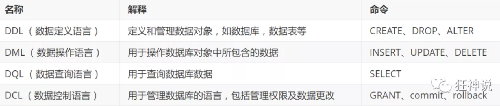
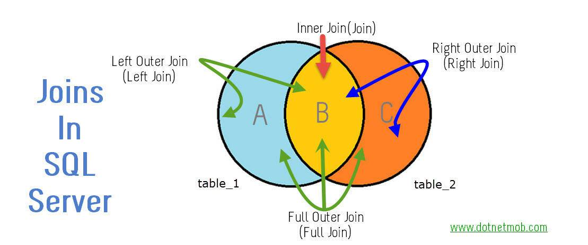
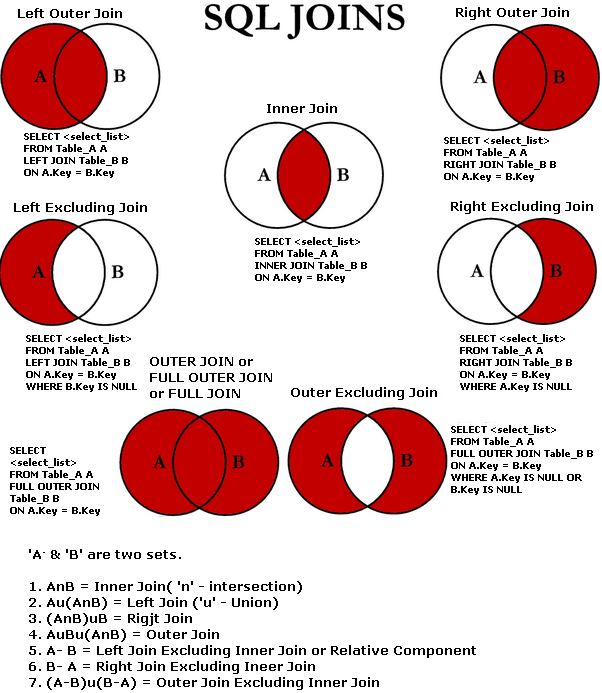

[狂神MySQL課程及筆記匯總](https://blog.csdn.net/daemon329/article/details/106170743?utm_medium=distribute.pc_relevant.none-task-blog-BlogCommendFromMachineLearnPai2-1.edu_weight&depth_1-utm_source=distribute.pc_relevant.none-task-blog-BlogCommendFromMachineLearnPai2-1.edu_weight)

## 1、 MySQL01：初識MySQL

### 初識MySQL

> 為什麼學習數據庫

1、存儲數據的方法

2、程序,網站中,大量數據如何長久保存?

3、**數據庫是幾乎軟件體系中最核心的一個存在。**

> 什麼是數據庫

數據庫( **DataBase** ,簡稱**DB** )

**概念**:長期存放在計算機內,有組織,可共享的大量數據的集合,是一個數據"倉庫"

**作用**:保存,並能安全管理數據(如:增刪改查等),減少冗餘...

**數據庫總覽 :**

- 關係型數據庫( SQL )
- - MySQL，Oracle，SQL Server，SQLite，DB2，...
  - 關係型數據庫通過外鍵關聯來建立表與表之間的關係
- 非關係型數據庫( NOSQL )
- - Redis，MongoDB，...
  - 非關係型數據庫通常指數據以對象的形式存儲在數據庫中，而對象之間的關係通過每個對象自身的屬性來決定

> 什麼是DBMS

數據庫管理系統( **D** ata **B** ase **M** anagement **S** ystem )

數據庫管理軟件, 科學組織和存儲數據, 高效地獲取和維護數據

> MySQL簡介

**概念:**是現在**流行**的**開源**的,**免費**的**關係型**數據庫

**歷史:**由瑞典MySQL AB公司開發，目前屬於Oracle旗下產品。

**特點 :**

- 免費, 開源數據庫
- 小巧, 功能齊全
- 使用便捷
- 可運行於Windows或Linux操作系統
- 可適用於中小型甚至大型網站應用

**官網:** **https://www.mysql.com/**

> 安裝MySQL

**這裡建議大家使用壓縮版,安裝快,方便.不復雜.**

**軟件下載**

window : mysql5.7 64位下載地址:

https://dev.mysql.com/get/Downloads/MySQL-5.7/mysql-5.7.19-winx64.zip

電腦是64位的就下載使用64位版本的！

Mac: 

[[Java学习]Mac下Eclipse使用JDBC连接MySql](https://www.jianshu.com/p/3cae846b8a91)

> If mysql-connector-java.jar import from local desktop  is not working, try to import the same version using maven

[How to fix cannot connect to MySQL Server - 2020](https://www.youtube.com/watch?v=SG9fZpixfC4)

MySQL server, available from:

**http://dev.mysql.com/downloads/mysql/**

> 安裝步驟 (Window)

1、下載後得到zip壓縮包.

2、解壓到自己想要安裝到的目錄，解壓到的是D:\Environment\mysql-5.7.19

3、添加環境變量：我的電腦->屬性->高級->環境變量

```php
選擇PATH,在其後面添加: 你的mysql 安裝文件下面的bin文件夾
```

4、編輯my.ini 文件,注意替換路徑位置

```php
[mysqld]
basedir=D:\Program Files\mysql-5.7\
datadir=D:\Program Files\mysql-5.7\data\
port=3306
skip-grant-tables
```

5、啟動管理員模式下的CMD，並將路徑切換至mysql下的bin目錄，然後輸入mysqld –install (安裝mysql)

6、再輸入 `mysqld --initialize-insecure --user=mysql` 初始化數據文件

7、然後再次啟動mysql 然後用命令`mysql –u root –p` 進入mysql管理界面（密碼可為空）

8、進入界面後更改root密碼

```php
update mysql.user set authentication_string=password('123456') where user='root' and Host = 'localhost';
```

9、刷新權限

```php
flush privileges;
```

10、修改my.ini文件刪除最後一句`skip-grant-tables`

11、重啟mysql即可正常使用

```php
net stop mysql
net start mysql
```

12、連接上測試出現以下結果就安裝好了

```
> mysql -uroot -p123456
```

一步步去做, 理論上是沒有任何問題的 .

如果您以前裝過,現在需要重裝,一定要將環境清理乾淨 .

Window mysql 可視化工具工具: **SQLyog** .

Mac mysql 可視化工具工具: **MySqlWorkbench** .

> 連接數據庫

打開MySQL命令窗口

- 在DOS命令行窗口進入**安裝目錄\mysql\bin**
- 可設置環境變量，設置了環境變量，可以在任意目錄打開！

**連接數據庫語句:** mysql -h服務器主機地址-u用戶名-p用戶密碼

注意: -p後面不能加空格,否則會被當做密碼的內容,導致登錄失敗 !

**幾個基本的數據庫操作命令 :**

```sql
mysql -u root -p123456 --連接數據庫
update user set password=password('123456') where user='root'; --修改密碼 
flush privileges; --刷新數據庫 
show databases; --顯示所有數據庫 
use dbname；--打開某個數據庫 
show tables; --顯示數據庫mysql中所有的表 
describe user; --顯示表mysql數據庫中user表的列信息 
create database name; --創建數據庫 
use databasename; --選擇數據庫 

exit; --退出Mysql 
? 命令關鍵詞 : 尋求幫助 
-- 表示註釋
```

## 2、MySQL02：數據庫操作



操作數據庫》操作數據庫中的表》操作數據庫中表的數據

**MySQL不區分大小寫**

### 2.1操作數據庫

1.創建數據庫

```sql
CREATE DATABASE IF NOT EXISTS westos;
```

2.刪除數據庫

```sql
DROP DATABASE IF EXISTS westos
```

3.使用數據庫

```sql
-- ``,如果你的表名或者字段名是一个特殊字符，需要带``
USE 'school'
```

4.產看數據庫

```sql
SHOW DATABASES --查看所有数据库
```

### 2.2數據庫的列類型

> 數值

- tinyint 十分小的數據1個字節
- smallint 較小的數據2個字節
- mediumint 中等大小3個字節
- **int 標準的整數4個字節（常用）**
- bigint 較大的數據8個字節
- float 浮點數4個字節
- double 浮點數8個字節（精度問題）
- **decimal 字符串形式的浮點數,金融計算的時候，一般用**

> 字符串

- char 字符串固定大小0-255
- **varchar可變字符串0-65535**（常用）
- tinytext 微型文本2^8-1
- **text文本串2^16-1** (保存大文本)

> 時間日期

java.util.Date

- date YYYY-MM-DD，日期
- time HH:mm:ss 時間格式
- **datetime YYYY-MM-DD HH:mm:ss 最常用的時間格式**
- timestamp 時間戳1970.1.1到現在的毫秒數
- year 年份表示

> 空值

- 沒有值，未知
- **注意，不要使用null進行運算**，結果為null

### 2.3數據庫的字段類型（重點）

Unsigned 未標記 (for number only)：

- 無符號的整數
- 聲明該列不能聲明負數

Zerofill 零填充：

- 0填充的

- 10的長度1 – 0000000001 不足位數用0 填充

  int (3) ---> set 5 --> 005

Auto_InCrement 自增：

- 自動增長的 , 每添加一條數據 , 自動在上一個記錄數上加 1(默認) 
- 通常用來設計唯一的主鍵index , 必須是整數類型 
- 可定義起始值和步長
  - 當前表設置步長(AUTO_INCREMENT=100) : 只影響當前表 
  - SET @@auto_increment_increment=5 ; 影響所有使用自增的表(全局)

非空NULL , not Null

- 假設設置為not null，如何不給他賦值，就會報錯
- NULL 如果不填寫，默認為NULL

Default 默認：

- 設置默認的值！
- 例如,性別字段,默認為"男" , 否則為 "女" ; 若無指定該列的值 , 則默認值為"男"的值

### 2.4 創建數據庫表

```sql
-- 目標:創建一個schoo1數據庫

-- 創建學生表(列,字段)使用SQL 創建

-- 學號int 登錄密碼varchar(20)姓名,性別varchar(2),出生日期(datatime)，家庭住址，emai1 --注意點，使用英文()，表的名稱和字段盡量使用*反引號*括起來

-- AUTO_ INCREMENT 自增

--字符串使用*單引號*括起來! 

-- 所有的語句後面加，(英文的)，最後一個不用加

-- PRIMARY KEY 主鍵，一般- 一個表只有一個唯一-的主鍵!

CREATE DATABASE school

CREATE TABLE IF NOT EXISTS `student` (
`id` int(4) NOT NULL AUTO_INCREMENT COMMENT '學號',
`name` varchar(30) NOT NULL DEFAULT '匿名' COMMENT '姓名',
`pwd` varchar(20) NOT NULL DEFAULT '123456' COMMENT '密碼',
`sex` varchar(2) NOT NULL DEFAULT '男' COMMENT '性别',
`birthday` datetime DEFAULT NULL COMMENT '生日',
`address` varchar(100) DEFAULT NULL COMMENT '地址',
`email` varchar(50) DEFAULT NULL COMMENT '郵箱',
PRIMARY KEY (`id`)
) ENGINE=InnoDB DEFAULT CHARSET=utf8
```

格式

```sql
--創建數據表 屬於DDL的一種，語法 : 

CREATE TABLE [IF NOT EXISTS] `表名`（
`字段名` 列类型[属性][索引][注释],
`字段名` 列类型[属性][索引][注释],
...
`字段名` 列类型[属性][索引][注释]
）[表类型][表的字符集设置][注释]

-- 說明 : 反引號用於區別MySQL保留字與普通字符而引入的 (鍵盤esc下面的鍵).
```

常用命令

```sql
SHOW CREATE DATABASE school -- 查看創建數據庫的語句 
SHOW CREATE TABLE student -- 查看student數據表的定義語句 
DESC student;  -- 顯示表結構 
-- 設置嚴格檢查模式(不能容錯了)SET sql_mode='STRICT_TRANS_TABLES';
```

### 2.5數據表的類型

```sql
CREATE TABLE 表名(
   -- 省略一些代碼
   -- Mysql注釋
   -- 1. # 单行注釋
   -- 2. /*...*/ 多行注釋
)ENGINE = MyISAM (or InnoDB)

-- 查看mysql所支持的引擎類型 (表類型) 
SHOW ENGINES; -- 關於數據庫引擎 
/* 
INNODB 默認使用 
MYISAM 早些年使用 
*/
-- MySQL的數據表的類型 : MyISAM , InnoDB , HEAP , BOB , CSV等... 
-- 常見的 MyISAM 與 InnoDB 類型：
```

|              | MYISAM | 信息數據庫             |
| ------------ | ------ | ---------------------- |
| 事務支持     | 不支持 | 支持                   |
| 數據行鎖定   | 不支持 | 支持                   |
| 外鍵約束     | 不支持 | 支持                   |
| 全文索引     | 支持   | 不支持                 |
| 表空間的大小 | 較小   | 較大，約為MYISAM的兩倍 |

常規使用操作：

- MYISAM 節約空間，速度較快，
- INNODB 安全性高，事務處理，多表多用戶操作

> 在物理空間存在的位置

MySQL數據表以文件方式存放在磁盤中

所有的數據庫文件都存在data目錄下，一個文件夾就對應一個數據庫

包括表文件 , 數據文件 , 以及數據庫的選項文件 位置 :

 --> Mysq\安裝目錄\data\下存放數據表 . 目錄名 （對應數據庫名） , 該目錄下文件名（對應數據表） .

本質還是文件的存儲

MySQL 引擎在物理文件上的區別

- 注意 :

  - `*. frm` -- 表結構定義文件

  - `*. MYD` -- 數據文件 ( data ) 

  - `*. MYI` -- 索引文件 ( index )

  -  InnoDB類型數據表只有一個` *.frm`文件 , 以及上一級目錄的ibdata1文件 

  - MyISAM類型數據表對應三個文件 :

    ```
    innodb.frm
    --------------
    myisam.frm
    myisam.MYD
    myisam.MYI
    ```

    

> 設置數據庫字符集編碼

我們可為數據庫,數據表,數據列設定不同的字符集

```sql
CHARTSET=UTF8	--創建時通過命令來設置
```

不設置的話，會是mysql默認的字符集編碼-（不支持中文）

可以在`my.ini`中配置默認的編碼

```sql
character-set-server=utf8
```

### 2.6修改刪除表

> 修改

```sql
-- 修改表名 : ALTER TABLE 舊表面 AS 新表名
ALTER TABLE student RENAME AS student1 
-- 增加表的字段 : ALTER TABLE 表名ADD 字段名列[屬性]
ALTER TABLE student1 ADD age INT(11) 

-- 修改表的字段（重命名，修改約束） 
--ALTER TABLE 表名 MODIFY 字段名 列类型[属性]
--ALTER TABLE 表名 CHANGE 旧字段名 新字段名 列属性[属性]
ALTER TABLE student1 MODIFY age VARCHAR(11) -- 修改約束ALTER 
TABLE student1 CHANGE age age1 INT(1) -- 字段重命名

-- 删除字段 :  ALTER TABLE 表名 DROP 字段名
ALTER TABLE student1 DROP age1
```

> 刪除

```sql
-- 删除表
-- 語法：DROP TABLE [IF EXISTS] 表名
--  IF EXISTS為可選 , 判斷是否存在該數據表 
--如刪除不存在的數據表會拋出錯誤
DROP TABLE IF EXISTS student1
```

**所有的創建和刪除操作盡量加上判斷，以免報錯**

注意點：

```sql
1. 可用反引號（`）包裹為標識符（庫名、表名、字段名、索引、別名）包裹，以避免與關鍵字重名！中文也可以作為標識符！ 

2. 每個庫目錄存在一個保存當前數據庫的選項文件db.opt。 

3. 註釋：   
單行註釋 # 註釋內容   
多行註釋 /* 註釋內容 */   
單行註釋 -- 註釋內容       (標準SQL註釋風格，要求雙破折號後加一空格符（空格、TAB、換行等）)   

4. 模式通配符：   
_  任意單個字符   
%  任意多個字符，甚至包括零字符   
單引號需要進行轉義 \'     

5. CMD命令行內的語句結束符可以為 ";", "\G", "\g"，僅影響顯示結果。其他地方還是用分號結束。 delimiter 可修改當前對話的語句結束符。 

6. SQL對大小寫不敏感 （關鍵字） 

7. 清除已有語句：\c

8. 所有的符號全部用英文
```


# 3、MySQL數據管理

### 3.1外鍵（了解）

> 外鍵概念 

如果公共關鍵字在一個關係中是主關鍵字，那麼這個公共關鍵字被稱為另一個關係的外鍵。由此可見，外鍵表示了兩個關係之間的相關聯繫。以另一個關係的外鍵作主關鍵字的表被稱為主表，具有此外鍵的表被稱為主表的從表。

 在實際操作中，將一個表的值放入第二個表來表示關聯，所使用的值是第一個表的主鍵值(在必要時可包括複合主鍵值)。此時，第二個表中保存這些值的屬性稱為外鍵(foreign key)。

 外鍵作用 

保持數據一致性，完整性，主要目的是控制存儲在外鍵表中的數據,約束。使兩張表形成關聯，外鍵只能引用外表中的列的值或使用空值。

> 方式一：在創建表的時候，增加約束（麻煩，比較複雜）
>
> ```sql
> CREATE TABLE `grade`(
> `gradeid` INT(10) NOT NULL AUTO_INCREMENT COMMENT '年級id',
> `gradename` VARCHAR(50) NOT NULL COMMENT '年级名稱',
> PRIMARY KEY (`gradeid`)
> )ENGINE=INNODB DEFAULT CHARSET=utf8
> 
> -- 學生表的 gradeid 字段 要去引用年級表的gradeid 
> -- 定義外鍵KEY 
> -- 給這個外鍵添加約束（執行引用） references 引用
> CREATE TABLE IF NOT EXISTS `student` (
> `id` INT(4) NOT NULL AUTO_INCREMENT COMMENT '學號',
> `name` VARCHAR(30) NOT NULL DEFAULT '匿名' COMMENT '姓名',
> `pwd` VARCHAR(20) NOT NULL DEFAULT '123456' COMMENT '密碼',
> `sex` VARCHAR(2) NOT NULL DEFAULT '男' COMMENT '性别',
> `birthday` DATETIME DEFAULT NULL COMMENT '出生日期',
> `gradeid` INT(10) NOT NULL COMMENT '學生年级',
> `address` VARCHAR(100) DEFAULT NULL COMMENT '家庭住址',
> `email` VARCHAR(50) DEFAULT NULL COMMENT '郵箱',
> PRIMARY KEY (`id`),
> KEY `FK_gardeid` (`gradeid`),
> CONSTRAINT `FK_gardeid` FOREIGN KEY (`gradeid`) REFERENCES `grade` (gradeid)
> )ENGINE=INNODB DEFAULT CHARSET=utf8
> ```

刪除有外鍵關係的表的時候，必須先刪除引用的表（從表），再刪除被引用的表（主表）

> 方式二： 創建表成功後添加外鍵

```sql
CREATE TABLE `grade`(
`gradeid` INT(10) NOT NULL AUTO_INCREMENT COMMENT '年级id',
`gradename` VARCHAR(50) NOT NULL COMMENT '年级名稱',
PRIMARY KEY (`gradeid`)
)ENGINE=INNODB DEFAULT CHARSET=utf8

-- 學生表的 gradeid 字段 要去引用年級表的gradeid 
-- 定義外鍵KEY 
-- 給這個外鍵添加約束（執行引用） references 引用
CREATE TABLE IF NOT EXISTS `student` (
`id` INT(4) NOT NULL AUTO_INCREMENT COMMENT '學號',
`name` VARCHAR(30) NOT NULL DEFAULT '匿名' COMMENT '姓名',
`pwd` VARCHAR(20) NOT NULL DEFAULT '123456' COMMENT '密碼',
`sex` VARCHAR(2) NOT NULL DEFAULT '男' COMMENT '性别',
`birthday` DATETIME DEFAULT NULL COMMENT '出生日期',
`gradeid` INT(10) NOT NULL COMMENT '學生年级',
`address` VARCHAR(100) DEFAULT NULL COMMENT '家庭住址',
`email` VARCHAR(50) DEFAULT NULL COMMENT '郵箱',
PRIMARY KEY (`id`)

)ENGINE=INNODB DEFAULT CHARSET=utf8

-- 創建表的時候沒有外鍵關係
ALTER TABLE `student`
ADD CONSTRAINT `FK_gradeid` FOREIGN KEY (`gradeid`) REFERENCES `grade`(`gradeid`);

-- ALTER TABLE`表` ADD CONSTRAINT 約束名 FOREIGN KEY（作為外鍵的列） 引用到哪個表的哪個字段
```

以上的操作都是物理外鍵，數據庫級別外鍵，不建議使用。（避免數據庫過多造成困擾）

**最佳實踐**

- 數據庫就是單純的表，只用來存數據，只有行（數據）和列（字段）
- 我們想使用多張表的數據，想使用外鍵（程序去實現）

> 刪除外鍵 操作：

刪除 grade 表，發現報錯 --> cannot delete or update a parent row : a foreign key constraint fails

注意 : 刪除具有主外鍵關係的表時 , 要先刪子表 , 後刪主表

````sql
-- 刪除外鍵
ALTER TABLE student DROP FOREIGN KEY FK_gradeid; 
-- 發現執行完上面的,索引還在,所以還要刪除索引 
-- 注:這個索引是建立外鍵的時候默認生成的 
ALTER TABLE student DROP INDEX FK_gradeid;
````

### 3.2 DML語言（全記住）

數據庫意義：數據存儲，數據管理

DML語言：數據操作語言

- 用於操作數據庫對像中所包含的數據 包括 : 
  - INSERT (添加數據語句) 
  - UPDATE (更新數據語句) 
  - DELETE (刪除數據語句)

3.3添加

> Insert

```sql
-- 插入语句（添加）
語法： insert into 表名（[字段一], [字段二]）values('值1'),('值2')
-- '字段1,字段2...'該部分可省略 , 但添加的值務必與表結構,數據列,順序相對應,且數量一致.

INSERT INTO `grade` (`gradename`) VALUES('大四')

-- 由於主鍵自增我們可以省略（如何不寫表的字段，他會一一匹配）
INSERT INTO `grade` VALUES('大三')
INSERT INTO `grade` (`gradeid`,`gradename`) VALUES ('大三','null')

-- 一般寫插入語句，我們一定要數據和字段一一對應。 
-- 插入多個字段
INSERT INTO `grade`(`gradename`) VALUES ('大二'),('大一');

INSERT INTO `student`(`name`) VALUES ('阿三')

INSERT INTO `student`(`name`,`pwd`,`sex`) VALUES ('小明','aaaaa','男')

INSERT INTO `student`(`name`,`pwd`,`sex`) 
VALUES ('阿四','aaaaa','男'),('阿五','23232','女')
```

注意事項：

- 字段或值之间用英文逗号隔开 .
- ' 字段1,字段2...' 该部分可省略 , 但添加的值务必与表结构,数据列,顺序相对应,且数量一致 .
- 可同时插入多条数据 , values 后用英文逗号隔开 .

```sql
INSERT INTO `student`(`name`,`pwd`,`sex`) 
VALUES ('李四','aaaaa','男'),('王五','23232','女')
```

### 3.4 修改

> update 修改誰（條件） set 原來的值=新值

```sql
-- 修改學員名字
UPDATE `student` SET `name`='囷' WHERE id =1; 

-- 不指定條件的情況下，會改動所有表
UPDATE `student` SET `name`='233' 

-- 語法： 
UPDATE 表名 SET column_name=value [,column_name2=value2,...] [WHERE condition];
-- 注意 : 
-- column_name 為要更改的數據列，帶上``
-- value 為修改後的數據 , 可以為變量 , 具體值 , 表達式或者嵌套的SELECT結果 
-- condition 為篩選條件 , 如不指定則修改該表的所有列數據
-- 多個設置的屬性之間，使用英文逗號隔開
UPDATE `student` SET `birthday`=CURRENT_TIME where `name`='李四' AND SEX = '男'
```

條件：可以簡單的理解為 : 有條件地從表中篩選數據

where 子句運算符id 等於某個值，大於某個值，在某個區間內修改

操作符返回布爾值

| 操作符      | 含義                   | 範圍          | 結果  |
| ----------- | ---------------------- | ------------- | ----- |
| =           | 等於                   | 5=6           | False |
| ！= <>      | 不等於                 | 5！=6         | True  |
| >           | 大於                   |               |       |
| <           | 小於                   |               |       |
| > =         |                        |               |       |
| <=          |                        |               |       |
| between and | 在某個範圍內，閉合區間 |               |       |
| And         | &&                     | 5> 1 and 1> 2 | False |
| Or          | \|\|                   | 5> 1 or 1> 2  | True  |


### 3.5 刪除

> delete 命令

```sql
-- 語法 
DELETE FROM 表名 [WHERE condition];
-- 注意：condition為篩選條件 , 如不指定則刪除該表的所有列數據

-- 删除数据 (避免这样写)
DELETE FROM `student`

-- 删除指定
DELETE FROM `student` where id= 1
```

> TRUNCATE 命令

作用：完全清空一個數據庫，表的結構、索引、約束等不會變

```sql
語法： TRUNCATE [TABLE] table_name; 

-- 清空年級表 
TRUNCATE grade
```


> delete 和TRUNCATE 區別

- 相同點： 都能刪除數據 , 不刪除表結構 , 但TRUNCATE速度更快 
- 不同：
  - TRUNCATE 重新設置自增列計數器會歸零
  - TRUNCATE 不會影響事務

```sql
-- 测试delete 和 truncate 區别

CREATE TABLE `test`(
`id` INT(4) NOT NULL AUTO_INCREMENT,
`coll` VARCHAR(20) NOT NULL,
PRIMARY KEY (`id`)
)ENGINE=INNODB DEFAULT CHARSET=utf8

INSERT INTO `test`(`coll`) VALUES('1'),('2'),('3')

-- 刪除表數據(不帶where條件的delete) 
DELETE FROM test; 
-- 結論:如不指定Where則刪除該表的所有列數據,自增當前值依然從原來基礎上進行,會記錄日誌.

-- 刪除表數據(truncate) 
TRUNCATE TABLE test; 
-- 結論:truncate刪除數據,自增當前值會恢復到初始值重新開始;不會記錄日誌. 

```

了解即可：`delete删除的問题`重啟數據庫，現象

同樣使用DELETE清空不同引擎的數據庫表數據.重啟數據庫服務後 

- InnoDB : 自增列從初始值重新開始（從1開始） (因為是存儲在內存中,斷電即失) 
- MyISAM : 自增列依然從上一個自增數據基礎上開始 (存在文件中,不會丟失)

# 4、DQL查詢數據（最重點）

### 4.1DQL

(Data Query Language) :數據查詢語言

- 所有的查詢操作都用它Select
- 簡單的單表查詢或多表的複雜查詢和嵌套查詢
- **數據庫中最核心的語言**
- 使用頻率最高的語言

### 4.2指定查詢字段

```sql
SELECT語法 
SELECT [ALL | DISTINCT] 
{* | table.* | [table.field1[as alias1][,table.field2[as alias2]][,...]]} 
FROM table_name [as table_alias]   
[left | right | inner join table_name2]  -- 聯合查詢   
[WHERE ...]  -- 指定結果需滿足的條件   
[GROUP BY ...]  -- 指定結果按照哪幾個字段來分組   
[HAVING]  -- 過濾分組的記錄必須滿足的次要條件   
[ORDER BY ...]  -- 指定查詢記錄按一個或多個條件排序   
[LIMIT {[offset,]row_count | row_countOFFSET offset}];    -- 指定查詢的記錄從哪條至哪條 

注意 : [ ] 括號代表可選的 , { }括號代表必選得
```

> AS 子句作為別名

 作用：

- 可給數據列取一個新別名 
- 可給表取一個新別名 
- 可把經計算或總結的結果用另一個新名稱來代替

```sql
-- 查詢 SELECT 字段 FROM 表 
語法： SELECT 字段 ... FROM 表
-- 查詢指定字段 
SELECT `StudentNo`,`StudentName` FROM student

-- 這裡是為列取別名(當然as關鍵詞可以省略) 
SELECT studentno AS 學號,studentname AS 姓名 FROM student; 
 
-- 使用as也可以為表取別名 
SELECT studentno AS 學號,studentname AS 姓名 FROM student AS s; 

-- 使用as,為查詢結果取一個新名字 
-- CONCAT()函數拼接字符串 
SELECT CONCAT('姓名:',studentname) AS 新姓名 FROM student;
```


> 去重

DISTINCT關鍵字的使用 作用 : 去掉SELECT查詢返回的記錄結果中重複的記錄 ( 返回所有列的值都相同 ) , 只返回一條 

```sql
-- # 查看哪些同學參加了考試(學號) 去除重複項 
SELECT * FROM result; -- 查看考試成績 
SELECT studentno FROM result; -- 查看哪些同學參加了考試 
SELECT DISTINCT studentno FROM result; -- 了解:DISTINCT 去除重複項 , (默認是ALL)
```

> 數據庫的列（表達式）

***數據庫中的表達式： 文本值，列，Null , 函數，計算表達式，系統變量…***

應用場景 :

- SELECT語句返回結果列中使用 
- SELECT語句中的ORDER BY , HAVING等子句中使用 
- DML語句中的 where 條件語句中使用表達式

```sql
select 表达式 from 表
-- selcet查詢中可以使用表達式 

SELECT @@auto_increment_increment; -- 查詢自增步長 
SELECT VERSION(); -- 查詢版本號 
SELECT 100*3-1 AS 計算結果; -- 表達式 

-- 學員考試成績集體提分一分查看 
SELECT studentno,StudentResult+1 AS '提分後' FROM result; 
```

避免SQL返回結果中包含 ' . ' , ' * ' 和括號等乾擾開發語言程序.


### 4.3where 條件子句

作用：用於檢索數據表中 符合條件 的記錄 

搜索條件可由一個或多個邏輯表達式組成 , 結果一般為真或假.

> 邏輯運算符

| 運算符    | 語法               | 結果   |
| --------- | ------------------ | ------ |
| and    && | a and b     a&&b   | 邏輯與 |
| or   \|\| | a or b    a \|\| b | 邏輯或 |
| Not    ！ | Not a     ！a      | 邏輯非 |

**盡量使用英文**

```sql
-- 滿足條件的查詢(where) 
SELECT Studentno,StudentResult FROM result; 

-- 查詢考試成績在95-100之間的 
SELECT Studentno,StudentResult 
FROM result 
WHERE StudentResult>=95 AND StudentResult<=100; 

-- AND也可以寫成 && 
SELECT Studentno,StudentResult 
FROM result 
WHERE StudentResult>=95 && StudentResult<=100; 

-- 模糊查詢(對應的詞:精確查詢) 
SELECT Studentno,StudentResult 
FROM result 
WHERE StudentResult BETWEEN 95 AND 100; 

-- 除了1000號同學,要其他同學的成績 
SELECT studentno,studentresult 
FROM result 
WHERE studentno!=1000; 

-- 使用NOT 
SELECT studentno,studentresult 
FROM result 
WHERE NOT studentno=1000;
```

注意： 

- 數值數據類型的記錄之間才能進行算術運算 ; 
- 相同數據類型的數據之間才能進行比較 ;

> 模糊查詢：比較運算符

| 運算符      | 語法                   | 描述                                 |
| ----------- | ---------------------- | ------------------------------------ |
| is null     | a is null              | 如果操作符為null 結果為真            |
| is not null | a is not null          | 如果操作符為not null 結果為真        |
| Between     | a between b and c      | 若a在b 和c之間則為真                 |
| Like        | a like b               | SQL匹配，如果a 匹配到b 則為真        |
| In          | a in（a1，a2，a3 ...） | 假設a 在a1,a2,a3其中的某一個中，為真 |

```sql
-- 模糊查詢 between and \ like \ in \ null -- ============================================= 
-- LIKE 
-- ============================================= 
-- 查詢姓劉的同學的學號及姓名 
-- like結合使用的通配符 : % (代表0到任意個字符) _ (一個字符) 
SELECT studentno,studentname FROM student 
WHERE studentname LIKE '劉%'; 

-- 查詢姓劉的同學,後面只有一個字的 
SELECT studentno,studentname FROM student 
WHERE studentname LIKE '劉_'; 

-- 查詢姓劉的同學,後面只有兩個字的 
SELECT studentno,studentname FROM student 
WHERE studentname LIKE '劉__'; 

-- 查詢姓名中含有 嘉 字的 
SELECT studentno,studentname FROM student 
WHERE studentname LIKE '%嘉%'; 

-- 查詢姓名中含有特殊字符的需要使用轉義符號 '\' 
-- 自定義轉義符關鍵字: ESCAPE ':' 
-- ============================================= 
-- IN 
-- ============================================= 
-- 查詢學號為1000,1001,1002的學生姓名 
SELECT studentno,studentname FROM student 
WHERE studentno IN (1000,1001,1002); 
-- 查詢地址在北京,南京,河南洛陽的學生 
SELECT studentno,studentname,address FROM student 
WHERE address IN ('台北','台中','高雄'); 
-- ============================================= 
-- NULL 空 
-- ============================================= 
-- 查詢出生日期沒有填寫的同學 
-- 不能直接寫=NULL , 這是代表錯誤的 , 用 is null 
SELECT studentname FROM student 
WHERE BornDate IS NULL; 

-- 查詢出生日期填寫的同學 
SELECT studentname FROM student 
WHERE BornDate IS NOT NULL; 

-- 查詢沒有寫家庭住址的同學(空字符串不等於null) 
SELECT studentname FROM student 
WHERE Address='' OR Address IS NULL;
```

### 4.4 聯表查詢

> JOIN 對比





```sql
/* 
連接查詢
	如需要多張數據表的數據進行查詢,則可通過連接運算符實現多個查詢 
內連接 inner join    
	查詢兩個表中的結果集中的交集 
外連接 outer join    
  左外連接 left join        
  	(以左表作為基準,右邊表來一一匹配,匹配不上的,返回左表的記錄,右表以NULL填充)    右外連接 right join        
  	(以右表作為基準,左邊表來一一匹配,匹配不上的,返回右表的記錄,左表以NULL填充)         

等值連接和非等值連接 
自連接 
*/
```


```sql
======================聯表查詢join============================= 
-- 查詢參加考試的同學（學號，姓名，考試編號，分數） 
SELECT * FROM student 
--> StudentNo / LoginPwd / StudentName / Sex / GradeId /Phone / Address / BornDate / Email / IdentityCard
SELECT * FROM result 
--> StudentNo / SubjectNo / ExamDtae / StudentResult

/* 
1. 分析需求，分析查詢的字段來自哪些表
2. 確定使用哪種連接查詢？ 7種 
確定交叉點（這兩個表中哪個數據是相同的） 
判斷的條件： 學生表中 studentNo = 成績表中 studentNo （聯表交集）

*/

-- JION（表） ON （判斷的條件）連接查詢 
-- where 等值查詢
SELECT studentNo,studentName,SubjectNo,StudentResult
FROM student AS s
INNER JOIN result AS r
WHERE s.studentNo = r.studentNo

--Right Join
SELECT s.studentNo,studentName,SubjectNo,StudentResult
FROM student AS s
RIGHT JOIN result AS r
ON s.studentNo = r.studentNo

--LEFT Join
SELECT s.studentNo,studentName,SubjectNo,StudentResult
FROM student AS s
LEFT JOIN result AS r
ON s.studentNo = r.studentNo
```

| 操作     | 描述                                         |
| -------- | -------------------------------------------- |
| 內部聯接 | 如果表中至少有一個匹配，就返回行             |
| 左聯接   | 即使左表中沒有匹配，也會從左表中返回所有的值 |
| 右吉恩   | 即使右表中沒有匹配，也會從右表中返回所有的值 |

```sql
-- 查询考的同学
SELECT s.studentNo,studentName,SubjectNo,StudentResult
FROM student AS s
LEFT JOIN result AS r
ON s.studentNo = r.studentNo
WHERE StudentResult IS NULL

-- 查詢了參加考試同學的信息：學號：學生姓名：科目名：分數
SELECT s.`studentNo`,`studentName`,`SubjectName`,`studentResult`
FROM student s
RIGHT JOIN result r
ON r.studentNo=s.studentNo
INNER JOIN `subject` sub
ON r.SubjectNo=sub.SubjectNo

-- 我要查詢哪些數據SELECT .... 
-- 從哪幾個表中查FROM 表xxx JOIN 連接的表ON 交叉條件
-- 假設存在一中多張表查詢，先查詢兩章表，然後再慢慢增加

--FROM a LEFT JOIN b 左為準
--FROM a RIGHT JOIN b 右為準
```

> 自連接

自己的表跟自己的表連接，核心：**一張表拆為兩張一樣的表**

父類 ( pid = 1)

| categoryid | categoryName |
| :--------: | :----------: |
|     2      |   信息技術   |
|     3      |   軟件開發   |
|     5      |   美術設計   |
|            |              |

子類 ( pid != 1)

| pid  | categoryid | categoryName |
| :--: | :--------: | :----------: |
|  3   |     4      |    數據庫    |
|  2   |     8      |   辦公信息   |
|  3   |     6      |   web開發    |
|  5   |     7      |    ps技術    |

操作：查詢父類對應子類關係（子類  pid == 父類categoryid）

| 父類     | 子類     |
| -------- | -------- |
| 信息技術 | 辦公信息 |
| 軟件開發 | 數據庫   |
| 軟件開發 | web開發  |
| 美術設計 | ps技術   |

```sql
/* 
自連接    
	數據表與自身進行連接 
	
需求:從一個包含欄目ID , 欄目名稱和父欄目ID的表中     
	查詢父欄目名稱和其他子欄目名稱 
*/ 

-- 創建一個表 
CREATE TABLE `category` ( 
  `categoryid` INT(10) UNSIGNED NOT NULL AUTO_INCREMENT COMMENT '主題id', 
  `pid` INT(10) NOT NULL COMMENT '父id', 
  `categoryName` VARCHAR(50) NOT NULL COMMENT '主題名字', 
  PRIMARY KEY (`categoryid`) 
) ENGINE=INNODB AUTO_INCREMENT=9 DEFAULT CHARSET=utf8 

-- 插入數據 
INSERT INTO `category` (`categoryid`, `pid`, `categoryName`) 
VALUES('2','1','信息技術'), 
('3','1','軟件開發'),
('4','3','數據庫'),
('5','1','美術設計'), 
('6','3','web開發'),
('7','5','ps技術'), 
('8','2','辦公信息'); 

-- 編寫SQL語句,將欄目的父子關係呈現出來 (父欄目名稱,子欄目名稱) 
-- 核心思想:把一張表看成兩張一模一樣的表,然後將這兩張表連接查詢(自連接) 
SELECT a.categoryName AS '父欄目',b.categoryName AS '子欄目' 
FROM category AS a,category AS b 
WHERE a.`categoryid`=b.`pid` 

-- 思考題:查詢參加了考試的同學信息(學號,學生姓名,科目名,分數) 
SELECT * FROM student 
--> StudentNo / LoginPwd / StudentName / Sex / GradeId /Phone / Address / BornDate / Email / IdentityCard
SELECT * FROM result 
--> StudentNo / SubjectNo / ExamDtae / StudentResult
SELECT * FROM grade
--> GradeId / GradeName
SELECT * FROM subject
--> SubjectNo / SubjectNmae / ClassHour / GradeId


SELECT s.studentno,studentname,subjectname,StudentResult 
FROM student s 
INNER JOIN result r 
ON r.studentno = s.studentno 
INNER JOIN `subject` sub 
ON sub.subjectno = r.subjectno 

-- 查詢學員及所屬的年級(學號,學生姓名,年級名) 
SELECT studentno AS 學號,studentname AS 學生姓名,gradename AS 年級名稱 
FROM student s 
INNER JOIN grade g 
ON s.`GradeId` = g.`GradeID` 

-- 查詢科目及所屬的年級(科目名稱,年級名稱) 
SELECT subjectname AS 科目名稱,gradename AS 年級名稱 
FROM SUBJECT sub 
INNER JOIN grade g 
ON sub.gradeid = g.gradeid 

-- 查詢 數據庫結構-1 的所有考試結果(學號 學生姓名 科目名稱 成績) 
SELECT s.studentno,studentname,subjectname,StudentResult 
FROM student s 
INNER JOIN result r 
ON r.studentno = s.studentno 
INNER JOIN `subject` sub 
ON r.subjectno = sub.subjectno 
WHERE subjectname='數據庫結構-1'

```

### 4.5分頁和排序

```sql
-- 排序：  升序ASC  降序  DESC
SELECT  xx
FROM xx
JOIN xx
WHERE  xx
ORDER BY  xx 
ASC   ||  DESC

/*============== 排序 ================ 
語法 : ORDER BY    
  ORDER BY 語句用於根據指定的列對結果集進行排序。    
  ORDER BY 語句默認按照ASC升序對記錄進行排序。    
  如果您希望按照降序對記錄進行排序，可以使用 DESC 關鍵字。     
*/ 
-- 查詢 數據庫結構-1 的所有考試結果(學號 學生姓名 科目名稱 成績) 
-- 按成績降序排序 
SELECT s.studentno,studentname,subjectname,StudentResult 
FROM student s 
INNER JOIN result r 
ON r.studentno = s.studentno 
INNER JOIN `subject` sub 
ON r.subjectno = sub.subjectno 
WHERE subjectname='數據庫結構-1' 
ORDER BY StudentResult DESC
```

> 分頁

語法 `limit(查詢起始下標，pagesize)`

```sql
/*============== 分頁 ================ 
語法 : SELECT * FROM table LIMIT [offset,] rows | rows OFFSET offset 
好處 : (用戶體驗,網絡傳輸,查詢壓力) 

推導:    
第一頁 : limit 0,5    
第二頁 : limit 5,5   
第三頁 : limit 10,5    .
.....    
第N頁 : limit (pageNo-1)*pageSzie,pageSzie    
[pageNo:頁碼,pageSize:單頁面顯示條數]     
*/


--每頁顯示5條數據 
SELECT s.studentno，studentname，subjectname，StudentResult 
FROM student s
INNER JOIN result r
ON r.studentno = s.studentno
INNER JOIN `subject` sub
ON r.subjectno = sub.subjectno
WHERE subjectname='數據庫結構-1'
ORDER BY StudentResult DESC , studentno
LIMIT 0,5

-- 第一頁 limit 0,5
-- 第二頁 limit 5,5
-- 第三頁 limit 10,5
-- 第N頁 limit 5*（n-1）,5

-- 查詢 JAVA第一學年 課程成績前10名並且分數大於80的學生信息(學號,姓名,課程名,分數) 
SELECT s.studentno,studentname,subjectname,StudentResult 
FROM student s 
INNER JOIN result r 
ON r.studentno = s.studentno 
INNER JOIN `subject` sub 
ON r.subjectno = sub.subjectno 
WHERE subjectname='JAVA第一學年' 
ORDER BY StudentResult DESC 
LIMIT 0,10
```


### 4.6 子查詢

where (這個值是計算出來的)

本質：`在where語句中嵌套一個子查詢語句`

```sql
/*============== 子查詢 ================ 
什麼是子查詢?    
  在查詢語句中的WHERE條件子句中,又嵌套了另一個查詢語句    
  嵌套查詢可由多個子查詢組成,求解的方式是由里及外;    
  子查詢返回的結果一般都是集合,故而建議使用IN關鍵字; 
*/ 

-- 查詢 數據庫結構-1 的所有考試結果(學號,科目編號,成績),並且成績降序排列 
-- 方法一:使用連接查詢
SELECT `StudentNo`,r.`SubjectName`,`StudentResult`
FROM `result` r
INNER JOIN `subject` sub
ON r.SubjectNo = sun.SubjectNo
WHERE subjectName = '數據庫結構-1'
ORDER BY StudentResult DESC

-- 方法二:使用子查詢(執行順序:由里及外)
SELECT `StudentNo`,r.`SubjectName`,`StudentResult`
FROM `result`
WHERE StudentNo=(
	SELECT SubjectNo FROM  `subject` 
    WHERE SubjectName = '數據庫結構-1'
)
ORDER BY StudentResult DESC

-- 查詢課程為 高等數學-2 且分數不小於80分的學生的學號和姓名 
-- 方法一:使用連接查詢 
SELECT s.studentno,studentname F
ROM student s 
INNER JOIN result r 
ON s.`StudentNo` = r.`StudentNo` 
INNER JOIN `subject` sub 
ON sub.`SubjectNo` = r.`SubjectNo` 
WHERE subjectname = '高等數學-2' AND StudentResult>=80 

-- 方法二:使用連接查詢+子查詢 
-- 分數不小於80分的學生的學號和姓名 
SELECT r.studentno,studentname 
FROM student s 
INNER JOIN result r 
ON s.`StudentNo`=r.`StudentNo` 
WHERE StudentResult>=80 

-- 在上面SQL基礎上,添加需求:課程為 高等數學-2 
SELECT r.studentno,studentname 
FROM student s INNER JOIN result r 
ON s.`StudentNo`=r.`StudentNo` 
WHERE StudentResult>=80 
AND subjectno=(    
  SELECT subjectno FROM `subject`    
  WHERE subjectname = '高等數學-2' 
)

-- 方法三:使用子查詢 
-- 分步寫簡單sql語句,然後將其嵌套起來
SELECT `StudentNo`,`StudentName` FROM student
WHERE StudentNo IN(
  SELECT StudentNo result WHERE StudentResult >80 AND SubjectNo =(
  SELECT SubjectNo FROM `subject` WHERE `SubjectaName`='高等数学-2'
	)
)
```

### 4.7 分組GROUP BY

```sql
-- 查詢不同課程的平均分，最高分，最低分，平均分大於80 -- 核心：（根據不同的課程分組）

SELECT `SubjectName`,AVG(StudentResult),MAX(StudentResult)
FROM result r
INNER JOIN `Subject` sub
ON r.SubjectNo=sub.SubjectNo

GROUP BY r.SubjectNo -- 通過什麼字段來分組
HAVING AVG(StudentResult)>80

```

# 5、MySQL函數

### 5.1 常用函數

```sql
-- 數學運算
SELECT ABS(-8) -- 絕對值SELECT 
CEILING(9.4) -- 向上取整
SELECT FLOOR(9.4) -- 向下取整
SELECT RAND() -- 返回0-1隨機數SELECT 
SIGN( -10) -- 判斷一個數的符號0-0 負數返回-1 正數返回1 

-- 字符串函數
SELECT CHAR_LENGTH('2323232') -- 返回字符串長度
SELECT CONCAT('我','233') -- 拼接字符串
SELECT INSERT('java',1,2,'cccc') -- 從某個位置開始替換某個長度
SELECT UPPER('abc') 
SELECT LOWER('ABC') 
SELECT REPLACE('堅持就能成功','堅持','努力') 

-- 查詢姓周的同學，改成鄒
SELECT REPLACE(studentname,'週','鄒') 
FROM student WHERE studentname LIKE '週%' 

-- 時間跟日期函數（記住） 
SELECT CURRENT_DATE() -- 獲取當前日期
SELECT CURDATE() -- 獲取當前日期
SELECT NOW() -- 獲取當前日期
SELECT LOCATIME() -- 本地時間
SELECT SYSDATE() -- 系統時間
-- 獲取年月日,時分秒
SELECT YEAR(NOW()) 
SELECT MONTH(NOW()) 
SELECT DAY(NOW()) 
SELECT HOUR(NOW()) 
SELECT MINUTE(NOW()) 
SELECT SECOND(NOW()) 

-- 系統
SELECT SYSTEM_USER() 
SELECT USER () 
SELECT VERSION()
```

### 5.2 聚合函數（常用）

| 函數名稱      | 描述                                                         |
| ------------- | ------------------------------------------------------------ |
| **COUNT（）** | 返回滿足Select條件的記錄總和數，如 select count(*) 【不建議使用 *，效率低】 |
| SUM（）       | 返回數字字段或表達式列作統計，返回一列的總和。               |
| AVG（）       | 通常為數值字段或表達列作統計，返回一列的平均值               |
| MAX（）       | 可以為數值字段，字符字段或表達式列作統計，返回最大的值。     |
| MIN（）       | 可以為數值字段，字符字段或表達式列作統計，返回最小的值。     |
| …             |                                                              |


```sql
-- 聚合函數  
/*COUNT:非空的 --> 想查詢一個表中有多少紀錄，就用這個 couny()*/  
SELECT COUNT(studentname) FROM student;  
SELECT COUNT(*) FROM student;  
SELECT COUNT(1) FROM student;  /*推薦*/    

-- 從含義上講，count(1) 與 count(*) 都表示對全部數據行的查詢（因為沒有指定）。  

-- count(字段) 會統計該字段在表中出現的次數，忽略字段為null 的情況。即不統計字段為null 的記錄。  
-- count(*) 包括了所有的列（所有行查），相當於行數，在統計結果的時候，包含字段為null 的記錄；  
-- count(1) 用1代表代碼行（只查一行），在統計結果的時候，包含字段為null 的記錄 。  

/*  
很多人認為count(1)執行的效率會比count(*)高，原因是count(*)會存在全表掃描，而count(1)可以針對一個字段進行查詢。其實不然，count(1)和count(*)都會對全表進行掃描，統計所有記錄的條數，包括那些為null的記錄，因此，它們的效率可以說是相差無幾。而count(字段)則與前兩者不同，它會統計該字段不為null的記錄條數。    
下面它們之間的一些對比：

1）在表沒有主鍵時，count(1)比count(*)快  
2）有主鍵時，主鍵作為計算條件，count(主鍵)效率最高；  
3）若表格只有一個字段，則count(*)效率較高。  
*/    

SELECT SUM(StudentResult) AS 總和 FROM result;  SELECT AVG(StudentResult) AS 平均分 FROM result;  SELECT MAX(StudentResult) AS 最高分 FROM result;  SELECT MIN(StudentResult) AS 最低分 FROM result; 

題目：  
-- 查詢不同課程的平均分,最高分,最低分  
-- 前提:根據不同的課程進行分組    

SELECT subjectname,AVG(studentresult) AS 平均分,MAX(StudentResult) AS 最高分,MIN(StudentResult) AS 最低分  
FROM result AS r  
INNER JOIN `subject` AS s  
ON r.subjectno = s.subjectno  
GROUP BY r.subjectno  --通過什麼字段來分組
HAVING 平均分>80;   

/*  
where寫在group by前面.  
要是放在分組後面的篩選  
要使用HAVING..  
因為having是從前面篩選的字段再篩選，而where是從數據表中的>字段直接進行的篩選的  
*/
```


```sql
-- ================ 內置函數 ================   
-- 數值函數  
abs(x)            -- 絕對值 abs(-10.9) = 10  
format(x, d)    -- 格式化千分位數值 format(1234567.456, 2) = 1,234,567.46  
ceil(x)            -- 向上取整 ceil(10.1) = 11  
floor(x)        -- 向下取整 floor (10.1) = 10  
round(x)        -- 四捨五入去整  
mod(m, n)        -- m%n m mod n 求餘 10%3=1  
pi()            -- 獲得圓周率  
pow(m, n)        -- m^n  
sqrt(x)            -- 算術平方根  
rand()            -- 隨機數  
truncate(x, d)    -- 截取d位小數    


-- 時間日期函數  
now(), current_timestamp();     -- 當前日期時間  
current_date();                    -- 當前日期  
current_time();                    -- 當前時間  
date('yyyy-mm-dd hh:ii:ss');    -- 獲取日期部分  
time('yyyy-mm-dd hh:ii:ss');    -- 獲取時間部分  
date_format('yyyy-mm-dd hh:ii:ss', '%d %y %a %d %m %b %j');    -- 格式化時間  
unix_timestamp();                -- 獲得unix時間戳  
from_unixtime();                -- 從時間戳獲得時間    


-- 字符串函數  
length(string)            -- string長度，字節  
char_length(string)        -- string的字符個數  
substring(str, position [,length])        -- 從str的position開始,取length個字符  
replace(str ,search_str ,replace_str)    -- 在str中用replace_str替換
search_str  instr(string ,substring)    -- 返回substring首次在string中出現的位置  
concat(string [,...])    -- 連接字串  
charset(str)            -- 返回字串字符集  
lcase(string)            -- 轉換成小寫  
left(string, length)    -- 從string2中的左邊起取length個字符  
load_file(file_name)    -- 從文件讀取內容  
locate(substring, string [,start_position])    -- 同instr,但可指定開始位置  
lpad(string, length, pad)    -- 重複用pad加在string開頭,直到字串長度為length  
ltrim(string)            -- 去除前端空格  
repeat(string, count)    -- 重複count次  
rpad(string, length, pad)    --在str後用pad補充,直到長度為length  
rtrim(string)            -- 去除後端空格  
strcmp(string1 ,string2)    -- 逐字符比較兩字串大小    


-- 聚合函數  
count()  
sum();  
max();  
min();  
avg();  
group_concat()    

-- 其他常用函數  
md5();  
default();
```


### 5.3 數據庫級別MD5加密（拓展）

什麼是MD5

MD5即Message-Digest Algorithm 5（信息-摘要算法5），用於確保信息傳輸完整一致。是計算機廣泛使用的雜湊算法之一（又譯摘要算法、哈希算法），主流編程語言普遍已有MD5實現。將數據（如漢字）運算為另一固定長度值，是雜湊算法的基礎原理，MD5的前身有MD2、MD3和MD4。

主要增強算法複雜度不可逆性。

MD5不可逆，具體的MD5是一樣的

MD5破解原理，背後有一個字典，MD5加密後的值，加密前的值

```sql
-- 新建一個表 testmd5
CREATE TABLE `testmd5`(
`id` INT(4) NOT NULL,
`name` VARCHAR(20) NOT NULL,
`pwd` VARCHAR(50) NOT NULL,
PRIMARY KEY (`id`)

)ENGINE=INNODB DEFAULT CHARSET=UTF8


-- 插入一些數據 = 明文密碼
INSERT INTO testmd5 VALUES(1,'atom','123456'),(2,'vscode','123456'),(3,'eclipse','123456')

-- 如果我們要對pwd這一列數據進行加密，語法是：
UPDATE testmd5 SET pwd=MD5(pwd) WHERE id =1		-- only加密id=1
UPDATE testmd5 SET pwd=MD5(pwd) -- 加密全部

-- 如果單獨對某個用戶(如sublime)的密碼加密 
INSERT INTO testmd5 VALUES(3,'sublime','123456')
update testmd5 set pwd = md5(pwd) where name = 'sublime';

-- 插入時加密：
INSERT INTO testmd5 VALUES(4,'emac',MD5('123456'))
INSERT INTO testmd5 VALUES(5,'vim',MD5('123456'))

-- 查詢登錄用戶信息
-- 如何校驗，將用戶傳遞過來的密碼，進行MD5加密，然後對比加密後的值
SELECT * FROM testmd5 WHERE `name`='红' AND pwd=MD5('123456')
```


# 6、事務

### 6.1 什麼是事務

**要麼都成功，要麼都失敗**

- 事務就是將一組SQL語句放在同一批次內去執行 

- 如果一個SQL語句出錯,則該批次內的所有SQL都將被取消執行 

- MySQL事務處理只支持InnoDB和BDB數據表類型

------

1. SQL執行， A給B轉賬A 1000–> 200 B200
2. SQL 執行， B收到A的錢A800 — B400

------

將一組SQL放在一個批次中執行

> 事務原則： ACID原則原子性，一致性，隔離性，持久性（臟讀，幻讀…）

**原子性**（Atomicity）

- 整個事務中的所有操作，要麼全部完成，要麼全部不完成，不可能停滯在中間某個環節。
- 事務在執行過程中發生錯誤，會被回滾（ROLLBACK）到事務開始前的狀態，就像這個事務從來沒有執行過一樣。 

**一致性（Consistency）**

事務前後的數據完整性要保持一致

- 一個事務可以封裝狀態改變（除非它是一個只讀的）。事務必須始終保持系統處於一致的狀態，不管在任何給定的時間並發事務有多少。
- 也就是說：如果事務是並發多個，系統也必須如同串行事務一樣操作。其主要特徵是保護性和不變性(Preserving an Invariant)，以轉賬案例為例，假設有五個賬戶，每個賬戶餘額是100元，那麼五個賬戶總額是500元，如果在這個5個賬戶之間同時發生多個轉賬，無論並發多少個，比如在A與B賬戶之間轉賬5元，在C與D賬戶之間轉賬10元，在B與E之間轉賬15元，五個賬戶總額也應該還是500元，這就是保護性和不變性。 

**持久性（Durability）** –事務提交

- 事務一旦提交就不可逆轉，被持久化到數據庫中

**隔離性**

- 事務產生多並發時，互不干擾

- 這種屬性有時稱為串行化，為了防止事務操作間的混淆，必須串行化或序列化請求，使得在同一時間僅有一個請求用於同一數據。 

> 隔離產生的問題

### 臟讀：

指一個事務讀取了另外一個事務未提交的數據。

### 不可重複讀：

在一個事務內讀取表中的某一行數據，多次讀取結果不同。（這個不一定是錯誤，只是某些場合不對）

### 虛讀(幻讀)

是指在一個事務內讀取到了別的事務插入的數據，導致前後讀取不一致。
（一般是行影響，多了一行）

> 執行事務

```sql
-- 使用set語句來改變自動提交模式 
SET autocommit = 0;   /*關閉*/ 
SET autocommit = 1;   /*開啟*/ -- 注意: 

--- 1.MySQL中默認是自動提交 
--- 2.使用事務時應先關閉自動提交 

-- 開始一個事務,標記事務的起始點 
START TRANSACTION   

-- 提交一個事務給數據庫 
COMMIT 

-- 將事務回滾,數據回到本次事務的初始狀態 
ROLLBACK 

-- 還原MySQL數據庫的自動提交 
SET autocommit =1; 

-- 保存點 
SAVEPOINT 保存點名稱 -- 設置一個事務保存點 
ROLLBACK TO SAVEPOINT 保存點名稱 -- 回滾到保存點 
RELEASE SAVEPOINT 保存點名稱 -- 刪除保存點
```

> 模擬場景

```sql
CREATE DATABASE shop CHARACTER SET utf8 COLLATE utf8_general_ci
USE shop
CREATE TABLE `account`(
`id` INT(3) NOT NULL AUTO_INCREMENT,
`name` VARCHAR(30) NOT NULL,
`money` DECIMAL(9,2) NOT NULL,
PRIMARY KEY (`id`)
)ENGINE=INNODB DEFAULT CHARSET=utf8

INSERT INTO account(`name`,`money`)
VALUES('A',2000),('B',10000)

-- 模擬轉賬：事務
SET autocommit = 0; -- 關閉自動提交
START TRANSACTION -- 開啟事務（一組事務）
UPDATE account SET money = money-500 WHERE `name` = 'A' -- A 轉賬給B
UPDATE account SET money = money+500 WHERE `name` = 'B' -- B 收到錢

COMMIT ; -- 提交事務
ROLLBACK ; -- 回滾

SET autocommit=1 -- 恢復默認值
```


```sql
/* 
題目 
A在線買一款價格為500元商品,網上銀行轉賬. 
A的銀行卡餘額為2000,然後給商家B支付500. 
商家B一開始的銀行卡餘額為10000 

創建數據庫shop和創建表account並插入2條數據 
*/ 
CREATE DATABASE `shop`CHARACTER SET utf8 COLLATE utf8_general_ci; USE `shop`; 

CREATE TABLE `account` ( 
  `id` INT(11) NOT NULL AUTO_INCREMENT, 
  `name` VARCHAR(32) NOT NULL, 
  `cash` DECIMAL(9,2) NOT NULL, 
  PRIMARY KEY (`id`) 
) ENGINE=INNODB DEFAULT CHARSET=utf8 

INSERT INTO account (`name`,`cash`) 
VALUES('A',2000.00),('B',10000.00) 

-- 轉賬實現 
SET autocommit = 0; -- 關閉自動提交 
START TRANSACTION;  -- 開始一個事務,標記事務的起始點 
UPDATE account SET cash=cash-500 WHERE `name`='A'; 
UPDATE account SET cash=cash+500 WHERE `name`='B'; 
COMMIT; -- 提交事務 
# rollback; 
SET autocommit = 1; -- 恢復自動提交
```


# 7、索引

> MySQL索引的建立對於MySQL的高效運行是很重要的，索引可以大大提高MySQL的檢索速度。

- 提高查詢速度
- 確保數據的唯一性
- 可以加速表和表之間的連接, 實現表與表之間的參照完整性
- 使用分組和排序子句進行數據檢索時, 可以顯著減少分組和排序的時間
- 全文檢索字段進行搜索優化.

### 7.1索引的分類

> 在一個表中，主鍵索引只能有一個，唯一索引可以有多個

- 主鍵索引（PRIMARY KEY）

  - 唯一的標識，主鍵不可重複，只能有一個列作為主鍵
  - 確定特定數據記錄在數據庫中的位置

- 唯一索引（UNIQUE KEY）

  - 避免重複的列出現，唯一索引可以重複，多個列都可以標識唯一索引

    ```sql
    CREATE TABLE `Grade`(
      `GradeID` INT(11) AUTO_INCREMENT PRIMARYKEY,
      `GradeName` VARCHAR(32) NOT NULL UNIQUE
       -- 或 UNIQUE KEY `GradeID` (`GradeID`)
    )
    ```

    

- 常規索引（KEY/INDEX）

  - 默認的，index 和 key 關鍵字都可以設置常規索引 

  - 作用 : 快速定位特定數據 

  - 注意 : 應加在查詢找條件的字段 

    不宜添加太多常規索引,影響數據的插入,刪除和修改操作

    ```sql
    CREATE TABLE `result`(    
    	-- 省略一些代碼   
    	INDEX/KEY `ind` (`studentNo`,`subjectNo`) -- 創建表時添加 ) 
      
      -- 創建後添加 
    ALTER TABLE `result` ADD INDEX `ind` (`studentNo`, `subjectNo`);
    ```

    

- 全文索引（FULLTEXT）

  - 作用 : 快速定位特定數據 
  - 注意 : 只能用於MyISAM類型的數據表 
  - 只能用於CHAR , VARCHAR , TEXT數據列類型 
  - 適合大型數據集

```sql
-- 索引的使用
-- 1.在创建表的时候给字段增加索引
-- 2.创建完毕后，增加索引

-- 显示所有的索引信息
SHOW INDEX FROM 表

-- 增加一个索引
ALTER TABLE 表 ADD FULLTEXT INDEX 索引名（字段名）

-- EXPLAIN 分析sql执行状况
EXPLAIN SELECT * FROM student -- 非全文索引


/* 
#方法一：創建表時   　　
CREATE TABLE 表名 (                
  字段名1 數據類型 [完整性約束條件…],                
  字段名2 數據類型 [完整性約束條件…],                
  [UNIQUE | FULLTEXT | SPATIAL ]   INDEX | KEY                
  [索引名] (字段名[(長度)] [ASC |DESC])                
); 

#方法二：
CREATE在已存在的表上創建索引        
CREATE [UNIQUE | FULLTEXT | SPATIAL ] INDEX 索引名                     ON 表名 (字段名[(長度)] [ASC |DESC]) ; 

#方法三：ALTER TABLE在已存在的表上創建索引        
ALTER TABLE 表名 ADD [UNIQUE | FULLTEXT | SPATIAL ] INDEX                             索引名 (字段名[(長度)] [ASC |DESC]) ;                                                         
#刪除索引：DROP INDEX 索引名 ON 表名字; 
#刪除主鍵索引: ALTER TABLE 表名 DROP PRIMARY KEY; 

#顯示索引信息: SHOW INDEX FROM student; 
*/ 

/*增加全文索引*/ 
ALTER TABLE `school`.`student` ADD FULLTEXT INDEX `studentname` (`StudentName`); 

/*EXPLAIN : 分析SQL語句執行性能*/ 
EXPLAIN SELECT * FROM student WHERE studentno='1000'; 

/*使用全文索引*/ 
-- 全文搜索通過 MATCH() 函數完成。 
-- 搜索字符串作為 against() 的參數被給定。搜索以忽略字母大小寫的方式執行。對於表中的每個記錄行，MATCH() 返回一個相關性值。即，在搜索字符串與記錄行在 MATCH() 列表中指定的列的文本之間的相似性尺度。 
EXPLAIN SELECT *FROM student WHERE MATCH(studentname) AGAINST('love'); 

/* 
開始之前，先說一下全文索引的版本、存儲引擎、數據類型的支持情況 

MySQL 5.6 以前的版本，只有 MyISAM 存儲引擎支持全文索引； 
MySQL 5.6 及以後的版本，MyISAM 和 InnoDB 存儲引擎均支持全文索引; 
只有字段的數據類型為 char、varchar、text 及其係列才可以建全文索引。 
測試或使用全文索引時，要先看一下自己的 MySQL 版本、存儲引擎和數據類型是否支持全文索引。 
*/
```

### 7.2 測試索引

```sql
-----------------------建表app_user：---------------------------
CREATE TABLE `app_user` (
`id` BIGINT(20) UNSIGNED NOT NULL AUTO_INCREMENT,
`name` VARCHAR(50) DEFAULT '',
`email` VARCHAR(50) NOT NULL,
`phone` VARCHAR(20) DEFAULT '',
`gender` TINYINT(4) UNSIGNED DEFAULT '0',
`password` VARCHAR(100) NOT NULL DEFAULT '',
`age` TINYINT(4) DEFAULT NULL,
`create_time` DATETIME DEFAULT CURRENT_TIMESTAMP,
`update_time` TIMESTAMP NOT NULL DEFAULT CURRENT_TIMESTAMP ON UPDATE CURRENT_TIMESTAMP,
PRIMARY KEY (`id`)
) ENGINE=INNODB DEFAULT CHARSET=utf8

-----------------------批量插入數據：100w-----------------------
-- 插入100萬數據
DELIMITER $$ --  寫函数之前必寫
CREATE FUNCTION mock_data()
RETURNS INT 
BEGIN
DECLARE num INT DEFAULT 1000000;
DECLARE i INT DEFAULT 0;
WHILE i<num DO
  	-- 插入語句
    INSERT INTO app_user(`name`,`email`,`phone`,`gender`,`password`,`age`)
    VALUE(CONCAT('用户',i),'56788@gmail.com',FLOOR (CONCAT('18',RAND()*9999999)),FLOOR (RAND()*2), UUID(),FLOOR (RAND()*100));
    SET i = i+1;
END WHILE;
RETURN i;
END;

SELECT mock_data();

-----------------------索引效率測試 無索引------------------------

SELECT * FROM app_user WHERE `name`='用户9999' -- 接近半秒

EXPLAIN SELECT * FROM app_user WHERE `name`='用户9999'  -- 查尋99999條紀錄
*************************** 1. row ***************************
          id: 1
select_type: SIMPLE
       table: app_user
  partitions: NULL
        type: ALL
possible_keys: NULL
        key: NULL
    key_len: NULL
        ref: NULL
        rows: 992759
    filtered: 10.00
      Extra: Using where
1 row in set, 1 warning (0.00 sec)

---------------------------創建索引-----------------------------
-- id _ 表名_字段名
-- create index on 字段
CREATE INDEX id_app_user_name ON app_user(`name`); -- 0.001 s

--------------------------測試普通索引--------------------------- 
mysql> EXPLAIN SELECT * FROM app_user WHERE name = '用户9999'\G-- 查尋一條紀錄
*************************** 1. row ***************************
          id: 1
select_type: SIMPLE
       table: app_user
  partitions: NULL
        type: ref
possible_keys: idx_app_user_name
        key: idx_app_user_name
    key_len: 203
        ref: const
        rows: 1
    filtered: 100.00
      Extra: NULL
1 row in set, 1 warning (0.00 sec)

mysql> SELECT * FROM app_user WHERE name = '用户9999';
1 row in set (0.00 sec)

mysql> SELECT * FROM app_user WHERE name = '用户9999';
1 row in set (0.00 sec)

mysql> SELECT * FROM app_user WHERE name = '用户9999';
1 row in set (0.00 sec)
```

索引在小數據的時候，用處不大，但是在大數據的時候，區別十分明顯

### 7.3 索引原則

- 索引不是越多越好
- 不要對經常變動的數據加索引
- 小數據量的表不需要加索引
- 索引一般加在常用來查詢的字段上

> 索引的數據結構

```sql
索引的數據結構 

-- 我們可以在創建上述索引的時候，為其指定索引類型，分兩類 
1. hash類型的索引：查詢單條快，範圍查詢慢 
2. btree類型的索引：b+樹，層數越多，數據量指數級增長（我們就用它，因為innodb默認支持它） 

-- 不同的存儲引擎支持的索引類型也不一樣 
1. InnoDB 支持事務，支持行級別鎖定，支持 B-tree、Full-text 等索引，不支持 Hash 索引； 
2. MyISAM 不支持事務，支持表級別鎖定，支持 B-tree、Full-text 等索引，不支持 Hash 索引； 
3. Memory 不支持事務，支持表級別鎖定，支持 B-tree、Hash 等索引，不支持 Full-text 索引； 
4. NDB 支持事務，支持行級別鎖定，支持 Hash 索引，不支持 B-tree、Full-text 等索引； 
5. Archive 不支持事務，支持表級別鎖定，不支持 B-tree、Hash、Full-text 等索引；
```

Hash 類型的索引

Btree: 默認innodb 的數據結構

<mark>閱讀： http://blog.codinglabs.org/articles/theory-of-mysql-index.html  </mark>

# 8、權限管理和備份

### 8.1用戶管理

> SQL命令操作

```sql
基本命令

/* 用戶和權限管理 */ ------------------
用戶信息表：mysql.user
本質：對這張表進行，增刪改查

-- 刷新權限
FLUSH PRIVILEGES

-- 增加用戶 
CREATE USER wong IDENTIFIED BY '123456'
CREATE USER 用戶名 IDENTIFIED BY [PASSWORD] 密碼(字符串)
  - 必須擁有mysql數據庫的全局CREATE USER權限，或擁有INSERT權限。
  - 只能創建用戶，不能賦予權限。
  - 用戶名，注意引號：如 'user_name'@'192.168.1.1'
  - 密碼也需引號，純數字密碼也要加引號
  - 要在純文本中指定密碼，需忽略PASSWORD關鍵詞。要把密碼指定為由PASSWORD()函數返回的混編值，需包含關鍵字PASSWORD


-- 設置密碼
SET PASSWORD = PASSWORD('密碼') -- 為當前用戶設置密碼
SET PASSWORD FOR 用戶名 = PASSWORD('密碼') -- 為指定用戶設置密碼

-- 重命名 rename user 原名字 to 新名字 
RENAME USER wong1 TO wong2

-- 刪除用戶 DROP USER user_name
DROP USER 用戶名

-- 分配權限/添加用戶
GRANT ALL PRIVILEGES ON *.* TO wong2
GRANT 權限列表 ON 表名 TO 用戶名 [IDENTIFIED BY [PASSWORD] 'password']
  - all privileges 表示所有權限
     - 用戶授權 ALL PRIVILEGES 全部的權限 庫，表 
     - ALL PRIVILEGES 除了給別人授權，其他都能幹
  - *.* 表示所有庫的所有表
  - 庫名.表名 表示某庫下面的某表


-- 查看權限 
SHOW GRANTS FOR root@localhost;
SHOW GRANTS FOR 用戶名
-- 查看當前用戶權限
SHOW GRANTS; 或 
SHOW GRANTS FOR CURRENT_USER; 或 
SHOW GRANTS FOR CURRENT_USER();

-- 撤銷權限 REVOKE 哪些權限，在哪個庫撤銷，給誰撤銷 
REVOKE 權限列表 ON 表名 FROM 用戶名
REVOKE ALL PRIVILEGES ON *.* FROM wong2
REVOKE ALL PRIVILEGES, GRANT OPTION FROM 用戶名 -- 撤銷所有權限
```

權限解釋

```sql
-- 權限列表
ALL [PRIVILEGES] -- 設置除GRANT OPTION之外的所有簡單權限
ALTER -- 允許使用ALTER TABLE
ALTER ROUTINE -- 更改或取消已存儲的子程序
CREATE -- 允許使用CREATE TABLE
CREATE ROUTINE -- 創建已存儲的子程序
CREATE TEMPORARY TABLES -- 允許使用CREATE TEMPORARY TABLE
CREATE USER -- 允許使用CREATE USER, DROP USER, RENAME USER和REVOKE ALL PRIVILEGES。
CREATE VIEW -- 允許使用CREATE VIEW
DELETE -- 允許使用DELETE
DROP -- 允許使用DROP TABLE
EXECUTE -- 允許用戶運行已存儲的子程序
FILE -- 允許使用SELECT...INTO OUTFILE和LOAD DATA INFILE
INDEX -- 允許使用CREATE INDEX和DROP INDEX
INSERT -- 允許使用INSERT
LOCK TABLES -- 允許對您擁有SELECT權限的表使用LOCK TABLES
PROCESS -- 允許使用SHOW FULL PROCESSLIST
REFERENCES -- 未被實施
RELOAD -- 允許使用FLUSH
REPLICATION CLIENT -- 允許用戶詢問從屬服務器或主服務器的地址
REPLICATION SLAVE -- 用於復制型從屬服務器（從主服務器中讀取二進制日誌事件）
SELECT -- 允許使用SELECT
SHOW DATABASES -- 顯示所有數據庫
SHOW VIEW -- 允許使用SHOW CREATE VIEW
SHUTDOWN -- 允許使用mysqladmin shutdown
SUPER -- 允許使用CHANGE MASTER, KILL, PURGE MASTER LOGS和SET GLOBAL語句，mysqladmin debug命令；允許您連接（一次），即使已達到max_connections。
UPDATE -- 允許使用UPDATE
USAGE -- “無權限”的同義詞
GRANT OPTION -- 允許授予權限


/* 表維護 */

-- 分析和存儲表的關鍵字分佈
ANALYZE [LOCAL | NO_WRITE_TO_BINLOG] TABLE 表名 ...
-- 檢查一個或多個表是否有錯誤
CHECK TABLE tbl_name [, tbl_name] ... [option] ...
option = {QUICK | FAST | MEDIUM | EXTENDED | CHANGED}
-- 整理數據文件的碎片
OPTIMIZE [LOCAL | NO_WRITE_TO_BINLOG] TABLE tbl_name [, tbl_name] ...
```


### 8.2 MySQL備份

為什麼備份：

- 保證重要數據不丟失
- 數據轉移

MySQL數據庫備份的方式

- 直接拷貝物理文件

- 在SQLyog這種可視化工具中手動導出

  - 在想要導出的表或者庫中，右鍵選擇備份和導出

- mysqldump備份工具

  mysqldump客戶端 

  作用 : 

  - 轉儲數據庫 
  - 蒐集數據庫進行備份 
  - 將數據轉移到另一個SQL服務器,不一定是MySQL服務器

  ```sql
  -- 導出
  1. 導出一張表 -- mysqldump -uroot -p123456 school student >D:/a.sql
  　　mysqldump -u用戶名 -p密碼 庫名 表名 > 文件名(D:/a.sql)
  2. 導出多張表 -- mysqldump -uroot -p123456 school student result >D:/a.sql
  　　mysqldump -u用戶名 -p密碼 庫名 表1 表2 表3 > 文件名(D:/a.sql)
  3. 導出所有表 -- mysqldump -uroot -p123456 school >D:/a.sql
  　　mysqldump -u用戶名 -p密碼 庫名 > 文件名(D:/a.sql)
  4. 導出一個庫 -- mysqldump -uroot -p123456 -B school >D:/a.sql
  　　mysqldump -u用戶名 -p密碼 -B 庫名 > 文件名(D:/a.sql)
  
  可以-w攜帶備份條件
  
  -- 導入
  1. 在登錄mysql的情況下：-- source D:/a.sql
  　　source 備份文件
  2. 在不登錄的情況下
  　　mysql -u用戶名 -p密碼 庫名 < 備份文件
  ```

  

# 9、規範數據庫設計

**當數據庫比較複雜的時候，我們就需要設計了**

糟糕的數據庫設計：

- 數據冗餘，浪費空間
- 數據庫插入和刪除都會麻煩，異常【屏蔽使用物理外鍵】
- 程序的性能差

良好的數據庫設計：

- 節省內存空間
- 保證數據庫的完整性
- 方便我們開發系統

軟件開發中，關於數據庫的設計

- 分析需求：分析業務和需要處理的數據庫的需求
- 概要設計：設計關係圖ER圖

**設計數據庫的步驟（個人博客）**

- 收集信息，分析需求

  - 用戶表（用戶登錄註銷，用戶的個人信息，寫博客，創建分類）
  - 分類表（文章分類，誰創建的）
  - 文章表（文章的信息）
  - 友鍊錶（友鏈信息）
  - 自定義表（系統信息，某個關鍵的字，或者某些主字段）
  - 說說表（發表心情…id ,content ,time）

- 標識實體[Entity]（把需求落地到每個字段）

  - 標識數據庫要管理的關鍵對像或實體,實體一般是名詞 

  - 標識每個實體需要存儲的詳細信息[Attribute] 

  - 標識實體之間的關係[Relationship]

- 標識實體之間的關係

  - 寫博客user–>blog
  - 創建分類user–>category
  - 關注user–>user
  - 友鏈–>links
  - 評論user–>user

### 9.2三大範式

為什麼需要數據規範化？

- 信息重複
- 更新異常
- 插入異常
- 刪除異常
  - 無法正常顯示異常
- 刪除異常
  - 丟失有效的信息

> 三大範式

**第一範式**（1NF）

原子性：目標是確保每列的原子性,保證每一列不可再分

**第二範式**（2NF）

前提：滿足第一範式

每張表只描述一件事情

**第三範式**（3NF）

前提：滿足第一範式和第二範式

第三範式需要確保數據表中的每一列數據都和主鍵直接相關，而不能間接相關。

（規範數據庫的設計）

**規範性和性能的問題**

關聯查詢的表，不得超過三張表

- 考慮商業化的需求和目標（成本和用戶體驗） 數據庫的性能更加重要
- 再規範性能的問題的時候，需要適當的考慮一下，規範性
- 故意給某些表加一些冗餘的字段（從多表，變成單表）
- 故意增加一些計算列（從大數據量降低為小數據量的查詢：索引）


# 10、JDBC(重點)

### 10.1 數據庫驅動

驅動：聲卡，顯卡，數據庫

```
													 應用程式
													/				\
數據庫廠商  				MySQL驅動					Oracle驅動
										|										|
									數據庫								數據庫
```

我們的程序會通過數據庫驅動，和數據庫打交道！

### 10.2 JDBC

SUN 公司為了簡化開發人員的（對數據庫的統一）操作，提供了一個(Java操作數據庫的)規範，JDBC

這些規範的實現由具體的廠商去做

對於開發人員來說，我們只需要掌握JDBC的接口操作即可

````
													 應用程式
													 		|
開發人員										  JDBC
													/				\
數據庫廠商  				MySQL驅動					Oracle驅動
										|										|
									數據庫								數據庫
````

java.sql

javax.sql

還需要導入數據庫驅動包

### 10.3 第一個JDBC程序

> 創建測試數據庫

```sql
CREATE DATABASE jdbcStudy CHARACTER SET utf8 COLLATE utf8_general_ci;

USE jdbcStudy;

CREATE TABLE `users`(
id INT PRIMARY KEY,
NAME VARCHAR(40),
PASSWORD VARCHAR(40),
email VARCHAR(60),
birthday DATE
);

INSERT INTO `users`(id,NAME,PASSWORD,email,birthday)
VALUES(1,'atom','123456','atom@gmail.com','1980-12-04'),
(2,'sublime','123456','sub@gmail.com','1981-12-04'),
(3,'emac','123456','emac@gmail.com','1979-12-04')
```

1, 創建一個普通項目

2, 導入數據庫驅動

```xml
	<dependency>
	   <groupId>mysql</groupId>
	   <artifactId>mysql-connector-java</artifactId>
	   <version>5.1.36</version>
	</dependency>
```

Mac + eclipse :

[[Java学习]Mac下Eclipse使用JDBC连接MySql](https://www.jianshu.com/p/3cae846b8a91)

3.編寫測試代碼

```java
package com.wong.test;

import java.sql.DriverManager;
import java.sql.ResultSet;
import java.sql.SQLException;

import com.mysql.jdbc.Connection;
import com.mysql.jdbc.Statement;

public class TestJdbc {
    public static void main(String[] args) throws ClassNotFoundException, SQLException {
        //配置信息
        //useUnicode=true&characterEncoding=utf-8 解決中文亂碼
        String url="jdbc:mysql://localhost:3306/jdbc?useUnicode=true&characterEncoding=utf-8";
        String username = "root";
        String password = "12345678";

        //1.加載驅動
        Class.forName("com.mysql.jdbc.Driver");
        //2.連接數據庫,代表數據庫
        Connection connection = (Connection) DriverManager.getConnection(url, username, password);

        //3.向數據庫發送SQL的對象Statement,PreparedStatement : CRUD
        Statement statement = (Statement) connection.createStatement();

        //4.編寫SQL
        String sql = "select * from users";

        //5.執行查詢SQL，返回一個 ResultSet ： 結果集
        ResultSet rs = statement.executeQuery(sql);

        while (rs.next()){
      System.out.println("id="+rs.getObject("id"));
      System.out.println("name="+rs.getObject("name"));
      System.out.println("password="+rs.getObject("password"));
      System.out.println("email="+rs.getObject("email"));
      System.out.println("birthday="+rs.getObject("birthday"));
        }

        //6.關閉連接，釋放資源（一定要做） 先開後關
        resultSet.close();
        statement.close();
        connection.close();
    }
}
```

步驟總結：

1. 加載驅動

2. 連接數據庫DriverManager

3. 獲取執行SQL的對象Statement

4. 獲得返回的結果集

5. 釋放連接

> 驅動程序管理器

```java
//DriverManager.registerDriver(new com.mysql.jdbc.Driver());
Class.forName("com.mysql.jdbc.Driver");//固定寫法
Connection connection= DriverManager.getConnection(url,name,password);

//connection代表數據庫
//數據庫設置自動提交
//事務提交
//事務回滾
connection.rollback();
connection.commit();
connection.setAutoCommit();
```

> 網址

```java
String url ="jdbc:mysql://localhost:3306/jdbcstudy?useUnicode=true&characterEncoding=utf8&&useSSL=false";

// mysql 	 默認port 3306
// 協議://主機地址:端口號/數據庫名？參數1&參數2&參數3

// Oracle   默認port 1521
// jdbc:oralce:thin:@localhost:1521:sid
```

> statement 執行SQL的對象pPrepareStatement 執行SQL的對象

```java
String sql="SELECT * FROM users";// 編寫Sql

statement.executeQuery();
statement.execute();
statement.executeUpdate();// 更新，插入，刪除，返回一個受影響的行數
```

> ResultSet 查詢的結果集，封裝了所以的查詢結果

獲得指定的數據類型

```java
ResultSet resultSet = statement.executeQuery(sql);//返回的結果集,結果集中封裝了我們全部查詢的結果
        resultSet.getObject();//在不知道列類型下使用
        resultSet.getString();//如果知道則指定使用
        resultSet.getInt();
```

遍歷,指針

```java
				resultSet.next(); //移動到下一個
        resultSet.afterLast();//移動到最後
        resultSet.beforeFirst();//移動到最前面
        resultSet.previous();//移動到前一行
        resultSet.absolute(row);//移動到指定行
```

> 釋放內存

```java
//6. 釋放連接
        resultSet.close();
        statement.close();
        connection.close();//耗資源
```

### 10.4statement對象

**Jdbc中的statement對像用於向數據庫發送SQL語句，想完成對數據庫的增刪改查，只需要通過這個對象向數據庫發送增刪改查語句即可。**

Statement對象的executeUpdate方法，用於向數據庫發送增、刪、改的sq|語句， executeUpdate執行完後， 將會返回一個整數(即增刪改語句導致了數據庫幾行數據發生了變化)。

Statement.executeQuery方法用於向數據庫發生查詢語句，executeQuery方法返回代表查詢結果的ResultSet對象。

> CRUD操作-create

使用executeUpdate(String sql)方法完成數據添加操作，示例操作：

```java
 Statement statement = connection.createStatement();
        String sql = "insert into user(...) values(...)";
        int num = statement.executeUpdate(sql);
        if(num>0){
            System.out.println("插入成功");
        }
```

> CRUD操作-delete

使用executeUpdate(String sql)方法完成數據刪除操作，示例操作：

```java
Statement statement = connection.createStatement();
        String sql = "delete from user where id =1";
        int num = statement.executeUpdate(sql);
        if(num>0){
            System.out.println("删除成功");
        }
```

> CURD操作-update

使用executeUpdate(String sql)方法完成數據修改操作，示例操作：

```java
Statement statement = connection.createStatement();
        String sql = "update user set name ='' where name = ''";
        int num = statement.executeUpdate(sql);
        if(num>0){
            System.out.println("修改成功");
        }
```

> CURD操作-read

使用executeUpdate(String sql)方法完成數據查詢操作，示例操作：

```java
Statement statement = connection.createStatement();
        String sql = "select * from  user where id =1";
        ResultSet rs= statement.executeQuery(sql);
        if(rs.next()){
            System.out.println("");
        }
```

> 代碼實現

1.**編寫一個jdbc鏈接數據庫的工具類**

```java
import java.io.IOException;
import java.io.InputStream;
import java.sql.*;
import java.util.Properties;

public class JdbcUtils {
    private static String driver = null;
    private static String url = null;
    private static String username = null;
    private static String password = null;
    static {
        try{
            InputStream in = JdbcUtils.class.getClassLoader().getResourceAsStream("db.properties");
            Properties properties = new Properties();
            properties.load(in);
            driver=properties.getProperty("driver");
            url=properties.getProperty("url");
            username=properties.getProperty("username");
            password=properties.getProperty("password");

            //1.驅動只用加載一次
            Class.forName(driver);

        } catch (IOException e) {
            e.printStackTrace();
        } catch (ClassNotFoundException e) {
            e.printStackTrace();
        }
    }


    //2.獲取連接
    public static Connection getConnection() throws Exception{
        return DriverManager.getConnection(url, username, password);
    }
    //3.釋放資源
    public static void release(Connection conn, Statement st, ResultSet rs) throws SQLException {

        if(rs!=null){
            rs.close();
        }
        if (st!=null){
            st.close();
        }
        if(conn!=null){
            conn.close();
        }

    }
}
```

**編寫一個db.properties配置文件存放鏈接數據的地址，用戶名密碼**

> 項目的默認路徑（src目錄）下創建 db.properties 屬性文件
>
> 使用類路徑的讀取方式。
>
> 其中/ 表示classpath的根目錄 
>
> 在java項目中，classpath的根目錄從bin目錄開始 
>
> 在web項目中，classpath的根目錄從WEB-INF/classes目錄開始 只要是在src下面的文件，
>
> 無論java項目還是web項目都會自動拷貝到classPath下，在Java項目中是bin目錄下，而在web項目下是WEB-INF/classes目錄下
>
> ClassPath : 指的是：WEB-INF\classes這個目錄下，通常把文件放在src文件夾下，或者新建文件並且添加到build path即可。 IDE在同步文件到tomcat時會自動將文件放在classes下。
>
>  Properties文件名首字母不能大寫，
>
> [JAVA WEB 获取properties文件，存放路径 及 获取路径]((https://blog.csdn.net/tragedyxd/article/details/46830943?utm_medium=distribute.pc_relevant.none-task-blog-BlogCommendFromMachineLearnPai2-9.channel_param&depth_1-utm_source=distribute.pc_relevant.none-task-blog-BlogCommendFromMachineLearnPai2-9.channel_param))

```properties
driver=com.mysql.jdbc.Driver
url=jdbc:mysql://localhost:3306/jdbcstudy?userUnicode=true&characterEncoding=utf8
username=root
password=123456
```

2, **調用我們編寫的工具類，實現插入一條數據**

```java
import com.utils.jdbcutils;
import java.sql.Connection;
import java.sql.SQLException;
import java.sql.Statement;

public class testsql {
    public static void main(String[] args) throws SQLException {
        Connection connection=null;
        Statement statement=null;
        try {
           connection = jdbcutils.getConnection(); //獲取數據庫鏈接
           statement = connection.createStatement();//獲取sql執行對象
            String sql="INSERT INTO users(`NAME`,`PASSWORD`,`email`,`birthday`) VALUES" +
                    "('三三','1234','098@gmail.com','1997-06-05')";
            int i = statement.executeUpdate(sql);
            if(i>0) System.out.println("插入成功");

        }catch (Exception e){
            e.printStackTrace();

        }finally {
              jdbcutils.release(connection,statement,null);
        }
    }
}
```

**編寫增刪改的方法statement.executeUpdate（）**

增

```java
import com.utils.jdbcutils;
import java.sql.Connection;
import java.sql.SQLException;
import java.sql.Statement;

public class testinsert {


    public static void main(String[] args) throws SQLException {
        Connection connection=null;
        Statement statement=null;
        try {
           connection = jdbcutils.getConnection(); //獲取數據庫鏈接
           statement = connection.createStatement();//獲取sql執行對象
            String sql="INSERT INTO users(`NAME`,`PASSWORD`,`email`,`birthday`) VALUES" +
                    "('三三','1234','7642@gmail.com','1997-06-05')";
            int i = statement.executeUpdate(sql);
            if(i>0) System.out.println("插入成功");

        }catch (Exception e){
            e.printStackTrace();

        }finally {
              jdbcutils.release(connection,statement,null);
        }
    }
}
```

刪

```java
import com.utils.jdbcutils;
import java.sql.Connection;
import java.sql.SQLException;
import java.sql.Statement;

public class testdelete {


    public static void main(String[] args) throws SQLException {
        Connection connection=null;
        Statement statement=null;
        try {
           connection = jdbcutils.getConnection(); //獲取數據庫鏈接
           statement = connection.createStatement();//獲取sql執行對象
            String sql="DELETE from `users` WHERE id = 4";
            int i = statement.executeUpdate(sql);
            if(i>0) System.out.println("删除成功");

        }catch (Exception e){
            e.printStackTrace();

        }finally {
            jdbcutils.release(connection,statement,null);
        }
    }
}
```

改

```java
import com.utils.jdbcutils;
import java.sql.Connection;
import java.sql.SQLException;
import java.sql.Statement;

public class testupdata {


    public static void main(String[] args) throws SQLException {
        Connection connection=null;
        Statement statement=null;
        try {
            connection = jdbcutils.getConnection(); //獲取數據庫鏈接
           statement = connection.createStatement();//獲取sql執行對象
            String sql="UPDATE `users` SET `NAME`='vim',`PASSWORD`='4321',`email`='9872@gmail.com' \n" +
                    "WHERE id>1  ";
            int i = statement.executeUpdate(sql);
            if(i>0) System.out.println("修改成功");

        }catch (Exception e){
            e.printStackTrace();

        }finally {
            jdbcutils.release(connection,statement,null);
        }
    }
}
```

**查**

```java
import com.utils.jdbcutils;
import java.sql.Connection;
import java.sql.ResultSet;
import java.sql.SQLException;
import java.sql.Statement;

public class testselect {
    public static void main(String[] args) throws SQLException {
        Connection connection=null;
        Statement statement=null;
        ResultSet rs=null;
        try {
            //獲取連接
               connection = jdbcutils.getConnection();
               //獲取sql對象
           statement = connection.createStatement();
           //sql
            String sql="select * from users where id=1";
            //查詢獲取返回集合
            ResultSet query = statement.executeQuery(sql);
            //遍歷
            while (query.next()){
                System.out.println(query.getObject("NAME"));
                System.out.println(query.getObject("PASSWORD"));
            }
        } catch (SQLException e) {
            e.printStackTrace();
        } finally {
            jdbcutils.release(connection,statement,rs);
        }
    }
}
```


> SQL注入問題

由於程序員對輸入未進行細緻地過濾，從而執行了非法的數據查詢。 其他原因：不當的類型處理、不安全的數據庫配置、不合理的查詢集處理、不當的錯誤處理、轉義字符處理不合適、多個提交處理不當。

sql存在漏洞，會被攻擊導致數據洩露**SQL會被拼接or**

```java
import java.sql.Connection;
import java.sql.ResultSet;
import java.sql.SQLException;
import java.sql.Statement;

import com.utils.jdbcutils;

public class SQLinject {
    public static void main(String[] args) throws SQLException {
      // login("root","12345678"); 合法登入 回傳登入用戶和密碼
      // login("root","125678"); 密碼錯誤  無回傳值
      login("'' or 1=1","'' or 1=1");	 // SQL注入：顯示所有用戶密碼
    }
  
    public static void login(String username,String password) throws SQLException {
        Connection connection=null;
        Statement statement=null;
        ResultSet rs=null;
        try {
            //SELECT * FROM `users` WHERE `NAME`='' or 1=1 AND `PASSWORD`='' or 1=1 ;
            //獲取連接
            connection = jdbcutils.getConnection();
            //獲取sql對象
            statement = connection.createStatement();
            //sql
            String sql="SELECT * FROM `users` WHERE `NAME`= "+"'"+username+"'"+" AND `PASSWORD`="+"'"+password+"'";
            //查詢獲取返回集合
            ResultSet query = statement.executeQuery(sql);
            //遍歷
            while (query.next()){
                System.out.println(query.getObject("NAME"));
                System.out.println(query.getObject("PASSWORD"));
            }
        } catch (SQLException e) {
            e.printStackTrace();
        } finally {
            jdbcutils.release(connection,statement,rs);
        }
    }
}
```

### 10.5 PreparedStatement對象

PreparedStatement 可以防止SQL注入，效率更高。

PreparedStatement 防止sql注入的本質，把傳遞進來的參數當做字符
假設其中存在轉義字符,比如說`'` 會被忽略掉

1, 新增

```java
import com.utils.jdbcutils;
import java.sql.Connection;
import java.sql.PreparedStatement;
import java.sql.SQLException;
import java.util.Date;


public class testinsert {
    public static void main(String[] args) throws SQLException {
        Connection connection=null;
        PreparedStatement statement=null; // PreparedStatement對象
        try {
            connection = jdbcutils.getConnection(); //獲取數據庫鏈接
            String sql="INSERT INTO users(`ID`,`NAME`,`PASSWORD`,`email`,`birthday`) VALUES (?,?,?,?)";// 使用？佔位符代替參數
          	// 區別：預編譯sql，先寫 sql，然後不執行
            statement= connection.prepareStatement(sql);
            // 手動給參數值
            statement.setInt(1,"1");
            statement.setString(2,"atom");
            statement.setString(3,"123456");
            statement.setString(4,"atomgmail.com");
            // sql.Date		for數據庫
          	// util.Date  for Java
            statement.setDate(5, new java.sql.Date(new Date().getTime()));
          	// 執行
            int i = statement.executeUpdate();
            if(i>0) System.out.println("插入成功");

        }catch (Exception e){
            e.printStackTrace();

        }finally {
              jdbcutils.release(connection,statement,null);
        }
    }
}
```

**刪**

```java
import com.utils.jdbcutils;

import java.sql.Connection;
import java.sql.PreparedStatement;
import java.sql.SQLException;


public class testdelete {
    public static void main(String[] args) throws SQLException {
        Connection connection=null;
        PreparedStatement statement=null;
        try {
            connection = jdbcutils.getConnection(); //獲取數據庫鏈接
            String sql="DELETE from users WHERE id=?";
            statement= connection.prepareStatement(sql);
            statement.setInt(1,1);

            int i = statement.executeUpdate();

            if(i>0) System.out.println("删除成功");

        }catch (Exception e){
            e.printStackTrace();

        }finally {
            jdbcutils.release(connection,statement,null);
        }
    }
}
```

**改**

```java
import com.utils.jdbcutils;

import java.sql.Connection;
import java.sql.PreparedStatement;
import java.sql.SQLException;


public class testupdate {
    public static void main(String[] args) throws SQLException {
        Connection connection=null;
        PreparedStatement statement=null;
        try {
            connection = jdbcutils.getConnection(); //獲取數據庫鏈接
            String sql="update `users` set `NAME` =?,`PASSWORD`=? WHERE id=?";
            statement= connection.prepareStatement(sql);
            statement.setString(1,"三三");
            statement.setInt(2,"123456");
            statement.setInt(3,"2");

            int i = statement.executeUpdate();

            if(i>0) System.out.println("更新成功");

        }catch (Exception e){
            e.printStackTrace();

        }finally {
            jdbcutils.release(connection,statement,null);
        }
    }
}
```

**查**

```java
import com.utils.jdbcutils;

import java.sql.Connection;
import java.sql.PreparedStatement;
import java.sql.ResultSet;
import java.sql.SQLException;

public class testselect {
    public static void main(String[] args) throws SQLException {
        Connection connection=null;
        PreparedStatement statement=null;
        ResultSet rs=null;
        try {
            //獲取數據庫鏈接
            connection = jdbcutils.getConnection();
             //sql
            String sql="SELECT * from users WHERE id>?";
            //預編譯sql
          statement= connection.prepareStatement(sql);
           //設置參數
          statement.setInt(1,3);
          //執行sql
          rs=statement.executeQuery();
          //遍歷結果
          while (rs.next()){
              System.out.println(rs.getObject("NAME"));
          }
        } catch (SQLException e) {
            e.printStackTrace();
        }finally {
            jdbcutils.release(connection,statement,rs);
        }
    }
}
```

**防止sql注入**

```java
import com.utils.jdbcutils;

import java.sql.*;

public class LoginTest {
    public static void main(String[] args) throws SQLException {
        login("三","123456");
    }
    public static  void login(String username,String password) throws SQLException {
        Connection connection=null;
        PreparedStatement statement=null;
        ResultSet rs=null;
        try {
            //SELECT * FROM `users` WHERE `NAME`='' or 1=1 AND `PASSWORD`='' or 1=1 ;
            //獲取連接
            connection = jdbcutils.getConnection();
            //獲取sql對象
            //PreparedStatement 防止sql注入的本質，把傳遞進來的參數當做字符
            // 假設其中存在轉義字符,比如說' 會被忽略掉
            String sql="SELECT * FROM `users` WHERE `NAME`=? AND `PASSWORD`= ?";
           statement= connection.prepareStatement(sql);
            statement.setObject(1,username);
            statement.setObject(2,password);
            rs=statement.executeQuery();
            //sql

            //查詢獲取返回集合

            //遍歷
            while (rs.next()){
                System.out.println("登陆成功");

            }
        } catch (SQLException e) {
            e.printStackTrace();
        } finally {
            jdbcutils.release(connection,statement,rs);
        }
    }
}
```


防止SQL注入本質，傳遞字符帶有“ ”，轉義字符會被轉義

### 10.6 使用IDEA連接數據庫


### 10.7 JDBC事務

**要么都成功，要么都失敗**

> ACID原則

原子性：要么全部完成，要么都不完成

一致性：結果總數不變

隔離性：**多個進程互不干擾**

持久性：一旦提交不可逆，持久化到數據庫了

隔離性的問題：

臟讀： 一個事務讀取了另一個沒有提交的事務

不可重複讀：在同一個事務內，重複讀取表中的數據，表發生了改變

虛讀（幻讀）：在一個事務內，讀取到了別人插入的數據，導致前後讀出來的結果不一致

> 代碼實現

1. 開啟事務`conn.setAutoCommit(false);`

2. 一組業務執行完畢，提交事務

3. 提交事務，持久化到數據庫中

   可以在catch語句中顯示的定義回滾，但是默認失敗會回滾

   ```java
   import com.utils.jdbcutils;
   import java.sql.Connection;
   import java.sql.PreparedStatement;
   import java.sql.ResultSet;
   import java.sql.SQLException;
   
   public class transaction_01 {
       public static void main(String[] args) throws SQLException {
           Connection connection=null;
           PreparedStatement st=null;
           ResultSet rs=null;
           try {
               connection= jdbcutils.getConnection();
               //關閉數據的自動提交==開啟事務
               connection.setAutoCommit(false);
   
               String sql="UPDATE work set money=money-100 WHERE id=1";
               st= connection.prepareStatement(sql);
               st.executeUpdate();
   // int i= 1/0;
               String sql_1="UPDATE work SET money=money+100 WHERE id=2";
               st= connection.prepareStatement(sql_1);
               st.executeUpdate();
   
               // 業務完畢提交事務
               connection.commit();
               connection.setAutoCommit(true);
               System.out.println("成功");
   
           } catch (SQLException e) {
               //失敗默認回滾
               System.out.println("失敗");
               e.printStackTrace();
           }finally {
               jdbcutils.release(connection,st,rs);
           }
   
       }
   }
   ```

### 10.8數據庫連接池

數據庫連接–執行完畢–釋放

連接–釋放十分浪費資源

**池化技術**：準備一些預先的資源，過來就連接預先準備好的

常用連接數100

最少連接數：100

最大連接數： 120 業務最高承載上限

排隊等待，

等待超時：100ms

編寫連接池，實現一個接口DateSource

> 開源數據源實現(拿來即用)

DBCP

C3P0

Druid: 阿里巴巴

使用了這些數據庫連接池之後，我們在項目開發中就不需要編寫連接數據庫的代碼了

> DBCP

**DBCP連接池配置**

```properties
#連接設置
driverClassName=com.mysql.jdbc.Driver
url=jdbc:mysql://localhost:3306/jdbcstudy?userUnicode=true&characterEncoding=utf8&uesSSL=true
username=root
password=123456

#<!-- 初始化連接 -->
initialSize=10

#最大連接數量
maxActive=50

#<!-- 最大空閒連接 -->
maxIdle=20

#<!-- 最小空閒連接 -->
minIdle=5

#<!-- 超時等待時間以毫秒為單位 6000毫秒/1000等於60秒 -->
maxWait=60000

#JDBC驅動建立連接時附帶的連接屬性屬性的格式必須為這樣：【屬性名=property;】
#注意："user" 與 "password" 兩個屬性會被明確地傳遞，因此這裡不需要包含他們。

connectionProperties=useUnicode=true;characterEncoding=utf8

#指定由連接池所創建的連接的自動提交（auto-commit）狀態。
defaultAutoCommit=true

#driver default 指定由連接池所創建的連接的只讀（read-only）狀態。
#如果沒有設置該值，則“setReadOnly”方法將不被調用。 （某些驅動並不支持只讀模式，如：Informix）
defaultReadOnly=

#driver default 指定由連接池所創建的連接的事務級別（TransactionIsolation）。
#可用值為下列之一：（詳情可見javadoc。）NONE,READ_UNCOMMITTED, READ_COMMITTED, REPEATABLE_READ, SERIALIZABLE
defaultTransactionIsolation=READ_COMMITTED
```

**從數據源中獲取連接**

```java
import org.apache.commons.dbcp.BasicDataSourceFactory;
import javax.sql.DataSource;
import java.io.InputStream;
import java.sql.*;
import java.util.Properties;

public class jdbcutils_dbcp {

   private static   DataSource source=null;
    static {
        try {

            InputStream in =jdbcutils_dbcp.class.getClassLoader().getResourceAsStream("dbcpconfig.properties");
            Properties properties = new Properties();
            properties.load(in);
          //創建數據源 工廠模式--> 創建對象
             source = BasicDataSourceFactory.createDataSource(properties);


        }catch (Exception e){
            e.printStackTrace();
        }
    }


    // 獲取連接
    public static Connection getConnection() throws SQLException {
        //從數據源中獲取連接
        return source.getConnection();
    }
    //釋放連接資源
    public static void  release(Connection conn, Statement st, ResultSet rs) throws SQLException {
        if(conn!=null) conn.close();

        if(st!=null) st.close();

        if(rs!=null) rs.close();
    }
}

```

**測試連接和查詢**

```java
import java.sql.Connection;
import java.sql.PreparedStatement;
import java.sql.ResultSet;
import java.sql.SQLException;

public class testdbcp {
    public static void main(String[] args) throws SQLException {
        Connection connection=null;
        PreparedStatement statement=null;
        ResultSet rs=null;
        try {
            //獲取連接
            connection = jdbcutils_dbcp.getConnection();
            //sql
            String sql="SELECT * from users WHERE id>?";
            //預編譯sql
            statement= connection.prepareStatement(sql);
            //設置參數
            statement.setObject(1,1);
            //執行sql
            rs=statement.executeQuery();
            //遍歷結果
            while (rs.next()){
                System.out.println(rs.getObject("NAME"));
            }
        } catch (SQLException e) {
            e.printStackTrace();
        }finally {
            jdbcutils_dbcp.release(connection,statement,rs);
        }
    }
}

```

#### C3P0

**導入jar包**c3p0-0.9.1.2.jar mchange-commons-java-0.2.9.jar

```xml
<?xml version="1.0" encoding="UTF-8"?>
<c3p0-config>
   <!--
    c3p0的缺省（默認）配置
    如果在代碼中"ComboPooledDataSource ds=new ComboPooledDataSource();"這樣寫就表示使用的是c3p0的缺省（默認）-->
    <default-config>
        <property name="driverClass">com.mysql.jdbc.Driver</property>
        <property name="jdbcUrl">jdbc:mysql://localhost:3306/jdbcstudy?userUnicode=true&amp;characterEncoding=utf8&amp;uesSSL=true&amp;serverTimezone=UTC</property>
        <property name="user">root</property>
        <property name="password">123456</property>

        <property name="acquiredIncrement">5</property>
        <property name="initialPoolSize">10</property>
        <property name="minPoolSize">5</property>
        <property name="maxPoolSize">20</property>

    </default-config>

    <!--
    c3p0的命名配置
    如果在代碼中"ComboPooledDataSource ds=new ComboPooledDataSource("MySQL");"這樣寫就表示使用的是mysql的缺省（默認）-->
    <named-config name="MySQL">
        <property name="driverClass">com.mysql.jdbc.Driver</property>
        <property name="jdbcUrl">jdbc:mysql://localhost:3306/jdbcstudy?userUnicode=true&amp;characterEncoding=utf8&amp;uesSSL=true&amp;serverTimezone=UTC</property>
        <property name="user">root</property>
        <property name="password">123456</property>

        <property name="acquiredIncrement">5</property>
        <property name="initialPoolSize">10</property>
        <property name="minPoolSize">5</property>
        <property name="maxPoolSize">20</property>
    </named-config>
</c3p0-config>
```

**c3p0連接數據庫**

```java
import com.mchange.v2.c3p0.ComboPooledDataSource;
import java.sql.Connection;
import java.sql.ResultSet;
import java.sql.SQLException;
import java.sql.Statement;


public class jdbcutils_c3p0 {

   private static ComboPooledDataSource source=null;
    static {
        try {
             source= new ComboPooledDataSource("MySQL");
         //創建數據源 工廠模式--> 創建對象  
        }catch (Exception e){
            e.printStackTrace();
        }
    }
    // 獲取連接
    public static Connection getConnection() throws SQLException {
        //從數據源中獲取連接
        return source.getConnection();
    }
    //釋放連接資源
    public static void  release(Connection conn, Statement st, ResultSet rs) throws SQLException {
        if(conn!=null) conn.close();

        if(st!=null) st.close();

        if(rs!=null) rs.close();
    }
}

```

**無論使用什麼數據源本質還是一樣,DataSource 接口不會變**

```
urce ds=new ComboPooledDataSource();"這樣寫就表示使用的是c3p0的缺省（默認）–>

com.mysql.jdbc.Driver
jdbc:mysql://localhost:3306/jdbcstudy?userUnicode=true&characterEncoding=utf8&uesSSL= true&serverTimezone=UTC
root
```


```xml
    <property name="acquiredIncrement">5</property>
    <property name="initialPoolSize">10</property>
    <property name="minPoolSize">5</property>
    <property name="maxPoolSize">20</property>

</default-config>

<!--
c3p0的命名配置
如果在代碼中"ComboPooledDataSource ds=new ComboPooledDataSource("MySQL");"這樣寫就表示使用的是mysql的缺省（默認）-->
<named-config name="MySQL">
    <property name="driverClass">com.mysql.jdbc.Driver</property>
    <property name="jdbcUrl">jdbc:mysql://localhost:3306/jdbcstudy?userUnicode=true&amp;characterEncoding=utf8&amp;uesSSL=true&amp;serverTimezone=UTC</property>
    <property name="user">root</property>
    <property name="password">123456</property>

    <property name="acquiredIncrement">5</property>
    <property name="initialPoolSize">10</property>
    <property name="minPoolSize">5</property>
    <property name="maxPoolSize">20</property>
</named-config>
```


