# 狂神說Redis筆記

## 一、Nosql概述

### 為什麼使用Nosql

> 1、單機Mysql時代


90年代,一個網站的訪問量一般不會太大，單個數據庫完全夠用。隨著用戶增多，網站出現以下問題

1. 數據量增加到一定程度，單機數據庫就放不下了
2. 數據的索引（B+ Tree）,一個機器內存也存放不下
3. 訪問量變大後（讀寫混合），一台服務器承受不住。

if you have problem mention above, then you need to update 

> 2、Memcached(緩存) + Mysql + 垂直拆分（讀寫分離）

網站80%的情況都是在讀，每次都要去查詢數據庫的話就十分的麻煩！所以說我們希望減輕數據庫的壓力，我們可以使用緩存來保證效率！

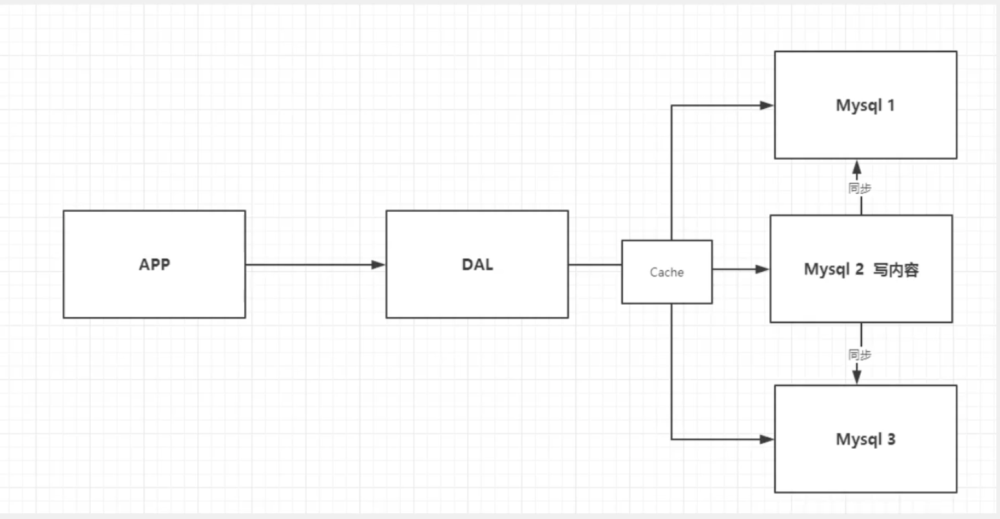

優化過程經歷了以下幾個過程：

1. 優化數據庫的數據結構和索引(難度大)
2. 文件緩存，通過IO流獲取比每次都訪問數據庫效率略高，但是流量爆炸式增長時候，IO流也承受不了
3. MemCache,當時最熱門的技術，通過在數據庫和數據庫訪問層之間加上一層緩存，第一次訪問時查詢數據庫，將結果保存到緩存，後續的查詢先檢查緩存，若有直接拿去使用，效率顯著提升。

> 3、分庫分錶+ 水平拆分+ Mysql集群

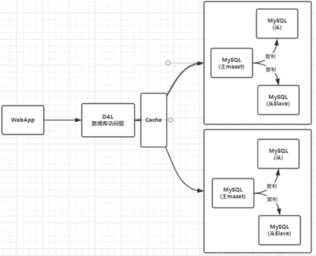

每個集群個放一些 (1/2) 數據

MylSAM：表鎖（當進行數據查詢時，會將要查的的表加鎖，其他進程只能等待）高並發下會出現嚴重的鎖問題。

Innodb：行鎖（當進行數據查詢時，只將要查詢的數據行加鎖）

> 4、如今最近的年代

 如今信息量井噴式增長，各種各樣的數據出現（用戶定位數據，圖片數據等），大數據的背景下關係型數據庫（RDBMS）無法滿足大量數據要求。Nosql數據庫就能輕鬆解決這些問題。

> 目前一個基本的互聯網項目

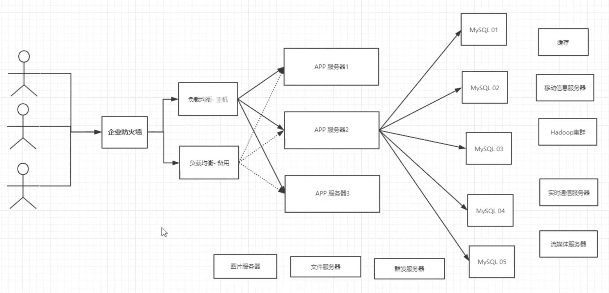

> 為什麼要用NoSQL ？

用戶的個人信息，社交網絡，地理位置。用戶自己產生的數據，用戶日誌等等爆發式增長！
這時候我們就需要使用NoSQL數據庫的，Nosql可以很好的處理以上的情況！

### 什麼是Nosql

**NoSQL = Not Only SQL（不僅僅是SQL）**

不僅結構化查詢語言

關係型數據庫：列+行，同一個表下數據的結構是一樣的。

非關係型數據庫：數據存儲沒有固定的格式，並且可以進行橫向擴展。

NoSQL泛指非關係型數據庫，隨著web2.0互聯網的誕生，傳統的關係型數據庫很難對付web2.0時代！尤其是超大規模的高並發的社區，暴露出來很多難以克服的問題，NoSQL在當今大數據環境下發展的十分迅速，Redis是發展最快的。


### Nosql特點

1. 方便擴展（數據之間沒有關係，很好擴展！）

2. 大數據量高性能（Redis一秒可以寫8萬次，讀11萬次，NoSQL的緩存記錄級，是一種細粒度的緩存，性能會比較高！）

3. 數據類型是多樣型的！（不需要事先設計數據庫，隨取隨用）

4. 傳統的RDBMS 和NoSQL

   ```
   傳統的 RDBMS(關係型數據庫) 
   - 結構化組織 
   - SQL 
   - 數據和關係都存在單獨的表中 row col 
   - 操作，數據定義語言 
   - 嚴格的一致性 
   - 基礎的事務 
   - ...
   ```

   ```
   Nosql 
   - 不僅僅是數據
   - 沒有固定的查詢語言
   - 鍵值對存儲，列存儲，文檔存儲，圖形數據庫（社交關係） 
   - 最終一致性（可以有誤差）
   - CAP定理和BASE （異地多活）
   - 高性能，高可用，高擴展
   - . ..
   ```

> 了解：3V + 3高

大數據時代的3V ：主要是**描述問題**的

1. 海量Velume
2. 多樣Variety
3. 實時Velocity

大數據時代的3高：主要是**對程序的要求**

1. 高並發
2. 高可擴（隨時水平拆分，機器不夠，可以加機器解決）
3. 高性能（保證用戶體驗）

真正在公司中的實踐：NoSQL + RDBMS 一起使用才是最強的。


### 阿里巴巴演進分析

推薦閱讀：阿里雲的這群瘋子https://yq.aliyun.com/articles/653511

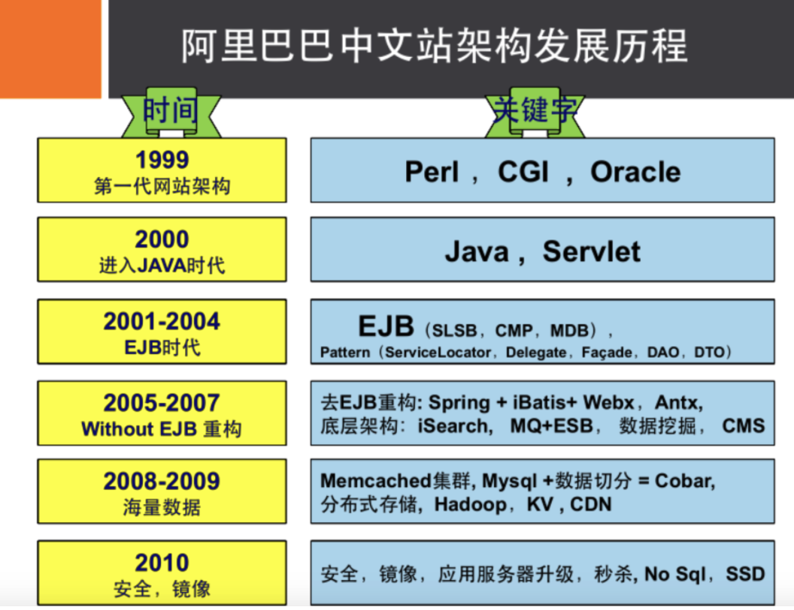

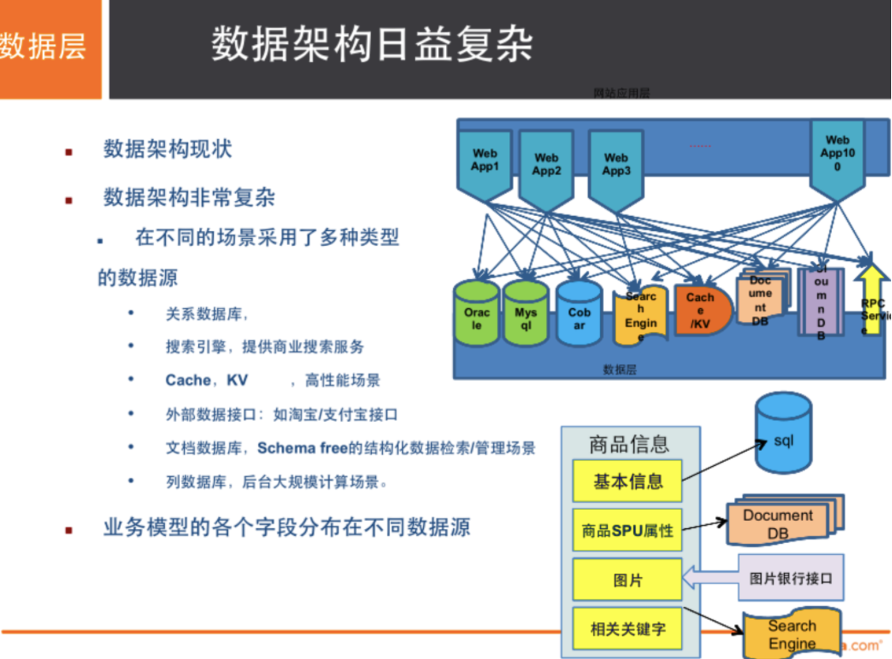

如果你未來想當一個架構師：沒有什麼是加一層解決不了的！

```bash
# 商品信息 
- 名稱、商品訊息、價格
- 一般存放在關係型數據庫：Mysql,Oracle 大公司使用的Mysql都是經過內部改動的。 

# 商品描述、評論(文字居多)
- 文檔型數據庫：MongoDB  （對IO的處理的性能較高）

# 圖片 
- 分佈式文件系統 FastDFS 
- 淘寶：TFS 
- Google: GFS 
- Hadoop: HDFS 
- 阿里雲: oss 

# 商品關鍵字 用於搜索 
- 搜索引擎：solr, elasticsearch 
- 阿里：Isearch 多隆 

# 商品熱門的波段信息 
-內存數據庫：Redis，Memcache 

# 商品交易，外部支付接口 
- 第三方應用
```

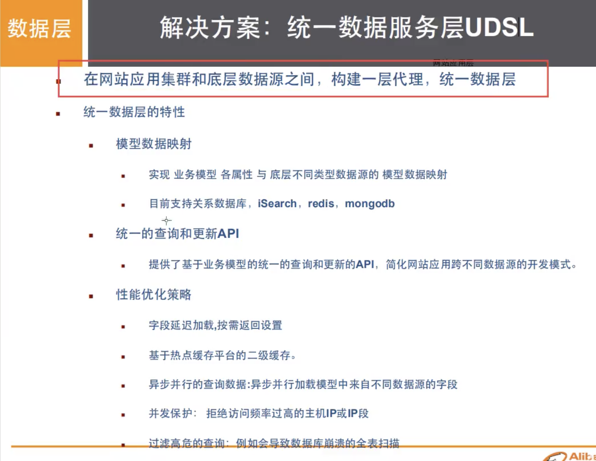

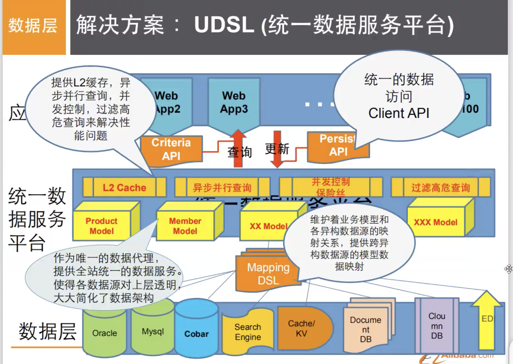

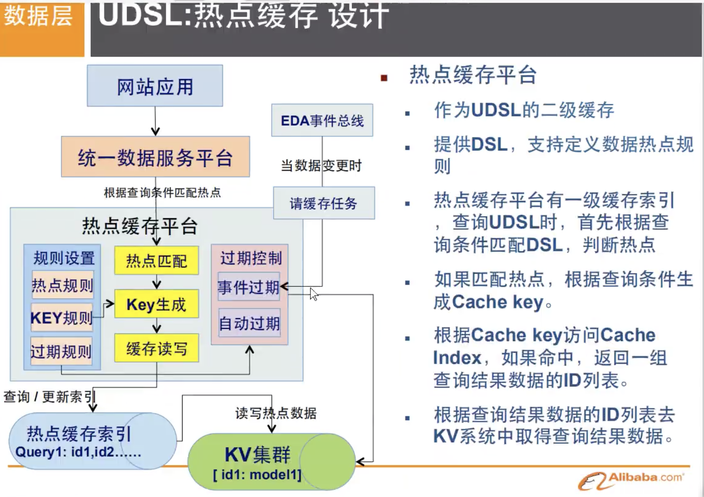

### Nosql的四大分類

> **KV鍵值對**

- 新浪：**Redis**
- 美團：Redis + Tair
- 阿里、百度：Redis + Memcache

> **文檔型數據庫（bson數據格式 和 json 一樣）：**

- **MongoDB** (掌握)
  - 基於分佈式文件存儲的數據庫。C++編寫，用於處理大量文檔。
  - MongoDB是RDBMS（關聯型）和NoSQL（非關聯型）的中間（交集）產品。MongoDB是非關係型數據庫中功能最豐富的，NoSQL中最像關係型數據庫的數據庫。
- CouthDB
- 行為數據庫（一行代表一個紀錄，一列代表不同紀錄中相同訊息類型）

> **列存儲數據庫**

- **HBase** (大數據必學)
- 分佈式文件系統

> **圖關係數據庫**

用於儲存廣告推薦，社交網絡

- **Neo4j**，InfoGrid

| **分類**                | **Examples舉例**                            | **典型應用場景**                                             | **數據模型**                                   | **優點**                                                     | **缺點**                                                     |
| :---------------------- | :------------------------------------------ | :----------------------------------------------------------- | :--------------------------------------------- | :----------------------------------------------------------- | :----------------------------------------------------------- |
| **鍵值對（key-value）** | 東京內閣/暴君，Redis，Voldemort，Oracle BDB | 內容緩存，主要用於處理大量數據的高訪問負載，也用於一些日誌系統等等。 | Key 指向Value 的鍵值對，通常用hash table來實現 | 查找速度快                                                   | 數據無結構化，通常只被當作字符串或者二進制數據               |
| **列存儲數據庫**        | 卡桑德拉，HBase，漣漪                       | 分佈式的文件系統                                             | 以列簇式存儲，將同一列數據存在一起             | 查找速度快，可擴展性強，更容易進行分佈式擴展                 | 功能相對局限                                                 |
| **文檔型數據庫**        | CouchDB，MongoDb                            | Web應用（與Key-Value類似，Value是結構化的，不同的是數據庫能夠了解Value的內容） | Key-Value對應的鍵值對，Value為結構化數據       | 數據結構要求不嚴格，表結構可變，不需要像關係型數據庫一樣需要預先定義表結構 | 查詢性能不高，而且缺乏統一的查詢語法。                       |
| **圖形(Graph)數據庫**   | Neo4J，InfoGrid，無限圖                     | 社交網絡，推薦系統等。專注於構建關係圖譜                     | 圖結構                                         | 利用圖結構相關算法。比如最短路徑尋址，N度關係查找等          | 很多時候需要對整個圖做計算才能得出需要的信息，而且這種結構不太好做分佈式的集群 |


## 二、Redis入門


### 概述

> Redis是什麼？

Redis（Remote Dictionary Server )，即遠程字典服務。

是一個開源的使用ANSI C語言編寫、支持網絡、可基於內存亦可持久化的日誌型、**Key-Value數據庫**，並提供多種語言的API。免費、開源，也被稱為結構化數據庫。

與memcached一樣，為了保證效率，**數據都是緩存在內存中**。區別的是redis會周期性的把更新的數據寫入磁盤或者把修改操作寫入追加的記錄文件，並且在此基礎上實現了master-slave(主從)同步。

> Redis能該干什麼？

1. 內存存儲、持久化，內存是斷電即失的，所以需要持久化（RDB、AOF）
2. 高效率、用於高速緩衝
3. 發布訂閱系統
4. 地圖信息分析
5. 計時器、計數器(eg：瀏覽量)
6. 。。。

> 特性

1. 多樣的數據類型

2. 耐力

3. 集群

4. 事務

   …

### 環境搭建

官網：https://redis.io/

推薦使用Linux服務器學習。

windows版本的Redis已經停更很久了…


### Windows安裝

停更很久，不建議

https://github.com/dmajkic/redis

1. 解壓安裝包

2. 開啟redis-server.exe

   默認端口6379

3. 啟動redis-cli.exe測試（redis-server不要關，另一個terminal）

   ```
   127.0.0.1:6379 > ping
   PONG --> connection success
   127.0.0.1:6379 > set name wong
   OK
   127.0.0.1:6379 > get name
   Wong
   ```

   

### Linux安裝(centos)--->not recommanded

---

[Install and Configure Redis on CentOS 7](https://www.linode.com/docs/databases/redis/install-and-configure-redis-on-centos-7/)

switch to Root 

[CentOS / RHEL 7: Install GCC (C and C++ Compiler) and Development Tools](https://www.cyberciti.biz/faq/centos-rhel-7-redhat-linux-install-gcc-compiler-development-tools/)

可以使用如下命令從普通用戶切換到root用戶：

```bash
su root
```

鍵入回車後，系統提示輸入密碼（此密碼即你平時使用的那個用戶的密碼

1. Add the EPEL repository, and update YUM to confirm your change:

   ```
   yum install epel-release
   yum update
   ```

2. Install Redis:

   ```
   yum install redis
   ```

   ```shell
   [root@centos etc]# mkdir kconfig
   [root@centos etc]# cp /etc/redis.conf kconfig
   [root@centos etc]# cd kconfig
   [root@centos etc]# ls
   redis.conf
   #act as backup , if anything go wrong ,we still have an intact redis.conf(under /etc/kconfig) to restart
   ```

3. Start Redis:

   > service 的內容，在安裝當下已經建立，詳細內容可以看 `/usr/lib/systemd/system/redis.service`

   ```shell
   # systemctl start redis
   
   (to check 是否真能連上)
   # redis-cli -p 6379			or 		redis-cli ping
   127.0.0.1:6379> ping
   > PONG --->success
   ```

   **Optional**: To automatically start Redis on boot:

   ```
   systemctl enable redis
   ```

> CentOS 7 下yum安裝時下載的rpm包存放路徑
>
> 1. centos下執行yum install xxx後。
> 2. 系統會從yum源下載rpm，將rpm放置到快取目錄下：
>
> ```
> /var/cache/yum/
> ```
>
> **說明：** yum源的不同則下載後存在的路徑也有所不同，通常都是存放在packages目錄下，如 `/var/cache/yum/***/packages`。

[centos系統怎麼檢視軟體安裝路徑、環境變數](https://codertw.com/%E4%BC%BA%E6%9C%8D%E5%99%A8/130390/)

```
rpm -qal |grep redis  #檢視redis所有安裝包的檔案儲存位置
```

除了rpm 查詢還可以通過yum search 查詢對應可以安裝的軟體包

#### CentOS 7 安裝 Google Chrome

```
$ wget https://dl.google.com/linux/direct/google-chrome-stable_current_x86_64.rpm
$ sudo yum install ./google-chrome-stable_current_*.rpm
```

確認安裝好後, 可以在 CLI 輸入以下指令啟動 Chrome:

```
$ google-chrome &
```

或者點選 “應用程式” > “互聯網” 下面便可以看到 Chrome 瀏覽器的圖示:

---

### Linux安裝(also fit cloud setting)

1、下載安裝包！`redis-5.0.8.tar.gz`，可以將安裝包先放到home目錄下，再移動至`/opt`目錄下，or you can directory download under `/opt`目錄下

Installation (from Redis official website)

Download, extract and compile Redis with:

```
$ wget https://download.redis.io/releases/redis-6.0.8.tar.gz
// $ tar xzf redis-6.0.8.tar.gz
// $ cd redis-6.0.8
// $ make
```

```shell
[root@localhost user]# mv redis-6.0.8.tar.gz /opt
[root@localhost user]# cd /opt
```

2、解壓Redis的安裝包！程序一般放在`/opt`目錄下

```shell
[root@localhost opt]# cd /opt
[root@localhost opt]# ls
containerd redis-6.0.8.tar.gz
[root@localhost opt]# tar -zxvf redis-6.0.8.tar.gz
[root@localhost opt]# ls
containerd redis-6.0.8 redis-6.0.8.tar.gz
```

3、進入解壓縮文件

```shell
[root@localhost opt]# cd redis-6.0.8
[root@localhost redis-6.0.8]# ls
```


```
 rm -rf redis-6.0.8/ 
 
#####  becareful oo using `rm -rf` , it would directory remove redis-6.0.8/ directory and everything  inside it without any notification or double check ##### 
```

4、基本環境安裝

[[【Redis】CentOS7下安装Redis服务](https://segmentfault.com/a/1190000023092469)]

```bash
# 基本環境安裝(先聯網)
yum install gcc-c++
gcc -v
gcc --version

# or you can 
yum groupinstall "Development Tools"(for local)
yum groupremove "Development Tools"
--------------------------------------------------------
**********
(the version of gcc download by `yum install` method is old, which may cause error when using `make`)
**********---> 
solution :
yum -y install centos-release-scl 
yum -y install devtoolset-9-gcc devtoolset-9-gcc-c++ devtoolset-9-binutils

#scl命令啟用只是臨時的，退出shell或重啟就會恢復原系統gcc版本
scl enable devtoolset-9 bash

#寫入系統執行腳本文件，永久生效
echo "source /opt/rh/devtoolset-9/enable" >>/etc/profile
--------------------------------------------------------

#然後進入redis目錄下執行
[root@localhost redis-6.0.8]# make
# 然後執行
[root@localhost redis-6.0.8]# make install
```

First time make

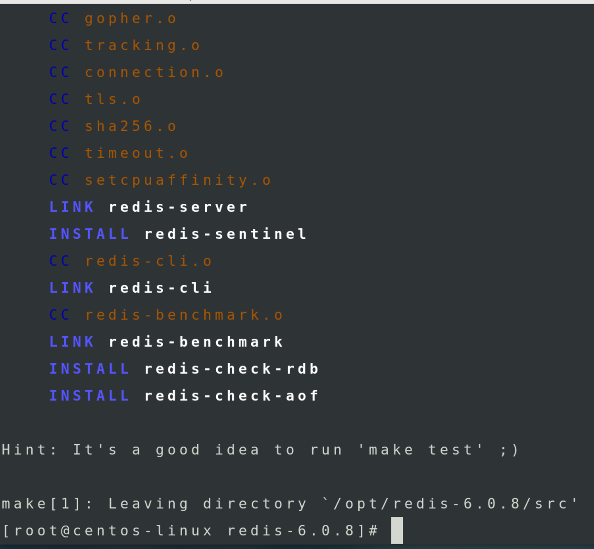

 `make`  would be quicker after first time

`# make install`

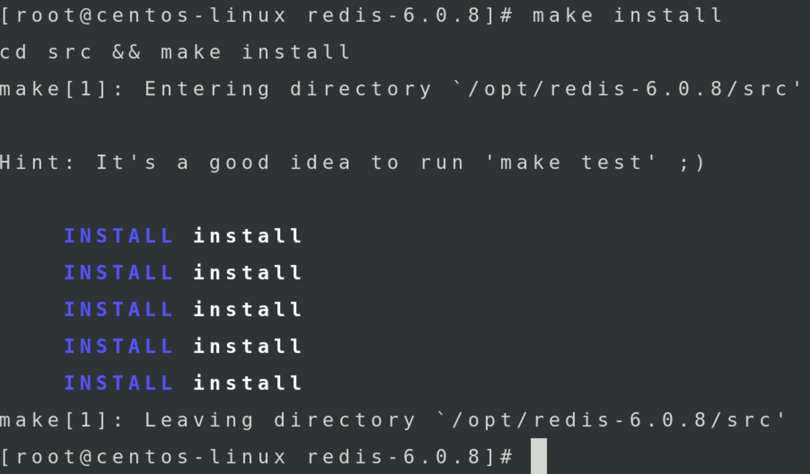

5、redis默認安裝路徑 `/usr/local/bin`

```
cd /usr/local/bin 
```

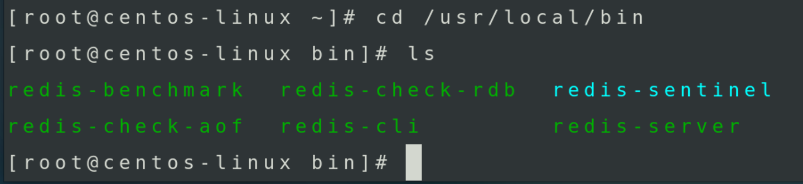

6、將redis的配置文件(`/opt/redis-6.0.8/redis.conf`)複製到程序安裝目錄`/usr/local/bin/kconfig`下

```shell
[root@localhost ~]# cd /usr/local/bin
[root@localhost bin]# mkdir kconfig
[root@localhost bin]# cp /opt/redis-6.0.8/redis.conf kconfig
[root@localhost bin]# cd kconfig/
[root@localhost kconfig]# ls
redis.conf		#use this .config to ensure when something go wrong, we still have intact redis.conf(under /usr/local/bin) to restart
```

7、redis默認不是後台啟動的，需要修改配置文件！

```vim
[root@localhost kconfig]# vim redis.conf

(about 11%, change default daemonize to yes)
(vim: enter i to alter, :wq save and quit)
#....
daemonize yes
#....
```

8、通過制定的配置文件啟動redis服務

9、使用redis-cli連接指定的端口號測試，Redis的默認端口6379

```shell
[root@localhost kconfig]# cd ..
[root@localhost bin]# pwd
/usr/local/bin 
[root@localhost bin]# redis-server kconfig/redis.conf
(to check 是否真能連上)
[root@localhost bin]# redis-cli -p 6379
127.0.0.1:6379> ping
PONG
127.0.0.1:6379> set name wong
ok
127.0.0.1:6379> get name
"wong"
127.0.0.1:6379> key *	(check up all keys)
1) "name"
```

10、查看redis進程是否開啟 (open a new terminal to test, and don't close the original one , which runs `redis-cli -p 6379` ) + root 

```shell
[root@localhost bin]# ps -ef|grep redis
```

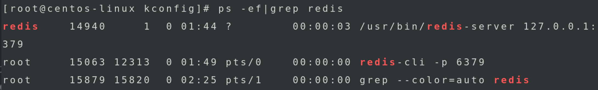

11、關閉Redis服務 `shutdown`

```shell
127.0.0.1:6379> shutdown
not connected> exit
[root@localhost bin]#
```

12、再次查看進程是否存在

```shell
[root@localhost bin]# ps -ef|grep redis
```

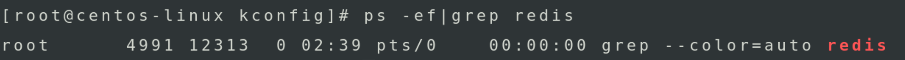

13、後面我們會使用單機多Redis啟動集群測試

### 测试性能

**redis-benchmark：**Redis官方提供的性能测试工具，参数选项如下：


簡單測試：

```shell
# 測試：100個並發連接 100000請求
redis-benchmark -h localhost -p 6379 -c 100 -n 100000
```

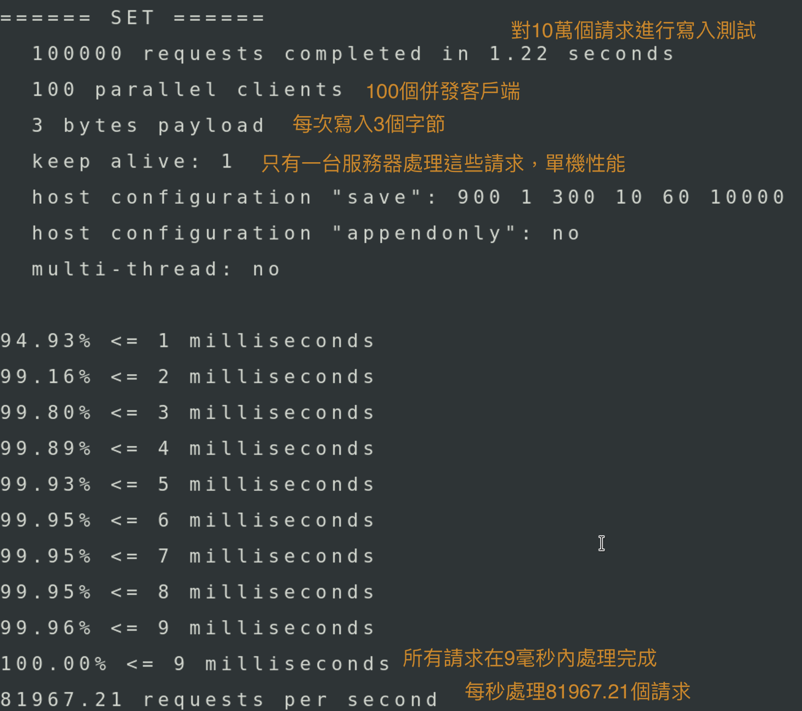

### 基礎知識(redis 不區分大小寫)

> redis默認有16個數據庫

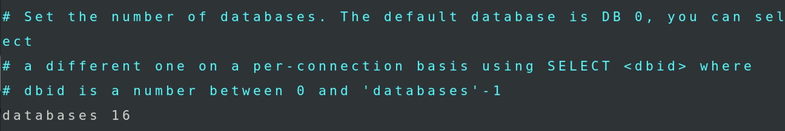

默認使用的第0個：

用 `select` 切換數據庫：

16個數據庫為：`DB 0` ~ `DB 15`

默認使用DB 0 ，可以使用`select n`切換到DB n，`dbsize`可以查看當前數據庫的大小，與key數量相關。

`keys *` ：查看當前數據庫中所有的key。

`flushdb`：清空當前數據庫中的鍵值對。

`flushall`：清空所有數據庫的鍵值對。

```shell
127.0.0.1:6379> select 3	#切換數據庫
ok
127.0.0.1:6379[3]> DBSIZE 	#check DB size
(Integer) 0
127.0.0.1:6379[3]> set name wong
ok
127.0.0.1:6379[3]> DBSIZE 	
(Integer) 1
127.0.0.1:6379[3]> select 7
ok
127.0.0.1:6379[7]> DBSIZE 
(Integer) 0
127.0.0.1:6379[7]> get name
(nil)
127.0.0.1:6379[7]> select 3
ok
127.0.0.1:6379[3]> keys *
1) "name"
127.0.0.1:6379[3]> flushdb
ok
127.0.0.1:6379[3]> keys *
(empty list or set)

127.0.0.1:6379[7]> select 0 
ok
127.0.0.1:6379[0]> key *
1) "counter:__rand_init__"
2) "name"
3) "key:__rand_init__"
4) "myset:__rand_init__"
5) "mylist"
127.0.0.1:6379[0]> flushdb
ok
127.0.0.1:6379[0]> keys *
(empty list or set)
127.0.0.1:6379[0]> set name wong
ok
127.0.0.1:6379[0]> get name
"wong"
127.0.0.1:6379[0]> select 3
ok
127.0.0.1:6379[3]> FLUSHALL
ok
127.0.0.1:6379[3]> select 0
ok
127.0.0.1:6379[0]> keys *
(empty list or set)
```


```bash
127.0.0.1:6379> config get databases # 命令行查看數據庫數量databases
1) "databases"
2) "16"

127.0.0.1:6379> select 8 # 切換數據庫 DB 8
OK
127.0.0.1:6379[8]> dbsize # 查看数据库大小
(integer) 0

# 不同數據庫之間 數據是不能互通的，並且dbsize 是根據庫中key的個數。
127.0.0.1:6379> set name sakura 
OK
127.0.0.1:6379> SELECT 8
OK
127.0.0.1:6379[8]> get name# db8中並不能獲取db0中的鍵值對。
(nil)
127.0.0.1:6379[8]> DBSIZE
(integer) 0
127.0.0.1:6379[8]> SELECT 0
OK
127.0.0.1:6379> keys *
1) "counter:__rand_int__"
2) "mylist"
3) "name"
4) "key:__rand_int__"
5) "myset:__rand_int__"
127.0.0.1:6379> DBSIZE # size和key個數相關
(integer) 5
```


> **Redis是單線程的，Redis是基於內存操作的。**

所以Redis的性能瓶頸不是CPU，而是機器內存和網絡帶寬。

那麼為什麼Redis的速度如此快呢，性能這麼高呢？QPS達到10W+，比同樣使用 key-value 的Memecahe 快

> **Redis為什麼單線程還這麼快？**

- 誤區1：高性能的服務器一定是多線程的？
- 誤區2：多線程（CPU上下文會切換！）一定比單線程效率高！

核心：Redis是將所有的數據放在內存中的，所以說使用單線程去操作效率就是最高的，多線程（CPU上下文會切換：耗時的操作！），對於內存系統來說，如果沒有上下文切換效率就是最高的，多次讀寫都是在一個CPU上的，在內存存儲數據情況下，單線程就是最佳的方案。

## 三、五大數據類型

Redis是一個開源（BSD許可），內存存儲的數據結構服務器，可用作**數據庫**，**高速緩存**和**消息隊列代理**。它支持字符串、哈希表、列表、集合、有序集合，位圖，hyperloglogs等數據類型。內置複製、Lua腳本、LRU收回、事務以及不同級別磁盤持久化功能，同時通過Redis Sentinel提供高可用，通過Redis Cluster提供自動分區。


### Redis密鑰

> 在redis中無論什麼數據類型，在數據庫中都是以key-value形式保存，通過進行對Redis-key的操作，來完成對數據庫中數據的操作。

下面學習的命令：

- `exists key`：判斷鍵是否存在
- `del key`：刪除鍵值對
- `move key db`：將鍵值對移動到指定數據庫
- `expire key second`：設置鍵值對的過期時間
- `type key`：查看value的數據類型

```bash
127.0.0.1:6379> keys * # 查看當前數據庫所有key
(empty list or set)
127.0.0.1:6379> set name wong # set key
OK
127.0.0.1:6379> set age 20
OK
127.0.0.1:6379> keys *
1) "age"
2) "name"
127.0.0.1:6379> move age 1 # 將鍵值對移動到指定數據庫
(integer) 1
127.0.0.1:6379> EXISTS age # 判斷鍵是否存在
(integer) 0 # 不存在
127.0.0.1:6379> EXISTS name
(integer) 1 # 存在
127.0.0.1:6379> SELECT 1
OK
127.0.0.1:6379[1]> keys *
1) "age"
127.0.0.1:6379[1]> del age #刪除鍵值對
(integer) 1 # 刪除個數


127.0.0.1:6379> set age 20
OK
127.0.0.1:6379> EXPIRE age 15 # 設置鍵值對的過期時間(15s)
(integer) 1 # 設置成功 開始計數
127.0.0.1:6379> ttl age # 查看key的過期剩餘時間
(integer) 13
127.0.0.1:6379> ttl age
(integer) 11
127.0.0.1:6379> ttl age
(integer) 9
127.0.0.1:6379> ttl age
(integer) -2 	# -2 表示key過期，-1表示key未設置過期時間

127.0.0.1:6379> get age # 過期的key 會被自動delete
(nil)
127.0.0.1:6379> keys *
1) "name"

127.0.0.1:6379> type name # 查看value的數據類型
string
```

關於`TTL`命令

Redis的key，通過TTL命令返回key的過期時間，一般來說有3種：

1. 當前key沒有設置過期時間，所以會返回-1.
2. 當前key有設置過期時間，而且key已經過期，所以會返回-2.
3. 當前key有設置過期時間，且key還沒有過期，故會返回key的正常剩餘時間.

關於重命名`RENAME`和`RENAMENX`

- `RENAME key newkey`修改key 的名稱
- `RENAMENX key newkey`僅當newkey 不存在時，將key 改名為newkey 。

更多命令學習：https://www.redis.net.cn/order/


### String(字符串)

普通的set、get直接略過。

```shell
# APPEND 向指定的key的value後追加字符串
127.0.0.1:6379> flushdb
127.0.0.1:6379> set key1 v1
ok
127.0.0.1:6379> get key1
"v1"
127.0.0.1:6379> APPEND key "hello"	#向指定的key的value後追加字符串
(integer) 7
127.0.0.1:6379> get key1
"v1hello"
127.0.0.1:6379> STRLEN key1		#get string length
(integer) 7
127.0.0.1:6379> APPEND name "wong"	#追加字符串，如果key不存在，就相當於 setkey
(integer) 4
127.0.0.1:6379> keys *
1) "name"
2) "key"
################################################################
# 增減value 用於儲存熱點數據：影片觀看人數
127.0.0.1:6379> set views 0
ok
127.0.0.1:6379> get views
"0"
127.0.0.1:6379> incr views	#自增一
(integer) 1
127.0.0.1:6379> incr views
(integer) 2
127.0.0.1:6379> get views
"2"
127.0.0.1:6379> decr views	#自減一
(integer) 1	
127.0.0.1:6379> decr view
(integer) 0
127.0.0.1:6379> get views
"0"
127.0.0.1:6379> INCRBY views 10	#可以設置步長，指定增量
(integer) 10
127.0.0.1:6379> DECRBY views 10	#可以設置步長，指定減量
(integer) 0
################################################################
# 字符串範圍 getrange
127.0.0.1:6379> flushdb
set key1 "helloworldhello"
ok
127.0.0.1:6379> GETRANGE key1 0 3	#獲取字符串 [0,3]
"hell"
127.0.0.1:6379> GETRANGE key1 0 -1	# == get key1
"helloworldhello"

# 替換 setrange
127.0.0.1:6379> sst key2 abcdefg
ok
127.0.0.1:6379> SETRANGE key2 1 xx	# 替換指定位置開始的字符串
"axxdef"
###############################################################
# setex (set with expire)		# 設置過期時間
# setnx (set if not exist)	# 不存在設置（在分布式鎖中會常用到）
127.0.0.1:6379> setex key3 30 "aloha"
ok
127.0.0.1:6379> setnx mykey "redis" # 如果mykey不存在, 創建mykey
(integer) 1		# 設置成功，版本號加一
127.0.0.1:6379> keys *
1) "key2"
2) "mykey"
3) "key1"
127.0.0.1:6379> ttl key3
(integer) -2 #key already expire
127.0.0.1:6379> setnx mykey "mongoDB" # 如果mykey存在, 創建失敗
(integer) 0		# 設置不成功，版本號減一
127.0.0.1:6379> get mykey 
"redis"
###############################################################
# mset mget msetnx
127.0.0.1:6379> flushdb
ok
127.0.0.1:6379> mset k1 v1 k2 v2 k3 v3	# 同時設置多個值
ok
127.0.0.1:6379> keys *
1) "k1"
2) "k2"
3) "k3"
127.0.0.1:6379> mget k1 k2 k3		# 同時獲取多個值
1) "v1"
2) "v2"
3) "v3"
127.0.0.1:6379> msetnx k1 v1 k4 v4	# msetnx 是原子性操作：要麼全部成功，要麼全部失敗
(integer) 0
127.0.0.1:6379> get k4
(nil)

# 對象
set user:1 {name:wong, age:22}	# 設置一個 user:1 對象，值為json

# 這裡的 key 是一個巧妙的設計： user:{id}:{field}，這樣的設計在 Redis 中是 ok 的
127.0.0.1:6379> mset user:1:name wong user:1:age22
ok
127.0.0.1:6379> mget user:1:name user:1:age
1) "wong"
2) "2"
###############################################################
# getset 先然後 get 再 set
127.0.0.1:6379> flushdb
127.0.0.1:6379> getset db redis	# 如果不存在值，則返回(nil)
(nil)
127.0.0.1:6379> get db
"redis"
127.0.0.1:6379> getset db mongodb	# 如果存在值，獲取原來的值，並設置新的值 ＝＝ 更新值 == CAS 比較並交換
"redis"
127.0.0.1:6379> get db
"mongodb"

# 概述 CAS（Compare-and-Swap），即比較並替換
```


| 命令                        | 描述                                                    |
| :-------------------------- | :------------------------------------------------------ |
| `APPEND key value`          | 向指定的key的value後追加字符串                          |
| `DECR/INCR key`             | 將指定key的value數值進行+1/-1(僅對於數字)               |
| `INCRBY/DECRBY key n`       | 按指定的步長對數值進行加減                              |
| `INCRBYFLOAT key n`         | 為數值加上浮點型數值                                    |
| `STRLEN key`                | 獲取key保存值的字符串長度                               |
| `GETRANGE key start end`    | 按起止位置獲取字符串（閉區間，起止位置都取）            |
| `SETRANGE key offset value` | 用指定的value 替換key中offset開始的值                   |
| `GETSET key value`          | 將給定key 的值設為value ，並返回key 的舊值(old value)。 |
| `SETNX key value`           | 僅當key不存在時進行set                                  |

String類似的使用場景：value除了是字符串還可以是數字，用途舉例：

- 計數器
- 統計多單位的數量：uid:123666：follow 0
- 粉絲數
- 對象存儲緩存

### List(列表)

> Redis列表是簡單的字符串列表，按照插入順序排序。你可以添加一個元素到列表的頭部（左邊）或者尾部（右邊）
>
> 一個列表最多可以包含232 - 1 個元素(4294967295, 每個列表超過40億個元素)。

首先我們列表，可以經過規則定義將其變為隊列、棧、雙端隊列等

```
 					-----------------------------------------
 					|		_		|		_		|		_		|		_		|		_		|
   <===   |	|	1	|	|	|	2	|	|	|	3	|	|	|	4	|	|	|	5	|	|		===>
     L    |	|	_	|	|	|	_	|	|	|	_	|	|	|	_	|	|	|	_	|	|		 R
          -----------------------------------------
          
```

正如圖Redis中List是可以進行雙端操作的，所以命令也就分為了LXXX和RLLL兩類，有時候L也表示List例如LLEN

| 命令                                    | 描述                                                         |
| :-------------------------------------- | :----------------------------------------------------------- |
| `LPUSH/RPUSH key value1[value2..]`      | 從左邊/右邊向列表中PUSH值(一個或者多個)。                    |
| `LRANGE key start end`                  | 獲取list 起止元素==（索引從左往右遞增）==                    |
| `LPUSHX/RPUSHX key value`               | 向已存在的列名中push值（一個或者多個）                       |
| `LINSERT key BEFORE|AFTER pivot value`  | 在指定列表元素的前/後插入value                               |
| `LLEN key`                              | 查看列表長度                                                 |
| `LINDEX key index`                      | 通過索引獲取列表元素                                         |
| `LSET key index value`                  | 通過索引為元素設值                                           |
| `LPOP/RPOP key`                         | 從最左邊/最右邊移除值並返回                                  |
| `RPOPLPUSH source destination`          | 將列表的尾部(右)最後一個值彈出，並返回，然後加到另一個列表的頭部 |
| `LTRIM key start end`                   | 通過下標截取指定範圍內的列表                                 |
| `LREM key count value`                  | List中是允許value重複的 `count > 0`：從頭部開始搜索然後刪除指定的value至多刪除count個`count < 0`：從尾部開始搜索… `count = 0`：刪除列表中所有的指定value。 |
| `BLPOP/BRPOP key1[key2] timout`         | 移出並獲取列表的第一個/最後一個元素， 如果列表沒有元素會阻塞列表直到等待超時或發現可彈出元素為止。 |
| `BRPOPLPUSH source destination timeout` | 和`RPOPLPUSH`功能相同，如果列表沒有元素會阻塞列表直到等待超時或發現可彈出元素為止。 |

```bash
------------------------------------------------------------
 # lpush rpush lrange
127.0.0.1:6379> flushdb
127.0.0.1:6379> LPUSH mylist k1 # LPUSH mylist=>{1} 從（頭部）左邊向列表中PUSH值
(integer) 1
127.0.0.1:6379> LPUSH mylist k2 # LPUSH mylist=>{2,1}
(integer) 2
127.0.0.1:6379> LPUSH mylist k3 # RPUSH mylist=>{2,1,3}
(integer) 3
127.0.0.1:6379> LRANGE mylist 0 -1
1) "k3"
2) "k2"
3) "k1"
127.0.0.1:6379> LPUSH mylist right
1) "k3"
2) "k2"
3) "k1"
4) "right"
127.0.0.1:6379> get mylist # 普通的get是無法獲取list值的
(error) WRONGTYPE Operation against a key holding the wrong kind of value
127.0.0.1:6379> LRANGE mylist 0 5 # LRANGE 獲取起止位置範圍內的元素
1) "k3"
2) "k2"
3) "k1"
4) "right"
127.0.0.1:6379> LRANGE mylist 0 2
1) "k3"
2) "k2"
3) "k1"
127.0.0.1:6379> LRANGE mylist 0 1
1) "k3"
2) "k2"
127.0.0.1:6379> LRANGE mylist 0 -1 # 獲取全部元素
1) "k3"
2) "k2"
3) "k1"
4) "right"
-------------------------------------------------------------
# lpop rpop lindex llen
127.0.0.1:6379> LPOP mylist # 左侧(頭部)彈出
"k3"
127.0.0.1:6379> RPOP mylist # 右侧(尾部)彈出
"right"
127.0.0.1:6379> lrange mylist 0 -1
1) "k2"
2) "k1"
127.0.0.1:6379> lindex mylist 1	#通過index下標獲取中的某一個值
"k1"
127.0.0.1:6379> lindex mylist 0
"k2"
127.0.0.1:6379> llen mylist	# 返回列表長度
(integer) 2
--------------------------------------------------------------
# lrem
# 移除list中，指定個數的值(value)，精確匹配
127.0.0.1:6379> flushdb
ok
127.0.0.1:6379> lpush list k1
(integer) 1
127.0.0.1:6379> lpush list k2
(integer) 2
127.0.0.1:6379> lpush list k3
(integer) 3
127.0.0.1:6379> lpush list k3
(integer) 4
127.0.0.1:6379> lrange list 0 -1
1) "k3"
2) "k3"
3) "k2"
4) "k1"
127.0.0.1:6379> lrem list 1 k1
(integer) 1
127.0.0.1:6379> lrange list 0 -1
1) "k3"
2) "k3"
3) "k2"
127.0.0.1:6379> lrem list 2 k3
(integer) 2
127.0.0.1:6379> lrange list 0 -1
1) "k2"
--------------------------------------------------------------
# trim修剪 ---> list裁斷
127.0.0.1:6379> flushdb
ok
127.0.0.1:6379> rpush mylist "hello"
(integer) 1
127.0.0.1:6379> rpush mylist "hello1"
(integer) 2
127.0.0.1:6379> rpush mylist "hello2"
(integer) 3
127.0.0.1:6379> rpush mylist "hello3"
(integer) 4
127.0.0.1:6379> ltrim mylist 1 2	#通過下標擷取指定的長度，這個list已經被改變了，只剩下擷取的元素
ok
127.0.0.1:6379> lrange mylist  0 -1
1) "hello1"
2) "hello2"

--------------------------------------------------------------
# rpoplpush 移除列表中最後一個元素，並將它移動至新的列表中
127.0.0.1:6379> flushdb
ok
127.0.0.1:6379> rpush mylist "hello"
(integer) 1
127.0.0.1:6379> rpush mylist "hello1"
(integer) 2
127.0.0.1:6379> rpush mylist "hello2"
(integer) 3
127.0.0.1:6379> rpoplpush mylist myotherlist
"hello2"
127.0.0.1:6379> lrange mylist 0 -1
1) "hello"
2) "hello1"
127.0.0.1:6379> lrange myotherlist 0 -1
1) "hello2"
--------------------------------------------------------------
# lset 將列表中指定下標的值，替換為另一個值 ---> 更新操作
127.0.0.1:6379> flushdb
ok
127.0.0.1:6379> exists list			# 判斷列表是否存在
(integer) 0
127.0.0.1:6379> lset list 0 item 		# 如果更新不存在的列表就會報錯
(error) ERR no such key
127.0.0.1:6379> lpush list value1
(iteger) 1
127.0.0.1:6379> lrange list 0 0
1) "value1"
127.0.0.1:6379> lset list 0 item
ok
127.0.0.1:6379> lrange list 0 0		# 如果存在，更新指定下標的值
1) "item"
127.0.0.1:6379> lset list 1 other
(error) ERR index out of range	# index start drom 0

--------------------------------------------------------------
l# insert 將具體的value, 插入指定列表中,指定的value前面後面
127.0.0.1:6379> flushdb
ok
127.0.0.1:6379> rpush mylist "hello"	# 字符串加不加引號不影響，redis會自行判斷
(integer) 1
127.0.0.1:6379> rpush mylist "world"
(integer) 2
127.0.0.1:6379> linsert mylist before "world" "other"
(integer) 3
127.0.0.1:6379> lrange mylist 0 -1
1) "hello"
2) "other"
3) "world"
127.0.0.1:6379> linsert mylist after world new
(integer) 4
127.0.0.1:6379> lrange mylist 0 -1
1) "hello"
2) "other"
3) "world"
4) "new"

--------------------------------------------------------------
# lpushx 將值 value 插入到列表 key 的表頭，當且僅當 key 存在並且是一個列表。 
# 和 LPUSH key value [value …] 命令相反，當 key 不存在時， LPUSHX 命令什麼也不做

#對空列表執行LPUSHX 
127.0.0.1:6379> LLEN greet # greet 是一個空列表 
(integer) 0 
127.0.0.1:6379> LPUSHX greet "hello" # 嘗試 LPUSHX，失敗，因為列表為空 
(integer) 0 

# 對非空列表執行 LPUSHX 
127.0.0.1:6379> LPUSH greet "hello" # 先用 LPUSH 創建一個有一個元素的列表 
(integer) 1 
127.0.0.1:6379> LPUSHX greet "good morning" # 這次 LPUSHX 執行成功 
(integer) 2 
127.0.0.1:6379> LRANGE greet 0 -1 
1) "good morning" 
2) "hello"


---------------------------BLPOP--BRPOP-------------------------
# BLPOP 是列表的阻塞式(blocking)彈出原語。 它是 LPOP key 命令的阻塞版本，當給定列表內沒有任何元素可供彈出的時候，連接將被 BLPOP 命令阻塞，直到等待超時或發現可彈出元素為止。 當給定多個 key 參數時，按參數 key 的先後順序依次檢查各個列表，彈出第一個非空列表的頭元素。
mylist: k2,k2,k2,k4,k2,k2
newlist: k1

127.0.0.1:6379> BLPOP newlist mylist 30 # 从newlist中彈出第一个值，mylist作为候選
1) "newlist" # 彈出
2) "k1"
127.0.0.1:6379> BLPOP newlist mylist 30
1) "mylist" # 由於newlist空了 从mylist中彈出
2) "k2"
127.0.0.1:6379> BLPOP newlist 30
(30.10s) # 超時了

127.0.0.1:6379> BLPOP newlist 30 # 我们連接另一个客户端向newlist中push了test, 阻塞被解决。
1) "newlist"
2) "test"
(12.54s)
```

> 小結

- list實際上是一個鍊錶，before Node after , left, right 都可以插入值
- **如果key不存在，則創建新的鍊錶**
- 如果key存在，新增內容
- 如果移除了所有值，空鍊錶，也代表不存在
- 在兩邊插入或者改動值，效率最高！修改中間元素，效率相對較低

**應用：**

**消息排隊！消息隊列（Lpush Rpop）,棧（Lpush Lpop）**

### Set(集合)

Redis的Set是**string類型**的無序集合。集合成員是唯一的，這就意味著集合中不能出現重複的數據。 

Redis 中 集合是通過哈希表實現的，所以添加，刪除，查找的複雜度都是O(1)。

集合中最大的成員數為 232 - 1 (4294967295, 每個集合可存儲40多億個成員)。

| 命令                                      | 描述                                                         |
| :---------------------------------------- | :----------------------------------------------------------- |
| `SADD key member1[member2..]`             | 向集合中無序增加一個/多個成員                                |
| `SCARD key`                               | 獲取集合的成員數                                             |
| `SMEMBERS key`                            | 返回集合中所有的成員                                         |
| `SISMEMBER key member`                    | 查詢member元素是否是集合的成員,結果是無序的                  |
| `SRANDMEMBER key [count]`                 | 隨機返回集合中count個成員，count缺省值為1                    |
| `SPOP key [count]`                        | 隨機移除並返回集合中count個成員，count缺省值為1              |
| `SMOVE source destination member`         | 將source集合的成員member移動到destination集合                |
| `SREM key member1[member2..]`             | 移除集合中一個/多個成員                                      |
| `SDIFF key1[key2..]`                      | 返回所有集合的差集key1- key2 - …                             |
| `SDIFFSTORE destination key1[key2..]`     | 在SDIFF的基礎上，將結果保存到集合中==(覆蓋)==。不能保存到其他類型key噢！ |
| `SINTER key1 [key2..]`                    | 返回所有集合的交集                                           |
| `SINTERSTORE destination key1[key2..]`    | 在SINTER的基礎上，存儲結果到集合中。覆蓋                     |
| `SUNION key1 [key2..]`                    | 返回所有集合的並集                                           |
| `SUNIONSTORE destination key1 [key2..]`   | 在SUNION的基礎上，存儲結果到及和張。覆蓋                     |
| `SSCAN KEY [MATCH pattern] [COUNT count]` | 在大量數據環境下，使用此命令遍歷集合中元素，每次遍歷部分     |


```bash
----------------------------------------------------------------
# sadd scard smembers sismember 
127.0.0.1:6379> SADD myset m1 m2 m3 m4 # 向myset中增加成員m1~m4 
(integer) 4 
127.0.0.1:6379> SCARD myset # 獲取set的成員數目
(integer) 4 
127.0.0.1:6379> smembers myset # 查看set中所有成員
1) "m4"
2) "m3"
3) "m2"
4) "m1"
127.0.0.1:6379> SISMEMBER myset m5 # 查询m5是否是myset的成員
(integer) 0 # 不是，返回0
127.0.0.1:6379> SISMEMBER myset m2
(integer) 1 # 是，返回1
127.0.0.1:6379> SISMEMBER myset m3
(integer) 1

------------------------------------------------------------
# set 無序不重複集合，抽隨機
# srandmember spop
127.0.0.1:6379> SRANDMEMBER myset 3 # 隨機返回3個成員
1) "m2"
2) "m3"
3) "m4"
127.0.0.1:6379> SRANDMEMBER myset # 隨機返回1個成員
"m3"
127.0.0.1:6379> SPOP myset 2 # 隨機移除並返回2個成員
1) "m1"
2) "m4"
# 將set還原到{m1,m2,m3,m4}

-------------------------------------------------------------
# srem 移除集合中一個/多個成員
# smove
127.0.0.1:6379> SMOVE myset newset m3 # 將myset中m3成員移動到newset集合
(integer) 1
127.0.0.1:6379> SMEMBERS myset
1) "m4"
2) "m2"
3) "m1"
127.0.0.1:6379> SMEMBERS newset
1) "m3"
127.0.0.1:6379> SREM newset m3 # 從newset中移除m3元素
(integer) 1
127.0.0.1:6379> SMEMBERS newset
(empty list or set)

# 下面開始是多集合操作,多集合操作中若只有一個參數默認和自身進行運算
# setx=>{m1,m2,m4,m6}, sety=>{m2,m5,m6}, setz=>{m1,m3,m6}
----------------------------------------------------------------
# sdiff
127.0.0.1:6379> SDIFF setx sety setz # (setx-sety)-setz 
1) "m4"
127.0.0.1:6379> SDIFF setx sety # setx - sety
1) "m4"
2) "m1"
127.0.0.1:6379> SDIFF sety setx # sety - setx
1) "m5"


----------------------------------------------------------------
# sinter
# 將用戶的追蹤帳號放在一個集合中，將用戶的粉絲也仿在一個集合中
# 共同關注（交集）

127.0.0.1:6379> SINTER setx sety setz # 求 setx、sety、setx的交集
1) "m6"
127.0.0.1:6379> SINTER setx sety # 求setx sety的交集
1) "m2"
2) "m6"

----------------------------------------------------------------
# sunion
127.0.0.1:6379> SUNION setx sety setz # setx sety setz的並集
1) "m4"
2) "m6"
3) "m3"
4) "m2"
5) "m1"
6) "m5"
127.0.0.1:6379> SUNION setx sety # setx sety 並集
1) "m4"
2) "m6"
3) "m2"
4) "m1"
5) "m5"
```


### Hash（哈希）

> Redis hash 是一個string類型的field和value的映射表，hash特別適合用於存儲對象。 
>
> Set就是一種簡化的Hash,只變動key,而value使用默認值填充。可以將一個Hash表作為一個對象進行存儲，表中存放對象的信息。

| 命令                                             | 描述                                                         |
| :----------------------------------------------- | :----------------------------------------------------------- |
| `HSET key field value`                           | 將哈希表key 中的字段field 的值設為value 。重複設置同一個field會覆蓋,返回0 |
| `HMSET key field1 value1 [field2 value2..]`      | 同時將多個field-value (域-值)對設置到哈希表key 中。          |
| `HSETNX key field value`                         | 只有在字段field 不存在時，設置哈希表字段的值。               |
| `HEXISTS key field`                              | 查看哈希表key 中，指定的字段是否存在。                       |
| `HGET key field value`                           | 獲取存儲在哈希表中指定字段的值                               |
| `HMGET key field1 [field2..]`                    | 獲取所有給定字段的值                                         |
| `HGETALL key`                                    | 獲取在哈希表key 的所有字段和值                               |
| `HKEYS key`                                      | 獲取哈希表key中所有的字段                                    |
| `HLEN key`                                       | 獲取哈希表中字段的數量                                       |
| `HVALS key`                                      | 獲取哈希表中所有值                                           |
| `HDEL key field1 [field2..]`                     | 刪除哈希表key中一個/多個field字段                            |
| `HINCRBY key field n`                            | 為哈希表key 中的指定字段的整數值加上增量n，並返回增量後結果一樣只適用於整數型字段 |
| `HINCRBYFLOAT key field n`                       | 為哈希表key 中的指定字段的浮點數值加上增量n。                |
| `HSCAN key cursor [MATCH pattern] [COUNT count]` | 迭代哈希表中的鍵值對。                                       |

```bash
----------------------------------------------------------------# hset hmset hsetnx
127.0.0.1:6379> HSET studentx name wong # 將studentx哈希表作為一個對象，設置name為wong
(integer) 1
127.0.0.1:6379> HSET studentx name gyc # 重複設置field進行覆蓋，並返回0
(integer) 0
127.0.0.1:6379> HSET studentx age 20 # 設置studentx的age為20
(integer) 1
127.0.0.1:6379> HMSET studentx sex 1 tel 15623667886 # 同時設置多個值
OK
127.0.0.1:6379> HSETNX studentx name gyc # HSETNX 設置已存在的field
(integer) 0 # 失敗
127.0.0.1:6379> HSETNX studentx email 12345@gmail.com
(integer) 1 # 成功

--------------------------------------------------------------
# hexists
127.0.0.1:6379> HEXISTS studentx name # name字段在studentx中是否存在
(integer) 1 # 存在
127.0.0.1:6379> HEXISTS studentx addr
(integer) 0 # 不存在

--------------------------------------------------------------
# hget hmget hgetall
127.0.0.1:6379> HGET studentx name # 獲取studentx中name字段的value
"gyc"
127.0.0.1:6379> HMGET studentx name age tel # 獲取studentx中name、age、tel字段的value
1) "gyc"
2) "20"
3) "15623667886"
127.0.0.1:6379> HGETALL studentx # 獲取studentx中所有的field及其value
 1) "name"	# field1(key)
 2) "gyc"		# value1
 3) "age"		# field2(key)
 4) "20"		# value2
 5) "sex"
 6) "1"
 7) "tel"
 8) "15623667886"
 9) "email"
10) "12345@qq.com"

--------------------------------------------------------
# hkeys hlen hvals
127.0.0.1:6379> HKEYS studentx # 查看studentx中所有的field
1) "name"
2) "age"
3) "sex"
4) "tel"
5) "email"
127.0.0.1:6379> HLEN studentx # 查看studentx中的字段數量
(integer) 5
127.0.0.1:6379> HVALS studentx # 查看studentx中所有的value
1) "gyc"
2) "20"
3) "1"
4) "15623667886"
5) "12345@qq.com"

----------------------------------------------------------
# hdel	刪除哈希表key中一個/多個field字段（對應的value值也就消失）
127.0.0.1:6379> HDEL studentx sex tel # 删除studentx 中的sex、tel字段
(integer) 2
127.0.0.1:6379> HKEYS studentx
1) "name"
2) "age"
3) "email"

-------------------------------------------------------------
# hincrby(can be + or - unmber)		 hincrbyfloat
127.0.0.1:6379> HINCRBY studentx age 1 # studentx的age字段數值+1
(integer) 21
127.0.0.1:6379> HINCRBY studentx name 1 # 非整數字型字段不可用
(error) ERR hash value is not an integer
127.0.0.1:6379> HINCRBYFLOAT studentx weight 0.6 # weight字段增加0.6
"90.8"

-------------------------------------------------------------
# hsetnx	只有在字段field 不存在時，設置哈希表字段的值。
127.0.0.1:6379> flushdb
ok
127.0.0.1:6379> hset myhash field3 3
(integer) 1
127.0.0.1:6379> hsetnx myhash field4 hel
(integer) 1		# 設置成功
127.0.0.1:6379> hsetnx myhash field4 llo
(integer) 0		# 設置失敗
```

Hash變更的數據user name age，尤其是用戶信息之類的，經常變動的信息！**Hash更適合於對象的存儲，Sring更加適合字符串存儲！**

```shell
127.0.0.1:6379> hset user:1 name wong
(integer) 1
127.0.0.1:6379> hget user:1 name
"wong"
```


### Zset（有序集合）

> 不同的是每個元素都會關聯一個double類型的分數（score）。redis正是通過分數來為集合中的成員進行從小到大的排序。
>
> score相同：按字典順序排序
>
> 有序集合的成員是唯一的,但分數(score)卻可以重複。

| 命令                                              | 描述                                                         |
| :------------------------------------------------ | :----------------------------------------------------------- |
| `ZADD key score member1 [score2 member2]`         | 向有序集合添加一個或多個成員，或者更新已存在成員的分數       |
| `ZCARD key`                                       | 獲取有序集合的成員數                                         |
| `ZCOUNT key min max`                              | 計算在有序集合中指定區間score的成員數                        |
| `ZINCRBY key n member`                            | 有序集合中對指定成員的分數加上增量 n                         |
| `ZSCORE key member`                               | 返回有序集中，成員的分數值                                   |
| `ZRANK key member`                                | 返回有序集合中指定成員的索引                                 |
| `ZRANGE key start end`                            | 通過索引區間返回有序集合成指定區間內的成員                   |
| `ZRANGEBYLEX key min max`                         | 通過字典區間返回有序集合的成員                               |
| `ZRANGEBYSCORE key min max`                       | 通過分數返回有序集合指定區間內的成員==-inf 和+inf分別表示最小最大值，只支持開區間()== |
| `ZLEXCOUNT key min max`                           | 在有序集合中計算指定字典區間內成員數量                       |
| `ZREM key member1 [member2..]`                    | 移除有序集合中一個/多個成員                                  |
| `ZREMRANGEBYLEX key min max`                      | 移除有序集合中給定的字典區間的所有成員                       |
| `ZREMRANGEBYRANK key start stop`                  | 移除有序集合中給定的排名區間的所有成員                       |
| `ZREMRANGEBYSCORE key min max`                    | 移除有序集合中給定的分數區間的所有成員                       |
| `ZREVRANGE key start end`                         | 返回有序集中指定區間內的成員，通過索引，分數從高到底         |
| `ZREVRANGEBYSCORRE key max min`                   | 返回有序集中指定分數區間內的成員，分數從高到低排序           |
| `ZREVRANGEBYLEX key max min`                      | 返回有序集中指定字典區間內的成員，按字典順序倒序             |
| `ZREVRANK key member`                             | 返回有序集合中指定成員的排名，有序集成員按分數值遞減(從大到小)排序 |
| `ZINTERSTORE destination numkeys key1 [key2 ..]`  | 計算給定的一個或多個有序集的交集並將結果集存儲在新的有序集合key 中，numkeys：表示參與運算的集合數，將score相加作為結果的score |
| `ZUNIONSTORE destination numkeys key1 [key2..]`   | 計算給定的一個或多個有序集的交集並將結果集存儲在新的有序集合key 中 |
| `ZSCAN key cursor [MATCH pattern\] [COUNT count]` | 迭代有序集合中的元素（包括元素成員和元素分值）               |

```bash
------------------------------------------------------
# zadd  ---> 通過 score 進行從小到大的排序
# zrange zcard  zcount  
# zrangebyscore key min max (withscores)
127.0.0.1:6379> ZADD myzset 1 m1 2 m2 3 m3 # 向有序集合myzset中添加成員m1 score=1 以及成員m2 score=2.. 
(integer) 2 
127.0.0.1:6379> ZCARD myzset # 獲取有序集合的成員數
(integer) 2 
127.0.0.1:6379> zrange myzset 0 -1
1) "m1"
2) "m2"
3) "m3"
127.0.0.1:6379> ZCOUNT myzset 0 1 # 獲取score在指定區間的成員數量
(integer) 1
127.0.0.1:6379> ZCOUNT myzset 0 2
(integer) 2
127.0.0.1:6379> zadd salary 250 e1 500 e2 100 e3
(integer) 3
127.0.0.1:6379> zrangebyscore salary -inf +inf		# show all key with its score
1) "e3"
2) "e1"
3) "e2"
127.0.0.1:6379> zrangebyscore salary -inf 300 withscores	
1) "e3"
2) "100"
3) "e1"
4) "250"
----------------------------------------------------------------
# zincrby  zscore
127.0.0.1:6379> ZINCRBY myzset 5 m2 # 將成員m2的score +5 
"7" 
127.0.0.1:6379> ZSCORE myzset m1 # 獲取成員m1的score
"1"
127.0.0.1:6379> ZSCORE myzset m2
"7"

----------------------------------------------------------------
# zrank  zrange 
127.0.0.1:6379> ZRANK myzset m1# 獲取成員m1的索引，索引按照score排序，score相同索引值按字典順序順序增加
(integer) 0
127.0.0.1:6379> ZRANK myzset m2
(integer) 2
127.0.0.1:6379> ZRANGE myzset 0 1 # 獲取索引在 0~1的成員
1) "m1"
2) "m3"
127.0.0.1:6379> ZRANGE myzset 0 -1 # 獲取全部成員
1) "m1"
2) "m3"
3) "m2"

#testset=>{abc,add,amaze,apple,back,java,redis} score均为0
----------------------------------------------------------------# zrangebylex
127.0.0.1:6379> ZRANGEBYLEX testset - + # 返回所有成員
1) "abc"
2) "add"
3) "amaze"
4) "apple"
5) "back"
6) "java"
7) "redis"
127.0.0.1:6379> ZRANGEBYLEX testset - + LIMIT 0 3 # 分頁 按索引顯示查詢結果的 0,1,2條記錄
1) "abc"
2) "add"
3) "amaze"
127.0.0.1:6379> ZRANGEBYLEX testset - + LIMIT 3 3 # 顯示 3,4,5條記錄
1) "apple"
2) "back"
3) "java"
127.0.0.1:6379> ZRANGEBYLEX testset (- [apple # 顯示 (-,apple] 區間內的成員
1) "abc"
2) "add"
3) "amaze"
4) "apple"
127.0.0.1:6379> ZRANGEBYLEX testset [apple [java # 顯示 [apple,java]字典區間的成員
1) "apple"
2) "back"
3) "java"

----------------------------------------------------------------# zlexcount
127.0.0.1:6379> ZLEXCOUNT testset - +
(integer) 7
127.0.0.1:6379> ZLEXCOUNT testset [apple [java
(integer) 3

----------------------------------------------------------------
# zrem zremrangebylex	zremrangebyrank zremrangebyscore
127.0.0.1:6379> ZREM testset abc # 移除成員(key)abc
(integer) 1
127.0.0.1:6379> ZREMRANGEBYLEX testset [apple [java # 移除字典區間[apple,java]中的所有成員
(integer) 3
127.0.0.1:6379> ZREMRANGEBYRANK testset 0 1 # 移除排名0~1的所有成員
(integer) 2
127.0.0.1:6379> ZREMRANGEBYSCORE myzset 0 3 # 移除score在 [0,3]的成員
(integer) 2


# testset=> {abc,add,apple,amaze,back,java,redis} score均为0
# myzset=> {(m1,1),(m2,2),(m3,3),(m4,4),(m7,7),(m9,9)}
-------------------------------------------------------------
# zrevrange  (reverse range) 正常小到大排序，反轉後大到小排序
# zrevrangebyscore  zrevrangebylex
127.0.0.1:6379> ZREVRANGE myzset 0 3 # 按score遞减順序，然後按索引，返回结果的 0~3
1) "m9"
2) "m7"
3) "m4"
4) "m3"
127.0.0.1:6379> ZREVRANGE myzset 2 4 # 返回排序结果的 索引的2~4
1) "m4"
2) "m3"
3) "m2"
127.0.0.1:6379> ZREVRANGEBYSCORE myzset 6 2 # 按score遞减順序 返回集合中分数在[2,6]之間的成員
1) "m4"
2) "m3"
3) "m2"
127.0.0.1:6379> ZREVRANGEBYLEX testset [java (add #按字典倒序 返回集合中(add,java]字典區間的成員
1) "java"
2) "back"
3) "apple"
4) "amaze"

------------------------------------------------------
# zrevrank
127.0.0.1:6379> ZREVRANK myzset m7 # 按score遞减順序，返回成員m7索引
(integer) 1
127.0.0.1:6379> ZREVRANK myzset m2
(integer) 4


# mathscore=>{(xm,90),(xh,95),(xg,87)} 小明、小红、小剛的數學成績
# enscore=>{(xm,70),(xh,93),(xg,90)} 小明、小红、小剛的英語成績
------------------------------------------------------
# zinterscore  zunionscore
127.0.0.1:6379> ZINTERSTORE sumscore 2 mathscore enscore # 將mathscore enscore進行合併 结果存放到sumscore
(integer) 3
127.0.0.1:6379> ZRANGE sumscore 0 -1 withscores # 合併後score是之前集合中所有score的和
1) "xm"
2) "160"
3) "xg"
4) "177"
5) "xh"
6) "188"

127.0.0.1:6379> ZUNIONSTORE lowestscore 2 mathscore enscore AGGREGATE MIN # 取兩个集合的成員score最小值作為结果的
(integer) 3
127.0.0.1:6379> ZRANGE lowestscore 0 -1 withscores
1) "xm"
2) "70"
3) "xg"
4) "87"
5) "xh"
6) "93"
```

應用案例：

- set排序存儲班級成績表工資表排序！
- 普通消息，1.重要消息2.帶權重進行判斷
- 排行榜應用實現，取Top N測試


## 四、三種特殊數據類型

### Geospatial(地理位置)

> 使用經緯度定位地理坐標並用一個**有序集合zset保存**，所以zset命令也可以使用

| 命令                                                         | 描述                                                         |
| :----------------------------------------------------------- | :----------------------------------------------------------- |
| `geoadd key longitud(經度) latitude(緯度) member [..]`       | 將具體經緯度的坐標存入一個有序集合                           |
| `geopos key member [member..]`                               | 獲取集合中的一個/多個成員坐標                                |
| `geodist key member1 member2 [unit]`                         | 返回兩個給定位置之間的距離。默認以米作為單位。               |
| `georadius key longitude latitude radius m|km|mi|ft [WITHCOORD][WITHDIST] [WITHHASH] [COUNT count]` | 以給定的經緯度為中心， 返回集合包含的位置元素當中， 與中心的距離不超過給定最大距離的所有位置元素。 |
| `GEORADIUSBYMEMBER key member radius...`                     | 功能與GEORADIUS相同，只是中心位置不是具體的經緯度，而是使用結合中已有的成員作為中心點。 |
| `geohash key member1 [member2..]`                            | 返回一個或多個位置元素的Geohash表示。使用Geohash位置52點整數編碼。 |

**有效經緯度**

> - 有效的經度從-180度到180度。
> - 有效的緯度從-85.05112878度到85.05112878度。

指定單位的參數**unit**必須是以下單位的其中一個：

- **m**表示單位為米。
- **km**表示單位為千米。
- **mi**表示單位為英里。
- **ft**表示單位為英尺。

**關於GEORADIUS的參數**

> 通過`georadius`就可以完成**附近的人**功能
>
> withcoord:帶上坐標
>
> withdist:帶上距離，單位與半徑單位相同
>
> COUNT n : 只顯示前n個(按距離遞增排序)

```bash
所有數據都應該導入：country:city，才會讓結果更加清晰
---------------------------------------------------------
# geoadd 
# 規則：兩級無法直接添加，一般通過java程序一次性導入
# key 值（緯度、經度、名稱）
127.0.0.1:6379> geoadd taiwan:city 121.35 25.5 taipei
(integer) 1
127.0.0.1:6379> geoadd taiwan:city 120.37 24.8 taichung
(integer) 1
127.0.0.1:6379> geoadd taiwan:city 121.15 23.11 tainai
(integer) 1
---------------------------------------------------------
# geopos 獲取集合中的一個/多個成員坐標
127.0.0.1:6379> geopos taiwan:city taipei
1) 1) "121.24999960660934448"
	 2) "25.50000078279272468"
127.0.0.1:6379> geopos taiwan:city taichung
1) 1) "121.37000089883804321"
	 2) "24.79999951382388446"	 

# geodist 返回兩個給定位置之間的距離。默認以米作為單位。
127.0.0.1:6379> geodist taiwan:city taipei taichung
"125686.5202"
127.0.0.1:6379> geodist taiwan:city taipei taichung km
"125.6865"

---------------------------------------------------------
# 附近的人？（獲取所有附近的人的地址，定位）通過半徑來查詢
# georadius	(withdist withcoord count num)
127.0.0.1:6379> georadius taiwan:city 121 24 200 km  # 查詢經緯度(121,25)坐標200km半徑內的成員
1) "taichung"
2) "taipei"
127.0.0.1:6379> georadius taiwan:city 121 24 200 km withcoord withdist # 查詢經緯度(121,25)坐標200km半徑內的成員、距離、經緯度
1) 1) "taichung"
   2) "109.4975"
   3) 1) "121.37000089883804321"
      2) "24.79999951382388446"
2) 1) "taipei"
   2) "170.5437"
   3) 1) "121.24999960660934448"
      2) "25.50000078279272468"
127.0.0.1:6379> georadius taiwan:city 121 24 200 km withcoord withdist count 1		# 查詢經緯度(121,25)坐標200km半徑內的成員，只顯示一個
1) 1) "taichung"
   2) "109.4975"
   3) 1) "121.37000089883804321"
      2) "24.79999951382388446"
-----------------------------------------------------------
# georadiusbymember	功能與GEORADIUS相同，只是中心位置不是具體的經緯度，而是使用結合中已有的成員作為中心點。
127.0.0.1:6379> georadiusbymember taiwan:city taichung 500 km

-----------------------------------------------------------
127.0.0.1:6379> geohash taiwan:city taipei taichung # 返回一個或多個位置元素的Geohash表示。（11位字符的Geohash字符串）= 將二為經緯度，轉換為一維的字符串，如果兩個字符串越接近 = 距離越近。
1) "wsw316hk7b0"
2) "wsmt54dy2q0"

-----------------------------------------------------------
127.0.0.1:6379> zrem taiwan:city taichung
(integer) 1
127.0.0.1:6379> zrange taiwan:city 0 -1
1) "tainai"
2) "taipei"
```


### Hyperloglog(基數統計)

> Redis HyperLogLog 是用來做基數統計的算法，HyperLogLog 的優點是，在輸入元素的數量或者體積非常非常大時，計算基數所需的空間總是固定的、並且是很小的。（可以接受誤差 ）
>
> 佔用的內存是固定的，花費12 KB 內存，就可以計算接近2^64 個不同元素的基數。
>
> 因為HyperLogLog 只會根據輸入元素來計算基數，而不會儲存輸入元素本身，所以HyperLogLog 不能像集合那樣，返回輸入的各個元素。
>
> 其底層使用string數據類型

**什麼是基數？**

> 數據集中不重複的元素的個數。

**應用場景：**

網頁的訪問量（UV）：一個用戶多次訪問，也只能算作一個人。

> 傳統實現，存儲用戶的id,然後每次進行比較，然後統計set中的元素數量作為標準判斷。當用戶變多之後這種方式及其浪費空間，而我們的目的只是**計數**，而不是保存用戶id，Hyperloglog就能幫助我們利用最小的空間完成。
>
> （因為佔用的內存是固定的，花費12 KB 內存，就可以計算接近2^64 個不同元素的基數）
>
> 0.81%錯誤率！統計UV任務是可以忽略不計的
>
> 大量數據下會有誤差，小量數據精確

| 命令                                      | 描述                                    |
| :---------------------------------------- | :-------------------------------------- |
| `PFADD key element1 [elememt2..]`         | 添加指定元素到HyperLogLog 中            |
| `PFCOUNT key [key]`                       | 返回給定HyperLogLog 的基數估算值。      |
| `PFMERGE destkey sourcekey [sourcekey..]` | 將多個HyperLogLog 合併為一個HyperLogLog |

```bash
----------------------------------------------------------------# pfadd pfcount type
127.0.0.1:6379> PFADD myelemx a b c d e f g h i j k # 添加元素
(integer) 1
127.0.0.1:6379> type myelemx # hyperloglog底層使用String
string
127.0.0.1:6379> PFCOUNT myelemx # 估算myelemx的基數
(integer) 11
127.0.0.1:6379> PFADD myelemy i j k z m c b v p q s	
(integer) 1
127.0.0.1:6379> PFCOUNT myelemy
(integer) 11

----------------------------------------------------------
# pfmerge
127.0.0.1:6379> PFMERGE myelemz myelemx myelemy # 合併myelemx和myelemy 成為myelemz,重複出現的不計入
OK
127.0.0.1:6379> PFCOUNT myelemz # 估算基數
(integer) 17
```

如果允許容錯，那麼一定可以使用Hyperloglog !

如果不允許容錯，就使用set或者自己的數據類型即可！


### BitMaps(位圖)

> 使用位存儲，信息狀態只有0 和 1
>
> Bitmap是一串連續的2進制數字（0或1），每一位所在的位置為偏移(offset)，在bitmap上可執行AND,OR,XOR,NOT以及其它位操作。

**應用場景**

簽到統計（打卡、未打卡）、用戶狀態統計（活躍、不活躍｜登入、未登入）365 day ---> 儲存狀態只有兩種的，都可以使用BitMaps

365days = 365 bit 	--->	 1字節 = 8bit	 --->	  共46個字節左右

1. java object :` userid status day`
2. Redis get/set :` user:{id}:{field=(true/false)}`
3. BitMaps

| 命令                                  | 描述                                                         |
| :------------------------------------ | :----------------------------------------------------------- |
| `setbit key offset value`             | 為指定key的offset位設置值                                    |
| `getbit key offset`                   | 獲取offset位的值                                             |
| `bitcount key [start end]`            | 統計字符串被設置為1的bit數，也可以指定統計範圍按字節         |
| `bitop operration destkey key[key..]` | 對一個或多個保存二進制位的字符串key 進行位元操作，並將結果保存到destkey 上。 |
| `BITPOS key bit [start] [end]`        | 返回字符串裡面第一個被設置為1或者0的bit位。start和end只能按字節,不能按位 |

```bash
----------------------------------------------------------------
# setbit	getbit	type
# 打卡 day1 1, day2 1, day3 0, day4 1, day5 0 ....
127.0.0.1:6379> setbit sign 0 1 # 設置sign的第0位為 1 
(integer) 0
127.0.0.1:6379> setbit sign 1 1 # 設置sign的第2位為 1 不設置默認 是0
(integer) 0
127.0.0.1:6379> setbit sign 2 1
(integer) 0
127.0.0.1:6379> setbit sign 3 0
(integer) 0
127.0.0.1:6379> setbit sign 4 1
(integer) 0
127.0.0.1:6379> setbit sign 5 0
(integer) 0
127.0.0.1:6379> type sign
string

127.0.0.1:6379> getbit sign 2 # 獲取第2位的數值
(integer) 1
127.0.0.1:6379> getbit sign 3
(integer) 0
127.0.0.1:6379> getbit sign 7 # 未設置默認是0
(integer) 0

-------------------------------------------------------------
# bitcount
127.0.0.1:6379> BITCOUNT sign # 統計sign中為1的位數
(integer) 3
```

**bitmaps的底層**


這樣設置以後你能get到的值是：**\xA2\x80**，所以bitmaps是一串從左到右的二進制串


## 五、事務

Redis的單條命令是保證原子性的，但是redis事務不能保證原子性

> Redis事務本質：一組命令的集合。
>
> ----------------- 隊列set set set 執行-------------------
>
> 事務中每條命令都會被序列化，執行過程中按順序執行，不允許其他命令進行干擾。
>
> - 一次性
> - 順序性
> - 排他性（不允許被干擾）
>
> ------
>
> 1. <mark>Redis事務沒有隔離級別的概念</mark> ---> 所有命令在事務中，並沒有直接被執行，只有發起執行命令的時候才會執行。
> 2. <mark>Redis單條命令是保證原子性的，但是事務不保證原子性！</mark>


### Redis事務操作過程

- 開啟事務（`multi`）
- 命令入隊
- 執行事務（`exec`）

Redis 可以實現樂關鎖 watch

<mark>所以事務中的命令在加入時都沒有被執行，直到提交時才會開始執行(Exec)一次性完成。</mark>

```bash
127.0.0.1:6379> multi # 開啟事務
OK
127.0.0.1:6379> set k1 v1 # 命令入隊
QUEUED
127.0.0.1:6379> set k2 v2 # ..
QUEUED
127.0.0.1:6379> get k1
QUEUED
127.0.0.1:6379> set k3 v3
QUEUED
127.0.0.1:6379> keys *
QUEUED
127.0.0.1:6379> exec # 事務执行，事務一執行就沒了，要在有事務必須重新開啟一個新的
1) OK
2) OK
3) "v1"
4) OK
5) 1) "k3"
   2) "k2"
   3) "k1"
```

**取消事務( `discurd`)**

```bash
127.0.0.1:6379> multi
OK
127.0.0.1:6379> set k1 v1
QUEUED
127.0.0.1:6379> set k2 v2
QUEUED
127.0.0.1:6379> DISCARD # 放棄事務
OK
127.0.0.1:6379> EXEC 
(error) ERR EXEC without MULTI # 當前未開起事務
127.0.0.1:6379> get k1 # 被放棄事務中命令並未執行
(nil)
```


### 事務錯誤

> 代碼語法錯誤（編譯時異常＝命令有錯誤）所有的命令都不執行
>
> 入隊時報錯  >>>  列隊中所有命令都不執行

```bash
127.0.0.1:6379> multi
OK
127.0.0.1:6379> set k1 v1
QUEUED
127.0.0.1:6379> set k2 v2
QUEUED
127.0.0.1:6379> error k1 # 這是一條語法錯誤命令 ---> 入隊時報錯
(error) ERR unknown command `error`, with args beginning with: `k1`, # 會報錯但是不影響後續命令入隊
127.0.0.1:6379> get k2
QUEUED
127.0.0.1:6379> EXEC
(error) EXECABORT Transaction discarded because of previous errors. # 執行報錯 
127.0.0.1:6379> get k2 
(nil) # 所有命令並沒有被執行
```

> 代碼邏輯錯誤(運行時異常) **其他命令可以正常執行** >>> 所以不保證事務原子性

```bash
127.0.0.1:6379> flushdb
ok
127.0.0.1:6379> multi
OK
127.0.0.1:6379> set k1 v1
QUEUED
127.0.0.1:6379> set k2 v2
QUEUED
127.0.0.1:6379> INCR k1 # 這條命令邏輯錯誤（對字符串進行增量）
QUEUED
127.0.0.1:6379> get k2
QUEUED
127.0.0.1:6379> exec
1) OK
2) OK
3) (error) ERR value is not an integer or out of range # 運行時報錯 
4) "v2" # 其他命令正常執行 

# 雖然中間有一條命令報錯了，但是後面的指令依舊正常執行成功了。 
# 所以說Redis單條指令保證原子性，但是Redis事務不能保證原子性。
```


### 監控

**悲觀鎖：**

- 很悲觀，認為什麼時候都會出現問題，無論做什麼都會加鎖

**樂觀鎖：**

- 很樂觀，認為什麼時候都不會出現問題，所以不會上鎖！更新數據的時候去判斷一下，在此期間是否有人修改過這個數據
- 獲取version（不加鎖）
- 更新的時候比較version

使用`watch key`監控指定數據，相當於樂觀鎖加鎖。

> 正常執行

```bash
127.0.0.1:6379> set money 100 # 設置餘額:100
OK
127.0.0.1:6379> set use 0 # 支出使用:0
OK
127.0.0.1:6379> watch money # 監視money (上鎖)
OK
127.0.0.1:6379> multi
OK
127.0.0.1:6379> DECRBY money 20
QUEUED
127.0.0.1:6379> INCRBY use 20
QUEUED
127.0.0.1:6379> exec # 監視值沒有被中途修改，事務正常執行
1) (integer) 80
2) (integer) 20
```

> 測試多線程修改值，使用watch可以當做redis的樂觀鎖操作（相當於get version）

我們啟動另外一個客戶端模擬插隊線程。

線程1：

```bash
127.0.0.1:6379> watch money # money上鎖
OK
127.0.0.1:6379> multi
OK
127.0.0.1:6379> DECRBY money 20
QUEUED
127.0.0.1:6379> INCRBY use 20
QUEUED
127.0.0.1:6379> 	# 此時事務並沒有執行
```

模擬線程插隊，線程2：

```bash
127.0.0.1:6379> INCRBY money 500 # 修改了線程一中監視的money
(integer) 600
```

回到線程1，執行事務：

```bash
127.0.0.1:6379> EXEC # (更新的時候比較version)執行之前，另一個線程修改了我們的值，這個時候就會導致事務執行失敗
(nil) # 沒有結果，說明事務執行失敗
127.0.0.1:6379> get money # 線程2修改生效
"600" 
127.0.0.1:6379> get use # 線程1事務執行失敗，數值沒有被修改
"0"
```

> Solution ---> 解鎖獲取最新值，然後再加鎖進行事務。
>
> 事務執行失敗，數值沒有被修改 ---> 先`unwatch`進行解鎖。獲取被修改後的新值，再`watch`重新加鎖進行事務。
>
> ```shell
> 127.0.0.1:6379> unwatch		# 事務執行失敗， 先`unwatch`進行解鎖
> ok
> 127.0.0.1:6379> watch money # get version = 獲取被修改後最新的值，再`watch`重新加鎖進行監視。
> OK
> 127.0.0.1:6379> multi
> OK
> 127.0.0.1:6379> DECRBY money 20
> QUEUED
> 127.0.0.1:6379> INCRBY use 20
> QUEUED
> 127.0.0.1:6379> exec 	# 比對被監視的值version是否發生變化，如果不變，那麼可以執行成功，如果值被更動就執行失敗
> ```
>
> 

注意：每次提交執行exec後都會自動釋放鎖，不管是否成功


## 六、Jedis

使用Java來操作Redis，Jedis是Redis官方推薦使用的Java連接redis的客戶端。

### eclipse maven module

一、建立Maven Project

1、 file --> New --> Other，--> Maven --> Maven Project --> Next

2、勾選 Create a simple project ( skip archetype selfction) --> Next

3、輸入Group Id（包名稱）, Artifact Id（項目名稱）,`  Packaging選擇pom，因為建立的Maven Project是一個聚合模組，沒有實際程式碼`。Name, Description兩項可以不用輸入。因為建立的Maven Project是聚合模組，所以Parent Project不要選擇。

二、建立Maven Module，Maven Module是Maven Project的子模組

1、選擇上面建立的Maven Project，右擊new --> other --> maven module，	勾選Create a simple project ( skip archetype selfction)，輸入子工程模塊名稱，點選Next

2.這裡可以全部保持預設值，package chose the maven project you just created。

> 如何從Eclipse中包含啟動歷史的“運行/調試”下拉菜單中刪除啟動配置？
>
> 顯示下拉列表時，在要刪除的運行配置歷史記錄上顯示`Ctrl + Shift + click(the run history want to remove)`。將打開一個對話框，以確認刪除。
>
> 您可以在Eclipse的首選項中禁用確認對話框：**窗口**>**首選項**>**運行/調試**>**啟動**：取消選中“從啟動歷史記錄中刪除配置時提示確認”。

1. 導入依賴

   ```xml
   <!--import jredis的包-->
   <dependency>
       <groupId>redis.clients</groupId>
       <artifactId>jedis</artifactId>
       <version>3.2.0</version>
   </dependency>
   <!--fastjson-->
   <dependency>
       <groupId>com.alibaba</groupId>
       <artifactId>fastjson</artifactId>
       <version>1.2.70</version>
   </dependency>
   ```

2. 編碼測試

   - 連接數據庫

     1. 修改redis的配置文件

        ```bash
        vim /usr/local/bin/myconfig/redis.conf
        ```

        1. 將只綁定本地註釋
        2. 保護模式改為no
        3. 允許後台運行

3. 開放端口6379

   ```bash
   firewall-cmd --zone=public --add-port=6379/tcp --permanet
   ```

   重啟防火牆服務

   ```bash
   systemctl restart firewalld.service
   ```

   1. 雲服務器控制台配置安全組

   2. 重啟redis-server

      ```bash
      [root@AlibabaECS bin]# redis-server myconfig/redis.conf 
      ```


- 操作命令

  **TestPing.java**

  ```java
  import redis.clients.jedis.Jedis;
  
  public class TestPing {
  	public static void main(String[] args) {
  		//1. new Jedis 對象
      Jedis jedis = new Jedis("127.0.0.1", 6379);
      //Jedis 所有的命令，就是之前的學的指令
      String response = jedis.ping();
      System.out.println(response); // PONG
  	}
  }
  // remember to start the redis-server beforehand
  --------------console-----------------
  PONG
  ```

  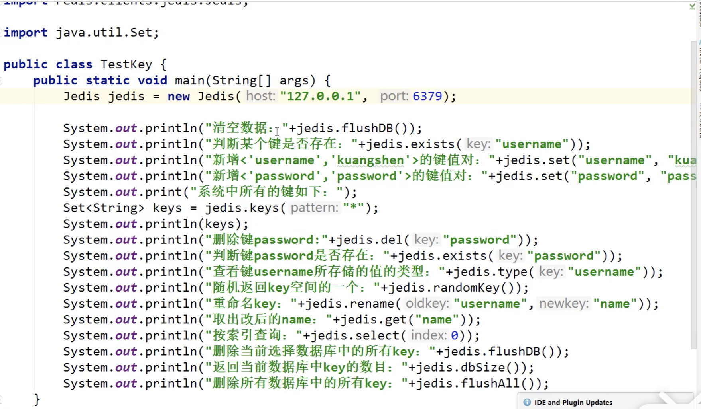

  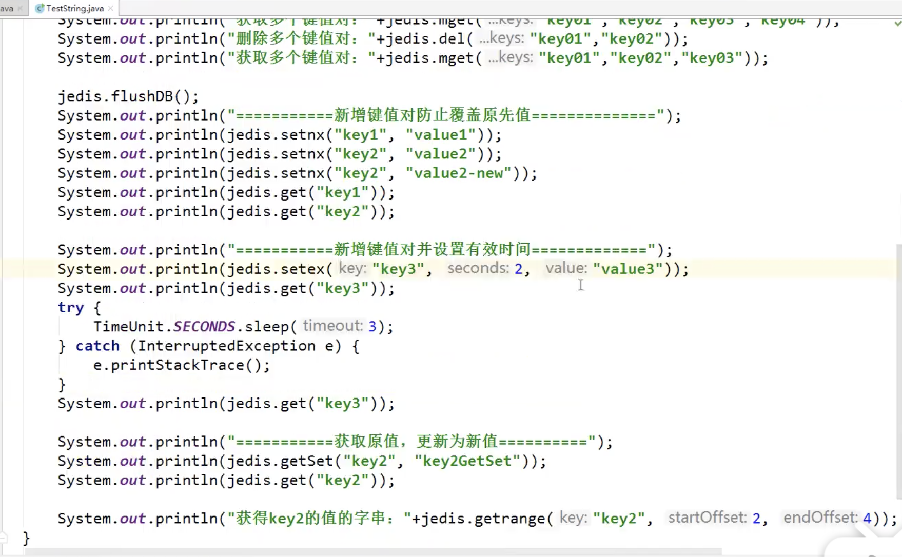

  

  

- 斷開連接

1. **事務**

   ```java
   public class TestX {
   	public static void main(String[] args) {
   	     
           Jedis jedis = new Jedis("127.0.0.1", 6379);
   
           JSONObject jsonObject = new JSONObject();
           jsonObject.put("hello", "world");
           jsonObject.put("name", "wong");
           
           jedis.flushDB();
           // 開啟事務
           Transaction multi = jedis.multi();
           String result = jsonObject.toJSONString();
           // jedis.watch(result);
           try {  
               multi.set("user1", result);
               multi.set("user2", result);
               //int i = 1/0;	//error -->  null  null
               // 執行事務
               multi.exec();
           }catch (Exception e){
               // 放棄事務
               multi.discard();
             	
           } finally {
        
               // 關閉連接
               System.out.println(jedis.get("user1"));
               System.out.println(jedis.get("user2"));
               jedis.close();
           }
       }
   }
   -----------console-----------------
   {"name":"wong","hello":"world"}
   {"name":"wong","hello":"world"}
   ```


## 七、SpringBoot整合

springBoot 操作數據：封裝到 spring-day ==> jpa jdbc mongodb redis

springData也是和springBoot 齊名的項目

springboot 2.x後，原來使用的Jedis 被lettuce 替換。

> jedis：採用的直連，多個線程操作的話，是不安全的。如果要避免不安全，使用jedis pool連接池！更像BIO模式
>
> lettuce：採用netty，實例可以在多個線程中共享，不存在線程不安全的情況！可以減少線程數據了，更像NIO模式  --->  異步，需序列化

### springboot+redis enviroment

1, create springboot project

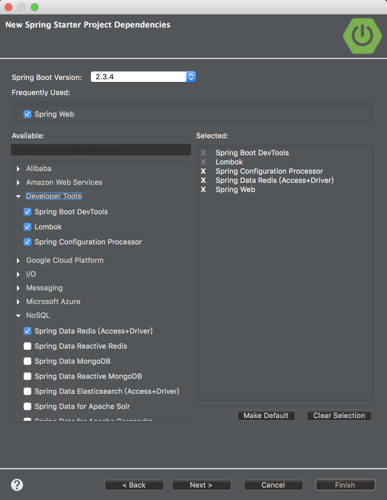

2, 導入依賴

```xml
<dependency>
    <groupId>org.springframework.boot</groupId>
    <artifactId>spring-boot-starter-data-redis</artifactId>
</dependency>
```


### RedisAutoConfiguration

我們在學習SpringBoot自動配置的原理時，整合一個組件並進行配置一定會有一個自動配置類xxxAutoConfiguration,並且在spring.factories中也一定能找到這個類的完全限定名。Redis也不例外。

- `Spring-boot-autoconfigure-2.3.4.REALEASE.jar  --->  META-INF ---> spring.factories` : 

```xml
...
org.springframework.boot.autoconfigure.data.redis.RedisAutoConfiguration,\
org.springframework.boot.autoconfigure.data.redis.RedisReactiveAutoConfiguration,\
org.springframework.boot.autoconfigure.data.redis.RedisRepositoriesAutoConfiguration,\
...
```

- `RedisAutoConfiguration `: 

  那麼就一定還存在一個`RedisProperties`類

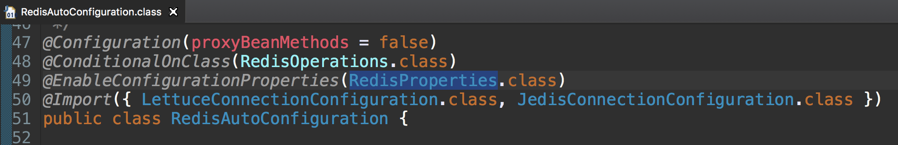

源碼分析：

```java
@Configuration(proxyBeanMethods = false)
@ConditionalOnClass(RedisOperations.class)
@EnableConfigurationProperties(RedisProperties.class)
@Import({ LettuceConnectionConfiguration.class, JedisConnectionConfiguration.class })
public class RedisAutoConfiguration {

	@Bean
	@ConditionalOnMissingBean(name = "redisTemplate")// 不存在這個Bean，默認的 RedisTemplate 才生效 ---> 可以自定義一個 redisTemplate 來替換掉這個默認的
	public RedisTemplate<Object, Object> redisTemplate(RedisConnectionFactory redisConnectionFactory)
			throws UnknownHostException {
    //默認的 RedisTemplate 沒有果多的配置，Redis 對象都是要序列化的(Dubbo)
    //兩個泛型都是 Object ，我們後面使用須強制轉換為 <String, Object>
		RedisTemplate<Object, Object> template = new RedisTemplate<>();
		template.setConnectionFactory(redisConnectionFactory);
		return template;
	}

	@Bean
	@ConditionalOnMissingBean // since String 類型是 Redis 中最常使用的類型，所以單獨提出來一個 Bean
	public StringRedisTemplate stringRedisTemplate(RedisConnectionFactory redisConnectionFactory)
			throws UnknownHostException {
		StringRedisTemplate template = new StringRedisTemplate();
		template.setConnectionFactory(redisConnectionFactory);
		return template;
	}

}
```

只有兩個簡單的Bean

- **Redis模板**
- **StringRedisTemplate**

當看到xxTemplate時可以對比RestTemplat、SqlSessionTemplate,通過使用這些Template來間接操作組件。那麼這倆也不會例外。分別用於操作Redis和Redis中的String數據類型。

SpringBoot自動幫我們在容器中生成了一個RedisTemplate和一個StringRedisTemplate。但是，這個RedisTemplate的泛型是<Object,Object>，寫代碼不方便，需要寫好多類型轉換的代碼；我們需要一個泛型為<String,Object>形式的RedisTemplate。並且，這個RedisTemplate沒有設置數據存在Redis時，key及value的序列化方式。     看到這個@ConditionalOnMissingBean註解後，就知道如果Spring容器中有了RedisTemplate對象了，這個自動配置的RedisTemplate不會實例化。因此我們可以直接自己寫個配置類，配置RedisTemplate。

### Lettuce

之前我們說SpringBoot2.x後默認使用Lettuce來替換Jedis，現在我們就能來驗證了。

1, redisTemplate 需要傳入的參數 ---> RedisConnectionFactory

```java
@Import({ LettuceConnectionConfiguration.class, JedisConnectionConfiguration.class })
@Bean
	@ConditionalOnMissingBean(name = "redisTemplate")
	public RedisTemplate<Object, Object> redisTemplate(RedisConnectionFactory redisConnectionFactory)
```

 RedisConnectionFactory is an Interface ---> 查看實現類有兩個


- 先看Jedis ---> JedisConnectionConfiguration.class

  @ConditionalOnClass註解中有兩個類是默認不存在的，所以Jedis是無法生效的

- 然後再看Lettuce：完美生效。


### Test

1, 導入依賴

2, 編寫配置文件` application.properties`

要知道如何編寫配置文件然後連接Redis，就需要閱讀RedisProperties

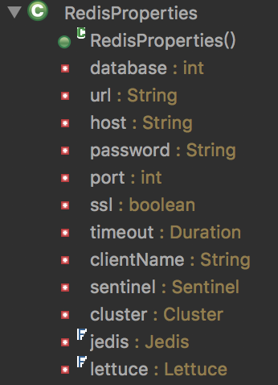


還有一些連接池相關的配置。注意使用時一定使用Lettuce的連接池。

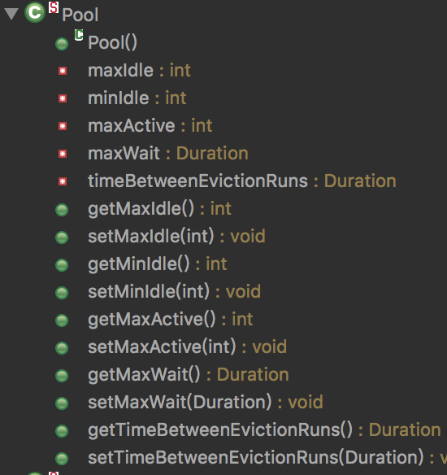

```.properties
# SpringBoot所有配置類，都有一個自動配置類 ： RedisAutoConfiguration 
# 自動配置類都會綁定一個 .properties 配置文件 : RedisProperties

# 配置redis
spring.redis.host=127.0.0.1
spring.redis.port=6379
```

3, 測試

```java
@SpringBootTest
class Redis02SpringbootApplicationTests {
     

    @Autowired
    private RedisTemplate redisTemplate;

    @Test
    void contextLoads() {
     

        // 1. redisTemplate 操作不同的數據類型，api和我們的指令是一樣的
        // opsForValue 操作字符串 類似String
        // opsForList 操作List 類似List
        // opsForHah
        // opsForSet
        // ...

        // 2. 除了基本的操作，我們常用的方法都可以直接通過redisTemplate操作，比如事務和基本的CRUD

        // 獲取連接對象
        //RedisConnection connection = redisTemplate.getConnectionFactory().getConnection();

        //connection.flushDb();
        //connection.flushAll();

        redisTemplate.opsForValue().set("mykey","非英語會有亂碼問題");
        System.out.println(redisTemplate.opsForValue().get("mykey"));
    }
}
-------------console----------------
非英語會有亂碼問題
```

4, 測試結果 (view the result interminal -->  redis-cli)

此時我們回到Redis查看數據時候，發現全是亂碼，可是程序中可以正常輸出：

```
127.0.0.1:6379> get mykey
"\xe9\x9d\x9e\xe8\x8b\xb1\xe8\xaa\x9e\xe6\x9c\x83\xe6\x9c\x89\xe4\xba\x82\xe7\xa2\xbc\xe5\x95\x8f\xe9\xa1\x8c"
```

這時候就關係到存儲對象的序列化問題，在網絡中傳輸的對像也是一樣需要序列化，否者就全是亂碼。

5, 使用RedisTemplate

我們轉到看那個默認的RedisTemplate內部什麼樣子：

```java
// RedisAutoConfiguration.class
public class RedisAutoConfiguration {

	@Bean
	@ConditionalOnMissingBean(name = "redisTemplate")
	public RedisTemplate<Object, Object> redisTemplate(RedisConnectionFactory redisConnectionFactory)
			throws UnknownHostException {
		RedisTemplate<Object, Object> template = new RedisTemplate<>();
		//...
	}
  //...
}
```

在最開始就能看到幾個關於序列化的參數。

```java
// RedisTemplate.class
public class RedisTemplate<K, V> extends RedisAccessor implements RedisOperations<K, V>, BeanClassLoaderAware {
  //...
  // 序列化的參數
	@SuppressWarnings("rawtypes") private @Nullable RedisSerializer keySerializer = null;
	@SuppressWarnings("rawtypes") private @Nullable RedisSerializer valueSerializer = null;
	@SuppressWarnings("rawtypes") private @Nullable RedisSerializer hashKeySerializer = null;
	@SuppressWarnings("rawtypes") private @Nullable RedisSerializer hashValueSerializer = null;
  //...
```

默認的序列化方式是採用JDK序列化，我們可能會用 json 來序列化。

```java
// RedisTemplate.class
// ...
public void afterPropertiesSet() {
//...
  // 默認的序列化方式是採用JDK序列化
	defaultSerializer = new JdkSerializationRedisSerializer(
		classLoader != null ? classLoader : this.getClass().getClassLoader());
		}
//...
```

而默認的RedisTemplate中的所有序列化器都是使用這個序列化器：

```java
// RedisTemplate.class
// ...
public void afterPropertiesSet() {

		super.afterPropertiesSet();

		boolean defaultUsed = false;

		if (defaultSerializer == null) {

			defaultSerializer = new JdkSerializationRedisSerializer(
					classLoader != null ? classLoader : this.getClass().getClassLoader());
		}
		// 默認的RedisTemplate中的所有序列化器都是使用JDK序列化
		if (enableDefaultSerializer) {

			if (keySerializer == null) {
				keySerializer = defaultSerializer;
				defaultUsed = true;
			}
			if (valueSerializer == null) {
				valueSerializer = defaultSerializer;
				defaultUsed = true;
			}
			if (hashKeySerializer == null) {
				hashKeySerializer = defaultSerializer;
				defaultUsed = true;
			}
			if (hashValueSerializer == null) {
				hashValueSerializer = defaultSerializer;
				defaultUsed = true;
			}
		}
//...
```


後續我們定制RedisTemplate就可以對其進行修改。

```java
RedisSerializer.setKeySerializer()
  									|
  									|
public void setKeySerializer(RedisSerializer<?> serializer) {
  this.keySerializer = serializer;		|
}  									  								|
  									  								|
  						public interface RedisSerializer<T>
  
```

`RedisSerializer`提供了多種序列化方案：

- 直接調用RedisSerializer的靜態方法來返回序列化器，然後set

  > [java8介面預設方法和靜態方法](https://www.itread01.com/content/1547873315.html)
  >
  > java8中對介面進行了擴充套件，允許我們在介面中定義具體方法，一種是預設方法，即在方法返回值前加“default”關鍵字，另一種是加“static”的靜態方法。

  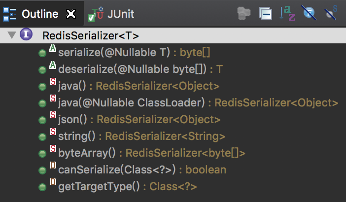

- 自己new 相應的實現類，然後set

  

6, （固定）**定制RedisTemplate的模板：**

我們創建一個Bean加入容器，就會觸發RedisTemplate上的條件註解使默認的RedisTemplate失效。

這樣一來，只要實體類進行了序列化，我們存什麼都不會有亂碼的擔憂了。

```java
@Configuration
public class RedisConfig {
	// 自定義一個 RedisTemplate，將其泛型設置為 <String, Object>
	// <Bean id=redisTemplete class=RedisTemplete>
	@Bean
  @SuppressWarnings("all")
	// 為了開發方便，一般直接使用 <String, Object>
	public RedisTemplate<String, Object> redisTemplate(RedisConnectionFactory redisConnectionFactory)
			throws UnknownHostException {
		RedisTemplate<String, Object> template = new RedisTemplate<>();
		// 連接工場，不必修改
		template.setConnectionFactory(redisConnectionFactory);
		
		/* * 序列化設置 */
		// Json 的序列化
		// 將所有傳入 Object 都序列化成Json
		Jackson2JsonRedisSerializer<Object> jackson2JsonRedisSerializer = new Jackson2JsonRedisSerializer<Object>(Object.class);
		// 通過 ObjectMapper 進行轉譯
		ObjectMapper om = new ObjectMapper();
		om.setVisibility(PropertyAccessor.ALL, JsonAutoDetect.Visibility.ANY);
		om.enableDefaultTyping(ObjectMapper.DefaultTyping.NON_FINAL);
		jackson2JsonRedisSerializer.setObjectMapper(om);
		
		// String 的序列化
		StringRedisSerializer stringRedisSerializer = new StringRedisSerializer();
		
		// 配置具體得序列化方式
		template.setKeySerializer(jackson2JsonRedisSerializer);
		 /* * 序列化設置 */
		
        // key、hash的key 採用 String 序列化方式
        template.setKeySerializer(stringRedisSerializer);
        template.setHashKeySerializer(stringRedisSerializer);
        // value、hash的value 採用 Jackson 序列化方式
        template.setValueSerializer(jackson2JsonRedisSerializer);
        template.setHashValueSerializer(jackson2JsonRedisSerializer);
        template.afterPropertiesSet();
        
		template.setConnectionFactory(redisConnectionFactory);
		return template;
	}
}
```


```java
@Component
@AllArgsConstructor
@NoArgsConstructor
@Data
public class User {
	private String name;
	private String age;
}
----------------------------------
  //pom.xml
<dependency>
  <groupId>org.projectlombok</groupId>
  <artifactId>lombok</artifactId>
  <version>1.18.12</version>
  <scope>provided</scope>
</dependency>
```


```java
@SpringBootTest
class Redis02SpringbootApplicationTests {
	@Autowired
	@Qualifier("redisTemplate")
	private RedisTemplate<String, Object> redisTemplate;
	@Test
	void contextLoads() {
		//redisTemplate.opsForList();
		//RedisConnection connection = redisTemplate.getConnectionFactory().getConnection();
		//connection.flushDb();
		//connection.flushAll();
		redisTemplate.opsForValue().set("mykey", "非英語會有亂碼問題");
		System.out.println(redisTemplate.opsForValue().get("mykey"));
	}


	@Test
	public void test() throws JsonProcessingException {
		//  真實開發中一般使用 json 來傳遞對象
		User user = new User("亂碼", "23");
		// 1. object serialized to json in springboot
		//String jsonUser = new ObjectMapper().writeValueAsString(user); 
		//redisTemplate.opsForValue().set("user", jsonUser); //delever string
		
		// 2. class User implement Serializable
		redisTemplate.opsForValue().set("user",user); //delever serialized object, or use 自定義 RedisTemplate
		System.out.println(redisTemplate.opsForValue().get("user"));
	}
}
```

## 八、自定義Redis工具類

使用RedisTemplate需要頻繁調用`.opForxxx`然後才能進行對應的操作，這樣使用起來代碼效率低下，工作中一般不會這樣使用，而是將這些常用的公共API抽取出來封裝成為一個工具類，然後直接使用工具類來間接操作Redis,不但效率高並且易用。

工具類參考博客：

https://www.cnblogs.com/zeng1994/p/03303c805731afc9aa9c60dbbd32a323.html

https://www.cnblogs.com/zhzhlong/p/11434284.html


## 九、Redis.conf

啟動時，就通過配置文件來啟動

```
Mac, redis install with homebrew 
$ cd ~
$ cd /Users
$ cd /usr/local/etc
$ vim redis.conf
```

> 容量單位不區分大小寫(units are case insensitive)，Gb和GB沒有區別

```
# Redis configuration file example.
#
# Note that in order to read the configuration file, Redis must be
# started with the file path as first argument:
#
# ./redis-server /path/to/redis.conf

# Note on units: when memory size is needed, it is possible to specify
# it in the usual form of 1k 5GB 4M and so forth:
#
# 1k => 1000 bytes
# 1kb => 1024 bytes
# 1m => 1000000 bytes
# 1mb => 1024*1024 bytes
# 1g => 1000000000 bytes
# 1gb => 1024*1024*1024 bytes
#
# units are case insensitive so 1GB 1Gb 1gB are all the same.
```

> 可以使用include 組合多個配置問題

```
################################## INCLUDES ###################################

# Include one or more other config files here.  This is useful if you
# have a standard template that goes to all Redis servers but also need
# to customize a few per-server settings.  Include files can include
# other files, so use this wisely.
#
# Notice option "include" won't be rewritten by command "CONFIG REWRITE"
# from admin or Redis Sentinel. Since Redis always uses the last processed
# line as value of a configuration directive, you'd better put includes
# at the beginning of this file to avoid overwriting config change at runtime.
#
# If instead you are interested in using includes to override configuration
# options, it is better to use include as the last line.
#
# include /path/to/local.conf
# include /path/to/other.conf
```

> 網絡配置

```bash
################################## NETWORK #####################################

# By default, if no "bind" configuration directive is specified, Redis listens
# for connections from all the network interfaces available on the server.
# It is possible to listen to just one or multiple selected interfaces using
# the "bind" configuration directive, followed by one or more IP addresses.
#
# Examples:
#
# bind 192.168.1.100 10.0.0.1
# bind 127.0.0.1 ::1
#
#...
~~~~~~~~~~~~~~~~~~~~~~~~~~~~~~~~~~~~~~~~~~~~~~~~~~~~~~~~~~~~~~~~
bind 127.0.0.1 ::1		# 綁定的ip
```

```bash
# Protected mode is a layer of security protection, in order to avoid that
# Redis instances left open on the internet are accessed and exploited.
# ...
protected-mode yes 	#	保護模式
```

```bash
# Accept connections on the specified port, default is 6379 (IANA #815344).
# If port 0 is specified Redis will not listen on a TCP socket.
port 6379		# 端口號設置
```

```bash
################################# GENERAL #####################################

# By default Redis does not run as a daemon. Use 'yes' if you need it.
# Note that Redis will write a pid file in /usr/local/var/run/redis.pid when daemonized.
daemonize no
# ...
supervised yes		# 以守護進程的方式運行（後台運行），默認是 no，需要手動開啟為 yes
```

```bash
# If a pid file is specified, Redis writes it where specified at startup
# and removes it at exit.
#
# When the server runs non daemonized, no pid file is created if none is
# specified in the configuration. When the server is daemonized, the pid file
# is used even if not specified, defaulting to "/usr/local/var/run/redis.pid".
#
# Creating a pid file is best effort: if Redis is not able to create it
# nothing bad happens, the server will start and run normally.
pidfile /var/run/redis_6379.pid		# 如果以後台的方式運行，就需要指定一個 pid 文件
```

> 日誌輸出級別

```bash
# Specify the server verbosity level.
# This can be one of:
# debug (a lot of information, useful for development/testing)
# verbose (many rarely useful info, but not a mess like the debug level)
# notice (moderately verbose, what you want in production probably)
# warning (only very important / critical messages are logged)
loglevel notice		# 默認生產級別
```

> 日誌輸出文件、數據庫數量

```bash
# Specify the log file name. Also the empty string can be used to force
# Redis to log on the standard output. Note that if you use standard
# output for logging but daemonize, logs will be sent to /dev/null
logfile ""			
```

```bash
# ...
# Set the number of databases. The default database is DB 0, you can select
# a different one on a per-connection basis using SELECT <dbid> where
# dbid is a number between 0 and 'databases'-1
databases 16		# 數據庫數量
# ...
always-show-logo yes		# whether show logo
```

> 持久化規則

由於Redis是基於內存的數據庫，如果沒有持久化，數據斷電即失，需要將數據由內存持久化到文件中

在規定的時間內，執行多少此操作，則會持久化到數據庫

持久化方式：

- RDB
- AOF

```bash
################################ SNAPSHOTTING  ################################
#
# Save the DB on disk:
#
#   save <seconds> <changes>
#
#   Will save the DB if both the given number of seconds and the given
#   number of write operations against the DB occurred.
#
#   In the example below the behaviour will be to save:
#   after 900 sec (15 min) if at least 1 key changed
#   after 300 sec (5 min) if at least 10 keys changed
#   after 60 sec if at least 10000 keys changed
#
#  ...
save 900 1		# 如果 900s 內，至少有1個 key 進行修改，就進行持久化操作
save 300 10		# 如果 300s 內，至少有10個 key 進行修改，就進行持久化操作
save 60 10000	# 如果 60s 內，至少有10000個 key 進行修改，就進行持久化操作
```

> RDB文件相關

```bash
# ...
stop-writes-on-bgsave-error yes		# 持久化如果出錯了，是否還要繼續工作，默認 yes
# ...
rdbcompression yes		# 是否壓縮 RDB文件 （需消耗一些 CPU 資源）
# ...
rdbchecksum yes		# 保存 RDB文件時，進行錯誤的檢查校驗
# ...
dir /usr/local/var/db/redis/		# RDB文件保存的目錄(Mac hombrew), linux ---> dir ./ == 當前目錄下

```

> 主從復制

```
##################### REPLICATION #######################
# ...
```

> Security模塊中進行密碼設置

```bash
################################## SECURITY ###################################

# Require clients to issue AUTH <PASSWORD> before processing any other
# commands.  This might be useful in environments in which you do not trust
# others with access to the host running redis-server.
#
# ...
#
# requirepass foobared
			# redis 默認沒有設置密碼（空的），setting password in redis.conf
```

````bash
127.0.0.1:6379> ping
PONG
127.0.0.1:6379> config get requirepass
1) "requirepass"
2) ""			# redis 默認沒有設置密碼（空的）
127.0.0.1:6379> config set requirepass "123456" # 設置redis密碼
ok
127.0.0.1:6379> config get requirepass
(error) NOAUTH Authentication required. # 發現所有的命令權限都沒了
127.0.0.1:6379> ping
(error) NOAUTH Authentication required.
127.0.0.1:6379> auth 123456		# 使用密碼登入
ok
127.0.0.1:6379> config get requirepass
1) "requirepass"
2) "123456"		
````

> 客戶端連接相關

```bash
################################## CLIENTS ####################################

# ...
#
# maxclients 10000
maxclients 10000  最大客户端數量
############################## MEMORY MANAGEMENT ################################
# ...
#
# maxmemory <bytes>
maxmemory <bytes> 最大内存限制
# ...
#
# maxmemory-policy noeviction
maxmemory-policy noeviction  内存達到限制值的處理策略
```

redis中的**默認**的過期策略是**volatile-lru**。

**設置方式**

```bash
config set maxmemory-policy volatile-lru 
```

#### **maxmemory-policy 六種方式**

**1、volatile-lru：**只對設置了過期時間的key進行LRU（默認值）

**2、allkeys-lru ：**刪除lru算法的key

**3、volatile-random：**隨機刪除即將過期key

**4、allkeys-random：**隨機刪除

**5、volatile-ttl ：**刪除即將過期的

**6、noeviction ：**永不過期，返回錯誤

> AOF(Append Only File)相關部分

```bash
############################## APPEND ONLY MODE ###############################
# ...
# AOF and RDB persistence can be enabled at the same time without problems.
# If the AOF is enabled on startup Redis will load the AOF, that is the file
# with the better durability guarantees.
#
# Please check http://redis.io/topics/persistence for more information.

appendonly no		# 默認不開啟AOF模式，默認是使用RDB方式持久化的，在大部分的情況下，RDB完全夠用
# The name of the append only file (default: "appendonly.aof")

appendfilename "appendonly.aof"		# 持久化文件的名字
# ...
# appendfsync always		# 每次修改都會 sync（寫入），速度較慢（消耗性能）
appendfsync everysec		# 每秒執行一次 sync，可能會丟失這 1s 的數據
# appendfsync no		# 不執行 sync，這個時候操作系統自己同步數據，速度最快
```


## 十、持久化—RDB

在主從複製中，RDB就是備份用的（從機上面）

RDB：Redis數據庫

### 什麼是RDB

由於Redis是基於內存的數據庫，如果不將內存中的數據庫狀態保存到磁盤，那麼一但服務進程退出 (`shutdown + exit`)，服務器中的數據庫狀態也會消失，需要將數據由內存持久化到文件中

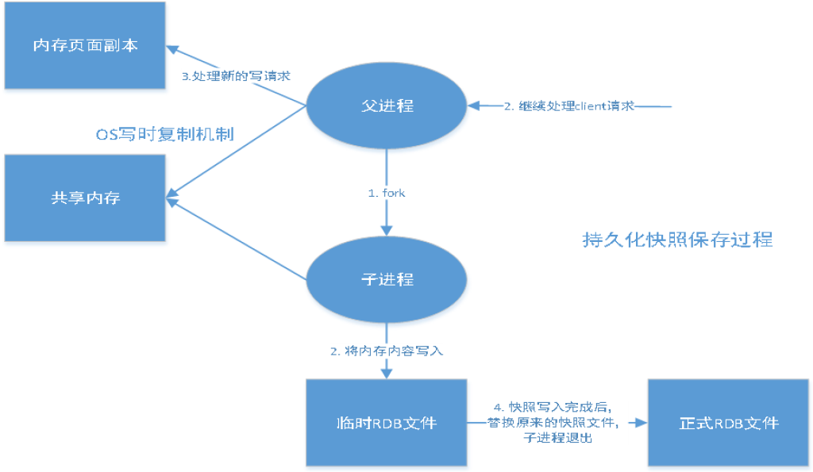

- 在指定的時間間隔內將內存中的數據集快照寫入磁盤，也就是行話講的Snapshot快照，它恢復時是將快照文件直接讀到內存裡。 　　

- Redis會單獨創建（fork）一個子進程來進行持久化，子進程會先將數據寫入到一個臨時文件中，待持久化過程都結束了（寫入成功之後），再用這個臨時文件替換上次持久化好的RDB文件，用二進制壓縮存儲，這樣可以保證RDB文件始終存儲的是完整的持久化內容

  fork()是由操作系統提供的函數，作用是創建當前進程的一個副本作為子進程

- 整個過程中，主進程是不進行任何IO操作的。 這就確保了極高的性能。

- 如果需要進行大規模數據的恢復，且對於數據恢復的完整性不是非常敏感，那RDB方式要比AOF方式更加的高效。

-  RDB的缺點是最後一次持久化後的數據可能丟失。我們默認的就是 RDB，一般情況下不需要修改這個配置！有時候在生產環境我們會將這個文件進行備份！

- ` rdb保存的文件是dump.rdb 都是在我們的配置文件中快照中進行配置的！`

  RDB持久化會生成RDB文件，該文件是一個壓縮過的二進製文件，可以通過該文件還原快照時的數據庫狀態，即生成該RDB文件時的服務器數據。 RDB文件默認為當前工作目錄下的`dump.rdb`，可以根據配置文件中的`dbfilename`和`dir`設置RDB的文件名和文件位置

  ```bash
  #################### SNAPSHOTTING  ####################
  # ...
  # 設置 dump 的文件名 
  dbfilename dump.rdb 
  
  # 工作目錄 
  # 例如上面的 dbfilename 只指定了文件名， 
  # 但是它會寫入到這個目錄下。這個配置項一定是個目錄，而不能是文件名。 
  dir ./
  ```

  

在指定時間間隔後，將內存中的數據集快照寫入數據庫；在恢復時候，直接讀取快照文件，進行數據的恢復；


默認情況下， Redis 將數據庫快照保存在名字為 dump.rdb的二進製文件中。文件名可以在配置文件中進行自定義。

### 工作原理

在進行**`RDB`**的時候，**`redis`**的主線程是不會做**`io`**操作的，主線程會**`fork`**一個子線程來完成該操作；

1. Redis 調用forks。同時擁有父進程和子進程。
2. 子進程將數據集寫入到一個臨時RDB 文件中。
3. 當子進程完成對新RDB 文件的寫入時，Redis 用新RDB 文件替換原來的RDB 文件，並刪除舊的RDB 文件。

這種工作方式使得Redis 可以從寫時復制（copy-on-write）機制中獲益(因為是使用子進程進行寫操作，而父進程依然可以接收來自客戶端的請求。)


### 觸發快照的時機

1. 執行·save·和·bgsave·命令

   - `save`的規則滿足的情況下，會自動觸發rdb原則 ( 配置文件設置save <seconds> <changes>規則，自動間隔性執行bgsave命)

   - 主從復制時，從庫全量複製同步主庫數據，主庫會執行`bgsave `

2. 執行`flushall`命令清空服務器數據 ，也會觸發rdb原則

3. 退出redis (`shutdown + exit`)，也會自動產生rdb文件（執行shutdown命令關閉Redis時，會執行save命令）

備份就自動生成`dump.rdb`

>如何恢復 rdb 文件

只需要將 rdb 文件放到 redis 啟動目錄下就可以，redis 啟動時會自動檢查 dump.rdb 恢復其中的數據。

> 查看 rdb 文件要存放的位置

```bash
127.0.0.1:6379> config get dir
1) "dir"
2) "usr/local/bin"		# 如果這個目錄下存在 dump.rdb  文件，啟動時會自動檢查 dump.rdb 恢復其中的數據。
```


#### Save

使用`save`命令，會立刻對當前內存中的數據進行持久化，但是會阻塞Redis服務器進程，服務器進程在RDB文件創建完成之前是不能處理任何的命令請求，也就是不接受其他操作了；

> 由於`save`命令是同步命令，會佔用Redis的主進程。若Redis數據非常多時，`save`命令執行速度會非常慢，阻塞所有客戶端的請求。

```bash
127.0.0.1:6379> save
OK
```


#### 觸發持久化規則(自動間隔觸發)

滿足配置條件中的觸發條件；

在配置文件中設置`save <seconds> <changes>`規則，可以自動間隔性執行bgsave命令

`save <seconds> <changes>`表示在seconds秒內，至少有changes次變化，就會自動觸發gbsave命令

> 可以通過配置文件對Redis 進行設置， 讓它在“ N 秒內數據集至少有M 個改動”這一條件被滿足時， 自動進行數據集保存操作。
>
> ```bash
> ################################ SNAPSHOTTING  ################################
> #
> # Save the DB on disk:
> #
> #   save <seconds> <changes>
> #
> #   Will save the DB if both the given number of seconds and the given
> #  ...
> save 900 1		# 如果 900s 內，至少有1個 key 進行修改，就進行持久化操作
> save 300 10		# 如果 300s 內，至少有10個 key 進行修改，就進行持久化操作
> save 60 10000	# 如果 60s 內，至少有10000個 key 進行修改，就進行持久化操作
> ```
>
> 

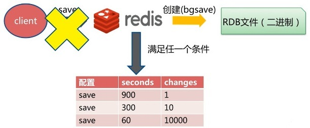

#### Bgsave

`bgsave`是異步進行，進行持久化的時候，`basave`命令會fork一個子進程，然後該子進程會負責創建RDB文件，而服務器進程會繼續處理命令請求，`redis`還可以將繼續響應客戶端請求；

```bash
127.0.0.1:6379> bgsave
Background saving started
```


> fork()是由操作系統提供的函數，作用是創建當前進程的一個副本作為子進程
>
> fork一個子進程，子進程會把數據集先寫入臨時文件，寫入成功之後，再替換之前的RDB文件，用二進制壓縮存儲，這樣可以保證RDB文件始終存儲的是完整的持久化內容

**bgsave和save對比**

| 命令   | 救                 | 儲存                               |
| :----- | :----------------- | :--------------------------------- |
| IO類型 | 同步               | 異步                               |
| 阻塞？ | 是                 | 是（阻塞發生在fock()，通常非常快） |
| 複雜度 | O(n)               | O(n)                               |
| 優點   | 不會消耗額外的內存 | 不阻塞客戶端命令                   |
| 缺點   | 阻塞客戶端命令     | 需要fock子進程，消耗內存           |

#### flushall命令

`flushall` 命令也會觸發持久化；

### 優缺點

**優點：**

1. 適合大規模的數據恢復
2. 對數據的完整性要求不高

**缺點：**

1. 需要一定的時間間隔進行操作，如果redis意外宕機了，這個最後一次修改的數據就沒有了。---> 有時候在生產環境我們會將這個文件進行備份！
2. fork進程的時候，會佔用一定的內容空間。


## 十一、持久化AOF

[Redis持久化机制：RDB和AOF](https://juejin.im/post/6844903939339452430)

**僅附加文件**

除了RDB持久化，Redis還提供了AOF（Append Only File）持久化功能，AOF持久化會把被執行的寫命令寫到AOF文件的末尾，記錄數據的變化。

默認情況下，Redis是沒有開啟AOF持久化的，開啟後，每執行一條更改Redis數據的命令，都會把該命令追加到AOF文件中，這是會降低Redis的性能，但大部分情況下這個影響是能夠接受的，另外使用較快的硬盤可以提高AOF的性能

將我們所有的命令都記錄下來，history，恢復的時候就把這個文件全部再執行一遍

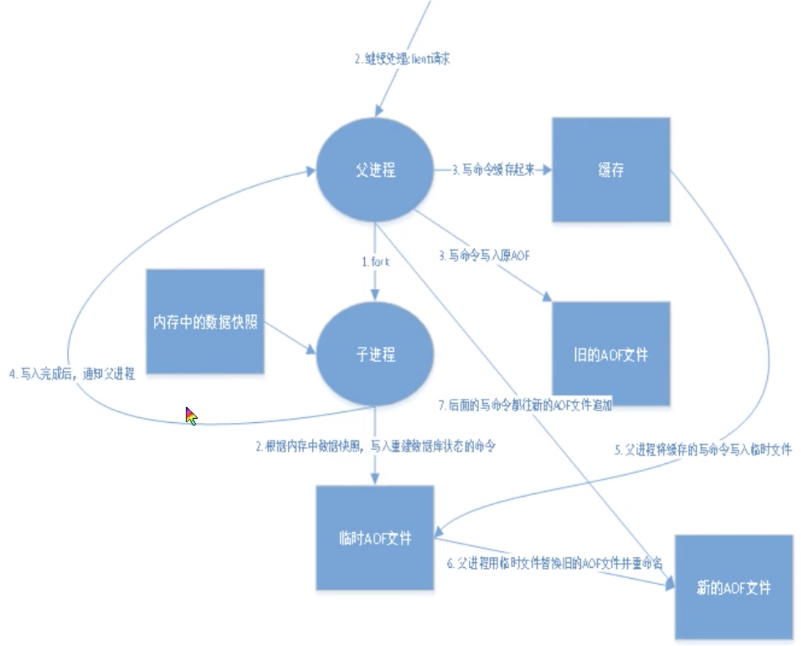

以日誌的形式來記錄每個寫的操作，將Redis執行過的所有指令記錄下來（讀操作不記錄），只許追加文件但不可以改寫文件，redis啟動之初會讀取該文件重新構建數據，換言之，redis重啟的話就根據日誌文件的內容將寫指令從前到後執行一次以完成數據的恢復工作。

### 什麼是AOF

快照功能（RDB）並不是非常耐久（durable）： 如果Redis 因為某些原因而造成故障停機， 那麼服務器將丟失最近寫入、以及未保存到快照中的那些數據。從1.1 版本開始， Redis 增加了一種完全耐久的持久化方式： AOF 持久化。

如果要使用AOF，需要修改配置文件：

```bash
############################## APPEND ONLY MODE ###############################
# ...
# AOF and RDB persistence can be enabled at the same time without problems.
# If the AOF is enabled on startup Redis will load the AOF, that is the file
# with the better durability guarantees.
#
# Please check http://redis.io/topics/persistence for more information.

appendonly no		# 默認不開啟AOF模式，默認是使用RDB方式持久化的，在大部分的情況下，RDB完全夠用
# The name of the append only file (default: "appendonly.aof")

appendfilename "appendonly.aof"		# 持久化文件的名字
# ...
# appendfsync always		# 每次修改都會 sync（寫入），速度較慢（消耗性能）
appendfsync everysec		# 每秒執行一次 sync，可能會丟失這 1s 的數據
# appendfsync no		# 不執行 sync，這個時候操作系統自己同步數據，速度最快
```

`appendonly yes`則表示啟用AOF

默認是不開啟的，我們需要手動配置，然後重啟redis(`shutdown + exit`)，就可以生效了（輸出appendonly.aof文件）！

```bash
127.0.0.1:6379> config get dir
1) "dir"
2) "usr/local/bin"		# 如果這個目錄下存在 dump.rdb  文件，啟動時會自動檢查 dump.rdb 恢復其中的數據。
# 若設置 appendonly yes 啟用AOF，輸出 appendonly.aof 文件同樣在此目錄下
```

如果這個aof文件有錯位（被人惡意修改或插入`vim appendonly.aof `），這時候redis是啟動不起來的 (Connection refused)，我需要修復這個aof文件

redis給我們提供了一個工具`redis-check-aof --fix`

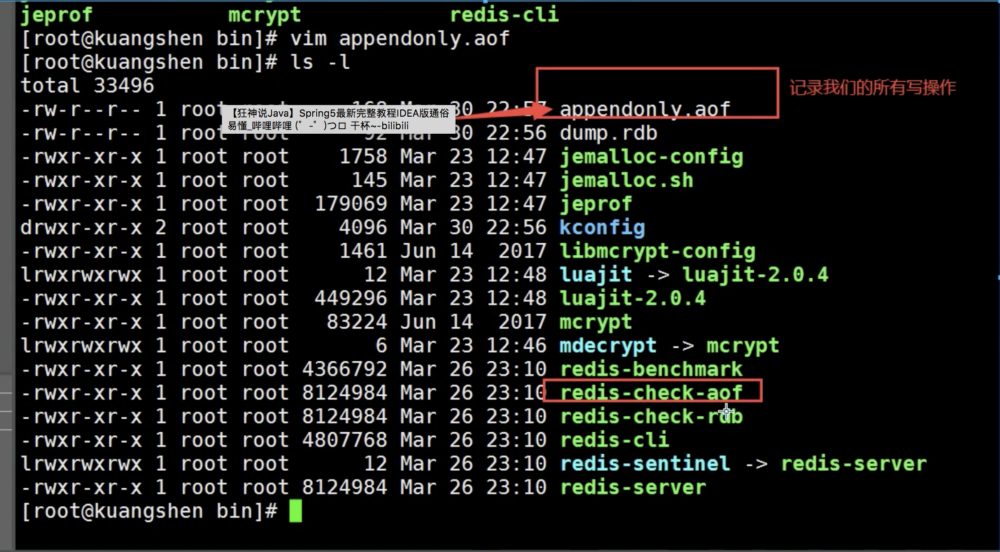

```bash
[root@localhost bin]# vim appendonly.aof	
[root@localhost bin]# redis-check-aof --fix appendonly.aof
...
Successfully truncateed AOF
```

如果AOF文件成功修復，重啟就可以直接恢復了！

### AOF的實現

AOF需要記錄Redis的每個寫命令，步驟為：命令追加（append）、文件寫入（write）和文件同步（sync）

#### 命令追加(append)

開啟AOF持久化功能後，服務器每執行一個寫命令，都會把該命令以協議格式先追加到`aof_buf`緩存區的末尾，而不是直接寫入文件，避免每次有命令都直接寫入硬盤，減少硬盤IO次數

#### 文件寫入(write)和文件同步(sync)

對於何時把`aof_buf`緩衝區的內容寫入保存在AOF文件中，Redis提供了多種策略

- `appendfsync always`：將`aof_buf`緩衝區的所有內容寫入並同步到AOF文件，每個寫命令同步寫入磁盤
- `appendfsync everysec`：將`aof_buf`緩存區的內容寫入AOF文件，每秒同步一次，該操作由一個線程專門負責
- `appendfsync no`：將`aof_buf`緩存區的內容寫入AOF文件，什麼時候同步由操作系統來決定

`appendfsync`選項的默認配置為`everysec`，即每秒執行一次同步

關於AOF的同步策略是涉及到操作系統的`write`函數和`fsync`函數的，在《Redis設計與實現》中是這樣說明的

> 為了提高文件寫入效率，在現代操作系統中，當用戶調用`write`函數，將一些數據寫入文件時，操作系統通常會將數據暫存到一個內存緩衝區裡，當緩衝區的空間被填滿或超過了指定時限後，才真正將緩衝區的數據寫入到磁盤裡。
>
> 這樣的操作雖然提高了效率，但也為數據寫入帶來了安全問題：如果計算機停機，內存緩衝區中的數據會丟失。為此，系統提供了`fsync`、`fdatasync`同步函數，可以強制操作系統立刻將緩衝區中的數據寫入到硬盤裡，從而確保寫入數據的安全性。

從上面的介紹我們知道，我們寫入的數據，操作系統並不一定會馬上同步到磁盤，所以Redis才提供了`appendfsync`的選項配置。當該選項時為`always`時，數據安全性是最高的，但是會對磁盤進行大量的寫入，Redis處理命令的速度會受到磁盤性能的限制；`appendfsync everysec`選項則兼顧了數據安全和寫入性能，以每秒一次的頻率同步AOF文件，即便出現系統崩潰，最多只會丟失一秒內產生的數據；如果是`appendfsync no`選項，Redis不會對AOF文件執行同步操作，而是有操作系統決定何時同步，不會對Redis的性能帶來影響，但假如係統崩潰，可能會丟失不定數量的數據


###  AOF重寫規則

```bash
############################## APPEND ONLY MODE ###############################
# ...
no-appendfsync-on-rewrite no

# Automatic rewrite of the append only file.
# Redis is able to automatically rewrite the log file implicitly calling
# BGREWRITEAOF when the AOF log size grows by the specified percentage.
#
# This is how it works: Redis remembers the size of the AOF file after the
# latest rewrite (if no rewrite has happened since the restart, the size of
# the AOF at startup is used).
#
# This base size is compared to the current size. If the current size is
# bigger than the specified percentage, the rewrite is triggered. Also
# you need to specify a minimal size for the AOF file to be rewritten, this
# is useful to avoid rewriting the AOF file even if the percentage increase
# is reached but it is still pretty small.
#
# Specify a percentage of zero in order to disable the automatic AOF
# rewrite feature.

auto-aof-rewrite-percentage 100
auto-aof-rewrite-min-size 64mb
# ...
# 加載aof出錯如何處理 
aof-load-truncated yes 
# 文件重寫策略 
# ...
aof-rewrite-incremental-fsync yes
```

AOF默認就是文件無限追加，文件會越來越大。

如果 AOF 文件大於 64 兆，太大了！ fork 一個新的進程來將該文件進後行重寫。

#### AOF重寫(rewrite)

在了解AOF重寫之前，我們先來看看AOF文件中存儲的內容是啥，先執行兩個寫操作

```
127.0.0.1:6379> set s1 hello
OK
127.0.0.1:6379> set s2 world
OK
```

然後我們打開`appendonly.aof`文件，可以看到如下內容

```
*3
$3
set
$2
s1
$5
hello
*3
$3
set
$2
s2
$5
world
```

> 該命令格式為Redis的序列化協議（RESP）。`*3`代表這個命令有三個參數，`$3`表示該參數長度為3

看了上面的AOP文件的內容，我們應該能想像，隨著時間的推移，Redis執行的寫命令會越來越多，AOF文件也會越來越大，過大的AOF文件可能會對Redis服務器造成影響，如果使用AOF文件來進行數據還原所需時間也會越長

時間長了，AOF文件中通常會有一些冗餘命令，比如：過期數據的命令、無效的命令（重複設置、刪除）、多個命令可合併為一個命令（批處理命令）。所以AOF文件是有精簡壓縮的空間的

AOF重寫的目的就是減小AOF文件的體積，不過值得注意的是：**AOF文件重寫並不需要對現有的AOF文件進行任何讀取、分享和寫入操作，而是通過讀取服務器當前的數據庫狀態來實現的**

文件重寫可分為手動觸發和自動觸發，手動觸發執行`bgrewriteaof`命令，該命令的執行跟`bgsave`觸發快照時類似的，都是先`fork`一個子進程做具體的工作

```bash
127.0.0.1:6379> bgrewriteaof
Background append only file rewriting started
```

自動觸發會根據`auto-aof-rewrite-percentage`和`auto-aof-rewrite-min-size 64mb`配置來自動執行`bgrewriteaof`命令

```bash
# 表示當AOF文件的體積大於64MB，且AOF文件的體積比上一次重寫後的體積大了一倍（100%）時，會執行`bgrewriteaof`命令
auto-aof-rewrite-percentage 100
auto-aof-rewrite-min-size 64mb
```

下面看一下執行`bgrewriteaof`命令，重寫的流程

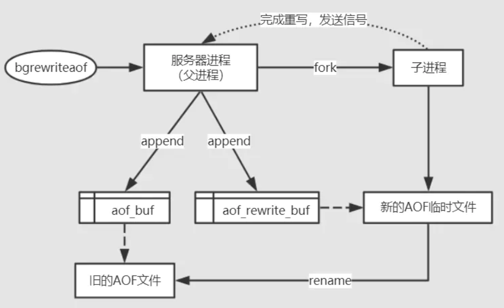

- 重寫會有大量的寫入操作，所以服務器進程會`fork`一個子進程來創建一個新的AOF文件
- 在重寫期間，服務器進程繼續處理命令請求，如果有寫入的命令，追加到`aof_buf`的同時，還會追加到`aof_rewrite_buf`AOF重寫緩衝區
- 當子進程完成重寫之後，會給父進程一個信號，然後父進程會把AOF重寫緩衝區的內容寫進新的AOF臨時文件中，再對新的AOF文件改名完成替換，這樣可以保證新的AOF文件與當前數據庫數據的一致性

#### 數據恢復

Redis4.0開始支持RDB和AOF的混合持久化（可以通過配置項`aof-use-rdb-preamble`開啟）

- 如果是redis進程掛掉，那麼重啟redis進程即可，直接基於AOF日誌文件恢復數據
- 如果是redis進程所在機器掛掉，那麼重啟機器後，嘗試重啟redis進程，嘗試直接基於AOF日誌文件進行數據恢復，如果AOF文件破損，那麼用`redis-check-aof fix`命令修復
- 如果沒有AOF文件，會去加載RDB文件
- 如果redis當前最新的AOF和RDB文件出現了丟失/損壞，那麼可以嘗試基於該機器上當前的某個最新的RDB數據副本進行數據恢復

### 優點和缺點

```bash
############################## APPEND ONLY MODE ###############################
# ...
appendonly no		# 默認不開啟AOF模式，默認是使用RDB方式持久化的，在大部分的情況下，RDB完全夠用
# The name of the append only file (default: "appendonly.aof")

appendfilename "appendonly.aof"		# 持久化文件的名字
# ...
# appendfsync always		# 每次修改都會 sync（寫入），速度較慢（消耗性能）
appendfsync everysec		# 每秒執行一次 sync，可能會丟失這 1s 的數據
# appendfsync no		# 不執行 sync，這個時候操作系統自己同步數據，速度最快
```


**優點**

1. 每一次修改都會同步，文件的完整性會更加好 ( `appendfsync always` )
2. 沒秒同步一次，可能會丟失一秒的數據 ( `appendfsync everysec` )
3. 從不同步，效率最高 (` appendfsync no` )

**缺點**

1. 相對於數據文件來說，aof遠遠大於rdb，修復速度比rdb慢！
2. Aof （讀寫操作=IO操作）運行效率也要比rdb慢，所以我們redis默認的配置就是rdb持久化


## 十二、RDB和AOP選擇

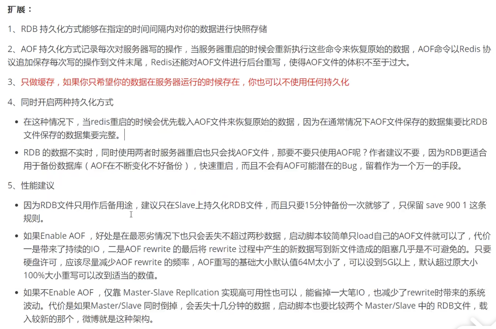

### RDB 和AOF 對比

| RDB        | AOF    |              |
| :--------- | :----- | :----------- |
| 啟動優先級 | 低     | 高           |
| 體積       | 小     | 大           |
| 恢復速度   | 快     | 慢           |
| 數據安全性 | 丟數據 | 根據策略決定 |


### 如何選擇使用哪種持久化方式？

一般來說， 如果想達到足以媲美PostgreSQL 的數據安全性， 你應該同時使用兩種持久化功能。

如果你非常關心你的數據， 但仍然可以承受數分鐘以內的數據丟失， 那麼你可以只使用RDB 持久化。

有很多用戶都只使用AOF 持久化， 但並不推薦這種方式： 因為定時生成RDB 快照（snapshot）非常便於進行數據庫備份， 並且RDB 恢復數據集的速度也要比AOF 恢復的速度要快。


## 十三、Redis發布與訂閱

Redis 發布訂閱(pub/sub)是一種消息通信模式：發送者(pub)發送消息，訂閱者(sub)接收消息。（關注系統）

Redis client can order multi channel

消息發送者、頻道、消息訂閱者

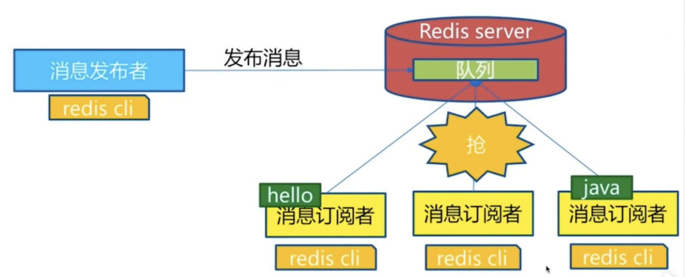

下圖展示了頻道channel1 ， 以及訂閱這個頻道的三個客戶端—— client2 、 client5 和client1 之間的關係：


當有新消息通過PUBLISH 命令發送給頻道channel1 時， 這個消息就會被發送給訂閱它的三個客戶端：


### 命令

| 命令                                     | 描述                               |
| :--------------------------------------- | :--------------------------------- |
| `PSUBSCRIBE pattern [pattern..]`         | 訂閱一個或多個符合給定模式的頻道。 |
| `PUNSUBSCRIBE pattern [pattern..]`       | 退訂一個或多個符合給定模式的頻道。 |
| `PUBSUB subcommand [argument[argument]]` | 查看訂閱與發布系統狀態。           |
| `PUBLISH channel message`                | 向指定頻道發布消息                 |
| `SUBSCRIBE channel [channel..]`          | 訂閱給定的一個或多個頻道。         |
| `SUBSCRIBE channel [channel..]`          | 退訂一個或多個頻道                 |

### 示例

```bash
同時開啟3個triminal
------------訂閱端terminal----------------------
127.0.0.1:6379> SUBSCRIBE sakura # 訂閱sakura頻道
Reading messages... (press Ctrl-C to quit) # 等待接收消息
1) "subscribe" # 訂閱成功的消息
2) "sakura"
3) (integer) 1
1) "message" # 接收到来自sakura頻道的消息 "hello world"
2) "sakura"
3) "hello world"
1) "message" # 接收到来自sakura頻道的消息 "hello i am sakura"
2) "sakura"
3) "hello i am sakura"

--------------消息發布端terminal-------------------
127.0.0.1:6379> PUBLISH sakura "hello world" # 發布消息到sakura頻道
(integer) 1
127.0.0.1:6379> PUBLISH sakura "hello i am sakura" # 發布消息
(integer) 1

-----------------查看活躍的頻道terminal------------
127.0.0.1:6379> PUBSUB channels
1) "sakura"
```


### 原理

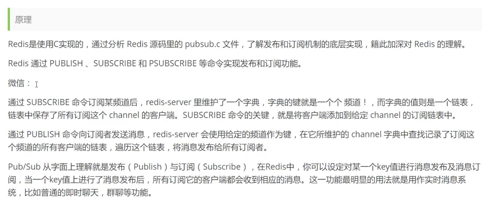

每個Redis 服務器進程都維持著一個表示服務器狀態的redis.h/redisServer 結構， 結構的pubsub_channels 屬性是一個字典， 這個字典就用於保存訂閱頻道的信息，其中，字典的鍵為正在被訂閱的頻道， 而字典的值則是一個鍊錶， 鍊錶中保存了所有訂閱這個頻道的客戶端。


客戶端訂閱，就被鏈接到對應頻道的鍊錶的尾部，退訂則就是將客戶端節點從鍊錶中移除。


### 缺點

1. 如果一個客戶端訂閱了頻道，但自己讀取消息的速度卻不夠快的話，那麼不斷積壓的消息會使redis輸出緩衝區的體積變得越來越大，這可能使得redis本身的速度變慢，甚至直接崩潰。
2. 這和數據傳輸可靠性有關，如果在訂閱方斷線，那麼他將會丟失所有在短線期間發布者發布的消息。


### 應用

1. 消息訂閱：公眾號訂閱，微博關注等等（起始更多是使用消息隊列來進行實現）
2. 多人在線聊天室。（頻道當聊天室，將訊息回顯給所有人）

稍微複雜的場景，我們就會使用消息中間件MQ處理。


## 十四、Redis主從複製

### 概念

主從複製，是指將一台Redis服務器的數據，複製到其他的Redis服務器。前者稱為主節點（Master/Leader），後者稱為從節點（Slave/Follower），數據的複製是單向的！只能由主節點複製到從節點（主節點以寫為主、從節點以讀為主）。

默認情況下，每台Redis服務器都是主節點，一個主節點可以有0個或者多個從節點，但每個從節點只能由一個主節點。

### 作用

1. 數據冗餘：主從復制實現了數據的熱備份，是持久化之外的一種數據冗餘的方式。
2. 故障恢復：當主節點故障時，從節點可以暫時替代主節點提供服務，是一種服務冗餘的方式
3. 負載均衡：在主從復制的基礎上，配合讀寫分離，由主節點進行寫操作，從節點進行讀操作，分擔服務器的負載；尤其是在多讀少寫的場景下，通過多個從節點分擔負載，提高並發量。
4. 高可用基石：主從復制還是哨兵和集群能夠實施的基礎。

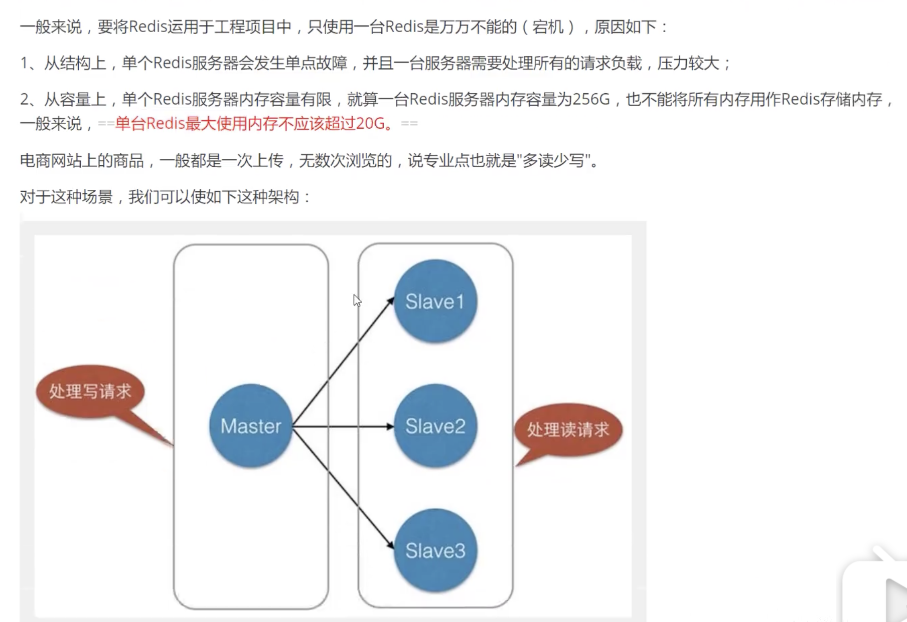

### 為什麼使用集群

1. 單台服務器難以負載大量的請求
2. 單台服務器故障率高，系統崩壞概率大
3. 單台服務器內存容量有限。


### 環境配置

只配置從庫，不用配置主庫，因為redis 默認自己本身就是一個主庫。

我們在講解配置文件的時候，注意到有一個`replication`模塊(見Redis.conf中第8條)

查看當前庫的信息：`info replication`

```bash
127.0.0.1:6379> info replication	#查看集群
# Replication
role:master # 角色
connected_slaves:0 # 從機数量
master_replid:3b54deef5b7b7b7f7dd8acefa23be48879b4fcff
master_replid2:0000000000000000000000000000000000000000
master_repl_offset:0
second_repl_offset:-1
repl_backlog_active:0
repl_backlog_size:1048576
repl_backlog_first_byte_offset:0
repl_backlog_histlen:0
```


```bash
[root@localhost kconfig]# ls
redis.conf
[root@localhost kconfig]# cp redis.conf redis79.conf
[root@localhost kconfig]# cp redis.conf redis80.conf
[root@localhost kconfig]# cp redis.conf redis81.conf
[root@localhost kconfig]# ls
redis.conf	redis79.conf	redis80.conf	redis81.conf
[root@localhost kconfig]# vimredis79.conf
```

 vimredis79.conf

```bash
port 6379
daemonize yes
pidfile /var/run/redis_6379.pid
logfile "6379.log"
dbfilename dump6379.rdb
```

redis80.conf

```bash
port 6380
daemonize yes
pidfile /var/run/redis_6380.pid
logfile "6380.log"
dbfilename dump6380.rdb
```

redis81.conf

```bash
port 6381
daemonize yes
pidfile /var/run/redis_6381.pid
logfile "6381.log"
dbfilename dump6381.rdb
```

既然需要啟動多個服務，就需要多個配置文件。每個配置文件對應修改以下信息：

- 端口號
- pid文件名
- 日誌文件名
- rdb文件名

修改完畢後，啟動三個redis服務器，可以通過進程訊息查看

啟動單機多服務集群：

```bash
----------------terminal.1-----------------------
[root@localhost kconfig]# cd ..
[root@localhost bin]# redis-server kconfig/redis79.conf
[root@localhost bin]# ls
6379.log	jeprof	...
appendonlyfile.aof ...
dump.rdb ...
----------------terminal.2-----------------------
[root@localhost bin]# redis-server kconfig/redis80.conf

----------------terminal.3-----------------------
[root@localhost bin]# redis-server kconfig/redis81.conf

----------------terminal.4.master-----------------------
[root@localhost kconfig]# ps -ef|grep redis
root 26553   1  0  22:30 ?   0:00:10 redis-server 127.0.1::6379
root 26628   1  0  22:30 ?   0:00:10 redis-server 127.0.1::6380
root 26654   1  0  22:30 ?   0:00:10 redis-server 127.0.1::6381
root 26553   26241  0  22:30 pts/3   0:00:10 grep --co;or=auto redis
```


### 一主二從配置

<mark>默認情況下，每台Redis服務器都是主節點；我們一般情況下只用配置從機就好了！</mark>

認老大！一主（79）二從（80，81）

使用`SLAVEOF host port`就可以為從機（80，81）配置主機了。

```bash
---------------------Terminal of port 80---------------------
127.0.0.1:6380> slaveof 127.0.0.1 6379 
ok
127.0.0.1:6380> info replication	#查看集群
# Replication
role:slave # 角色
master_host:127.0.0.1
master_port:6379
master_link_status:up
master_last_io_seconds_ago:3
master_sync_in_progress:0
slave_repl_offset:14
slave_priority:100
slave_read_only:1
connected_slaves:0
master_replid:3b54deef5b7b7b7f7dd8acefa23be48879b4fcff
master_replid2:0000000000000000000000000000000000000000
master_repl_offset:14
second_repl_offset:-1
repl_backlog_active:1
repl_backlog_size:1048576
repl_backlog_first_byte_offset:1
repl_backlog_histlen:14
---------------------Terminal of port 81---------------------
127.0.0.1:6381> slaveof 127.0.0.1 6379 
ok
127.0.0.1:6380> info replication	#查看集群
# Replication
role:slave # 角色
master_host:127.0.0.1
master_port:6379
...
```

然後主機（79）上也能看到從機的狀態：

```bash
127.0.0.1:6379> info replication	#查看集群
role:master # 角色
connected_slaves:2 # 從機数量
slave0:ip=127.0.0.1,port=6380,state=online,offset=196,lag=1
slave1:ip=127.0.0.1,port=6381,state=online,offset=196,lag=0
master_replid:3b54deef5b7b7b7f7dd8acefa23be48879b4fcff
master_replid2:0000000000000000000000000000000000000000
master_repl_offset:196
second_repl_offset:-1
repl_backlog_active:1
repl_backlog_size:1048576
repl_backlog_first_byte_offset:1
repl_backlog_histlen:196
```

我們這裡是使用命令搭建，是暫時的，<mark>真實開發中應該在從機的配置文件中進行配置，這樣的話是永久的。</mark>

```
vim redis.conf
--------------vim---------------
/replication + enter --> find replication


################################ REPLICATION #################################

# Master-Replica replication. Use replicaof to make a Redis instance a copy of
# another Redis server. A few things to understand ASAP about Redis replication.
#
#   +------------------+      +---------------+
#   |      Master      | ---> |    Replica    |
#   | (receive writes) |      |  (exact copy) |
#   +------------------+      +---------------+
# ...

# replicaof <masterip> <masterport>		從機設置
# ...
# masterauth <master-password>		主機密碼設置
```

### 層層配置

```
+-------------+      +------------------+			 +----------+
|  Master 79  | ---> |  slave/Master 80 |	---> | slave 81	|
+-------------+      +------------------+			 +----------+
此時的 port 80 依舊是一個從節點 ---> 無法寫入，只讀 ---> 一主二從
```

```bash
---------------------Terminal of port 80---------------------
127.0.0.1:6380> slaveof 127.0.0.1 6379 
ok
---------------------Terminal of port 81---------------------
127.0.0.1:6381> slaveof 127.0.0.1 6380 
ok
```


### 使用規則

1. 從機只能讀，不能寫，主機可讀可寫但是多用於寫。主機中所有訊息和數據，都會自動被從機保存。

   ```bash
   127.0.0.1:6381> set name sakura # 從機6381寫入失敗
   (error) READONLY You can't write against a read only replica. 127.0.0.1:6380> set name sakura # 从机6380写入失败 (error) READONLY You can't write against a read only replica.
   ------------------terminal master 79----------------------
   127.0.0.1:6379> set name sakura
   OK
   127.0.0.1:6379> get name
   "sakura"
   ------------------terminal slave 80----------------------
   127.0.0.1:6380> get name
   "sakura"
   ------------------terminal slave 81----------------------
   127.0.0.1:6381> get name
   "sakura"
   ```

2. 當主機斷電宕機後，默認情況下從機的角色不會發生變化，集群中只是失去了寫操作，當主機恢復以後，又會連接上從機恢復原狀。

3. 當從機斷電宕機後，若不是使用配置文件配置的從機，再次啟動後作為主機是無法獲取之前主機的數據的，若此時重新配置稱為從機，又可以獲取到主機的所有數據。這裡就要提到一個同步原理。

4. 第二條中提到，默認情況下，主機故障後，不會出現新的主機，有兩種方式可以產生新的主機：

   - 從機手動執行命令`slaveof no one`,這樣執行以後從機會獨立出來成為一個主機
   - 使用哨兵模式（自動選舉）

> 如果沒有老大了，這個時候能不能選擇出來一個老大呢？手動！

如果主機斷開了連接，我們可以使用`SLAVEOF no one`讓自己變成主機！其他的節點就可以手動連接到最新的主節點（手動）！如果這個時候老大修復了，那麼就重新連接（手動）！

```bash
------------------terminal slave 80----------------------
127.0.0.1:6380> SLAVEOF no one
ok
127.0.0.1:6380> info replication	#查看集群
# Replication
role:master # 角色
connected_slaves:1 # 從機数量
slave0:ip=127.0.0.1,port=6381,state=online,offset=1073,lag=0
master_replid:3b54deef5b7b7b7f7dd8acefa23be48879b4fcff
master_replid2:503eb1cf2dif06b7f41411a6601e0e0719b57
master_repl_offset:1073
second_repl_offset:1074
repl_backlog_active:1
repl_backlog_size:1048576
repl_backlog_first_byte_offset:1
repl_backlog_histlen:1073
```


## 十五、哨兵模式

**主從切換技術的方法是：當主服務器宕機後，需要手動把一台從服務器切換為主服務器，這就需要人工干預，費事費力，還會造成一段時間內服務不可用。**這不是一種推薦的方式，更多時候，我們優先考慮**哨兵模式**。

哨兵模式是一種特殊的模式，首先Redis提供了哨兵的命令，哨兵是一個獨立的進程，作為進程，它會獨立運行。其原理是**哨兵通過發送命令，等待Redis服務器響應，從而監控運行的多個Redis實例。**

> 單機單個哨兵

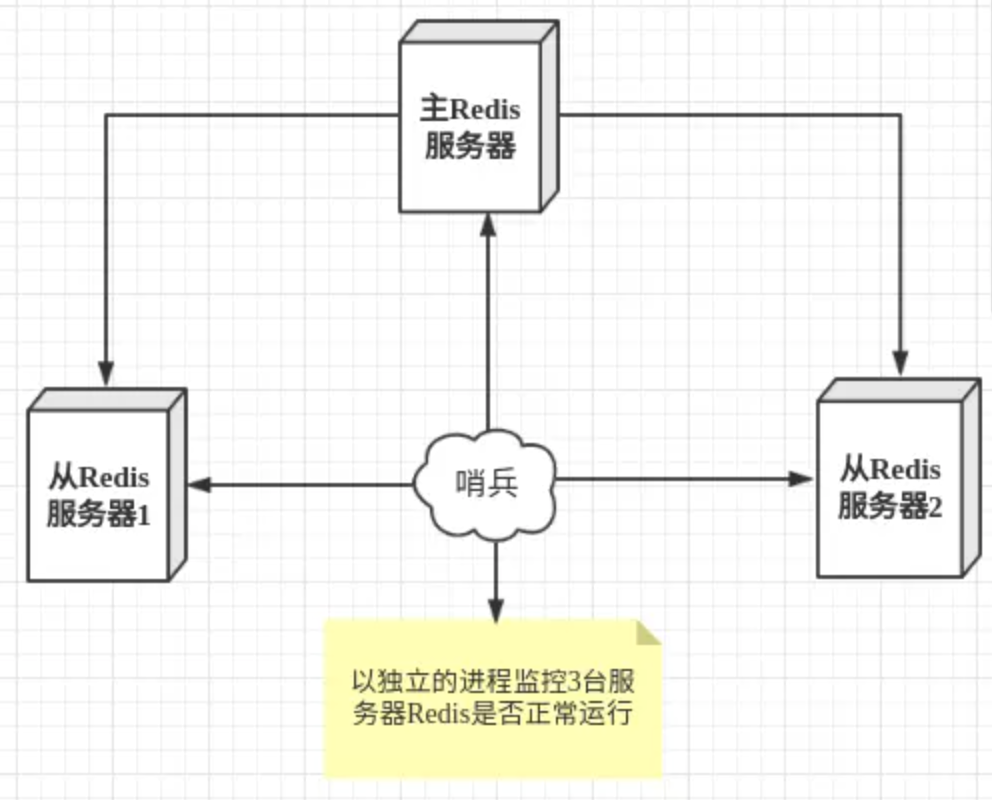

哨兵的作用：

- 通過發送命令，讓Redis服務器返回監控其運行狀態，包括主服務器和從服務器。
- 當哨兵監測到master宕機，會自動將slave切換成master，然後通過**發布訂閱模式**通知其他的從服務器，修改配置文件，讓它們切換主機。

然而一個哨兵進程對Redis服務器進行監控，可能會出現問題，為此，我們可以使用多個哨兵進行監控。各個哨兵之間還會進行監控，這樣就形成了多哨兵模式。

> 多哨兵模式

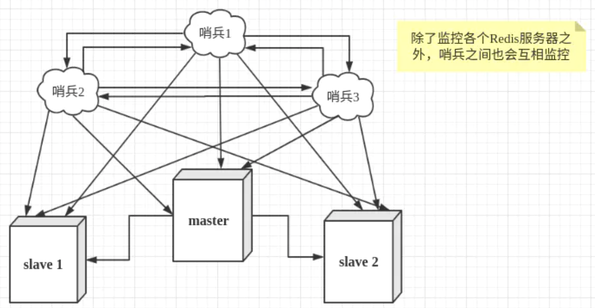

**故障切換（failover）**:

- **主觀下線: **

  假設主服務器宕機，哨兵1先檢測到這個結果，系統並不會馬上進行failover過程，僅僅是哨兵1主觀的認為主服務器不可用，這個現象成為**主觀下線**。

- **客觀下線**

  當後面的哨兵也檢測到主服務器不可用，並且數量達到一定值時，那麼哨兵之間就會進行一次投票，投票的結果由一個哨兵發起，進行failover操作。切換成功後，就會通過發布訂閱模式，讓各個哨兵把自己監控的從服務器實現切換主機，這個過程稱為**客觀下線**。這樣對於客戶端而言，一切都是透明的。

1, 哨兵的核心配置

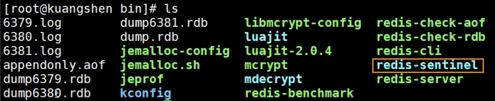

```bash
--------------------現在是一主二從配置---------------------
[root@localhost kconfig]# ll
-rw-r--r--	1	root	root	61810	Otc 26 20:12 redis79.conf
-rw-r--r--	1	root	root	61810	Otc 26 20:13 redis80.conf
-rw-r--r--	1	root	root	61810	Otc 26 20:13 redis81.conf
-rw-r--r--	1	root	root	61810	Otc 22 22:05 redis.conf
[root@localhost kconfig]# vim sentinel.conf		創立一個新的哨兵配置文件
--------------------vim---------------------
sentinel monitor mymaster 127.0.0.1 6379 1
~
~
~
# sentinel monitor  被監控的名稱host  port  1
```

- 數字1表示：當一個哨兵主觀認為主機斷開，就可以客觀認為主機故障，然後slave 開始選舉新的主機。

2, 成功啟動哨兵模式

```
[root@localhost kconfig]# redis-sentinel kconfig/sentinel.conf
```

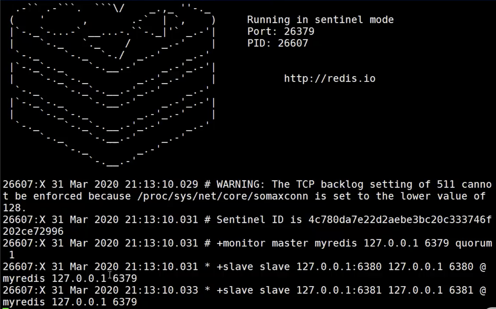

3, 測試

```bash
----------------------terminal 79 (master)----------------------
127.0.0.1:6379> set k1 v1
ok
127.0.0.1:6379> shutdown
not connect> exit
[root@localhost bin]#

----------------------terminal 80 (slave)----------------------
127.0.0.1:6380> info replication
#Replication
role:slave # 角色
master_host:127.0.0.1
master_port:6379
master_link_status:down
master_last_io_seconds_ago:-1
master_sync_in_progress:0
...
----------------------terminal 81 (slave)----------------------
127.0.0.1:6381> info replication
#Replication
role:slave # 角色
master_host:127.0.0.1
master_port:6379
master_link_status:down
master_last_io_seconds_ago:-1
master_sync_in_progress:0
...
```

此時哨兵監視著我們的主機6379，當我們斷開主機後（等一會兒）：

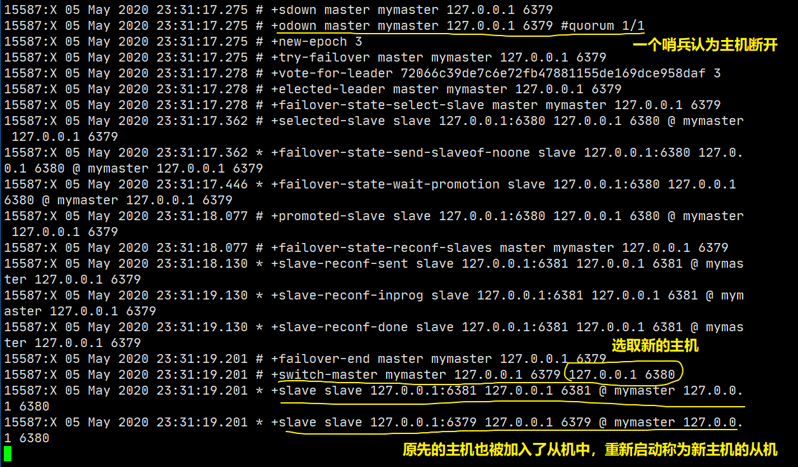


```bash
----------------------terminal 80 (slave)----------------------
127.0.0.1:6380> info replication
#Replication
role:master # 角色
connected_slaves:1 # 從機数量
slave0:ip=127.0.0.1,port=6381,state=online,offset=6301,lag=1
master_replid:3b54deef5b7b7b7f7dd8acefa23be48879b4fcff
master_replid2:503eb1cf2dif06b7f41411a6601e0e0719b57
...
----------------------terminal 81 (slave)----------------------
127.0.0.1:6381> info replication
#Replication
role:slave # 角色
master_host:127.0.0.1
master_port:6380
master_link_status:down
master_last_io_seconds_ago:-1
master_sync_in_progress:0
...
```


> 哨兵模式優缺點

**優點：**

1. 哨兵集群，基於主從復制模式，所有主從復制的優點，它都有
2. 主從可以切換，故障可以轉移，系統的可用性更好
3. 哨兵模式是主從模式的升級，手動到自動，更加健壯

**缺點：**

1. Redis不好在線擴容，集群容量一旦達到上限，在線擴容就十分麻煩
2. 實現哨兵模式的配置其實是很麻煩的，裡面有很多配置項

> 哨兵模式的全部配置

完整的哨兵模式配置文件sentinel.conf

一個哨兵，對應一個 sentinel.conf 配置文件

```bash
# Example sentinel.conf
 
# 哨兵sentinel實例運行的端口 默認26379
# 如果有哨兵集群，我們還需要配置每個哨兵端口
port 26379
 
# 哨兵sentinel的工作目錄
dir /tmp
 
# 哨兵sentinel監控的redis主節點的 ip port
# master-name 可以自己命名的主節點名字 只能由字母A-z、數字0-9 、這三個字符".-_"組成。
# quorum 當這些quorum個數sentinel哨兵認為master主節點失聯 那麼這時 客觀上認為主節點失聯了
# sentinel monitor <master-name> <ip> <redis-port> <quorum>
sentinel monitor mymaster 127.0.0.1 6379 1
 
# 當在Redis實例中開啟了requirepass foobared 授權密碼 這樣所有連接Redis實例的客戶端都要提供密碼
# 設置哨兵sentinel 連接主從的密碼 注意必須為主從設置一樣的驗證密碼
# sentinel auth-pass <master-name> <password>
sentinel auth-pass mymaster MySUPER--secret-0123passw0rd
 
 
# 指定多少毫秒之後 主節點沒有應答哨兵sentinel 此時 哨兵主觀上認為主節點下線 默認30秒
# sentinel down-after-milliseconds <master-name> <milliseconds>
sentinel down-after-milliseconds mymaster 30000
 
# 這個配置項指定了在發生failover主備切換時最多可以有多少個slave同時對新的master進行 同步，這個數字越小，完成failover所需的時間就越長，但是如果這個數字越大，就意味著越 多的slave因為replication而不可用。可以通過將這個值設為 1 來保證每次只有一個slave 處於不能處理命令請求的狀態。
# sentinel parallel-syncs <master-name> <numslaves>
sentinel parallel-syncs mymaster 1
 
 
 
# 故障轉移的超時時間 failover-timeout 可以用在以下這些方面：
#1. 同一個sentinel對同一個master兩次failover之間的間隔時間。
#2. 當一個slave從一個錯誤的master那裡同步數據開始計算時間。直到slave被糾正為向正確的master那裡同步數據時。
#3.當想要取消一個正在進行的failover所需要的時間。
#4.當進行failover時，配置所有slaves指向新的master所需的最大時間。不過，即使過了這個超時，slaves依然會被正確配置為指向master，但是就不按parallel-syncs所配置的規則來了
# 默認三分鐘
# sentinel failover-timeout <master-name> <milliseconds>
sentinel failover-timeout mymaster 180000
 
# SCRIPTS EXECUTION
 
#配置當某一事件發生時所需要執行的腳本，可以通過腳本來通知管理員，例如當系統運行不正常時發郵件通知相關人員。
#對於腳本的運行結果有以下規則：
#若腳本執行後返回1，那麼該腳本稍後將會被再次執行，重複次數目前默認為10
#若腳本執行後返回2，或者比2更高的一個返回值，腳本將不會重複執行。
#如果腳本在執行過程中由於收到系統中斷信號被終止了，則同返回值為1時的行為相同。
#一個腳本的最大執行時間為60s，如果超過這個時間，腳本將會被一個SIGKILL信號終止，之後重新執行。
 
#通知型腳本:當sentinel有任何警告級別的事件發生時（比如說redis實例的主觀失效和客觀失效等等），將會去調用這個腳本，
#這時這個腳本應該通過郵件，SMS等方式去通知系統管理員關於系統不正常運行的信息。調用該腳本時，將傳給腳本兩個參數，
#一個是事件的類型，
#一個是事件的描述。
#如果sentinel.conf配置文件中配置了這個腳本路徑，那麼必須保證這個腳本存在於這個路徑，並且是可執行的，否則sentinel無法正常啟動成功。
#通知腳本
# sentinel notification-script <master-name> <script-path>
  sentinel notification-script mymaster /var/redis/notify.sh
 
# 客戶端重新配置主節點參數腳本
# 當一個master由於failover而發生改變時，這個腳本將會被調用，通知相關的客戶端關於master地址已經發生改變的信息。
# 以下參數將會在調用腳本時傳給腳本:
# <master-name> <role> <state> <from-ip> <from-port> <to-ip> <to-port>
# 目前<state>總是“failover”,
# <role>是“leader”或者“observer”中的一個。
# 參數 from-ip, from-port, to-ip, to-port是用來和舊的master和新的master(即舊的slave)通信的
# 這個腳本應該是通用的，能被多次調用，不是針對性的。
# sentinel client-reconfig-script <master-name> <script-path>
sentinel client-reconfig-script mymaster /var/redis/reconfig.sh
```


## 十六、緩存穿透與雪崩

服務高可用問題

### 緩存穿透（查不到）

> 概念

在默認情況下，用戶請求數據時，會先在緩存(Redis)中查找，若沒找到即緩存未命中，再在數據庫中進行查找，數量少可能問題不大，可是一旦大量的請求數據（例如秒殺場景）緩存都沒有命中的話，就會全部轉移到數據庫上，造成數據庫極大的壓力，就有可能導致數據庫崩潰。網絡安全中也有人惡意使用這種手段進行攻擊被稱為洪水攻擊。

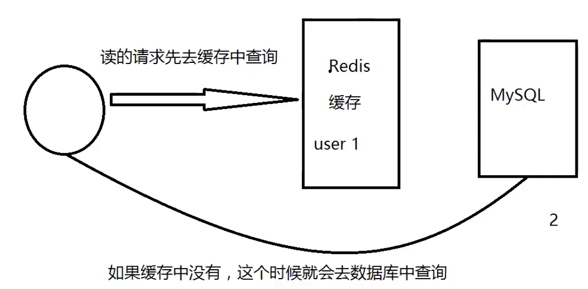

> 解決方案

**布隆過濾器**

對所有可能查詢的參數以Hash的形式存儲，以便快速確定是否存在這個值，在控制層先進行攔截校驗，校驗不通過直接打回，減輕了存儲系統的壓力。


**緩存空對象**

一次請求若在緩存和數據庫中都沒找到，就在緩存中方一個空對像用於處理後續這個請求。


 這樣做有一個缺陷：存儲空對像也需要空間，大量的空對象會耗費一定的空間，存儲效率並不高。解決這個缺陷的方式就是設置較短過期時間

即使對空值設置了過期時間，還是會存在緩存層和存儲層的數據會有一段時間窗口的不一致，這對於需要保持一致性的業務會有影響。


### 緩存擊穿（量太大，緩存過期）

> 概念

 相較於緩存穿透，緩存擊穿的目的性更強，一個存在的key，在緩存過期的一刻，同時有大量的請求，這些請求都會擊穿到DB，造成瞬時DB請求量大、壓力驟增。這就是緩存被擊穿，只是針對其中某個key的緩存不可用而導致擊穿，但是其他的key依然可以使用緩存響應。

 比如熱搜排行上，一個熱點新聞被同時大量訪問就可能導致緩存擊穿。

> 解決方案

1. **設置熱點數據永不過期**

   這樣就不會出現熱點數據過期的情況，但是當Redis內存空間滿的時候也會清理部分數據，而且此種方案會佔用空間，一旦熱點數據多了起來，就會佔用部分空間。

2. **加互斥鎖(分佈式鎖)**

   在訪問key之前，採用SETNX（set if not exists）來設置另一個短期key來鎖住當前key的訪問，訪問結束再刪除該短期key。保證同時刻只有一個線程訪問，其餘線程等待。這樣對鎖的要求就十分高。


### 緩存雪崩

> 概念

大量的key設置了相同的過期時間，導致在緩存在同一時刻全部失效，造成瞬時DB請求量大、壓力驟增，引起雪崩。


> 解決方案

- redis高可用

  這個思想的含義是，既然redis有可能掛掉，那我多增設幾台redis，這樣一台掛掉之後其他的還可以繼續工作，其實就是搭建的集群（異地多活）

- 限流降級

  這個解決方案的思想是，在緩存失效後，通過加鎖或者隊列來控制讀數據庫寫緩存的線程數量。比如對某個key只允許一個線程查詢數據和寫緩存，其他線程等待。

- 數據預熱

  數據加熱的含義就是在正式部署之前，我先把可能的數據先預先訪問一遍，這樣部分可能大量訪問的數據就會加載到緩存中。在即將發生大並發訪問前手動觸發加載緩存不同的key，設置不同的過期時間，讓緩存失效的時間點盡量均勻。


