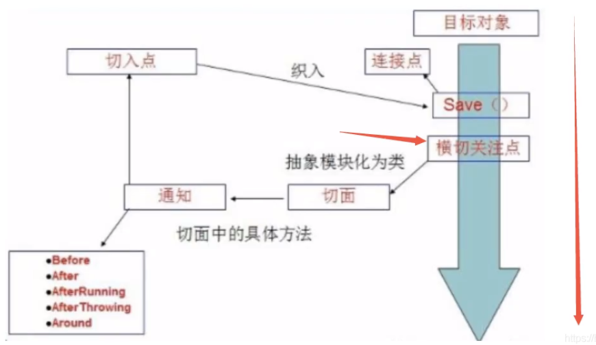

# Spring

[狂神说spring5](https://www.bilibili.com/video/BV1WE411d7Dv)

[Spring Framework Documentation](https://spring.io/projects/spring-framework#learn)

## 1, 概述及IOC理論推導

> 優點

1、Spring是一個開源免費的框架 , 容器 .

2、Spring是一個輕量級的框架 , 非侵入式的 .

3、控制反轉 IoC , 面向切面 Aop

4、對事物的支持 , 對框架的支持

.......

一句話概括：

Spring是一個輕量級的控制反轉(IoC)和麵向切面(AOP)的容器（框架）。


### 1.1 組成


Spring 框架是一個分層架構，由 7 個定義良好的模塊組成。 Spring 模塊構建在核心容器之上，核心容器定義了創建、配置和管理 bean 的方式 .


組成 Spring 框架的每個模塊（或組件）都可以單獨存在，或者與其他一個或多個模塊聯合實現。每個模塊的功能如下：

核心容器：核心容器提供 Spring 框架的基本功能。核心容器的主要組件是 BeanFactory，它是工廠模式的實現。 BeanFactory 使用控制反轉（IOC） 模式將應用程序的配置和依賴性規範與實際的應用程序代碼分開。

Spring 上下文：Spring 上下文是一個配置文件，向 Spring 框架提供上下文信息。 Spring 上下文包括企業服務，例如 JNDI、EJB、電子郵件、國際化、校驗和調度功能。

Spring AOP：通過配置管理特性，Spring AOP 模塊直接將面向切面的編程功能 , 集成到了 Spring 框架中。所以，可以很容易地使 Spring 框架管理任何支持 AOP的對象。 Spring AOP 模塊為基於 Spring 的應用程序中的對象提供了事務管理服務。通過使用 Spring AOP，不用依賴組件，就可以將聲明性事務管理集成到應用程序中。

Spring DAO：JDBC DAO 抽象層提供了有意義的異常層次結構，可用該結構來管理異常處理和不同數據庫供應商拋出的錯誤消息。異常層次結構簡化了錯誤處理，並且極大地降低了需要編寫的異常代碼數量（例如打開和關閉連接）。 Spring DAO 的面向 JDBC 的異常遵從通用的 DAO 異常層次結構。

Spring ORM：Spring 框架插入了若干個 ORM 框架，從而提供了 ORM 的對象關係工具，其中包括 JDO、Hibernate 和 iBatis SQL Map。所有這些都遵從 Spring 的通用事務和 DAO 異常層次結構。

Spring Web 模塊：Web 上下文模塊建立在應用程序上下文模塊之上，為基於 Web 的應用程序提供了上下文。所以，Spring 框架支持與 Jakarta Struts 的集成。 Web 模塊還簡化了處理多部分請求以及將請求參數綁定到域對象的工作。

Spring MVC 框架：MVC 框架是一個全功能的構建 Web 應用程序的 MVC 實現。通過策略接口，MVC 框架變成為高度可配置的，MVC 容納了大量視圖技術，其中包括 JSP、Velocity、Tiles、iText 和 POI。


> 拓展

Spring Boot與Spring Cloud

Spring Boot 是 Spring 的一套快速配置腳手架，可以基於Spring Boot 快速開發單個微服務;

Spring Cloud是基於Spring Boot實現的；

Spring Boot專注於快速、方便集成的單個微服務個體，Spring Cloud關注全局的服務治理框架；

Spring Boot使用了約束優於配置的理念，很多集成方案已經幫你選擇好了，能不配置就不配置, Spring Cloud很大的一部分是基於Spring Boot來實現，Spring Boot可以離開Spring Cloud獨立使用開發項目，但是Spring Cloud離不開Spring Boot，屬於依賴的關係。

SpringBoot在SpringClound中起到了承上啟下的作用，如果你要學習SpringCloud必須要學習SpringBoot。

### enviroment

一、建立Maven Project

1、 file --> New --> Other，--> Maven --> Maven Project --> Next

2、勾選 Create a simple project ( skip archetype selfction) --> Next

3、輸入Group Id（包名稱）, Artifact Id（項目名稱）,`  Packaging選擇pom，因為建立的Maven Project是一個聚合模組，沒有實際程式碼`。Name, Description兩項可以不用輸入。因為建立的Maven Project是聚合模組，所以Parent Project不要選擇。

> ```xml
> <!-- import Spring jar in parent module(pom.xml of maven project), so you can use the springframework within children module without importing the spring.jar individually -->
> <dependency>
>    <groupId>org.springframework</groupId>
>    <artifactId>spring-webmvc</artifactId>
>    <version>5.1.10.RELEASE</version>
> </dependency>
> ```
>
> 

二、建立Maven Module，Maven Module是Maven Project的子模組

1、選擇上面建立的Maven Project，右擊new --> other --> maven module，	勾選Create a simple project ( skip archetype selfction)，輸入子工程模塊名稱，點選Next

2、 這裡可以全部保持預設值，package chose the maven project you just created。

> 如何從Eclipse中包含啟動歷史的“運行/調試”下拉菜單中刪除啟動配置？
>
> 顯示下拉列表時，在要刪除的運行配置歷史記錄上顯示`Ctrl + Shift + click(the run history want to remove)`。將打開一個對話框，以確認刪除。
>
> 您可以在Eclipse的首選項中禁用確認對話框：**窗口**>**首選項**>**運行/調試**>**啟動**：取消選中“從啟動歷史記錄中刪除配置時提示確認”。

### 1.2 IOC理論推導

> IoC基礎

Create a maven project 

新建一個空白的maven項目

分析實現

先用我們原來的方式寫一段代碼 .

1、先寫一個UserDao接口

```java
public interface UserDao {
   public void getUser();
}
```

2、再去寫Dao的實現類

```java
public class UserDaoImpl implements UserDao {
   @Override
   public void getUser() {
       System.out.println("獲取用戶數據");
  }
}
```

3、然後去寫UserService的接口

```java
public interface UserService {
   public void getUser();
}
```

4、最後寫Service的實現類

```java
public class UserServiceImpl implements UserService {
   private UserDao userDao = new UserDaoImpl();

   @Override
   public void getUser() {
       userDao.getUser();
  }
}
```

5、測試一下

```java
@Test
public void test(){
  // 用戶調的是 service 層，dao層的實現類不需要接觸
   UserService service = new UserServiceImpl();
   service.getUser();
}
```

這是原來的方式 , 開始大家也都是這麼去寫的 . 那現在修改一下 .

---

把Userdao的實現類增加一個 .

```java
public class UserDaoMySqlImpl implements UserDao {
   @Override
   public void getUser() {
       System.out.println("MySql獲取用戶數據");
  }
}
```

緊接著我們要去使用MySql的話 , 我們就需要去service實現類裡面修改對應的實現

```java
public class UserServiceImpl implements UserService {
  // private UserDao userDao = new UserDaoImpl(); 
  private UserDao userDao = new UserDaoMySqlImpl();

   @Override
   public void getUser() {
       userDao.getUser();
  }
}
```

在假設, 我們再增加一個Userdao的實現類 .

```java
public class UserDaoOracleImpl implements UserDao {
   @Override
   public void getUser() {
       System.out.println("Oracle獲取用戶數據");
  }
}
```

那麼我們要使用Oracle , 又需要去service實現類裡面修改對應的實現.

```java
public class UserServiceImpl implements UserService {
   // private UserDao userDao = new UserDaoImpl();
   // private UserDao userDao = new UserDaoMySqlImpl();
	private UserDao userDao = new UserDaoOracleImpl();
   @Override
   public void getUser() {
       userDao.getUser();
  }
}
```

假設我們的這種需求非常大, 這種方式就根本不適用了,每次變動, 都需要修改大量代碼. 這種設計的耦合性太高了, 牽一發而動全身 .

那我們如何去解決呢 ?

我們可以在需要用到他的地方 , 不去實現它 , 而是留出一個接口 , 利用set , 我們去代碼裡修改下 .

````java
public class UserServiceImpl implements UserService {
   private UserDao userDao;
		// 利用set進行動態實現值
   public void setUserDao(UserDao userDao) {
       this.userDao = userDao;
  }

   @Override
   public void getUser() {
       userDao.getUser();
  }
}
````

現在去我們的測試類裡 , 進行測試 ;

```java
@Test
public void test(){
	   UserService service = new UserServiceImpl();
	   
	   ((UserServiceImpl) service).setUserDao( new UserDaoMySqlImpl() );
	   service.getUser();
	   //那我們現在又想用Oracle去實現呢
	   ((UserServiceImpl) service).setUserDao( new UserDaoOracleImpl() );
	   service.getUser();
}
```

- 以前所有東西都是由程序去進行控制創建, 
- 而現在把主動權交給了調用者. 程序不用去管怎麼創建,怎麼實現了. 它只負責提供一個接口 .


這種思想 , 從本質上解決了問題 , 程序不再去管理對象的創建了 , 更多的去關注業務的實現 . 耦合性大大降低 . 這也就是IOC的原型 !

### 1.3 IOC本質

- 控制反轉IoC(Inversion of Control)，是一種設計思想，
- DI(依賴注入)是實現IoC的一種方法，也有人認為DI只是IoC的另一種說法。

沒有IoC的程序中, 我們使用面向對象編程, 對象的創建與對象間的依賴關係完全硬編碼在程序中，對象的創建由程序自己控制，

控制反轉後將對象的創建轉移給第三方，個人認為所謂控制反轉就是：獲得依賴對象的方式反轉了。


`IoC是Spring框架的核心內容`，使用多種方式完美的實現了IoC，

- 可以使用XML配置，
- 也可以使用註解，新版本的Spring也可以零配置實現IoC。

Spring容器在初始化時先讀取配置文件，根據配置文件或元數據創建與組織對象存入容器中，程序使用時再從Ioc容器中取出需要的對象。


- 採用XML方式配置Bean的時候，Bean的定義信息是和實現分離的，

- 而採用註解的方式可以把兩者合為一體，Bean的定義信息直接以註解的形式定義在實現類中，從而達到了零配置的目的。

控制反轉是一種通過描述（XML或註解）並通過第三方去生產或獲取特定對象的方式。在Spring中實現控制反轉的是IoC容器，其實現方法是依賴注入（Dependency Injection,DI）。

### ==== Eclipse如何搭建父子工程 ====

[Eclipse如何搭建父子工程](https://blog.csdn.net/duan196_118/article/details/104323889)


[構建Maven專案的完整過程--普通web專案（Eclipse](https://www.itread01.com/content/1543296122.html)

[Eclipse使用（十二）—— 创建Maven多模块（父子）项目演示Maven的聚合和继承以及模块之间的依赖关系](https://blog.csdn.net/Alexshi5/article/details/79627346)


## 2, 快速上手Spring

> 導入Jar包

注 : spring 需要導入commons-logging進行日誌記錄 . 我們利用maven , 他會自動下載對應的依賴項 .

```java
<dependency>
   <groupId>org.springframework</groupId>
   <artifactId>spring-webmvc</artifactId>
   <version>5.1.10.RELEASE</version>
</dependency>
```

> 編寫代碼

1、編寫一個Hello實體類

```java
public class Hello {
   private String name;

   public String getName() {
       return name;
  }
   public void setName(String name) {
       this.name = name;
  }

   public void show(){
       System.out.println("Hello,"+ name );
  }
}
```

2、編寫我們的spring文件 , 這裡我們命名為`beans.xml` (under resources file)

```xml
<?xml version="1.0" encoding="UTF-8"?>
<beans xmlns="http://www.springframework.org/schema/beans"
      xmlns:xsi="http://www.w3.org/2001/XMLSchema-instance"
      xsi:schemaLocation="http://www.springframework.org/schema/beans
       http://www.springframework.org/schema/beans/spring-beans.xsd">

   <!--bean就是java對象 , 由Spring創建和管理-->
   <!--
			使用pring來創建對象，這些都稱為bean
			
			類型 變量名 = new 類型()
			Hello hello = new Hello()

			bean = new 對象	
 			id = 變量名
			class = new 的對象
			property ＝ 給對象中的屬性(name) 設值(value)
		-->
   <bean id="hello" class="com.wong.pojo.Hello">
       <property name="name" value="Spring"/>
   </bean>

</beans>
```

3、我們可以去進行測試了 `Mytest.java`

```java
public class MyTest {
	@Test
	public void test(){
     // 要加載 xml文件，必須通過 ApplicationContext（固定寫法）---> 獲取 Spring 的上下文對象
	   //解析beans.xml文件 , 生成管理相應的Bean對象
	   ApplicationContext context = new ClassPathXmlApplicationContext("beans.xml");
    // 我們的對象都在 Spring 中管理了，要使用直接從裡面取出來
	   //getBean : 參數即為spring配置文件中bean的id .
	   Hello hello = (Hello) context.getBean("hello");
	   hello.show();
	}
}

```

> 思考

- Hello 對像是誰創建的 ? hello 對像是由Spring創建的

-  Hello 對象的屬性是怎麼設置的 ? hello 對象的屬性是由Spring容器設置的

這個過程就叫控制反轉 :

- 控制 : 誰來控制對象的創建 , 傳統應用程序的對像是由程序本身控制創建的 , 使用Spring後 , 對象是由Spring來創建的

- 反轉 : 程序本身不創建對象 , 而變成被動的接收對象 .

- 依賴注入 : 就是利用set方法來進行注入的.

 IOC是一種編程思想，由主動的編程變成被動的接收

可以通過`new ClassPathXmlApplicationContext`去瀏覽一下底層源碼 .

`ApplicationContext context = new ClassPathXmlApplicationContext("beans.xml");`

```java
		ApplicationContext 
		|
		ConfigurableApplicationContext
  	|
  	AbstractApplicationContext
  	|
  	AbstractRefreshableApplicationContext
    |
    AbstractRefreshableConfigApplicationContext
    |
    AbstractXmlApplicationContext
    |
    new ClassPathXmlApplicationContex
```


### 2.1 修改案例一

我們在案例一中， 新增一個Spring配置文件beans.xml

```xml
<?xml version="1.0" encoding="UTF-8"?>
<beans xmlns="http://www.springframework.org/schema/beans"
      xmlns:xsi="http://www.w3.org/2001/XMLSchema-instance"
      xsi:schemaLocation="http://www.springframework.org/schema/beans
       http://www.springframework.org/schema/beans/spring-beans.xsd">

   <!--bean就是java對象( = new java對象) , 由Spring創建和管理-->
   <bean id="mysqlImpl" class="com.wong.dao.UserDaoMySqlImpl">
   </bean>
   <bean id="oracleImpl" class="com.wong.dao.UserDaoOracleImpl">
   </bean>
   <!--注意: 這裡的name並不是屬性 , 而是set方法後面的那部分 , 首字母小寫-->
       <!--引用另外一個bean , 不是用value 而是用 ref-->
       <!-- 
		ref : 引用 Spring 容器中創建好的對象 bean 
		value : 具體的值，基本數據類型	
		-->
   <bean id="UserServiceImpl" class="com.wong.service.UserServiceImpl">
       <property name="userDao" ref="mysqlImpl"/>
   </bean>
	
</beans>
```


測試！

```java
public class test {
	@Test
	public void test2() {
		// 獲取 ApplicationContext ：拿到 Spring 的容器
		ApplicationContext context = new ClassPathXmlApplicationContext("beans.xml");
		// 拿到容器，需要什麼，就 get 什麼
		UserServiceImpl userServiceImpl = (UserServiceImpl) context.getBean("UserServiceImpl");
		userServiceImpl.getUser();
	}
}
---------------console----------------
  MySql獲取用戶數據
```

OK , 到了現在 , 我們徹底不用再程序中去改動了 , 要實現不同的操作 , 只需要在xml配置文件中進行修改 , `所謂的IoC : 對象由Spring 來創建 , 管理 , 裝配 !`


### 2.2 IOC創建對象方式

> 默認：通過無參構造方法來創建

1、User.java

```java
public class User {
   private String name;
   public User() {
       System.out.println("user無參構造方法");
  }
   public void setName(String name) {
       this.name = name;
  }
   public void show(){
       System.out.println("name="+ name );
  }
}
```

2、beans.xml

```xml
<?xml version="1.0" encoding="UTF-8"?>
<beans xmlns="http://www.springframework.org/schema/beans"
      xmlns:xsi="http://www.w3.org/2001/XMLSchema-instance"
      xsi:schemaLocation="http://www.springframework.org/schema/beans
       http://www.springframework.org/schema/beans/spring-beans.xsd">

   <bean id="user" class="com.kuang.pojo.User">
       <property name="name" value="kuangshen"/>
   </bean>

</beans>
```

3、測試類

```java
@Test
public void test(){
   ApplicationContext context = new ClassPathXmlApplicationContext("beans.xml");
   //在執行getBean的時候, user已經創建好了 , 通過無參構造
    User user = (User) context.getBean("user");
    User user2 = (User) context.getBean("user");
    System.out.println(user == user2);
   //調用對象的方法 .
   user.show();
}
------------console-----------
user無參構造方法
true
name=wong
```

結果可以發現，在調用show方法之前，User對象已經通過無參構造初始化了！

--->` 類一但註冊到 bean 中，當配置文件被加載的時候，容器中（ApplicationContext）管理（註冊）的對象就已經初始化了`


#### eclipse debug

> eclipse debug
> 1) 斷點breakpoint的使用: 在Java程式碼的行號處使用滑鼠雙擊出一個斷點 or  按右鍵 ---> toggle breakpoint
>
> 2) 在專案的地方, 按右鍵, 選擇  Debug As / Debug  (besure to turn off  Run --> "Skip all breakpoints")
>
> 3) Debug檢視
>
> 如果我們在第一次執行debug模式的時候,程式執行到斷點處會出現一個提示
>
> 按 "**No**", 讓 Debug 視窗不會佔用太多視窗空間, 而在下方多一個 **Debug 頁籤** :
>
> 4) Debug 若採用 "**Step Into**", 則遇到**函數**的地方, 會**進入該函數內部**, 一行一行執行 :

> 使用有參構造方法來創建

```java
public class User {
   private String name;
   public User() {
       System.out.println("user無參構造方法");
  }
   public User(String name) {
	   this.name = name;
   }
   public void setName(String name) {
       this.name = name;
  }
   public void show(){
       System.out.println("name="+ name );
  }
}
```

1, 第一種：下標賦值 constructor argument index

```xml
<!-- 第一種：下標賦值 -->
<bean id="user" class="com.wong.pojo.User">
  <constructor-arg index="0" value="constructor(wong)"></constructor-arg>
</bean>
```

2, 第二種：通過類型創建，不建議使用 constructor argument type

```xml
<bean id="user" class="com.wong.pojo.User">
  <!-- 第二種：通過類型創建，不建議使用 -->
  <constructor-arg type="java.lang.String" value="constructor2(wong)"></constructor-arg>
</bean>
```

3, 第三種： 參數名

```xml
<bean id="user" class="com.wong.pojo.User">
  <constructor-arg name="name" value="constructor3(wong)"></constructor-arg>
</bean>
```

### 2.3 bean配置

> bean, alias

```xml
<!-- 
 id：bean 的為一標示符相當於對象名
 class：bean 對象對應的全限命名：包名＋類型
 name：也是別名，可以同時取多個別名（用空格獲逗號分開）
 scope：默認單例＝全局為一
  -->
<bean id="user" class="com.wong.pojo.User" name="n1, n2 nn, yy">
  <constructor-arg name="name" value="constructor3(wong)"></constructor-arg>
</bean>
<!-- 別名：添加別名，就可以通過別名獲取到這個對象 （一對一）-->
<alias name="user" alias="user-alis"/>
```

```java
@Test
	public void test() {
		ApplicationContext context = new ClassPathXmlApplicationContext("beans.xml");
	   //在執行getBean的時候, user已經創建好了 , 通過無參構造
	   User user = (User) context.getBean("user-alis");
	   User user2 = (User) context.getBean("user");
	   User user3 = (User) context.getBean("n1");
	   User user4 = (User) context.getBean("nn");
	   
	   System.out.println(user == user2);
	   System.out.println(user3 == user2);
	   System.out.println(user4 == user2);
	   //調用對象的方法 .
	   user.show();
	}
------------console-------------
true
true
true
name=constructor3(wong)
```

> Import

一般用於團隊開發 ---> 多人開發不同的類，不同的類需要註冊到不同 bean 中，通過 Import，可以將多個配置文件 `beans.xml`，導入合併成一個 `applicationContext.xml `。

applicationContext.xml 

```xml
<?xml version="1.0" encoding="UTF-8"?>
<beans xmlns="http://www.springframework.org/schema/beans"
      xmlns:xsi="http://www.w3.org/2001/XMLSchema-instance"
      xsi:schemaLocation="http://www.springframework.org/schema/beans
       http://www.springframework.org/schema/beans/spring-beans.xsd">
      
     <import resource="beans.xml"/>
     <import resource="beans1.xml"/>
     <import resource="beans2.xml"/>
</beans>
```

beans.xml

```xml
<?xml version="1.0" encoding="UTF-8"?>
<beans xmlns="http://www.springframework.org/schema/beans"
       xmlns:xsi="http://www.w3.org/2001/XMLSchema-instance"
       xsi:schemaLocation="http://www.springframework.org/schema/beans
                           http://www.springframework.org/schema/beans/spring-beans.xsd">

  <bean id="user" class="com.wong.pojo.User" name="n1, n2 nn, yy">
    <constructor-arg name="name" value="constructor3(wong)"></constructor-arg>
  </bean>
  <alias name="user" alias="user-alis"/>

</beans>
```

MyTest.java

```java
@Test
public void test() {
  ApplicationContext context = new ClassPathXmlApplicationContext("applicationContext.xml");
  //在執行getBean的時候, user已經創建好了 , 通過無參構造
  User user = (User) context.getBean("user");
  //調用對象的方法 .
  user.show();
}
```


## 3, 依賴注入（DI）

> 概念

依賴注入（Dependency Injection,DI）。

`依賴 : 指Bean對象的創建依賴於容器 . Bean對象的依賴資源 .`

`注入 : 指Bean對象所依賴的資源 , 由容器來設置和裝配 .`

> 構造器注入

在之前的案例已經講過了

> Set 注入 （重點）

要求被注入的屬性 , 必須有set方法 , set方法的方法名由set + 屬性首字母大寫 , 如果屬性是boolean類型 , 沒有set方法 , 是 is .

測試pojo類 :

Address.java

```java
public class Address {
  private String address;
  public String getAddress() {
    return address;
  }
  public void setAddress(String address) {
    this.address = address;
  }
}
```
Student.java

```java
public class Student {

  private String name;
  private Address address;
  private String[] books;
  private List<String> hobbys;
  private Map<String,String> card;
  private Set<String> games;
  private String mate;
  private Properties info;
  // getter /setter...

  public void show(){
    System.out.println("name="+ name
                       + ",address="+ address.getAddress()
                       + ",books="
                      );
    for (String book:books){
      System.out.print("<<"+book+">>\t");
    }
    System.out.println("\n爱好:"+hobbys);
    System.out.println("card:"+card);
    System.out.println("games:"+games); 
    System.out.println("mate:"+mate); 
    System.out.println("info:"+info);
  }
}
```

### 3.1、常量注入

```xml
<bean id="student" class="com.wong.pojo.Student">
  <property name="name" value="wong"/>
</bean>
```

測試：

```java
@Test
public void test01() {
  ApplicationContext context = new ClassPathXmlApplicationContext("beans.xml");
  Student student = (Student) context.getBean("student");
  System.out.println(student.getName());
}
```

### 3.2、Bean注入

注意點：這裡的值是一個引用，ref

```xml
 <bean id="addr" class="com.wong.pojo.Address">
     <property name="address" value="taiwan"/>
 </bean>

 <bean id="student" class="com.wong.pojo.Student">
     <property name="name" value="wong"/>
     <property name="address" ref="addr"/>
 </bean>
```

3、數組注入

```xml
 <bean id="student" class="com.wong.pojo.Student">
     <property name="name" value="wong"/>
     <property name="address" ref="addr"/>
     <property name="books">
         <array>
             <value>book1</value>
             <value>book2</value>
             <value>book3</value>
         </array>
     </property>
 </bean>
```

4、List注入

```xml
 <property name="hobbys">
     <list>
         <value>聽歌</value>
         <value>看電影</value>
         <value>爬山</value>
     </list>
 </property>
```

5、Map注入

```xml
 <property name="card">
     <map>
         <entry key="visa" value="456456456465456"/>
         <entry key="ATM" value="1456682255511"/>
     </map>
 </property>
```

6、set注入

```xml
 <property name="games">
     <set>
         <value>LOL</value>
         <value>BOB</value>
         <value>COC</value>
     </set>
 </property>
```

7、Null注入

```xml
 <property name="wife"><null/></property>
```

8、Properties注入

```xml
 <property name="info">
   <props>
     <prop key="學號">20190604</prop>
     <prop key="性別">Female</prop>
     <prop key="姓名">wong</prop>
   </props>
 </property>
```

測試結果：

```
wong
name=wong,address=Taipei,books=
<<book1>>	<<book2>>	<<book3>>	
爱好:[聽歌, 看電影, 爬山]
card:{visa=456456456465456, ATM=1456682255511}
games:[LOL, BOB, COC]
mate:null
info:{姓名=wong, 性別=Female, 學號=20190604}
```


### 3.3 p命名和c命名註入

User.java ：【注意：這裡沒有有參構造器！ 】

```java
public class User {
     private String name;
     private int age;
 
     public void setName(String name) {
         this.name = name;
    }
 
     public void setAge(int age) {
         this.age = age;
    }
 
     @Override
     public String toString() {
         return "User{" +
                 "name='" + name + '\'' +
                 ", age=" + age +
                 '}';
    }
 }
```

1、P命名空間注入 : 需要在頭文件中加入約束文件

```xml
導入約束 : xmlns:p="http://www.springframework.org/schema/p"

<?xml version="1.0" encoding="UTF-8"?>
<beans xmlns="http://www.springframework.org/schema/beans"
      xmlns:xsi="http://www.w3.org/2001/XMLSchema-instance"
      xmlns:p="http://www.springframework.org/schema/p"
      xsi:schemaLocation="http://www.springframework.org/schema/beans
       http://www.springframework.org/schema/beans/spring-beans.xsd">
       
       <!--P(屬性: properties)命名空間 , 屬性依然要設置set方法-->
   		<bean id="user" class="com.wong.pojo.User" p:name="atom" p:age="18"/>
</beans>
```

測試代碼：

```java
@Test
public void test02() {
  ApplicationContext context = new ClassPathXmlApplicationContext("userbeans.xml");
  User user = context.getBean("user", User.class); // second parameter free you from 類型強轉
  System.out.println(user.toString());
}

// User{name='atom', age=18}
```


2、c 命名空間注入 : 需要在頭文件中加入約束文件

```xml
 導入約束 : xmlns:c="http://www.springframework.org/schema/c"
 <!--C(構造: Constructor)命名空間 , 屬性依然要設置set方法-->
 <bean id="userc" class="com.wong.pojo.User" c:name="lisa" c:age="22"/>
```

發現問題：爆紅了，剛才我們沒有寫有參構造！

解決：把有參構造器加上，這裡也能知道，c 就是所謂的構造器注入！

測試代碼：

```java
@Test
public void test03() {
  ApplicationContext context = new ClassPathXmlApplicationContext("userbeans.xml");
  User user = context.getBean("userc", User.class); // second parameter free you from 類型強轉
  System.out.println(user.toString());
}
```


### 3.4 Bean的作用域

[Spring中bean的作用域与生命周期](https://blog.csdn.net/fuzhongmin05/article/details/73389779)

在Spring中，那些組成應用程序的主體及由Spring IoC容器所管理的對象，被稱之為bean。簡單地講，bean就是由IoC容器初始化、裝配及管理的對象 .


幾種作用域中，request、session作用域僅在基於web的應用中使用（不必關心你所採用的是什麼web應用框架），只能用在基於web的Spring ApplicationContext環境。

> Singleton (default)

當一個bean的作用域為Singleton，那麼Spring IoC容器中只會存在一個共享的bean實例，並且所有對bean的請求，只要id與該bean定義相匹配，則只會返回bean的同一實例。 Singleton是單例類型，就是`在創建起容器時就同時自動創建了一個bean的對象`，不管你是否使用，他都存在了，`每次獲取到的對像都是同一個對象`。注意，Singleton作用域是Spring中的缺省作用域。要在XML中將bean定義成singleton，可以這樣配置：

```xml
<bean id="userc" class="com.wong.pojo.User" c:name="lisa" c:age="22"/>

same as
<bean id="userc" class="com.wong.pojo.User" c:name="lisa" c:age="22" scope="singleton"
```

測試：

```java
@Test
public void test04() {
  ApplicationContext context = new ClassPathXmlApplicationContext("userbeans.xml");
  User user1 = context.getBean("userc", User.class); // second parameter free you from 類型強轉
  User user2 = context.getBean("userc", User.class);
  System.out.println(user1==user2);
}
// true
```

> Prototype

當一個bean的作用域為Prototype，表示一個bean定義對應多個對象實例。 Prototype作用域的bean會導致在`每次對該bean請求`（將其註入到另一個bean中，或者以程序的方式調用容器的getBean()方法）時`都會創建一個新的bean實例`。 Prototype是原型類型，它在我們創建容器的時候並沒有實例化，而是當我們獲取bean的時候才會去創建一個對象，而且我們每次獲取到的對像都不是同一個對象。根據經驗，對有狀態的bean應該使用prototype作用域，而對無狀態的bean則應該使用singleton作用域。在XML中將bean定義成prototype，可以這樣配置：

```xml
<bean id="userc" class="com.wong.pojo.User" c:name="lisa" c:age="22" scope="prototype"/>
or
<bean id="userc" class="com.wong.pojo.User" c:name="lisa" c:age="22" singleton="false"/>
```

> Request

當一個bean的作用域為Request，表示在一次HTTP請求中，一個bean定義對應一個實例；即每個HTTP請求都會有各自的bean實例，它們依據某個bean定義創建而成。該作用域僅在基於web的Spring ApplicationContext情形下有效。考慮下面bean定義：

```xml
<bean id="userc" class="com.wong.pojo.User" c:name="lisa" c:age="22" scope="request"/>
```

針對每次HTTP請求，Spring容器會根據loginAction bean的定義創建一個全新的LoginAction bean實例，且該loginAction bean實例僅在當前HTTP request內有效，因此可以根據需要放心的更改所建實例的內部狀態，而其他請求中根據loginAction bean定義創建的實例，將不會看到這些特定於某個請求的狀態變化。當處理請求結束，request作用域的bean實例將被銷毀。

> Session

當一個bean的作用域為Session，表示在一個HTTP Session中，一個bean定義對應一個實例。該作用域僅在基於web的Spring ApplicationContext情形下有效。考慮下面bean定義：

```xml
<bean id="userc" class="com.wong.pojo.User" c:name="lisa" c:age="22" scope="session"/>
```

針對某個HTTP Session，Spring容器會根據userPreferences bean定義創建一個全新的userPreferences bean實例，且該userPreferences bean僅在當前HTTP Session內有效。與request作用域一樣，可以根據需要放心的更改所創建實例的內部狀態，而別的HTTP Session中根據userPreferences創建的實例，將不會看到這些特定於某個HTTP Session的狀態變化。當HTTP Session最終被廢棄的時候，在該HTTP Session作用域內的bean也會被廢棄掉。

## 4. Bean的自動裝配


### 4.1 自動裝配說明

自動裝配是使用spring滿足bean依賴的一種方法

spring會在應用上下文中為某個bean尋找其依賴的bean。

Spring中bean有三種裝配機制，分別是：

1. 在xml中顯式配置；
2. 在java中顯式配置；
3. 隱式的bean發現機制和自動裝配。

這裡主要講第三種：自動化的裝配bean。

Spring的自動裝配需要從兩個角度來實現，或者說是兩個操作：

1. 組件掃描(component scanning)：spring會自動發現應用上下文中所創建的bean；
2. 自動裝配(autowiring)：spring自動滿足bean之間的依賴，也就是我們說的IoC/DI；

組件掃描和自動裝配組合發揮巨大威力，使得顯示的配置降低到最少。

推薦不使用自動裝配xml配置 , 而使用註解 .


### 4.2 測試環境搭建

1、新建一個項目

2、新建兩個實體類，Cat Dog 都有一個叫的方法

```java
public class Cat {
   public void shout() {
       System.out.println("miao~");
  }
}
public class Dog {
   public void shout() {
       System.out.println("wang~");
  }
}
```

3、新建一個用戶類 User

```java
public class User {
   private Cat cat;
   private Dog dog;
   private String str;
}
```

4、編寫Spring配置文件

```java
<?xml version="1.0" encoding="UTF-8"?>
<beans xmlns="http://www.springframework.org/schema/beans"
      xmlns:xsi="http://www.w3.org/2001/XMLSchema-instance"
      xsi:schemaLocation="http://www.springframework.org/schema/beans
       http://www.springframework.org/schema/beans/spring-beans.xsd">

   <bean id="dog" class="com.wong.pojo.Dog"/>
   <bean id="cat" class="com.wong.pojo.Cat"/>

   <bean id="user" class="com.wong.pojo.People">
       <property name="cat" ref="cat"/>
       <property name="dog" ref="dog"/>
       <property name="str" value="laladance"/>
   </bean>
</beans>
```

5、測試

```java
public class MyTest {
   @Test
   public void testByNameByType() {
       ApplicationContext context = new ClassPathXmlApplicationContext("beans.xml");
       User user = (User) context.getBean("user");
       user.getCat().shout();
       user.getDog().shout();
  }
}
```

結果正常輸出，環境OK


### 4.3 byName

autowire byName (按名稱自動裝配)

由於在手動配置xml過程中，常常發生字母缺漏和大小寫等錯誤，而無法對其進行檢查，使得開發效率降低。

採用自動裝配將避免這些錯誤，並且使配置簡單化。

測試：

1、修改bean配置，增加一個屬性 autowire="byName"

```xml
<bean id="dog" class="com.wong.pojo.Dog"/>
<bean id="cat" class="com.wong.pojo.Cat"/>

<!-- 會自動在容器上下文中查找，和自己對象set方法後面的直對應的 beanid-->
<bean id="user" class="com.wong.pojo.People" autowire="byName">
  <!--        <property name="cat" ref="cat"/>
       <property name="dog" ref="dog"/>
       <property name="str" value="laladance"/> -->
  <property name="str" value="laladance"/>
</bean>
```

2、再次測試，結果依舊成功輸出！

3、我們將 cat 的bean id修改為 catXXX

4、再次測試， 執行時報空指針java.lang.NullPointerException。因為按byName規則找不對應set方法，真正的setCat就沒執行，對象就沒有初始化，所以調用時就會報空指針錯誤。

小結：

當一個bean節點帶有 autowire byName的屬性時。

1. 將查找其類中所有的set方法名，例如setCat，獲得將set去掉並且首字母小寫的字符串，即cat。
2. 去spring容器中尋找是否有此字符串名稱id的對象。
3. 如果有，就取出注入；如果沒有，就報空指針異常。


### 4.4 byType

autowire byType (按類型自動裝配)

`使用autowire byType首先需要保證：同一類型的對象，在spring容器中唯一。如果不唯一，會報不唯一的異常。`

`NoUniqueBeanDefinitionException`

測試：

1、將user的bean配置修改一下 ： autowire="byType"

2、測試，正常輸出

3、在註冊一個cat 的bean對象！

```xml
<bean id="dog" class="com.kuang.pojo.Dog"/>
<bean id="cat" class="com.kuang.pojo.Cat"/>
<bean id="cat2" class="com.kuang.pojo.Cat"/>
<!-- 會自動在容器上下文中查找，和自己對象屬性類型相同的 bean-->
<bean id="user" class="com.kuang.pojo.User" autowire="byType">
   <property name="str" value="qinjiang"/>
</bean>
```

4、測試，報錯：NoUniqueBeanDefinitionException

5、刪掉cat2，將cat的bean名稱改掉！測試！因為是按類型裝配，所以並不會報異常，也不影響最後的結果。甚至將id屬性去掉，也不影響結果。

這就是按照類型自動裝配！

### 4.5 使用註解

`change People "str" to "name"`

使用註解

jdk1.5開始支持註解，spring2.5開始全面支持註解。

準備工作：利用註解的方式註入屬性。

1、在spring配置文件中引入context文件頭

```java
xmlns:context="http://www.springframework.org/schema/context"

http://www.springframework.org/schema/context
http://www.springframework.org/schema/context/spring-context.xsd
```

2、開啟屬性註解支持！----------**important**------------

```java
<context:annotation-config/>
```

Beans.xml

```xml
<?xml version="1.0" encoding="UTF-8"?>
<beans xmlns="http://www.springframework.org/schema/beans"
      xmlns:xsi="http://www.w3.org/2001/XMLSchema-instance"
      xmlns:context="http://www.springframework.org/schema/context"
      xmlns:aop="http://www.springframework.org/schema/aop"
      xsi:schemaLocation="http://www.springframework.org/schema/beans
       http://www.springframework.org/schema/beans/spring-beans.xsd
       http://www.springframework.org/schema/context
	   http://www.springframework.org/schema/context/spring-context.xsd
	   http://www.springframework.org/schema/aop
	   http://www.springframework.org/schema/aop/spring-aop.xsd">
	
  <bean id="dog" class="com.wong.pojo.Dog"/>
	<bean id="cat" class="com.wong.pojo.Cat"/>
	<bean id="people" class="com.wong.pojo.People"/>
  
  <context:annotation-config/>

</beans>
```

People

```java
import org.springframework.beans.factory.annotation.Autowired;

public class People {
	@Autowired
   private Cat cat;
	@Autowired
   private Dog dog;
   private String name;
// ...
```

MyTest

```java
   @Test
   public void testMethodAutowire() {
       ApplicationContext context = new ClassPathXmlApplicationContext("beans.xml");
       People user = (People) context.getBean("people");
       user.getCat().shout();
       user.getDog().shout();
  }
```


#### @Autowired

`@Autowired` 預設採用型態來找到對應的 Bean

- 直接在屬性上使用即可，也可在set方法上使用。

- 使用@Autowired我們可以不用編寫set方法了，前提是這個自動裝配的屬性在IOC(Spring)容器中存在，且名字符合byName

- @Autowired是按類型自動轉配的，不支持id匹配。

- 需要導入 spring-aop的包！

測試：

1、將User類中的set方法去掉，使用@Autowired註解

```java
public class People {
   @Autowired
   private Cat cat;
   @Autowired
   private Dog dog;
   private String name;
	
   public Cat getCat() {
       return cat;
  }
   public Dog getDog() {
       return dog;
  }
   public String getName() {
       return name;
  }
  // toString
}
```

2、此時配置文件內容

```xml
<bean id="dog" class="com.wong.pojo.Dog"/>
<bean id="cat" class="com.wong.pojo.Cat"/>
<bean id="people" class="com.wong.pojo.People"/>
  
<context:annotation-config/>
```

​		多個 bean 情況下只要其中有一個 id 匹配 , @Autowired也可以成功執行

```xml
<bean id="dog" class="com.wong.pojo.Dog"/>
<bean id="dog1111" class="com.wong.pojo.Dog"/>
<bean id="cat" class="com.wong.pojo.Cat"/>
<bean id="cat2222" class="com.wong.pojo.Cat"/>
<bean id="people" class="com.wong.pojo.People"/>

<context:annotation-config/>
```


3、測試，成功輸出結果！

科普

@Autowired(required=false) 說明：false，對象可以為null；true，對象必須存對象，不能為null。

```java
//如果允許對象為null，設置required = false,默認為true
@Autowired(required = false)
private Cat cat;
```


#### @Qualifier

- @Autowired是`根據類型自動裝配`的，加上@Qualifier則可以根據byName的方式自動裝配
- @Qualifier`不能單獨使用`。

測試實驗步驟：

1、配置文件修改內容，保證類型存在對象。且名字不為類的默認名字！

```xml
	<bean id="dog111" class="com.wong.pojo.Dog"/>
	<bean id="dog1111" class="com.wong.pojo.Dog"/>
	<bean id="cat222" class="com.wong.pojo.Cat"/>
	<bean id="cat2222" class="com.wong.pojo.Cat"/>
	<bean id="people" class="com.wong.pojo.People"/>
	
	<context:annotation-config/>
```

2、沒有加Qualifier測試，直接報錯

```java
public class People {
	@Autowired
   private Cat cat;
	@Autowired
   private Dog dog;
   private String name;
...
}
```


3、在屬性上添加Qualifier註解

```java
public class People {
	@Autowired
	@Qualifier(value="cat222")
   private Cat cat;
	@Autowired
	@Qualifier(value="dog111")
   private Dog dog;
   private String name;
}
```

測試，成功輸出！

#### @Resource

@Resource如有指定的name屬性，先按該屬性進行byName方式查找裝配；

其次再進行默認的byName方式進行裝配；

如果以上都不成功，則按byType的方式自動裝配。

都不成功，則報異常。

實體類：

```java
public class People {
   //如果允許對象為null，設置required = false,默認為true
   @Resource(name = "cat2")
   private Cat cat;
   @Resource
   private Dog dog;
   private String str;
}
```

beans.xml

```java
<bean id="dog" class="com.wong.pojo.Dog"/>
<bean id="cat1" class="com.wong.pojo.Cat"/>
<bean id="cat2" class="com.wong.pojo.Cat"/>

<bean id="user" class="com.wong.pojo.User"/>
```

測試：結果OK

配置文件2：beans.xml ， 刪掉cat2

```java
<bean id="dog" class="com.wong.pojo.Dog"/>
<bean id="cat1" class="com.wong.pojo.Cat"/>
```

實體類上只保留註解

```java
@Resource
private Cat cat;
@Resource
private Dog dog;
```

結果：OK

結論：先進行byName查找，失敗；再進行byType查找，成功。

#### 小結

@Autowired與@Resource異同：

1、@Autowired與@Resource都可以用來裝配bean。都可以寫在字段上，或寫在setter方法上。

2、@Autowired默認按類型裝配（屬於spring規範），默認情況下必須要求依賴對象必須存在，如果要允許null 值，可以設置它的required屬性為false，如：@Autowired(required=false) ，如果我們想使用名稱裝配可以結合@Qualifier註解進行使用

3、@Resource（屬於J2EE復返），默認按照名稱進行裝配，名稱可以通過name屬性進行指定。如果沒有指定name屬性，當註解寫在字段上時，默認取字段名進行按照名稱查找，如果註解寫在setter方法上默認取屬性名進行裝配。當找不到與名稱匹配的bean時才按照類型進行裝配。但是需要注意的是，如果name屬性一旦指定，就只會按照名稱進行裝配。

它們的作用相同都是用註解方式註入對象，但執行順序不同。 @Autowired先byType，@Resource先byName。

## 5. 使用註解開發


### 5.1 說明

在spring4之後，想要使用註解形式，必須得要引入aop的包

在配置文件當中，還得要引入一個context約束

```xml
<?xml version="1.0" encoding="UTF-8"?>
<beans xmlns="http://www.springframework.org/schema/beans"
      xmlns:xsi="http://www.w3.org/2001/XMLSchema-instance"
      xmlns:context="http://www.springframework.org/schema/context"
      xsi:schemaLocation="http://www.springframework.org/schema/beans
       http://www.springframework.org/schema/beans/spring-beans.xsd
       http://www.springframework.org/schema/context
       http://www.springframework.org/schema/context/spring-context.xsd">
	<!--use註解-->
  <context:annotation-config/>
</beans>
```


### 5.2 Bean的實現

之前都是使用 bean 的標籤進行bean注入，但是實際開發中，我們一般都會使用註解！

1、配置掃描哪些包下的註解

```xml
<!--指定註解掃描包-->
<context:component-scan base-package="com.wong.pojo"/>
<!-- <context:component-scan base-package="com.wong"/> -->
```

2、在指定包下編寫類，增加註解

```java
// @Component: 組件，放在類上，說明這個類已經被 Spring 管理了，就是bean
@Component("user")
// 相當於配置文件中 <bean id="user" class="當前註解的類"/>
public class User {
   public String name = "wong";
}
```

3、測試

```java
@Test
public void test1() {
  ApplicationContext applicationContext = new ClassPathXmlApplicationContext("applicationContext.xml");
  User user = (User) applicationContext.getBean("user");
  System.out.println(user.name);
}
```

####  屬性注入

使用註解注入屬性

1、可以不用提供 set 方法，直接在直接名上添加`@value("值")`

```java
@Component("user")
// 相當於配置文件中 <bean id="user" class="當前註解的類"/>
public class User {
   @Value("wong")
   // 相當於配置文件中 <property name="name" value="wong"/>
   public String name;
}
```

2、如果提供了set方法，在set方法上添加`@value("值")`;

```java
@Component("user")
public class User {

   public String name;

   @Value("wong")
   public void setName(String name) {
       this.name = name;
  }
}
```

#### 衍生註解

> 1、POJO：
> POJO（Plain Ordinary Java Object）簡單的Java對象，實際就是普通JavaBeans，，沒有業務邏輯，有時可以作為VO(value -object)或dto(Data Transform Object)來使用。
>
> 2、 DAO：
> DAO(Data Access Object)是一個數據訪問接口，數據訪問：顧名思義就是與數據庫打交道，夾在業務邏輯與數據庫資源中間。
> DAO模式是標準的J2EE設計模式之一，開發人員使用這個模式把底層的數據訪問操作和上層的商務邏輯分開，一個典型的DAO實現有下列幾個組件：
>
> 一個DAO工廠類；
> 一個DAO接口；
> 一個實現DAO接口的具體類；
> 數據傳遞對象（有些時候叫做值對象）
> 具體的DAO類包含了從特定的數據源訪問數據的邏輯！
>
> 3、SERVICE：
>
> 一般情況下，Hibernate DAO只操作一個POJO對象，因此一個DAO對應一個POJO對象。 Service層是為了處理包含多個POJO對象（即對多個表的數據操作）時，進行事務管理（聲明式事務管理），Service層（其接口的實現類）被注入多個DAO對象，以完成其數據操作。
> SSM中Service存放業務邏輯處理，也是一些關於數據庫處理的操作，但不是直接和數據庫打交道，他有接口還有接口的實現方法，在接口的實現方法中需要導入mapper層，mapper層是直接跟數據庫打交道的，它也是個接口，只有方法名字，具體實現在mapper.xml文件裡，service是供我們使用的方法。
> mapper層等於dao層，現在用mybatis逆向工程生成的mapper層，其實就是dao層。對數據庫進行數據持久化操作，他的方法語句是直接針對數據庫操作的，而service層是針對我們controller，也就是針對我們使用者。 service的impl是把mapper和service進行整合的文件
>

我們這些註解，就是替代了在配置文件當中配置步驟而已！更加的方便快捷！

@Component三個衍生註解

為了更好的進行分層，Spring可以使用其它三個註解，功能一樣，目前使用哪一個功能都一樣。

- @Controller：web層
- @Service：service層
- @Repository：dao層

這四個註解工能都是一樣的，都是代表將某個類註冊到Spring中，裝配Bean。就相當於將這個類交給Spring管理裝配了！

#### 自動裝配註解

在Bean的自動裝配已經講過了，可以回顧！

#### 作用域

@scope

singleton：默認的，Spring會採用單例模式創建這個對象。關閉工廠 ，所有的對像都會銷毀。

prototype：多例模式。關閉工廠 ，所有的對像不會銷毀。內部的垃圾回收機制會回收

```java
@Controller("user")
@Scope("prototype")
public class User {
   @Value("秦疆")
   public String name;
}
```

#### 小結

XML與註解比較

- XML可以適用任何場景 ，結構清晰，維護方便

- 註解不是自己提供的類使用不了，開發簡單方便

xml與註解整合開發 ：推薦最佳實踐

- xml管理Bean

- 註解完成屬性注入

- 使用過程中， 可以不用掃描，掃描是為了類上的註解

  ```xml
  <!--指定註解掃描包-->
  <context:component-scan base-package="com.wong"/>  
  <context:annotation-config/>
  ```

  

作用：

- 進行註解驅動註冊，從而使註解生效

- 用於激活那些已經在spring容器裡註冊過的bean上面的註解，也就是顯示的向Spring註冊

- 如果不掃描包，就需要手動配置bean

- 如果不加註解驅動，則注入的值為null！


### 5.3 基於Java類進行配置

JavaConfig 原來是 Spring 的一個子項目，它通過 Java 類的方式提供 Bean 的定義信息，在 Spring4 的版本， JavaConfig 已正式成為 Spring4 的核心功能 。

測試：

1、編寫一個實體類，Dog

```java
@Component // 將這個類標註為Spring的一個組件，放到容器中！因為他本身就是一個 @Component （點開源碼）
public class Dog {
   public String name = "dog";
}
```

2、新建一個config配置包，編寫一個MyConfig配置類

```java
@Configuration // 代表這是一個配置類，就像之前的 beans.xml
// 也會將這個類標註為Spring的一個組件，放到容器中（交給Spring託管），因為他本身就是一個 @Component （點開源碼）
@ComponentScan("com.wong.pojo")
public class MyConfig {

   @Bean 
  // 通過方法註冊一個 bean，相當於之前寫的一個 bean 標籤
  // 這個方法名 就是bean標籤中的id屬性
  // 這個方法的返回值 就是bean標籤中的類型(class屬性)
   public Dog dog(){
       return new Dog(); //這就是返回要注入到bean的對象
  }
}
```

3、測試

```java
@Test
public void test2(){
  // 如果完全使用配置類的方式去做，我們就只能通過 AnnotationConfig 上下文來獲取容器，通過配置類的class對象加載
   ApplicationContext applicationContext =
           new AnnotationConfigApplicationContext(MyConfig.class);
   Dog dog = (Dog) applicationContext.getBean("dog");
   System.out.println(dog.name);
}
```

4、成功輸出結果！

導入其他配置如何做呢？

1、我們再編寫一個配置類！

```java
@Configuration // 代表這是一個配置類，就像之前的 beans.xml
//也會將這個類標註為Spring的一個組件，放到容器中（交給Spring託管），因為他本身就是一個 @Component （點開源碼）
@ComponentScan("com.wong.pojo")
public class MyConfig2 {
	@Bean 
	  // 通過方法註冊一個 bean，相當於之前寫的一個 bean 標籤
	  // 這個方法名 就是bean標籤中的id屬性
	  // 這個方法的返回值 就是bean標籤中的類型(class屬性)
	   public User user(){
	       return new User(); //這就是返回要注入到bean的對象
	  }
}
```

2、在之前的配置類中我們來選擇導入這個配置類

```java
@Configuration
@ComponentScan("com.wong.pojo")
@Import(MyConfig2.class) //導入合併其他配置類，類似於配置文件中的 inculde 標籤
public class MyConfig {

	@Bean 
	   public Dog dog(){
	       return new Dog();
	  }
}
```

3、test

```java
@Test
public void test2() {
  // 如果完全使用配置類的方式去做，我們就只能通過 AnnotationConfig 上下文來獲取容器，通過配置類的class對象加載
  ApplicationContext applicationContext = new AnnotationConfigApplicationContext(MyConfig.class);
  Dog dog = (Dog) applicationContext.getBean("dog");
  User user = (User) applicationContext.getBean("user");
  System.out.println(dog.name);
  System.out.println(user.name);
}
```

關於這種Java類的配置方式，我們在之後的SpringBoot 和 SpringCloud中還會大量看到，我們需要知道這些註解的作用即可！


## 6. 代理模式

為什麼要學習代理模式，因為AOP的底層機制就是動態代理！

代理模式：

- 靜態代理

- 動態代理

學習aop之前 , 我們要先了解一下代理模式！


### 6.1 靜態代理


靜態代理角色分析

- 抽象角色 : 一般使用接口或者抽像類來實現

- 真實角色 : 被代理的角色

- 代理角色 : 代理真實角色 ; 代理真實角色後 , 一般會做一些附屬的操作 .

- 客戶 : 使用代理角色來進行一些操作 .


代碼實現

Rent . java 即抽象角色

```java
//抽象角色：租房
public interface Rent {
   public void rent();
}
```

Host . java 即真實角色

```java
//真實角色: 房東，房東要出租房子
public class Host implements Rent{
   public void rent() {
       System.out.println("房屋出租");
  }
}
```

Proxy . java 即代理角色

```java
//代理角色：中介
public class Proxy implements Rent {

   private Host host;
   public Proxy() { }
   public Proxy(Host host) {
       this.host = host;
  }

   //租房
   public void rent(){
       seeHouse();
       host.rent();
       fare();
  }
   //看房
   public void seeHouse(){
       System.out.println("帶房客看房");
  }
   //收中介費
   public void fare(){
       System.out.println("收中介費");
  }
}
```

Client . java 即客戶

```java
//客戶類，一般客戶都會去找代理！
public class Client {
   public static void main(String[] args) {
       //房東要租房
       Host host = new Host();
       //中介幫助房東
       Proxy proxy = new Proxy(host);

       //你去找中介！
       proxy.rent();
  }
}
```

分析：在這個過程中，你直接接觸的就是中介，就如同現實生活中的樣子，你看不到房東，但是你依舊租到了房東的房子通過代理，這就是所謂的代理模式，程序源自於生活，所以學編程的人，一般能夠更加抽象的看待生活中發生的事情。

靜態代理的好處:

- 可以使得我們的真實角色更加純粹 . 不再去關註一些公共的事情 .

- 公共的業務由代理來完成 . 實現了業務的分工 ,

- 公共業務發生擴展時變得更加集中和方便 .

缺點 :

- 類多了 , 多了代理類 , 工作量變大了 . 開發效率降低 .

- 我們想要靜態代理的好處，又不想要靜態代理的缺點，所以 , 就有了動態代理 

#### 靜態代理再理解

再來舉一個例子

練習步驟：

1、創建一個抽象角色，比如咋們平時做的用戶業務，抽象起來就是增刪改查！

```java
//抽象角色：增刪改查業務
public interface UserService {
   void add();
   void delete();
   void update();
   void query();
}
```

2、我們需要一個真實對象來完成這些增刪改查操作

```java
//真實對象，完成增刪改查操作的人
public class UserServiceImpl implements UserService {

   public void add() {
       System.out.println("增加了一個用戶");
  }

   public void delete() {
       System.out.println("刪除了一個用戶");
  }

   public void update() {
       System.out.println("更新了一個用戶");
  }

   public void query() {
       System.out.println("查詢了一個用戶");
  }
}
```

3、需求來了，現在我們需要增加一個日誌功能，怎麼實現！

思路1 ：在實現類上增加代碼 【麻煩！ 】

思路2：使用代理來做，能夠不改變原來的業務情況下，實現此功能就是最好的了！

4、設置一個代理類來處理日誌！代理角色

```java
//代理角色，在這裡面增加日誌的實現
public class UserServiceProxy implements UserService {
   private UserServiceImpl userService;

   public void setUserService(UserServiceImpl userService) {
       this.userService = userService;
  }

   public void add() {
       log("add");
       userService.add();
  }

   public void delete() {
       log("delete");
       userService.delete();
  }

   public void update() {
       log("update");
       userService.update();
  }

   public void query() {
       log("query");
       userService.query();
  }

   public void log(String msg){
       System.out.println("執行了"+msg+"方法");
  }
}
```

5、測試訪問類：

```java
public class Client {
   public static void main(String[] args) {
       //真實業務
       UserServiceImpl userService = new UserServiceImpl();
       //代理類
       UserServiceProxy proxy = new UserServiceProxy();
       //使用代理類實現日誌功能！
       proxy.setUserService(userService);

       proxy.add();
  }
}
```

OK，到了現在代理模式大家應該都沒有什麼問題了，重點大家需要理解其中的思想；

我們在不改變原來的代碼的情況下，實現了對原有功能的增強，這是AOP中最核心的思想

聊聊AOP：縱向開發，橫向開發


### 6.2 動態代理

動態代理的角色和靜態代理的一樣 .

動態代理的代理類是動態生成的 . 靜態代理的代理類是我們提前寫好的

動態代理分為兩類 : 一類是基於接口動態代理 , 一類是基於類的動態代理

- 基於接口的動態代理----JDK動態代理

- 基於類的動態代理--cglib

- 現在用的比較多的是 javasist 來生成動態代理 . 百度一下javasist

我們這裡使用JDK的原生代碼來實現，其餘的道理都是一樣的！ 、

JDK的動態代理需要了解兩個類

核心 : InvocationHandler 和 Proxy ， 打開JDK幫助文檔看看

【InvocationHandler：調用處理程序】

每個代理實例都有一個關聯的調用處理程序。 在代理實例上調用方法時，`該方法調用將被編碼並分派到其調用處理程序的invoke方法`。

```java
public interface InvocationHandler
  
InvocationHandler is the interface implemented by the invocation handler of a proxy instance.
  
Each proxy instance has an associated invocation handler. When a method is invoked on a proxy instance, the method invocation is encoded and dispatched to the invoke method of its invocation handler.
```

Only has one method

```java
Object invoke(Object proxy, 方法 method, Object[] args)；
//參數
//proxy - 調用該方法的代理實例
//method -所述方法對應於調用代理實例上的接口方法的實例。方法對象的聲明類將是該方法聲明的接口，它可以是代理類繼承該方法的代理接口的超級接口。
//args -包含的方法調用傳遞代理實例的參數值的對象的陣列，或null如果接口方法沒有參數。原始類型的參數包含在適當的原始包裝器類的實例中，例如java.lang.Integer或java.lang.Boolean 。
```

【Proxy : 代理】

代理`提供了用於創建動態代理類和實例的靜態方法`，它還是由這些方法創建的所有動態代理類的超類。

...每個代理實例都有一個關聯的調用處理程序對象，該對象實現接口InvocationHandler。...

```java
public class Proxy
extends Object
implements Serializable
  
Proxy provides static methods for creating dynamic proxy classes and instances, and it is also the superclass of all dynamic proxy classes created by those methods.
  
...Each proxy instance has an associated invocation handler object, which implements the interface InvocationHandler. ...
```


```java
//生成代理類
public Object getProxy(){
   return Proxy.newProxyInstance(
     this.getClass().getClassLoader(),                       
   	 rent.getClass().getInterfaces(),
     this);
}

public static Object newProxyInstance(
  ClassLoader loader, 
  Class<?>[] interfaces, // 被代理的接口
  InvocationHandler h)
```

代碼實現

抽象角色和真實角色和之前的一樣！

Rent . java 即抽象角色

```java
//抽象角色：租房
public interface Rent {
   public void rent();
}
```

Host . java 即真實角色

```java
//真實角色: 房東，房東要出租房子
public class Host implements Rent{
   public void rent() {
       System.out.println("房屋出租");
  }
}
```

ProxyInvocationHandler. java 即代理角色

```java
// 這個累會自動生成代理類
public class ProxyInvocationHandler implements InvocationHandler {
  // 被代理的接口
  private Rent rent;
	
  public void setRent(Rent rent) {
    this.rent = rent;
  }
  // 1.生成代理類，重點是第二個參數，獲取要代理的抽象角色！之前都是一個角色，現在可以代理一類角色
  public Object getProxy(){
    return Proxy.newProxyInstance(this.getClass().getClassLoader(), 
                                  rent.getClass().getInterfaces(), this);
  }

  // proxy : 代理類 method : 代理類的調用處理程序的方法對象.
  // 2.處理代理實例上的方法調用並返回結果
  @Override
  public Object invoke(Object proxy, Method method, Object[] args) throws Throwable {
    seeHouse();
    //核心：本質利用反射實現！
    Object result = method.invoke(rent, args);
    fare();
    return result;
  }

  //看房
  public void seeHouse(){
    System.out.println("帶房客看房");
  }
  //收中介費
  public void fare(){
    System.out.println("收中介費");
  }
}
```

Client . java

```java
//租客
public class Client {
  public static void main(String[] args) {
    // 真實角色
    Host host = new Host();
    // 代理實例的 調用處理程序，現在還沒有代理角色
    ProxyInvocationHandler pih = new ProxyInvocationHandler();
    // 通過調用處理程序 來處理要調用的接口對象
    pih.setRent(host); // 將真實角色放置進去！
    Rent proxy = (Rent)pih.getProxy(); // 動態生成對應的代理類！
    proxy.rent();
  }
}
```

核心：一個動態代理 , 一般代理某一類業務 , 一個動態代理可以代理多個類，代理的是接口！ 、

#### 深化理解

我們來使用動態代理實現代理我們後面寫的UserService！

我們也可以編寫一個通用的動態代理實現的類！所有的代理對象設置為Object即可！

```java
public class ProxyInvocationHandler implements InvocationHandler {
  // 代理誰
   private Object target;

   public void setTarget(Object target) {
       this.target = target;
  }

   // 生成代理類
   public Object getProxy(){
       return Proxy.newProxyInstance(this.getClass().getClassLoader(),
               target.getClass().getInterfaces(),this);
  }

   // proxy : 代理類
   // method : 代理類的調用處理程序的方法對象.
   // 處理代理實例上的方法調用並返回結果
   public Object invoke(Object proxy, Method method, Object[] args) throws Throwable {
       log(method.getName());
       Object result = method.invoke(target, args);
       return result;
  }
	
   public void log(String methodName){
       System.out.println("執行了"+methodName+"方法");
  }
}
```


測試！

```java
public class Test {
   public static void main(String[] args) {
       //真實對象
       UserServiceImpl userService = new UserServiceImpl();
       //代理對象的調用處理程序
       ProxyInvocationHandler pih = new ProxyInvocationHandler();
       pih.setTarget(userService); //設置要代理的對象
       UserService proxy = (UserService)pih.getProxy(); //動態生成代理類！
       proxy.delete();
  }
}
```


測試，增刪改查，查看結果！

動態代理的好處

- 靜態代理有的它都有，靜態代理沒有的，它也有！

- 可以使得我們的真實角色更加純粹 . 不再去關註一些公共的事情 .

- 公共的業務由代理來完成 . 實現了業務的分工 ,

- 公共業務發生擴展時變得更加集中和方便 .

- 一個動態代理 , 一般代理某一類業務

- 一個動態代理可以代理多個類，代理的是接口！


## 7. AOP

上一講中我們講解了代理模式，這是AOP的基礎，一定要先搞懂它

狂神說Spring06：靜態/動態代理模式

那我們接下來就來聊聊AOP吧！

### 7.1 什麼是AOP

AOP（Aspect Oriented Programming）意為：面向切面編程，通過預編譯方式和運行期動態代理實現程序功能的統一維護的一種技術。 AOP是OOP的延續，是軟件開發中的一個熱點，也是Spring框架中的一個重要內容，是函數式編程的一種衍生範型。利用AOP可以對業務邏輯的各個部分進行隔離，從而使得業務邏輯各部分之間的耦合度降低，提高程序的可重用性，同時提高了開發的效率。


#### Aop在Spring中的作用

提供聲明式事務；允許用戶自定義切面

以下名詞需要了解下：

橫切關注點：跨越應用程序多個模塊的方法或功能。即是，與我們業務邏輯無關的，但是我們需要關注的部分，就是橫切關注點。如日誌 , 安全 , 緩存 , 事務等等 ....

切面（ASPECT）：橫切關注點 被模塊化 的特殊對象。即，它是`一個類`。

通知（Advice）：切面必須要完成的工作。即，它是`類中的一個方法`。

目標（Target）：被通知對象。

代理（Proxy）：向目標對象應用通知之後創建的對象。

切入點（PointCut）：切面通知 執行的 “地點”的定義。

連接點（JointPoint）：與切入點匹配的執行點。



SpringAOP中，通過Advice定義橫切邏輯，Spring中支持5種類型的Advice:


即 Aop 在 不改變原有代碼的情況下 , 去增加新的功能 .


### 7.2 使用Spring實現Aop

【重點】使用AOP織入，需要導入一個依賴包！

Pom.xml

```java
<!-- https://mvnrepository.com/artifact/org.aspectj/aspectjweaver -->
<dependency>
   <groupId>org.aspectj</groupId>
   <artifactId>aspectjweaver</artifactId>
   <version>1.9.4</version>
</dependency>
```

#### 第一種方式

使用原生的 Spring API接口

通過 Spring API 實現

首先編寫我們的業務接口和實現類

```java
public interface UserService {
   public void add();
   public void delete();
   public void update();
   public void search();
}


public class UserServiceImpl implements UserService{

   public void add() {
       System.out.println("增加用戶");
  }

   public void delete() {
       System.out.println("刪除用戶");
  }

   public void update() {
       System.out.println("更新用戶");
  }

   public void search() {
       System.out.println("查詢用戶");
  }
}
```

然後去寫我們的增強類 , 我們編寫兩個 , 一個前置增強 一個後置增強

```java
import java.lang.reflect.Method;
import org.springframework.aop.MethodBeforeAdvice;

public class Log implements MethodBeforeAdvice {

  //method : 要執行的目標對象的方法
  //objects : 被調用的方法的參數
  //target : 目標對象
  public void before(Method method, Object[] objects, Object target) throws Throwable {
       System.out.println( target.getClass().getName() + "的" + method.getName() + "方法被執行了");
  }
}
-----------------------------------------------------------
import org.springframework.aop.AfterReturningAdvice;

public class AfterLog implements AfterReturningAdvice {
   //returnValue 返回值
   //method被調用的方法
   //args 被調用的方法的對象的參數
   //target 被調用的目標對象
   public void afterReturning(Object returnValue, Method method, Object[] args, Object target) throws Throwable {
       System.out.println("執行了" + target.getClass().getName()
       +"的"+method.getName()+"方法,"
       +"返回值："+returnValue);
  }
}
```

最後去spring的文件中註冊 , 並實現aop切入實現 , 注意導入約束 .

```xml
<?xml version="1.0" encoding="UTF-8"?>
<beans xmlns="http://www.springframework.org/schema/beans"
      xmlns:xsi="http://www.w3.org/2001/XMLSchema-instance"
      xmlns:aop="http://www.springframework.org/schema/aop"
      xsi:schemaLocation="http://www.springframework.org/schema/beans
       http://www.springframework.org/schema/beans/spring-beans.xsd
       http://www.springframework.org/schema/aop
       http://www.springframework.org/schema/aop/spring-aop.xsd">

   <!--註冊bean-->
   <bean id="userService" class="com.wong.service.UserServiceImpl"/>
   <bean id="log" class="com.wong.log.Log"/>
   <bean id="afterLog" class="com.wong.log.AfterLog"/>
	<!--  方式一：使用原生的 Spring API接口 -->
   <!--aop的配置-->
   <aop:config>
       <!--切入點 expression:表達式匹配要執行的方法 ===> execution(要執行的位置)-->
       <aop:pointcut id="pointcut" expression="execution(* com.wong.service.UserServiceImpl.*(..))"/>
       <!--執行環繞; advice-ref執行方法 . pointcut-ref切入點-->
       <aop:advisor advice-ref="log" pointcut-ref="pointcut"/>
       <aop:advisor advice-ref="afterLog" pointcut-ref="pointcut"/>
   </aop:config>

</beans>
```

[Pointcut 表示式](https://openhome.cc/Gossip/Spring/Pointcut.html)

execution 是最常使用的表示式代號，可撰寫的模式為：

```
execution(modifiers-pattern? ret-type-pattern declaring-type-pattern? name-pattern(param-pattern)
          throws-pattern?)
```

以先前文件中經常看到的 `execution(* cc.openhome.model.AccountDAO.*(..))` 為例，它表示沒有限定權限修飾，也就是 `public`、`protected`、`private` 或 default 方法都可以，第一個 `*` 設定傳回型態（ret-type-pattern）可以是任何型態，`cc.openhome.model.AccountDAO.*` 指定了名稱模式（name-pattern），其中的 `*` 表示任何方法，`..` 表示任意數量引數。

測試

```java
public class MyTest {
  @Test
  public void test(){
    ApplicationContext context = new ClassPathXmlApplicationContext("applicationContext.xml");
    // 動態代理代理的是接口
    UserService userService = (UserService) context.getBean("userService");
    userService.search();
  }
}
----------------------------------------
com.wong.service.UserServiceImpl的search方法被執行了
查詢用戶
執行了com.wong.service.UserServiceImpl的search方法,返回值：null
```

Aop的重要性 : 很重要 . 一定要理解其中的思路 , 主要是思想的理解這一塊 .

Spring的Aop就是將公共的業務(日誌, 安全等) 和領域業務結合起來, 當執行領域業務時, 將會把公共業務加進來. 實現公共業務的重複利用. 領域業務更純粹, 程序猿專注領域業務, 其本質還是動態代理.


#### 第二種方式

自定義類來實現Aop

目標業務類不變依舊是userServiceImpl

第一步 : 寫我們自己的一個切入類

```java
public class DiyPointcut {

   public void before(){
       System.out.println("---------方法執行前---------");
  }
   public void after(){
       System.out.println("---------方法執行後---------");
  }
}
```

去spring中配置

```xml
<!--第二種方式自定義實現-->
<!--註冊bean-->
<bean id="diy" class="com.wong.diy.DiyPointcut"/>

<!--aop的配置-->
<aop:config>
  <!--第二種方式：使用AOP的標籤實現-->
  <!-- 自定義切面：ref要引用的類 -->
  <aop:aspect ref="diy">
    <!-- 切入點 -->
    <aop:pointcut id="diyPonitcut" expression="execution(* com.wong.service.UserServiceImpl.*(..))"/>
    <!-- 通知 -->
    <aop:before pointcut-ref="diyPonitcut" method="before"/>
    <aop:after pointcut-ref="diyPonitcut" method="after"/>
  </aop:aspect>
</aop:config>
```

測試：

```java
public class MyTest {
  @Test
  public void test(){
    ApplicationContext context = new ClassPathXmlApplicationContext("applicationContext.xml");
    // 動態代理代理的是接口
    UserService userService = (UserService) context.getBean("userService");
    userService.search();
  }
}

---------方法執行前---------
查詢用戶
---------方法執行後---------
```


#### 第三種方式

使用註解實現

第一步：編寫一個註解實現的增強類

```java
package com.wong.config;

import org.aspectj.lang.ProceedingJoinPoint;
import org.aspectj.lang.annotation.After;
import org.aspectj.lang.annotation.Around;
import org.aspectj.lang.annotation.Aspect;
import org.aspectj.lang.annotation.Before;

@Aspect
public class AnnotationPointcut {
   @Before("execution(* com.wong.service.UserServiceImpl.*(..))")
   public void before(){
       System.out.println("---------方法執行前---------");
  }

   @After("execution(* com.wong.service.UserServiceImpl.*(..))")
   public void after(){
       System.out.println("---------方法執行後---------");
  }
	// 在環繞增強中，我們可以給訂一個參數，代表我們要獲取處理切入的點
   @Around("execution(* com.wong.service.UserServiceImpl.*(..))")
   public void around(ProceedingJoinPoint jp) throws Throwable {
       System.out.println("環繞前");
       System.out.println("簽名:"+jp.getSignature());
       //執行目標方法proceed
       Object proceed = jp.proceed();
       System.out.println("環繞後");
       System.out.println(proceed);
  }
}
```

第二步：在Spring配置文件中，註冊bean，並增加支持註解的配置

```xml
<!--第三種方式:註解實現-->
<bean id="annotationPointcut" class="com.wong.config.AnnotationPointcut"/>
<!--開啟註解支持-->
<aop:aspectj-autoproxy/>
```

aop:aspectj-autoproxy：說明

```java
通過aop命名空間的<aop:aspectj-autoproxy />聲明自動為spring容器中那些配置@aspectJ切面的bean創建代理，織入切面。當然，spring 在內部依舊採用AnnotationAwareAspectJAutoProxyCreator進行自動代理的創建工作，但具體實現的細節已經被<aop:aspectj-autoproxy />隱藏起來了

<aop:aspectj-autoproxy />有一個proxy-target-class屬性，默認為false，表示使用jdk動態代理織入增強，當配為<aop:aspectj-autoproxy poxy-target-class="true"/>時，表示使用CGLib動態代理技術織入增強。不過即使proxy-target-class設置為false，如果目標類沒有聲明接口，則spring將自動使用CGLib動態代理。
```


```java
@Test
public void test(){
  ApplicationContext context = new ClassPathXmlApplicationContext("applicationContext.xml");
  // 動態代理代理的是接口
  UserService userService = (UserService) context.getBean("userService");
  userService.search();
}

環繞前
簽名:void com.wong.service.UserService.search()
---------方法執行前---------
查詢用戶
環繞後
null
---------方法執行後---------
```


## 8. 整合MyBatis

[mybatis-spring](https://mybatis.org/spring/)

### 8.1 步驟

1、pom.xml導入相關jar包

junit

```xml
<dependency>
   <groupId>junit</groupId>
   <artifactId>junit</artifactId>
   <version>4.12</version>
</dependency>
```

mybatis

```xml
<dependency>
   <groupId>org.mybatis</groupId>
   <artifactId>mybatis</artifactId>
   <version>3.5.2</version>
</dependency>
```

mysql-connector-java

```xml
<dependency>
   <groupId>mysql</groupId>
   <artifactId>mysql-connector-java</artifactId>
   <version>5.1.47</version>
</dependency>
```

spring相關

```xml
<dependency>
   <groupId>org.springframework</groupId>
   <artifactId>spring-webmvc</artifactId>
   <version>5.1.10.RELEASE</version>
</dependency>
<dependency>
   <groupId>org.springframework</groupId>
   <artifactId>spring-jdbc</artifactId>
   <version>5.1.10.RELEASE</version>
</dependency>
```

aspectJ AOP 織入器

```xml
<!-- https://mvnrepository.com/artifact/org.aspectj/aspectjweaver -->
<dependency>
   <groupId>org.aspectj</groupId>
   <artifactId>aspectjweaver</artifactId>
   <version>1.9.4</version>
</dependency>
```

mybatis-spring整合包 【重點】

```xml
<dependency>
   <groupId>org.mybatis</groupId>
   <artifactId>mybatis-spring</artifactId>
   <version>2.0.2</version>
</dependency>
```

配置Maven靜態資源過濾問題！

```xml
<build>
   <resources>
       <resource>
           <directory>src/main/java</directory>
           <includes>
               <include>**/*.properties</include>
               <include>**/*.xml</include>
           </includes>
           <filtering>true</filtering>
       </resource>
   </resources>
</build>
```

2、編寫配置文件

3、代碼實現


### 8.2 回憶MyBatis


編寫pojo實體類

```java
package com.wong.pojo;

public class User {
   private int id; //id
   private String name; //姓名
   private String pwd; //密碼
}
```

實現mybatis的配置文件 mybatis-config.xml

```xml
<?xml version="1.0" encoding="UTF-8" ?>

<!DOCTYPE configuration
       PUBLIC "-//mybatis.org//DTD Config 3.0//EN"
       "http://mybatis.org/dtd/mybatis-3-config.dtd">
<configuration>


   <typeAliases>
       <package name="com.wong.pojo"/>
   </typeAliases>

   <environments default="development">
       <environment id="development">
           <transactionManager type="JDBC"/>
           <dataSource type="POOLED">
               <property name="driver" value="com.mysql.jdbc.Driver"/>
               <property name="url" value="jdbc:mysql://localhost:3306/mybatis?useSSL=true&amp;useUnicode=true&amp;characterEncoding=utf8"/>
               <property name="username" value="root"/>
               <property name="password" value="123456"/>
           </dataSource>
       </environment>
   </environments>

   <mappers>
       <package name="com.wong.mapper.UserMapper"/>
   </mappers>
</configuration>
```

UserDao接口編寫  UserMapper

```java
public interface UserMapper {
   public List<User> selectUser();
}
```

接口對應的Mapper映射文件  UserMapper.xml

```xml
<?xml version="1.0" encoding="UTF-8" ?>

<!DOCTYPE mapper
       PUBLIC "-//mybatis.org//DTD Mapper 3.0//EN"
       "http://mybatis.org/dtd/mybatis-3-mapper.dtd">
<mapper namespace="com.wong.dao.UserMapper">

   <select id="selectUser" resultType="User">
    select * from user
   </select>

</mapper>
```

測試類

```java
@Test
public void selectUser() throws IOException {

  String resource = "mybatis-config.xml";
  InputStream inputStream = Resources.getResourceAsStream(resource);
  SqlSessionFactory sqlSessionFactory = new SqlSessionFactoryBuilder().build(inputStream);
  SqlSession sqlSession = sqlSessionFactory.openSession();

  UserMapper mapper = sqlSession.getMapper(UserMapper.class);

  List<User> userList = mapper.selectUser();
  for (User user: userList){
    System.out.println(user);
  }

  sqlSession.close();
}
```


### 8.3 MyBatis-Spring學習

引入Spring之前需要了解mybatis-spring包中的一些重要類；

http://www.mybatis.org/spring/zh/index.html

什麼是 MyBatis-Spring？

MyBatis-Spring 會幫助你將 MyBatis 代碼無縫地整合到 Spring 中。

#### 知識基礎

在開始使用 MyBatis-Spring 之前，你需要先熟悉 Spring 和 MyBatis 這兩個框架和有關它們的術語。這很重要

MyBatis-Spring 需要以下版本：

| MyBatis-Spring | MyBatis | Spring 框架 | Spring Batch | Java    |
| :------------- | :------ | :---------- | :----------- | :------ |
| 2.0            | 3.5+    | 5.0+        | 4.0+         | Java 8+ |
| 1.3            | 3.4+    | 3.2.2+      | 2.1+         | Java 6+ |

如果使用 Maven 作為構建工具，僅需要在 pom.xml 中加入以下代碼即可：

```xml
<dependency>
   <groupId>org.mybatis</groupId>
   <artifactId>mybatis-spring</artifactId>
   <version>2.0.2</version>
</dependency>
```

要和 Spring 一起使用 MyBatis，需要在 Spring 應用上下文中定義至少兩樣東西：一個 SqlSessionFactory 和至少一個數據映射器類。

在 MyBatis-Spring 中，可使用SqlSessionFactoryBean來創建 SqlSessionFactory。要配置這個工廠 bean，只需要把下面代碼放在 Spring 的 XML 配置文件中：

```xml
<bean id="sqlSessionFactory" class="org.mybatis.spring.SqlSessionFactoryBean">
 <property name="dataSource" ref="dataSource" />
</bean>
```


注意：SqlSessionFactory需要一個 DataSource（數據源）。這可以是任意的 DataSource，只需要和配置其它 Spring 數據庫連接一樣配置它就可以了。

在基礎的 MyBatis 用法中，是通過 SqlSessionFactoryBuilder 來創建 SqlSessionFactory 的。而在 MyBatis-Spring 中，則使用 SqlSessionFactoryBean 來創建。

在 MyBatis 中，你可以使用 SqlSessionFactory 來創建 SqlSession。一旦你獲得一個 session 之後，你可以使用它來執行映射了的語句，提交或回滾連接，最後，當不再需要它的時候，你可以關閉 session。

SqlSessionFactory有一個唯一的必要屬性：用於 JDBC 的 DataSource。這可以是任意的 DataSource 對象，它的配置方法和其它 Spring 數據庫連接是一樣的。

一個常用的屬性是 configLocation，它用來指定 MyBatis 的 XML 配置文件路徑。它在需要修改 MyBatis 的基礎配置非常有用。通常，基礎配置指的是 < settings> 或 < typeAliases>元素。

需要注意的是，這個配置文件並不需要是一個完整的 MyBatis 配置。確切地說，任何環境配置（<environments>），數據源（<DataSource>）和 MyBatis 的事務管理器（<transactionManager>）都會被忽略。 SqlSessionFactoryBean 會創建它自有的 MyBatis 環境配置（Environment），並按要求設置自定義環境的值。

SqlSessionTemplate 是 MyBatis-Spring 的核心。作為 SqlSession 的一個實現，這意味著可以使用它無縫代替你代碼中已經在使用的 SqlSession。

模板可以參與到 Spring 的事務管理中，並且由於其是線程安全的，可以供多個映射器類使用，你應該總是用 SqlSessionTemplate 來替換 MyBatis 默認的 DefaultSqlSession 實現。在同一應用程序中的不同類之間混雜使用可能會引起數據一致性的問題。

可以使用 SqlSessionFactory 作為構造方法的參數來創建 SqlSessionTemplate 對象。

```xml
<bean id="sqlSession" class="org.mybatis.spring.SqlSessionTemplate">
 <constructor-arg index="0" ref="sqlSessionFactory" />
</bean>
```


現在，這個 bean 就可以直接注入到你的 DAO bean 中了。你需要在你的 bean 中添加一個 SqlSession 屬性，就像下面這樣：

```java
public class UserDaoImpl implements UserDao {
	
  private SqlSession sqlSession;

  public void setSqlSession(SqlSession sqlSession) {
    this.sqlSession = sqlSession;
  }

  public User getUser(String userId) {
    return sqlSession.getMapper...;
  }
}
```


按下面這樣，注入 SqlSessionTemplate：

```java
<bean id="userDao" class="org.mybatis.spring.sample.dao.UserDaoImpl">
 <property name="sqlSession" ref="sqlSession" />
</bean>
```


#### 整合實現一

1、引入Spring配置文件beans.xml

```xml
<?xml version="1.0" encoding="UTF-8"?>
<beans xmlns="http://www.springframework.org/schema/beans"
      xmlns:xsi="http://www.w3.org/2001/XMLSchema-instance"
      xsi:schemaLocation="http://www.springframework.org/schema/beans
       http://www.springframework.org/schema/beans/spring-beans.xsd">
```

2、配置數據源替換mybaits的數據源  (Spring配置文件)

```xml
<!--配置數據源：數據源有非常多，可以使用第三方的，也可使使用Spring的-->
<bean id="dataSource" class="org.springframework.jdbc.datasource.DriverManagerDataSource">
   <property name="driverClassName" value="com.mysql.jdbc.Driver"/>
   <property name="url" value="jdbc:mysql://localhost:3306/mybatis?useSSL=true&amp;useUnicode=true&amp;characterEncoding=utf8"/>
   <property name="username" value="root"/>
   <property name="password" value="123456"/>
</bean>
```

3、配置SqlSessionFactory，關聯MyBatis  (Spring配置文件)

```xml
<!--配置SqlSessionFactory-->
<bean id="sqlSessionFactory" class="org.mybatis.spring.SqlSessionFactoryBean">
   <property name="dataSource" ref="dataSource"/>
   <!--關聯Mybatis-->
   <property name="configLocation" value="classpath:mybatis-config.xml"/>
   <property name="mapperLocations" value="classpath:com/kuang/dao/*.xml"/>
</bean>
```

4、註冊sqlSessionTemplate，關聯sqlSessionFactory；(Spring配置文件)

```xml
<!--註冊sqlSessionTemplate , 關聯sqlSessionFactory-->
<bean id="sqlSession" class="org.mybatis.spring.SqlSessionTemplate">
   <!--利用構造器注入，因為SqlSessionTemplate沒有set方法-->
   <constructor-arg index="0" ref="sqlSessionFactory"/>
</bean>
```

5、增加Dao接口的實現類；私有化sqlSessionTemplate

```java
public class UserDaoImpl implements UserMapper {

   //sqlSession不用我們自己創建了，Spring來管理
   private SqlSessionTemplate sqlSession;

   public void setSqlSession(SqlSessionTemplate sqlSession) {
       this.sqlSession = sqlSession;
  }

   public List<User> selectUser() {
       UserMapper mapper = sqlSession.getMapper(UserMapper.class);
       return mapper.selectUser();
  }

}
```

6、註冊bean實現

```xml
<bean id="userDao" class="com.kuang.dao.UserDaoImpl">
   <property name="sqlSession" ref="sqlSession"/>
</bean>
```

7、測試

```java
@Test
public void test2(){
  ApplicationContext context = new ClassPathXmlApplicationContext("beans.xml");
  UserMapper mapper = (UserMapper) context.getBean("userDao");
  List<User> user = mapper.selectUser();
  System.out.println(user);
}
```

結果成功輸出！現在我們的Mybatis配置文件的狀態！發現都可以被Spring整合！

```xml
<?xml version="1.0" encoding="UTF-8" ?>

<!DOCTYPE configuration
       PUBLIC "-//mybatis.org//DTD Config 3.0//EN"
       "http://mybatis.org/dtd/mybatis-3-config.dtd">
<configuration>
   <typeAliases>
       <package name="com.kuang.pojo"/>
   </typeAliases>
</configuration>
```


拆分以利管理

applicationContext.xml


#### 整合實現二

mybatis-spring1.2.3版以上的才有這個 .

官方文檔截圖 :

dao繼承Support類 , 直接利用 getSqlSession() 獲得 , 然後直接注入SqlSessionFactory . 比起方式1 , 不需要管理SqlSessionTemplate , 而且對事務的支持更加友好 . 可跟踪源碼查看


測試：

1、將我們上面寫的UserDaoImpl修改一下

```java
public class UserDaoImpl extends SqlSessionDaoSupport implements UserMapper {
   public List<User> selectUser() {
       UserMapper mapper = getSqlSession().getMapper(UserMapper.class);
       return mapper.selectUser();
  }
}
```

2、修改bean的配置

```xml
<bean id="userDao" class="com.kuang.dao.UserDaoImpl">
   <property name="sqlSessionFactory" ref="sqlSessionFactory" />
</bean>
```

3、測試

```java
@Test
public void test2(){
   ApplicationContext context = new ClassPathXmlApplicationContext("beans.xml");
   UserMapper mapper = (UserMapper) context.getBean("userDao");
   List<User> user = mapper.selectUser();
   System.out.println(user);
}
```

總結 : 整合到spring以後可以完全不要mybatis的配置文件，除了這些方式可以實現整合之外，我們還可以使用註解來實現，這個等我們後面學習SpringBoot的時候還會測試整合！


1. Dao接口的實現類


Or you can write in


2. You can remove SqlSessionTemplate in Spring配置文件


3. 修改bean的配置


4. Test


## 9. 聲明式事務

### 9.1 回顧事務

- 事務在項目開發過程非常重要，涉及到數據的一致性的問題，不容馬虎！

- 事務管理是企業級應用程序開發中必備技術，用來確保數據的完整性和一致性。

事務就是把一系列的動作當成一個獨立的工作單元，這些動作要么全部完成，要么全部不起作用。

事務四個屬性ACID

- 原子性（atomicity）: 事務是原子性操作，由一系列動作組成，事務的原子性確保動作要么全部完成，要么完全不起作用

- 一致性（consistency）: 一旦所有事務動作完成，事務就要被提交。數據和資源處於一種滿足業務規則的一致性狀態中

- 隔離性（isolation）: 可能多個事務會同時處理相同的數據，因此每個事務都應該與其他事務隔離開來，防止數據損壞

- 持久性（durability）: 事務一旦完成，無論系統發生什麼錯誤，結果都不會受到影響。通常情況下，事務的結果被寫到持久化存儲器中

### 9.2 測試

將上面的代碼拷貝到一個新項目中 (`pom.xml, User, UserMapper, mybatis.config.xml, spring-dao.xml, UserMapper.xml, UserMapperImpl, applicationContext.xml, Mytest`)

在之前的案例中，我們給userDao接口新增兩個方法，刪除和增加用戶；

```java
//添加一個用戶
int addUser(User user);

//根據id刪除用戶
int deleteUser(int id);
```


mapper文件，我們故意把 deletes 寫錯，測試！

```xml
<insert id="addUser" parameterType="com.kuang.pojo.User">
insert into user (id,name,pwd) values (#{id},#{name},#{pwd})
</insert>
<!-- deletes ==> make error to test 事務 -->
<delete id="deleteUser" parameterType="int">
deletes from user where id = #{id}
</delete>
```


編寫接口的實現類，在實現類中，我們去操作一波

```java
public class UserDaoImpl extends SqlSessionDaoSupport implements UserMapper {

   //增加一些操作
   public List<User> selectUser() {
       User user = new User(4,"小明","123456");
       UserMapper mapper = getSqlSession().getMapper(UserMapper.class);
       mapper.addUser(user);
       mapper.deleteUser(4);
       return mapper.selectUser();
  }

   //新增
   public int addUser(User user) {
       UserMapper mapper = getSqlSession().getMapper(UserMapper.class);
       return mapper.addUser(user);
  }
   //刪除
   public int deleteUser(int id) {
       UserMapper mapper = getSqlSession().getMapper(UserMapper.class);
       return mapper.deleteUser(id);
  }

}
```


測試

```java
@Test
public void test2(){
   ApplicationContext context = new ClassPathXmlApplicationContext("beans.xml");
   UserMapper mapper = (UserMapper) context.getBean("userDao");
   List<User> user = mapper.selectUser();
   System.out.println(user);
}
```


報錯：sql異常，delete寫錯了

結果 ：插入成功！


沒有進行事務的管理；我們想讓他們都成功才成功，有一個失敗，就都失敗，我們就應該需要事務！

以前我們都需要自己手動管理事務，十分麻煩！

但是Spring給我們提供了事務管理，我們只需要配置即可；


### 9.3 Spring中的事務管理

[mybatis-spring-Transactions](https://mybatis.org/spring/transactions.html)

Spring在不同的事務管理API之上定義了一個抽象層，使得開發人員不必了解底層的事務管理API就可以使用Spring的事務管理機制。 Spring支持編程式事務管理和聲明式的事務管理。

編程式事務管理

- 將事務管理代碼嵌到業務方法中來控制事務的提交和回滾

- 缺點：必須在每個事務操作業務邏輯中包含額外的事務管理代碼

聲明式事務管理

- 一般情況下比編程式事務好用。

- 將事務管理代碼從業務方法中分離出來，以聲明的方式來實現事務管理。

- 將事務管理作為橫切關注點，`通過aop方法模塊化`。 Spring中通過Spring AOP框架支持聲明式事務管理。

使用Spring管理事務，注意頭文件的約束導入 : tx

```xml
xmlns:tx="http://www.springframework.org/schema/tx"

http://www.springframework.org/schema/tx
http://www.springframework.org/schema/tx/spring-tx.xsd">
```

事務管理器

- 無論使用Spring的哪種事務管理策略（編程式或者聲明式）事務管理器都是必須的。

- 就是 Spring的核心事務管理抽象，管理封裝了一組獨立於技術的方法。

JDBC事務

```xml
<bean id="transactionManager" class="org.springframework.jdbc.datasource.DataSourceTransactionManager">
       <property name="dataSource" ref="dataSource" />
</bean>
```

配置好事務管理器後我們需要去配置事務的通知

```xml
<!--配置事務通知-->
<tx:advice id="txAdvice" transaction-manager="transactionManager">
   <tx:attributes>
       <!--配置哪些方法使用什麼樣的事務,配置事務的傳播特性-->
       <tx:method name="add" propagation="REQUIRED"/>
       <tx:method name="delete" propagation="REQUIRED"/>
       <tx:method name="update" propagation="REQUIRED"/>
       <tx:method name="search*" propagation="REQUIRED"/>
       <tx:method name="get" read-only="true"/>
       <tx:method name="*" propagation="REQUIRED"/>
   </tx:attributes>
</tx:advice>
```

spring事務傳播特性：

事務傳播行為就是多個事務方法相互調用時，事務如何在這些方法間傳播。 spring支持7種事務傳播行為：

- propagation_requierd：如果當前沒有事務，就新建一個事務，如果已存在一個事務中，加入到這個事務中，這是最常見的選擇。

- propagation_supports：支持當前事務，如果沒有當前事務，就以非事務方法執行。

- propagation_mandatory：使用當前事務，如果沒有當前事務，就拋出異常。

- propagation_required_new：新建事務，如果當前存在事務，把當前事務掛起。

- propagation_not_supported：以非事務方式執行操作，如果當前存在事務，就把當前事務掛起。

- propagation_never：以非事務方式執行操作，如果當前事務存在則拋出異常。

- propagation_nested：如果當前存在事務，則在嵌套事務內執行。如果當前沒有事務，則執行與propagation_required類似的操作

Spring 默認的事務傳播行為是 PROPAGATION_REQUIRED，它適合於絕大多數的情況。

假設ServiveX#methodX() 都工作在事務環境下（即都被Spring 事務增強了），假設程序中存在如下的調用鏈：Service1#method1()->Service2#method2()->Service3#method3() ，那麼這3 個服務類的3 個方法通過Spring 的事務傳播機制都工作在同一個事務中。

就好比，我們剛才的幾個方法存在調用，所以會被放在一組事務當中！

配置AOP

導入aop的頭文件！

```xml
<!--配置aop織入事務-->
<aop:config>
   <aop:pointcut id="txPointcut" expression="execution(* com.kuang.dao.*.*(..))"/>
   <aop:advisor advice-ref="txAdvice" pointcut-ref="txPointcut"/>
</aop:config>
```

進行測試

刪掉剛才插入的數據，再次測試！

```java
@Test
public void test2(){
   ApplicationContext context = new ClassPathXmlApplicationContext("beans.xml");
   UserMapper mapper = (UserMapper) context.getBean("userDao");
   List<User> user = mapper.selectUser();
   System.out.println(user);
}
```

思考問題？

為什麼需要配置事務？

- 如果不配置事務，可能存在數據提交不一致的情形

- 如果不配置，就需要我們手動提交控制事務；

- 事務在項目開發過程非常重要，涉及到數據的一致性的問題，不容馬虎！


