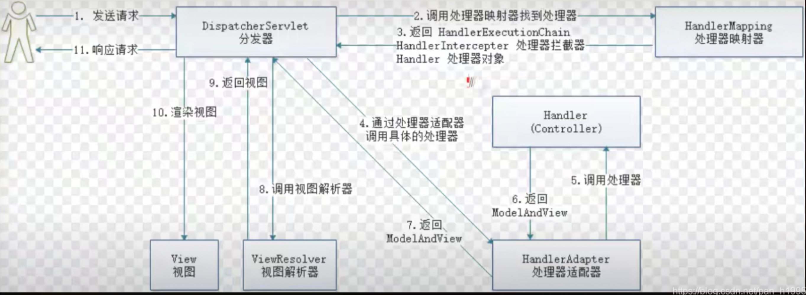
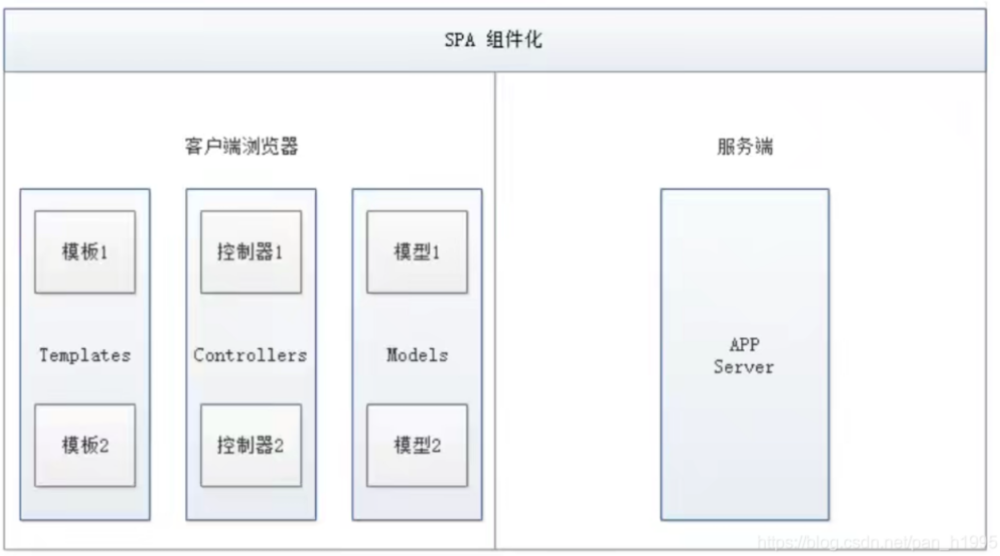
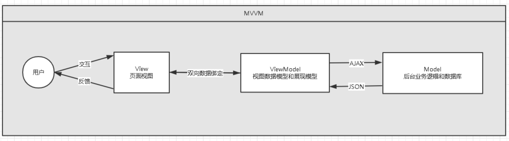
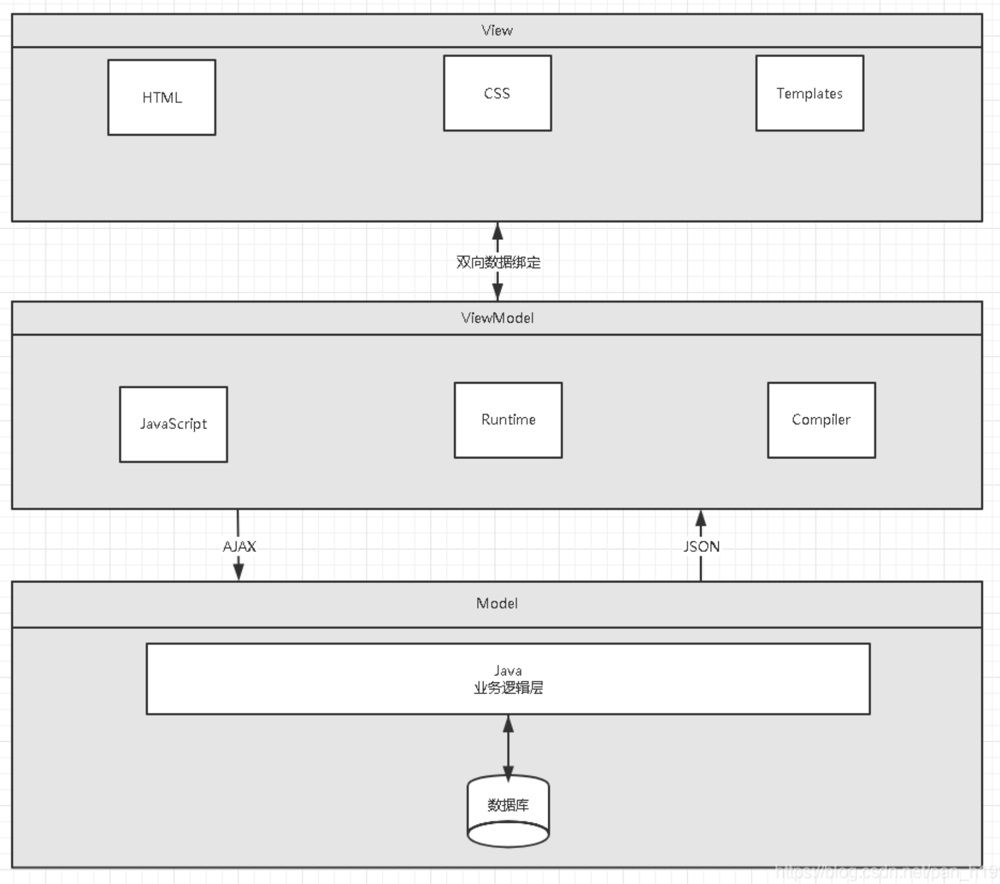
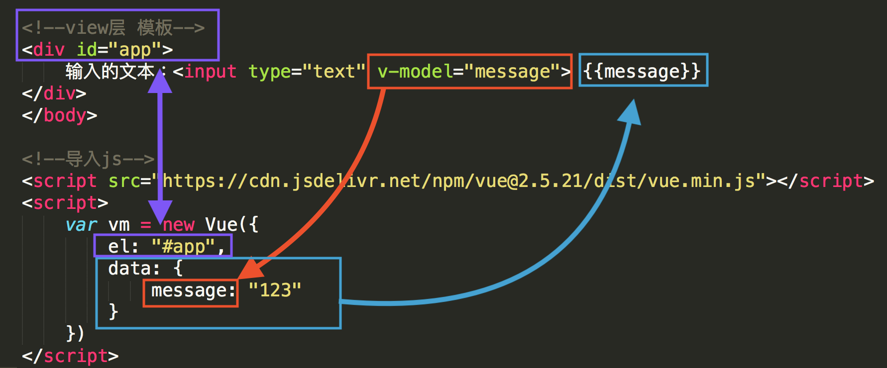
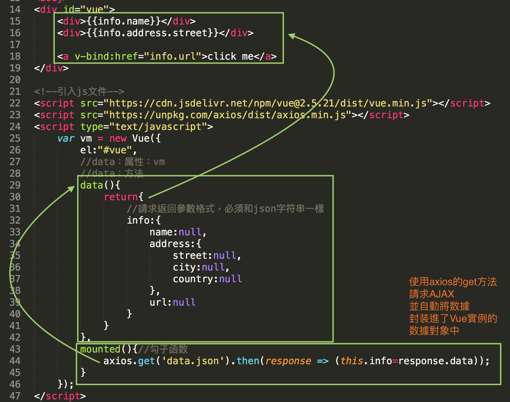
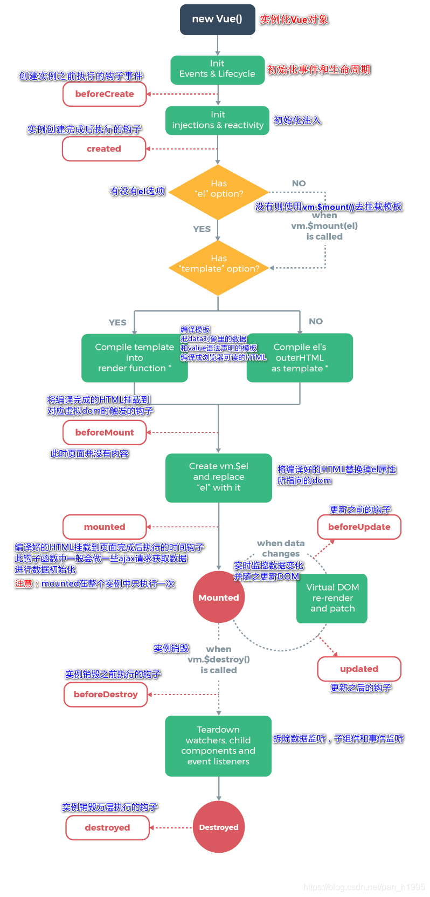
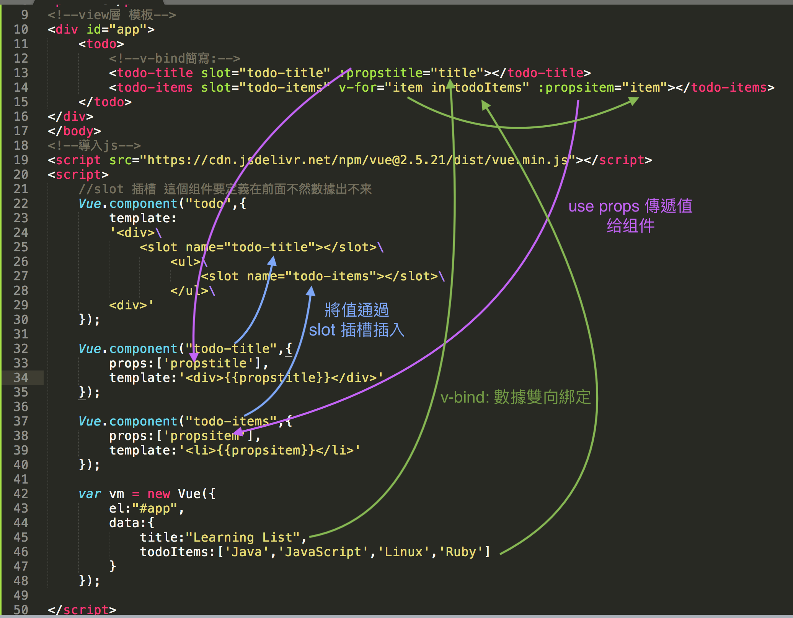

# Vue 筆記

Vue 的核心庫只關注視圖層，方便與第三方庫或既有項目整合。

HTML + CSS + JS : 視圖 ： `給用戶看，刷新後台給的數據`

網絡通信 ： axios

頁面跳轉 ： vue-router

狀態管理：vuex

Vue-UI : ICE , Element UI

## 一、前端核心分析

### 1. VUE 概述

Vue (讀音/vju/, 類似於view)是一套用於構建用戶界面的漸進式框架，發佈於2014年2月。與其它大型框架不同的是，Vue被設計為可以自底向上逐層應用。 Vue的核心庫只關注視圖層，不僅易於上手，還便於與第三方庫(如: vue-router: 跳轉，vue-resource: 通信，vuex:管理)或既有項目整合

### 2. 前端三要素

- HTML (結構) :超文本標記語言(Hyper Text Markup Language) ，決定網頁的結構和內容
- CSS (表現) :層疊樣式表(Cascading Style sheets) ，設定網頁的表現樣式
- JavaScript (行為) :是一種弱類型腳本語言，其源代碼不需經過編譯，而是由瀏覽器解釋運行,用於控製網頁的行為

> 2.2、結構層（HTML）

太簡單，略

> 2.3、表現層（CSS）

<span style="color:orange">CSS層疊樣式表是一門標記語言，並不是編程語言，因此不可以自定義變量，不可以引用等</span>，換句話說就是不具備任何語法支持，它主要缺陷如下：

- 語法不夠強大，比如無法嵌套書寫，導致模塊化開發中需要書寫很多重複的選擇器；
- 沒有變量和合理的樣式複用機制，使得邏輯上相關的屬性值必須以字面量的形式重複輸出，導致難以維護；
  這就導致了我們在工作中無端增加了許多工作量。為了解決這個問題，前端開發人員會使用一種稱之為【CSS預處理器】的工具,提供CSS缺失的樣式層復用機制、減少冗餘代碼，提高樣式代碼的可維護性。大大的提高了前端在樣式上的開發效率。

> 什麼是CSS預處理器

CSS預處理器定義了一種新的語言，其基本思想是，用一種專門的編程語言，為CSS增加了一些編程的特性，將CSS作為目標生成文件，然後開發者就只需要使用這種語言進行CSS的編碼工作。轉化成通俗易懂的話來說就是<span style="color:orange">“**用一種專門的編程語言，進行Web頁面樣式設計，再通過編譯器轉化為正常的CSS文件，以供項目使用”**。 </span>

常用的CSS預處理器有哪些

- SASS：基於Ruby ，通過服務端處理，功能強大。解析效率高。需要學習Ruby語言，上手難度高於LESS。
- LESS：基於NodeJS，通過客戶端處理，使用簡單。功能比SASS簡單，解析效率也低於SASS，但在實際開發中足夠了，所以如果我們後台人員如果需要的話，建議使用LESS。

#### 2.4、行為層（JavaScript）

JavaScript一門弱類型腳本語言，其源代碼在發往客戶端運行之前不需要經過編譯，而是將文本格式的字符代碼發送給瀏覽器，由瀏覽器解釋運行。
 **Native 原生JS開發**
 原生JS開發，也就是讓我們按照【ECMAScript】標準的開發方式，簡稱ES，特點是所有瀏覽器都支持。截至到當前，ES標準以發佈如下版本：

- ES3
- ES4（內部，未正式發布）
- ES5（全瀏覽器支持）
- ES6（常用，當前主流版本：webpack打包成為ES5支持）
- ES7
- ES8
- ES9（草案階段）

區別就是逐步增加新特性。
 **TypeScript 微軟的標準**
  TypeScript是一種由微軟開發的自由和開源的編程語言。它是JavaScript的一個超集， 而且本質上向這個語言添加了可選的靜態類型和基於類的面向對象編程。由安德斯·海爾斯伯格(C#、Delphi、TypeScript之父； .NET創立者) 主導。該語言的特點就是除了具備ES的特性之外還納入了許多不在標準範圍內的新特性，所以會導致很多瀏覽器不能直接支持TypeScript語法， 需要編譯後(編譯成JS) 才能被瀏覽器正確執行。

##### JavaScript框架

- JQuery：大家熟知的JavaScript庫，優點就是簡化了DOM操作，缺點就是DOM操作太頻繁，影響前端性能；在前端眼裡使用它僅僅是為了兼容IE6，7，8；

- Angular：Google收購的前端框架，由一群Java程序員開發，<span style="color:orange">其特點是將後台的MVC模式搬到了前端並增加了**模塊化開發**的理念< /span>，與微軟合作，採用了TypeScript語法開發；對後台程序員友好，對前端程序員不太友好；最大的缺點是版本迭代不合理（如1代–>2 代，除了名字，基本就是兩個東西；截止發表博客時已推出了Angular6）( view mode l controller )

  View --> JSP {{}}

  DATA

  Vm ：數據雙向綁定

- React：Facebook 出品，一款高性能的JS前端框架；<span style="color:orange">特點是提出了新概念【虛擬DOM】用於減少真實DOM 操作，在內存中模擬DOM操作，有效的提升了前端渲染效率</span>；缺點是使用複雜，因為需要額外學習一門【JSX】語言；

- Vue：一款漸進式 JavaScript 框架，所謂漸進式就是逐步實現新特性的意思，如實現模塊化開發、路由、狀態管理等新特性。其特點是綜合了 Angular（模塊化）和React(虛擬 DOM) 的優點；

  <span style="color:orange">計算屬性 ---> Vue 特色 ==> MVVM +DOM</span>

- Axios：<span style="color:orange">前端通信框架；因為Vue 的邊界很明確，就是為了處理DOM，所以並不具備通信能力，此時就需要額外使用一個通信框架與服務器交互；當然也可以直接選擇使用jQuery 提供的AJAX 通信功能；</span>

##### UI框架

- Ant-Design：阿里巴巴出品，基於React的UI框架
- ElementUI、iview、ice：餓了麼出品，基於Vue的UI框架
- BootStrap：Teitter推出的一個用於前端開發的開源工具包
- AmazeUI：又叫“妹子UI”，一款HTML5跨屏前端框架

##### JavaScript構建工具

- Babel：JS編譯工具，主要用於瀏覽器不支持的ES新特性，比如用於編譯TypeScript
- WebPack：模塊打包器，主要作用就是打包、壓縮、合併及按序加載

#### 2.6、後端技術

前端人員為了方便開發也需要掌握一定的後端技術但我們Java後台人員知道後台知識體系極其龐大復雜，所以為了方便前端人員開發後台應用，就出現了Node JS這樣的技術。 Node JS的作者已經聲稱放棄Node JS(說是架構做的不好再加上笨重的node modules，可能讓作者不爽了吧)開始開發全新架構的De no
 既然是後台技術，那肯定也需要框架和項目管理工具， Node JS框架及項目管理工具如下：

- Express：Node JS框架
- Koa：Express簡化版
- NPM：項目綜合管理工具，類似於Maven
- YARN：NPM的替代方案，類似於Maven和Gradle的關係

#### 主流前端框架

Vue.js

> **iView**

iview是一個強大的基於Vue的UI庫， 有很多實用的基礎組件比element ui的組件更豐富， 主要服務於PC界面的中後台產品。使用單文件的Vue組件化開發模式基於npm+webpack+babel開發， 支持ES 2015高質量、功能豐富友好的API， 自由靈活地使用空間。

- 官網地址
- Github
- iview-admin

**備註：屬於前端主流框架，選型時可考慮使用，主要特點是移動端支持較多**

> Element UI

Element是餓了麼前端開源維護的Vue UI組件庫， 組件齊全， 基本涵蓋後台所需的所有組件，文檔講解詳細， 例子也很豐富。主要用於開發PC端的頁面， 是一個質量比較高的Vue UI組件庫。
 ·官網地址
 ·Git hub
 ·vue-element-admin
 **備註：屬於前端主流框架，選型時可考慮使用，主要特點是桌面端支持較多**

> ICE

飛冰是阿里巴巴團隊基於React/Angular/Vue的中後台應用解決方案， 在阿里巴巴內部， 已經有270多個來自幾乎所有BU的項目在使用。飛冰包含了一條從設計端到開發端的完整鏈路，幫助用戶快速搭建屬於自己的中後台應用。
 ·官網地址。

<mark>**備註：主要組件還是以React為主， 截止2019年02月17日更新博客前對Vue的支持還不太完善，目前尚處於觀望階段**</mark>

> VantUI

Vant UI是有贊前端團隊基於有贊統一的規範實現的Vue組件庫， 提供了-整套UI基礎組件和業務組件。通過Vant， 可以快速搭建出風格統一的頁面，提升開發效率。

> AtUI

at-ui是一款基於Vue 2.x的前端UI組件庫， 主要用於快速開發PC網站產品。它提供了一套n pm+web pack+babel前端開發工作流程， CSS樣式獨立， 即使採用不同的框架實現都能保持統一的UI風格。

> Cube Ul

cube-ui是滴滴團隊開發的基於Vue js實現的精緻移動端組件庫。支持按需引入和後編譯， 輕量靈活；擴展性強，可以方便地基於現有組件實現二次開發。

#### 混合開發

> Flutter

Flutter是谷歌的移動端UI框架， 可在極短的時間內構建Android和iOS上高質量的原生級應用。 Flutter可與現有代碼一起工作， 它被世界各地的開發者和組織使用， 並且Flutter是免費和開源的。

- 官網地址
- Github
  **備註：Google出品， 主要特點是快速構建原生APP應用程序， 如做混合應用該框架為必選框架**

> lonic

lonic既是一個CSS框架也是一個Javascript UI庫， lonic是目前最有潛力的一款HTML 5手機應用開發框架。通過SASS構建應用程序， 它提供了很多UI組件來幫助開發者開發強大的應用。它使用JavaScript MV VM框架和Angular JS/Vue來增強應用。提供數據的雙向綁定， 使用它成為Web和移動開發者的共同選擇。

> mpvue

mpvue是美團開發的一個使用`Vue.js`開發小程序的前端框架， 目前支持微信小程序、百度智能小程序，頭條小程序和支付寶小程序。框架基於`Vue.js`， 修改了的運行時框架`runtime`和代碼編譯器`compiler`實現， 使其可運行在小程序環境中， 從而為小程序開發引入了`Vue.js`開發體驗。

 **備註：完備的Vue開發體驗， 井且支持多平台的小程序開發， 推薦使用**

> WeUI

WeUI是一套同微信原生視覺體驗一致的基礎樣式庫， 由微信官方設計團隊為微信內網頁和微信小程序量身設計， 令用戶的使用感知更加統一。包含button、cell、dialog、toast、article、icon等各式元素。

#### 3、了解前後分離的演變史

為什麼需要前後分離

##### 3.1、後端為主的MVC時代

為了降低開發的複雜度， 以後端為出發點， 比如：Struts、Spring MVC等框架的使用， 就是後端的MVC時代；
 以`SpringMVC`流程為例：



- 發起請求到前端控制器(`Dispatcher Servlet`)
- 前端控制器請求`HandlerMapping`查找`Handler`，可以根據`xml`配置、註解進行查找
- 處理器映射器`HandlerMapping`向前端控制器返回`Handler`
- 前端控制器調用處理器適配器去執行`Handler`
- 處理器適配器去執行`Handler`
- `Handler`執行完成給適配器返回`ModelAndView`
- 處理器適配器向前端控制器返回`ModelAndView`，`ModelAndView`是`SpringMvc`框架的一個底層對象，包括`Model`和`View`
- 前端控制器請求視圖解析器去進行視圖解析，根據邏輯視圖名解析成真正的視圖(`JSP`)
- 視圖解析器向前端控制器返回`View`
- 前端控制器進行視圖渲染，視圖渲染將模型數據(在`ModelAndView`對像中)填充到`request`域
- 前端控制器向用戶響應結果
  **優點**
  MVC是一個非常好的協作模式， 能夠有效降低代碼的耦合度從架構上能夠讓開發者明白代碼應該寫在哪裡。為了讓View更純粹， 還可以使用Thyme leaf、Frree marker等模板引擎， 使模板裡無法寫入Java代碼， 讓前後端分工更加清晰。
  **缺點**
- 前端開發重度依賴開發環境，開發效率低，這種架構下，前後端協作有兩種模式：
  - 第一種是前端寫DEMO， 寫好後， 讓後端去套模板。好處是DEMO可以本地開發， 很高效。不足是還需要後端套模板，有可能套錯，套完後還需要前端確定，來回溝通調整的成本比較大；
  - 另一種協作模式是前端負責瀏覽器端的所有開發和服務器端的View層模板開發。好處是UI相關的代碼都是前端去寫就好，後端不用太關注，不足就是前端開發重度綁定後端環境，環境成為影響前端開發效率的重要因素。
- 前後端職責糾纏不清：模板引擎功能強大，依舊可以通過拿到的上下文變量來實現各種業務邏輯。這樣，只要前端弱勢一點，往往就會被後端要求在模板層寫出不少業務代碼，還有一個很大的灰色地帶是Controller， 頁面路由等功能本應該是前端最關注的， 但卻是由後端來實現。 Controller本身與Model往往也會糾纏不清，看了讓人咬牙的業務代碼經常會出現在Controller層。這些問題不能全歸結於程序員的素養， 否則JSP就夠了。
- 對前端發揮的局限性：性能優化如果只在前端做空間非常有限，於是我們經常需要後端合作，但由於後端框架限制，我們很難使用[Comet】、【Big Pipe】等技術方案來優化性能。
  **注：在這期間(2005年以前) ， 包括早期的JSP、PHP可以稱之為Web 1.0時代。在這裡想說一句， 如果你是一名Java初學者， 請你不要再把一些陳舊的技術當回事了， 比如JSP， 因為時代在變、技術在變、什麼都在變(引用扎克伯格的一句話：唯一不變的是變化本身)；當我們去給大學做實訓時，有些同學會認為我們沒有講什麼乾貨，其實不然，只能說是你認知裡的干貨對於市場來說早就過時了而已**

##### 3.2、基于AJAX带来的SPA时代

时间回到2005年A OAX(Asynchronous JavaScript And XML，  异步JavaScript和XML，老技术新用法)被正式提出并开始使用CDN作为静态资源存储，  于是出现了JavaScript王者归来(在这之前JS都是用来在网页上贴狗皮膏药广告的) 的SPA(Single Page  Application) 单页面应用时代。


 **优点**
 这种模式下， **前后端的分工非常清晰， 前后端的关键协作点是AJAX接口。**看起来是如此美妙， 但回过头来看看的话， 这与JSP时代区别不大。复杂度从服务端的JSP里移到了浏览器的JavaScript，浏览器端变得很复杂。类似Spring MVC， **这个时代开始出现浏览器端的分层架构**：



缺点

- **前后端接口的约定**：如果后端的接口一塌糊涂，如果后端的业务模型不够稳定，那么前端开发会很痛苦；不少团队也有类似尝试，通过接口规则、接口平台等方式来做。**有了和后端一起沉淀的接口规则，还可以用来模拟数据，使得前后端可以在约定接口后实现高效并行开发。**
- 前端开发的复杂度控制：SPA应用大多以功能交互型为主，JavaScript代码过十万行很正常。大量JS代码的组织，与View层的绑定等，都不是容易的事情。

##### 3.3、前端为主的MV*时代

此处的MV*模式如下：

- MVC(同步通信为主) ：Model、View、Controller

- MVP(异步通信为主) ：Model、View、Presenter

- MVVM(异步通信为主)：Model、View、View Model为了降低前端开发复杂度，涌现了大量的前端框架，比如：`Angular JS`、`React`、`Vue.js`、`Ember JS`等， 这些框架总的原则是先按类型分层， 比如Templates、Controllers、Models， 然后再在层内做切分，如下图：

  

**优点**

- **前后端职责很清晰**：前端工作在浏览器端，后端工作在服务端。清晰的分工，可以让开发并行，测试数据的模拟不难， 前端可以本地开发。后端则可以专注于业务逻辑的处理， 输出RESTful等接口。
- **前端开发的复杂度可控**：前端代码很重，但合理的分层，让前端代码能各司其职。这一块蛮有意思的，简单如模板特性的选择，就有很多很多讲究。并非越强大越好，限制什么，留下哪些自由，代码应该如何组织，所有这一切设计，得花一本书的厚度去说明。
- **部署相对独立**：可以快速改进产品体验缺点
- 代码不能复用。比如后端依旧需要对数据做各种校验，校验逻辑无法复用浏览器端的代码。如果可以复用，那么后端的数据校验可以相对简单化。
- 全异步， 对SEO不利。往往还需要服务端做同步渲染的降级方案。
- 性能并非最佳，特别是移动互联网环境下。
- SPA不能满足所有需求， 依旧存在大量多页面应用。URL Design需要后端配合， 前端无法完全掌控。

##### 3.4、Node JS带来的全栈时代

前端为主的MV*模式解决了很多很多问题， 但如上所述， 依旧存在不少不足之处。随着Node JS的兴起， JavaScript开始有能力运行在服务端。这意味着可以有一种新的研发模式：



在这种研发模式下，前后端的职责很清晰。对前端来说，两个UI层各司其职：

- Front-end Ul layer处理浏览器层的展现逻辑。通过CSS渲染样式， 通过JavaScript添加交互功能， HTML的生成也可以放在这层， 具体看应用场景。

- Back-end Ul layer处理路由、模板、数据获取、Cookie等。通过路由， 前端终于可以自主把控URL Design， 这样无论是单页面应用还是多页面应用， 前端都可以自由调控。后端也终于可以摆脱对展现的强关注，转而可以专心于业务逻辑层的开发。
   通过Node， WebServer层也是JavaScript代码， 这意味着部分代码可前后复用， 需要SEO的场景可以在服务端同步渲染，由于异步请求太多导致的性能问题也可以通过服务端来缓解。前一种模式的不足，通过这种模式几乎都能完美解决掉。
   与JSP模式相比， 全栈模式看起来是一种回归， 也的确是一种向原始开发模式的回归， 不过是一种螺旋上升式的回归。
   基于Node JS的全栈模式， 依旧面临很多挑战：

- 需要前端对服务端编程有更进一步的认识。比如TCP/IP等网络知识的掌握。

- Node JS层与Java层的高效通信。Node JS模式下， 都在服务器端， RESTful HTTP通信未必高效， 通过SOAP等方式通信更高效。一切需要在验证中前行。

- 对部著、运维层面的熟练了解，需要更多知识点和实操经验。

- 大量历史遗留问题如何过渡。这可能是最大最大的阻力。
   **注：看到这里，相信很多同学就可以理解，为什么我总在课堂上说：“前端想学后台很难，而我们后端程序员学任何东西都很简单”；就是因为我们后端程序员具备相对完善的知识体系。**
   全栈!So Easy!

  ##### 3.5、总结

  综上所述，模式也好，技术也罢，没有好坏优劣之分，只有适合不适合；前后分离的开发思想主要是基于`Soc`(关注度分离原则)，上面种种模式，都是让前后端的职责更清晰，分工更合理高效。

## 二、第一个Vue程序

### 1. 什么是MVVM

​	MVVM (Model-View-ViewModel) 是一种软件架构设计模式，由微软WPF  (用于替代WinForm，以前就是用这个技术开发桌面应用程序的)和Silverlight (类似于Java  Applet,简单点说就是在浏览器上运行的WPF)的架构师Ken Cooper和Ted Peters  开发，是一种简化用户界面的事件驱动编程方式。由John Gossman  (同样也是WPF和Silverlight的架构师)于2005年在他的博客上发表。

​	MVVM 源自于经典的MVC (ModI-View-Controller) 模式。MVVM的核心是ViewModel层，负责转换Model中的数据对象来让数据变得更容易管理和使用，其作用如下:



- 该层向上与视图层进行双向数据绑定
- 向下与Model层通过接口请求进行数据交互

MVVM已经相当成熟了，主要运用但不仅仅在网络应用程序开发中。当下流行的MVVM框架有`Vue.js`，`Anfular JS`

### 2. 为什么要使用MVVM

-  MVVM模式和MVC模式一样，主要目的是分离视图（View）和模型（Model），有几大好处
  - **低耦合**：视图（View）可以独立于Model变化和修改，一个ViewModel可以绑定到不同的View上，当View变化的时候Model可以不变，当Model变化的时候View也可以不变。
  - **可复用**：你可以把一些视图逻辑放在一个ViewModel里面，让很多View重用这段视图逻辑。
  - **独立开发**：开发人员可以专注于业务逻辑和数据的开发（ViewMode），设计人员可以专注于页面设计。
  - **可测试**：界面素来是比较难以测试的，而现在测试可以针对ViewModel来写。

### 3. Vue 是 MVVM 模式的实现者



（1）View

  View是视图层， 也就是用户界面。前端主要由HTH L和csS来构建， 为了更方便地展现vi eu to  del或者Hodel层的数据， 已经产生了各种各样的前后端模板语言， 比如FreeMarker，Thyme leaf等等， 各大MV  VM框架如Vue.js.Angular JS， EJS等也都有自己用来构建用户界面的内置模板语言。

（2）Model

  Model是指数据模型， 泛指后端进行的各种业务逻辑处理和数据操控， 主要围绕数据库系统展开。这里的难点主要在于需要和前端约定统一的接口规则

（3）ViewModel

  ViewModel是由前端开发人员组织生成和维护的视图数据层。在这一层， 前端开发者对从后端获取的Model数据进行转换处理， 做二次封装， 以生成符合View层使用预期的视图数据模型。
   需要注意的是View Model所封装出来的数据模型包括视图的状态和行为两部分， 而Model层的数据模型是只包含状态的

- 比如页面的这一块展示什么，那一块展示什么这些都属于视图状态(展示)
- 页面加载进来时发生什么，点击这一块发生什么，这一块滚动时发生什么这些都属于视图行为(交互)

  视图状态和行为都封装在了View Model里。这样的封装使得View Model可以完整地去描述View层。由于实现了双向绑定，  View Model的内容会实时展现在View层， 这是激动人心的， 因为前端开发者再也不必低效又麻烦地通过操纵DOM去更新视图。
   MVVM框架已经把最脏最累的一块做好了， 我们开发者只需要处理和维护View Model， 更新数据视图就会自动得到相应更新，真正实现`事件驱动编程`。
   View层展现的不是`Model`层的数据， 而是`ViewModel`的数据， 由`ViewModel`负责与`Model`层交互， 这就**完全解耦了View层和Model层， 这个解耦是至关重要的， 它是前后端分离方案实施的重要一环。**

<mark>至此，我们就明白了，Vue.js 就是一个MVVM的实现者，他的核心就是实现了**DOM监听**与**数据绑定**</mark>

[学 Vue 看这个就够了 - 什么是 Vue.js](https://zhuanlan.zhihu.com/p/58307272)

# "漸進式框架" & "自底向上逐層應用"
Vue 是一套用於構建用戶界面的漸進式框架。 Vue 被設計為可以自底向上逐層應用。

"漸進式" 的意思就是從少到多, 從弱到強, Vue 框架並不強制開發者一下子就使用它的全部.


Vue 從設計角度來講，可以分成上圖的這幾大部分，但是開發者並不需要把所有的東西都學會, 或者都用上. "聲明式渲染" 和"組件系統" 是Vue 核心庫所包含內容，而"客戶端路由"、"狀態管理"、"構建工具" 都有其他各自專門的解決方案。這些解決方案相互獨立，Vue 將框架做了分層設計, 你可以在 Vue 核心庫的基礎上靈活地在不同層上使用其他方案, 而不是說一定要用 Vue 提供的.

# 數據驅動視圖
Vue 是數據驅動視圖的框架, 採用了 MVVM 架構. 其核心庫只關注視圖層, 視圖與數據狀態保持同步.

## 什麼是 MVC 架構?
一個清晰合理的架構是一個複雜程序所必備的. MVVM 是一種軟件的架構模式. 但在講它之前, 要先了解一下 MVC 架構.

在 MVC 架構下, 軟件可以分成三個部分:

視圖 (View): 用戶界面
控制器 (Controller): 業務邏輯
模型 (Model): 數據保存


它們各個部分之間的通信方式如上圖:

用戶在 View 上進行操作, 觸發相應事件;
Controller 接到事件, 執行相應業務邏輯, 調用 Model 的接口修改數據狀態;
Model 中新的數據發送到 View, 視圖更新, 用戶得到反饋;
當然上述所講為一般而言的MVC 模式. 在不同的項目中, MVC 的實現方法可能都不盡相同. 比如, 網頁開發中, 某些項目除了允許用戶在頁面上觸發DOM 事件, 從而讓相關事件處理函數得到執行外. 用戶還可以通過在URL 後加上不同的# 錨點來觸發hashChange 事件, 從而讓相關業務邏輯得到執行.

## 什麼是 MVVM 架構?
在MVVM 架構中, Controller 被替換成了ViewModel. 它作為View 與Model 溝通的橋樑, 負責監聽Model 或View 的修改. 由此實現了View 和Model 的"雙向綁定". 意思就是說, 當Model 層數據進行修改時, ViewModel 層檢測到了變化, 然後通知View 層進行相應的視圖修改. 反之, 當View 層做了修改時, Model 層的數據也會得到相應的修改.


## 響應式的雙向數據綁定
在頁面中, DOM 狀態其實就是數據狀態的一種映射. 我們的業務邏輯應該關注於對於數據狀態的操作. 當數據發生改變的時候, 框架應當幫助我們自動更新視圖, 而不需要我們再手動獲取DOM 元素, 然後再對它進行修改了.

Vue 的核心是一個"響應式的數據綁定係統". 數據和視圖建立綁定之後, DOM 將與數據保持同步. 當數據被修改了, DOM 便相應的更新; 同樣, 用戶在視圖上的操作也會自動更新相關的數據. 所有關於DOM 的操作都被Vue 在背後幫我們執行了, 我們只需關注於數據就好了. 這種思想也被稱為"數據驅動"

簡化地表示 "數據" 與 "視圖" 的關係就如下圖:


## 聲明式渲染 && 虛擬 DOM
Vue 提供一套基於 HTML 的模板語法, 允許開發者聲明式地將真實 DOM 與 Vue 實例的數據綁定在一起。

首先, "聲明式" 的意思就是: 開發者告訴Vue 框架想要什麼結果, 而如何達成由Vue 自己去做, 開發者不用管. 例如下面這段模板代碼聲明式地讓Vue 將name 的數據和<p> 標籤綁定在一起:

<p>Hello {{ name }}</p>
Vue 會把這些模板編譯成一個渲染函數。該函數被調用後會渲染並且返回一個虛擬的 DOM 樹. 這個 "樹" 的職責就是描述當前視圖應處的狀態。之後再通過一個 Patch 函數，將這些虛擬 DOM 創建成真實的 DOM 元素。在這個過程中, Vue 有一個 "依賴追踪系統" 會偵測在渲染過程中所依賴到的數據來源. 當數據源發生變動時, 就可以根據需要重新渲染虛擬 DOM 樹。當一個新的虛擬樹被渲染出來之後, Vue 會將其與老樹進行對比，並最終得出應施加到真實 DOM 上的改動, 然後通過 Patch 函數施加改動。


同時, Vue 也允許用戶直接跳過寫模板這一層去手寫渲染函數. 模板和渲染函數都各有利弊, 首先模板更貼近HTML，有著良好的可讀性的同時, 可以讓我們更直觀地思考語義結構，更好地結合CSS 的書寫。而直接寫渲染函數，因為寫的是真正的JavaScript 代碼，函數內可以進行更複雜的邏輯判斷，可以選擇性地返回最終要返回的DOM 結構，從而實現一些在模板的語法限制下，很難做到的一些事情。但雖然兩個都是可以選擇的。在絕大部分情況下還是推薦使用模板，只有在需要復雜邏輯的情況下，才使用渲染函數。

### 4 Vue

Vue(读音/vju/， 类似于view) 是一套用于构建用户界面的渐进式框架， 发布于2014年2月。与其它大型框架不同的是，  Vue被设计为可以自底向上逐层应用。Vue的核心库只关注视图层， 不仅易于上手，  还便于与第三方库(如：vue-router，vue-resource，vue x) 或既有项目整合。

（1）MVVM模式的实现者

- Model：模型层， 在这里表示JavaScript对象
- View：视图层， 在这里表示DOM(HTML操作的元素)
- ViewModel：连接视图和数据的中间件， Vue.js就是MVVM中的View Model层的实现者

  在MVVM架构中， 是不允许数据和视图直接通信的， 只能通过ViewModel来通信， 而View Model就是定义了一个Observer观察者

- ViewModel能够观察到数据的变化， 并对视图对应的内容进行更新
- ViewModel能够监听到视图的变化， 并能够通知数据发生改变

  至此， 我们就明白了， Vue.js就是一个MV VM的实现者， 他的核心就是实现了DOM监听与数据绑定

（2）为什么要使用Vue.js

- 轻量级， 体积小是一个重要指标。Vue.js压缩后有只有20多kb(Angular压缩后56kb+，React压缩后44kb+)
- 移动优先。更适合移动端， 比如移动端的Touch事件
- 易上手，学习曲线平稳，文档齐全
- 吸取了Angular(模块化) 和React(虚拟DOＭ) 的长处， 并拥有自己独特的功能，如：计算属性
- 开源，社区活跃度高
- ……

**Vue在线cdn:**

```javascript
<script src="https://cdn.jsdelivr.net/npm/vue@2.5.21/dist/vue.min.js"></script>
```

## 三、Vue基本语法

### 1. `v-bind`

<span style="color:orange">现在数据和DOM已经被建立了关联，所有的东西都是响应式的。我们在控制台操作对象的属性，界面可以实时更新。</span>

 我们可以使用`v-bind`来绑定元素属性！----->  v-bind=" "   <==>  {{}}

```html
<!DOCTYPE html>
<html lang="en">
<head>
    <meta charset="UTF-8">
    <title>Title</title>
</head>
<body>
  
<!--view层 模板-->
<div id="app">
    <span v-bind:title="message">鼠标悬停几秒钟查看此处动态绑定的提示信息！</span>
  {{message}}
</div>
</body>

<!--导入js-->
<script src="https://cdn.jsdelivr.net/npm/vue@2.5.21/dist/vue.min.js"></script>
<script>
    var vm = new Vue({
        el: "#app",
      //Model层：數據  ---> view层 模板 ===mv
        data: {
            message: "hello,vue"
        }
    })
</script>
</html>
```

- `el: '#vue'`：绑定元素的ID
- `data:{message:'Hello Vue!'}`：数据对象中有一个名为message的属性，并设置了初始值 Hello Vue！

<mark>雙向綁定：</mark>

mv ==>  html file ==>  Model层：數據  --->  view层 模板

vm ==>    console 主控台輸入 vm.message="I was changed to  vm.message "，頁面訊息隨之改變‘。

你看到的v-bind等被称为指令。指令带有前缀v以表示它们是Vue提供的特殊特性。可能你已经猜到了， 它们会在渲染的DOM上应用特殊的响应式行为在这里，该指令的意思是：“将这个元素节点的title特性和Vue实例的message属性保持一致”。
   如果你再次打开浏览器的JavaScript控制台， 输入app， message=‘新消息’，就会再一次看到这个绑定了title特性的HTML已经进行了更新。

### 2. `v-if` `v-else`

```html
<!DOCTYPE html>
<html lang="en">
<head>
   <meta charset="UTF-8">
   <title>Title</title>
</head>
<body>
<p>狂神说Java</p>

<!--view层 模板-->
<div id="app">
   <h1 v-if="type==='A'">A</h1>
   <h1 v-else-if="type==='B'">B</h1>
   <h1 v-else>C</h1>
</div>
</body>

<!--导入js-->
<script src="https://cdn.jsdelivr.net/npm/vue@2.5.21/dist/vue.min.js"></script>
<script>
   var vm = new Vue({
       el: "#app",
       data: {
           type: "A"
       }
   })
</script>
</html>

```

### 3. `v-for`

```html
<!DOCTYPE html>
<html lang="en">
<head>
    <meta charset="UTF-8">
    <title>Title</title>
</head>
<body>

<!--view层 模板-->
<div id="app">
  <li v-for="(item,index) in items">
        {{item.message}}---{{index}}
    </li>
</body>

<!--导入js-->
<script src="https://cdn.jsdelivr.net/npm/vue@2.5.21/dist/vue.min.js"></script>
<script>
  var vm = new Vue({
    el:"#app",
    data:{
      items:[
        {message: 'oneone'},
        {message: 'twotwo'},
        {message: 'three'}
      ]
    }
  })
</script>
</html>
```

注：`items`是数组，`item`是数组元素迭代的别名。我们之后学习的Thymeleaf模板引擎的语法和这个十分的相似

测试：在控制台输入`vm.items.push({message：'狂神说运维'})`，尝试追加一条数据，你会发现浏览器中显示的内容会增加一条`狂神说运维`.

### 4. `v-on` 事件绑定

`v-on`监听事件

emsp;事件有Vue的事件、和前端页面本身的一些事件!我们这里的`click`是vue的事件， 可以绑定到Vue中的`methods`中的方法事件!

```html
<!DOCTYPE html>
<html lang="en">
<head>
    <meta charset="UTF-8">
    <title>Title</title>
</head>
<body>
<p>狂神说Java</p>

<!--view层 模板-->
<div id="app">
    <button v-on:click="sayHi">Click Me</button>
</div>
</body>

<!--导入js-->
<script src="https://cdn.jsdelivr.net/npm/vue@2.5.21/dist/vue.min.js"></script>
<script>
    var vm = new Vue({
        el: "#app",
        data: {
            message: "你点我干嘛？"
        },
        methods: {
            //方法必须绑定在 Vue 的 Methods 对象中，v-on:事件(記得傳遞event)
            sayHi: (function (event) {
              //'this'在方法里面指向当前Vue实例
                alert(this.message)
            })
        }
    })
</script>
</html>
```

`script` 傳入數據放    ` data: {}`    ----->     `html` 綁定數據 ` {{}}`

`script` 傳入方法放	`methods: {}`	------>   `html`  綁定方法 ` v-on`

## 四、什么是双向数据绑定

 <span style="color:coral"> Vue.js是一个MV VM框架， 即数据双向绑定， 即当数据发生变化的时候， 视图也就发生变化， 当视图发生变化的时候，数据也会跟着同步变化</span>。这也算是Vue.js的精髓之处了。
   值得注意的是，我们所说的数据双向绑定，一定是对于UI控件来说的非UI控件不会涉及到数据双向绑定。单向数据绑定是使用状态管理工具的前提。如果我们使用vue x那么数据流也是单项的，这时就会和双向数据绑定有冲突。

> 为什么要实现数据的双向绑定

  在`Vue.js`中，如果使用`vuex`， 实际上数据还是单向的， 之所以说是数据双向绑定，这是用的UI控件来说， 对于我们处理表单， `Vue.js`的双向数据绑定用起来就特别舒服了。即两者并不互斥，在全局性数据流使用单项，方便跟踪；局部性数据流使用双向，简单易操作。

> 在表单中使用双向数据绑定

<span style="color:orange"> 你可以用`v-model`指令在表单、及元素上创建双向数据绑定</span>。它会根据控件类型自动选取正确的方法来更新元素。尽管有些神奇， 但`v-model`本质上不过是语法糖。它负责监听用户的输入事件以更新数据，并对一些极端场景进行一些特殊处理。
   注意：`v-model`会忽略所有表单元素的`value`、`checked`、`selected`特性的初始值而总是将`Vue`实例的数据作为数据来源。你应该通过`JavaScript`在组件的`data`选项中声明初始值!


## （1）单行文本

```html
<!DOCTYPE html>
<html lang="en">
<head>
    <meta charset="UTF-8">
    <title>Title</title>
</head>
<body>
<div id="app">
    输入的文本：<input type="text" v-model="message" value="hello">{{message}}
</div>

<script src="../js/vue.js"></script>
<script type="text/javascript">
    var vm = new Vue({
        el:"#app",
        data:{
            message:""
        }
    });
</script>
</body>
</html>
```

## （2）多行文本

```html
<!DOCTYPE html>
<html lang="en">
<head>
    <meta charset="UTF-8">
    <title>Title</title>
</head>
<body>
<div id="app">
   多行文本：<textarea v-model="pan"></textarea>&nbsp;&nbsp;多行文本是：{{pan}}
</div>

<script src="../js/vue.js"></script>
<script type="text/javascript">
    var vm = new Vue({
        el:"#app",
        data:{
            message:"Hello hello!"
        }
    });
</script>
</body>
</html>
```

## （3）单复选框

```html
<!DOCTYPE html>
<html lang="en">
<head>
    <meta charset="UTF-8">
    <title>Title</title>
</head>
<body>

<div id="app">
    单复选框：
    <input type="checkbox" id="checkbox" v-model="checked">
    &nbsp;&nbsp;
    <label for="checkbox">{{checked}}</label>
</div>

<script src="../js/vue.js"></script>
<script type="text/javascript">
    var vm = new Vue({
        el:"#app",
        data:{
            checked:false
        }
    });
</script>
</body>
</html>
```

## （4）多复选框

```html
<!DOCTYPE html>
<html lang="en">
<head>
    <meta charset="UTF-8">
    <title>Title</title>
</head>
<body>

<div id="app">
    多复选框：
    <input type="checkbox" id="jack" value="Jack" v-model="checkedNames">
    &nbsp;&nbsp;
    <label for="jack">Jack</label>
    <input type="checkbox" id="join" value="Join" v-model="checkedNames">
    &nbsp;&nbsp;
    <label for="join">Jack</label>
    <input type="checkbox" id="mike" value="Mike" v-model="checkedNames">
    &nbsp;&nbsp;
    <label for="mike">Mike</label>
    <span>选中的值：{{checkedNames}}</span>
</div>

<script src="../js/vue.js"></script>
<script type="text/javascript">
    var vm = new Vue({
        el:"#app",
        data:{
            checkedNames:[]
        }
    });
</script>
</body>
</html>
```

## （6）单选按钮

```html
<!DOCTYPE html>
<html lang="en">
<head>
    <meta charset="UTF-8">
    <title>Title</title>
</head>
<body>

<div id="app">
    单选框按钮
    <input type="radio" id="one" value="One" v-model="picked">
    <label for="one">One</label>
    <input type="radio" id="two" value="Two" v-model="picked">
    <label for="two">Two</label>
    <span>选中的值：{{picked}}</span>
</div>

<script src="../js/vue.js"></script>
<script type="text/javascript">
    var vm = new Vue({
        el:"#app",
        data:{
            picked:'Two'
        }
    });
</script>
</body>
</html>
```

## （7）下拉框

```html
<!DOCTYPE html>
<html lang="en">
<head>
    <meta charset="UTF-8">
    <title>Title</title>
</head>
<body>
<div id="app">
<!--    性别：
    <input type="radio" name="sex" value="男" v-model="pan">男
    <input type="radio" name="sex" value="女" v-model="pan">女
    <p>选中了：{{pan}}</p>-->

    下拉框:
    <select v-model="pan">
        <option value="" disabled>---请选择---</option>
        <option>A</option>
        <option>B</option>
        <option>C</option>
        <option>D</option>
    </select>
    <span>value:{{pan}}</span>

</div>

<script src="../js/vue.js"></script>
<script type="text/javascript">
    var vm = new Vue({
        el:"#app",
        data:{
            pan:"A"
        }
    });
</script>
</body>
</html>
```

 <span style="color:coral">注意：`v-model`表达式的初始值未能匹配任何选项，元系将被渲染为“未选中”状态。 在iOS中， 这会使用户无法选择第一个选项，因为这样的情况下，iOS不会触发`change`事件。因此，更推荐像上面这样提供一个值为空的禁用选项。</span>

## 五、什么是组件

  组件是可复用的`Vue`实例， 说白了就是一组可以重复使用的模板， 跟`JSTL`的自定义标签、`Thymeleal`的`th:fragment`等框架有着异曲同工之妙，通常一个应用会以一棵嵌套的组件树的形式来组织：
 


例如，你可能会有页头、侧边栏、内容区等组件，每个组件又包含了其它的像导航链接、博文之类的组件。

## （1）第一个Vue组件

  注意：在实际开发中，我们并不会用以下方式开发组件，而是采用`vue-cli`创建，`vue`模板文件的方式开发，以下方法只是为了让大家理解什么是组件。
   **使用`Vue.component()`方法注册组件，格式如下：**

```html
<div id="app">
  <compo></compo>
</div>

<script src="../js/vue.js"></script>
<script type="text/javascript">
    //先注冊组件
    Vue.component("compo",{
        template:'<li>Hello</li>'
    });
    //再實例化Vue
    var vm = new Vue({
        el:"#app",
    });
</script>
```

说明：

- `Vue.component()`：注冊组件
- `compo`：自定義组件的名字
- `template`：組件的模板

## （2）使用`props`属性传递参数

  像上面那样用组件没有任何意义，所以我们是需要传递参数到组件的，此时就需要使用`props`属性了！
   **注意：默认规则下props属性里的值不能为大写；**

```html
<!DOCTYPE html>
<html lang="en">
<head>
    <meta charset="UTF-8">
    <title>Title</title>
</head>
<body>
<p>Title</p>

<!--view層 模板-->
<div id="app">
    <!--组件：傳遞给组件中的值：props-->
	<compo v-for="item in items" v-bind:compopath="item"></compo>
</div>
</body>

<!--導入js-->
<script src="https://cdn.jsdelivr.net/npm/vue@2.5.21/dist/vue.min.js"></script>
<script>
    //先注冊组件
    Vue.component("compo",{
        props:['compopath'],
        template:'<li>{{compopath}}</li>'
    });
    //再實例化Vue
    var vm = new Vue({
        el:"#app",
        data:{
            items:["java", "javascript", "Linux"]
        }
    });
    
</script>
</html>
```

  **说明**：

- `v-for="item in items"`：遍历`Vue`实例中定义的名为`items`的数组，并创建同等数量的组件
- `v-bind:compopath="item""`：将遍历的`item`项绑定到组件中`props`定义名为`item`属性上；= 号左边的`panh`为`props`定义的属性名，右边的为`item in items` 中遍历的item项的值



## 六、什么是Axios

  Axios是一个开源的可以用在浏览器端和`Node JS`的异步通信框架， 她的主要作用就是实现AJAX异步通信，其功能特点如下：

- 从浏览器中创建`XMLHttpRequests`
- 从node.js创建http请求
- 支持Promise API[JS中链式编程]
- 拦截请求和响应
- 转换请求数据和响应数据
- 取消请求
- 自动转换JSON数据
- 客户端支持防御XSRF(跨站请求伪造)

  GitHub：https://github.com/axios/axios
   中文文档：http://www.axios-js.com/

### 为什么要使用Axios

由于`Vue.js`是一个视图层框架并且作者(尤雨溪) 严格准守SoC(关注度分离原则)所以`Vue.js`并不包含AJAX的通信功能， 为了解决通信问题， 作者单独开发了一个名为`vue-resource`的插件， 不过在进入2.0版本以后停止了对该插件的维护并推荐了`Axios`框架。少用jQuery， 因为它操作Dom太频繁!

### 第一个Axios应用程序

  咱们开发的接口大部分都是采用JSON格式， 可以先在项目里模拟一段JSON数据， 数据内容如下：创建一个名为data.json的文件并填入上面的内容， 放在项目的根目录下

```json
{
  "name": "狂神说Java",
  "url": "https://blog.kuangstudy.com",
  "page": 1,
  "isNonProfit": true,
  "address": {
    "street": "street",
    "city": "city",
    "country": "country"
  },
  "links": [
    {
      "name": "bilibili",
      "url": "https://space.bilibili.com/95256449"
    },
    {
      "name": "狂神说Java",
      "url": "https://blog.kuangstudy.com"
    },
    {
      "name": "google",
      "url": "https://www.google.com/"
    }
  ]
}
```

  **测试代码**

```html
<!DOCTYPE html>
<html lang="en" xmlns:v-binf="http://www.w3.org/1999/xhtml">
<head>
    <meta charset="UTF-8">
    <title>Title</title>
    <!--v-cloak 解决闪烁问题-->
    <style>
        [v-cloak]{
            display: none;
        }
    </style>
</head>
<body>
<div id="vue">
    <div>地名：{{info.name}}</div>
    <div>地址：{{info.address.country}}--{{info.address.city}}--{{info.address.street}}</div>
    <div>链接：<a v-binf:href="info.url" target="_blank">{{info.url}}</a> </div>
</div>

<!--引入js文件-->
<script src="../js/vue.js"></script>
<script src="https://unpkg.com/axios/dist/axios.min.js"></script>
<script type="text/javascript">
    var vm = new Vue({
        el:"#vue",
        //data：属性：vm
        data(){
            return{
                info:{
                    name:null,
                    address:{
                        country:null,
                        city:null,
                        street:null
                    },
                    url:null
                }
            }
        },
        mounted(){//钩子函数
            axios
                .get('data.json')
                .then(response=>(this.info=response.data));
        }
    });
</script>
</body>
</html>
```


  说明：

1. 在这里使用了v-bind将a:href的属性值与Vue实例中的数据进行绑定
2. 使用axios框架的get方法请求AJAX并自动将数据封装进了Vue实例的数据对象中
3. 我们在data中的数据结构必须和`Ajax`响应回来的数据格式匹配！




### ---Problem---

> [“Cross origin requests are only supported for HTTP.” error when loading a local file](https://stackoverflow.com/questions/10752055/cross-origin-requests-are-only-supported-for-http-error-when-loading-a-local)

您正在使用`file://`或加載模型`C:/`，這對錯誤消息保持正確，因為它們不是`http://`

因此，您既可以在本地PC上安裝Web服務器，也可以將模型上傳到其他地方，然後使用`jsonp`並將URL更改為`http://example.com/path/to/model`

起源在[RFC-6454中](https://tools.ietf.org/html/rfc6454)定義為

```js
   ...they have the same
   scheme, host, and port.  (See Section 4 for full details.)
```

因此，即使您的文件來自同一主機（`localhost`），但是只要方案不同（`http`/ `file`），它們都將被視為不同的來源。

> Solution

1. [Live Server](https://github.com/tapio/live-server)

---Installation---

You need node.js and npm. You should probably install this globally.

**Npm way**

```
npm install -g live-server
```

**Manual way**

```
git clone https://github.com/tapio/live-server
cd live-server
npm install # Local dependencies if you want to hack
npm install -g # Install globally
```

---Usage from command line---

```shell
#under project's directory.
live-server
#control+C --->. stop
```

2. vscode editor plugin

[Live Server](https://marketplace.visualstudio.com/items?itemName=ritwickdey.LiveServer)


### Vue的生命周期

  官方文档：https://cn.vuejs.org/v2/guide/instance.html#生命周期图示
   Vue实例有一个完整的生命周期，也就是从开始创建初女台化数据、编译模板、挂载DOM、渲染一更新一渲染、卸载等一系列过程，我们称这是Vue的生命周期。通俗说就是Vue实例从创建到销毁的过程，就是生命周期。
   在Vue的整个生命周期中，它提供了一系列的事件，可以让我们在事件触发时注册JS方法，可以让我们用自己注册的JS方法控制整个大局，在这些事件响应方法中的this直接指向的是Vue的实例。


## 七、计算属性、内容分发、自定义事件

### 计算属性

  计算属性的重点突出在`属性`两个字上(属性是名词)，首先它是个`属性`其次这个属性有`计算`的能力(计算是动词)，这里的`计算`就是个函数：简单点说，它就是一个能够将计算结果缓存起来的属性(将行为转化成了静态的属性)，仅此而已；可以想象为缓存!

```html
<!DOCTYPE html>
<html lang="en">
<head>
    <meta charset="UTF-8">
    <title>Title</title>
</head>
<body>
<p>Title</p>

<!--view層 模板-->
<div id="app">
    <div>currentTime01 = {{currentTime01()}}</div>
    <div>currentTime02 = {{currentTime02}}</div>
</div>
</body>
<!--導入js-->
<script src="https://cdn.jsdelivr.net/npm/vue@2.5.21/dist/vue.min.js"></script>
<script>

    var vm = new Vue({
        el:"#app",
        data:{
            message: "hello vue"
        },
        methods:{
            currentTime01:function(){
                return Date.now();// 返回一个時間戳
            }
        },
        computed:{
            //計算属性：methods，computed 方法名不能重名，重名字后，優先调用methods的方法
            currentTime02:function(){
                this.message;//when vm.message is changed, this value would recomputed
                return Date.now();// 返回一个時間戳
            }
        }
    });
    
</script>
</html>
```




注意：methods和computed里的东西不能重名
 说明：

- methods：定义方法， 调用方法使用currentTime1()， 需要带括号
- computed：定义计算属性， 调用属性使用currentTime2， 不需要带括号：this.message是为了能够让currentTime02观察到数据变化而变化
- 如何在方法中的值发生了变化，则缓存就会刷新!可以在控制台使用`vm.message=”q in jiang"`， 改变下数据的值，再次测试观察效果!
     **结论：**
        调用方法时，每次都需要讲行计算，既然有计算过程则必定产生系统开销，那如果这个结果是不经常变化的呢?此时就可以考虑将这个结果缓存起来，采用计算属性可以很方便的做到这点，**计算属性的主要特性就是为了将不经常变化的计算结果进行缓存，以节约我们的系统开销；**

### 内容分发 slot

在Vue.js中我们使用 元素作为承载分发内容的出口，作者称其为插槽，可以应用在组合组件的场景中;

```html
<!DOCTYPE html>
<html lang="en">
<head>
    <meta charset="UTF-8">
    <title>Title</title>
</head>
<body>
<p>Title</p>
<!--view層 模板-->
<div id="app">
    <todo>
        <!--v-bind簡寫:-->
        <todo-title slot="todo-title" :propstitle="title"></todo-title>
        <todo-items slot="todo-items" v-for="item in todoItems" :propsitem="item"></todo-items>
    </todo>
</div>
</body>
<!--導入js-->
<script src="https://cdn.jsdelivr.net/npm/vue@2.5.21/dist/vue.min.js"></script>
<script>
    //slot 插槽 這個组件要定義在前面不然數據出不来
    Vue.component("todo",{
        template:
        '<div>\
            <slot name="todo-title"></slot>\
                <ul>\
                    <slot name="todo-items"></slot>\
                </ul>\
        <div>'
    });

    Vue.component("todo-title",{
        props:['propstitle'],
        template:'<div>{{propstitle}}</div>'
    });

    Vue.component("todo-items",{
        props:['propsitem'],
        template:'<li>{{propsitem}}</li>'
    });

    var vm = new Vue({
        el:"#app",
        data:{
            title:"Learning List",
            todoItems:['Java','JavaScript','Linux','Ruby']
        }
    });
    
</script>
</html>
```


### 自定义事件内容分发

通过以上代码不难发现，数据项在Vue的实例中，但删除操作要在组件中完成，那么组件如何才能删除Vue实例中的数据呢?此时就涉及到参数传递与事件分发了，Vue为我们提供了自定义事件的功能很好的帮助我们解决了这个问题;

 使用`this.$emit (‘自定义事件名’,参数)`


```html
<!DOCTYPE html>
<html lang="en">
<head>
    <meta charset="UTF-8">
    <title>Title</title>
</head>
<body>
<p>Title</p>
<!--view層 模板-->
<div id="app">
    <todo>
        <!--v-bind簡寫:-->
        <todo-title slot="todo-title" :propstitle="title"></todo-title>
        <todo-items slot="todo-items" v-for="(item, index) in todoItems" :propsitem="item" v-bind:propsindex="index" v-on:selfdefine_remove="removeItems(index)" :key="index"></todo-items>
    </todo>
</div>
</body>
<!--導入js-->
<script src="https://cdn.jsdelivr.net/npm/vue@2.5.21/dist/vue.min.js"></script>
<script>
    //slot 插槽 這個组件要定義在前面不然數據出不来
    Vue.component("todo",{
        template:
        '<div>\
            <slot name="todo-title"></slot>\
                <ul>\
                    <slot name="todo-items"></slot>\
                </ul>\
        <div>'
    });

    Vue.component("todo-title",{
        props:['propstitle'],
        template:'<div>{{propstitle}}</div>'
    });

    Vue.component("todo-items",{
        props:['propsitem', 'propsindex'],
        //只能綁定當前組件的方法
        template:'<li>{{propsindex}}----{{propsitem}} <button @click="slot_remove"> delete </button></li>',
        methods:{
            slot_remove:function(index){
                //this.$emit('自定義事件名'，參數) 自定義事件分發
                this.$emit('selfdefine_remove', index);
            }
        }
    });

    var vm = new Vue({
        el:"#app",
        data:{
            title:"Learning List",
            todoItems:['Java','JavaScript','Linux','Ruby']
        },
        methods:{
            removeItems:function(index){
                console.log("删除了 "+this.todoItems[index]+" OK");
                this.todoItems.splice(index,1);
            }
        }
    });
    
</script>
</html>
```

## ---Vue入门小结---

  核心：数据驱动，组件化

  优点：借鉴了AngularJS的模块化开发和React的虚拟Dom，虚拟Dom就是把Demo操作放到内存中执行；

  常用的属性：

- v-if
- v-else-if
- v-else
- v-for
- v-on绑定事件，简写@
- v-model数据双向绑定
- v-bind给巨剑绑定参数，简写：

  组件化：

- 组合组件slot插槽
- 组件内部绑定事件需要使用到`this.$emit("事件名",参数);`
- 计算属性的特色，缓存计算数据

  遵循SoC关注度分离原则，Vue是纯粹的视图框架，并不包含，比如Ajax之类的通信功能，为了解决通信问题，我们需要使用Axios框架做异步通信；

> 说明

  Vue的开发都是要基于NodeJS，实际开发采用Vue-cli脚手架开发，vue-router路由，vuex做状态管理；Vue UI，界面我们一般使用ElementUI（饿了么出品），或者ICE（阿里巴巴出品）来快速搭建前端项目~~

## 八、第一个vue-cli项目

### 1. 什么是vue-cli

 vue-cli 官方提供的一个脚手架,用于快速生成一个 vue 的项目模板;

 预先定义好的目录结构及基础代码，就好比咱们在创建 Maven 项目时可以选择创建一个骨架项目，这个骨架项目就是脚手架,我们的开发更加的快速;

 **主要功能：**

- 统一的目录结构
- 本地调试
- 热部署
- 单元测试
- 集成打包上线

### 2. 需要的环境

- Node.js : http://nodejs.cn/download/

  安装就无脑下一步就好,安装在自己的环境目录下

  Mac ---> homebrew

**确认nodejs安装成功:**

- Terminal 下输入 `node -v`,查看是否能够正确打印出版本号即可!

  这个npm ----> 就是一个软件包管理工具,就和linux下的apt软件安装差不多!

> *npm* 是 JavaScript 世界的包管理工具,并且是 Node.js 平台的默认包管理工具。通过 *npm* 可以安装、共享、分发代码,管理项目依赖关系。

 **安装vue-cli**

```shell
#安装vue-cli
install vue-cli -g
#测试是否安装成功
vue --version
vue list
```

> 官網：
>
> #可以使用下列任一命令安装这个新的包：
> npm install -g @vue/cli
>
> yarn global add @vue/cli
>
> --->“Unknown command” problem
> 仍然是beta（測試）版，當您使用諸如nuxt之類的其他庫時，會給您帶來很多問題。

### 4. 第一个 vue-cli 应用程序

创建一个基于 webpack 模板的 vue 应用程序

```shell
# 这里的 myvue 是项目名称，可以根据自己的需求起名
vue init webpack myvue
```

一路都选择no即可；
   **说明：**

- Project name：项目名称，默认回车即可
- Project description：项目描述，默认回车即可
- Author：项目作者，默认回车即可
- Install vue-router：是否安装vue-router，选择n不安装（后期需要再手动添加）
- Use ESLint to lint your code:是否使用ESLint做代码检查，选择n不安装（后期需要再手动添加)
- Set up unit tests:单元测试相关，选择n不安装（后期需要再手动添加）
- Setupe2etests with Nightwatch：单元测试相关，选择n不安装（后期需要再手动添加）
- Should we run npm install for you after the,project has been created:创建完成后直接初始化，选择n，我们手动执行；运行结果！

 初始化并运行

```shell
cd myvue
npm install
npm run dev #啟動當前項目  control+c-->stop
```

npm run dev 执行完成后


端口號配置：


## 九、Webpack

### 1. 什么是Webpack

  本质上， webpack是一个现代JavaScript应用程序的静态模块打包器(module bundler)  。当webpack处理应用程序时， 它会递归地构建一个依赖关系图(dependency graph) ， 其中包含应用程序需要的每个模块，  然后将所有这些模块打包成一个或多个bundle.
   Webpack是当下最热门的前端资源模块化管理和打包工具，  它可以将许多松散耦合的模块按照依赖和规则打包成符合生产环境部署的前端资源。还可以将按需加载的模块进行代码分离，等到实际需要时再异步加载。通过loader转换， 任何形式的资源都可以当做模块， 比如Commons JS、AMD、ES 6、CSS、JSON、Coffee Script、LESS等；
   伴随着移动互联网的大潮， 当今越来越多的网站已经从网页模式进化到了WebApp模式。它们运行在现代浏览器里， 使用HTML 5、CSS  3、ES 6等新的技术来开发丰富的功能， 网页已经不仅仅是完成浏览器的基本需求； WebApp通常是一个SPA(单页面应用) ，  每一个视图通过异步的方式加载，这导致页面初始化和使用过程中会加载越来越多的JS代码，这给前端的开发流程和资源组织带来了巨大挑战。
   前端开发和其他开发工作的主要区别，首先是前端基于多语言、多层次的编码和组织工作，其次前端产品的交付是基于浏览器的，这些资源是通过增量加载的方式运行到浏览器端，如何在开发环境组织好这些碎片化的代码和资源，并且保证他们在浏览器端快速、优雅的加载和更新，就需要一个模块化系统，这个理想中的模块化系统是前端工程师多年来一直探索的难题。

### 2.模块化的演进

Script标签

```html
	<script src = "module1.js"></script>
	<script src = "module2.js"></script>
	<script src = "module3.js"></script>
```

  这是最原始的JavaScript文件加载方式，如果把每一个文件看做是一个模块，那么他们的接口通常是暴露在全局作用域下，也就是定义在window对象中，不同模块的调用都是一个作用域。
   这种原始的加载方式暴露了一些显而易见的弊端：

- 全局作用域下容易造成变量冲突
- 文件只能按照`<script>`的书写顺序进行加载
- 开发人员必须主观解决模块和代码库的依赖关系
- 在大型项目中各种资源难以管理，长期积累的问题导致代码库混乱不堪

#### **CommonsJS**

------

   服务器端的NodeJS遵循CommonsJS规范，该规范核心思想是允许模块通过require方法来同步加载所需依赖的其它模块，然后通过exports或module.exports来导出需要暴露的接口。 

```javascript
require("module");
require("../module.js");
export.doStuff = function(){};
module.exports = someValue;
1234
```

  **优点：**

- 服务器端模块便于重用
- NPM中已经有超过45万个可以使用的模块包
- 简单易用

  **缺点：**

- 同步的模块加载方式不适合在浏览器环境中，同步意味着阻塞加载，浏览器资源是异步加载的
- 不能非阻塞的并行加载多个模块

  **实现：**

- 服务端的NodeJS
- •Browserify，浏览器端的CommonsJS实现，可以使用NPM的模块，但是编译打包后的文件体积较大
- modules-webmake，类似Browserify，但不如Browserify灵活
- wreq，Browserify的前身

#### **AMD**

------

   Asynchronous Module  Definition规范其实主要一个主要接口define(id?,dependencies?,factory);它要在声明模块的时候指定所有的依赖dependencies，并且还要当做形参传到factory中，对于依赖的模块提前执行。 

```javascript
define("module",["dep1","dep2"],functian(d1,d2){
	return someExportedValue;
});
require（["module","../file.js"],function(module，file){});
```

  **优点**

- 适合在浏览器环境中异步加载模块
- 可以并行加载多个模块

  **缺点**

- 提高了开发成本，代码的阅读和书写比较困难，模块定义方式的语义不畅
- 不符合通用的模块化思维方式，是一种妥协的实现

实现

- RequireJS
- curl

#### **CMD**

------

   Commons Module Definition规范和AMD很相似，尽保持简单，并与CommonsJS和NodeJS的Modules规范保持了很大的兼容性。 

```javascript
define(function(require,exports,module){
	var $=require("jquery");
	var Spinning = require("./spinning");
	exports.doSomething = ...;
	module.exports=...;
});
123456
```

**优点：**

- 依赖就近，延迟执行
- 可以很容易在NodeJS中运行缺点
- 依赖SPM打包，模块的加载逻辑偏重

**实现**

- Sea.js
- coolie

ES6模块

------

   EcmaScript 6标准增加了JavaScript语言层面的模块体系定义。ES 6模块的设计思想， 是尽量静态化， 使编译时就能确定模块的依赖关系， 以及输入和输出的变量。Commons JS和AMD模块，都只能在运行时确定这些东西。 

```javascript
import "jquery"
export function doStuff(){}
module "localModule"{}
123
```

  **优点**

- 容易进行静态分析
- 面向未来的Ecma Script标准

  **缺点**

- 原生浏览器端还没有实现该标准
- 全新的命令，新版的Node JS才支持

  **实现**

- Babel

  **大家期望的模块**
   系统可以兼容多种模块风格， 尽量可以利用已有的代码， 不仅仅只是JavaScript模块化， 还有CSS、图片、字体等资源也需要模块化。

### 3.安装Webpack

 WebPack 是一款**模块加载器兼打包工具**，它能把各种资源，如 JS、JSX、ES6、SASS、LESS、图片等**都作为模块来处理和使用。**

```shell
npm install webpack -g
npm install webpack-cli -g #客戶端
```

 测试安装成功: 输入以下命令有版本号输出即为安装成功

```
webpack -v
webpack-cli -v
```

> 配置

  创建 `webpack.config.js`配置文件

- entry：入口文件， 指定Web Pack用哪个文件作为项目的入口
- output：输出， 指定WebPack把处理完成的文件放置到指定路径
- module：模块， 用于处理各种类型的文件
- plugins：插件， 如：热更新、代码重用等
- resolve：设置路径指向
- watch：监听， 用于设置文件改动后直接打包

```js
module.exports = {
	entry:"",
	output:{
		path:"",
		filename:""
	},
	module:{
		loaders:[
			{test:/\.js$/,;\loade:""}
		]
	},
	plugins:{},
	resolve:{},
	watch:true
}
```

  直接运行`webpack`命令打包

### 4. 使用Webpack

1. 创建项目
2. 创建一个名为modules的目录，用于放置JS模块等资源文件
3. 在modules下创建模块文件，如hello.js，用于编写JS模块相关代码

```js
//暴露一个方法：sayHi
exports.sayHi = function(){
	document.write("<div>Hello Webpack</div>");
}
```

4. 在modules下创建一个名为main.js的入口文件，用于打包时设置entry属性

```js
//require 導入一个模快路徑名，就可以調用这个模塊中的方法了
var hello = require("./hello");
hello.sayHi();
```

5. 在项目目录下创建webpack.config.js配置文件，使用webpack命令打包

```js
module.exports = {
	entry:"./modules/main.js",
	output:{
		filename:"./js/bundle.js"
	}
}
```

6. 把我們寫的代碼搭包壓縮成一個 .js文件


7. 在项目目录下创建HTML页面，如index.html，导入webpack打包后的JS文件

```html
<!doctype html>
<html lang="en">
	<head>
		<meta charset="UTF-8">
		<title>webpack-test</title>
	</head>
	<body>
		<script src="dist/js/bundle.js"></script>
	</body>
</html>
```

8. 运行HTML看效果


前端模塊化開發：

Webpack 打包所有.js組件成一個bundle.js，主入口index.htm直接l引入bundle.js

  **说明**

```shell
# 参数--watch 用於監聽變化，檔案有變化即立刻重新執行webpack ---> 熱部署
webpack --watch
```

## 十、vue-router路由

 Vue Router是Vue.js官方的**路由管理器**（路径跳转）。它和Vue.js的核心深度集成，让构建单页面应用变得易如反掌。包含的功能有:

- 嵌套的路由/视图表
- 模块化的、基于组件的路由配置
- 路由参数、查询、通配符
- 基于Vue.js过渡系统的视图过渡效果
- 细粒度的导航控制
- 带有自动激活的CSS class的链接
- HTML5历史模式或hash模式，在IE9中自动降级
- 自定义的滚动条行为

### 1. 安装

 基于先前（八）vue-cli进行测试学习;先查看node_modules中是否存在 vue-router
  vue-router 是一个插件包，所以需要用 npm 来进行安装的。打开命令行工具，进入项目目录(be sure in the right projetc, which contaons node_modules)，输入下面命令。

```
npm install vue-router --save-dev
#--save-dev  ==>  保存到配置裡面(node_modules)
```

 安装完之后去`node_modules`路径看看是否有vue-router信息 有的话则表明安装成功。


### 2. vue-router demo实例

1. 清理不用的东西： assert下的logo.png、 component定义的helloworld.vue组件

2. 清理代码： 以下为清理之后的代码 src下的App.vue 和main.js以及根目录的index.html
    这三个文件的关系是 `index.html` 调用`main.js` 调用`App.vue`

   

   **index.html:**

   ```html
   <!DOCTYPE html>
   <html>
     <head>
       <meta charset="utf-8">
       <meta name="viewport" content="width=device-width,initial-scale=1.0">
       <title>myvue</title>
     </head>
     <body>
       <div id="app"></div>
       <!-- built files will be auto injected -->
     </body>
   </html>
   ```

   **main.js:**

   ```javascript
   import Vue from 'vue';
   import App from './App';
   
   Vue.config.productionTip = false;
   
   new Vue({
     el: '#app',
     components: { App },
     template: '<App/>'
   })
   
   ```

   **App.vue:**

   ```vue
   <template>
     <div id="app">
     </div>
   </template>
   
   <script>
   
   export default {
     name: 'App',
   }
   </script>
   
   <style>
   #app {
     font-family: 'Avenir', Helvetica, Arial, sans-serif;
     -webkit-font-smoothing: antialiased;
     -moz-osx-font-smoothing: grayscale;
     text-align: center;
     color: #2c3e50;
     margin-top: 60px;
   }
   </style>
   
   ```

3. 在components目录下创建一个自己的组件Content,Main

**Content.vue:**

```vue
<template>
  <h1>content</h1>
</template>

<script>

export default {
  name: 'Content'
}
</script>

<!-- add scoped in <style> 
  would confined code inside it only work 
  in this vue component-->
<style scoped>
</style>
```

**Main.vue**

```vue
<template>
	<h1>main</h1>
</template>

<script>

export default {
  name: 'Content'
}
</script>

<!-- add scoped in <style> 
  would confined code inside it only work 
  in this vue component-->
<style scoped>
</style>
```


4. 安装路由,在src目录下,新建一个文件夹 : router,专门存放路由 index.js(默认配置文件都是这个名字)

```javascript
import Vue from 'vue';
import VueRouter from 'vue-router';

import Content from "../components/Content";
import Main from "../components/Main";

//安装路由
Vue.use(VueRouter);

//配置導出路由
export default new VueRouter({
	routes: [
		{
			//路由路徑(visit from url)
      path: '/content',
      name: 'content',
      //跳轉的组件
      component: Content
		},
		{
			//路由路徑(visit from url)
      path: '/main',
      name: 'main',
      //跳轉的组件
      component: Main
		}
	]
})
```

5. 在main.js中配置路由

**main.js:**

```javascript
import Vue from 'vue';
import App from './App';
import router from './router';//自動掃描裡面的路由配置

Vue.config.productionTip = false;

new Vue({
  el: '#app',
  //配置路由，全局唯一
  router,
  components: { App },
  template: '<App/>'
})
```

6. 在App.vue中使用路由

**App.vue:**

```vue
<template>
  <div id="app">
    <h1>Vue-Router-Test</h1>
    <router-link to="/main">Main-Page</router-link><!--路由控制-->
    <router-link to="/content">Content-Page</router-link><!--路由控制-->
    <router-view></router-view><!--頁面內容展示-->

  </div>
</template>

<script>
export default {
  name: 'App',
}
</script>

<style>
#app {
  font-family: 'Avenir', Helvetica, Arial, sans-serif;
  -webkit-font-smoothing: antialiased;
  -moz-osx-font-smoothing: grayscale;
  text-align: center;
  color: #2c3e50;
  margin-top: 60px;
}
</style>
```

7. 启动测试一下 ： npm run dev

8. 项目结构图&运行效果图


## 十一、vue + ElementUI(hello-vue)

根据之前创建vue-cli项目一样再来创建一个新项目

1. 创建一个基于 webpack 模板的 vue 应用程序，名为 hello-vue 

   ```
   vue init webpack hello-vue
   ```

2. 安装依赖，我们需要安装 `vue-router`、`element-ui`、`sass-loader` 和`node-sass` 四个插件

```
# 进入工程目录
cd hello-vue
# 安装 vue-router
npm install vue-router --save-dev
# 安装 element-ui
npm i element-ui -S
# 安装依赖
npm install
# 安装 SASS 加载器
npm install sass-loader node-sass --save-dev
# 启动测试
npm run dev	
```

#### **Npm命令解释**

- `npm install moduleName`：安装模块到项目目录下
- `npm install -g moduleName`：-g 的意思是将模块安装到全局，具体安装到磁盘的哪个位置，要看 npm config prefix的位置
- `npm install moduleName -save`：–save的意思是将模块安装到项目目录下，并在package文件的dependencies节点写入依赖，-S为该命令的缩写
- `npm install moduleName -save-dev`：–save-dev的意思是将模块安装到项目目录下，并在package文件的devDependencies节点写入依赖，-D为该命令的缩写

3. 创建成功后用編輯器打开，并删除净东西在src文件夹下， 创建views和router文件夹用来存放视图和路由


4. 在views创建Main.vue

**Main.vue：**

```vue
<template>
  <h1>Main-page</h1>
</template>
<script>
    export default {
        name: "Main"
    }
</script>
<style scoped>
</style>
```

5. 在views中创建Login.vue视图组件

**Login.vue:**（用的ElementUI中的代码）

```vue
<template>
  <div>
    <el-form ref="loginForm" :model="form" :rules="rules" label-width="80px" class="login-box">
      <h3 class="login-title">Wekcome to login</h3>
      <el-form-item label="username" prop="username">
        <el-input type="text" placeholder="please enter username" v-model="form.username"/>
      </el-form-item>
      <el-form-item label="password" prop="password">
        <el-input type="password" placeholder="please enter password" v-model="form.password"/>
      </el-form-item>
      <el-form-item>
        <el-button type="primary" v-on:click="onSubmit('loginForm')">Login</el-button>
      </el-form-item>
    </el-form>

    <el-dialog
      title="notification"
      :visible.sync="dialogVisible"
      width="30%"
      :before-close="handleClose">
      <span>please enter username and password</span>
      <span slot="footer" class="dialog-footer">
        <el-button type="primary" @click="dialogVisible = false">enter</el-button>
      </span>
    </el-dialog>
  </div>
</template>

<script>
  export default {
    name: "Login",
    data() {
      return {
        form: {
          username: '',
          password: ''
        },

        // 表單驗證，需要在 el-form-item 元素中增加 prop 屬性
        rules: {
          username: [
            {required: true, message: 'username cannot be empty', trigger: 'blur'}
          ],
          password: [
            {required: true, message: 'password cannot be empty', trigger: 'blur'}
          ]
        },

        // 對話框顯示和隱藏
        dialogVisible: false
      }
    },
    methods: {
      onSubmit(formName) {
        // 為表單绑定驗證功能
        this.$refs[formName].validate((valid) => {
          if (valid) {
            // 使用 vue-router 路由到指定頁面，該方式稱之為编程式導航
            this.$router.push("/main");
          } else {
            this.dialogVisible = true;
            return false;
          }
        });
      }
    }
  }
</script>

<style lang="scss" scoped>
  .login-box {
    border: 1px solid #DCDFE6;
    width: 350px;
    margin: 180px auto;
    padding: 35px 35px 15px 35px;
    border-radius: 5px;
    -webkit-border-radius: 5px;
    -moz-border-radius: 5px;
    box-shadow: 0 0 25px #909399;
  }

  .login-title {
    text-align: center;
    margin: 0 auto 40px auto;
    color: #303133;
  }
</style>
```

1. 创建路由

   在 router 目录下创建一个名为 index.js 的 vue-router 路由配置文件

   **index.js：**

   ```javascript
   import Vue from "vue";
   import Router from "vue-router";
   
   import Main from "../views/Main";
   import Login from "../views/Login";
   
   Vue.use(Router);
   
   export default new Router({
     routes: [
       {
         path: '/main',
         component: Main
       },
       {
         path: '/login',
         component: Login
       }
     ]
   });
   ```

2. 在main.js中配置相关

   main.js是index.html调用的 所以前面注册的组件要在这里导入

   **一定不要忘记扫描路由配置并将其用到new Vue中**

   **main.js:**

   ```javascript
   import Vue from 'vue'
   import App from './App'
   //掃描路由配置
   import router from './router'
   //導入elementUI
   import ElementUI from "element-ui"
   //導入element css
   import 'element-ui/lib/theme-chalk/index.css'
   
   Vue.use(router);
   Vue.use(ElementUI)
   
   new Vue({
     el: '#app',
     router,
     render: h => h(App),//ElementUI規定這樣使用
   })
   ```

3. 在App.vue中配置显示视图

   **App.vue :**

   ```vue
   <template>
     <div id="app">
       <router-link to="/login">login</router-link>
       <router-view></router-view>
     </div>
   </template>
   <script>
   export default {
     name: 'App',
   }
   </script>
   ```

4. 测试运行

   ```
   npm run dev
   ```

#### ---Problem---

```
> 测试：在浏览器打开 http://localhost:8080/#/login
> 如果出现错误: 可能是因为sass-loader的版本过高导致的编译错误，当前最高版本是8.0.2，需要退回到7.3.1 ；
> 去package.json文件里面的 "sass-loader"的版本更换成7.3.1，然后重新npm install就可以了；
```


## 十三、路由嵌套(hello-vue)

 嵌套路由又称子路由，在实际应用中，通常由多层嵌套的组件组合而成。


### Demo

1. 创建用户信息组件，在 views/user 目录下创建一个名为 Profile.vue 的视图组件；

   **Profile.vue**

   ```vue
   <template>
     <h1>User Profile</h1>
   </template>
   <script>
     export default {
       name: "UserProfile"
     }
   </script>
   <style scoped>
   </style>
   ```

2. 在用户列表组件在 views/user 目录下创建一个名为 List.vue 的视图组件；

   **List.vue**

   ```vue
   <template>
     <h1>User List</h1>
   </template>
   <script>
     export default {
       name: "UserList"
     }
   </script>
   <style scoped>
   </style>
   ```

3. 修改首页视图，我们修改 Main.vue 视图组件，此处使用了 ElementUI 布局容器组件，代码如下：

**Main.vue**

```vue
<template>
  <div>
    <el-container>
      <el-aside width="200px">
        <el-menu :default-openeds="['1']">
          <el-submenu index="1">
            <template slot="title"><i class="el-icon-caret-right"></i>User Management</template>
            <el-menu-item-group>
              <el-menu-item index="1-1">
                <!--插入的地方-->
                <router-link to="/user/profile">User Profile</router-link>
              </el-menu-item>
              <el-menu-item index="1-2">
                <!--插入的地方-->
                <router-link to="/user/list">User List</router-link>
              </el-menu-item>
            </el-menu-item-group>
          </el-submenu>
          <el-submenu index="2">
            <template slot="title"><i class="el-icon-caret-right"></i>Content Managemant</template>
            <el-menu-item-group>
              <el-menu-item index="2-1">Classification Management</el-menu-item>
              <el-menu-item index="2-2">Content List</el-menu-item>
            </el-menu-item-group>
          </el-submenu>
        </el-menu>
      </el-aside>

      <el-container>
        <el-header style="text-align: right; font-size: 12px">
          <el-dropdown>
            <i class="el-icon-setting" style="margin-right: 15px"></i>
            <el-dropdown-menu slot="dropdown">
              <el-dropdown-item>Personal profile</el-dropdown-item>
              <el-dropdown-item>Logout</el-dropdown-item>
            </el-dropdown-menu>
          </el-dropdown>
        </el-header>
        <el-main>
          <!--在这里展示view-->
          <router-view />
        </el-main>
      </el-container>
    </el-container>
  </div>
</template>
<script>
  export default {
    name: "Main"
  }
</script>
<style scoped lang="scss">
  .el-header {
    background-color: #B3C0D1;
    color: #333;
    line-height: 60px;
  }
  .el-aside {
    color: #333;
  }
</style>
```

1. 配置嵌套路由修改 router 目录下的 index.js 路由配置文件，使用children放入main中写入子模块，代码如下

   **index.js**

   ```javascript
   import Vue from "vue";
   import Router from "vue-router";
   import Main from "../views/Main";
   import Login from "../views/Login";
   import UserList from "../views/user/List";
   import UserProfile from "../views/user/Profile";
   
   Vue.use(Router);
   
   export default new Router({
     routes: [
       {
         path: '/main',
         component: Main,
         //路由嵌套
         children: [
           {path: '/user/profile',component: UserProfile},
           {path: '/user/list',component: UserList}
         ]
       },
       {
         path: '/login',
         component: Login
       }
     ]
   });
   ```

2. 路由嵌套效果图


## 十四、参数传递(hello-vue)

### 1. 参数传递Demo

1. 前端传递参数

    此时我们在Main.vue中的route-link位置处 to 改为了 v-bind:to（或簡寫:to），實現雙向綁定，是为了将这一属性当成对象使用，注意 router-link 中的 name 属性名称 一定要和 路由中的 name 属性名称  匹配，因为这样 Vue 才能找到对应的路由路径；

   ```vue
   <!--name：传组件名 params：传递参数，需要绑定对象：v-bind-->
   <router-link v-bind:to="{name: 'UserProfile', params: {id: 1}}">User Profile</router-link>
   ```

2. 修改路由配置，增加props：true属性

    主要是router下的index.js中的 path 属性中增加了 :id 这样的占位符（接收參數）

   ```javascript
   {
     path: '/user/profile/:id',//增加了 :id 的占位符
     name: 'UserProfile',
     component: UserProfile,
     props:true			//<--------
   }
   ```

3. 前端显示

   在要展示的组件Profile.vue中接收参数（所有元素都必須在<div>標籤內顯示，不能直接在<template>根節點下）

   **Profile.vue：**

   ```vue
   <template>
   <!--所有元素都必須在<div>標籤內顯示，不能直接在<template>根節點下-->
     <div>
       <h1>User Profile</h1>
       {{ id }}
     </div>
   </template>
   <script>
     export default {
       props: ['id'],//在要展示的组件Profile.vue中接收参数
       name: "UserProfile"
     }
   </script>
   <style scoped>
   </style>
   ```

App.vue

```vue
<template>
  <div id="app">
    <router-view></router-view>
  </div>
</template>
<script>
export default {
  name: 'App',
}
</script>
```

4. 运行


### 2. 组件重定向

 重定向的意思大家都明白，但 Vue 中的重定向是作用在路径不同但组件相同的情况下，比如：
 ​ 在router下面index.js的配置

```javascript
export default new Router({
  routes: [
    //.....
    {
      path: '/goHome',
      redirect: '/main'
    }
  ]
});
```

> **说明**：这里定义了两个路径，一个是 /main ，一个是 /goHome，其中 /goHome 重定向到了 /main 路径，由此可以看出重定向不需要定义组件；

使用的话，只需要在Main.vue设置对应路径即可；

```vue
<el-menu-item index="1-3">
    <router-link to="/goHome">Return main page</router-link>
</el-menu-item>
```

### 3.Login-->参数传递


Login.vue

```js
//...
	methods: {
      onSubmit(formName) {
        // 為表單绑定驗證功能
        this.$refs[formName].validate((valid) => {
          if (valid) {
            // 使用 vue-router 路由到指定頁面，該方式稱之為编程式導航
            this.$router.push("/main/" + this.form.username);//
          } else {
            this.dialogVisible = true;
            return false;
          }
        });
      }
    }
//...

```

index.js

```js
export default new Router({
  routes: [
    {
      path: '/main/:name',//for login link
      name: 'Mainname',
      component: Main,
      props:true,

      children: [//路由嵌套
        {
          path: '/user/profile/:id',
          name: 'UserProfile',
          component: UserProfile, 
          props:true
        },
        {
          path: '/user/list',
          component: UserList
        }
      ]
    },
    {
      path: '/main',//for goHome link
      component: Main,
    },
    {
      path: '/login',
      component: Login
    },
    {
      path: '/goHome',
      redirect: '/main'
    }
  ]
});
```

Main.vue

```js
//...
					<span><{{name}}/span>
        </el-header>
        <el-main>
          <!--在这里展示view-->
          <router-view />
        </el-main>
//...
<script>
  export default {
    props: ['name'],
    name: "Mainname"
  }
</script>
//....
```


#### ---problem---

```shell
npm ERR! code EJSONPARSE
npm ERR! file /Users/Desktop/Vue-progect/hello-vue/package.json
npm ERR! JSON.parse Failed to parse json
npm ERR! JSON.parse Unexpected token } in JSON at position 292 while parsing near '... build/build.js",
npm ERR! JSON.parse   },
npm ERR! JSON.parse   "dependencies":...'
npm ERR! JSON.parse Failed to parse package.json data.
npm ERR! JSON.parse package.json must be actual JSON, not just JavaScript.

npm ERR! A complete log of this run can be found in:
npm ERR!     /Users/.npm/_logs/2020-10-04T16_57_43_519Z-debug.log
#solution ---> 注意該行末尾的逗號
```

Command+p ---> find file

[Understanding Webpack HMR](https://www.javascriptstuff.com/understanding-hmr/)

[JavaScript Modules: A Beginner’s Guide](https://www.freecodecamp.org/news/javascript-modules-a-beginner-s-guide-783f7d7a5fcc/#.jw1txw6uh)

[JavaScript Modules Part 2: Module Bundling](https://medium.com/free-code-camp/javascript-modules-part-2-module-bundling-5020383cf306#.lfnspler2)

## 十五、路由钩子与异步请求(hello-vue)

### 1. 路由模式与 404

 **路由模式有两种**

- hash：路径带 # 符号，如 http://localhost/#/login

- history：路径不带 # 符号，如 http://localhost/login

  修改路由配置，代码如下：

  ```javascript
  export default new Router({
    mode: 'history',
    routes: [
    ]
  });
  ```

  

  **404界面：**

  1. 创建一个NotFound.vue视图组件

     ```vue
     <template>
         <div>
           <h1>404,你的页面走丢了</h1>
         </div>
     </template>
     <script>
         export default {
             name: "NotFound"
         }
     </script>
     <style scoped>
     </style>
     ```

  2. 修改路由配置index.js

     ```javascript
     import NotFound from '../views/NotFound'
     {
        path: '*',
        component: NotFound
     }
     ```

### 2. 路由钩子与异步请求

`beforeRouteEnter`：在进入路由前执行
`beforeRouteLeave`：在离开路由前执行

在Profile.vue中写:

```javascript
  export default {
    name: "UserProfile",
    beforeRouteEnter: (to, from, next) => {
      console.log("Ready to enter User Profile");
      next();
    },
    beforeRouteLeave: (to, from, next) => {
      console.log("Ready to leave User Profile");
      next();
    }
  }
```


**参数说明:**

- to：路由将要跳转的路径信息
- from：路径跳转前的路径信息
- next：路由的控制参数
  - next() 跳入下一个页面
  - next(’/path’) 改变路由的跳转方向，使其跳到另一个路由
  - next(false) 返回原来的页面
  - next((vm)=>{}) 仅在 beforeRouteEnter 中可用，vm 是组件实例


### 3. 在钩子函数中使用异步请求

1. 安装 Axios

   ```
   npm install --save vue-axios
   ```

2. main.js引用 Axios

   ```javascript
   import axios from 'axios'
   import VueAxios from 'vue-axios'
   Vue.use(VueAxios, axios)
   ```

3. 准备数据 ： 只有**我们的 static 目录下的文件是可以被访问到的**，所以我们就把静态文件放入该目录下。
    数据和之前用的json数据一样 需要的去上述axios例子里

   ```javascript
   // 静态数据存放的位置
   static/mock/data.json
   ```

4. 在 beforeRouteEnter 中进行异步请求

   Profile.vue:

   ```js
     export default {
       //第二种取值方式
       // props:['id'],
       name: "UserProfile",
       //钩子函数 过滤器
       beforeRouteEnter: (to, from, next) => {
         //加载数据
         console.log("进入路由之前")
         next(vm => {
           //进入路由之前执行getData方法
           vm.getData()
         });
       },
       beforeRouteLeave: (to, from, next) => {
         console.log("离开路由之前")
         next();
       },
       //axios
       methods: {
         getData: function () {
           this.axios({
             method: 'get',
             url: 'http://localhost:8080/static/mock/data.json'
           }).then(function (response) {
             console.log(response)
           })
         }
       }
     }
   ```

5. 执行


