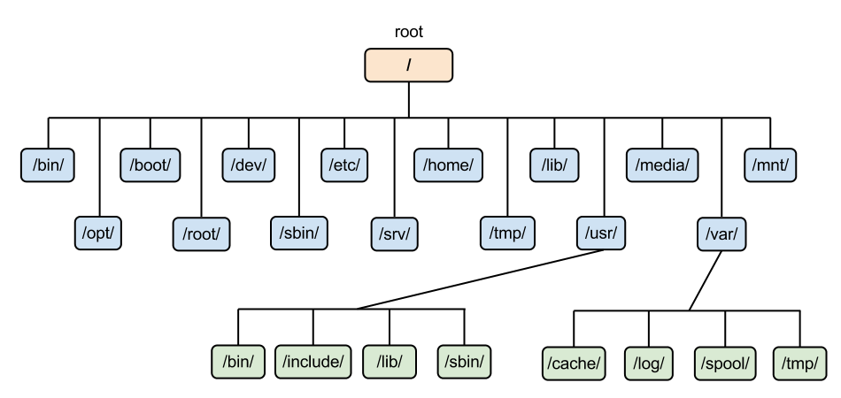
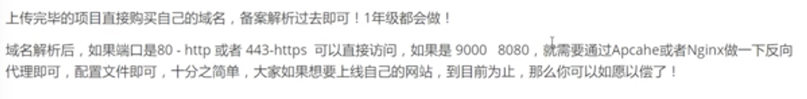

# 走近Linux系統

## Linux應用領域

今天各種場合都有使用各種Linux發行版,從嵌入式設備到超級計算機,並且在服務器領域確定了地位,通常服務器使用LAMP(Linux + Apache + MySQL + PHP)或LNMP(Linux + Nginx + MySQL + PHP)組合。
  目前Linux不僅在家庭與企業中使用,並且在政府中也很受歡迎。
  許多國家都在使用Linux系統

### 1.開機登錄

開機會啟動許多程序。它們在Windows叫做"服務"（service），<mark>在Linux就叫做"守護進程"（daemon）</mark>。

開機成功後，它會顯示一個文本登錄界面，這個界面就是我們經常看到的登錄界面，在這個登錄界面中會提示用戶輸入用戶名，而用戶輸入的用戶將作為參數傳給login程序來驗證用戶的身份，密碼是不顯示的，輸完回車即可！

一般來說，用戶的登錄方式有三種：

- 命令行登錄 : su -
- ssh登錄
- 圖形界面登錄

最高權限賬戶為 root，可以操作一切！

### 2.關機

在linux領域內大多用在服務器上，很少遇到關機的操作。畢竟服務器上跑一個服務是永無止境的，除非特殊情況下，不得已才會關機。

<mark>Linux  --->  No error == success</mark>

關機指令為：shutdown ；

```php
sync # 將數據由內存同步到硬盤中。

shutdown # 關機指令，你可以man shutdown 來看一下幫助文檔。例如你可以運行如下命令關機：

shutdown –h 10 # 這個命令告訴大家，計算機將在10分鐘後關機

shutdown –h now # 立馬關機

shutdown –h 20:25 # 系統會在今天20:25關機

shutdown –h +10 # 十分鐘後關機

shutdown –r now # 系統立馬重啟

shutdown –r +10 # 系統十分鐘後重啟

reboot # 就是重啟，等同於 shutdown –r now

halt # 關閉系統，等同於shutdown –h now 和 poweroff
```

最後總結一下，<mark>不管是重啟系統還是關閉系統，首先要運行 **sync** 命令，把內存中的數據寫到磁盤中</mark>。

### 3.系統目錄結構

1. <mark>Linux一切皆文件</mark>
2. <mark>Linux的一切資源都掛載在這個 / 根節點下</mark>

登錄系統後，在當前命令窗口下輸入命令：

```php
ls /
```


樹狀目錄結構：（Linux的一切資源都掛載在這個 / 根節點下）




**以下是對這些目錄的解釋：**

- **/bin**：<span style="color:orange">bin是Binary的縮寫, 這個目錄存放著最經常使用的命令。 </span> ( be carefiul don't delete it )
- **/boot：**<span style="color:orange"> 這裡存放的是啟動Linux時使用的一些核心文件，包括一些連接文件以及鏡像文件</span>。 <mark> ( don't  toach ) </mark>
- **/dev ：** dev是Device(設備)的縮寫, 存放的是Linux的外部設備，在Linux中訪問設備的方式和訪問文件的方式是相同的。
- <mark>**/etc：**這個目錄用來存放所有的系統管理所需要的配置文件和子目錄。 </mark>
- <mark>**/home**：用戶的主目錄，在Linux中，每個用戶都有一個自己的目錄，一般該目錄名是以用戶的賬號命名的。 </mark>
- **/lib**：這個目錄裡存放著系統最基本的動態連接共享庫，其作用類似於Windows裡的DLL文件。 <mark> ( don't toach ) </mark>
- **/lost+found**：這個目錄一般情況下是空的，當系統非法關機後，這裡就存放了一些文件。 （存放一些突然關機的文件）
- **/media**：linux系統會自動識別一些設備，例如U盤、光驅等等，當識別後，linux會把識別的設備掛載到這個目錄下。
- **/mnt**：系統提供該目錄是為了讓用戶臨時掛載別的文件系統的，我們可以將光驅掛載在/mnt/上，然後進入該目錄就可以查看光驅裡的內容了< span style="color:orange">。 (我們有時候會把一些本地文件掛在這目錄下)</span>
- <mark>**/opt**：這是給主機額外安裝軟件所擺放的目錄。比如你安裝一個ORACLE數據庫則就可以放到這個目錄下。默認是空的。 </mark>
- **/proc**：這個目錄是一個虛擬的目錄，它是系統內存的映射，我們可以通過直接訪問這個目錄來獲取系統信息。 (不用管)
- <mark>**/root**：該目錄為系統管理員，也稱作超級權限者的用戶主目錄。 </mark>
- **/sbin**：s就是Super User的意思，這裡存放的是系統管理員使用的系統管理程序。
- **/srv**：該目錄存放一些服務啟動之後需要提取的數據。
- **/sys**：這是linux2.6內核的一個很大的變化。該目錄下安裝了2.6內核中新出現的一個文件系統 sysfs 。
- <mark>**/tmp**：這個目錄是用來存放一些臨時文件的，用完即丟的的文件，都可以放在這個目錄下，例如安裝包---> 解壓縮完即刪。 </mark>
- <mark>**/usr**：這是一個非常重要的目錄，用戶的很多應用程序和文件都放在這個目錄下，類似於windows下的program files目錄。 </mark>
- **/usr/bin：** 系統用戶使用的應用程序。
- **/usr/sbin：** 超級用戶使用的比較高級的管理程序和系統守護程序。
- **/usr/src：** 內核源代碼默認的放置目錄。
- <mark>**/var**：這個目錄中存放著在不斷擴充著的東西，我們習慣將那些經常被修改的目錄放在這個目錄下。包括各種日誌文件。 </mark>
- **/run**：是一個臨時文件系統，存儲系統啟動以來的信息。當系統重啟時，這個目錄下的文件應該被刪掉或清除。
- <mark>/www : 存放服務器網站相關的資源，環境，網站項目。 </mark>


# 常用的基本命令

> cd:切換目錄

```bash
cd:#切換目錄命令!
./:#當前目錄
/:#絕對路徑
cd..:#返回上一級目錄
cd ~:#回到當前的用戶目錄
pwd :#顯示當前用戶所在的目錄
```

<span style="color:orange">White --> file Blue --> folder</span>

> ls(列出目錄！)

在Linux中Is可能是最常常被使用的!

```bash
-a:#參數: all ,查看全部的文件,包括隱藏文件
-l:#參數列出所有的文件,包含文件的屬性和權限,沒有隱藏文件
```

所有Linux可以組合使用!

```bash
ls -al 查看全部的文件包括隱藏文件的屬性和權限
```

> mkdir 創建一個目錄

```bash
mkdir -p test2/test3/test4 # 用-p遞歸創建層級目錄
```


> rmdir 刪除目錄

```bash
rmdir -p test2/test3/test4 #遞歸刪除文件
```

rmdir僅能刪除空的目錄,如果下面存在文件,需要先刪除文件

遞歸刪除多個目錄-p參數即可


> cp(複製文件或者目錄)

```bash
cp install.sh kuangstudy #將當前目錄下的install.sh 複製到kuangstudy文件夾中
```


> rm 移除文件或者目錄

```bash
-f #忽略不存在的文件,不會出現警告,強制刪除!
-r #遞歸刪除目錄!
-i #互動,刪除詢問是否刪除
rm -rf install.sh/#刪除系統中的install.sh
```

> mv 移動文件或者目錄|重命名文件

```bash
-f #強制
-u #只替換已經更新過的文件==重命名文件

mv install.sh cqhstudy #移動文件
mv cqhstudy cqhstudy2 #重命名文件夾名
```


### 基本屬性

Linux系統是一種典型的多用戶系統，不同的用戶處於不同的地位,擁有不同的權限。

為了保護系統的安全性， Linux系統對不同的用戶訪問同一文件(包括目錄文件)的權限做了不同的規定。

在Linux中我們可以使用<mark> ll 或者 ls -l </mark>命令來顯示一個文件的屬性以及文件所屬的用戶和組,如:


實例中, boot文件的第一個屬性（字母）用"d"表示。 "d"在Linux中代表該文件是一 個目錄文件。

在Linux中第一個字符代表這個文件是目錄、 文件或鏈接文件等等:

- <mark>當為 [d] 則是目錄</mark>

- <mark>當為 [-] 則是文件;</mark>

- <mark>若是 [l] 則表示為鏈接文檔( link file);</mark>

- 若是 [b] 則表示為裝置文件裡面的可供儲存的接口設備(可隨機存取裝置) ;

- 若是 [c] 則表示為裝置文件裡面的串行端口設備,例如鍵盤、鼠標( 一次性讀取裝置)。

接下來的（九個）字符中，以三個為一組，且均為[rwx] 的三個參數的組合。

其中，[r] 代表可讀 (read)、[w] 代表可寫 (write)、[x] 代表可執行 (execute)。

要注意的是,這三個權限的位置不會改變，如果沒有權限，就會出現減號[-]而已。

每個文件的屬性由左邊第一部分的10個字符來確定 (如下圖) :


從左至右用0-9這些數字來表示。

 第0位確定文件類型，第1-3位確定屬主(該文件的所有者)擁有該文件的權限。第4-6位確定屬組 (所有者的同組用戶)擁有該文件的權限，第7-9位確定其他用戶擁有該文件的權限。

 其中:

- 第1、4、7位表示 讀權限,如果用"r"字符表示,則有讀權限,如果用"-“字符表示,則沒有讀權限;

- 第2、5、8位表示寫權限,如果用"W"字符表示,則有寫權限,如果用”-“字符表示沒有寫權限;

- 第3、6、9位表示可執行權限,如果用"x"字符表示,則有執行權限,如果用”-"字符表示,則沒有執行權限。

對於文件來說,它都有一個特定的所有者，也就是對該文件具有所有權的用戶。

同時,在Linux系統中,用戶是按組分類的， - -個用戶屬於一個或多個組。

文件所有者以外的用戶又可以分為文件所有者的同組用戶和其他用戶。

**因此, Linux系統按文件所有者、文件所有者同組用戶和其他用戶來規定了不同的文件訪問權限。 **

在以上實例中， boot文件是一個目錄文件,屬主和屬組都為root。


### 修改文件屬性

1、chgrp ：更改文件屬組 ---> change group

```bash
chgrp [-R] 屬組名文件名
```

-R :遞歸更改文件屬組,就是在更改某個目錄文件的屬組時,如果加上R的參數,那麼該目錄下的所有文件的屬組都會更改。


 2、chown ：更改文件屬主，也可以同時更改文件屬組 ---> change owner

```bash
chown [-R] 屬主名文件名
chown [-R] 屬主名:屬組名文件名
```


<mark>3、chmod ：更改文件9個屬性</mark>

```bash
chmod [-R] xyz 文件或目錄
```

Linux文件屬性有兩種設置方法,一種是數字（常用的是數字）： 一種是符號。

Linux文件的基本權限就有九個，分別是 owner / group / others 三種身份各有自己的 read / write / execute 權限。

 先複習一下剛剛上面提到的數據：文件的權限字符為： [-rwxrwxrwx]，這九個權限是三個三個一組的!其中，我們可以使用字來代表各個權限，各權限的分數對照表如下：

 r : 4 w : 2 x : 1

 可讀可寫不可執行 rw- 6

 可讀可寫可執行 rwx 7

 chomd 777 文件賦予所有用戶可讀可執行!


### 文件內容查看

Linux系統中使用以下命令來查看文件的內容：

- cat由第一行開始顯示文件內容，用來讀文章，或讀取配置文件。

- tac從最後一行開始顯示，可以看出tac是cat的倒著寫！
- nl顯示的時候,順道輸出行號! 看代碼時，希望顯示行號。


 圖 cat和tac、 nl圖解

- more一頁一頁的顯示文件內容（空格表示翻頁，enter代表向下看下一行 ，：f 行號 ） !

  ```bash
  [root@ etc]# more csh.login
  ```

  

- <mark>**less與more類似,但是比more更好的是,他可以往前翻頁!**</mark>

  **<mark>空格翻頁，上下鍵代表上下翻動頁面，退出q命令</mark>**

  <mark>**向下查找字符串 ==>   / 要查詢的字符串，用n繼續搜尋下一個，用N向上尋找） **</mark>

  <mark>**向上查找字符串 ==>  ？要查詢的字符串，用n繼續搜尋下一個，用N向上尋找）**</mark>

```bash
[root@ etc]# less csh.login
```


- head 只看頭幾行 通過-n參數來控制顯示幾行


- tail只看尾巴幾行 通過-n參數來控制顯示幾行

- 你可以使用man 命令來查看各個命令的使用文檔,如: man [命令]。

  

### 網絡配置目錄:

```bash
cd /etc/sysconfig/network-scripts (CentOS7)
#ifcfg-eth0 ---> 默認網路配置文件
```


網絡基礎配置

```bash
ping #用來查看網絡是否連通
ifconfig #查看網絡 和Windows的ipconfig是一樣的
```

2020/6/30

### 硬鏈接和軟鏈接

Linux鏈接分為兩種：硬鏈接、軟鏈接

<span style="color:orange"> **硬鏈接：A—B,假設B是A的硬鏈接，那麼他們兩個指向了同一個文件! ===> 允許一個文件擁有多個路徑，用戶可以通過這種機制硬鏈接到一個重要文件上，防止誤刪**</span>

<span style="color:orange"> **軟鏈接：類似Windows下的快捷方式，刪除源文件，快捷方式也就訪問不**了</span>

 操作步驟：

 創建鏈接 ln命令！

<mark> touch命令創建文件！ </mark>

 echo輸入字符串 ，也可以輸入到文件中


刪除f1之後，查看f2和f3的區別


### Vim編輯器

#### 1.什麼是Vim編輯器

 Vim通過一些插件可以實現和IDE的功能!

Vim是從Vi發展出來的一個文本編輯器。代碼補完、編譯及錯誤跳轉等方便編程的功能特別豐富，在程序員中被廣泛使用。尤其是Linux中，必須要會使用Vim (查看內容，編輯內容，保存內容! )

簡單的來說，Vi是老式的字處理器，不過功能已經很齊全了，但是還是有可以進步的地方。

Vim則可以說是程序開發者的一項很好用的工具。

基本上 vi/vim 共分為三種模式，分別是**命令模式（Command mode）**，**輸入模式（Insert mode）**和**底線命令模式（Last line mode）**。這三種模式的作用分別是：


<mark>命令模式</mark>

用戶剛剛啟動 Vi/Vim ，便進入了命令模式。

```bash
vim file.txt
```

此狀態下敲擊鍵盤動作會被Vim識別為命令，而非輸入字符。比如我們此時按下 i ，並不會輸入一個字符， i 被當作了一個命令。

 以下是常用的幾個命令：

- **i** 切換到輸入模式，以輸入字符。
- **x** 刪除當前光標所在處的字符。
- **:** 切換到底線命令模式，以在最底一行輸入命令。 （如果是編輯模式＝輸入模式，先退出編輯模式 ESC）

若想要編輯文本：啟動Vim，進入了命令模式，按下i，切換到輸入模式。

命令模式只有一些最基本的命令，因此仍要依靠底線命令模式輸入更多命令。

<mark>輸入模式</mark>

在命令模式下按下 i 就進入了輸入模式（--INSERT--）。

在輸入模式中，可以使用以下按鍵：

- 字符按鍵以及Shift組合，輸入字符
- ENTER，回車鍵，換行
- BACK SPACE，退格鍵，刪除光標前一個字符
- DEL，刪除鍵，刪除光標後一個字符
- 方向鍵，在文本中移動光標
- HOME/END，移動光標到行首/行尾
- Page Up/Page Down，上/下翻頁
- Insert，切換光標為輸入/替換模式，光標將變成豎線/下劃線
- ESC，退出輸入模式，切換到命令模式

<mark>底線命令模式</mark>

在命令模式下按下 :（英文冒號）就進入了底線命令模式。

底線命令模式可以輸入單個或多個字符的命令，可用的命令非常多。

在底線命令模式中，基本的命令有（已經省略了冒號）：

q 退出程序

w 保存文件

按ESC鍵可隨時退出底線命令模式。


如果你想要使用 vi 來建立一個名為 kuangstudy.txt 的文件時，你可以這樣做：

```php
[root@kuangshen home]# vim kuangstudy.txt
```

然後就會進入文件

**按下 i 進入輸入模式(也稱為編輯模式)，開始編輯文字**

在一般模式之中，只要按下 i, o, a 等字符就可以進入輸入模式了！

在編輯模式當中，你可以發現在左下角狀態欄中會出現 –INSERT- 的字樣，那就是可以輸入任意字符的提示。

這個時候，鍵盤上除了 **Esc** 這個按鍵之外，其他的按鍵都可以視作為一般的輸入按鈕了，所以你可以進行任何的編輯。

**按下 ESC 按鈕回到一般模式**

好了，假設我已經按照上面的樣式給他編輯完畢了，那麼應該要如何退出呢？是的！沒錯！就是給他按下 **Esc** 這個按鈕即可！馬上你就會發現畫面左下角的 – INSERT – 不見了！

在一般模式中按下 **:wq** 儲存後離開 vim！

OK! 這樣我們就成功創建了一個 kuangstudy.txt 的文件。

#### 2.Vim 按键说明

除了上面简易范例的 i, Esc, :wq 之外，其实 vim 还有非常多的按键可以使用。

<mark>**第一部分：一般模式可用的光标移动、复制粘贴、搜索替换等**</mark>

| 移動光標的方法          |                                                              |
| ------------------ | ------------------------------------------------------------ |
| h 或 向左箭頭鍵(←)      | 光標向左移動一個字符                                         |
| j 或 向下箭頭鍵(↓)      | 光標向下移動一個字符                                         |
| k 或 向上箭頭鍵(↑)      | 光標向上移動一個字符                                         |
| l 或 向右箭頭鍵(→)      | 光標向右移動一個字符                                         |
| [Ctrl] + [f]            | 屏幕『向下』移動一頁，相當於 [Page Down]按鍵 (常用)          |
| [Ctrl] + [b]            | 屏幕『向上』移動一頁，相當於 [Page Up] 按鍵 (常用)           |
| [Ctrl] + [d]            | 屏幕『向下』移動半頁                                         |
| [Ctrl] + [u]            | 屏幕『向上』移動半頁                                         |
| +                       | 光標移動到非空格符的下一行（配置文件中空格較多）             |
| -                       | 光標移動到非空格符的上一行                                   |
| <mark>n< space></mark>  | 那個 n 表示『數字』，例如 20 。按下數字後再按空格鍵，光標會向右移動這一行的 n 個字符。 <mark>（注意要在命令模式下）</mark> |
| 0 或功能鍵[Home]        | 這是數字『 0 』：移動到這一行的最前面字符處 (常用)           |
| $ 或功能鍵[End]         | 移動到這一行的最後面字符處(常用)                             |
| H                       | 光標移動到這個屏幕的最上方那一行的第一個字符                 |
| M                       | 光標移動到這個屏幕的中央那一行的第一個字符                   |
| L                       | 光標移動到這個屏幕的最下方那一行的第一個字符                 |
| G                       | 移動到這個檔案的最後一行(常用)                               |
| nG                      | n 為數字。移動到這個檔案的第 n 行。例如 20G 則會移動到這個檔案的第 20 行(可配合 :set nu) |
| gg                      | 移動到這個檔案的第一行，相當於 1G 啊！ (常用)                |
| <mark> n< Enter></mark> | n 為數字。光標向下移動 n 行(常用)                            |

| 搜索替換            |                                                              |
| ------------------- | ------------------------------------------------------------ |
| <mark>/word </mark> | 向光標之下尋找一個名稱為 word 的字符串。例如要在檔案內搜尋 vbird 這個字符串，就輸入 /vbird 即可！ (常用) |
| ?word               | 向光標之上尋找一個字符串名稱為 word 的字符串。               |
| <mark>n</mark>      | 這個 n 是英文按鍵。代表重複前一個搜尋的動作。舉例來說， 如果剛剛我們執行 /vbird 去向下搜尋 vbird 這個字符串，則按下 n 後，會向下繼續搜尋下一個名稱為 vbird 的字符串。如果是執行 ?vbird 的話，那麼按下 n 則會向上繼續搜尋名稱為 vbird 的字符串！ |
| <mark>N</mark>      | 這個 N 是英文按鍵。與 n 剛好相反，為『反向』進行前一個搜尋動作。例如 /vbird 後，按下 N 則表示『向上』搜尋 vbird 。 |

| 刪除、複製與粘貼      |                                                              |
| --------------------- | ------------------------------------------------------------ |
| x, X                  | 在一行字當中，x 為向後刪除一個字符 (相當於 [del] 按鍵)， X 為向前刪除一個字符(相當於 [backspace] 亦即是退格鍵) (常用) |
| nx                    | n 為數字，連續向後刪除 n 個字符。舉例來說，我要連續刪除 10 個字符， 『10x』。 |
| dd                    | 刪除游標所在的那一整行(常用)                                 |
| ndd                   | n 為數字。刪除光標所在的向下 n 行，例如 20dd 則是刪除 20 行 (常用) |
| d1G                   | 刪除光標所在到第一行的所有數據                               |
| dG                    | 刪除光標所在到最後一行的所有數據                             |
| d$                    | 刪除游標所在處，到該行的最後一個字符                         |
| d0                    | 那個是數字的 0 ，刪除游標所在處，到該行的最前面一個字符      |
| yy                    | 複製游標所在的那一行(常用)                                   |
| nyy                   | n 為數字。複製光標所在的向下 n 行，例如 20yy 則是複制 20 行(常用) |
| y1G                   | 複製游標所在行到第一行的所有數據                             |
| yG                    | 複製游標所在行到最後一行的所有數據                           |
| y0                    | 複製光標所在的那個字符到該行行首的所有數據                   |
| y$                    | 複製光標所在的那個字符到該行行尾的所有數據                   |
| p, P                  | p 為將已復制的數據在光標下一行貼上，P 則為貼在游標上一行！舉例來說，我目前光標在第 20 行，且已經復制了 10 行數據。則按下 p 後， 那 10 行數據會貼在原本的 20 行之後，亦即由 21 行開始貼。但如果是按下 P 呢？那麼原本的第 20 行會被推到變成 30 行。 (常用) |
| J                     | 將光標所在行與下一行的數據結合成同一行                       |
| c                     | 重複刪除多個數據，例如向下刪除 10 行，[ 10cj ]               |
| <mark>u</mark>        | 復原前一個動作。 (常用)                                      |
| <mark>[Ctrl]+r</mark> | 重做上一個動作。 (常用)                                      |

<mark>**第二部分：一般模式切换到编辑模式的可用的按钮说明**</mark>

| 進入輸入或取代的編輯模式 |                                                              |
| ------------------------ | ------------------------------------------------------------ |
| <mark> i, I</mark>       | 進入輸入模式(Insert mode)：i 為『從目前光標所在處輸入』， I 為『在目前所在行的第一個非空格符處開始輸入』。 (常用) |
| a, A                     | 進入輸入模式(Insert mode)：a 為『從目前光標所在的下一個字符處開始輸入』， A 為『從光標所在行的最後一個字符處開始輸入』。 (常用) |
| o, O                     | 進入輸入模式(Insert mode)：這是英文字母 o 的大小寫。 o 為『在目前光標所在的下一行處輸入新的一行』；O 為在目前光標所在處的上一行輸入新的一行！ (常用) |
| r, R                     | 進入取代模式(Replace mode)：r 只會取代光標所在的那一個字符一次；R會一直取代光標所在的文字，直到按下 ESC 為止；(常用) |
| <mark>[Esc]</mark>       | 退出編輯模式，回到一般模式中(常用)                           |

<mark>**第三部分：一般模式切換到指令行模式的可用的按鈕說明**</mark>

| 指 令行的儲存、離開等指令                                    |                                                              |
| ------------------------------------------------------------ | ------------------------------------------------------------ |
| :w                                                           | 將編輯的數據寫入硬盤檔案中(常用)                             |
| :w!                                                          | 若文件屬性為『只讀』時，強制寫入該檔案。不過，到底能不能寫入， 還是跟你對該檔案的檔案權限有關啊！ |
| :q                                                           | 離開 vi (常用)                                               |
| :q!                                                          | 若曾修改過檔案，又不想儲存，使用 ! 為強制離開不儲存檔案。    |
| 注意一下啊，那個驚嘆號 (!) 在 vi 當中，常常具有『強制』的意思～ |                                                              |
| <mark> :wq</mark>                                            | 儲存後離開，若為 :wq! 則為強制儲存後離開 (常用)              |
| ZZ                                                           | 這是大寫的 Z 喔！若檔案沒有更動，則不儲存離開，若檔案已經被更動過，則儲存後離開！ |
| :w [filename]                                                | 將編輯的數據儲存成另一個檔案（類似另存新檔）                 |
| :r [filename]                                                | 在編輯的數據中，讀入另一個檔案的數據。亦即將 『filename』 這個檔案內容加到游標所在行後面 |
| :n1,n2 w [filename]                                          | 將 n1 到 n2 的內容儲存成 filename 這個檔案。                 |
| :! command                                                   | 暫時離開 vi 到指令行模式下執行 command 的顯示結果！例如 『:! ls /home』即可在 vi 當中看 /home 底下以 ls 輸出的檔案信息！ |
| <mark> :set nu</mark> 設置行號，代碼中經常使用               | 顯示行號，設定之後，會在每一行的前綴顯示該行的行號           |
| :set nonu                                                    | 與 set nu 相反，為取消行號！                                 |

### 賬號管理

> 簡介

Linux系統是一個多用戶多任務的分時操作系統，任何一個要使用系統資源的用戶，都必須首先向系統管理員申請一個賬號，然後以這個賬號的身份進入系統。

用戶的賬號一方面可以幫助系統管理員對使用系統的用戶進行跟踪，並控制他們對系統資源的訪問；另一方面也可以幫助用戶組織文件，並為用戶提供安全性保護。

每個用戶賬號都擁有一個唯一的用戶名和各自的口令。

用戶在登錄時鍵入正確的用戶名和口令後，就能夠進入系統和自己的主目錄。

實現用戶賬號的管理，要完成的工作主要有如下幾個方面：

- 用戶賬號的添加、刪除與修改。
- 用戶口令的管理。
- 用戶組的管理。

> 用戶賬號的管理

用戶賬號的管理工作主要涉及到用戶賬號的添加、修改和刪除。

添加用戶賬號就是在系統中創建一個新賬號，然後為新賬號分配用戶號、用戶組、主目錄和登錄Shell等資源。

> 添加賬號 useradd

```php
useradd 選項 用戶名
```

參數說明：

- 選項 :
- - -c comment 指定一段註釋性描述。
  - -d 目錄 指定用戶主目錄，如果此目錄不存在，則同時使用-m選項，可以創建主目錄。
  - -g 用戶組 指定用戶所屬的用戶組。
  - -G 用戶組，用戶組 指定用戶所屬的附加組。
  - <mark> -m　使用者目錄如不存在則自動建立。 </mark>
  - -s Shell文件 指定用戶的登錄Shell。
  - -u 用戶號 指定用戶的用戶號，如果同時有-o選項，則可以重複使用其他用戶的標識號。
- 用戶名 :
- - 指定新賬號的登錄名。

測試：

```php
# 此命令創建了一個用戶kuangshen，其中-m選項用來為登錄名kuangshen產生一個主目錄 /home/kuangshen
[root@kuangshen home]# useradd -m kuangshen
```

Linux中一切皆文件，這裡添加用戶＝在某一文簡中寫入用戶訊息

<mark>增加用戶賬號就是在/etc/passwd文件中為新用戶增加一條記錄，同時更新其他系統文件如/etc/shadow, /etc/group, etc/passwd等。 </mark>

> 刪除帳號

如果一個用戶的賬號不再使用，可以從系統中刪除。

刪除用戶賬號就是要將/etc/passwd等系統文件中的該用戶記錄刪除，必要時還刪除用戶的主目錄。

刪除一個已有的用戶賬號使用userdel命令，其格式如下：

```php
userdel 選項 用戶名
```

<mark>常用的選項是 **-r**，它的作用是把用戶的主目錄一起刪除。 </mark>

```php
[root@kuangshen home]# userdel -r kuangshen
```

此命令刪除用戶kuangshen在系統文件中（主要是/etc/passwd, /etc/shadow, /etc/group等）的記錄，同時刪除用戶的主目錄。

> 修改帳號

修改用戶賬號就是根據實際情況更改用戶的有關屬性，如用戶號、主目錄、用戶組、登錄Shell等。

修改已有用戶的信息使用usermod命令，其格式如下：

```php
usermod 選項 用戶名
```

常用的選項包括-c, -d, -m, -g, -G, -s, -u以及-o等，這些選項的意義與useradd命令中的選項一樣，可以為用戶指定新的資源值。

例如：

```php
# usermod -s /bin/ksh -d /home/z –g developer kuangshen
```

此命令將用戶kuangshen的登錄Shell修改為ksh，主目錄改為/home/z，用戶組改為developer。


```bash
[root@ home]# usermod -d new_folder old_folder
```

<mark> 修改用戶目錄時，一定要確保要修改的目錄是存在的！ </mark>

修改完後，查看配置文件即可

> Linux下如何切換用戶


1.切換用戶的命令為：su username 【username是你的用戶名哦】

2.從普通用戶切換到root用戶，還可以使用命令：sudo su

3.在終端輸入 exit 或 logout 或使用快捷方式 ctrl+d，可以退回到原來用戶，其實ctrl+d 也是執行的exit命令

4.在切換用戶時，如果想在切換用戶之後使用新用戶的工作環境，可以在su和username之間加-，例如：【su - root】

<mark>$表示普通用戶</mark>

<mark>#表示超級用戶，也就是root用戶</mark>

```bash
# hostname #查看主機名
# hostname newname #修改主機名
```


> 用戶口令的管理

用戶管理的一項重要內容是用戶口令的管理。用戶賬號剛創建時沒有口令，但是被系統鎖定，無法使用，必須為其指定口令後才可以使用，即使是指定空口令。

指定和修改用戶口令的Shell命令是passwd。超級用戶可以為自己和其他用戶指定口令，普通用戶只能用它修改自己的口令。

命令的格式為：

```php
passwd 選項 用戶名
```

可使用的選項：

- -l 鎖定口令，即禁用賬號。
- -u 口令解鎖。
- -d 使賬號無口令。
- -f 強迫用戶下次登錄時修改口令。

如果默認用戶名，則修改當前用戶的口令。

例如，假設當前用戶是kuangshen，則下面的命令修改該用戶自己的口令：

```php
$ passwd
Old password:******
New password:*******
Re-enter new password:*******
```

如果是超級用戶，可以用下列形式指定任何用戶的口令：

```php
# passwd kuangshen
New password:*******
Re-enter new password:*******
```

普通用戶修改自己的口令時，passwd命令會先詢問原口令，驗證後再要求用戶輸入兩遍新口令，如果兩次輸入的口令一致，則將這個口令指定給用戶；而超級用戶為用戶指定口令時，就不需要知道原口令。

為了系統安全起見，用戶應該選擇比較複雜的口令，例如最好使用8位長的口令，口令中包含有大寫、小寫字母和數字，並且應該與姓名、生日等不相同。

為用戶指定空口令時，執行下列形式的命令：

```php
# passwd -d kuangshen
```

此命令將用戶 kuangshen的口令（密碼）刪除，這樣用戶 kuangshen下一次登錄時，系統就不再允許該用戶登錄了。

passwd 命令還可以用 -l(lock) 選項鎖定某一用戶，使其不能登錄，例如：

```php
# passwd -l kuangshen
```

### 用戶組管理

每個用戶都有一個用戶組，系統可以對一個用戶組中的所有用戶進行集中管理。不同Linux 系統對用戶組的規定有所不同，如Linux下的用戶屬於與它同名的用戶組，這個用戶組在創建用戶時同時創建。

<mark>用戶組的管理涉及用戶組的添加、刪除和修改。組的增加、刪除和修改實際上就是對/etc/group文件的更新。 </mark>

> 增加一個新的用戶組使用groupadd命令

```php
groupadd 選項 用戶組
```

可以使用的選項有：

- -g GID 指定新用戶組的組標識號（GID）。 （如果不指定，就是自增1）
- -o 一般與-g選項同時使用，表示新用戶組的GID可以與系統已有用戶組的GID相同。

實例1：

```php
# groupadd group1
```

此命令向系統中增加了一個新組group1，新組的組標識號是在當前已有的最大組標識號的基礎上加1。

實例2：

```php
# groupadd -g 101 group2
```

此命令向系統中增加了一個新組group2，同時指定新組的組標識號是101。

> 如果要刪除一個已有的用戶組，使用groupdel命令

```php
groupdel 用戶組
```

例如：

```php
# groupdel group1
```

此命令從系統中刪除組group1。

> 修改用戶組的屬性使用groupmod命令

```php
groupmod 選項 用戶組
```

常用的選項有：

- -g GID 為用戶組指定新的組標識號。
- -o 與-g選項同時使用，用戶組的新GID可以與系統已有用戶組的GID相同。
- -n新用戶組 將用戶組的名字改為新名字

```php
# 此命令將組group2的組標識號修改為102。
groupmod -g 102 group2
  
# 將組group2的標識號改為10000，組名修改為group3。
groupmod –g 10000 -n group3 group2
```

> 切換組

如果一個用戶同時屬於多個用戶組，那麼用戶可以在用戶組之間切換，以便具有其他用戶組的權限。

用戶可以在登錄後，使用命令newgrp切換到其他用戶組，這個命令的參數就是目的用戶組。例如：

```php
$ newgrp root
```

這條命令將當前用戶切換到root用戶組，前提條件是root用戶組確實是該用戶的主組或附加組。

> /etc/passwd

完成用戶管理的工作有許多種方法，但是每一種方法實際上都是對有關的系統文件進行修改。

與用戶和用戶組相關的信息都存放在一些系統文件中，這些文件包括/etc/passwd, /etc/shadow, /etc/group等。

下面分別介紹這些文件的內容。

<mark>**/etc/passwd文件是用戶管理工作涉及的最重要的一個文件。 **</mark>

Linux系統中的每個用戶都在/etc/passwd文件中有一個對應的記錄行，它記錄了這個用戶的一些基本屬性。

這個文件對所有用戶都是可讀的。它的內容類似下面的例子：

```bash
＃ cat /etc/passwd
root:x:0:0:Superuser:/:
daemon:x:1:1:System daemons:/etc:
bin:x:2:2:Owner of system commands:/bin:
sys:x:3:3:Owner of system files:/usr/sys:
adm:x:4:4:System accounting:/usr/adm:
uucp:x:5:5:UUCP administrator:/usr/lib/uucp:
auth:x:7:21:Authentication administrator:/tcb/files/auth:
cron:x:9:16:Cron daemon:/usr/spool/cron:
listen:x:37:4:Network daemon:/usr/net/nls:
lp:x:71:18:Printer administrator:/usr/spool/lp:
```

從上面的例子我們可以看到，/etc/passwd中一行記錄對應著一個用戶，每行記錄又被冒號(:)分隔為7個字段，其格式和具體含義如下：

```php
用戶名:口令（登入密碼，我們不可見）:用戶標識號:組標識號:註釋性描述:主目錄:登錄Shell
```

1）"用戶名"是代表用戶賬號的字符串。

通常長度不超過8個字符，並且由大小寫字母和/或數字組成。登錄名中不能有冒號(:)，因為冒號在這裡是分隔符。

為了兼容起見，登錄名中最好不要包含點字符(.)，並且不使用連字符(-)和加號(+)打頭。

2）“口令”一些系統中，存放著加密後的用戶口令字。

雖然這個字段存放的只是用戶口令的加密串，不是明文，但是由於/etc/passwd文件對所有用戶都可讀，所以這仍是一個安全隱患。因此，<mark>現在許多Linux 系統（如SVR4）都使用了shadow技術，把真正的加密後的用戶口令字存放到/etc/shadow文件中，而在/etc/passwd文件的口令字段中只存放一個特殊的字符，例如“x”或者“*”。 </mark>

3）“用戶標識號”是一個整數，系統內部用它來標識用戶。

一般情況下它與用戶名是一一對應的。如果幾個用戶名對應的用戶標識號是一樣的，系統內部將把它們視為同一個用戶，但是它們可以有不同的口令、不同的主目錄以及不同的登錄Shell等。

通常用戶標識號的取值範圍是0～65 535。0是超級用戶root的標識號，1～99由系統保留，作為管理賬號，普通用戶的標識號從100開始。在Linux系統中，這個界限是500。

4）“組標識號”字段記錄的是用戶所屬的用戶組。

它對應著/etc/group文件中的一條記錄。

5) “註釋性描述”字段記錄著用戶的一些個人情況。

例如用戶的真實姓名、電話、地址等，這個字段並沒有什麼實際的用途。在不同的Linux 系統中，這個字段的格式並沒有統一。在許多Linux系統中，這個字段存放的是一段任意的註釋性描述文字，用作finger命令的輸出。

6) “主目錄”，也就是用戶的起始工作目錄。

它是用戶在登錄到系統之後所處的目錄。在大多數係統中，各用戶的主目錄都被組織在同一個特定的目錄下，而用戶主目錄的名稱就是該用戶的登錄名。各用戶對自己的主目錄有讀、寫、執行（搜索）權限，其他用戶對此目錄的訪問權限則根據具體情況設置。

7) 用戶登錄後，要啟動一個進程，負責將用戶的操作傳給內核，這個進程是用戶登錄到系統後運行的命令解釋器或某個特定的程序，即Shell。

Shell是用戶與Linux系統之間的接口。 Linux的Shell有許多種，每種都有不同的特點。常用的有sh(Bourne Shell), csh(C Shell), ksh(Korn Shell), tcsh(TENEX/TOPS-20 type C Shell), bash(Bourne Again Shell)等。

系統管理員可以根據系統情況和用戶習慣為用戶指定某個Shell。如果不指定Shell，那麼系統使用sh為默認的登錄Shell，即這個字段的值為/bin/sh。

用戶的登錄Shell也可以指定為某個特定的程序（此程序不是一個命令解釋器）。

利用這一特點，我們可以限制用戶只能運行指定的應用程序，在該應用程序運行結束後，用戶就自動退出了系統。有些Linux 系統要求只有那些在系統中登記了的程序才能出現在這個字段中。

8)系統中有一類用戶稱為偽用戶（pseudo users）。

這些用戶在/etc/passwd文件中也佔有一條記錄，但是不能登錄，因為它們的登錄Shell為空。它們的存在主要是方便系統管理，滿足相應的系統進程對文件屬主的要求。

常見的偽用戶如下所示：

```php
偽 用 戶 含 義
bin 擁有可執行的用戶命令文件
sys 擁有系統文件
adm 擁有帳戶文件
uucp UUCP使用
lp lp或lpd子系統使用
nobody NFS使用
```

> /etc/shadow

**1、除了上面列出的偽用戶外，還有許多標準的偽用戶，例如：audit, cron, mail, usenet等，它們也都各自為相關的進程和文件所需要。 **

由於/etc/passwd文件是所有用戶都可讀的，如果用戶的密碼太簡單或規律比較明顯的話，一台普通的計算機就能夠很容易地將它破解，因此對安全性要求較高的Linux系統都把加密後的口令字分離出來，單獨存放在一個文件中，這個文件是/etc/shadow文件。有超級用戶才擁有該文件讀權限，這就保證了用戶密碼的安全性。

**2、/etc/shadow中的記錄行與/etc/passwd中的一一對應，它由pwconv命令根據/etc/passwd中的數據自動產生**

它的文件格式與/etc/passwd類似，由若干個字段組成，字段之間用":"隔開。這些字段是：

```php
登錄名:加密口令:最後一次修改時間:最小時間間隔:最大時間間隔:警告時間:不活動時間:失效時間:標誌
```

1. "登錄名"是與/etc/passwd文件中的登錄名相一致的用戶賬號
2. "口令"字段存放的是加密後的用戶口令字，長度為13個字符。如果為空，則對應用戶沒有口令，登錄時不需要口令；如果含有不屬於集合 { ./0-9A-Za-z }中的字符，則對應的用戶不能登錄。
3. "最後一次修改時間"表示的是從某個時刻起，到用戶最後一次修改口令時的天數。時間起點對不同的系統可能不一樣。例如在SCO Linux 中，這個時間起點是1970年1月1日。
4. "最小時間間隔"指的是兩次修改口令之間所需的最小天數。
5. "最大時間間隔"指的是口令保持有效的最大天數。
6. "警告時間"字段表示的是從系統開始警告用戶到用戶密碼正式失效之間的天數。
7. "不活動時間"表示的是用戶沒有登錄活動但賬號仍能保持有效的最大天數。
8. "失效時間"字段給出的是一個絕對的天數，如果使用了這個字段，那麼就給出相應賬號的生存期。期滿後，該賬號就不再是一個合法的賬號，也就不能再用來登錄了。

> /etc/group

用戶組的所有信息都存放在/etc/group文件中。

將用戶分組是Linux 系統中對用戶進行管理及控制訪問權限的一種手段。

每個用戶都屬於某個用戶組；一個組中可以有多個用戶，一個用戶也可以屬於不同的組。

當一個用戶同時是多個組中的成員時，在/etc/passwd文件中記錄的是用戶所屬的主組，也就是登錄時所屬的默認組，而其他組稱為附加組。

用戶要訪問屬於附加組的文件時，必須首先使用newgrp命令使自己成為所要訪問的組中的成員。

用戶組的所有信息都存放在/etc/group文件中。此文件的格式也類似於/etc/passwd文件，由冒號(:)隔開若干個字段，這些字段有：

```php
組名:口令:組標識號:組內用戶列表
```

1. "組名"是用戶組的名稱，由字母或數字構成。與/etc/passwd中的登錄名一樣，組名不應重複。

2. "口令"字段存放的是用戶組加密後的口令字。一般Linux 系統的用戶組都沒有口令，即這個字段一般為空，或者是*。

3. "組標識號"與用戶標識號類似，也是一個整數，被系統內部用來標識組。

4. "組內用戶列表"是屬於這個組的所有用戶的列表/b]，不同用戶之間用逗號(,)分隔。這個用戶組可能是用戶的主組，也可能是附加組。


### 磁盤管理

> 概述

Linux磁盤管理好壞直接關係到整個系統的性能問題。

Linux磁盤管理常用命令為 df、du。

- df ：列出文件系統的整體磁盤使用量


- du：檢查磁盤空間使用量


> df

df命令參數功能：檢查文件系統的磁盤空間佔用情況。可以利用該命令來獲取硬盤被佔用了多少空間，目前還剩下多少空間等信息。

語法：

```php
df [-ahikHTm] [目錄或文件名]
```

選項與參數：

- -a ：列出所有的文件系統，包括系統特有的 /proc 等文件系統；
- -k ：以 KBytes 的容量顯示各文件系統；
- -m ：以 MBytes 的容量顯示各文件系統；
- -h ：以人們較易閱讀的 GBytes, MBytes, KBytes 等格式自行顯示；
- -H ：以 M=1000K 取代 M=1024K 的進位方式；
- -T ：顯示文件系統類型, 連同該 partition 的 filesystem 名稱 (例如 ext3) 也列出；
- -i ：不用硬盤容量，而以 inode 的數量來顯示

測試：

```php
# 將系統內所有的文件系統列出來！
# 在 Linux 底下如果 df 沒有加任何選項
# 那麼默認會將系統內所有的 (不含特殊內存內的文件系統與 swap) 都以 1 Kbytes 的容量來列出來！
[root@kuangshen /]# df
Filesystem     1K-blocks    Used Available Use% Mounted on
devtmpfs          889100       0    889100   0% /dev
tmpfs             899460     704    898756   1% /dev/shm
tmpfs             899460     496    898964   1% /run
tmpfs             899460       0    899460   0% /sys/fs/cgroup
/dev/vda1       41152812 6586736  32662368  17% /
tmpfs             179896       0    179896   0% /run/user/0
  
# 將容量結果以易讀的容量格式顯示出來
[root@kuangshen /]# df -h
Filesystem      Size  Used Avail Use% Mounted on
devtmpfs        869M     0  869M   0% /dev
tmpfs           879M  708K  878M   1% /dev/shm
tmpfs           879M  496K  878M   1% /run
tmpfs           879M     0  879M   0% /sys/fs/cgroup
/dev/vda1        40G  6.3G   32G  17% /
tmpfs           176M     0  176M   0% /run/user/0
  
# 將系統內的所有特殊文件格式及名稱都列出來
[root@kuangshen /]# df -aT
Filesystem     Type        1K-blocks    Used Available Use% Mounted on
sysfs          sysfs               0       0         0    - /sys
proc           proc                0       0         0    - /proc
devtmpfs       devtmpfs       889100       0    889100   0% /dev
securityfs     securityfs          0       0         0    - /sys/kernel/security
tmpfs          tmpfs          899460     708    898752   1% /dev/shm
devpts         devpts              0       0         0    - /dev/pts
tmpfs          tmpfs          899460     496    898964   1% /run
tmpfs          tmpfs          899460       0    899460   0% /sys/fs/cgroup
cgroup         cgroup              0       0         0    - /sys/fs/cgroup/systemd
pstore         pstore              0       0         0    - /sys/fs/pstore
cgroup         cgroup              0       0         0    - /sys/fs/cgroup/freezer
cgroup         cgroup              0       0         0    - /sys/fs/cgroup/cpuset
cgroup         cgroup              0       0         0    - /sys/fs/cgroup/hugetlb
cgroup         cgroup              0       0         0    - /sys/fs/cgroup/blkio
cgroup         cgroup              0       0         0    - /sys/fs/cgroup/net_cls,net_prio
cgroup         cgroup              0       0         0    - /sys/fs/cgroup/memory
cgroup         cgroup              0       0         0    - /sys/fs/cgroup/pids
cgroup         cgroup              0       0         0    - /sys/fs/cgroup/cpu,cpuacct
cgroup         cgroup              0       0         0    - /sys/fs/cgroup/devices
cgroup         cgroup              0       0         0    - /sys/fs/cgroup/perf_event
configfs       configfs            0       0         0    - /sys/kernel/config
/dev/vda1      ext4         41152812 6586748  32662356  17% /
systemd-1      -                   -       -         -    - /proc/sys/fs/binfmt_misc
mqueue         mqueue              0       0         0    - /dev/mqueue
debugfs        debugfs             0       0         0    - /sys/kernel/debug
hugetlbfs      hugetlbfs           0       0         0    - /dev/hugepages
tmpfs          tmpfs          179896       0    179896   0% /run/user/0
binfmt_misc    binfmt_misc         0       0         0    - /proc/sys/fs/binfmt_misc
  
# 將 /etc 底下的可用的磁盤容量以易讀的容量格式顯示
[root@kuangshen /]# df -h /etc
Filesystem      Size  Used Avail Use% Mounted on
/dev/vda1        40G  6.3G   32G  17% /
```

> du

Linux du命令也是查看使用空間的，但是與df命令不同的是Linux du命令是對文件和目錄磁盤使用的空間的查看，還是和df命令有一些區別的，這裡介紹Linux du命令。

語法：

```php
du [-ahskm] 文件或目錄名稱
```

選項與參數：

- -a ：列出所有的文件與目錄容量，因為默認僅統計目錄底下的文件量而已。
- -h ：以人們較易讀的容量格式 (G/M) 顯示；
- -s ：列出總量而已，而不列出每個各別的目錄佔用容量；
- -S ：不包括子目錄下的總計，與 -s 有點差別。
- -k ：以 KBytes 列出容量顯示；
- -m ：以 MBytes 列出容量顯示；

測試：

```php
# 只列出當前目錄下的所有文件夾容量（包括隱藏文件夾）:
# 直接輸入 du 沒有加任何選項時，則 du 會分析當前所在目錄的文件與目錄所佔用的硬盤空間。

[root@kuangshen home]# du
16 ./redis
8 ./www/.oracle_jre_usage # 包括隱藏文件的目錄
24 ./www
48 . # 這個目錄(.)所佔用的總量
  
# 將文件的容量也列出來
[root@kuangshen home]# du -a
4 ./redis/.bash_profile
4 ./redis/.bash_logout
....中間省略....
4 ./kuangstudy.txt # 有文件的列表了
48 .
# 檢查根目錄底下每個目錄所佔用的容量
  
[root@kuangshen home]# du -sm /*
0 /bin
146 /boot
.....中間省略....
0 /proc
.....中間省略....
1 /tmp
3026 /usr # 系統初期最大就是他了啦！
513 /var
2666 /www
```

通配符 * 來代表每個目錄。

與 df 不一樣的是，du 這個命令其實會直接到文件系統內去搜尋所有的文件數據。

> 磁盤掛載與卸除

根文件系統之外的其他文件要想能夠被訪問，都必須通過“關聯”至根文件系統上的某個目錄來實現，此關聯操作即為“掛載”，此目錄即為“掛載點”,解除此關聯關係的過程稱之為“卸載”

Linux 的磁盤掛載使用mount命令，卸載使用umount命令。


磁盤掛載語法：

```php
mount [-t 文件系統] [-L Label名] [-o 額外選項] [-n] 裝置文件名 掛載點
```

測試：

```php
# 將 /dev/hdc6 掛載到 /mnt/hdc6 上面！
[root@www ~]# mkdir /mnt/hdc6
[root@www ~]# mount /dev/hdc6 /mnt/hdc6
[root@www ~]# df
Filesystem 1K-blocks Used Available Use% Mounted on
/dev/hdc6 1976312 42072 1833836 3% /mnt/hdc6
```

磁盤卸載命令 umount 語法：

```php
umount [-fn] 裝置文件名或掛載點
```

選項與參數：

- -f ：強制卸除！可用在類似網絡文件系統 (NFS) 無法讀取到的情況下；
- -n ：不升級 /etc/mtab 情況下卸除。

卸載/dev/hdc6

```php
[root@www ~]# umount /dev/hdc6
```

### 進程管理

#### 什麼是進程

1、在Linux中 ,每一個程序都是有自己的一個進程,每一個進程都有一個id號!
 2、每一個進程呢,都會有一個父進程!
 3、進程可以有兩種存在方式:**前台**!**後台**運行!
 4、一般的話**服務都是後台運行**的，基本的程序都是**前台運行**的

 命令

<mark> ps 查看當前系統中正在執行的各種進程的信息！ </mark>

 ps- xx：
   -a 顯示當前終端所有的進程信息（當前的進程，只有一個）
   -u 以用戶的信息顯示進程
   -x 顯示後台運行進程的參數

```bash
#ps -aux 查看所有進程
ps-aux|grep mysql 查看mysql相關進程
ps-aux|grep redis 查看redis相關進程
ps-aux|grep java 查看java相關進程
# | 在Linux中這個叫管道符 A|B ===> 把命令的結果，作為輸出來操作Ｂ命令
# grep 查找文件中符合條件的字符串 （過濾）
```

對於我們來說,這裡目前只需要記住一個命令即可ps -xx|grep進程名字!過濾進程信息!
 ps-ef ：可以查看到父進程的信息

```bash
ps-ef|grep mysql 看父進程我們一般可以通過目錄樹結構來查看
#進程樹
#pstree -pu
#-p 顯示父id
#-u 顯示用戶組
```


  進程樹效果圖


結束進程：殺掉進程 等價於Windows結束任務

```bash
kill -9 pid
```

表示強制結束該進程

Java 代碼死循環了，可以選擇結束進程 ==> 強制結束


# 環境安裝

安裝軟件一般有三種方式

1. rpm（在線發布一個SpringBoot項目） ---> jdk
2. 解壓縮 ---> tomcat
3. yum在線安裝 ---> docker

### 1.rpm ---> jdk

1、下載IDK rpm。去oralce官網下載即可!

2、 如果有安裝openjdk 則卸載

```bash
java -version #檢測當前系統是否存在Java環境 和windows命令一樣
#如果有的話就需要卸載
rpm -qa|grep jdk #查看JDK版本信息
rpm -e --nodeps jdk_ 卸載
#卸載完畢後可安裝JDK
rpm -ivk rpm包
```


```php
#檢測當前系統是否存在Java環境
[root@kuangshen ~]# java -version
java version "1.8.0_121"
Java(TM) SE Runtime Environment (build 1.8.0_121-b13)
Java HotSpot(TM) 64-Bit Server VM (build 25.121-b13, mixed mode)

# 檢查
[root@kuangshen ~]# rpm -qa|grep jdk
jdk1.8.0_121-1.8.0_121-fcs.x86_64

# 卸載 -e --nodeps 強制刪除
[root@kuangshen ~]# rpm -e --nodeps jdk1.8.0_121-1.8.0_121-fcs.x86_64
[root@kuangshen ~]# java -version
-bash: /usr/bin/java: No such file or directory # OK
```

3、安裝JDK


<mark>配置環境變量: /etc/profile 在文件的最後面增加java的配置</mark>

<mark>讓這個配置文件生效!</mark>

```bash
source /etc/profile
```

這個環境變量有問題 狂神老師敲的是有問題的 狂神老師用的是阿里雲，自帶網絡了，此處給用虛擬機的同學使用。虛擬機聯網教程：[虛擬機和主機聯網教程](https://blog.csdn.net/u012049667/article/details/81171003)
  配置完後在Linux防火牆中開啟相應端口 使用java -jar發布 如果你的項目在雲服務器上，就可以在公網上進行發布查看了

```bash
#開啟防火牆端口
firewall-cmd --zone=public --add-port=9000/tcp --permanent
#重啟防火牆
systemctl restart firewalld.service
#查看所有開啟的端口，如果是阿里雲 需要配置安全組規則
firewall-cmd --list-ports
```

```php
# 安裝java rpm
[root@kuangshen kuangshen]# rpm -ivh jdk-8u221-linux-x64.rpm

# 安裝完成後配置環境變量 文件：/etc/profile (狂神老師敲阿里雲，自帶網絡)
JAVA_HOME=/usr/java/jdk1.8.0_221-amd64
CLASSPATH=%JAVA_HOME%/lib:%JAVA_HOME%/jre/lib
PATH=$PATH:$JAVA_HOME/bin:$JAVA_HOME/jre/bin
export PATH CLASSPATH JAVA_HOME
# 保存退出

# 讓新增的環境變量生效！
source /etc/profile

# 測試 java -version
[root@kuangshen java]# java -version
java version "1.8.0_221"
Java(TM) SE Runtime Environment (build 1.8.0_221-b11)
Java HotSpot(TM) 64-Bit Server VM (build 25.221-b11, mixed mode)
```

### 2.解壓縮 ---> tomcat

<mark>ssm war 就需要放在tomcat中運行</mark>

1. 下載tomcat 官網下載即可
2. 解壓

```bash
tar -zxvf apache-tomcat-9.0.36.tar.gz
```

3. 啟動tomcat

```bash
#執行
./startup.sh
#停止
./shutdown.sh
```

```bash
#開啟端口
firewall-cmd --zone=public --add-port=8080/tcp –permanent
12
```

命令含義:
  --zone 作用域
  --add-port-80/tcp 添加端口， 格式為:端口/通訊協議
  --permanent 永久生效，沒有此參數重啟後失效

如果是阿里雲 上傳完畢的項目直接購買自己的域名,備案解析過去即可!

域名解析後,如果端口是80 - http或者443-https 可以直接訪問,如果是9000 8080 ,就需要通過Apcahe或者Nginx做一下反向代理即可（配置文件）

----------------------------------------------

1、安裝好了Java環境後我們可以測試下Tomcat！準備好Tomcat的安裝包！

2、將文件移動到/usr/tomcat/下，並解壓！

```php
[root@kuangshen kuangshen]# mv apache-tomcat-9.0.22.tar.gz /usr
[root@kuangshen kuangshen]# cd /usr
[root@kuangshen usr]# ls
apache-tomcat-9.0.22.tar.gz
[root@kuangshen usr]# tar -zxvf apache-tomcat-9.0.22.tar.gz # 解壓
```

3、運行Tomcat，進入bin目錄，和我們以前在Windows下看的都是一樣的

```php
# 執行：startup.sh -->啟動tomcat
# 執行：shutdown.sh -->關閉tomcat
./startup.sh
./shutdown.sh
```

4、確保Linux的防火牆端口是開啟的，如果是阿里雲，需要保證阿里雲的安全組策略是開放的！

```php
# 查看firewall服務狀態
systemctl status firewalld

# 開啟、重啟、關閉、firewalld.service服務
# 開啟
service firewalld start

# 重啟
service firewalld restart

# 關閉
service firewalld stop

# 查看防火牆規則
firewall-cmd --list-all # 查看全部信息
firewall-cmd --list-ports # 只看端口信息

# 開啟端口
開端口命令：firewall-cmd --zone=public --add-port=80/tcp --permanent
重啟防火牆：systemctl restart firewalld.service
命令含義：
--zone #作用域
--add-port=80/tcp #添加端口，格式為：端口/通訊協議
--permanent #永久生效，沒有此參數重啟後失效
```



### 3.yum在線安裝 ---> docker

> 基於 CentOS 7 安裝

1. 官網安裝參考手冊：https://docs.docker.com/install/linux/docker-ce/centos/

2. 確定你是CentOS7及以上版本

   ```php
   [root@192 Desktop]# cat /etc/redhat-release
   CentOS Linux release 7.2.1511 (Core)
   ```

3. yum安裝gcc相關（需要確保 虛擬機可以上外網 ）

   ```php
   yum -y install gcc
   yum -y install gcc-c++
   ```

4. 卸載舊版本

   ```php
   yum -y remove docker docker-common docker-selinux docker-engine
   
   # 官網版本
   yum remove docker \
               docker-client \
               docker-client-latest \
               docker-common \
               docker-latest \
               docker-latest-logrotate \
               docker-logrotate \
               docker-engine
   ```

5. 安裝需要的軟件包

   ```php
   yum install -y yum-utils device-mapper-persistent-data lvm2
   ```

6. 設置stable鏡像倉庫

   ```php
   # 錯誤
   yum-config-manager --add-repo https://download.docker.com/linux/centos/docker-ce.repo
   
   ## 報錯
   [Errno 14] curl#35 - TCP connection reset by peer
   [Errno 12] curl#35 - Timeout
   
   # 正確推薦使用國內的
   yum-config-manager --add-repo http://mirrors.aliyun.com/docker-ce/linux/centos/docker-ce.repo
   ```

7. 更新yum軟件包索引

   ```php
   yum makecache fast
   ```

8. 安裝Docker CE

   ```php
   yum -y install docker-ce docker-ce-cli containerd.io
   ```

9. 啟動docker

   ```php
   systemctl start docker
   ```

10. 測試

    ```php
    docker version
    docker run hello-world
    docker images
    ```