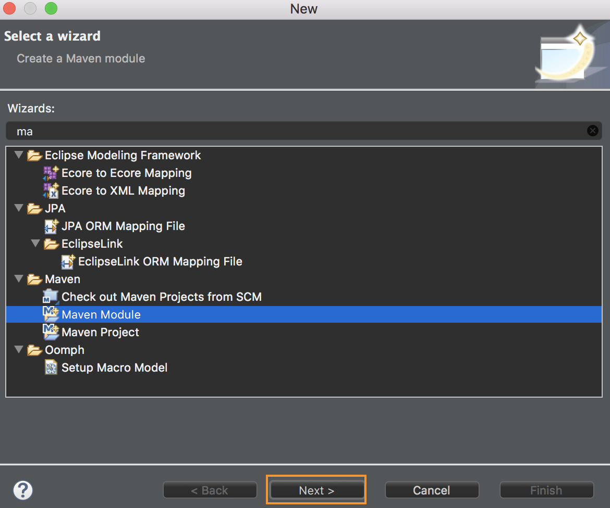
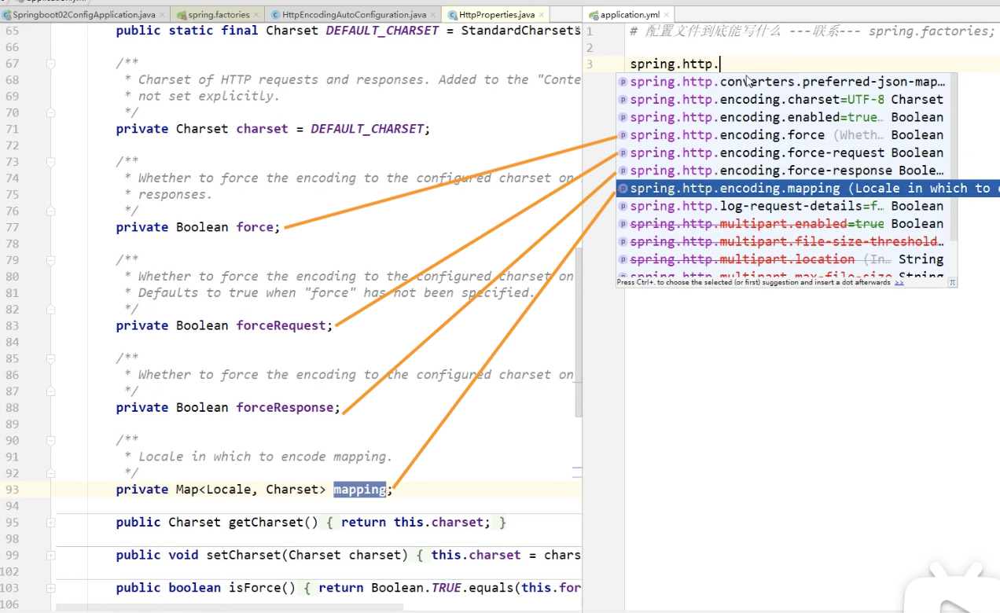
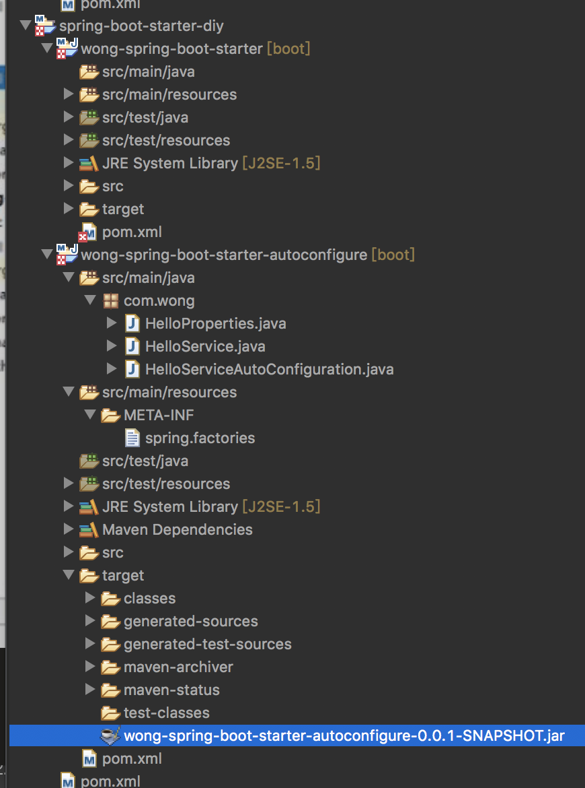

## 1. SpringBoot簡介

### 1.1 回顧什麼是Spring

Spring是一個開源框架，2003 年興起的一個輕量級的Java 開發框架，作者：Rod Johnson 。

Spring是為了解決企業級應用開發的複雜性而創建的，簡化開發。

> Spring是如何簡化Java開發的

為了降低Java開發的複雜性，Spring採用了以下4種關鍵策略：

1、基於POJO的輕量級和最小侵入性編程，所有東西都是bean；

2、通過IOC，依賴注入（DI）和麵向接口實現松耦合；

3、基於切面（AOP）和慣例進行聲明式編程；

4、通過切面和模版減少樣式代碼，RedisTemplate，xxxTemplate；

### 1.2 什麼是SpringBoot

學過javaweb的同學就知道，開發一個web應用，從最初開始接觸Servlet結合Tomcat, 跑出一個Hello Wolrld程序，是要經歷特別多的步驟；後來就用了框架Struts，再後來是SpringMVC，到了現在的SpringBoot，過一兩年又會有其他web框架出現；你們有經歷過框架不斷的演進，然後自己開發項目所有的技術也在不斷的變化、改造嗎？建議都可以去經歷一遍；
言歸正傳，什麼是SpringBoot呢，就是一個javaweb的開發框架，和SpringMVC類似，對比其他javaweb框架的好處，官方說是簡化開發，約定大於配置， you can "just run"，能迅速的開發web應用，幾行代碼開發一個http接口。
所有的技術框架的發展似乎都遵循了一條主線規律：從一個複雜應用場景衍生一種規範框架，人們只需要進行各種配置而不需要自己去實現它，這時候強大的配置功能成了優點；發展到一定程度之後，人們根據實際生產應用情況，選取其中實用功能和設計精華，重構出一些輕量級的框架；之後為了提高開發效率，嫌棄原先的各類配置過於麻煩，於是開始提倡“約定大於配置”，進而衍生出一些一站式的解決方案。
是的這就是Java企業級應用->J2EE->spring->springboot的過程。
隨著 Spring 不斷的發展，涉及的領域越來越多，項目整合開發需要配合各種各樣的文件，慢慢變得不那麼易用簡單，違背了最初的理念，甚至人稱配置地獄。 Spring Boot 正是在這樣的一個背景下被抽像出來的開發框架，目的為了讓大家更容易的使用 Spring 、更容易的集成各種常用的中間件、開源軟件；
Spring Boot 基於 Spring 開發，Spirng Boot 本身並不提供 Spring 框架的核心特性以及擴展功能，只是用於快速、敏捷地開發新一代基於 Spring 框架的應用程序。也就是說，它並不是用來替代 Spring 的解決方案，而是和 Spring 框架緊密結合用於提升 Spring 開發者體驗的工具。 Spring Boot 以約定大於配置的核心思想，默認幫我們進行了很多設置，多數 Spring Boot 應用只需要很少的 Spring 配置。同時它集成了大量常用的第三方庫配置（例如 Redis、MongoDB、Jpa、RabbitMQ、Quartz 等等），Spring Boot 應用中這些第三方庫幾乎可以零配置的開箱即用。
簡單來說就是SpringBoot其實不是什麼新的框架，它默認配置了很多框架的使用方式，就像maven整合了所有的jar包，spring boot整合了所有的框架 。
Spring Boot 出生名門，從一開始就站在一個比較高的起點，又經過這幾年的發展，生態足夠完善，Spring Boot 已經當之無愧成為 Java 領域最熱門的技術。

Spring Boot的主要優點：

- 為所有Spring開發者更快的入門

- 開箱即用，提供各種默認配置來簡化項目配置

- 內嵌式容器簡化Web項目

- 沒有冗餘代碼生成和XML配置的要求

- 真的很爽，我們快速去體驗開發個接口的感覺吧！


### 1.3 Hello，World

準備工作

我們將學習如何快速的創建一個Spring Boot應用，並且實現一個簡單的Http請求處理。通過這個例子對Spring Boot有一個初步的了解，並體驗其結構簡單、開發快速的特性。

我的環境準備：

- java version "1.8.0_181"

- Maven-3.6.1

- SpringBoot 2.x 最新版

開發工具：

- IDEA

#### 創建基礎項目說明

Spring官方提供了非常方便的工具讓我們快速構建應用

Spring Initializr：https://start.spring.io/

項目創建方式一：使用Spring Initializr 的 Web頁面創建項目

1、打開 https://start.spring.io/

2、填寫項目信息

3、點擊”Generate Project“按鈕生成項目；下載此項目

4、解壓項目包，並用IDEA以Maven項目導入，一路下一步即可，直到項目導入完畢。

5、如果是第一次使用，可能速度會比較慢，包比較多、需要耐心等待一切就緒。


項目創建方式二：使用 IDEA 直接創建項目

1、創建一個新項目

2、選擇spring initalizr ， 可以看到默認就是去官網的快速構建工具那裡實現

3、填寫項目信息

4、選擇初始化的組件（初學勾選 Web 即可）

5、填寫項目路徑

6、等待項目構建成功


項目結構分析：

通過上面步驟完成了基礎項目的創建。就會自動生成以下文件。

1、程序的主啟動類

2、一個 application.properties 配置文件

3、一個 測試類

4、一個 pom.xml


#### pom.xml 分析

打開pom.xml，看看Spring Boot項目的依賴：

```xml
<!-- 父依賴 -->
<parent>
    <groupId>org.springframework.boot</groupId>
    <artifactId>spring-boot-starter-parent</artifactId>
    <version>2.2.5.RELEASE</version>
    <relativePath/>
</parent>

<dependencies>
    <!-- web場景啟動器 -->
    <dependency>
        <groupId>org.springframework.boot</groupId>
        <artifactId>spring-boot-starter-web</artifactId>
    </dependency>
    <!-- springboot單元測試 -->
    <dependency>
        <groupId>org.springframework.boot</groupId>
        <artifactId>spring-boot-starter-test</artifactId>
        <scope>test</scope>
        <!-- 剔除依賴 -->
        <exclusions>
            <exclusion>
                <groupId>org.junit.vintage</groupId>
                <artifactId>junit-vintage-engine</artifactId>
            </exclusion>
        </exclusions>
    </dependency>
</dependencies>

<build>
    <plugins>
        <!-- 打包插件 -->
        <plugin>
            <groupId>org.springframework.boot</groupId>
            <artifactId>spring-boot-maven-plugin</artifactId>
        </plugin>
    </plugins>
</build>
```


> 編寫一個http接口

1、在主程序的同級目錄下，新建一個controller包，一定要在同級目錄下，否則識別不到


2、在包中新建一個HelloController類

```java
@RestController
public class helloController {
	
	//接口 : http://localhost:8080/hello
	@RequestMapping("/hello")
	public String hello() {
		//調用業務，接收前端的業務
		return "hello World";
	}
}
```

3、編寫完畢後，從主程序啟動項目，瀏覽器發起請求，看頁面返回；控制台輸出了 Tomcat 訪問的端口號！


簡單幾步，就完成了一個web接口的開發，SpringBoot就是這麼簡單。所以我們常用它來建立我們的微服務項目！


#### 將項目打成jar包，點擊 maven的 package

如果遇到以上錯誤，可以配置打包時 跳過項目運行測試用例

```xml
<!--
    在工作中,很多情況下我們打包是不想執行測試用例的
    可能是測試用例不完事,或是測試用例會影響數據庫數據
    跳過測試用例執
    -->
<plugin>
    <groupId>org.apache.maven.plugins</groupId>
    <artifactId>maven-surefire-plugin</artifactId>
    <configuration>
        <!--跳過項目運行測試用例-->
        <skipTests>true</skipTests>
    </configuration>
</plugin>
```

如果打包成功，則會在target目錄下生成一個 jar 包

打成了jar包後，就可以在任何地方運行了！ OK

#### ==  Eclipse匯出SpringBoot Jar ==

[使用SpringBoot打造記帳簿專案(二十一)打包Spring Boot專案為可執行的jar檔](https://matthung0807.blogspot.com/2019/02/springbootspring-bootjar.html)

`專案上點選滑鼠右鍵 -> Run As -> Run Configurations -> 在Maven Build上點滑鼠右鍵 -> New Configuration`新增專案的Maven執行設定。

- [Name]欄位輸入要執行的Maven動作名稱；
- [Base dirctory]欄位確認為`${project_loc:moneynote}`；
- [Goal]欄位輸入要執行的指令參數，輸入`clean package -Dmaven.test.skip=true`，意思是「清除之前建置的檔案，執行打包，並略過test （及test-compile）」；
- [Profile]欄位清空；
- 其餘欄位保持預設。


輸入完以上後，點選Apply，然後點選RunMaven就會開始將專案打包成可執行的jar。


輸入`-Dmaven.test.skip=true`參數來略過test的原因是，在之前的[使用SpringBoot打造記帳簿專案(二十)MyBatis測試](https://matthung0807.blogspot.com/2019/02/springbootmybatis_7.html)寫了一支`idv.matt.dao.MemberMapperTest`測試MyBatis Mapper存取資料庫的測試程式，若不略過test則打包時會執行此測試步驟，若資料庫無法連線或是測試邏輯不通過就會Build Fail導致無法完成打包。

但是`-Dmaven.test.skip=true`除了略過測試`test`的執行，也略過了測試程式編譯`test-compile`，因此若建置或打包過程中有輸入`-Dmaven.test.skip=true`參數，之後要在Eclipse中執行測試程式時，要執行`clean compile test-compile`重新編譯程式。

或是參數改用`clean package -DskipTests`，這樣打包時也不會執行`test`，但仍會執行執行測試程式的編譯`test-compile`。

或者直接把`idv.matt.dao.MemberMapperTest`先刪除，然後直接執行`clean package`。


打包結束後重新整理專案目錄，在專案根目錄下的`target`資料夾中可以看到`demo-0.0.1-SNAPSHOT.jar`，此即為`spring-boot-maven-plugin`重新打包的可執行jar檔；另外一個`demo-0.0.1-SNAPSHOT.jar.original`則為原本的jar檔。


接著開啟命令提示字元介面並移動到專案的`target`目錄

然後輸入下面指令執行：

```
java -jar demo-0.0.1-SNAPSHOT.jar
```

執行訊息如下：


等訊息停止後，開啟瀏覽器輸入 `http://localhost:8080/hello`，正確的話會返回hello moneynote的訊息畫面。

如要停止執行Spring Boot jar則直接在命令提示字元按Ctrl + C跳離。

> 彩蛋

如何更改啟動時顯示的字符拼成的字母，SpringBoot呢？也就是 banner 圖案；

只需一步：到項目下的 resources 目錄下新建一個banner.txt 即可。

圖案可以到：https://www.bootschool.net/ascii 這個網站生成，然後拷貝到文件中即可！

#### == Eclipse如何搭建springboot父子工程 == 

[Eclipse如何搭建父子工程](https://www.pianshen.com/article/11611218716/)

##### maven父工程

首先見一個maven父工程，右鍵--->new---->other---->Maven--->Maven Project 然後點擊next。


這樣父工程就創建好了，注意父工程的pom文件

修改pom.xml配置文件，添加SpringBoot的依賴配置與相關插件


```xml
<project xmlns="http://maven.apache.org/POM/4.0.0" xmlns:xsi="http://www.w3.org/2001/XMLSchema-instance" xsi:schemaLocation="http://maven.apache.org/POM/4.0.0 https://maven.apache.org/xsd/maven-4.0.0.xsd">
  <modelVersion>4.0.0</modelVersion>
  
  	<parent>
		<groupId>org.springframework.boot</groupId>
		<artifactId>spring-boot-starter-parent</artifactId>
		<version>2.3.1.RELEASE</version>
		<relativePath/> <!-- lookup parent from repository -->
	</parent>
  
  <groupId>com.wong</groupId>
  <artifactId>springboot_learning</artifactId>
  <version>0.0.1-SNAPSHOT</version>
  <packaging>pom</packaging>
  
  
  <dependencies>
		<dependency>
			<groupId>org.springframework.boot</groupId>
			<artifactId>spring-boot-starter-web</artifactId>
		</dependency>

		<dependency>
			<groupId>org.springframework.boot</groupId>
			<artifactId>spring-boot-starter-test</artifactId>
			<scope>test</scope>
			<exclusions>
				<exclusion>
					<groupId>org.junit.vintage</groupId>
					<artifactId>junit-vintage-engine</artifactId>
				</exclusion>
			</exclusions>
		</dependency>
	</dependencies>

	<build>
		<plugins>
			<plugin>
				<groupId>org.springframework.boot</groupId>
				<artifactId>spring-boot-maven-plugin</artifactId>
			</plugin>
		</plugins>
	</build>
	
	<modules>
		<module>springboot-01</module>
	</modules>
</project>
```

##### maven的子工程

接著創建一個maven的子工程：右鍵--->new --->Other --->Maven --->Maven Module 然後點擊 Next。





修改子項目pom.xml配置文件，添加SpringBoot的依賴配置與相關插件

```xml
<project xmlns="http://maven.apache.org/POM/4.0.0" xmlns:xsi="http://www.w3.org/2001/XMLSchema-instance" xsi:schemaLocation="http://maven.apache.org/POM/4.0.0 https://maven.apache.org/xsd/maven-4.0.0.xsd">
  <modelVersion>4.0.0</modelVersion>
  <parent>
    <groupId>com.wong</groupId>
    <artifactId>springboot_learning</artifactId>
    <version>0.0.1-SNAPSHOT</version>
  </parent>
  <artifactId>springboot-01</artifactId>
  
  <dependencies>
  	<dependency>
			<groupId>org.springframework.boot</groupId>
			<artifactId>spring-boot-starter-web</artifactId>
		</dependency>
  </dependencies>
</project>
```

[Spring Boot Configuration Processor 用途](https://matthung0807.blogspot.com/2020/09/spring-boot-configuration-processor.html)

##### test


Create 程序的主入口

```java
package com.wong;

import org.springframework.boot.SpringApplication;
import org.springframework.boot.autoconfigure.SpringBootApplication;
//its self is a spring component

//程序的主入口
@SpringBootApplication
public class DemoApplication {

	public static void main(String[] args) {
		SpringApplication.run(DemoApplication.class, args);
	}

}
```


```java
package com.wong.controller;

import org.springframework.web.bind.annotation.RequestMapping;
import org.springframework.web.bind.annotation.RestController;

@RestController
public class helloController {
	
	//接口 : http://localhost:8080/hello
	@RequestMapping("/hello")
	public String hello() {
		//調用業務，接收前端的業務
		return "hello World";
	}
}
```

run the program, and visit http://localhost:8080/hello


## 2. 運行原理探究


我們之前寫的HelloSpringBoot，到底是怎麼運行的呢，Maven項目，我們一般從pom.xml文件探究起；

### 2.1 pom.xml

#### 父依賴

其中它主要是依賴一個父項目，主要是管理項目的資源過濾及插件！

```xml
<parent>
    <groupId>org.springframework.boot</groupId>
    <artifactId>spring-boot-starter-parent</artifactId>
    <version>2.2.5.RELEASE</version>
    <relativePath/> <!-- lookup parent from repository -->
</parent>
```

點進去，發現還有一個父依賴

```xml
<parent>
    <groupId>org.springframework.boot</groupId>
    <artifactId>spring-boot-dependencies</artifactId>
    <version>2.2.5.RELEASE</version>
    <relativePath>../../spring-boot-dependencies</relativePath>
</parent>
```

這裡才是真正管理SpringBoot應用裡面所有依賴版本的地方，SpringBoot的版本控制中心；

以後我們導入依賴默認是不需要寫版本；但是如果導入的包沒有在依賴中管理著就需要手動配置版本了；


#### 啟動器 spring-boot-starter

```xml
<dependency>
    <groupId>org.springframework.boot</groupId>
    <artifactId>spring-boot-starter-web</artifactId>
</dependency>
```

springboot-boot-starter-xxx：就是spring-boot的場景啟動器

spring-boot-starter-web：幫我們導入了web模塊正常運行所依賴的組件；

SpringBoot將所有的功能場景都抽取出來，做成一個個的starter （啟動器），只需要在項目中引入這些starter即可，所有相關的依賴都會導入進來， 

我們要用什麼功能就導入什麼樣的場景啟動器即可；我們未來也可以自己自定義starter；

https://spring.io/projects/spring-boot#learn 

--> https://docs.spring.io/spring-boot/docs/current/reference/html/ 

--> [Using Spring Boot](https://docs.spring.io/spring-boot/docs/current/reference/html/using-spring-boot.html#using-boot) 

--> https://docs.spring.io/spring-boot/docs/current/reference/html/using-spring-boot.html#using-boot-starter


### 2.2 主啟動類

分析完了 pom.xml 來看看這個啟動類

> 默認的主啟動類

```java
// @SpringBootApplication 來標註一個主程序類
// 說明這是一個Spring Boot應用，啟動類下的所有資源被導入
@SpringBootApplication
public class SpringbootApplication {

   public static void main(String[] args) {
     //以為是啟動了一個方法，沒想到啟動了一個服務
      SpringApplication.run(SpringbootApplication.class, args);
   }

}
```

但是一個簡單的啟動類並不簡單！我們來分析一下@SpringBootApplication註解都乾了什麼

```java
// ...
@Target(ElementType.TYPE)
@Retention(RetentionPolicy.RUNTIME)
@Documented
@Inherited
@SpringBootConfiguration // <---
@EnableAutoConfiguration // <---
@ComponentScan(excludeFilters = { @Filter(type = FilterType.CUSTOM, classes = TypeExcludeFilter.class),
		@Filter(type = FilterType.CUSTOM, classes = AutoConfigurationExcludeFilter.class) }) // 掃描當前啟動類同級的包
public @interface SpringBootApplication {
  //...
}
```


```java
@SpringBootConfiguration // springboot的配置
	@Configuration // spring配置類
		@Component 說明這也是一個 spring 的組件
      
      
@EnableAutoConfiguration // 自動配置
  @AutoConfigurationPackage // 自動配置包
      @Import(AutoConfigurationPackages.Registrar.class) // 導入選擇器，自動配置包註冊（掃瞄完的包要註冊）
  @Import(AutoConfigurationImportSelector.class) // 自動配置導入選擇器 ： 選擇了什麼，點進去看
      
```

dig into AutoConfigurationImportSelector

```java
// ...
protected AutoConfigurationEntry getAutoConfigurationEntry(AnnotationMetadata annotationMetadata) {
  // 獲得候選的配置
  List<String> configurations = getCandidateConfigurations(annotationMetadata, attributes);
  // ...
}
 |
\|/
protected List<String> getCandidateConfigurations(AnnotationMetadata metadata, AnnotationAttributes attributes) {
   // 獲取的東西
   // getSpringFactoriesLoaderFactoryClass(),
	 // getBeanClassLoader()
   // 獲取手段
   // SpringFactoriesLoader.loadFactoryNames()
  List<String> configurations = SpringFactoriesLoader.loadFactoryNames(
    getSpringFactoriesLoaderFactoryClass(),                                                    		 getBeanClassLoader());
  Assert.notEmpty(configurations, "No auto configuration classes found in META-INF/spring.factories. If you "
                  + "are using a custom packaging, make sure that file is correct.");
  return configurations;
}
```

獲取的東西` getSpringFactoriesLoaderFactoryClass(), getBeanClassLoader()`

```java
     |
    \|/
    protected Class<?> getSpringFactoriesLoaderFactoryClass() {
       // 獲取標注了EnableAutoConfiguration的類
      return EnableAutoConfiguration.class;
    }

    protected ClassLoader getBeanClassLoader() {
      return this.beanClassLoader;
    }
     |
    \|/
		private ClassLoader beanClassLoader;
```

獲取手段 `SpringFactoriesLoader.loadFactoryNames()`

```java
public static List<String> loadFactoryNames(Class<?> factoryType, @Nullable ClassLoader classLoader) {
		String factoryTypeName = factoryType.getName();
		return loadSpringFactories(classLoader).getOrDefault(factoryTypeName, Collections.emptyList());
	}
     |
    \|/
   	private static Map<String, List<String>> loadSpringFactories(@Nullable ClassLoader classLoader) {
		MultiValueMap<String, String> result = cache.get(classLoader);
		if (result != null) {
			return result;
		}

		try {
      // public static final String FACTORIES_RESOURCE_LOCATION = "META-INF/spring.factories";
      // 從哪裡獲取資源
			Enumeration<URL> urls = (classLoader != null ?
					classLoader.getResources(FACTORIES_RESOURCE_LOCATION) :
					ClassLoader.getSystemResources(FACTORIES_RESOURCE_LOCATION));
			result = new LinkedMultiValueMap<>();
      //將讀取到的資源遍歷，封裝成為一個Properties
			while (urls.hasMoreElements()) {
				URL url = urls.nextElement();
				UrlResource resource = new UrlResource(url);
        // 所有資源加載到配置類中
				Properties properties = PropertiesLoaderUtils.loadProperties(resource);
				for (Map.Entry<?, ?> entry : properties.entrySet()) {
					String factoryTypeName = ((String) entry.getKey()).trim();
					for (String factoryImplementationName : StringUtils.commaDelimitedListToStringArray((String) entry.getValue())) {
						result.add(factoryTypeName, factoryImplementationName.trim());
					}
				}
			}
			cache.put(classLoader, result);
			return result;
		}
		catch (IOException ex) {
			throw new IllegalArgumentException("Unable to load factories from location [" +
					FACTORIES_RESOURCE_LOCATION + "]", ex);
		}
	}
```

SpringBoot所有自動配置都是在啟動時掃描並加載，所有自動配置都在spring.factories配置文件，但不一定會生效（@ConditionalOnXXX，如果這裡面的條件都滿足，才會生效），只要導入對應的start，就有對應的啟動類，有了啟動類，我們的自動配置類就會生效，然後配置成功。

#### deatil explain

> @SpringBootApplication

作用：標註在某個類上說明這個類是SpringBoot的主配置類 ， SpringBoot就應該運行這個類的main方法來啟動SpringBoot應用；

進入這個註解：可以看到上面還有很多其他註解！

```java
@SpringBootConfiguration
@EnableAutoConfiguration
@ComponentScan(
    excludeFilters = {@Filter(
    type = FilterType.CUSTOM,
    classes = {TypeExcludeFilter.class}
), @Filter(
    type = FilterType.CUSTOM,
    classes = {AutoConfigurationExcludeFilter.class}
)}
)
public @interface SpringBootApplication {
    // ......
}
```


> @ComponentScan

這個註解在Spring中很重要 ,它對應XML配置中的元素。

作用：自動掃描並加載符合條件的組件或者bean ， 將這個bean定義加載到IOC容器中


> @SpringBootConfiguration

作用：SpringBoot的配置類 ，標註在某個類上 ， 表示這是一個SpringBoot的配置類；

我們繼續進去這個註解查看

```java
// 點進去得到下面的 @Component
@Configuration
public @interface SpringBootConfiguration {}

@Component
public @interface Configuration {}
```

這裡的 @Configuration，說明這是一個配置類 ，配置類就是對應Spring的xml 配置文件；

裡面的 @Component 這就說明，啟動類本身也是Spring中的一個組件而已，負責啟動應用！

我們回到 SpringBootApplication 註解中繼續看。


> @EnableAutoConfiguration

@EnableAutoConfiguration ：開啟自動配置功能

以前我們需要自己配置的東西，而現在SpringBoot可以自動幫我們配置 ；@EnableAutoConfiguration告訴SpringBoot開啟自動配置功能，這樣自動配置才能生效；

點進註解接續查看：

@AutoConfigurationPackage ：自動配置包

```java
@Import({Registrar.class})
public @interface AutoConfigurationPackage {
}
```

@import ：Spring底層註解@import ， 給容器中導入一個組件

Registrar.class 作用：將主啟動類的所在包及包下面所有子包裡面的所有組件掃描到Spring容器 ；

這個分析完了，退到上一步，繼續看

@Import({AutoConfigurationImportSelector.class}) ：給容器導入組件 ；

AutoConfigurationImportSelector ：自動配置導入選擇器，那麼它會導入哪些組件的選擇器呢？我們點擊去這個類看源碼：

1、這個類中有一個這樣的方法 (line 117)

```java
// 獲得候選的配置
protected List<String> getCandidateConfigurations(AnnotationMetadata metadata, AnnotationAttributes attributes) {
    //這裡的getSpringFactoriesLoaderFactoryClass（）方法
    //返回的就是我們最開始看的啟動自動導入配置文件的註解類；EnableAutoConfiguration
    List<String> configurations = SpringFactoriesLoader.loadFactoryNames(this.getSpringFactoriesLoaderFactoryClass(), this.getBeanClassLoader());
    Assert.notEmpty(configurations, "No auto configuration classes found in META-INF/spring.factories. If you are using a custom packaging, make sure that file is correct.");
    return configurations;
}
```

2、這個方法又調用了 SpringFactoriesLoader 類的靜態方法！我們進入SpringFactoriesLoader類loadFactoryNames() 方法

```java
public static List<String> loadFactoryNames(Class<?> factoryClass, @Nullable ClassLoader classLoader) {
    String factoryClassName = factoryClass.getName();
    //這裡它又調用了 loadSpringFactories 方法
    return (List)loadSpringFactories(classLoader).getOrDefault(factoryClassName, Collections.emptyList());
}
```

3、我們繼續點擊查看 loadSpringFactories 方法

```java
private static Map<String, List<String>> loadSpringFactories(@Nullable ClassLoader classLoader) {
  //獲得classLoader ， 我們返回可以看到這裡得到的就是EnableAutoConfiguration標註的類本身
  MultiValueMap<String, String> result = (MultiValueMap)cache.get(classLoader);
  if (result != null) {
    return result;
  } else {
    try {
      //去獲取一個資源 "META-INF/spring.factories"
      Enumeration<URL> urls = classLoader != null ? classLoader.getResources("META-INF/spring.factories") : ClassLoader.getSystemResources("META-INF/spring.factories");
      LinkedMultiValueMap result = new LinkedMultiValueMap();
      //將讀取到的資源遍歷，封裝成為一個Properties
      while(urls.hasMoreElements()) {
        URL url = (URL)urls.nextElement();
        UrlResource resource = new UrlResource(url);
        // 所有資源加載到配置類中
        Properties properties = PropertiesLoaderUtils.loadProperties(resource);
        Iterator var6 = properties.entrySet().iterator();

        while(var6.hasNext()) {
          Entry<?, ?> entry = (Entry)var6.next();
          String factoryClassName = ((String)entry.getKey()).trim();
          String[] var9 = StringUtils.commaDelimitedListToStringArray((String)entry.getValue());
          int var10 = var9.length;

          for(int var11 = 0; var11 < var10; ++var11) {
            String factoryName = var9[var11];
            result.add(factoryClassName, factoryName.trim());
          }
        }
      }

      cache.put(classLoader, result);
      return result;
    } catch (IOException var13) {
      throw new IllegalArgumentException("Unable to load factories from location [META-INF/spring.factories]", var13);
    }
  }
}
```
4、發現一個多次出現的文件：spring.factories，全局搜索它


> spring.factories

我們根據源頭打開spring.factories ， 看到了很多自動配置的文件；這就是自動配置根源所在！

`spring-boot-autoconfigure的jar包中META-INF/spring.factories`

META-INF/spring.factories


> WebMvcAutoConfiguration

我們在上面的自動配置類隨便找一個打開看看，比如 ：WebMvcAutoConfiguration


可以看到這些一個個的都是JavaConfig配置類，而且都注入了一些Bean，可以找一些自己認識的類

所以，自動配置真正實現是從classpath中搜尋所有的META-INF/spring.factories配置文件，並將其中對應的org.springframework.boot.autoconfigure. 包下的配置項，通過反射實例化為對應標註了@Configuration的JavaConfig形式的IOC容器配置類， 然後將這些都匯總成為一個實例並加載到IOC容器中。

SpringBoot所有自動配置都是在啟動時掃描並加載，所有自動配置都在spring.factories配置文件，但不一定會生效（@ConditionalOnXXX，如果這裡面的條件都滿足，才會生效），只要導入對應的start，就有對應的啟動類，有了啟動類，我們的自動配置類就會生效，然後配置成功。。


結論：

1. SpringBoot在啟動的時候從類路徑下的META-INF/spring.factories中獲取EnableAutoConfiguration指定的值
2. 將這些值作為自動配置類導入容器 ， 自動配置類就生效 ， 幫我們進行自動配置工作；
3. 整個J2EE的整體解決方案和自動配置都在spring-boot-autoconfigure的jar包中；
4. 它會把(META-INF/spring.factories中)所有需要導入的組件，以類名的方式返回，這些組件就會被添加到容器中。
5. 它會給容器中導入非常多的自動配置類 xxxAutoConfiguration的文件(@Bean）, 就是給容器中導入這個場景需要的所有組件2Configuration, JavaConfig ， 並配置好這些組件 ；
6. 有了自動配置類 ， 免去了我們手動編寫配置注入功能組件等的工作；

現在大家應該大概的了解了下，SpringBoot的運行原理，後面我們還會深化一次！


### 2.3 SpringApplication

> 不簡單的方法

我最初以為就是運行了一個main方法，沒想到卻開啟了一個服務；

```java
@SpringBootApplication
public class SpringbootApplication {
    public static void main(String[] args) {
        SpringApplication.run(SpringbootApplication.class, args);
    }
}
```

SpringApplication.run分析

分析該方法主要分兩部分，一部分是SpringApplication的實例化，二是run方法的執行；

> SpringApplication

這個類主要做了以下四件事情：

1、`推斷應用的類型是普通的項目還是Web項目`

2、查找並加載所有可用初始化器 ， 設置到initializers屬性中

3、找出所有的應用程序監聽器，設置到listeners屬性中

4、推斷並設置main方法的定義類，找到運行的主類

查看構造器：

```java
public SpringApplication(ResourceLoader resourceLoader, Class... primarySources) {
    // ......
    this.webApplicationType = WebApplicationType.deduceFromClasspath();
    this.setInitializers(this.getSpringFactoriesInstances();
    this.setListeners(this.getSpringFactoriesInstances(ApplicationListener.class));
    this.mainApplicationClass = this.deduceMainApplicationClass();
}
```


run方法流程分析


跟著源碼和這幅圖就可以一探究竟了！

## 3. yaml語法學習

### 3.1 配置文件

[springboot Externalized Configuration](https://docs.spring.io/spring-boot/docs/current/reference/html/spring-boot-features.html#boot-features-external-config)


SpringBoot使用一個全局的配置文件 ， 配置文件名稱是固定的

application.properties

- 語法結構 ：key=value

application.yml

- 語法結構 ：key：空格 value

配置文件的作用 ：修改SpringBoot自動配置的默認值，因為SpringBoot在底層都給我們自動配置好了；

比如我們可以在配置文件中修改Tomcat 默認啟動的端口號！測試一下！

```java
server.port=8081
```


### 3.2 yaml概述

YAML是 "YAML Ain't a Markup Language" （YAML不是一種標記語言）的遞歸縮寫。在開發的這種語言時，YAML 的意思其實是："Yet Another Markup Language"（仍是一種標記語言）

`這種語言以數據作為中心，而不是以標記語言為重點！`

以前的配置文件，大多數都是使用xml來配置；比如一個簡單的端口配置，我們來對比下yaml和xml

傳統xml配置：

```xml
<server>
    <port>8081<port>
</server>
```

yaml配置：

```yaml
server：
  prot: 8080
```

yaml基礎語法

說明：語法要求嚴格！

1、空格不能省略

2、以縮進來控制層級關係，只要是左邊對齊的一列數據都是同一個層級的。

3、屬性和值的大小寫都是十分敏感的。


> 字面量：普通的值 [ 數字，布爾值，字符串 ]

字面量直接寫在後面就可以 ， 字符串默認不用加上雙引號或者單引號；

```yaml
k: v
```

注意：

- “ ” 雙引號，不會轉義字符串裡面的特殊字符 ， 特殊字符會作為本身想表示的意思；

  比如 ：name: "kuang \n shen" 輸出 ：kuang 換行 shen

- '' 單引號，會轉義特殊字符 ， 特殊字符最終會變成和普通字符一樣輸出

  比如 ：name: ‘kuang \n shen’ 輸出 ：kuang \n shen


> 對象、Map（鍵值對）

```yaml
#對象、Map格式
k:
    v1:
    v2:
```

在下一行來寫對象的屬性和值得關係，注意縮進；比如：

```yaml
student:
    name: qinjiang
    age: 3
```

行內寫法

```yaml
student: {name: qinjiang,age: 3}
```


> 數組（ List、set ）

用 - 值表示數組中的一個元素,比如：

```yaml
pets:
 - cat
 - dog
 - pig
```

行內寫法

```yaml
pets: [cat,dog,pig]
```

修改SpringBoot的默認端口號

配置文件中添加，端口號的參數，就可以切換端口；

```yaml
server:
  port: 8082
```


### 3.3 注入配置文件

`yaml文件更強大的地方在於，他可以給我們的實體類直接注入匹配值！`

#### yaml注入配置文件

1、在springboot項目中的resources目錄下新建一個文件 application.yml

2、編寫一個實體類 Dog；

````java
package com.kuang.springboot.pojo;

@Component //註冊bean到容器中
public class Dog {
    private String name;
    private Integer age;
    //有參無參構造、get、set方法、toString()方法
}
````

3、思考，我們原來是如何給bean注入屬性值的！ @Value，給狗狗類測試一下：

```java
@Component //註冊bean
public class Dog {
    @Value("阿黃")
    private String name;
    @Value("18")
    private Integer age;
}
```

4、在SpringBoot的測試類下注入狗狗輸出一下；

```java
@SpringBootTest
class DemoApplicationTests {

    @Autowired //將狗狗自動注入進來
    Dog dog;
    
    @Test
    public void contextLoads() {
        System.out.println(dog); //打印看下狗狗對象
    }

}

console: 
```

結果成功輸出，@Value注入成功，這是我們原來的辦法對吧。

圖片

5、我們在編寫一個複雜一點的實體類：Person 類

```java
@Component //註冊bean到容器中
public class Person {
    private String name;
    private Integer age;
    private Boolean happy;
    private Date birth;
    private Map<String,Object> maps;
    private List<Object> lists;
    private Dog dog;
   
    //有參無參構造、get、set方法、toString()方法
}
```

6、我們來使用yaml配置的方式進行注入，大家寫的時候注意區別和優勢，我們編寫一個yaml配置！

```yaml
person:
  name: wong
  age: 33
  happy: false
  birth: 2000/01/01
  maps: {k1: v1,k2: v2}
  lists:
    - code
    - girl
    - music
  dog:
    name: atom
    age: 3
```


7、我們剛才已經把person這個對象的所有值都寫好了，我們現在來注入到我們的類中！

```java
/*
@ConfigurationProperties作用：
將配置文件中配置的每一個屬性的值，映射到這個組件中；
告訴SpringBoot將本類中的所有屬性和配置文件中相關的配置進行綁定
參數 prefix = “person” : 將配置文件中的person下面的所有屬性一一對應
*/
@Component //註冊bean
@ConfigurationProperties(prefix = "person")
public class Person {
    private String name;
    private Integer age;
    private Boolean happy;
    private Date birth;
    private Map<String,Object> maps;
    private List<Object> lists;
    private Dog dog;
}
```

8、IDEA 提示，springboot配置註解處理器沒有找到，讓我們看文檔，我們可以查看文檔，找到一個依賴！

```xml
<!-- 導入配置文件處理器，配置文件進行綁定就會有提示，需要重啟 -->
<dependency>
  <groupId>org.springframework.boot</groupId>
  <artifactId>spring-boot-configuration-processor</artifactId>
  <optional>true</optional>
</dependency>
```

9、確認以上配置都OK之後，我們去測試類中測試一下：

```java
@SpringBootTest
class DemoApplicationTests {

    @Autowired
    Person person; //將person自動注入進來
    
    @Test
    public void contextLoads() {
        System.out.println(person); //打印person信息
    }
}
console: 
Person [name=wong, age=33, happy=false, 
        birth=Sat Jan 01 00:00:00 CST 2000, 
        maps={k1=v1, k2=v2}, lists=[code, girl, music], 
        dog=Dog [name=atom, age=3]]
```

結果：所有值全部注入成功！

yaml配置注入到實體類完全OK！

課堂測試：

1、將配置文件的key 值 和 屬性的值設置為不一樣，則結果輸出為null，注入失敗

2、在配置一個person2，然後將 @ConfigurationProperties(prefix = "person2") 指向我們的person2；


#### 加載指定的properties配置文件

@PropertySource ：加載指定的配置文件；

@configurationProperties：默認從全局配置文件中獲取值；

1、我們去在resources目錄下新建一個person.properties文件

```
name=wongproperties
```

2、然後在我們的代碼中指定加載person.properties文件

```java
// javaConfig綁定配置文件的值，可以採取這些方式
// load 指定配置文件
@PropertySource(value = "classpath:person.properties")
@Component //註冊bean
public class Person {
	// SPEL表達是取出配置文件中的值
	@Value("${name}")
	private String name;
    ......
}
```

3、再次輸出測試一下：指定配置文件綁定成功！

```java
Person [name=wongproperties, 
        age=null, 
        happy=null, 
        birth=null, 
        maps=null, 
        lists=null, 
        dog=null]
```


#### 配置文件佔位符

配置文件還可以編寫佔位符生成隨機數

```yaml
person:
  name: wong${random.uuid} # 隨機uuid
  age: ${random.int} # 隨機int
  happy: false
  birth: 2000/01/01
  maps: {k1: v1,k2: v2}
  hello: hehehe # if hello not exit --> hehehe_旺財
  lists:
    - code
    - girl
    - music
  dog:
    name: ${person.hello:other}_旺財 # if hello not exit --> other_旺財
    age: 3
```


```java
Person [name=wong36da2d73-5495-43e8-aa09-6616308ebb43, 
        age=224561743, 
        happy=false, 
        birth=Sat Jan 01 00:00:00 CST 2000, 
        maps={k1=v1, k2=v2}, 
        lists=[code, girl, music], 
        dog=Dog [name=hehehe_旺財, age=3]]
```


#### 回顧properties配置

我們上面採用的yaml方法都是最簡單的方式，開發中最常用的；也是springboot所推薦的！那我們來嘮嘮其他的實現方式，道理都是相同的；寫還是那樣寫；配置文件除了yml還有我們之前常用的properties ， 我們沒有講，我們來嘮嘮！

【注意】properties配置文件在寫中文的時候，會有亂碼 ， 我們需要去IDEA中設置編碼格式為UTF-8；

settings-->FileEncodings 中配置；

測試步驟：

1、新建一個實體類User

```java
@Component //註冊bean
public class User {
    private String name;
    private int age;
    private String sex;
}
```

2、編輯配置文件 user.properties

```java
user1.name=ㄔㄟㄟatom
user1.age=18
user1.sex=男
```

3、我們在User類上使用@Value來進行注入！

```java
@Component //註冊bean
@PropertySource(value = "classpath:user.properties")
public class User {
    //直接使用@value
    @Value("${user.name}") //從配置文件中取值
    private String name;
    @Value("#{9*2}") // #{SPEL} Spring表達式
    private int age;
    @Value("男") // 字面量
    private String sex;
}
```

4、Springboot測試

```java
@SpringBootTest
class DemoApplicationTests {

    @Autowired
    User user;
    
    @Test
    public void contextLoads() {
        System.out.println(user);
    }

}
```

結果正常輸出：


### 3.4 對比小結

@Value這個使用起來並不友好！我們需要為每個屬性單獨註解賦值，比較麻煩；我們來看個功能對比圖


1、@ConfigurationProperties只需要寫一次即可 ， @Value則需要每個字段都添加

2、鬆散綁定：這個什麼意思呢? 比如我的yml中寫的last-name，這個和lastName是一樣的， - 後面跟著的字母默認是大寫的。這就是鬆散綁定。可以測試一下

3、JSR303數據校驗 ， 這個就是我們可以在字段是增加一層過濾器驗證 ， 可以保證數據的合法性

[JSR303数据校验](https://www.jianshu.com/p/d2ddd856cce2)

[Differences in @Valid and @Validated Annotations in Spring](https://www.baeldung.com/spring-valid-vs-validated)

4、複雜類型封裝，yml中可以封裝對象 ， 使用value就不支持


結論：

- 配置yml和配置properties都可以獲取到值 ， 強烈推薦 yml；

- 如果我們在某個業務中，只需要獲取配置文件中的某個值，可以使用一下 @value；

- 如果說，我們專門編寫了一個JavaBean來和配置文件進行一一映射，就直接@configurationProperties，不要猶豫！


## 4 JSR303數據校驗

### 4.1 如何使用

Springboot中可以用@validated來校驗數據，如果數據異常則會統一拋出異常，方便異常中心統一處理。我們這裡來寫個註解讓我們的name只能支持Email格式；

```java
@Component //註冊bean
@ConfigurationProperties(prefix = "person")
@Validated //數據校驗
public class Person {

    @Email(message="郵箱格式錯誤") //name必須是郵箱格式
    private String name;

}
```

運行結果 ：default message [不是一個合法的電子郵件地址];

使用數據校驗，可以保證數據的正確性；

#### 常見參數

```java
@NotNull(message="名字不能為空")
private String userName;
@Max(value=120,message="年齡最大不能查過120")
private int age;
@Email(message="郵箱格式錯誤")
private String email;

空檢查
@Null 驗證對像是否為null
@NotNull 驗證對像是否不為null, 無法查檢長度為0的字符串
@NotBlank 檢查約束字符串是不是Null還有被Trim的長度是否大於0,只對字符串,且會去掉前後空格.
@NotEmpty 檢查約束元素是否為NULL或者是EMPTY.
    
Booelan檢查
@AssertTrue 驗證 Boolean 對像是否為 true
@AssertFalse 驗證 Boolean 對像是否為 false
    
長度檢查
@Size(min=, max=) 驗證對象（Array,Collection,Map,String）長度是否在給定的範圍之內
@Length(min=, max=) string is between min and max included.

日期檢查
@Past 驗證 Date 和 Calendar 對像是否在當前時間之前
@Future 驗證 Date 和 Calendar 對像是否在當前時間之後
@Pattern 驗證 String 對像是否符合正則表達式的規則

.......等等
除此以外，我們還可以自定義一些數據校驗規則
```


### 4.2 多環境切換

profile是Spring對不同環境提供不同配置功能的支持，可以通過激活不同的環境版本，實現快速切換環境；

>  多配置文件

我們在主配置文件編寫的時候，文件名可以是 application-{profile}.properties/yml , 用來指定多個環境版本；

例如：

- application-test.properties 代表測試環境配置

- application-dev.properties 代表開發環境配置

但是Springboot並不會直接啟動這些配置文件，它默認使用application.properties主配置文件；

我們需要通過一個配置來選擇需要激活的環境：

```properties
#比如在配置文件中指定使用dev環境，我們可以通過設置不同的端口號進行測試；
#我們啟動SpringBoot，就可以看到已經切換到dev下的配置了；
spring.profiles.active=dev
```

> yaml的多文檔塊

和properties配置文件中一樣，但是使用yml去實現不需要創建多個配置文件，更加方便了 !

利用---`分割不同文檔塊

```yml
server:
  port: 8081
#選擇要激活那個環境塊
spring:
  profiles:
    active: prod

---

server:
  port: 8083
spring:
  profiles: dev #配置環境的名稱


---

server:
  port: 8084
spring:
  profiles: prod #配置環境的名稱
```

注意：如果yml和properties同時都配置了端口，並且沒有激活其他環境 ， 默認會使用properties配置文件的！

> 配置文件加載位置

外部加載配置文件的方式十分多，我們選擇最常用的即可，在開發的資源文件中進行配置！

官方外部配置文件說明參考文檔


springboot 啟動會掃描以下位置的application.properties或者application.yml文件作為Spring boot的默認配置文件：

```
優先級1：項目路徑下的config文件夾配置文件
優先級2：項目路徑下配置文件
優先級3：資源路徑下的config文件夾配置文件
優先級4：資源路徑下配置文件
```


優先級由高到底，高優先級的配置會覆蓋低優先級的配置；

SpringBoot會從這四個位置全部加載主配置文件；互補配置；

我們在最低級的配置文件中設置一個項目訪問路徑的配置來測試互補問題；

```
#配置項目的訪問路徑
server.servlet.context-path=/wong
```


```yml
# 或在不同位置的配置文件，配置不同端口，測試啟動時優先使用哪個配置文件端口號
server:
  port: 8081
  
server:
  port: 8082
  
server:
  port: 8083
  
server:
  port: 8084
```


> 拓展，運維小技巧

指定位置加載配置文件

我們還可以通過spring.config.location來改變默認的配置文件位置

項目打包好以後，我們可以使用命令行參數的形式，啟動項目的時候來指定配置文件的新位置；這種情況，一般是後期運維做的多，相同配置，外部指定的配置文件優先級最高

```
java -jar spring-boot-config.jar --spring.config.location=F:/application.properties
```


## 5 自動配置原理


配置文件到底能寫什麼？怎麼寫？

SpringBoot官方文檔中有大量的配置，我們無法全部記住

`spring-boot-autoconfigure的jar包中META-INF/spring.factories`

[Common Application properties](https://docs.spring.io/spring-boot/docs/current/reference/html/appendix-application-properties.html#common-application-properties-core)

### 5.1 分析自動配置原理

我們以HttpEncodingAutoConfiguration（Http編碼自動配置）為例解釋自動配置原理；

```java
//表示這是一個配置類，和以前編寫的配置文件一樣，也可以給容器中添加組件；
@Configuration

//啟動指定類的ConfigurationProperties功能；
  //進入這個HttpProperties查看，將配置文件中對應的值和HttpProperties綁定起來；
  //並把HttpProperties加入到ioc容器中
@EnableConfigurationProperties({HttpProperties.class})

//Spring底層@Conditional註解
  //根據不同的條件判斷，如果滿足指定的條件，整個配置類裡面的配置就會生效；
  //這裡的意思就是判斷當前應用是否是web應用，如果是，當前配置類生效
@ConditionalOnWebApplication(
    type = Type.SERVLET
)

//判斷當前項目有沒有這個類CharacterEncodingFilter；SpringMVC中進行亂碼解決的過濾器；
@ConditionalOnClass({CharacterEncodingFilter.class})

//判斷配置文件中是否存在某個配置：spring.http.encoding.enabled；
  //如果不存在，判斷也是成立的
  //即使我們配置文件中不配置pring.http.encoding.enabled=true，也是默認生效的；
@ConditionalOnProperty(
    prefix = "spring.http.encoding",
    value = {"enabled"},
    matchIfMissing = true
)

public class HttpEncodingAutoConfiguration {
    //他已經和SpringBoot的配置文件映射了
    private final Encoding properties;
    //只有一個有參構造器的情況下，參數的值就會從容器中拿
    public HttpEncodingAutoConfiguration(HttpProperties properties) {
        this.properties = properties.getEncoding();
    }
    

    //給容器中添加一個組件，這個組件的某些值需要從properties中獲取
    @Bean
    @ConditionalOnMissingBean //判斷容器沒有這個組件？
    public CharacterEncodingFilter characterEncodingFilter() {
        CharacterEncodingFilter filter = new OrderedCharacterEncodingFilter();
        filter.setEncoding(this.properties.getCharset().name());
        filter.setForceRequestEncoding(this.properties.shouldForce(org.springframework.boot.autoconfigure.http.HttpProperties.Encoding.Type.REQUEST));
        filter.setForceResponseEncoding(this.properties.shouldForce(org.springframework.boot.autoconfigure.http.HttpProperties.Encoding.Type.RESPONSE));
        return filter;
    }
    //。 。 。 。 。 。 。

}
```

一句話總結 ：根據當前不同的條件判斷，決定這個配置類是否生效！

一但這個配置類生效；這個配置類就會給容器中添加各種組件；這些組件的屬性是從對應的properties類中獲取的，這些類裡面的每一個屬性又是和配置文件綁定的；

所有在配置文件中能配置的屬性都是在xxxxProperties類中封裝著；

`HttpEncodingAutoConfiguration.class`

```java
@EnableConfigurationProperties({HttpProperties.class})
...
public class HttpEncodingAutoConfiguration {
  ...
}
```

配置文件能配置什麼就可以參照某個功能對應的這個屬性類

`HttpProperties.class`

```java
//從配置文件中獲取指定的值和bean的屬性進行綁定
@ConfigurationProperties(prefix = "spring.http")
public class HttpProperties {
    // .....
}
```

我們去配置文件裡面試試前綴，看提示！




這就是自動裝配的原理！


### 5.2 精髓

1、SpringBoot啟動會加載大量的自動配置類

2、我們看我們需要的功能有沒有在SpringBoot默認寫好的自動配置類當中；

3、我們再來看這個自動配置類中到底配置了哪些組件；（只要我們要用的組件存在在其中，我們就不需要再手動配置了）

4、給容器中自動配置類添加組件的時候，會從properties類中獲取某些屬性。我們只需要在配置文件中指定這些屬性的值即可；

xxxxAutoConfigurartion：自動配置類；給容器中添加組件

xxxxProperties : 封裝配置文件中相關屬性，和配置文件(.yml/ .properties)綁定，通過配置文件，我們就可以使用自定義的配置；


### 5.3 了解：@Conditional

了解完自動裝配的原理後，我們來關註一個細節問題，自動配置類必須在一定的條件下才能生效；

@Conditional派生註解（Spring註解版原生的@Conditional作用）

作用：必須是@Conditional指定的條件成立，才給容器中添加組件，配置配裡面的所有內容才生效；


那麼多的自動配置類，必須在一定的條件下才能生效；也就是說，我們加載了這麼多的配置類，但不是所有的都生效了。

我們怎麼知道哪些自動配置類生效？

我們可以通過啟用 debug=true屬性；來讓控制台打印自動配置報告，這樣我們就可以很方便的知道哪些自動配置類生效；

```
#開啟springboot的調試類 .properties
debug=true

#開啟springboot的調試類 .yml
debug: true
```

Positive matches:（自動配置類啟用的：正匹配）

Negative matches:（沒有啟動，沒有匹配成功的自動配置類：負匹配）

Unconditional classes: （沒有條件的類），想要該類生效，導入對應的啟動器 spring-boot-starter＝導入對應依賴的類

【演示：查看輸出的日誌】

```
============================
CONDITIONS EVALUATION REPORT
============================

Positive matches:
-----------------

   AopAutoConfiguration matched:
      - @ConditionalOnProperty (spring.aop.auto=true) matched (OnPropertyCondition)

   AopAutoConfiguration.ClassProxyingConfiguration matched:
      - @ConditionalOnMissingClass did not find unwanted class 'org.aspectj.weaver.Advice' (OnClassCondition)
      - @ConditionalOnProperty (spring.aop.proxy-target-class=true) matched (OnPropertyCondition)
...


Negative matches:
-----------------

   ActiveMQAutoConfiguration:
      Did not match:
         - @ConditionalOnClass did not find required class 'javax.jms.ConnectionFactory' (OnClassCondition)

   AopAutoConfiguration.AspectJAutoProxyingConfiguration:
      Did not match:
         - @ConditionalOnClass did not find required class 'org.aspectj.weaver.Advice' (OnClassCondition)
...

Exclusions:
-----------
    None

Unconditional classes:
----------------------  

org.springframework.boot.autoconfigure.context.ConfigurationPropertiesAutoConfiguration
org.springframework.boot.autoconfigure.context.LifecycleAutoConfiguration
...
```

掌握吸收理解原理，即可以不變應萬變！


## 6 自定義Starter

> In Eclipse IDE, you can type `CTRL + SHIFT + T` in Windows or *nix or `Command + SHIFT + T` in Mac OSX to prompt an **Open Type** dialog box to find details about a specified Java class.


我們分析完畢了源碼以及自動裝配的過程，我們可以嘗試自定義一個啟動器來玩玩！

### 6.1  說明

啟動器模塊是一個 空 jar 文件，僅提供輔助性依賴管理，這些依賴可能用於自動裝配或者其他類庫；

> 命名歸約：

官方命名：

- 前綴：spring-boot-starter-xxx

- 比如：spring-boot-starter-web....

自定義命名：

- xxx-spring-boot-starter

- 比如：mybatis-spring-boot-starter


### 6.2 編寫啟動器

1、在IDEA中新建一個空項目 spring-boot-starter-diy

2、新建一個普通Maven模塊：spring-boot-starter

3、新建一個Springboot模塊：spring-boot-starter-autoconfigure

4、點擊apply即可，基本結構

Eclipse : you can just create two project

One produce spring-boot-starter-autoconfigure.jar --> self-defined starter

One  produce spring-boot-starter --> user 

```
spring-boot-starter-diy
	|-- spring-boot-starter
	|-- spring-boot-starter-autoconfigure
```

spring-boot-starter-diy/pom.xml

```xml
<project xmlns="http://maven.apache.org/POM/4.0.0"
	xmlns:xsi="http://www.w3.org/2001/XMLSchema-instance"
	xsi:schemaLocation="http://maven.apache.org/POM/4.0.0 https://maven.apache.org/xsd/maven-4.0.0.xsd">
	<modelVersion>4.0.0</modelVersion>

	<!-- 父依賴 -->
	<parent>
		<groupId>org.springframework.boot</groupId>
		<artifactId>spring-boot-starter-parent</artifactId>
		<version>2.2.5.RELEASE</version>
		<relativePath />
	</parent>

	<groupId>com.wong</groupId>
	<artifactId>spring-boot-starter-diy</artifactId>
	<version>0.0.1-SNAPSHOT</version>
	<packaging>pom</packaging>
	<modules>
		<module>wong-spring-boot-starter</module>
		<module>wong-spring-boot-starter-autoconfigure</module>
	</modules>

</project>
```


6、將 autoconfigure 項pom中只留下一個 starter，這是所有的啟動器基本配置！

wong-spring-boot-starter-autoconfigure/pom.xml

```xml
<project xmlns="http://maven.apache.org/POM/4.0.0"
	xmlns:xsi="http://www.w3.org/2001/XMLSchema-instance"
	xsi:schemaLocation="http://maven.apache.org/POM/4.0.0 https://maven.apache.org/xsd/maven-4.0.0.xsd">
	<modelVersion>4.0.0</modelVersion>
	<!-- 父依賴 -->
	<parent>
		<groupId>com.wong</groupId>
		<artifactId>spring-boot-starter-diy</artifactId>
		<version>0.0.1-SNAPSHOT</version>
	</parent>
	<artifactId>wong-spring-boot-starter-autoconfigure</artifactId>

	<dependencies>
		<dependency>
			<groupId>org.springframework.boot</groupId>
			<artifactId>spring-boot-starter</artifactId>
		</dependency>
	</dependencies>
</project>
```


7、我們編寫一個自己的服務

```java
package com.wong;

public class HelloService {

    HelloProperties helloProperties;
    
    public HelloProperties getHelloProperties() {
        return helloProperties;
    }
    
    public void setHelloProperties(HelloProperties helloProperties) {
        this.helloProperties = helloProperties;
    }
    
    public String sayHello(String name){
        return helloProperties.getPrefix() + name + helloProperties.getSuffix();
    }

}
```

8、編寫HelloProperties 配置類

```java
package com.wong;

import org.springframework.boot.context.properties.ConfigurationProperties;

// 前綴 wong.hello
@ConfigurationProperties(prefix = "wong.hello")
public class HelloProperties {

    private String prefix;
    private String suffix;
    
    public String getPrefix() {
        return prefix;
    }
    
    public void setPrefix(String prefix) {
        this.prefix = prefix;
    }
    
    public String getSuffix() {
        return suffix;
    }
    
    public void setSuffix(String suffix) {
        this.suffix = suffix;
    }

}
```


9、編寫我們的自動配置類並註入bean，測試！

```java
package com.wong;

import org.springframework.beans.factory.annotation.Autowired;
import org.springframework.boot.autoconfigure.condition.ConditionalOnWebApplication;
import org.springframework.boot.context.properties.EnableConfigurationProperties;
import org.springframework.context.annotation.Bean;
import org.springframework.context.annotation.Configuration;

@Configuration
@ConditionalOnWebApplication //web應用生效
@EnableConfigurationProperties(HelloProperties.class)
public class HelloServiceAutoConfiguration {

    @Autowired
    HelloProperties helloProperties;
    
    @Bean
    public HelloService helloService(){
        HelloService service = new HelloService();
        service.setHelloProperties(helloProperties);
        return service;
    }

}
```

10、在resources編寫一個自己的 META-INF\spring.factories

```java
# Auto Configure

org.springframework.boot.autoconfigure.EnableAutoConfiguration=\
com.wong.HelloServiceAutoConfiguration
```

11、編寫完成後，可以安裝到maven倉庫中！

Step 1 : pack spring-boot-starter-autoconfigure.jar




Step2 : 然後把這個 jar 安裝到要引用（使用）該 stater=`spring-boot-starter-autoconfigure.jar` 的  項目=`spring-boot-starter`的maven倉庫中

[把第三方jar安装到本地maven仓库](https://www.jianshu.com/p/5ce4e5ed994f)

```xml
第一步：在spring-boot-starter的pom.xml文件中添加jar包依賴配置，
<!-- 引入自動配置模塊 -->
<dependency>
  <groupId>com.wong</groupId>
  <artifactId>spring-boot-starter-autoconfigure</artifactId>
  <version>0.0.1-SNAPSHOT</version>
</dependency>
<!--
DgroupId：要安裝的JAR的Group Id  （本地倉庫的下一級目錄到生成好的jar包的上一級目錄 之間 用.分割）

DartifactId: 要安裝的JAR的 Artificial Id （生成好的jar包的上一級目錄）

Dversion: JAR 版本
-->

第二步：cmd命令行進入到spring-boot-starter的maven安裝目錄下(該項目下也可，不需一定要切進Maven Dependicies目錄中)

第三步：用命令打包：mvn install:install-file -Dfile=**.jar -DgroupId=mvntest -DartifactId=zxing -Dversion=3.3.1 -Dpackaging=jar
<!--
Dfile: 要安裝的JAR的本地路徑 

DgroupId：要安裝的JAR的Group Id  （本地倉庫的下一級目錄到生成好的jar包的上一級目錄 之間 用.分割：redis.clients）

DartifactId: 要安裝的JAR的 Artificial Id （生成好的jar包的上一級目錄）

Dversion: JAR 版本 

Dpackaging: 打包類型，例如JAR
-->

Example:
mvn install:install-file -Dfile=/Users/username/Desktop/jee-2020-06/workspace/spring-boot-starter-diy/wong-spring-boot-starter-autoconfigure/target/wong-spring-boot-starter-autoconfigure-0.0.1-SNAPSHOT.jar -DgroupId＝com.wong -DartifactId=spring-boot-starter-autoconfigure -Dversion=0.0.1-SNAPSHOT -Dpackaging=jar
```

可以發現`spring-boot-starter`Maven Dependicies目錄中，如果pom.xml中仍爆紅，可以刪掉<dependency>引用再重新貼上，或是refresh項目


spring-boot-starter/pom.xml

```xml
<project xmlns="http://maven.apache.org/POM/4.0.0"
	xmlns:xsi="http://www.w3.org/2001/XMLSchema-instance"
	xsi:schemaLocation="http://maven.apache.org/POM/4.0.0 https://maven.apache.org/xsd/maven-4.0.0.xsd">
	<modelVersion>4.0.0</modelVersion>
	<parent>
		<groupId>com.wong</groupId>
		<artifactId>spring-boot-starter-diy</artifactId>
		<version>0.0.1-SNAPSHOT</version>
	</parent>
	<artifactId>wong-spring-boot-starter</artifactId>

	<!-- 啟動器 -->
	<dependencies>
		<dependency>
			<groupId>org.springframework.boot</groupId>
			<artifactId>spring-boot-starter-web</artifactId>
		</dependency>
		<!-- 引入自動配置模塊 -->
		<dependency>
			<groupId>com.wong</groupId>
			<artifactId>spring-boot-starter-autoconfigure</artifactId>
			<version>0.0.1-SNAPSHOT</version>
		</dependency>
	</dependencies>
</project>
```


### 6.3 測試我們自己寫的啟動器

2、導入我們自己寫的啟動器

spring-boot-starter/pom.xml

3、編寫一個 HelloController 進行測試我們自己的寫的接口！

```java
package com.wong.controller;

@RestController
public class HelloController {

    @Autowired
    HelloService helloService;
    
    @RequestMapping("/hello")
    public String hello(){
        return helloService.sayHello("zxc");
    }

}
```

DemoApplication

```java
package com.wong;

import org.springframework.boot.SpringApplication;
import org.springframework.boot.autoconfigure.SpringBootApplication;
//its self is a spring component

//程序的主入口
@SpringBootApplication
public class DemoApplication {

	public static void main(String[] args) {
		SpringApplication.run(DemoApplication.class, args);
	}

}
```


4、編寫配置文件 application.properties

```
wong.hello.prefix="ppp"
wong.hello.suffix="sss"
```

5、啟動項目進行測試，結果成功 !


## 10 Web開發探究

### 10.1 簡介

接下來開始學習SpringBoot與Web開發，從這一章往後，就屬於我們實戰部分的內容了；

其實SpringBoot的東西用起來非常簡單，因為SpringBoot最大的特點就是自動裝配。

使用SpringBoot的步驟：

1、創建一個SpringBoot應用，選擇我們需要的模塊，SpringBoot就會默認將我們的需要的模塊自動配置好

2、手動在配置文件中配置部分配置項目就可以運行起來了

3、專注編寫業務代碼，不需要考慮以前那樣一大堆的配置了。

要熟悉掌握開發，之前學習的自動配置的原理一定要搞明白！

比如SpringBoot到底幫我們配置了什麼？我們能不能修改？我們能修改哪些配置？我們能不能擴展？

- 向容器中自動配置組件 ：*** Autoconfiguration

- 自動配置類，封裝配置文件的內容：***Properties

沒事就找找類，看看自動裝配原理！

我們之後來進行一個單體項目的小項目測試，讓大家能夠快速上手開發！

### 10.2 靜態資源處理

#### 第一種靜態資源映射規則

首先，我們搭建一個普通的SpringBoot項目，回顧一下HelloWorld程序！

寫請求非常簡單，那我們要引入我們前端資源，我們項目中有許多的靜態資源，比如css，js等文件，這個SpringBoot怎麼處理呢？

如果我們是一個web應用，我們的main下會有一個webapp，我們以前都是將所有的頁面導在這裡面的，對吧！但是我們現在的pom呢，打包方式是為jar的方式，那麼這種方式SpringBoot能不能來給我們寫頁面呢？當然是可以的，但是SpringBoot對於靜態資源放置的位置，是有規定的！

我們先來聊聊這個靜態資源映射規則：

SpringBoot中，SpringMVC的web配置都在 WebMvcAutoConfiguration 這個配置類裡面；我們可以去看看 WebMvcAutoConfigurationAdapter 中有很多配置方法；有一個方法：addResourceHandlers 添加資源處理

```java
@Override
public void addResourceHandlers(ResourceHandlerRegistry registry) {
  if (!this.resourceProperties.isAddMappings()) {
    // 如果靜態資源resourceProperties已經被自定義，使用自定義，禁用默認資源處理
    logger.debug("Default resource handling disabled");
    return;
  }
  // 緩存控制
  Duration cachePeriod = this.resourceProperties.getCache().getPeriod();
  CacheControl cacheControl = this.resourceProperties.getCache().getCachecontrol().toHttpCacheControl();
  // 第一種靜態資源映射規則：webjars 配置
  if (!registry.hasMappingForPattern("/webjars/**")) {
    customizeResourceHandlerRegistration(registry.addResourceHandler("/webjars/**")
                                         .addResourceLocations("classpath:/META-INF/resources/webjars/")
                                         .setCachePeriod(getSeconds(cachePeriod)).setCacheControl(cacheControl));
  }
  // 第二種靜態資源映射規則：靜態資源配置
  String staticPathPattern = this.mvcProperties.getStaticPathPattern();
  // private String staticPathPattern = "/**";當前目錄下所有
  if (!registry.hasMappingForPattern(staticPathPattern)) {
    customizeResourceHandlerRegistration(registry.addResourceHandler(staticPathPattern)
                                         .addResourceLocations(getResourceLocations(this.resourceProperties.getStaticLocations()))
                                         .setCachePeriod(getSeconds(cachePeriod)).setCacheControl(cacheControl));
  }
}
```

讀一下源代碼：比如所有的 /webjars/** ， 都需要去 classpath:/META-INF/resources/webjars/ 找對應的資源；

##### 什麼是webjars 呢？

Webjars本質就是以jar包的方式引入我們的靜態資源 ， 我們以前要導入一個靜態資源文件，直接導入即可。

使用SpringBoot需要使用Webjars，我們可以去搜索一下：

網站：https://www.webjars.org

要使用jQuery，我們只要要引入jQuery對應版本的pom依賴即可！

```xml
<dependency>
    <groupId>org.webjars</groupId>
    <artifactId>jquery</artifactId>
    <version>3.4.1</version>
</dependency>
```

導入完畢，查看webjars目錄結構，並訪問Jquery.js文件！


訪問：只要是靜態資源，SpringBoot就會去對應的路徑尋找資源，我們這裡訪問：http://localhost:8080/webjars/jquery/3.4.1/jquery.js

```
/*!
 * jQuery JavaScript Library v3.4.1
 * https://jquery.com/
 *
 * Includes Sizzle.js
 * https://sizzlejs.com/
 *
 * Copyright JS Foundation and other contributors
 * Released under the MIT license
 * https://jquery.org/license
 *
 * Date: 2019-05-01T21:04Z
 */
( function( global, factory ) {

	"use strict";

	if ( typeof module === "object" && typeof module.exports === "object" ) {

...
```


#### 第二種靜態資源映射規則

那我們項目中要是使用自己的靜態資源該怎麼導入呢？我們看下一行代碼；

我們去找staticPathPattern發現第二種映射規則 ：/** , 訪問當前的項目任意資源，它會去找 resourceProperties 這個類，我們可以點進去看一下分析：

```java
// 進入方法
public String[] getStaticLocations() {
    return this.staticLocations;
}
// 找到對應的值
private String[] staticLocations = CLASSPATH_RESOURCE_LOCATIONS;
// 找到路徑
private static final String[] CLASSPATH_RESOURCE_LOCATIONS = {
    "classpath:/META-INF/resources/",
  "classpath:/resources/",
    "classpath:/static/",
    "classpath:/public/"
};
```

ResourceProperties 可以設置和我們靜態資源有關的參數；這裡面指向了它會去尋找資源的文件夾，即上面數組的內容。

所以得出結論，以下四個目錄存放的靜態資源可以被我們識別：

```java
"classpath:/META-INF/resources/"
"classpath:/resources/"
"classpath:/static/"
"classpath:/public/"
```

我們可以在resources根目錄下新建對應的文件夾（resources/static/public），都可以存放我們的靜態文件；比如我們訪問 http://localhost:8080/1.js , 他就會去這些文件夾中尋找對應的靜態資源文件；

```js
// 1.js
js_file
```


#### 自定義靜態資源路徑

我們也可以自己通過配置文件來指定一下，哪些文件夾是需要我們放靜態資源文件的，在application.properties中配置；

```
spring.resources.static-locations=classpath:/hello/,classpath:/wong/
```

一旦自己定義了靜態文件夾的路徑，原來的自動配置`CLASSPATH_RESOURCE_LOCATIONS`就都會失效了！

visit http://localhost:8080/1.js again --> error

> Conclusion

- 在springboot中，我們可以以下方式處理靜態資源
  - webjars  `localhost:8080/wejars/`
  - public , static , /** , resources  `localhost:8080/`

- 優先級： resources > static(default) > public


### 10.3 首頁處理

靜態資源文件夾說完後，我們繼續向下看源碼！可以看到一個歡迎頁的映射，就是我們的首頁！

```java
@Bean
public WelcomePageHandlerMapping welcomePageHandlerMapping(ApplicationContext applicationContext,
                                                           FormattingConversionService mvcConversionService,
                                                           ResourceUrlProvider mvcResourceUrlProvider) {
    WelcomePageHandlerMapping welcomePageHandlerMapping = new WelcomePageHandlerMapping(
        new TemplateAvailabilityProviders(applicationContext), applicationContext, getWelcomePage(), // getWelcomePage 獲得歡迎頁
        this.mvcProperties.getStaticPathPattern()); // 可以使用自定義的 mvcProperties
    welcomePageHandlerMapping.setInterceptors(getInterceptors(mvcConversionService, mvcResourceUrlProvider));
    return welcomePageHandlerMapping;
}
```

點進去繼續看

```java
private Optional<Resource> getWelcomePage() {
    String[] locations = getResourceLocations(this.resourceProperties.getStaticLocations());
    // ::是java8 中新引入的運算符
    // Class::function的時候function是屬於Class的，應該是靜態方法。
    // this::function的funtion是屬於這個對象的。
    // 簡而言之，就是一種語法糖而已，是一種簡寫
    return Arrays.stream(locations).map(this::getIndexHtml).filter(this::isReadable).findFirst();
}
// 歡迎頁就是一個location下的的 index.html 而已
private Resource getIndexHtml(String location) {
    return this.resourceLoader.getResource(location + "index.html");
}
```

歡迎頁，靜態資源文件夾下的所有 index.html 頁面；被 /** 映射。

比如我訪問 http://localhost:8080/ ，就會找靜態資源文件夾下的 index.html

新建一個 index.html ，在我們上面的3個目錄中任意一個；然後訪問測試 http://localhost:8080/ 看結果！

public/index.html

```html
<!DOCTYPE html> 
<html lang="en">
<head>
	<meta charset="UTF-8">
	<title></title>
</head>
<body>
	<h1>Main Page</h1>
</body>
</html>
```


> depricated

與其他靜態資源一樣，Spring Boot在配置的靜態內容位置中查找 favicon.ico。如果存在這樣的文件，它將自動用作應用程序的favicon。

1、關閉SpringBoot默認圖標

```properties
#關閉默認圖標
spring.mvc.favicon.enabled=false
```

2、自己放一個圖標在靜態資源目錄下，我放在 public 目錄下

3、清除瀏覽器緩存！刷新網頁，發現圖標已經變成自己的了！


## 11 Thymeleaf

### 11.1 模板引擎

前端交給我們的頁面，是html頁面。如果是我們以前開發，我們需要把他們轉成jsp頁面，jsp好處就是當我們查出一些數據轉發到JSP頁面以後，我們可以用jsp輕鬆實現數據的顯示，及交互等。

jsp支持非常強大的功能，包括能寫Java代碼，但是呢，我們現在的這種情況，SpringBoot這個項目首先是以jar的方式，不是war，像第二，我們用的還是嵌入式的Tomcat，所以呢，他現在默認是不支持jsp的。

那不支持jsp，如果我們直接用純靜態頁面的方式，那給我們開發會帶來非常大的麻煩，那怎麼辦呢？

SpringBoot推薦你可以來使用模板引擎：

模板引擎，我們其實大家聽到很多，其實jsp就是一個模板引擎，還有用的比較多的freemarker，包括SpringBoot給我們推薦的Thymeleaf，模板引擎有非常多，但再多的模板引擎，他們的思想都是一樣的，什麼樣一個思想呢我們來看一下這張圖：


模板引擎的作用就是我們來寫一個頁面模板，比如有些值呢，是動態的，我們寫一些表達式。而這些值，從哪來呢，就是我們在後台封裝一些數據。然後把這個模板和這個數據交給我們模板引擎，模板引擎按照我們這個數據幫你把這表達式解析、填充到我們指定的位置，然後把這個數據最終生成一個我們想要的內容給我們寫出去，這就是我們這個模板引擎，不管是jsp還是其他模板引擎，都是這個思想。只不過呢，就是說不同模板引擎之間，他們可能這個語法有點不一樣。其他的我就不介紹了，我主要來介紹一下SpringBoot給我們推薦的Thymeleaf模板引擎，這模板引擎呢，是一個高級語言的模板引擎，他的這個語法更簡單。而且呢，功能更強大。

我們呢，就來看一下這個模板引擎，那既然要看這個模板引擎。首先，我們來看SpringBoot裡邊怎麼用。


### 11.2 引入Thymeleaf

怎麼引入呢，對於springboot來說，什麼事情不都是一個start的事情嘛，我們去在項目中引入一下。給大家三個網址：

Thymeleaf 官網：https://www.thymeleaf.org/

Thymeleaf 在Github 的主頁：https://github.com/thymeleaf/thymeleaf

Spring官方文檔：找到我們對應的版本

https://docs.spring.io/spring-boot/docs/2.2.5.RELEASE/reference/htmlsingle/#using-boot-starter

找到對應的pom依賴：可以適當點進源碼看下本來的包！

```xml
<!--thymeleaf-->
<dependency>
    <groupId>org.springframework.boot</groupId>
    <artifactId>spring-boot-starter-thymeleaf</artifactId>
</dependency>
```

Maven會自動下載jar包，我們可以去看下下載的東西；


### 11.3 Thymeleaf分析

前面呢，我們已經引入了Thymeleaf，那這個要怎麼使用呢？

我們首先得按照SpringBoot的自動配置原理看一下我們這個Thymeleaf的自動配置規則，在按照那個規則，我們進行使用。

我們去找一下Thymeleaf的自動配置類：ThymeleafProperties

```java
@ConfigurationProperties(
    prefix = "spring.thymeleaf"
)
public class ThymeleafProperties {
    private static final Charset DEFAULT_ENCODING;
    public static final String DEFAULT_PREFIX = "classpath:/templates/";
    public static final String DEFAULT_SUFFIX = ".html";
    private boolean checkTemplate = true;
    private boolean checkTemplateLocation = true;
    private String prefix = "classpath:/templates/";
    private String suffix = ".html";
    private String mode = "HTML";
    private Charset encoding;
}
```

我們可以在其中看到默認的前綴和後綴！

我們只需要把我們的html頁面放在類路徑下的templates下，thymeleaf就可以幫我們自動渲染了。

使用thymeleaf什麼都不需要配置，只需要將他放在指定的文件夾下即可！

#### 測試

1、編寫一個TestController

```java
@Controller
public class TestController {
    @RequestMapping("/test")
    public String test1(){
        //classpath:/templates/test.html
        return "test";
    }
}
```

2、編寫一個測試頁面 test.html 放在 templates 目錄下

```html
<!DOCTYPE html>
<html lang="en">
<head>
    <meta charset="UTF-8">
    <title>Title</title>
</head>
<body>
<h1>測試頁面</h1>

</body>
</html>
```

3、啟動項目請求測試


### 11.4 Thymeleaf 語法學習

要學習語法，還是參考官網文檔最為準確，我們找到對應的版本看一下；

Thymeleaf 官網：https://www.thymeleaf.org/ ， 簡單看一下官網！我們去下載Thymeleaf的官方文檔！

我們做個最簡單的練習 ：我們需要查出一些數據，在頁面中展示

1、修改測試請求，增加數據傳輸；

```java
@Controller
public class TestController {
	@RequestMapping("/test")
	public String test1(Model model){
	    //存入數據
	    model.addAttribute("msg","Hello,Thymeleaf");
	    //classpath:/templates/test.html
	    return "test";
	}
}
```

2、我們要使用thymeleaf，需要在html文件中導入命名空間的約束，方便提示。

我們可以去官方文檔的#3中看一下命名空間拿來過來：

```
 xmlns:th="http://www.thymeleaf.org"
```

3、我們去編寫下前端頁面

```html
<!DOCTYPE html>
<html lang="en" xmlns:th="http://www.thymeleaf.org">
<head>
    <meta charset="UTF-8">
    <title>main page</title>
</head>
<body>
<h1>測試頁面</h1>

<!--th:text就是將div中的內容設置為它指定的值，和之前學習的Vue一樣-->
<div th:text="${msg}"></div>

</body>
</html>
```


4、啟動測試！


OK，入門搞定，我們來認真研習一下Thymeleaf的使用語法！

#### Thymeleaf的使用語法

1、我們可以使用任意的 th:attr 來替換Html中原生屬性的值！


2、我們能寫哪些表達式呢？

```yml
Simple expressions:（表達式語法）
Variable Expressions: ${...}：獲取變量值；OGNL；
    1）、獲取對象的屬性、調用方法
    2）、使用內置的基本對象：#18
         #ctx : the context object.
         #vars: the context variables.
         #locale : the context locale.
         #request : (only in Web Contexts) the HttpServletRequest object.
         #response : (only in Web Contexts) the HttpServletResponse object.
         #session : (only in Web Contexts) the HttpSession object.
         #servletContext : (only in Web Contexts) the ServletContext object.

    3）、內置的一些工具對象：

　　　　　　#execInfo : information about the template being processed.
　　　　　　#uris : methods for escaping parts of URLs/URIs
　　　　　　#conversions : methods for executing the configured conversion service (if any).
　　　　　　#dates : methods for java.util.Date objects: formatting, component extraction, etc.
　　　　　　#calendars : analogous to #dates , but for java.util.Calendar objects.
　　　　　　#numbers : methods for formatting numeric objects.
　　　　　　#strings : methods for String objects: contains, startsWith, prepending/appending, etc.
　　　　　　#objects : methods for objects in general.
　　　　　　#bools : methods for boolean evaluation.
　　　　　　#arrays : methods for arrays.
　　　　　　#lists : methods for lists.
　　　　　　#sets : methods for sets.
　　　　　　#maps : methods for maps.
　　　　　　#aggregates : methods for creating aggregates on arrays or collections.
================================================== ================================

  Selection Variable Expressions: *{...}：選擇表達式：和${}在功能上是一樣；
  Message Expressions: #{...}：獲取國際化內容
  Link URL Expressions: @{...}：定義URL；
  Fragment Expressions: ~{...}：片段引用表達式

Literals（字面量）
      Text literals: 'one text' , 'Another one!' ,…Number literals: 0 , 34 , 3.0 , 12.3 ,…
      Boolean literals: true , false
      Null literal: null
      Literal tokens: one , sometext , main ,…
      
Text operations:（文本操作）
    String concatenation: +
    Literal substitutions: |The name is ${name}|
    
Arithmetic operations:（數學運算）
    Binary operators: + , - , * , / , %
    Minus sign (unary operator): -
    
Boolean operations:（布爾運算）
    Binary operators: and , or
    Boolean negation (unary operator): ! , not
    
Comparisons and equality:（比較運算）
    Comparators: > , < , >= , <= ( gt , lt , ge , le )
    Equality operators: == , != ( eq , ne )
    
Conditional operators:條件運算（三元運算符）
    If-then: (if) ? (then)
    If-then-else: (if) ? (then) : (else)
    Default: (value) ?: (defaultvalue)
    
Special tokens:
    No-Operation: _
```


練習測試：

1、 我們編寫一個Controller，放一些數據

```java
@RequestMapping("/test")
public String test2(Map<String,Object> map){
    //存入數據
    map.put("msg","<h1>Hello</h1>");
    map.put("users", Arrays.asList("atom","emac"));
    //classpath:/templates/test.html
    return "test";
}
```

2、測試頁面取出數據

```html
<!DOCTYPE html>
<html lang="en" xmlns:th="http://www.thymeleaf.org">
<head>
    <meta charset="UTF-8">
    <title>main page</title>
</head>
<body>
<h1>測試頁面</h1>


<div th:text="${msg}"></div>

  <!--不轉義-->
<div th:utext="${msg}"></div>

<!--遍歷數據-->
<!--th:each每次遍歷都會生成當前這個標籤：官網#9-->
<h4 th:each="user :${users}" th:text="${user}"></h4>

<h4>
    <!--行內寫法：官網#12-->
    <span th:each="user:${users}">[[${user}]]</span>
</h4>


</body>
</html>
```

3、啟動項目測試！

我們看完語法，很多樣式，我們即使現在學習了，也會忘記，所以我們在學習過程中，需要使用什麼，根據官方文檔來查詢，才是最重要的，要熟練使用官方文檔！


## 12 MVC自動配置原理

> command+o : find method in class

### 12.1 官網閱讀

在進行項目編寫前，我們還需要知道一個東西，就是SpringBoot對我們的SpringMVC還做了哪些配置，包括如何擴展，如何定制。

只有把這些都搞清楚了，我們在之後使用才會更加得心應手。途徑一：源碼分析，途徑二：官方文檔！

地址 ：https://docs.spring.io/spring-boot/docs/2.2.5.RELEASE/reference/htmlsingle/#boot-features-spring-mvc-auto-configuration

```java
Spring MVC Auto-configuration
// Spring Boot為Spring MVC提供了自動配置，它可以很好地與大多數應用程序一起工作。
Spring Boot provides auto-configuration for Spring MVC that works well with most applications.
// 自動配置在Spring默認設置的基礎上添加了以下功能：
The auto-configuration adds the following features on top of Spring’s defaults:
	// 包含視圖解析器
  Inclusion of ContentNegotiatingViewResolver and BeanNameViewResolver beans.
  // 支持靜態資源文件夾的路徑，以及webjars
  Support for serving static resources, including support for WebJars
  // 自動註冊了Converter：
  // 轉換器，這就是我們網頁提交數據到後台自動封裝成為對象的東西，比如把"1"字符串自動轉換為int類型
  // Formatter：【格式化器，比如頁面給我們了一個2019-8-10，它會給我們自動格式化為Date對象】
  Automatic registration of Converter, GenericConverter, and Formatter beans.
  // HttpMessageConverters
  // SpringMVC用來轉換Http請求和響應的的，比如我們要把一個User對象轉換為JSON字符串，可以去看官網文檔解釋；
  Support for HttpMessageConverters (covered later in this document).
  // 定義錯誤代碼生成規則的
  Automatic registration of MessageCodesResolver (covered later in this document).
  // 首頁定制
  Static index.html support.
  // 圖標定制
  Custom Favicon support (covered later in this document).
  // 初始化數據綁定器：幫我們把請求數據綁定到JavaBean中！
  Automatic use of a ConfigurableWebBindingInitializer bean (covered later in this document).

/*
如果您希望保留Spring Boot MVC功能，並且希望添加其他MVC配置（攔截器、格式化程序、視圖控制器和其他功能），則可以添加自己
的@configuration類，類型為webmvcconfiguer，但不添加@EnableWebMvc。如果希望提供
RequestMappingHandlerMapping、RequestMappingHandlerAdapter或ExceptionHandlerExceptionResolver的自定義
實例，則可以聲明WebMVCregistrationAdapter實例來提供此類組件。
*/
If you want to keep Spring Boot MVC features and you want to add additional MVC configuration
(interceptors, formatters, view controllers, and other features), you can add your own
@Configuration class of type WebMvcConfigurer but without @EnableWebMvc. If you wish to provide
custom instances of RequestMappingHandlerMapping, RequestMappingHandlerAdapter, or
ExceptionHandlerExceptionResolver, you can declare a WebMvcRegistrationsAdapter instance to provide such components.

// 如果您想完全控制Spring MVC，可以添加自己的@Configuration，並用@EnableWebMvc進行註釋。
If you want to take complete control of Spring MVC, you can add your own @Configuration annotated with @EnableWebMvc.
```

我們來仔細對照，看一下它怎麼實現的，它告訴我們SpringBoot已經幫我們自動配置好了SpringMVC，然後自動配置了哪些東西呢？

### 12.2 ContentNegotiatingViewResolver 內容協商視圖解析器

```java
public class ContentNegotiatingViewResolver extends WebApplicationObjectSupport
		implements ViewResolver, Ordered, InitializingBean {
  // ...
}
// ContentNegotiatingViewResolver實現了視圖解析器接口的類，我們就可以把它看作視圖解析器
```


```java
public interface ViewResolver {
	@Nullable
	View resolveViewName(String viewName, Locale locale) throws Exception;
}
```


自動配置了ViewResolver，就是我們之前學習的SpringMVC的視圖解析器；

即根據方法的返回值取得視圖對象（View），然後由視圖對象決定如何渲染（轉發，重定向）。

我們去看看這裡的源碼：我們找到 WebMvcAutoConfiguration ， 然後搜索ContentNegotiatingViewResolver。找到如下方法！

```java
@Bean
@ConditionalOnBean(ViewResolver.class)
@ConditionalOnMissingBean(name = "viewResolver", value = ContentNegotiatingViewResolver.class)
public ContentNegotiatingViewResolver viewResolver(BeanFactory beanFactory) {
    ContentNegotiatingViewResolver resolver = new ContentNegotiatingViewResolver();
    resolver.setContentNegotiationManager(beanFactory.getBean(ContentNegotiationManager.class));
    // ContentNegotiatingViewResolver使用所有其他視圖解析器來定位視圖，因此它應該具有較高的優先級
    resolver.setOrder(Ordered.HIGHEST_PRECEDENCE);
    return resolver;
}
```

我們可以點進這類看看！找到對應的解析視圖的代碼；

```java
// ContentNegotiatingViewResolver.class
@Nullable // 註解說明：@Nullable 即參數可為null
public View resolveViewName(String viewName, Locale locale) throws Exception {
    RequestAttributes attrs = RequestContextHolder.getRequestAttributes();
    Assert.state(attrs instanceof ServletRequestAttributes, "No current ServletRequestAttributes");
    List<MediaType> requestedMediaTypes = this.getMediaTypes(((ServletRequestAttributes)attrs).getRequest());
    if (requestedMediaTypes != null) {
        // 獲取候選的視圖對象
        List<View> candidateViews = this.getCandidateViews(viewName, locale, requestedMediaTypes);
        // 選擇一個最適合的視圖對象，然後把這個對象返回
        View bestView = this.getBestView(candidateViews, requestedMediaTypes, attrs);
        if (bestView != null) {
            return bestView;
        }
    }
    // .....
}
```

我們繼續點進去看，他是怎麼獲得候選的視圖的呢？

getCandidateViews中看到他是把所有的視圖解析器拿來，進行while循環，挨個解析！

```java
Iterator var5 = this.viewResolvers.iterator();
```

所以得出結論：ContentNegotiatingViewResolver 這個視圖解析器就是用來組合所有的視圖解析器的

我們再去研究下他的組合邏輯，看到有個屬性viewResolvers，看看它是在哪裡進行賦值的！

```java
protected void initServletContext(ServletContext servletContext) {
    // 這裡它是從beanFactory工具中獲取容器中的所有視圖解析器
    // ViewRescolver.class 把所有的視圖解析器來組合的
    Collection<ViewResolver> matchingBeans = BeanFactoryUtils.beansOfTypeIncludingAncestors(this.obtainApplicationContext(), ViewResolver.class).values();
    ViewResolver viewResolver;
    if (this.viewResolvers == null) {
        this.viewResolvers = new ArrayList(matchingBeans.size());
    }
    // ...............
}
```

既然它是在容器中去找視圖解析器，我們是否可以猜想，我們就可以去實現一個視圖解析器了呢？

我們可以自己給容器中去添加一個視圖解析器；這個類就會幫我們自動的將它組合進來；我們去實現一下

1、我們在我們的主程序中去寫一個視圖解析器來試試；

```java
import org.springframework.context.annotation.Bean;
import org.springframework.context.annotation.Configuration;
import org.springframework.web.servlet.View;
import org.springframework.web.servlet.ViewResolver;
import org.springframework.web.servlet.config.annotation.WebMvcConfigurer;

// 擴展springmvc
@Configuration
public class MyMVCConfig implements WebMvcConfigurer{
	@Bean //放到bean中
	public ViewResolver myViewResolver(){
	    return new MyViewResolver();
	}

	// 自定義了一個視圖解析器
	// 我們寫一個靜態內部類，視圖解析器就需要實現ViewResolver接口
	private static class MyViewResolver implements ViewResolver{@Override
	    public View resolveViewName(String s, Locale locale) throws Exception {
	        return null;
	    }
	}
}
```

2、怎麼看我們自己寫的視圖解析器有沒有起作用呢？

我們給 DispatcherServlet 中的 doDispatch方法 加個斷點進行調試一下，因為所有的請求都會走到這個方法中


3、我們啟動我們的項目，然後隨便訪問一個頁面，看一下Debug信息；

找到this

找到視圖解析器，我們看到我們自己定義的就在這裡了；


所以說，我們如果想要使用自己定制化的東西，我們只需要給容器中添加這個組件就好了！剩下的事情SpringBoot就會幫我們做了！


### 12.3 轉換器和格式化器

WebMvcAutoConfiguration.class

找到格式化轉換器：

```java
@Bean
@Override
public FormattingConversionService mvcConversionService() {
    // 拿到配置文件中的格式化規則
    WebConversionService conversionService =
        new WebConversionService(this.mvcProperties.getDateFormat()); // 點擊 mvcProperties
    addFormatters(conversionService);
    return conversionService;
}
```

點擊 mvcProperties 去：

```java
	@Configuration(proxyBeanMethods = false)
	public static class EnableWebMvcConfiguration extends DelegatingWebMvcConfiguration implements ResourceLoaderAware {

		private final ResourceProperties resourceProperties;

		private final WebMvcProperties mvcProperties; // 點擊WebMvcProperties

		private final ListableBeanFactory beanFactory;

		private final WebMvcRegistrations mvcRegistrations;

		private ResourceLoader resourceLoader;

		public EnableWebMvcConfiguration(ResourceProperties resourceProperties,
				ObjectProvider<WebMvcProperties> mvcPropertiesProvider,
				ObjectProvider<WebMvcRegistrations> mvcRegistrationsProvider, ListableBeanFactory beanFactory) {
			//...
		}
```

`command+o` to find the method `getDateFormat()`

```java
public String getDateFormat() {
    return this.dateFormat;
}

/**

* Date format to use. For instance, `dd/MM/yyyy`. 默認的
  */
  private String dateFormat;
```

可以看到在我們的Properties文件中，我們可以進行自動配置它！

如果配置了自己的格式化方式，就會註冊到Bean中生效，我們可以在配置文件中配置日期格式化的規則：

```
# 自定義的配置日誌格式化
# spring.mvc.format.date=
```


其餘的就不一一舉例了，大家可以下去多研究探討即可！

### 12.4 修改SpringBoot的默認配置

這麼多的自動配置，原理都是一樣的，通過這個WebMVC的自動配置原理分析，我們要學會一種學習方式，通過源碼探究，得出結論；這個結論一定是屬於自己的，而且一通百通。

SpringBoot的底層，大量用到了這些設計細節思想，所以，沒事需要多閱讀源碼！得出結論；

SpringBoot在自動配置很多組件的時候，先看容器中有沒有用戶自己配置的（如果用戶自己配置@bean），如果有就用用戶配置的，如果沒有就用自動配置的；

如果有些組件可以存在多個，比如我們的視圖解析器，就將用戶配置的和自己默認的組合起來！

擴展使用SpringMVC 官方文檔如下：

```
If you want to keep Spring Boot MVC features and you want to add additional MVC configuration (interceptors, formatters, view controllers, and other features), you can add your own @Configuration class of type WebMvcConfigurer but without @EnableWebMvc. If you wish to provide custom instances of RequestMappingHandlerMapping, RequestMappingHandlerAdapter, or ExceptionHandlerExceptionResolver, you can declare a WebMvcRegistrationsAdapter instance to provide such components.
```

我們要做的就是編寫一個@Configuration註解類，並且類型要為WebMvcConfigurer，還不能標註@EnableWebMvc註解；我們去自己寫一個；我們新建一個包叫config，寫一個類MyMvcConfig；

```java
//應為類型要求為WebMvcConfigurer，所以我們實現其接口
//可以使用自定義類擴展MVC的功能
@Configuration
public class MyMvcConfig implements WebMvcConfigurer {

    @Override
    public void addViewControllers(ViewControllerRegistry registry) {
        // 瀏覽器發送/wong ， 就會跳轉到test頁面；
        registry.addViewController("/wong").setViewName("test");
    }

}
```

我們去瀏覽器訪問一下`http://localhost:8080/wong`：


確實也跳轉過來了！所以說，我們要擴展SpringMVC，官方就推薦我們這麼去使用，既保SpringBoot留所有的自動配置，也能用我們擴展的配置！

我們可以去分析一下原理：

1、WebMvcAutoConfiguration 是 SpringMVC的自動配置類，裡面有一個類WebMvcAutoConfigurationAdapter

2、這個類上有一個註解，在做其他自動配置時會導入：@Import(EnableWebMvcConfiguration.class)

3、我們點進EnableWebMvcConfiguration這個類看一下，它繼承了一個父類：DelegatingWebMvcConfiguration

這個父類中有這樣一段代碼：

```java
public class DelegatingWebMvcConfiguration extends WebMvcConfigurationSupport {
    private final WebMvcConfigurerComposite configurers = new WebMvcConfigurerComposite();
    
  // 從容器中獲取所有的webmvcConfigurer
    @Autowired(required = false)
    public void setConfigurers(List<WebMvcConfigurer> configurers) {
        if (!CollectionUtils.isEmpty(configurers)) {
            this.configurers.addWebMvcConfigurers(configurers);
        }
    }
}
```

4、我們可以在這個類中去尋找一個我們剛才設置的viewController當做參考，發現它調用了一個

```java
protected void addViewControllers(ViewControllerRegistry registry) {
    this.configurers.addViewControllers(registry);
}
```

5、我們點進去看一下

```java
public void addViewControllers(ViewControllerRegistry registry) {
    Iterator var2 = this.delegates.iterator();

    while(var2.hasNext()) {
        // 將所有的WebMvcConfigurer相關配置來一起調用！包括我們自己配置的和Spring給我們配置的
        WebMvcConfigurer delegate = (WebMvcConfigurer)var2.next();
        delegate.addViewControllers(registry);
    }

}
```

所以得出結論：所有的WebMvcConfiguration都會被作用，不止Spring自己的配置類，我們自己的配置類當然也會被調用；


### 12.5 全面接管SpringMVC

官方文檔：

```
If you want to take complete control of Spring MVC
you can add your own @Configuration annotated with @EnableWebMvc.
```

全面接管即：SpringBoot對SpringMVC的自動配置不需要了，所有都是我們自己去配置！

只需在我們的配置類中要加一個@EnableWebMvc。

我們看下如果我們全面接管了SpringMVC了，我們之前SpringBoot給我們配置的靜態資源映射一定會無效，我們可以去測試一下；

不加註解之前，訪問首頁：


給配置類加上註解：@EnableWebMvc

圖片

我們發現所有的SpringMVC自動配置都失效了！回歸到了最初的樣子；

當然，我們開發中，不推薦使用全面接管SpringMVC

思考問題？為什麼加了一個註解，自動配置就失效了！我們看下源碼：

1、@EnableWebMvc , 這裡發現它是導入了一個類，我們可以繼續進去看

```java
//程序的主入口
@SpringBootApplication
@EnableWebMvc //import a class @Import(DelegatingWebMvcConfiguration.class)
public class WebApplication {

	public static void main(String[] args) {
		SpringApplication.run(WebApplication.class, args);
	}

}
```


```java
@Import(DelegatingWebMvcConfiguration.class)//
public @interface EnableWebMvc {
}
```

2、它繼承了一個父類 WebMvcConfigurationSupport

```java
@Configuration(proxyBeanMethods = false)
public class DelegatingWebMvcConfiguration extends WebMvcConfigurationSupport {
  //...
}
```

3、我們來回顧一下Webmvc自動配置類

WebMvcAutoConfiguration.class

```java
// Defined as a nested config to ensure WebMvcConfigurer is not read when not
	// on the classpath
	@Configuration(proxyBeanMethods = false)
	@Import(EnableWebMvcConfiguration.class) // 
	@EnableConfigurationProperties({ WebMvcProperties.class, ResourceProperties.class })
	@Order(0)
	public static class WebMvcAutoConfigurationAdapter implements WebMvcConfigurer {

```

EnableWebMvcConfiguration.class

```java
@Configuration(proxyBeanMethods = false)
// 繼承了一個父類 DelegatingWebMvcConfiguration
	public static class EnableWebMvcConfiguration extends DelegatingWebMvcConfiguration implements ResourceLoaderAware {
  }

```

---> @EnableWebMvc 導入的類和WebMvcAutoConfiguration.class默認繼承的類相同

DelegatingWebMvcConfiguration.class做的事 ---> 獲取容器中所有的WebMvcAutoConfig

```java
@Autowired(required = false)
	public void setConfigurers(List<WebMvcConfigurer> configurers) {
		if (!CollectionUtils.isEmpty(configurers)) {
			this.configurers.addWebMvcConfigurers(configurers);
		}
	}
```

WebMvcAutoConfiguration.class

```java
@Configuration(proxyBeanMethods = false)
@ConditionalOnWebApplication(type = Type.SERVLET)
@ConditionalOnClass({ Servlet.class, DispatcherServlet.class, WebMvcConfigurer.class })
// 這個註解的意思就是：容器中沒有 WebMvcConfigurationSupport.class 這個組件的時候，這個自動配置類才生效
@ConditionalOnMissingBean(WebMvcConfigurationSupport.class)
@AutoConfigureOrder(Ordered.HIGHEST_PRECEDENCE + 10)
@AutoConfigureAfter({ DispatcherServletAutoConfiguration.class, TaskExecutionAutoConfiguration.class,
    ValidationAutoConfiguration.class })
public class WebMvcAutoConfiguration {
    
}
```

總結一句話：@EnableWebMvc將WebMvcConfigurationSupport組件導入進來了；而導入的WebMvcConfigurationSupport只是SpringMVC最基本的功能（使WebMvcAutoConfiguration失效）！

在SpringBoot中會有非常多的擴展配置，只要看見了這個xxxConfiguration，我們就應該多留心注意~

## project

首頁配置：

所有頁面靜態資源都要使用Thymeleaf接管：@{}

使用#{ }表達式替換頁面的字面量 使用thymeleaf的#{xxx}表達式，動態替換標籤體的內容。

```html
<h1 class="h3 mb-3 font-weight-normal" th:text="#{login.tips}">Please sign in</h1>
```

如果是input這種，則使用行內表達式：[[#{xxx}]]

```html
<input type="checkbox" value="remember-me">[[#{login.remember}]]
```


頁面國際化：

MessageSourceAutoConfiguration.class  --->  MessageSourceProperties.class看有哪些可以配置

[Eclipse Properties 顯示中文字](https://coffee0127.github.io/blog/2016/08/15/eclipse-poperties/)

[Eclipse中文乱码，.properties文件乱码等乱码问题](https://blog.csdn.net/u011095110/article/details/80274766)

[[一篇文章解决springboot+thymeleaf多语言国际化](https://my.oschina.net/u/4381446/blog/4406272)]

[[Eclipse 外掛 ResourceBundle Editor 多國語系同時編輯器](https://tomkuo139.blogspot.com/2010/08/eclipse-resourcebundle-editor.html)]

[[SpringBoot系列之i18n国际化多语言支持教程](https://my.oschina.net/321423/blog/3296791)]

## 13 頁面國際化-----------------


有的時候，我們的網站會去涉及中英文甚至多語言的切換，這時候我們就需要學習國際化了！

### 13.1 準備工作

先在IDEA中統一設置properties的編碼問題！


編寫國際化配置文件，抽取頁面需要顯示的國際化頁面消息。我們可以去登錄頁面查看一下，哪些內容我們需要編寫國際化的配置！

配置文件編寫

1、我們在resources資源文件下新建一個i18n目錄，存放國際化配置文件

2、建立一個login.properties文件，還有一個login_zh_CN.properties；發現IDEA自動識別了我們要做國際化操作；文件夾變了！

然後去查看我們的配置文件；

login.properties ：默認

```
login.btn=登錄
login.password=密碼
login.remember=記住我
login.tip=請登錄
login.username=用戶名
```

英文：login_cn_US.properties

```
login.btn=Sign in
login.password=Password
login.remember=Remember me
login.tip=Please sign in
login.username=Username
```

中文：login_zh_CN.properties

```
login.btn=登錄
login.password=密碼
login.remember=記住我
login.tip=請登錄
login.username=用戶名
```

OK，配置文件步驟搞定！


### 13.2 配置文件生效探究

> SpirngBoot 自動配置管理國際化的組件源碼介紹

我們去看一下SpringBoot對國際化的自動配置！這裡又涉及到一個類：MessageSourceAutoConfiguration

裡面有一個方法，這裡發現SpringBoot已經自動配置好了管理我們國際化資源文件的組件 ResourceBundleMessageSource；

`MessageSourceAutoConfiguration.class`

```java
// 獲取 properties 傳遞過來的值進行判斷
@Bean
public MessageSource messageSource(MessageSourceProperties properties) {
    ResourceBundleMessageSource messageSource = new ResourceBundleMessageSource();
    if (StringUtils.hasText(properties.getBasename())) {
        // 設置國際化文件的基礎名（去掉語言國家代碼的）
        messageSource.setBasenames(
            StringUtils.commaDelimitedListToStringArray(
                                       StringUtils.trimAllWhitespace(properties.getBasename())));
    }
    if (properties.getEncoding() != null) {
        messageSource.setDefaultEncoding(properties.getEncoding().name());
    }
    messageSource.setFallbackToSystemLocale(properties.isFallbackToSystemLocale());
    Duration cacheDuration = properties.getCacheDuration();
    if (cacheDuration != null) {
        messageSource.setCacheMillis(cacheDuration.toMillis());
    }
    messageSource.setAlwaysUseMessageFormat(properties.isAlwaysUseMessageFormat());
    messageSource.setUseCodeAsDefaultMessage(properties.isUseCodeAsDefaultMessage());
    return messageSource;
}
```

MessageSourceProperties.class

```java
public class MessageSourceProperties {

	/**
	 * Comma-separated list of basenames (essentially a fully-qualified classpath
	 * location), each following the ResourceBundle convention with relaxed support for
	 * slash based locations. If it doesn't contain a package qualifier (such as
	 * "org.mypackage"), it will be resolved from the classpath root.
	 */
	private String basename = "messages";

	/**
	 * Message bundles encoding.
	 */
	private Charset encoding = StandardCharsets.UTF_8;

	/**
	 * Loaded resource bundle files cache duration. When not set, bundles are cached
	 * forever. If a duration suffix is not specified, seconds will be used.
	 */
	@DurationUnit(ChronoUnit.SECONDS)
	private Duration cacheDuration;
```

由上面的源碼可知，如果不在application裡面配置message的信息，那麼就是默認從根路徑下的message文件進行讀取，

我們真實 的情況是放在了i18n目錄下，所以我們要去配置這個messages的路徑；

```
spring.messages.basename=i18n.login
```

spring.messages.baseFolder定義多語言文件的父路徑，也就是基本路徑。 spring.messages.basename定義每個資源文件所在的目錄。到這裡我們就配置好了我們自定義的國際化資源文件的位置。

### 13.3 配置頁面國際化值

> 下面的代碼是對更改瀏覽器語言的信息，進行自動配置源碼

去頁面獲取國際化的值，查看Thymeleaf的文檔，找到message取值操作為：`#{...}`。我們去頁面測試下：

IDEA還有提示，非常智能的！

我們可以去啟動項目，訪問一下，發現已經自動識別為中文的了！

但是我們想要更好！可以根據按鈕自動切換中文英文！

#### 配置國際化解析

在Spring中有一個國際化的Locale （區域信息對象）；裡面有一個叫做LocaleResolver （獲取區域信息對象）的解析器！

我們去我們webmvc自動配置文件，尋找一下！看到SpringBoot默認配置：

WebMvcAutoConfiguration.class

```java
@Bean
@ConditionalOnMissingBean
@ConditionalOnProperty(prefix = "spring.mvc", name = "locale")
public LocaleResolver localeResolver() {
    // 容器中沒有就自己配，有的話就用用戶配置的
    if (this.mvcProperties.getLocaleResolver() == WebMvcProperties.LocaleResolver.FIXED) {
        return new FixedLocaleResolver(this.mvcProperties.getLocale());
    }
    // 接收頭國際化分解
    AcceptHeaderLocaleResolver localeResolver = new AcceptHeaderLocaleResolver();
    localeResolver.setDefaultLocale(this.mvcProperties.getLocale());
    return localeResolver;
}
```


```java
// default implement an interface LocaleResolver
public class AcceptHeaderLocaleResolver implements LocaleResolver {
}
```

AcceptHeaderLocaleResolver 這個類中有一個方法

```java
@Override
public Locale resolveLocale(HttpServletRequest request) {
  Locale defaultLocale = getDefaultLocale();
  if (defaultLocale != null && request.getHeader("Accept-Language") == null) {
    return defaultLocale;
  }
  Locale requestLocale = request.getLocale();
  List<Locale> supportedLocales = getSupportedLocales();
  if (supportedLocales.isEmpty() || supportedLocales.contains(requestLocale)) {
    return requestLocale;
  }
  Locale supportedLocale = findSupportedLocale(request, supportedLocales);
  if (supportedLocale != null) {
    return supportedLocale;
  }
  return (defaultLocale != null ? defaultLocale : requestLocale);
}
```

我們看到源碼中的接口LocaleResolver中依然帶有ConditionalOnProperty註解，所以我們只需要自己注入一個LocaleResolver就不會走SpringBoot的自動配置了。在org.springframework.boot.autoconfigure.web.servlet.WebMvcAutoConfiguration中有下面這段代碼，@ConditionalOnMissingBean註解表示在容器中沒有LocaleResolver組件時才會注入默認的。所以將我們自定義的LocaleResolver組件加入容器後，這段代碼就不會再添加默認的組件了。

WebMvcAutoConfiguration.class

```java
@Bean
@ConditionalOnMissingBean
@ConditionalOnProperty(prefix = "spring.mvc", name = "locale") // 只需要自己注入一個LocaleResolver就不會走SpringBoot的自動配置了。
public LocaleResolver localeResolver() {
  if (this.mvcProperties.getLocaleResolver() == WebMvcProperties.LocaleResolver.FIXED) {
    return new FixedLocaleResolver(this.mvcProperties.getLocale());
  }
  AcceptHeaderLocaleResolver localeResolver = new AcceptHeaderLocaleResolver();
  localeResolver.setDefaultLocale(this.mvcProperties.getLocale());
  return localeResolver;
}
```


如果想自定義，模仿 default 寫一個類實現 LocaleResolver

那假如我們現在想點擊鏈接讓我們的國際化資源生效，就需要讓我們自己的Locale生效！

我們去自己寫一個自己的LocaleResolver，可以在鏈接上攜帶區域信息！

修改一下前端頁面的跳轉連接：

```html
<!-- 這里傳入參數不需要使用 ？使用 （key=value）-->
<a class="btn btn-sm" th:href="@{/index.html(l='zh_CN')}">中文</a>
<a class="btn btn-sm" th:href="@{/index.html(l='en_US')}">English</a>
```

我們去寫一個處理的組件類！

```java
package com.kuang.component;

import org.springframework.util.StringUtils;
import org.springframework.web.servlet.LocaleResolver;

import javax.servlet.http.HttpServletRequest;
import javax.servlet.http.HttpServletResponse;
import java.util.Locale;

//可以在鏈接上攜帶區域信息
public class MyLocaleResolver implements LocaleResolver {

    //解析請求
    @Override
    public Locale resolveLocale(HttpServletRequest request) {
    
        String language = request.getParameter("l");
        Locale locale = Locale.getDefault(); // 如果沒有獲取到就使用系統默認的
        //如果請求鏈接不為空
        if (!StringUtils.isEmpty(language)){
            //分割請求參數
            String[] split = language.split("_");
            //國家，地區
            locale = new Locale(split[0],split[1]);
        }
        return locale;
    }
    
    @Override
    public void setLocale(HttpServletRequest httpServletRequest, HttpServletResponse httpServletResponse, Locale locale) {
    
    }

}
```

為了讓我們的區域化信息能夠生效，我們需要再配置一下這個組件！在我們自己的MvcConofig下添加bean；

```java
@Bean
public LocaleResolver localeResolver(){
    return new MyLocaleResolver();
}
```

我們重啟項目，來訪問一下，發現點擊按鈕可以實現成功切換！搞定收工！

### project problem 

Problemm : 

EmployeeController.class

```
Field employeeDao in com.wong.controller.EmployeeController required a bean of type 'wong.com.dao.EmployeeDao' that could not be found.

The injection point has the following annotations:
	- @org.springframework.beans.factory.annotation.Autowired(required=true)
```

Solution : 包名錯誤

[解决@Autowired注入依赖失败的问题](https://blog.csdn.net/weixin_38569499/article/details/86617384)

@SpringBootApplication

```java
@Target(ElementType.TYPE)
@Retention(RetentionPolicy.RUNTIME)
@Documented
@Inherited
@SpringBootConfiguration
@EnableAutoConfiguration
@ComponentScan(excludeFilters = { @Filter(type = FilterType.CUSTOM, classes = TypeExcludeFilter.class),
		@Filter(type = FilterType.CUSTOM, classes = AutoConfigurationExcludeFilter.class) })
public @interface SpringBootApplication {
```

根據分析，需要檢查可能導致Spring Boot依賴注入失敗的因素。

1、檢查掃描路徑。

掃描路徑是由@ComponentScan來指定的，默認為標註類當前包及當前包的子包。

也就是說，標註了@ComponentScan的啟動類放在com.be.fallback包下面，只會掃描com.be.fallback包中的類，以及com.be.fallback.servlet、com.be.fallback.util等子包中的類，對於com.be.service等包中的類是不會掃描的。

注意事項一：很多人沒有使用@ComponentScan，但是使用了@SpringBootApplication。 @SpringBootApplication是通過內部封裝@ComponentScan註解來實現實例掃描的，所以使用@SpringBootApplication也是一樣的。

注意事項二：也可以通過為@ComponentScan或@SpringBootApplication註解指定參數來修改掃描路勁，示例：

```java
// 如果使用@ComponentScan註解：
@ComponentScan(basePackages = "com.be.fallback")

// 如果使用@SpringBootApplication註解：
@SpringBootApplication(scanBasePackages = "com.be.fallback")
```

2、檢查實例註冊。

檢查想要使用@Autowired註解自動注入依賴的類，是否標註了用來註冊給Spring Boot的註解。這些註解包括@Component，@Service，@Repository，@Controller等。

3、其他問題。

如果上述步驟檢查完成，服務啟動又沒有產生其他異常，這時候基本上已經排查代碼的問題。這時候需要檢查依賴、開發環境等是否有問題。檢查依賴需要了解自己需要哪些依賴，看是否配置齊全；檢查開發環境，可以通過將代碼拷貝到其他機器上執行來判斷。


