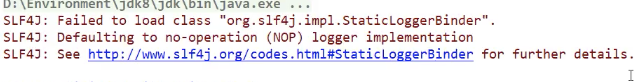

## 整合JDBC

### SpringData簡介

對於數據訪問層，無論是 SQL(關係型數據庫) 還是 NOSQL(非關係型數據庫)，Spring Boot 底層都是採用 Spring Data 的方式進行統一處理。

Spring Boot 底層都是採用 Spring Data 的方式進行統一處理各種數據庫，Spring Data 也是 Spring 中與 Spring Boot、Spring Cloud 等齊名的知名項目。

Sping Data 官網：https://spring.io/projects/spring-data

數據庫相關的啟動器 ：可以參考官方文檔：

https://docs.spring.io/spring-boot/docs/2.2.5.RELEASE/reference/htmlsingle/#using-boot-starter

### 整合JDBC

創建測試項目測試數據源
1、我去新建一個項目測試：springboot-data-jdbc ; 引入相應的模塊！基礎模塊

圖片

2、項目建好之後，發現自動幫我們導入瞭如下的啟動器：

```xml
<dependencies>
  <dependency>
    <groupId>org.springframework.boot</groupId>
    <artifactId>spring-boot-starter-web</artifactId>
  </dependency>
  <!--JDBC-->
  <dependency>
    <groupId>org.springframework.boot</groupId>
    <artifactId>spring-boot-starter-jdbc</artifactId>
  </dependency>
  <!--MySQL-->
  <dependency>
    <groupId>mysql</groupId>
    <artifactId>mysql-connector-java</artifactId>
    <scope>runtime</scope>
  </dependency>
  <dependency>
    <groupId>org.springframework.boot</groupId>
    <artifactId>spring-boot-starter-test</artifactId>
    <scope>test</scope>
    <exclusions>
      <exclusion>
        <groupId>org.junit.vintage</groupId>
        <artifactId>junit-vintage-engine</artifactId>
      </exclusion>
    </exclusions>
  </dependency>
</dependencies>
```

3、編寫yaml配置文件連接數據庫；

```yml
spring:
  datasource:
    username: root
    password: 12345678
    # 加入時區報錯了，就增加一個時區的配置就OK了serverTimezone=UTC
    url: jdbc:mysql://localhost:3306/mybatis?serverTimezone=UTC&useSSL=false&useUnicode=true&characterEncoding=utf8
    driver-class-name: com.mysql.cj.jdbc.Driver
```

4、配置完這一些東西後，我們就可以直接去使用了，因為SpringBoot已經默認幫我們進行了自動配置；去測試類測試一下

```java
import java.sql.Connection;
import java.sql.SQLException;
import javax.sql.DataSource;
import org.junit.jupiter.api.Test;
import org.springframework.beans.factory.annotation.Autowired;
import org.springframework.boot.test.context.SpringBootTest;


@SpringBootTest
class DemoApplicationTests {

	//DI注入數據源
    @Autowired
    DataSource dataSource;
    
    @Test
    public void contextLoads() throws SQLException {
        //看一下默認數據源
    	// class com.zaxxer.hikari.HikariDataSource
        System.out.println(dataSource.getClass()); 
        //獲得連接
        Connection connection = dataSource.getConnection();
        // HikariProxyConnection@2134195609 wrapping com.mysql.cj.jdbc.ConnectionImpl@4649d70a
        System.out.println(connection); 

        //關閉連接
        connection.close();
    }
}
```

DemoApplication.class

```java
import org.springframework.boot.SpringApplication;
import org.springframework.boot.autoconfigure.SpringBootApplication;
//its self is a spring component

//程序的主入口
// If you are running springbok, always need to have this class
@SpringBootApplication
public class DemoApplication {

	public static void main(String[] args) {
		SpringApplication.run(DemoApplication.class, args);
	}

}
```

結果：我們可以看到他默認給我們配置的數據源為 : class com.zaxxer.hikari.HikariDataSource ， 我們並沒有手動配置

DataSourceProperties.class

```java
@ConfigurationProperties(prefix = "spring.datasource")
public class DataSourceProperties implements BeanClassLoaderAware, InitializingBean {

	private ClassLoader classLoader;

	/**
	 * Name of the datasource. Default to "testdb" when using an embedded database.
	 */
	private String name;

	/**
	 * Whether to generate a random datasource name.
	 */
	private boolean generateUniqueName;

	/**
	 * Fully qualified name of the connection pool implementation to use. By default, it
	 * is auto-detected from the classpath.
	 */
	private Class<? extends DataSource> type;

	/**
	 * Fully qualified name of the JDBC driver. Auto-detected based on the URL by default.
	 */
	private String driverClassName;

	/**
	 * JDBC URL of the database.
	 */
	private String url;

	/**
	 * Login username of the database.
	 */
	private String username;

	/**
	 * Login password of the database.
	 */
	private String password;
```

DataSourceAutoConfiguration.class

```java
@Configuration(proxyBeanMethods = false)
@ConditionalOnClass({ DataSource.class, EmbeddedDatabaseType.class })
@EnableConfigurationProperties(DataSourceProperties.class)
@Import({ DataSourcePoolMetadataProvidersConfiguration.class, DataSourceInitializationConfiguration.class })
public class DataSourceAutoConfiguration {
  static class PooledDataSourceCondition extends AnyNestedCondition {

		PooledDataSourceCondition() {
			super(ConfigurationPhase.PARSE_CONFIGURATION);
		}

		@ConditionalOnProperty(prefix = "spring.datasource", name = "type")
		static class ExplicitType {

		}

		@Conditional(PooledDataSourceAvailableCondition.class)
		static class PooledDataSourceAvailable {

		}

	}
}
```


我們來全局搜索一下，找到數據源的所有自動配置都在 ：

```java
DataSourceAutoConfiguration文件：

@Import(
    {Hikari.class, Tomcat.class, Dbcp2.class, Generic.class, DataSourceJmxConfiguration.class}
)
protected static class PooledDataSourceConfiguration {
    protected PooledDataSourceConfiguration() {
    }
}
```

這裡導入的類都在 DataSourceConfiguration 配置類下，可以看出 Spring Boot 2.2.5 默認使用HikariDataSource 數據源，而以前版本，如 Spring Boot 1.5 默認使用 org.apache.tomcat.jdbc.pool.DataSource 作為數據源；

HikariDataSource 號稱 Java WEB 當前速度最快的數據源，相比於傳統的 C3P0 、DBCP、Tomcat jdbc 等連接池更加優秀；

可以使用 spring.datasource.type 指定自定義的數據源類型，值為 要使用的連接池實現的完全限定名。

關於數據源我們並不做介紹，有了數據庫連接，顯然就可以 CRUD 操作數據庫了。但是我們需要先了解一個對象 JdbcTemplate


### JDBCTemplate

1、有了數據源(com.zaxxer.hikari.HikariDataSource)，然後可以拿到數據庫連接(java.sql.Connection)，有了連接，就可以使用原生的 JDBC 語句來操作數據庫；

2、即使不使用第三方第數據庫操作框架，如 MyBatis等，Spring 本身也對原生的JDBC 做了輕量級的封裝，即JdbcTemplate。

3、數據庫操作的所有 CRUD 方法都在 JdbcTemplate 中。

4、Spring Boot 不僅提供了默認的數據源，同時默認已經配置好了 JdbcTemplate 放在了容器中，程序員只需自己注入即可使用

5、JdbcTemplate 的自動配置是依賴 

`Maven Denpencies --> spring-boot-autoconfigurature-2.3.1/RELEASE.jar --> org.springframework.boot.autoconfigure.jdbc 包下的 JdbcTemplateConfiguration 類`

JdbcTemplate主要提供以下幾類方法：

- execute方法：可以用於執行任何SQL語句，一般用於執行DDL語句；

- update方法及batchUpdate方法：update方法用於執行新增、修改、刪除等語句；batchUpdate方法用於執行批處理相關語句；

- query方法及queryForXXX方法：用於執行查詢相關語句；

- call方法：用於執行存儲過程、函數相關語句。


### 測試

編寫一個Controller，注入 jdbcTemplate，編寫測試方法進行訪問測試；


```java
import org.springframework.beans.factory.annotation.Autowired;
import org.springframework.jdbc.core.JdbcTemplate;
import org.springframework.web.bind.annotation.GetMapping;
import org.springframework.web.bind.annotation.PathVariable;
import org.springframework.web.bind.annotation.RestController;

import java.util.List;
import java.util.Map;

@RestController
public class JDBCController {

  @Autowired
  JdbcTemplate jdbcTemplate;

  // 查詢數據庫的所有信息
  // 沒有實體類，獲取數據庫的東西，怎麼獲取？ Map
  @GetMapping("/userList")
  public List<Map<String,Object>> userList() {
    String sql = "select * from user";
    List<Map<String, Object>> maps = jdbcTemplate.queryForList(sql);
    return maps;
  }

  @GetMapping("/addUser")
  public String addUser() {
    String sql = "insert into mybatis.user(id, name, pwd) values(7,'小明1','123456')";
    jdbcTemplate.update(sql);
    return "update-ok";
  }

  @GetMapping("/updateUser/{id}")
  public String updateUser(@PathVariable("id") int id) {
    String sql = "update mybatis.user set name = ?,pwd = ? where id = " + id;
    //封裝
    Object[] objects = new Object[2];

    objects[0] = "小明2";
    objects[1] = "aaaaaaa";

    jdbcTemplate.update(sql,objects);
    return "update-ok";
  }

  @GetMapping("/deleteUser/{id}")
  public String deleteUser(@PathVariable("id") int id) {
    String sql = "delete from mybatis.user where id = ?";
    jdbcTemplate.update(sql,id);
    return "update-ok";
  }
}
```


測試請求，結果正常；

到此，CURD的基本操作，使用 JDBC 就搞定了。

## 集成Druid

### Druid簡介

Java程序很大一部分要操作數據庫，為了提高性能操作數據庫的時候，又不得不使用數據庫連接池。

Druid 是阿里巴巴開源平台上一個數據庫連接池實現，結合了 C3P0、DBCP 等 DB 池的優點，同時加入了日誌監控。

Druid 可以很好的監控 DB 池連接和 SQL 的執行情況，天生就是針對監控而生的 DB 連接池。

Druid已經在阿里巴巴部署了超過600個應用，經過一年多生產環境大規模部署的嚴苛考驗。

Spring Boot 2.0 以上默認使用 Hikari 數據源，可以說 Hikari 與 Driud 都是當前 Java Web 上最優秀的數據源，我們來重點介紹 Spring Boot 如何集成 Druid 數據源，如何實現數據庫監控。

Github地址：https://github.com/alibaba/druid/

com.alibaba.druid.pool.DruidDataSource 基本配置參數如下：


### 配置數據源

1、添加上 Druid 數據源依賴。

```java
<!-- https://mvnrepository.com/artifact/com.alibaba/druid -->
<dependency>
    <groupId>com.alibaba</groupId>
    <artifactId>druid</artifactId>
    <version>1.1.21</version>
</dependency>
```

2、切換數據源；之前已經說過 Spring Boot 2.0 以上默認使用 com.zaxxer.hikari.HikariDataSource 數據源，但可以 通過 spring.datasource.type 指定數據源。

```yml
spring:
  datasource:
    username: root
    password: 12345678
    # 加入時區報錯了，就增加一個時區的配置就OK了serverTimezone=UTC
    url: jdbc:mysql://localhost:3306/mybatis?serverTimezone=UTC&useSSL=false&useUnicode=true&characterEncoding=utf8
    type: com.alibaba.druid.pool.DruidDataSource # 自定義數據源
```

3、數據源切換之後，在測試類中註入 DataSource，然後獲取到它，輸出一看便知是否成功切換；

```java
// DemoApplicationTests.class

console:
class com.alibaba.druid.pool.DruidDataSource
com.mysql.cj.jdbc.ConnectionImpl@6a0094c9
```


4、切換成功！既然切換成功，就可以設置數據源連接初始化大小、最大連接數、等待時間、最小連接數 等設置項；可以查看源碼

```yml
spring:
  datasource:
    username: root
    password: 12345678
    # 加入時區報錯了，就增加一個時區的配置就OK了serverTimezone=UTC
    url: jdbc:mysql://localhost:3306/mybatis?serverTimezone=UTC&useSSL=false&useUnicode=true&characterEncoding=utf8
    type: com.alibaba.druid.pool.DruidDataSource # 自定義數據源

    #Spring Boot 默認是不注入這些屬性值的，需要自己綁定
    #druid 數據源專有配置
    initialSize: 5
    minIdle: 5
    maxActive: 20
    maxWait: 60000
    timeBetweenEvictionRunsMillis: 60000
    minEvictableIdleTimeMillis: 300000
    validationQuery: SELECT 1 FROM DUAL
    testWhileIdle: true
    testOnBorrow: false
    testOnReturn: false
    poolPreparedStatements: true
    
    #配置監控統計攔截的filters，stat:監控統計、log4j：日誌記錄、wall：防禦sql注入
    #如果允許時報錯 java.lang.ClassNotFoundException: org.apache.log4j.Priority
    #則導入 log4j 依賴即可，Maven 地址：https://mvnrepository.com/artifact/log4j/log4j
    filters: stat,wall,log4j
    maxPoolPreparedStatementPerConnectionSize: 20
    useGlobalDataSourceStat: true
    connectionProperties: druid.stat.mergeSql=true;druid.stat.slowSqlMillis=500
```


5、導入Log4j 的依賴

```java
<!-- https://mvnrepository.com/artifact/log4j/log4j -->
<dependency>
    <groupId>log4j</groupId>
    <artifactId>log4j</artifactId>
    <version>1.2.17</version>
</dependency>
```

6、現在需要程序員自己為 DruidDataSource 綁定全局配置文件中的參數，再添加到容器中，而不再使用 Spring Boot 的自動生成了；我們需要 自己添加 DruidDataSource 組件到容器中，並綁定屬性；

```java
package com.wong.config;

import com.alibaba.druid.pool.DruidDataSource;
import org.springframework.boot.context.properties.ConfigurationProperties;
import org.springframework.context.annotation.Bean;
import org.springframework.context.annotation.Configuration;

import javax.sql.DataSource;

@Configuration
public class DruidConfig {

    /*
       將自定義的 Druid數據源添加到容器中，不再讓 Spring Boot 自動創建
       綁定全局配置文件中的 druid 數據源屬性到 com.alibaba.druid.pool.DruidDataSource從而讓它們生效
       @ConfigurationProperties(prefix = "spring.datasource")：作用就是將 全局配置文件中
       前綴為 spring.datasource的屬性值注入到 com.alibaba.druid.pool.DruidDataSource 的同名參數中
     */
    @ConfigurationProperties(prefix = "spring.datasource")
    @Bean
    public DataSource druidDataSource() {
        return new DruidDataSource();
    }

}
```


```java
@Configuration
public class DruidConfig {

    @ConfigurationProperties(prefix = "spring.datasource")
    @Bean
    public DataSource druidDataSource() {
        return new DruidDataSource();
    }

    // 後台監控:web.xml, ServletRegistrationBean
    // 因為SpringBoot 內置了 servlet容器，所以沒有web.xml，替代方法ServletRegistrationBean
    @Bean
    public ServletRegistrationBean statViewServlet() {
        ServletRegistrationBean<StatViewServlet> bean = new ServletRegistrationBean<>(new StatViewServlet(), "/druid/*");

        //後台需要有人登陸，賬號密碼
        Map<String, String> initParameters = new HashMap<>();
        //增加配置
        initParameters.put("loginUsername", "root");//登陸key 是固定的loginUsername loginPassword
        initParameters.put("loginPassword", "12345678");

        // 允許誰可以訪問
        initParameters.put("allow", "");

        //禁止誰能訪問
        //initParameters.put("kuangshen","192.168.1.2");

        bean.setInitParameters(initParameters);//設置初始化參數

        return bean;
    }

    // filter
    @Bean
    public FilterRegistrationBean webStatilter() {
        FilterRegistrationBean<Filter> bean = new FilterRegistrationBean<>();

        bean.setFilter(new WebStatFilter());

        //可以過濾那些請求

        Map<String, String> initParameters = new HashMap<>();

        //這些東西不進行統計
        initParameters.put("exclusions", "*.js,*.cs,/druid/*");

        bean.setInitParameters(initParameters);

        return bean;

    }
}
```

run as spaingboot application


7、去測試類中測試一下；看是否成功！

```java
@SpringBootTest
class SpringbootDataJdbcApplicationTests {

    //DI注入數據源
    @Autowired
    DataSource dataSource;
    
    @Test
    public void contextLoads() throws SQLException {
        //看一下默認數據源
        System.out.println(dataSource.getClass());
        //獲得連接
        Connection connection = dataSource.getConnection();
        System.out.println(connection);
    
        DruidDataSource druidDataSource = (DruidDataSource) dataSource;
        System.out.println("druidDataSource 數據源最大連接數：" + druidDataSource.getMaxActive());
        System.out.println("druidDataSource 數據源初始化連接數：" + druidDataSource.getInitialSize());
    
        //關閉連接
        connection.close();
    }

}
```

輸出結果 ：可見配置參數已經生效！

圖片


### 配置Druid數據源監控

Druid 數據源具有監控的功能，並提供了一個 web 界面方便用戶查看，類似安裝 

路由器 時，人家也提供了一個默認的 web 頁面。

所以第一步需要設置 Druid 的後台管理頁面，比如 登錄賬號、密碼 等；配置後台管理；

```java
//配置 Druid 監控管理後台的Servlet；
//內置 Servlet 容器時沒有web.xml文件，所以使用 Spring Boot 的註冊 Servlet 方式
@Bean
public ServletRegistrationBean statViewServlet() {
    ServletRegistrationBean bean = new ServletRegistrationBean(new StatViewServlet(), "/druid/*");

// 這些參數可以在 com.alibaba.druid.support.http.StatViewServlet
// 的父類 com.alibaba.druid.support.http.ResourceServlet 中找到
Map<String, String> initParams = new HashMap<>();
initParams.put("loginUsername", "admin"); //後台管理界面的登錄賬號
initParams.put("loginPassword", "123456"); //後台管理界面的登錄密碼

//後台允許誰可以訪問
//initParams.put("allow", "localhost")：表示只有本機可以訪問
//initParams.put("allow", "")：為空或者為null時，表示允許所有訪問
initParams.put("allow", "");
//deny：Druid 後台拒絕誰訪問
//initParams.put("kuangshen", "192.168.1.20");表示禁止此ip訪問

//設置初始化參數
bean.setInitParameters(initParams);
    return bean;
}
```

配置完畢後，我們可以選擇訪問 ：http://localhost:8080/druid/login.html

圖片

進入之後

圖片

配置 Druid web 監控 filter 過濾器

```java
//配置 Druid 監控 之 web 監控的 filter
//WebStatFilter：用於配置Web和Druid數據源之間的管理關聯監控統計
@Bean
public FilterRegistrationBean webStatFilter() {
    FilterRegistrationBean bean = new FilterRegistrationBean();
    bean.setFilter(new WebStatFilter());

    //exclusions：設置哪些請求進行過濾排除掉，從而不進行統計
    Map<String, String> initParams = new HashMap<>();
    initParams.put("exclusions", "*.js,*.css,/druid/*,/jdbc/*");
    bean.setInitParameters(initParams);

    //"/*" 表示過濾所有請求
    bean.setUrlPatterns(Arrays.asList("/*"));
    return bean;
}
```
平時在工作中，按需求進行配置即可，主要用作監控！

## 整合MyBatis


官方文檔：http://mybatis.org/spring-boot-starter/mybatis-spring-boot-autoconfigure/

Maven倉庫地址：https://mvnrepository.com/artifact/org.mybatis.spring.boot/mybatis-spring-boot-starter/2.1.1

圖片

### 整合測試

1、導入 MyBatis 所需要的依賴

not spring-boot official, it is from mybatis offitial

```xml
<dependency>
    <groupId>org.mybatis.spring.boot</groupId>
    <artifactId>mybatis-spring-boot-starter</artifactId>
    <version>2.1.1</version>
</dependency>
```

2、配置數據庫連接信息

```yml
spring:
  datasource:
    username: root
    password: 123456
    #?serverTimezone=UTC解決時區的報錯
    url: jdbc:mysql://localhost:3306/springboot?serverTimezone=UTC&useUnicode=true&characterEncoding=utf-8
    driver-class-name: com.mysql.cj.jdbc.Driver
```
3、測試數據庫是否連接成功！

DemoApplication.class

```java
//程序的主入口
@SpringBootApplication
public class DemoApplication {
	public static void main(String[] args) {
		SpringApplication.run(DemoApplication.class, args);
	}
}
```

DemoApplicationTests.class

```java
@SpringBootTest
class DemoApplicationTests {
	//DI注入數據源
    @Autowired
    DataSource dataSource;
    
    @Test
    public void contextLoads() throws SQLException {
        //看一下默認數據源
        System.out.println(dataSource.getClass()); 
        //獲得連接
        Connection connection = dataSource.getConnection();
        System.out.println(connection); 
        //關閉連接
        connection.close();
    }
}
```

4、創建實體類，導入 Lombok！

```xml
<dependency>
  <groupId>org.projectlombok</groupId>
  <artifactId>lombok</artifactId>
</dependency>
```


```java
package com.wong.pojo;

import lombok.AllArgsConstructor;
import lombok.Data;
import lombok.NoArgsConstructor;

@Data
@NoArgsConstructor
@AllArgsConstructor
public class User {

    private int id;
    private String name;
    private String pwd;
}
```

5、創建mapper目錄以及對應的 Mapper 接口

```java
// 這個註解表示了這是一個 mybatis 的 mapper 類
@Mapper
@Repository
public interface UserMapper {

    List<User> queryUserList();

    User queryUserById(int id);

    int addUser(User user);

    int updateUser(User user);

    int deleteUser(int id);
}
```

6、對應的Mapper映射文件

UserMapper.xml

```xml
<?xml version="1.0" encoding="UTF-8" ?>
<!DOCTYPE mapper
        PUBLIC "-//mybatis.org//DTD Mapper 3.0//EN"
        "http://mybatis.org/dtd/mybatis-3-mapper.dtd">
<!--namespace=綁定一個對應的Dao/Mapper接口-->
<mapper namespace="com.wong.mapper.UserMapper">
    
    <select id="queryUserList" resultType="User">
        select * from mybatis.user;
    </select>

    <select id="queryUserById" resultType="User">
        select * from mybatis.user where id = #{id};
    </select>

    <insert id="addUser" parameterType="User">
        insert into mybatis.user (id, name, pwd) values (#{id},#{name},#{pwd});
    </insert>

    <update id="updateUser" parameterType="User">
        update mybatis.user set name=#{name},pwd = #{pwd} where id = #{id};
    </update>

    <delete id="deleteUser" parameterType="int">
        delete from mybatis.user where id = #{id}
    </delete>
</mapper>
```

7、maven配置資源過濾問題

```xml
<resources>
    <resource>
        <directory>src/main/java</directory>
        <includes>
            <include>**/*.xml</include>
        </includes>
        <filtering>true</filtering>
    </resource>
</resources>
```

8、編寫部門的 DepartmentController 進行測試！

```java
@RestController
public class UserController {
    @Autowired
    private UserMapper userMapper;

    @GetMapping("/queryUserList")
    public List<User> queryUserList() {
        List<User> userList = userMapper.queryUserList();

        for (User user : userList) {
            System.out.println(user);
        }

        return userList;
    }

    //添加一個用戶
    @GetMapping("/addUser")
    public String addUser() {
        userMapper.addUser(new User(7,"阿毛","123456"));
        return "ok";
    }

    //修改一個用戶
    @GetMapping("/updateUser")
    public String updateUser() {
        userMapper.updateUser(new User(7,"阿毛","123456"));
        return "ok";
    }

    @GetMapping("/deleteUser")
    public String deleteUser() {
        userMapper.deleteUser(7);

        return "ok";
    }
}
```


啟動項目訪問進行測試！

`http://localhost:8080/queryUserList`

我們增加一個員工類再測試下，為之後做準備

1、新建一個pojo類 Employee ；

```java
@Data
@AllArgsConstructor
@NoArgsConstructor
public class Employee {

    private Integer id;
    private String lastName;
    private String email;
    //1 male, 0 female
    private Integer gender;
    private Integer department;
    private Date birth;
    
    private Department eDepartment; // 冗餘設計

}
```

2、新建一個 EmployeeMapper 接口

```java
//@Mapper : 表示本類是一個 MyBatis 的 Mapper
@Mapper
@Repository
public interface EmployeeMapper {

    // 獲取所有員工信息
    List<Employee> getEmployees();
    
    // 新增一個員工
    int save(Employee employee);
    
    // 通過id獲得員工信息
    Employee get(Integer id);
    
    // 通過id刪除員工
    int delete(Integer id);

}
```

3、編寫 EmployeeMapper.xml 配置文件

```xml
<?xml version="1.0" encoding="UTF-8" ?>

<!DOCTYPE mapper
        PUBLIC "-//mybatis.org//DTD Mapper 3.0//EN"
        "http://mybatis.org/dtd/mybatis-3-mapper.dtd">


<mapper namespace="com.kuang.mapper.EmployeeMapper">
<resultMap id="EmployeeMap" type="Employee">
    <id property="id" column="eid"/>
    <result property="lastName" column="last_name"/>
    <result property="email" column="email"/>
    <result property="gender" column="gender"/>
    <result property="birth" column="birth"/>
    <association property="eDepartment" javaType="Department">
        <id property="id" column="did"/>
        <result property="departmentName" column="dname"/>
    </association>
</resultMap>

<select id="getEmployees" resultMap="EmployeeMap">
    select e.id as eid,last_name,email,gender,birth,d.id as did,d.department_name as dname
    from department d,employee e
    where d.id = e.department
</select>

<insert id="save" parameterType="Employee">
    insert into employee (last_name,email,gender,department,birth)
        values (#{lastName},#{email},#{gender},#{department},#{birth});
    </insert>

    <select id="get" resultType="Employee">
        select * from employee where id = #{id}
    </select>

    <delete id="delete" parameterType="int">
        delete from employee where id = #{id}
    </delete>

</mapper>
```
4、編寫EmployeeController類進行測試

```java
@RestController
public class EmployeeController {

    @Autowired
    EmployeeMapper employeeMapper;
    
    // 獲取所有員工信息
    @GetMapping("/getEmployees")
    public List<Employee> getEmployees(){
        return employeeMapper.getEmployees();
    }
    
    @GetMapping("/save")
    public int save(){
        Employee employee = new Employee();
        employee.setLastName("kuangshen");
        employee.setEmail("qinjiang@qq.com");
        employee.setGender(1);
        employee.setDepartment(101);
        employee.setBirth(new Date());
        return employeeMapper.save(employee);
    }
    
    // 通過id獲得員工信息
    @GetMapping("/get/{id}")
    public Employee get(@PathVariable("id") Integer id){
        return employeeMapper.get(id);
    }
    
    // 通過id刪除員工
    @GetMapping("/delete/{id}")
    public int delete(@PathVariable("id") Integer id){
        return employeeMapper.delete(id);
    }

}
```

測試結果完成，搞定收工！

## SpringSecurity

### 安全簡介

在 Web 開發中，安全一直是非常重要的一個方面。安全雖然屬於應用的非功能性需求，但是應該在應用開發的初期就考慮進來。如果在應用開發的後期才考慮安全的問題，就可能陷入一個兩難的境地：一方面，應用存在嚴重的安全漏洞，無法滿足用戶的要求，並可能造成用戶的隱私數據被攻擊者竊取；另一方面，應用的基本架構已經確定，要修復安全漏洞，可能需要對系統的架構做出比較重大的調整，因而需要更多的開發時間，影響應用的發布進程。因此，從應用開發的第一天就應該把安全相關的因素考慮進來，並在整個應用的開發過程中。

市面上存在比較有名的：Shiro，Spring Security ！

這裡需要闡述一下的是，每一個框架的出現都是為了解決某一問題而產生了，那麼Spring Security框架的出現是為了解決什麼問題呢？

首先我們看下它的官網介紹：Spring Security官網地址

Spring Security is a powerful and highly customizable authentication and access-control framework. It is the de-facto standard for securing Spring-based applications.

Spring Security is a framework that focuses on providing both authentication and authorization to Java applications. Like all Spring projects, the real power of Spring Security is found in how easily it can be extended to meet custom requirements

Spring Security是一個功能強大且高度可定制的身份驗證和訪問控制框架。它實際上是保護基於spring的應用程序的標準。

Spring Security是一個框架，側重於為Java應用程序提供身份驗證和授權。與所有Spring項目一樣，Spring安全性的真正強大之處在於它可以輕鬆地擴展以滿足定制需求

從官網的介紹中可以知道這是一個權限框架。想我們之前做項目是沒有使用框架是怎麼控制權限的？對於權限 一般會細分為功能權限，訪問權限，和菜單權限。代碼會寫的非常的繁瑣，冗餘。

怎麼解決之前寫權限代碼繁瑣，冗餘的問題，一些主流框架就應運而生而Spring Scecurity就是其中的一種。

Spring 是一個非常流行和成功的 Java 應用開發框架。 Spring Security 基於 Spring 框架，提供了一套 Web 應用安全性的完整解決方案。一般來說，Web 應用的安全性包括用戶認證（Authentication）和用戶授權（Authorization）兩個部分。用戶認證指的是驗證某個用戶是否為系統中的合法主體，也就是說用戶能否訪問該系統。用戶認證一般要求用戶提供用戶名和密碼。系統通過校驗用戶名和密碼來完成認證過程。用戶授權指的是驗證某個用戶是否有權限執行某個操作。在一個系統中，不同用戶所具有的權限是不同的。比如對一個文件來說，有的用戶只能進行讀取，而有的用戶可以進行修改。一般來說，系統會為不同的用戶分配不同的角色，而每個角色則對應一系列的權限。

對於上面提到的兩種應用情景，Spring Security 框架都有很好的支持。在用戶認證方面，Spring Security 框架支持主流的認證方式，包括 HTTP 基本認證、HTTP 表單驗證、HTTP 摘要認證、OpenID 和 LDAP 等。在用戶授權方面，Spring Security 提供了基於角色的訪問控制和訪問控制列表（Access Control List，ACL），可以對應用中的領域對象進行細粒度的控制。


### 實戰測試

實驗環境搭建

1、新建一個初始的springboot項目web模塊，thymeleaf模塊

2、導入靜態資源


3、controller跳轉！

```java
import org.springframework.stereotype.Controller;
import org.springframework.web.bind.annotation.PathVariable;
import org.springframework.web.bind.annotation.RequestMapping;

@Controller
public class RouterController {

  @RequestMapping({"/","/index"})
  public String index() {
    return "index";
  }

  @RequestMapping("/toLogin")
  public String toLogin() {
    return "views/login";
  }

  @RequestMapping("/level1/{id}")
  public String level1(@PathVariable("id") int id) {
    return "views/level1/" + id;
  }

  @RequestMapping("/level2/{id}")
  public String level2(@PathVariable("id") int id) {
    return "views/level2/" + id;
  }

  @RequestMapping("/level3/{id}")
  public String level3(@PathVariable("id") int id) {
    return "views/level3/" + id;
  }
}
```

4、測試實驗環境是否OK！


### 認識SpringSecurity

Spring Security 是針對Spring項目的安全框架，也是Spring Boot底層安全模塊默認的技術選型，他可以實現強大的Web安全控制，對於安全控制，我們僅需要引入spring-boot-starter-security 模塊，進行少量的配置，即可實現強大的安全管理！

記住幾個類：

- WebSecurityConfigurerAdapter：自定義Security策略

- AuthenticationManagerBuilder：自定義認證策略

- @EnableWebSecurity：開啟WebSecurity模式

Spring Security的兩個主要目標是 “認證” 和 “授權”（訪問控制）。

“認證”（Authentication）

- 身份驗證是關於驗證您的憑據，如用戶名/用戶ID和密碼，以驗證您的身份。

- 身份驗證通常通過用戶名和密碼完成，有時與身份驗證因素結合使用。

 “授權” （Authorization）

- 授權發生在系統成功驗證您的身份後，最終會授予您訪問資源（如信息，文件，數據庫，資金，位置，幾乎任何內容）的完全權限。

這個概念是通用的，而不是只在Spring Security 中存在。

#### 認證和授權

目前，我們的測試環境，是誰都可以訪問的，我們使用 Spring Security 增加上認證和授權的功能

1、引入 Spring Security 模塊

```xml
<dependency>
   <groupId>org.springframework.boot</groupId>
   <artifactId>spring-boot-starter-security</artifactId>
</dependency>
```

2、編寫 Spring Security 配置類

參考官網：https://spring.io/projects/spring-security

查看我們自己項目中的版本，找到對應的幫助文檔：

https://docs.spring.io/spring-security/site/docs/5.5.0-SNAPSHOT/reference/html5/#oauth2login-provide-websecurityconfigureradapter

`commond + f + keyword:@EnableWebSecurity`


3、編寫基礎配置類

```java
import org.springframework.security.config.annotation.web.builders.HttpSecurity;
import org.springframework.security.config.annotation.web.configuration.EnableWebSecurity;
import org.springframework.security.config.annotation.web.configuration.WebSecurityConfigurerAdapter;

@EnableWebSecurity // 開啟WebSecurity模式
public class SecurityConfig extends WebSecurityConfigurerAdapter {

  @Override
  protected void configure(HttpSecurity http) throws Exception {

  }
}
```

4、定制請求的授權規則

```java
@EnableWebSecurity // 開啟WebSecurity模式
public class SecurityConfig extends WebSecurityConfigurerAdapter {

  // 鍊式編程
  // 授權
  @Override
  protected void configure(HttpSecurity http) throws Exception {
    // 首頁所有人都可以訪問，功能也只有對應有權限的人才能訪問到
    // 請求授權的規則
    http.authorizeRequests().antMatchers("/").permitAll()
      .antMatchers("/level1/**").hasRole("vip1")
      .antMatchers("/level2/**").hasRole("vip2")
      .antMatchers("/level3/**").hasRole("vip3");
  }
}
```

5、測試一下：發現除了首頁都進不去了！因為我們目前沒有登錄的角色，因為請求需要登錄的角色擁有對應的權限才可以！

6、在configure()方法中加入以下配置，開啟自動配置的登錄功能！

```java
  // 授權
  @Override
  protected void configure(HttpSecurity http) throws Exception {     // ...
		// 開啟自動配置的登錄功能
    // /login 請求來到登錄頁
    // /login?error 重定向到這裡表示登錄失敗
    http.formLogin();
  }
```

7、測試一下：發現，沒有權限的時候，會跳轉到登錄的頁面！


8、查看剛才登錄頁的註釋信息；

我們可以定義認證規則，重寫configure(AuthenticationManagerBuilder auth)方法

```java
@EnableWebSecurity // 開啟WebSecurity模式
public class SecurityConfig extends WebSecurityConfigurerAdapter {
  // ...
  //定義認證規則
  @Override
  protected void configure(AuthenticationManagerBuilder auth) throws Exception {

    //在內存中定義，也可以在jdbc中去拿....
    auth.inMemoryAuthentication()
      .withUser("wong").password("123456").roles("vip2","vip3")
      .and()
      .withUser("root").password("123456").roles("vip1","vip2","vip3")
      .and()
      .withUser("guest").password("123456").roles("vip1","vip2");
  }
}
```

9、測試，我們可以使用這些賬號登錄進行測試！發現會報錯！

There is no PasswordEncoder mapped for the id “null”


10、原因，我們要將前端傳過來的密碼進行某種方式加密，否則就無法登錄，修改代碼

```java
//定義認證規則
@Override
protected void configure(AuthenticationManagerBuilder auth) throws Exception {
   //在內存中定義，也可以在jdbc中去拿....
   //Spring security 5.0中新增了多種加密方式，也改變了密碼的格式。
   //要想我們的項目還能夠正常登陸，需要修改一下configure中的代碼。我們要將前端傳過來的密碼進行某種方式加密
   //spring security 官方推薦的是使用bcrypt加密方式。

   auth.inMemoryAuthentication()
			.passwordEncoder(new BCryptPasswordEncoder())
			.withUser("wong").password(new BCryptPasswordEncoder().encode("123456")).roles("vip2", "vip3")
			.and()
			.withUser("root").password(new BCryptPasswordEncoder().encode("123456")).roles("vip1", "vip2", "vip3")
			.and()
			.withUser("guest").password(new BCryptPasswordEncoder().encode("123456")).roles("vip1", "vip2");
}
```

11、測試，發現，登錄成功，並且每個角色只能訪問自己認證下的規則！搞定


[Spring Security: Exploring JDBC Authentication](https://www.baeldung.com/spring-security-jdbc-authentication)

[Configuring JDBC Authentication](https://spring.io/guides/topicals/spring-security-architecture#_customizing_authentication_managers0)

```java
@Autowired
private DataSource dataSource;

@Autowired
public void configureGlobal(AuthenticationManagerBuilder auth)
  throws Exception {
    auth.jdbcAuthentication()
      .dataSource(dataSource)
      .withDefaultSchema()
      .withUser(User.withUsername("user")
        .password(passwordEncoder().encode("pass"))
        .roles("USER"));
}

@Bean
public PasswordEncoder passwordEncoder() {
    return new BCryptPasswordEncoder();
}
```


#### 權限控制和註銷

1、開啟自動配置的註銷的功能

```java
/*
Provides logout support. This is automatically applied when using
	 * {@link WebSecurityConfigurerAdapter}. The default is that accessing the URL
	 * "/logout" will log the user out by invalidating the HTTP Session, cleaning up any
	 * {@link #rememberMe()} authentication that was configured, clearing the
	 * {@link SecurityContextHolder}, and then redirect to "/login?success".
	 */
```


```java
//定制請求的授權規則
@Override
protected void configure(HttpSecurity http) throws Exception {
   //....
   //開啟自動配置的註銷的功能
      // /logout 註銷請求
   http.logout();
}
```

2、我們在前端，增加一個註銷的按鈕，index.html 導航欄中

```html
<a class="item" th:href="@{/logout}">
   <i class="address card icon"></i> 註銷
</a>
```


3、我們可以去測試一下，登錄成功後點擊註銷，發現註銷完畢會跳轉到登錄頁面！

4、但是，我們想讓他註銷成功後，依舊可以跳轉到首頁，該怎麼處理呢？

```java
// .logoutSuccessUrl("/"); 註銷成功來到首頁
http.logout().logoutSuccessUrl("/");
```

5、測試，註銷完畢後，發現跳轉到首頁OK

6、我們現在又來一個需求：用戶沒有登錄的時候，導航欄上只顯示登錄按鈕，用戶登錄之後，導航欄可以顯示登錄的用戶信息及註銷按鈕！還有就是，比如kuangshen這個用戶，它只有 vip2，vip3功能，那麼登錄則只顯示這兩個功能，而vip1的功能菜單不顯示！這個就是真實的網站情況了！該如何做呢？

**我們需要結合thymeleaf中的一些功能**

```html
sec:authorize="isAuthenticated()"
```

是否認證登錄！來顯示不同的頁面

Maven依賴：

```xml
<!-- https://mvnrepository.com/artifact/org.thymeleaf.extras/thymeleaf-extras-springsecurity4 -->
<dependency>
   <groupId>org.thymeleaf.extras</groupId>
   <artifactId>thymeleaf-extras-springsecurity5</artifactId>
   <version>3.0.4.RELEASE</version>
</dependency>
```

7、修改我們的 前端頁面

- 導入命名空間

  ```xml
  <!DOCTYPE html>
  <html lang="en" 
        xmlns:th="http://www.thymeleaf.org"
        xmlns:sec="http://www.thymeleaf.org/thymeleaf-extras-springsecurity5">
  ```


修改導航欄，增加認證判斷

```html
<!--登錄註銷-->
<div class="right menu">

  <!--如果未登錄-->
  <div sec:authorize="!isAuthenticated()">
    <a class="item" th:href="@{/login}">
      <i class="address card icon"></i> 登錄
    </a>
  </div>

  <!--如果已登錄-->
  <div sec:authorize="isAuthenticated()">
    <a class="item">
      <i class="address card icon"></i>
      用戶名：<span sec:authentication="principal.username"></span>
      角色：<span sec:authentication="principal.authorities"></span>
    </a>
  </div>

  <div sec:authorize="isAuthenticated()">
    <a class="item" th:href="@{/logout}">
      <i class="address card icon"></i> 註銷
    </a>
  </div>
</div>
```

8、重啟測試，我們可以登錄試試看，登錄成功後確實，顯示了我們想要的頁面；

9、如果註銷404了，就是因為它默認防止csrf跨站請求偽造，因為會產生安全問題，我們可以將請求改為post表單提交，或者在spring security中關閉csrf功能；我們試試：在配置中增加http.csrf().disable();

```java
http.csrf().disable();//關閉csrf功能:跨站請求偽造,默認只能通過post方式提交logout請求
http.logout().logoutSuccessUrl("/");
```

10、我們繼續將下面的角色功能塊認證完成！

```html
<!-- sec:authorize="hasRole('vip1')" -->

<div class="column" sec:authorize="hasRole('vip1')">
  <div class="ui raised segment">
    <div class="ui">
      <div class="content">
        <h5 class="content">Level 1</h5>
        <hr>
        <div><a th:href="@{/level1/1}"><i class="bullhorn icon"></i> Level-1-1</a></div>
        <div><a th:href="@{/level1/2}"><i class="bullhorn icon"></i> Level-1-2</a></div>
        <div><a th:href="@{/level1/3}"><i class="bullhorn icon"></i> Level-1-3</a></div>
      </div>
    </div>
  </div>
</div>


<div class="column" sec:authorize="hasRole('vip2')">
  <div class="ui raised segment">
    <div class="ui">
      <div class="content">
        <h5 class="content">Level 2</h5>
        <hr>
        <div><a th:href="@{/level2/1}"><i class="bullhorn icon"></i> Level-2-1</a></div>
        <div><a th:href="@{/level2/2}"><i class="bullhorn icon"></i> Level-2-2</a></div>
        <div><a th:href="@{/level2/3}"><i class="bullhorn icon"></i> Level-2-3</a></div>
      </div>
    </div>
  </div>
</div>


<div class="column" sec:authorize="hasRole('vip3')">
  <div class="ui raised segment">
    <div class="ui">
      <div class="content">
        <h5 class="content">Level 3</h5>
        <hr>
        <div><a th:href="@{/level3/1}"><i class="bullhorn icon"></i> Level-3-1</a></div>
        <div><a th:href="@{/level3/2}"><i class="bullhorn icon"></i> Level-3-2</a></div>
        <div><a th:href="@{/level3/3}"><i class="bullhorn icon"></i> Level-3-3</a></div>
      </div>
    </div>
  </div>
</div>
```

11、測試一下！

12、權限控制和註銷搞定！


#### 記住我

現在的情況，我們只要登錄之後，關閉瀏覽器，再登錄，就會讓我們重新登錄，但是很多網站的情況，就是有一個記住密碼的功能，這個該如何實現呢？很簡單

1、開啟記住我功能

```java
//定制請求的授權規則
@Override
protected void configure(HttpSecurity http) throws Exception {
//。 。 。 。 。 。 。 。 。 。 。
   //記住我
   http.rememberMe();
}
```

2、我們再次啟動項目測試一下，發現登錄頁多了一個記住我功能，我們登錄之後關閉 瀏覽器，然後重新打開瀏覽器訪問，發現用戶依舊存在！

思考：如何實現的呢？其實非常簡單

我們可以查看瀏覽器的cookie


3、我們點擊註銷的時候，可以發現，spring security 幫我們自動刪除了這個 cookie


4、結論：登錄成功後，將cookie發送給瀏覽器保存，以後登錄帶上這個cookie，只要通過檢查就可以免登錄了。如果點擊註銷，則會刪除這個cookie，具體的原理我們在JavaWeb階段都講過了，這裡就不在多說了！


定制登錄頁
現在這個登錄頁面都是spring security 默認的，怎麼樣可以使用我們自己寫的Login界面呢？

1、在剛才的登錄頁配置後面指定 loginpage

```java
http.formLogin().loginPage("/toLogin");
```

2、然後前端也需要指向我們自己定義的 login請求

```html
<a class="item" th:href="@{/toLogin}">
   <i class="address card icon"></i> 登錄
</a>
```

3、我們登錄，需要將這些信息發送到哪裡，我們也需要配置，login.html 配置提交請求及方式，方式必須為post:

在 loginPage()源碼中的註釋上有寫明：

http.formLogin()

```java
 /*
 * &#064;Configuration
 * &#064;EnableWebSecurity
 * public class FormLoginSecurityConfig extends WebSecurityConfigurerAdapter {
 *
 * 	&#064;Override
 * 	protected void configure(HttpSecurity http) throws Exception {
 * 		http.authorizeRequests().antMatchers(&quot;/**&quot;).hasRole(&quot;USER&quot;).and().formLogin()
 * 				.usernameParameter(&quot;username&quot;) // default is username
 * 				.passwordParameter(&quot;password&quot;) // default is password
 * 				.loginPage(&quot;/authentication/login&quot;) // default is /login with an HTTP get
 * 				.failureUrl(&quot;/authentication/login?failed&quot;) // default is /login?error
 * 				.loginProcessingUrl(&quot;/authentication/login/process&quot;); // default is /login
 * 																		// with an HTTP
 * 																		// post
 * 	}
 */
```


```html
<form th:action="@{/login}" method="post">
  <div class="field">
    <label>Username</label>
    <div class="ui left icon input">
     <!-- <input type="text" placeholder="Username" name="user"> --> 
      <input type="text" placeholder="Username" name="username">
      <i class="user icon"></i>
    </div>
  </div>
  <div class="field">
    <label>Password</label>
    <div class="ui left icon input">
      <!-- <input type="password" name="pwd"> -->
      <input type="password" name="password">
      <i class="lock icon"></i>
    </div>
  </div>
  <input type="submit" class="ui blue submit button"/>
</form>
```

4、這個請求提交上來，我們還需要驗證處理，怎麼做呢？我們可以查看formLogin()方法的源碼！我們配置接收登錄的用戶名和密碼的參數！

```java
http.formLogin()
  .usernameParameter("username")
  .passwordParameter("password")
  .loginPage("/toLogin")
  .loginProcessingUrl("/login"); // 登陸表單提交請求
/*
http.formLogin()
  .usernameParameter("user")
  .passwordParameter("pwd")
  .loginPage("/toLogin")
  .loginProcessingUrl("/login"); // 登陸表單提交請求
*/
```

5、在登錄頁增加記住我的多選框

```html
<input type="checkbox" name="remember"> 記住我
```

6、後端驗證處理！

```java
//定制記住我的參數！
http.rememberMe().rememberMeParameter("remember");
```

7、測試，OK

完整配置代碼

```java
package com.kuang.config;

import org.springframework.security.config.annotation.authentication.builders.AuthenticationManagerBuilder;
import org.springframework.security.config.annotation.web.builders.HttpSecurity;
import org.springframework.security.config.annotation.web.configuration.EnableWebSecurity;
import org.springframework.security.config.annotation.web.configuration.WebSecurityConfigurerAdapter;
import org.springframework.security.crypto.bcrypt.BCryptPasswordEncoder;

@EnableWebSecurity
public class SecurityConfig extends WebSecurityConfigurerAdapter {

  //定制請求的授權規則
  @Override
  protected void configure(HttpSecurity http) throws Exception {

    http.authorizeRequests().antMatchers("/").permitAll()
      .antMatchers("/level1/**").hasRole("vip1")
      .antMatchers("/level2/**").hasRole("vip2")
      .antMatchers("/level3/**").hasRole("vip3");


    //開啟自動配置的登錄功能：如果沒有權限，就會跳轉到登錄頁面！
    // /login 請求來到登錄頁
    // /login?error 重定向到這裡表示登錄失敗
    http.formLogin()
      .usernameParameter("username")
      .passwordParameter("password")
      .loginPage("/toLogin")
      .loginProcessingUrl("/login"); // 登陸表單提交請求

    //開啟自動配置的註銷的功能
    // /logout 註銷請求
    // .logoutSuccessUrl("/"); 註銷成功來到首頁

    http.csrf().disable();//關閉csrf功能:跨站請求偽造,默認只能通過post方式提交logout請求
    http.logout().logoutSuccessUrl("/");

    //記住我
    http.rememberMe().rememberMeParameter("remember");

  }

  //定義認證規則
  @Override
  protected void configure(AuthenticationManagerBuilder auth) throws Exception {
    //在內存中定義，也可以在jdbc中去拿....
    //Spring security 5.0中新增了多種加密方式，也改變了密碼的格式。
    //要想我們的項目還能夠正常登陸，需要修改一下configure中的代碼。我們要將前端傳過來的密碼進行某種方式加密
    //spring security 官方推薦的是使用bcrypt加密方式。

    auth.inMemoryAuthentication().passwordEncoder(new BCryptPasswordEncoder())
      .withUser("kuangshen").password(new BCryptPasswordEncoder().encode("123456")).roles("vip2","vip3")
      .and()
      .withUser("root").password(new BCryptPasswordEncoder().encode("123456")).roles("vip1","vip2","vip3")
      .and()
      .withUser("guest").password(new BCryptPasswordEncoder().encode("123456")).roles("vip1","vip2");

  }
}
```

## shiro

[Get Started with Apache Shiro](https://shiro.apache.org/get-started.html#get-started-with-apache-shiro)

[Shiro入门这篇就够了【Shiro的基础知识、回顾URL拦截】](https://segmentfault.com/a/1190000013875092)


### eclipse

[eclipse更改项目使用的jdk version](https://blog.csdn.net/qq_36412715/article/details/101443360)


Eclipse 設置資源文件夾


### quick start

[quick start](https://github.com/apache/shiro/tree/master/samples/quickstart)

1. pom.xml

```xml
<dependencies>
  <dependency>
    <groupId>org.apache.shiro</groupId>
    <artifactId>shiro-core</artifactId>
    <version>1.4.1</version>
  </dependency>

  <!-- configure logging -->
  <dependency>
    <groupId>org.slf4j</groupId>
    <artifactId>jcl-over-slf4j</artifactId>
    <version>1.7.21</version>
  </dependency>
  <dependency>
    <groupId>org.slf4j</groupId>
    <artifactId>slf4j-log4j12</artifactId>
    <version>1.7.21</version>
  </dependency>
  <dependency>
    <groupId>log4j</groupId>
    <artifactId>log4j</artifactId>
    <version>1.2.17</version>
  </dependency>
</dependencies>
```

2. 


3. 

```java

import org.apache.shiro.SecurityUtils;
import org.apache.shiro.authc.*;
import org.apache.shiro.config.IniSecurityManagerFactory;
import org.apache.shiro.mgt.SecurityManager;
import org.apache.shiro.session.Session;
import org.apache.shiro.subject.Subject;
import org.apache.shiro.util.Factory;
import org.slf4j.Logger;
import org.slf4j.LoggerFactory;
/**
 * Simple Quickstart application showing how to use Shiro's API.
 *
 * @since 0.9 RC2
 */
public class Quickstart {
 ...
}
```

output

```
2021-04-11 17:54:39,940 INFO [org.apache.shiro.session.mgt.AbstractValidatingSessionManager] - Enabling session validation scheduler... 
2021-04-11 17:54:39,956 INFO [Quickstart] - Retrieved the correct value! [aValue] 
2021-04-11 17:54:39,957 INFO [Quickstart] - User [lonestarr] logged in successfully. 
2021-04-11 17:54:39,957 INFO [Quickstart] - May the Schwartz be with you! 
2021-04-11 17:54:39,957 INFO [Quickstart] - You may use a lightsaber ring.  Use it wisely. 
2021-04-11 17:54:39,957 INFO [Quickstart] - You are permitted to 'drive' the winnebago with license plate (id) 'eagle5'.  Here are the keys - have fun! 
```

precedure Outline

```java
Subject currentUser = SecurityUtils.getSubject();
Session session = currentUser.getSession();
currentUser.isAuthenticated()
currentUser.getPrincipal() 
currentUser.hasRole("schwartz")
currentUser.isPermitted("winnebago:drive:eagle5")
currentUser.logout();
```


#### test

1. Modified pom.xml

```
<scope>test</scope>
```


2. Run --> error


3. follow the error instructor Import `commons.logging` 


4. Run --> cannot see 日誌



5. Remove `<scope>test</scope>`


6. Work well


## shirt-springboot-web

### build basic

1. Pom.xml

```xml
  <dependencies>
  		<!--web-->
        <dependency>
            <groupId>org.springframework.boot</groupId>
            <artifactId>spring-boot-starter-web</artifactId>
        </dependency>

		<!--thymeleaf模板 -->
		<dependency>
			<groupId>org.thymeleaf</groupId>
			<artifactId>thymeleaf-spring5</artifactId>
		</dependency>
		
		
		<!-- exit in parent project -->
		<!-- <dependency>
			<groupId>org.springframework.boot</groupId>
			<artifactId>spring-boot-starter-test</artifactId>
			<scope>test</scope>
			<exclusions>
				<exclusion>
					<groupId>org.junit.vintage</groupId>
					<artifactId>junit-vintage-engine</artifactId>
				</exclusion>
			</exclusions>
		</dependency> -->
  </dependencies>
```

2. controller

```java
@Controller
public class MyController {
	
	//接口 : http://localhost:8080/index
	@RequestMapping({"/", "/index"})
	public String toIndex(Model model) {
		//調用業務，接收前端的業務
		model.addAttribute("msg", "hello Shiro");
		return "index";
	}
}
```


```java
//程序的主入口
@SpringBootApplication
public class WebApplication {

	public static void main(String[] args) {
		SpringApplication.run(WebApplication.class, args);
	}

}
```

3. Resources/templates/index.html

```html
<!DOCTYPE html >
<html lang="en" xmlns:th="http://www.thymeleaf.org">
<head>
<meta charset="UTF-8">
<title>Title</title>
</head>
<body>
	<h1>測試頁面</h1>
	<!--th:text就是將div中的內容設置為它指定的值，和之前學習的Vue一樣-->

	<div th:text="${msg}"></div>

</body>
</html>
```

4. test

http://localhost:8080/

### add shiro


```
Subect 用戶
SecurityManager 管理所有用戶
Realm 連接數據
```

1. Pom.xml

```xml
<dependencies>
		<!-- Subject 用戶 SecurityManager 管理所有用戶 Realm 連接數據庫 -->

		<!--shiro-thymeleaf整合 -->
		<!-- https://mvnrepository.com/artifact/com.github.theborakompanioni/thymeleaf-extras-shiro -->
		
		<!--shiro整合spring的包-->
        <dependency>
            <groupId>org.apache.shiro</groupId>
            <artifactId>shiro-spring</artifactId>
            <version>1.5.3</version>
        </dependency>
		<!--web -->
		<dependency>
			<groupId>org.springframework.boot</groupId>
			<artifactId>spring-boot-starter-web</artifactId>
		</dependency>

		<!--thymeleaf模板 -->
		<dependency>
			<groupId>org.thymeleaf</groupId>
			<artifactId>thymeleaf-spring5</artifactId>
		</dependency>


		<!-- exit in parent project -->
		<!-- <dependency> <groupId>org.springframework.boot</groupId> <artifactId>spring-boot-starter-test</artifactId> 
			<scope>test</scope> <exclusions> <exclusion> <groupId>org.junit.vintage</groupId> 
			<artifactId>junit-vintage-engine</artifactId> </exclusion> </exclusions> 
			</dependency> -->
	</dependencies>
```

2. 兩個核心配置類

com/wong/config/ShiroConfig

```java
@Configuration
public class ShiroConfig {

  // step3.shiroFilterFactoryBean
  // step2.DefaultWebSecurityManager
  // step1.創建realm對象，需要自定義類
}
```

com/wong/config/UserRealm

```java
//自定義的UserRealm
public class UserRealm extends AuthorizingRealm {
  //授權
  @Override
  protected AuthorizationInfo doGetAuthorizationInfo(PrincipalCollection principalCollection) {
    System.out.println("執行了=>授權doGetAuthorizationInfo");
    return null;
  }

  //認證
  @Override
  protected AuthenticationInfo doGetAuthenticationInfo(AuthenticationToken token) throws AuthenticationException {
    System.out.println("執行了=>認證doGetAuthorizationInfo");
    return null;
  }
}
```

com/wong/config/ShiroConfig

```java
@Configuration
public class ShiroConfig {

  //shiroFilterFactoryBean
  @Bean
  public ShiroFilterFactoryBean getShiroFilterFactoryBean(@Qualifier("securityManager") DefaultWebSecurityManager defaultWebSecurityManager) {
    ShiroFilterFactoryBean bean = new ShiroFilterFactoryBean();
    // 設置安全管理器
    bean.setSecurityManager(defaultWebSecurityManager);
    return bean;
  }

  //DefaultWebSecurityManager
  @Bean(name="securityManager")
  public DefaultWebSecurityManager getDefaultWebSecurityManager(@Qualifier("userRealm") UserRealm userRealm) {
    DefaultWebSecurityManager securityManager = new DefaultWebSecurityManager();

    // 關聯userRealm
    securityManager.setRealm(userRealm);
    return securityManager;
  }
  // 創建realm對象，需要自定義類

  // @Bean(name="userRealm") or
  @Bean
  public UserRealm userRealm() {
    return new UserRealm();
  }
}
```

### Test

```
resources
	|--templates
			|--index.html
			|--user
					|--add.html
					|--update.html
```


```java
@Controller
public class MyController {
	
	//接口 : http://localhost:8080/index
	@RequestMapping({"/", "/index"})
	public String toIndex(Model model) {
		//調用業務，接收前端的業務
		model.addAttribute("msg", "hello Shiro");
		return "index";
	}
	
	@RequestMapping("/user/add")
	public String add() {
		return "user/add";
	}
	
	@RequestMapping("/user/update")
	public String update() {
		return "user/update";
	}
}
```

resources/templates/Index.html

```html
<!DOCTYPE html >
<html lang="en" xmlns:th="http://www.thymeleaf.org">
<head>
<meta charset="UTF-8">
<title>Title</title>
</head>
<body>
	<h1>測試頁面</h1>
	<!--th:text就是將div中的內容設置為它指定的值，和之前學習的Vue一樣-->

	<div th:text="${msg}"></div>
	
	<hr>
	
	<a th:href="@{/user/add}">add</a>
	<a th:href="@{/user/update}">update</a>
</body>
</html>
```

### shiro過濾 --> ShiroConfig 

#### shiro的內置過濾器

1. 內置過濾器

com/wong/config/ShiroConfig.class

```java
@Configuration
public class ShiroConfig {

  //shiroFilterFactoryBean

  @Bean
  public ShiroFilterFactoryBean getShiroFilterFactoryBean(@Qualifier("securityManager") DefaultWebSecurityManager defaultWebSecurityManager) {
    ShiroFilterFactoryBean bean = new ShiroFilterFactoryBean();
    // 設置安全管理器
    bean.setSecurityManager(defaultWebSecurityManager);

    // 添加shiro的內置過濾器
    /*
            anon： 無需認證就可以訪問
            authc： 必須認證了才能訪問
            user： 必須擁有記住我功能才能用
            perms： 擁有對某個資源的權限才能訪問
            role： 擁有某個角色權限
         */

    //攔截
    Map<String, String> filterMap = new LinkedHashMap<>();
    // 將add/update設置為必須認證了才能訪問
    filterMap.put("/user/add","authc");
    filterMap.put("/user/update","authc");
    //      filterMap.put("/user/*","authc"); // 同上兩個功能，支持通配符
    bean.setFilterChainDefinitionMap(filterMap);
    
    return bean;
  }
  //..
}
```

2. test

Add/update頁面轉跳失敗，顯示過濾器確實起作用，但我們想在無認證訪問時轉跳至登入頁面

#### 設置登錄的請求

3. 設置登錄的請求  `bean.setLoginUrl("/toLogin");`

com/wong/config/ShiroConfig.class

```java
//shiroFilterFactoryBean
@Bean
public ShiroFilterFactoryBean getShiroFilterFactoryBean(@Qualifier("securityManager") DefaultWebSecurityManager defaultWebSecurityManager) {
  ShiroFilterFactoryBean bean = new ShiroFilterFactoryBean();
  // 設置安全管理器
  bean.setSecurityManager(defaultWebSecurityManager);
  //攔截
  Map<String, String> filterMap = new LinkedHashMap<>();
  filterMap.put("/user/add","authc");
  filterMap.put("/user/update","authc");

  bean.setFilterChainDefinitionMap(filterMap);

  //設置登錄的請求
  bean.setLoginUrl("/toLogin");
  return bean;
}
```

編寫登入頁面

```
resources
	|--templates
			|--index.html
			|--login.html
			|--user
					|--add.html
					|--update.html
```

login.html

```html
<!DOCTYPE html>
<html lang="en" xmlns:th="http://www.thymeleaf.org">
<head>
    <meta charset="UTF-8">
    <title>登錄頁面</title>
</head>
<body>
<h1>登錄</h1>

<form>
    <p>用戶名：<input type="text" name="username"></p>
    <p>密碼：<input type="text" name="password"></p>
    <p>密碼：<input type="submit"></p>
</form>
</body>
</html>
```

com/wong/controller/MyController.class

```java
@Controller
public class MyController {
  // ...
	@RequestMapping("/toLogin")
	public String toLogin() {
		return "login";
	}
}
```

4. test

### shiro權限操作 --> UserRealm 

1. 編輯認證

com/wong/config/MyController

```java
@Controller
public class MyController {
	// ...
  @RequestMapping("/login") // 從前端頁面接收用戶數據
  public String login(String username, String password, Model model) {
    //獲取一個用戶
    Subject subject = SecurityUtils.getSubject();
    // 封裝用戶的登錄數據
    UsernamePasswordToken token = new UsernamePasswordToken(username, password);

    try {
      subject.login(token);//執行登錄的方法，如果沒有異常就說明ok了
      return "index";
    } catch (UnknownAccountException e) {//用戶名不存在
      model.addAttribute("msg","用戶名錯誤");
      return "login";
    } catch (IncorrectCredentialsException e) {//密碼不存在
      model.addAttribute("msg","密碼錯誤");
      return "login";
    }
  }
}
```

login.html

```html
<!DOCTYPE html>
<html lang="en" xmlns:th="http://www.thymeleaf.org">
<head>
    <meta charset="UTF-8">
    <title>登錄頁面</title>
</head>
<body>
<h1>登錄</h1>
<hr>

<p th:text="${msg}" style="color: red;"></p>
<form th:action="@{/login}">
    <p>用戶名：<input type="text" name="username"></p>
    <p>密碼：<input type="text" name="password"></p>
    <p>密碼：<input type="submit"></p>
</form>
</body>
</html>
```

2. run Test 

點登入即進入UserRealm的認證方法doGetAuthorizationInfo

執行了=>認證doGetAuthorizationInfo


3. 編寫UserRealm認證方法doGetAuthorizationInfo

```java
//自定義的UserRealm
public class UserRealm extends AuthorizingRealm {
  //授權
  @Override
  protected AuthorizationInfo doGetAuthorizationInfo(PrincipalCollection principalCollection) {
    System.out.println("執行了=>授權doGetAuthorizationInfo");
    return null;
  }
  
  //認證
  @Override
  protected AuthenticationInfo doGetAuthenticationInfo(AuthenticationToken token) throws AuthenticationException {
    System.out.println("執行了=>認證doGetAuthorizationInfo");

    // 虛擬用戶
    String name = "root";
    String password = "123456";

    UsernamePasswordToken userToken = (UsernamePasswordToken) token;
    if (!userToken.getUsername().equals(name)) {
      return null;//拋出異常 UnknownAccountException
    }

    // 密碼認證，shiro做
    return new SimpleAuthenticationInfo("",password,"");
  }
} 
```

4. test

登入成功

### 整合Mybatis(連接真實數據庫)

1. Pom.xml

```xml
<dependency>
  <groupId>mysql</groupId>
  <artifactId>mysql-connector-java</artifactId>
</dependency>
<dependency>
  <groupId>com.alibaba</groupId>
  <artifactId>druid</artifactId>
  <version>1.1.23</version>
</dependency>
<!--引入mybatis，這是MyBatis官方提供的適配spring Boot的，而不是spring Boot自己的-->
<dependency>
  <groupId>org.mybatis.spring.boot</groupId>
  <artifactId>mybatis-spring-boot-starter</artifactId>
  <version>2.1.3</version>
</dependency>
<dependency>
  <groupId>log4j</groupId>
  <artifactId>log4j</artifactId>
  <version>1.2.17</version>
</dependency>
<dependency>
  <groupId>org.projectlombok</groupId>
  <artifactId>lombok</artifactId>
</dependency>
```


User

UserMapper

UserMapper.xml

Allocation.xml

UserService

UserServiceImpl

ShiroSpringbootApplicationTests


2. 編寫UserRealm認證方法doGetAuthorizationInfo

com/wong/config/UserRealm

```java
//自定義的UserRealm
public class UserRealm extends AuthorizingRealm {

  @Autowired
  UserService userService;

  //授權
  @Override
  protected AuthorizationInfo doGetAuthorizationInfo(PrincipalCollection principalCollection) {
    System.out.println("執行了=>授權doGetAuthorizationInfo");
    return null;
  }

  //認證
  @Override
  protected AuthenticationInfo doGetAuthenticationInfo(AuthenticationToken token) throws AuthenticationException {
    System.out.println("執行了=>認證doGetAuthorizationInfo");

    UsernamePasswordToken userToken = (UsernamePasswordToken) token;

    // 真實數據庫 用戶名、密碼， 數據中取
    User user = userService.queryUserByName(userToken.getUsername());

    if (user == null) {//沒有這個人
      return null;
    }

    // 密碼認證，shiro做，加密了，可看源碼debug
    return new SimpleAuthenticationInfo(user,user.getPwd(),""); 
  }
}
```

3. Test run, OK

Find class --> `command+shift+t`

Find method --> `command + o`

```java
//自定義的UserRealm
public class UserRealm extends AuthorizingRealm {}
	 |
	\|/
public abstract class AuthorizingRealm extends AuthenticatingRealm
        implements Authorizer, Initializable, PermissionResolverAware, RolePermissionResolverAware {}
	 |
	\|/
public abstract class AuthenticatingRealm extends CachingRealm implements Initializable {
  // ...
	private CredentialsMatcher credentialsMatcher;
  // ...
  /**
     * Returns the <code>CredentialsMatcher</code> used during an authentication attempt to verify submitted
     * credentials with those stored in the system.
     * <p/>
     * <p>Unless overridden by the {@link #setCredentialsMatcher setCredentialsMatcher} method, the default
     * value is a {@link org.apache.shiro.authc.credential.SimpleCredentialsMatcher SimpleCredentialsMatcher} instance.
     *
     * @return the <code>CredentialsMatcher</code> used during an authentication attempt to verify submitted
     *         credentials with those stored in the system.
     */
  public CredentialsMatcher getCredentialsMatcher() {
      return credentialsMatcher;
  }
}
  |
 \|/
public interface CredentialsMatcher {

    /**
     * Returns {@code true} if the provided token credentials match the stored account credentials,
     * {@code false} otherwise.
     *
     * @param token   the {@code AuthenticationToken} submitted during the authentication attempt
     * @param info the {@code AuthenticationInfo} stored in the system.
     * @return {@code true} if the provided token credentials match the stored account credentials,
     *         {@code false} otherwise.
     */
    boolean doCredentialsMatch(AuthenticationToken token, AuthenticationInfo info);

}
```


MD5加密

MD5鹽值加密 =MD5加密+username

### shiro 請求授權

1. shiro 設置授權

```java
//授權，正常情況下，沒有授權會跳轉到為授權頁面
filterMap.put("/user/add","perms[user:add]"); //cannot visit add
```

com/wong/config/ShiroConfig

```java
@Configuration
public class ShiroConfig {

  //shiroFilterFactoryBean

  @Bean
  public ShiroFilterFactoryBean getShiroFilterFactoryBean(@Qualifier("securityManager") DefaultWebSecurityManager defaultWebSecurityManager) {
    ShiroFilterFactoryBean bean = new ShiroFilterFactoryBean();
    // 設置安全管理器
    bean.setSecurityManager(defaultWebSecurityManager);

    //攔截
    Map<String, String> filterMap = new LinkedHashMap<>();
    filterMap.put("/user/add","authc");
    filterMap.put("/user/update","authc");
    //      filterMap.put("/user/*","authc"); // 同上兩個功能，支持通配符

    //授權，正常情況下，沒有授權會跳轉到為授權頁面
    filterMap.put("/user/add","perms[user:add]"); //cannot visit add
    bean.setFilterChainDefinitionMap(filterMap);

    //設置登錄的請求
    bean.setLoginUrl("/toLogin");

    return bean;
  }
  // ...
}
```

2. test, cannot visit add


3. self define error page

com/wong/controller/MyController

```java
@Controller
public class MyController {
  // ...
  @RequestMapping("/noauto")
  @ResponseBody
  public String unauthorized() {
    return "未經授權，無法訪問此頁面";
  }
}
```

com/wong/config/ShiroConfig

```java
//未授權頁面
bean.setUnauthorizedUrl("/noauto");
```


4. 

只要點登入，就會執行認證方法：執行了=> 認證 doGetAuthorizationInfo

登入成功後，就會執行授權方法：執行了=> 授權 doGetAuthorizationInfo

com/wong/config/UserRealm

```java
//授權
@Override
protected AuthorizationInfo doGetAuthorizationInfo(PrincipalCollection principalCollection) {
  System.out.println("執行了=>授權doGetAuthorizationInfo");

  SimpleAuthorizationInfo info = new SimpleAuthorizationInfo();
  // 所有用戶都有權限訪問 add，不設限，我們應該根據數據庫中權限設定來判斷誰有權限訪問 add
  info.addStringPermission("user:add");
	// ....
}
```

數據庫中設定訪問權限


com/wong/config/ShiroConfig

```java
@Configuration
public class ShiroConfig {
  //shiroFilterFactoryBean
  @Bean
  public ShiroFilterFactoryBean getShiroFilterFactoryBean(@Qualifier("securityManager") DefaultWebSecurityManager defaultWebSecurityManager) {
	//...

    //授權，正常情況下，沒有授權會跳轉到為授權頁面
    filterMap.put("/user/add","perms[user:add]"); //cannot visit add
    filterMap.put("/user/update","perms[user:update]"); //cannot visit update
  }
  // ...
}
```

com/wong/config/UserRealm

```java
//授權
@Override
protected AuthorizationInfo doGetAuthorizationInfo(PrincipalCollection principalCollection) {
  System.out.println("執行了=>授權doGetAuthorizationInfo");

  SimpleAuthorizationInfo info = new SimpleAuthorizationInfo();
  // 所有用戶都有權限訪問 add，不設限，我們應該根據數據庫中權限設定來判斷誰有權限訪問 add
//  info.addStringPermission("user:add");

  //拿到當前登錄的這個對象
  Subject subject = SecurityUtils.getSubject();
  User currentUser = (User)subject.getPrincipal();//拿到user對象

  //設置當前用戶的權限
  info.addStringPermission(currentUser.getPerms());

  return info;
}
```

5. Run test, OK

`http://localhost:8080/login?username=dola&password=589027`

`http://localhost:8080/login?username=eee&password=kkk`

`http://localhost:8080/login?username=lala&password=987`

### shiro-thymeleaf

1. pom.xml

```xml
<!--shiro-thymeleaf整合-->
<!-- https://mvnrepository.com/artifact/com.github.theborakompanioni/thymeleaf-extras-shiro -->
<dependency>
  <groupId>com.github.theborakompanioni</groupId>
  <artifactId>thymeleaf-extras-shiro</artifactId>
  <version>2.0.0</version>
</dependency>
```

2. 整合ShiroDialect

com/wong/config/ShiroConfig

```java
@Configuration
public class ShiroConfig {
  // ...
  // 整合ShiroDialect： 用來整合 Shiro thymeleaf
  @Bean
  public ShiroDialect getShiroDialect() {
    return new ShiroDialect();
  }
}
```

resource/templates/Index.html

```html
<!DOCTYPE html>
<html lang="en" xmlns:th="http://www.thymeleaf.org"
      xmlns:shiro="http://www.thymeleaf.org/thymeleaf-extras-shiro">
<head>
    <meta charset="UTF-8">
    <title>首頁</title>
</head>
<body>

<div>
    <h1>首頁</h1>
    <p th:text="${msg}"></p>

    <!--用session實現，配合UserRealm中的session實現
				登入後不顯示，沒登入才顯示-->
    <div th:if="${session.loginUser==null}">
        <a th:href="@{/toLogin}">登錄</a>
    </div>

    <div shiro:notAuthenticated>
        <a th:href="@{/toLogin}">登錄</a>
    </div>

    <hr>

    <div shiro:hasPermission="user:add">
        <a th:href="@{/user/add}">add</a>
    </div>

    <div shiro:hasPermission="user:update">
        <a th:href="@{/user/update}">update</a>
    </div>

</div>
</body>
</html>
```

com/wong/config/ShiroConfig

```java
//認證
@Override
protected AuthenticationInfo doGetAuthenticationInfo(AuthenticationToken token) throws AuthenticationException {
  System.out.println("執行了=>認證doGetAuthorizationInfo");

   
  UsernamePasswordToken userToken = (UsernamePasswordToken) token;

  // 真實數據庫 用戶名、密碼， 數據中取
  User user = userService.queryUserByName(userToken.getUsername());

  if (user == null) {//沒有這個人
    return null;
  }

  // 首頁
  // 
  Subject currentSubject = SecurityUtils.getSubject();
  Session session = currentSubject.getSession();
  session.setAttribute("loginUser",user);


  // 密碼認證，shiro做，加密了，可看源碼debug
  return new SimpleAuthenticationInfo(user,user.getPwd(),""); // for真實數據庫
}
```

## 項目集成Swagger

學習目標：

了解Swagger的概念及作用

掌握在項目中集成Swagger自動生成API文檔

### Swagger簡介

前後端分離

前端 -> 前端控制層、視圖層

後端 -> 後端控制層、服務層、數據訪問層

前後端通過API進行交互

前後端相對獨立且松耦合

> 產生的問題

前後端集成，前端或者後端無法做到“及時協商，儘早解決”，最終導致問題集中爆發

> 解決方案

首先定義schema [ 計劃的提綱 ]，並實時跟踪最新的API，降低集成風險

Swagger

號稱世界上最流行的API框架

Restful Api 文檔在線自動生成器 => API 文檔 與API 定義同步更新

直接運行，在線測試API

支持多種語言 （如：Java，PHP等）

官網：https://swagger.io/


### SpringBoot集成Swagger

SpringBoot集成Swagger => springfox，兩個jar包

Springfox-swagger2

swagger-springmvc

使用Swagger

要求：jdk 1.8 + 否則swagger2無法運行

步驟：

1、新建一個SpringBoot-web項目

2、添加Maven依賴

```xml
<!-- https://mvnrepository.com/artifact/io.springfox/springfox-swagger2 -->
<dependency>
   <groupId>io.springfox</groupId>
   <artifactId>springfox-swagger2</artifactId>
   <version>2.9.2</version>
</dependency>
<!-- https://mvnrepository.com/artifact/io.springfox/springfox-swagger-ui -->
<dependency>
   <groupId>io.springfox</groupId>
   <artifactId>springfox-swagger-ui</artifactId>
   <version>2.9.2</version>
</dependency>
```


```xml
<dependencies>
  <!-- 引入swagger-bootstrap-ui包 /doc.html-->
  <dependency>
    <groupId>com.github.xiaoymin</groupId>
    <artifactId>swagger-bootstrap-ui</artifactId>
    <version>1.9.1</version>
  </dependency>

  <!-- 引入swagger-ui-layer包 /docs.html-->
  <dependency>
    <groupId>com.github.caspar-chen</groupId>
    <artifactId>swagger-ui-layer</artifactId>
    <version>1.1.3</version>
  </dependency>

  <!-- 引入swagger-ui-layer包 /document.html-->
  <dependency>
    <groupId>com.zyplayer</groupId>
    <artifactId>swagger-mg-ui</artifactId>
    <version>1.0.6</version>
  </dependency>

  <dependency>
    <groupId>io.springfox</groupId>
    <artifactId>springfox-swagger2</artifactId>
    <version>2.9.2</version>
  </dependency>

  <dependency>
    <groupId>io.springfox</groupId>
    <artifactId>springfox-swagger-ui</artifactId>
    <version>2.9.2</version>
  </dependency>

  <dependency>
    <groupId>org.springframework.boot</groupId>
    <artifactId>spring-boot-starter-web</artifactId>
  </dependency>

  <dependency>
    <groupId>org.springframework.boot</groupId>
    <artifactId>spring-boot-starter-test</artifactId>
    <scope>test</scope>
    <exclusions>
      <exclusion>
        <groupId>org.junit.vintage</groupId>
        <artifactId>junit-vintage-engine</artifactId>
      </exclusion>
    </exclusions>
  </dependency>
</dependencies>

<dependencyManagement>
  <dependencies>
    <dependency>
      <groupId>org.springframework.boot</groupId>
      <artifactId>spring-boot-dependencies</artifactId>
      <version>${spring-boot.version}</version>
      <type>pom</type>
      <scope>import</scope>
    </dependency>
  </dependencies>
</dependencyManagement>

<build>
  <plugins>
    <plugin>
      <groupId>org.apache.maven.plugins</groupId>
      <artifactId>maven-compiler-plugin</artifactId>
      <configuration>
        <source>1.8</source>
        <target>1.8</target>
        <encoding>UTF-8</encoding>
      </configuration>
    </plugin>
    <plugin>
      <groupId>org.springframework.boot</groupId>
      <artifactId>spring-boot-maven-plugin</artifactId>
    </plugin>
  </plugins>
</build>
```


3、編寫HelloController，測試確保運行成功！

com/wong/swagger/controller/HelloController

```java
@RestController
public class HelloController {

    // /error默認錯誤請求
    @GetMapping("/hello")
    public String hello() {
        return "hello";
    }
}
```


4、要使用Swagger，我們需要編寫一個配置類-SwaggerConfig來配置 Swagger

com/wong/swagger/config/SwaggerConfig

```java
@Configuration //配置類
@EnableSwagger2// 開啟Swagger2的自動配置
public class SwaggerConfig {
}
```

5、訪問測試 ：http://localhost:8080/swagger-ui.html ，可以看到swagger的界面；


#### 配置Swagger

1、Swagger實例Bean是Docket，所以通過配置Docket實例來配置Swaggger。

com/wong/swagger/config/SwaggerConfig

```java
@Configuration //配置類
@EnableSwagger2// 開啟Swagger2的自動配置
public class SwaggerConfig {
  @Bean //配置docket以配置Swagger具體參數
  public Docket docket() {
    return new Docket(DocumentationType.SWAGGER_2);
  }
}
```

view source code

```java
Docket.java
  |
 \|/
  public class Docket implements DocumentationPlugin {
		// 右上角default
    public static final String DEFAULT_GROUP_NAME = "default";
		// ...
    // 1. initialized enviroment
    private ApiInfo apiInfo = ApiInfo.DEFAULT;
    private String groupName = DEFAULT_GROUP_NAME;
    private boolean enabled = true;
    private GenericTypeNamingStrategy genericsNamingStrategy = new DefaultGenericTypeNamingStrategy();
    private boolean applyDefaultResponseMessages = true;
    private String host = "";
    private Optional<String> pathMapping = Optional.absent();
    private ApiSelector apiSelector = ApiSelector.DEFAULT;
    private boolean enableUrlTemplating = false;
    private List<VendorExtension> vendorExtensions = newArrayList();
  	// ...
    // 2. this contructor only need one parameter
    public Docket(DocumentationType documentationType) {
      this.documentationType = documentationType;
    }
  }
      |
     \|// 1.
      public class ApiInfo {
        public static final Contact DEFAULT_CONTACT = new Contact("", "", "");
        // swagger 訊息
        public static final ApiInfo DEFAULT = new ApiInfo("Api Documentation", "Api Documentation", "1.0", "urn:tos",
                                                          DEFAULT_CONTACT, "Apache 2.0", "http://www.apache.org/licenses/LICENSE-2.0", new ArrayList<VendorExtension>());
        // ...
      }
    |
   \|// 2.
		//配置docket以配置Swagger具體參數
    public class DocumentationType extends SimplePluginMetadata {
      public static final DocumentationType SWAGGER_12 = new DocumentationType("swagger", "1.2");
      public static final DocumentationType SWAGGER_2 = new DocumentationType("swagger", "2.0");
      public static final DocumentationType SPRING_WEB = new DocumentationType("spring-web", "1.0");
      private final MediaType mediaType;
      // ...
    }
```


2、可以通過apiInfo()屬性配置文檔信息

com/wong/swagger/config/SwaggerConfig

```java
@Configuration //配置類
@EnableSwagger2// 開啟Swagger2的自動配置
public class SwaggerConfig {
  @Bean //配置docket以配置Swagger具體參數
  public Docket docket() {
    return new Docket(DocumentationType.SWAGGER_2)
      							.apiInfo(apiInfo());
  }
  
  //配置文檔信息
  private ApiInfo apiInfo() {
     Contact contact = new Contact("聯繫人名字", "http://xxx.xxx.com/聯繫人訪問鏈接", "聯繫人郵箱");
    
    return new ApiInfo(
      "Swagger學習", // 標題
      "學習演示如何配置Swagger", // 描述
      "v1.0", // 版本
      "http://terms.service.url/組織鏈接", // 組織鏈接
      contact, // 聯繫人信息
      "Apach 2.0 許可", // 許可
      "許可鏈接", // 許可連接
      new ArrayList<>()// 擴展
    );
  }
}
```

3、Docket 實例關聯上 apiInfo()

```java
@Bean
public Docket docket() {
   return new Docket(DocumentationType.SWAGGER_2).apiInfo(apiInfo());
}
```

4、重啟項目，訪問測試 http://localhost:8080/swagger-ui.html 看下效果；


#### 配置掃描接口

location of swagger-ui.html


1、構建Docket時通過select()方法配置怎麼掃描接口。

com/wong/swagger/config/SwaggerConfig

```java
@Bean
public Docket docket() {
   return new Docket(DocumentationType.SWAGGER_2)
      .apiInfo(apiInfo())
      .select()// 通過.select()方法，去配置掃描接口,RequestHandlerSelectors配置如何掃描接口
      .apis(RequestHandlerSelectors.basePackage("com.wong.swagger.controller"))
      .build(); // select~build 是一套的，中間不要調用其他方法
}
```

2、重啟項目測試，由於我們配置根據包的路徑掃描接口，所以我們只能看到一個類

3、除了通過包路徑配置掃描接口外，還可以通過配置其他方式掃描接口，這裡註釋一下所有的配置方式：

```java
any() // 掃描所有，項目中的所有接口都會被掃描到
none() // 不掃描接口
// 通過方法上的註解掃描，如withMethodAnnotation(GetMapping.class)只掃描get請求
withMethodAnnotation(final Class<? extends Annotation> annotation)
// 通過類上的註解掃描，如.withClassAnnotation(Controller.class)只掃描有controller註解的類中的接口
withClassAnnotation(final Class<? extends Annotation> annotation)
basePackage(final String basePackage) // 根據包路徑掃描接口
```

4、除此之外，我們還可以配置接口掃描過濾：

com/wong/swagger/config/SwaggerConfig

```java
@Bean
public Docket docket() {
   return new Docket(DocumentationType.SWAGGER_2)
      .apiInfo(apiInfo())
      .select()// 通過.select()方法，去配置掃描接口,RequestHandlerSelectors配置如何掃描接口
      .apis(RequestHandlerSelectors.basePackage("com.wong.swagger.controller"))
       // 配置如何通過path過濾,即這裡只掃描請求以/wong開頭的接口
      .paths(PathSelectors.ant("/wong/**"))
      .build();
}
```


5、這裡的可選值還有

```java
any() // 任何請求都掃描
none() // 任何請求都不掃描
regex(final String pathRegex) // 通過正則表達式控制
ant(final String antPattern) // 通過ant()控制
```


#### 配置Swagger開關

1、通過enable()方法配置是否啟用swagger，如果是false，swagger將不能在瀏覽器中訪問了

```java
@Bean
public Docket docket() {
   return new Docket(DocumentationType.SWAGGER_2)
      .apiInfo(apiInfo())
      .enable(false) //配置是否啟用Swagger，如果是false，在瀏覽器將無法訪問
      .select()// 通過.select()方法，去配置掃描接口,RequestHandlerSelectors配置如何掃描接口
      .apis(RequestHandlerSelectors.basePackage("com.wong.swagger.controller"))
       // 配置如何通過path過濾,即這裡只掃描請求以/kuang開頭的接口
      .paths(PathSelectors.ant("/wong/**"))
      .build();
}
```

2、如何動態配置當項目處於test、dev環境時顯示swagger，處於prod時不顯示？

- 判斷是否是生產環境  flag = false
- 注入  enable(flag)

com/wong/swagger/config/SwaggerConfig

```java
@Bean
public Docket docket(Environment environment) {
   // 設置要顯示swagger的環境
   Profiles of = Profiles.of("dev", "test");
   // 判斷當前是否處於該環境
   // 通過 enable() 接收此參數判斷是否要顯示
   boolean b = environment.acceptsProfiles(of);

   return new Docket(DocumentationType.SWAGGER_2)
      .apiInfo(apiInfo())
      .enable(b) //配置是否啟用Swagger，如果是false，在瀏覽器將無法訪問
      .select()// 通過.select()方法，去配置掃描接口,RequestHandlerSelectors配置如何掃描接口
      .apis(RequestHandlerSelectors.basePackage("com.kuang.swagger.controller"))
       // 配置如何通過path過濾,即這裡只掃描請求以/kuang開頭的接口
      .paths(PathSelectors.ant("/kuang/**"))
      .build();
}
```


3、可以在項目中增加一個dev的配置文件查看效果！


#### 配置API分組

1、如果沒有配置分組，默認是default。通過groupName()方法即可配置分組：

```java
@Bean
public Docket docket(Environment environment) {
   return new Docket(DocumentationType.SWAGGER_2).apiInfo(apiInfo())
      .groupName("hello") // 配置分組
       // 省略配置....
}
```

2、重啟項目查看分組

3、如何配置多個分組？配置多個分組只需要配置多個docket即可：

com/wong/swagger/config/SwaggerConfig

```java
@Bean
public Docket docket1(){
   return new Docket(DocumentationType.SWAGGER_2).groupName("group1");
}
@Bean
public Docket docket2(){
   return new Docket(DocumentationType.SWAGGER_2).groupName("group2");}
@Bean
public Docket docket3(){
   return new Docket(DocumentationType.SWAGGER_2).groupName("group3");
}
```

4、重啟項目查看即可


#### 實體配置

1、新建一個實體類

```java
@ApiModel("用戶實體")
public class User {
   @ApiModelProperty("用戶名")
   public String username;
   @ApiModelProperty("密碼")
   public String password;
}
```

2、只要這個實體在請求接口的返回值上（即使是泛型），都能映射到實體項中：

com/wong/swagger/controller/HelloController

```java
@RestController
public class HelloController {
  //...
  @RequestMapping("/getUser")
  public User getUser(){
    return new User();
  }
}
```

3、重啟查看測試


注：並不是因為@ApiModel這個註解讓實體顯示在這裡了，而是只要出現在接口方法的返回值上的實體都會顯示在這裡，而@ApiModel和@ApiModelProperty這兩個註解只是為實體添加註釋的。

```java
@ApiModel為類添加註釋

@ApiModelProperty為類屬性添加註釋
```

### 常用註解

Swagger的所有註解定義在io.swagger.annotations包下

下面列一些經常用到的，未列舉出來的可以另行查閱說明：

Swagger註解 簡單說明

```java
@Api(tags = "xxx模塊說明") 作用在模塊類上
@ApiOperation("xxx接口說明") 作用在接口方法上
@ApiModel("xxxPOJO說明") 作用在模型類上：如VO、BO
@ApiModelProperty(value = "xxx屬性說明",hidden = true) 作用在類方法和屬性上，hidden設置為true可以隱藏該屬性
@ApiParam("xxx參數說明") 作用在參數、方法和字段上，類似@ApiModelProperty
我們也可以給請求的接口配置一些註釋

@ApiOperation("狂神的接口")
@PostMapping("/kuang")
@ResponseBody
public String kuang(@ApiParam("這個名字會被返回")String username){
   return username;
}
```

這樣的話，可以給一些比較難理解的屬性或者接口，增加一些配置信息，讓人更容易閱讀！

相較於傳統的Postman或Curl方式測試接口，使用swagger簡直就是傻瓜式操作，不需要額外說明文檔(寫得好本身就是文檔)而且更不容易出錯，只需要錄入數據然後點擊Execute，如果再配合自動化框架，可以說基本就不需要人為操作了。

Swagger是個優秀的工具，現在國內已經有很多的中小型互聯網公司都在使用它，相較於傳統的要先出Word接口文檔再測試的方式，顯然這樣也更符合現在的快速迭代開發行情。當然了，提醒下大家在正式環境要記得關閉Swagger，一來出於安全考慮二來也可以節省運行時內存。


### 拓展：其他皮膚

我們可以導入不同的包實現不同的皮膚定義：

1、默認的 訪問 http://localhost:8080/swagger-ui.html

```xml
<dependency>
   <groupId>io.springfox</groupId>
   <artifactId>springfox-swagger-ui</artifactId>
   <version>2.9.2</version>
</dependency>
```

圖片

2、bootstrap-ui 訪問 http://localhost:8080/doc.html

```xml
<!-- 引入swagger-bootstrap-ui包 /doc.html-->
<dependency>
   <groupId>com.github.xiaoymin</groupId>
   <artifactId>swagger-bootstrap-ui</artifactId>
   <version>1.9.1</version>
</dependency>
```

圖片

3、Layui-ui 訪問 http://localhost:8080/docs.html

```xml
<!-- 引入swagger-ui-layer包 /docs.html-->
<dependency>
   <groupId>com.github.caspar-chen</groupId>
   <artifactId>swagger-ui-layer</artifactId>
   <version>1.1.3</version>
</dependency>
```

圖片

4、mg-ui 訪問 http://localhost:8080/document.html

```xml
<!-- 引入swagger-ui-layer包 /document.html-->
<dependency>
   <groupId>com.zyplayer</groupId>
   <artifactId>swagger-mg-ui</artifactId>
   <version>1.0.6</version>
</dependency>
```

圖片

