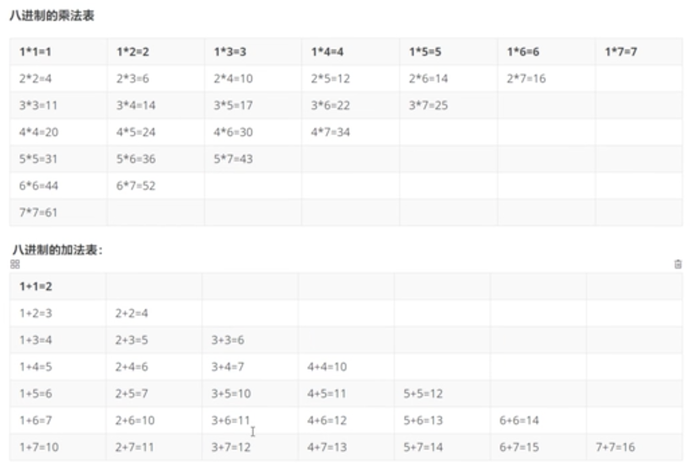
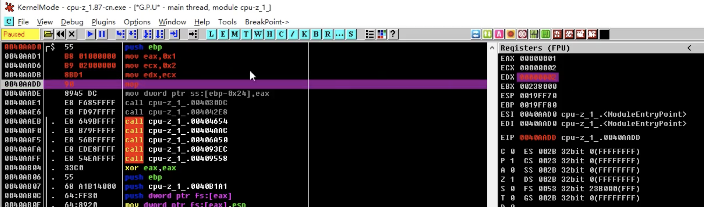

Reference Resources:

[二進制到匯編學習](https://www.bilibili.com/video/BV1ni4y1G7B9)

[汇编语言入门教程](http://www.ruanyifeng.com/blog/2018/01/assembly-language-primer.html)

[Introduction to reverse engineering and Assembly](http://kakaroto.homelinux.net/2017/11/introduction-to-reverse-engineering-and-assembly/), by Youness Alaoui

[x86 Assembly Guide](http://www.cs.virginia.edu/~evans/cs216/guides/x86.html), by University of Virginia Computer Science

## 一、概述

### -- 語言

- 任何人溝通

- 什麼是機器語言

  ```
  # 主流的電子計算機
  狀態： 0 和 1
  # 最早的程序員：穿孔卡帶
  加 0100 0000
  減 0100 1000
  乘 0100 1000 0100 1000
  除 0100 1000 1100 1000
  ```

- 助記符、匯編語言： 將人能夠理解的語言轉換為機器能夠理解的語言，一般用於底層編寫，單片機

  ```
  加 INC -編譯器-> 0100 0000
  減 DEC 0100 1000
  乘 MUL 0100 1000 0100 1000
  除 DIV 0100 1000 1100 1000
  ```

- C語言

  ```
  加 A+B -編譯器-> 0100 0000
  減 A-B 0100 1000
  乘 A*B 0100 1000 0100 1000
  除 A/B 0100 1000 1100 1000
  1234
  ```


<mark>底層：VC6 OD</mark>

### -- 進制(查數)

- **二進制** 0 1

- 進制加密 -----> ex: 自定義十進制：1 2 4 6 9 r y n k u

  破解 -----> 但是數字量一大，總是有規律的

```shell
#一進制 1~20
1
1 1
1 1 1
1 1 1 1
.....

#三進制 1~20
0		1		2
10	11	12
20	21	22
100	101	102
110	111	112
120	121	122
....

#七進制 1~20
0		1		2		3		4		5		6		
10	11	12	13	14	15	16	
20	21	22	23	24	25	26
```

<mark>進制(查數)   ----->    一組符號，逢幾進幾</mark>

### -- 進制的運算

<mark>運算的本質就是查數</mark>

```shell
#運算的本質就是查數
0	1	2	3	4	5	6	7	10	11	12	13	14	15	16	17	20	21	22	23	24 25	26

#八進制查數(計算)下面結果：
2+3= move right 3 step from 2 =5
2*3= move 2 time of 3 step from 0=6
4+5= move right 5 step from 4 =11
4*5= move 4 time of 5 step from 0=24

```



```shell
#八進制查數(計算)下面結果：
277+333=
276+54=
237-54=
234/4=

2 7 7
3 3 3  +
---------
  1 1
1 2
5
---------
6 3 2  

==============

		 276
		  54  *
-----------
		1370
	 1666		+
-----------
   20250
```

除法本質：除數除以那個數最接近結果即可！

- 結論： <mark>無論是什麼機制，本身都是有一套完美的運算體系的，都可以通過列表的方式將它計算出來！ </mark>


### -- 二進制

- 寄存器/内存/位

### -- 數據寬度

<mark>C 、 C++、 java 都需要定義數據的類型，因為計算機底層需要我們給這些數據定義寬度（在內存中的寬度）</mark>

- 位 --->  `0`  or ` 1`

- bit (位元) ---> 二進位中的一位1位，是資訊的最小單位**Bi**nary digi**t**（二進位數位）---> 1位  0-1 ---> 
- Byte (位元組) ---> 由8位元組成 ---> 8位 0-0xFF ---> 十進位表示範圍： -2<sup>7</sup> ~ 2<sup>7</sup>-1 == `-128~127`
- Word (字) --->  16位 0-0xFFFF --->   十進位表示範圍：
- DWord ---> 32位 0-0xFFFFFFFF --->  十進位表示範圍：

0x表示16進制：F/f=15

一個 F 代表四個 1

FFFF FFFF ＝ 1111 1111 1111 1111   1111 1111 1111 1111

> 以0x開始的數據表示i16進制，`0xff`換成十進制為255。
>
> A，B，C，D，E，F這五個字母來分別i表示10，11，12，13，14，15。
>
> 第一種方法：
>
> 16進制變十進制：f 表示15。第n位的權值為16的n次方，由右到左從0位起。
>
> 0xff = 15 * 16 ^ 1 + 15 * 16 ^ 0 = 255
>
> 第二種方法：
>
> 16進制變二進制再變十進制：
>
> 0xff = 1111 1111 = 2 ^ 8-1 = 255 

在資料傳輸時，會將真實的數值轉換成bytes，然後把每一位數拆開，收到資料的軟體再去把這些byte合起來。

### -- 有符號數和無符號數

<mark>無符號數規則 </mark>

你這數字是什麼，那就是什麼

```shell
1 0 0	1		1	0	1	0  十六進制， 0x9A
```

<mark>有符號數</mark>

- 最高位是符号数 -----> 1（負数） 0（正数）

```shell
1 0 0	1		1	0	1	0   如何轉換 	==> 原碼反碼補碼
```

## 二、原碼反碼補碼

- 原碼：最高位符號位
- 反碼：
  - 正數：與原碼一樣
  - 負數：符號位為1，其餘位對原碼取反
- 補碼：
  - 正數：與原碼一樣
  - 負數：符號位為1，其餘位對原碼取反 + 1 == ( 反碼 + 1 )

```shell
1 正数==> 反码=補碼
# 原碼 0 0 0 0  0 0 0 1
# 反碼 0 0 0 0  0 0 0 1
# 補碼 0 0 0 0  0 0 0 1

-1
# 原碼 1 0 0 0  0 0 0 1
# 反碼 1 1 1 1  1 1 1 0
# 補碼 1 1 1 1  1 1 1 1

-7
# 原碼 1 0 0 0  0 1 1 1
# 反碼 1 1 1 1  1 0 0 0
# 補碼 1 1 1 1  1 0 0 1

3 + 5 = 8
11 + 101 = 1000
```

<mark>如果看到一個數字，二進制，要了解它是 有符號數還是無符號數</mark>

正數 -----> 正常存

負數 -----> 補碼

寄存器  :  mov 寄存器，值

### #在計算機系統中，數值一律用補碼來表示（存儲）

[原码、反码、补码的产生、应用以及优缺点有哪些？](https://www.zhihu.com/question/20159860)

> 原碼

一、為了表示正與負，人們發明了"原碼"，把生活應該有的正負概念，原原本本的表示出來。把左邊第一位騰出位置，存放符號，正用0來表示，負用1來表示


問題：

1. 但使用“原碼”儲存的方式，方便了看的人類，卻苦了計算機。我們希望（+1）和（-1）相加是0，但計算機只能算出0001+1001=1010 (-2)，這不是我們想要的結果。

2. 另外一個問題，這裡有兩個零，一個（+0）和（-0）

> 反碼

二、為了解決“正負相加等於0”的問題，在“原碼”的基礎上，人們發明了“反碼”，“反碼”表示方式是用來處理負數的，符號位置不變，其餘位置相反


當“原碼”變成“反碼”時，完美的解決了“正負相加等於0”的問題過去的（+1）和（-1）相加，變成了0001+1101=1111，剛好反碼表示方式中，1111象徵 (-0)。

>補碼

三、人們總是進益求精，解決歷史遺留下來的問題 --->  有兩個零存在，(+0) 和(-0)

我們希望只有一個0，所以發明了"補碼"，同樣是針對"負數"做處理的"補碼"的意思是，從原來"反碼"的基礎上，再加上一個新的 代碼（操作）---> 反碼 +1，我們達到目標 ---> 沒有（-0）。


有得必有失，在補一位1的時候，要丟掉最高位。

我們要處理"反碼"中的(-0)，當1111再補上一個1之後，變成了10000，丟掉最高位就是0000，剛好和左邊正數的0，完美融合掉了。

這樣就解決了(+0)和(-0)同時存在的問題，另外"正負數相加等於0"的問題，同樣得到滿足。舉例，3和（-3）相加，0011 + 1101 =10000，丟掉最高位，就是0000（0）

同樣有失必有得，我們失去了(-0) , 收穫了（-8）---> 負數總是

以上就是"補碼"的存在方式結論：保存正負數，不斷改進方案後，選擇了最好的"補碼"方案 -----> <mark>在計算機系統中，數值一律用補碼來表示（存儲）。主要原因：使用補碼，可以將符號位和其它位統一處理；同時，減法也可按加法來處理。</mark>

> 補碼加法溢出

所謂的“負數加負數會變成正數，正數加正數會變成負數”，本質還是在於，計數係統是無法表示超出其取值範圍的計算結果的。 


120D+120D=01111000B+01111000B=11110000B，符號位的1來自低位進位，指示了結果是負數，所以需要求補得10010000B也就是-16D，放在鐘面上就是從120順時針旋轉120格到240的位置，只不過系統最大隻取到127，240的位置就是-16的位置，而且-16和240正是關於模256的一對補數。 -120D-120D=16D也是一樣的道理。在有限的計數係統內，由於位數的限制，發生溢出的情況下無法得到計算真實值，得到的是真實值關於模的補數。


## 三、位運算

計算機可以存儲所有的數字（整數、浮點數、字符）的運算

2*8最高效計算方式

> 與運算（and &）**


```
1011 0001
1101 1000
---------與運算
1001 0000
```

> **或運算（or |）** 


```
1011 0001
1101 1000
---------或運算
1111 1001
```

> **異或運算（xor ^）**


```
1011 0001
1101 1000
---------異或運算
1111 1001
```

> **非運算（not ~）**

```
1011 0001
---------非運算
0100 1110
```

**位運算（移動位）**碼出高效

左移（shl<<） 高位丟棄 低位補0 ===> 乘2（對十進製而言）

右移（shr>>） 低位丟棄 高位跟據符號位，決定補 0 還是 1 ===> 除2（對十進製而言）

```shell
左移（shl<<） 高位丟棄 低位補0 ===> 乘2
0000 0001   1
0000 0010   2
0000 0100   4
0000 1000   8

右移（shr>>） 低位丟棄 高位補0、1（符號位決定）===> 除2（對十進制而言）
0000 0001   
0000 0000
```

## 四、位運算的加減乘除

**4+5**

```shell
# 計算機操作 **4+5**
0000 0100
0000 0101
-----------加法
0000 1001

# 計算機的實現原理

# 第一步：異或運算 ---> 不考慮進位
0000 0100
0000 0101
-----------
0000 0001

# 第二步：與運算 ---> 判斷進位
0000 0100
0000 0101
-----------
0000 0100   # ---> 有1 == 判断有 需進位項 ---> 第三步進位操作
						# 0000 0000 ---> 判断無 需進位項

# 第三步：將第二步(與運算)結果左移一位 ---> 進位操作
0000 0100 << 1
0000 1000

# 第四步：異或運算 ---> 第一步結果 異或 第三步結果 --->
0000 0001		# 第一步结果
0000 1000		# 第三步结果
-----------
0000 1001

# 第五步：與運算 ---> 第一步結果 與 第三步結果 ---> 判斷是否還有進位項 ---> 如果與運算結果為 0，沒有進位（無 需進位項）。確認第四步結果為最終值
0000 0001
0000 1000
-----------
0000 0000
# ＝＝＝ 所以最終的結果，就是 與運算 為 0 的結果的 上一個 異或運算。＝＝＝
```

**4-5**

```shell
# 計算機操作 **4-5** ===> 4+(-5)
	
	(-5)	
	原碼	0000 0101	 ---> 正数
	反碼	1111 1010
	補碼	1111 1011  ---> 负数 
	
# 計算機的實現原理

# 第一步：異或運算 ---> 不考慮進位
0000 0100
1111 1011
-----------異或（如果不考慮進位，異或就可以直接出結果）
1111 1111 	在內存中等於 （16進制）ff = （10進制）-1

# 第二步：與運算 ---> 判斷進位
0000 0100
1111 1011
-----------與（判斷進位，如果運算結果為 0 ，沒有進位
0000 0000	---> 沒有1，判断無 需進位項

# 所以最終的結果，就是 與運算 為 0 的結果的 上一個 異或運算 ===> 第一步：异或运算 1111 1111

最終結果	1111 1111 = 0xff（16進制） = -1（10進制）
```

減法 加負數
乘法 n個m相加 m*n
除法 相當於減法x能減去多少y x/y

<mark>機器語言只做加法</mark>

機器語言就是為運算，有電路實現，這就是計算機最底層的本質。

## 五、匯編語言環境配置

匯編語言 == 通過指令來代替二進制編碼

Ｃ語言學習正確方式 -----> linux + vim + gcc

學匯編，不是為了寫代碼 ---> 了解程序的本質

尋址 ---> Debug

- VC6（程序到匯編的理解）
- OD
- 抓包工具
- 加密解密


<<匯編語言>> ----> 16 位的匯編  ---> 多了寄存器 32位    64位（和 32位 本質架構區別不大，尋址能力增加）

匯編入門：了解匯編和程序的對應關係，程序的本質即可！

操作系統內核


## 六、通用寄存器

先來看寄存器。 CPU 本身只負責運算，不負責儲存數據。數據一般都儲存在內存之中，CPU 要用的時候就去內存讀寫數據。但是，CPU 的運算速度遠高於內存的讀寫速度，為了避免被拖慢，CPU 都自帶一級緩存和二級緩存。基本上，CPU 緩存可以看作是讀寫速度較快的內存。

但是，CPU 緩存還是不夠快，另外數據在緩存裡面的地址是不固定的，CPU 每次讀寫都要尋址也會拖慢速度。因此，除了緩存之外，CPU 還自帶了寄存器（register），用來儲存最常用的數據。也就是說，那些最頻繁讀寫的數據（比如循環變量），都會放在寄存器裡面，CPU 優先讀寫寄存器，再由寄存器跟內存交換數據。

寄存器不依靠地址區分數據，而依靠名稱。每一個寄存器都有自己的名稱，我們告訴 CPU 去具體的哪一個寄存器拿數據，這樣的速度是最快的。有人比喻寄存器是 CPU 的零級緩存。

我們常常看到 32位 CPU、64位 CPU 這樣的名稱，其實指的就是寄存器的大小。 32 位 CPU 的寄存器大小就是4個字節。

數據存儲速度：CPU>內存>硬盤

 32位CPU：8	16	32

 64位CPU：8	16	32	64

```shell
 32位的寄存器只有8個
 存值范围0~FFFFFFFF
```


ESP 寄存器有特定用途，保存當前 Stack 的地址

對二進制來說，直接修改值

<mark>計算機如果要往寄存器存值</mark>

mov指令

```
$ mov 存的地址，存的数
$ mov 存的地址1，存的地址2
# 可以將數字寫入寄存器，可以將寄存器中的值寫入寄存器
```





通用寄存器

```
32位    16位    8位
EAX     AX      AL
ECX     CX      CL
EDX     DX      DL
EBX     BX      BL
ESP     SP      AH
EBP     BP      CH
ESI     SI      DH
EDI     DI      BH

8位: L低8位  .... ...F
     H高8位	 .... ..F.

32位:  FFFF FFFF
16位:  .... FFFF
8位: 	.... ..FF
```

> 16位 -->  .... FFFF


> 8位：L低8位 H高8位 .... ..FF


除了這些通用的寄存器之外，那麼其他的寄存器每一位都有自己特定的功能！

## 七、内存

寄存器很小，不夠用，所以數據放到內存！

每個應用程序進程都有4GB的內存空間，空頭支票


程序真正運行時，才會用到物理內存。

1B=8bits

1KB=1024B

1MB=1024KB

1GB=1024MB

4G的內存 == 4096兆 => 最終計算為位，就是這個可以儲存的最大容量。

存一個數，佔用的大小，數據寬度，存到哪裡？

計算機中內存地址很多，空間很大 -----> 每個空間分配一個地址、名字。


這些給內存取的編號，就是我們得內存地址。32位 ---> 8個 16進制的值

> 位是怎麼限制內存大小的

32位系統 寄存器的尋址範圍4GB (FFFF FFFF + 1 = 100,000,000內存地址 )* 8 (一個內存地址可以存八位（一位＝4個0/1 ） ＝ 800,000,000位

16進制800000000 轉為10進制 4,294,967,296字節（Byte） =》4GB

 ---> 轉成10進位＝34,359,736,368（能往計算機存的最大數值）除以8 =4,294.967,296字節

按規則/1024 --> KB/1024 --> MB/1024 --> 4GB

故32位系統最多只支持4GB

```
						8/16/32/66
mov 数据宽度(byte/word/dword/qword) 内存地址，1
mov byte ptr ds:[0x19FF70],1
```

64位系統 寄存器的尋址範圍 : (FFFF FFFF FFFF FFFF +1)


所以每個內存地址都有一個編號，可以通過編號往裡面存值。

指針 --> 內存


### 1.内存模型：Heap

寄存器只能存放很少量的數據，大多數時候，CPU 要指揮寄存器，直接跟內存交換數據。所以，除了寄存器，還必須了解內存怎麼儲存數據。

程序運行的時候，操作系統會給它分配一段內存，用來儲存程序和運行產生的數據。這段內存有起始地址和結束地址，比如從`0x1000`到`0x8000`，起始地址是較小的那個地址，結束地址是較大的那個地址。


<span style="color:orange">程序運行過程中，對於動態的內存佔用請求（比如新建對象，或者使用`malloc`命令），系統就會從預先分配好的那段內存之中，劃出一部分給用戶</span>，具體規則是從起始地址開始劃分（實際上，起始地址會有一段靜態數據，這裡忽略）。舉例來說，用戶要求得到10個字節內存，那麼從起始地址`0x1000`開始給他分配，一直分配到地址`0x100A`，如果再要求得到22個字節，那麼就分配到`0x1020` 。


這種<mark>因為用戶主動請求而劃分出來的內存區域，叫做 Heap（堆）</mark>。它由起始地址開始，從低位（地址）向高位（地址）增長。 <mark>Heap 的一個重要特點就是不會自動消失，必須手動釋放，或者由垃圾回收機制來回收。 </mark>

### 2.内存模型：Stack

<span style="color:orange">除了 Heap 以外，其他的內存佔用叫做 Stack（棧）。簡單說，Stack 是由於函數運行而臨時佔用的內存區域。 </span>


請看下面的例子。

```clike
int main() {
   int a = 2;
   int b = 3;
}
```

上面代碼中，系統開始執行`main`函數時，會為它在內存裡面建立一個<mark>幀（frame）</mark>，所有`main`的內部變量（比如`a`和`b`）都保存在這個幀裡面。 <span style="color:orange">`main`函數執行結束後，該幀就會被回收，釋放所有的內部變量，不再佔用空間。 </span>


如果函數內部調用了其他函數，會發生什麼情況？

```clike
int main() {
   int a = 2;
   int b = 3;
   return add_a_and_b(a, b);
}
```

上面代碼中，`main`函數內部調用了`add_a_and_b`函數。執行到這一行的時候，系統也會為`add_a_and_b`新建一個幀，用來儲存它的內部變量。也就是說，此時同時存在兩個幀：`main`和`add_a_and_b`。一般來說，<span style="color:orange">調用棧有多少層，就有多少幀。 </span>


等到`add_a_and_b`運行結束，它的幀就會被回收，系統會回到函數`main`剛才中斷執行的地方，繼續往下執行。通過這種機制，就實現了函數的層層調用，並且每一層都能使用自己的本地變量。

所有的幀都存放在 Stack，由於幀是一層層疊加的，所以 Stack 叫做棧。生成新的幀，叫做"入棧"，英文是 push；棧的回收叫做"出棧"，英文是 pop。 Stack 的特點就是，最晚入棧的幀最早出棧（因為最內層的函數調用，最先結束運行），這就叫做"後進先出"的數據結構。每一次函數執行結束，就自動釋放一個幀，所有函數執行結束，整個 Stack 就都釋放了。


<mark>Stack 是由內存區域的結束地址開始，從高位（地址）向低位（地址）分配。 </mark>比如，內存區域的結束地址是`0x8000`，第一幀假定是16字節，那麼下一次分配的地址就會從`0x7FF0`開始；第二幀假定需要64字節，那麼地址就會移動到`0x7FB0`。


## 彙編指令

### 1.CPU 指令

##### 一個實例

了解寄存器和內存模型以後，就可以來看彙編語言到底是什麼了。下面是一個簡單的程序`example.c`。

> ```clike
> int add_a_and_b(int a, int b) {
> return a + b;
> }
> 
> int main() {
> return add_a_and_b(2, 3);
> }
> ```

gcc 將這個程序轉成彙編語言。

> ```bash
> $ gcc -S example.c
> ```

上面的命令執行以後，會生成一個文本文件`example.s`，裡面就是彙編語言，包含了幾十行指令。這麼說吧，一個高級語言的簡單操作，底層可能由幾個，甚至幾十個 CPU 指令構成。 CPU 依次執行這些指令，完成這一步操作。

`example.s`經過簡化以後，大概是下面的樣子。

> ```clike
> _add_a_and_b:
> push %ebx
> mov %eax, [%esp+8]
> mov %ebx, [%esp+12]
> add %eax, %ebx
> pop %ebx
> ret
> 
> _main:
> push 3
> push 2
> call _add_a_and_b
> add %esp, 8
> ret
> ```

可以看到，原程序的兩個函數`add_a_and_b`和`main`，對應兩個標籤`_add_a_and_b`和`_main`。每個標籤裡面是該函數所轉成的 CPU 運行流程。

每一行就是 CPU 執行的一次操作。它又分成兩部分，就以其中一行為例。

> ```clike
> push %ebx
> ```

這一行里面，`push`是 CPU 指令，`%ebx`是該指令要用到的運算子。一個 CPU 指令可以有零個到多個運算子。

下面我就一行一行講解這個彙編程序，建議讀者最好把這個程序，在另一個窗口拷貝一份，省得閱讀的時候再把頁面滾動上來。

##### push 指令

根據約定，程序從`_main`標籤開始執行，這時會在 Stack 上為`main`建立一個幀，並將 Stack 所指向的地址，寫入 ESP 寄存器。後面如果有數據要寫入`main`這個幀，就會寫在 ESP 寄存器所保存的地址。

然後，開始執行第一行代碼。

> ```clike
> push 3
> ```

`push`指令用於將運算子放入 Stack，這裡就是將`3`寫入`main`這個幀。

雖然看上去很簡單，`push`指令其實有一個前置操作。它會先取出 ESP 寄存器裡面的地址，將其減去4個字節，然後將新地址寫入 ESP 寄存器。使用減法是因為 Stack 從高位向低位發展，4個字節則是因為`3`的類型是`int`，佔用4個字節。得到新地址以後， 3 就會寫入這個地址開始的四個字節。

> ```clike
> push 2
> ```

第二行也是一樣，`push`指令將`2`寫入`main`這個幀，位置緊貼著前面寫入的`3`。這時，ESP 寄存器會再減去 4個字節（累計減去8）。


##### call 指令

第三行的`call`指令用來調用函數。

> ```clike
> call _add_a_and_b
> ```

上面的代碼表示調用`add_a_and_b`函數。這時，程序就會去找`_add_a_and_b`標籤，並為該函數建立一個新的幀。

下面就開始執行`_add_a_and_b`的代碼。

> ```clike
> push %ebx
> ```

這一行表示將 EBX 寄存器裡面的值，寫入`_add_a_and_b`這個幀。這是因為後面要用到這個寄存器，就先把裡面的值取出來，用完後再寫回去。

這時，`push`指令會再將 ESP 寄存器裡面的地址減去4個字節（累計減去12）。

##### mov 指令

`mov`指令用於將一個值寫入某個寄存器。

> ```clike
> mov %eax, [%esp+8]
> ```

這一行代碼表示，先將 ESP 寄存器裡面的地址加上8個字節，得到一個新的地址，然後按照這個地址在 Stack 取出數據。根據前面的步驟，可以推算出這裡取出的是`2`，再將`2`寫入 EAX 寄存器。

下一行代碼也是乾同樣的事情。

> ```clike
> mov %ebx, [%esp+12]
> ```

上面的代碼將 ESP 寄存器的值加12個字節，再按照這個地址在 Stack 取出數據，這次取出的是`3`，將其寫入 EBX 寄存器。

##### add 指令

`add`指令用於將兩個運算子相加，並將結果寫入第一個運算子。

> ```clike
> add %eax, %ebx
> ```

上面的代碼將 EAX 寄存器的值（即2）加上 EBX 寄存器的值（即3），得到結果5，再將這個結果寫入第一個運算子 EAX 寄存器。

##### pop 指令

`pop`指令用於取出 Stack 最近一個寫入的值（即最低位地址的值），並將這個值寫入運算子指定的位置。

> ```clike
> pop %ebx
> ```

上面的代碼表示，取出 Stack 最近寫入的值（即 EBX 寄存器的原始值），再將這個值寫回 EBX 寄存器（因為加法已經做完了，EBX 寄存器用不到了）。

注意，`pop`指令還會將 ESP 寄存器裡面的地址加4，即回收4個字節。

##### ret 指令

`ret`指令用於終止當前函數的執行，將運行權交還給上層函數。也就是，當前函數的幀將被回收。

> ```clike
> ret
> ```

可以看到，該指令沒有運算子。

隨著`add_a_and_b`函數終止執行，系統就回到剛才`main`函數中斷的地方，繼續往下執行。

> ```clike
> add %esp, 8
> ```

上面的代碼表示，將 ESP 寄存器裡面的地址，手動加上8個字節，再寫回 ESP 寄存器。這是因為 ESP 寄存器的是 Stack 的寫入開始地址，前面的`pop`操作已經回收了4個字節，這裡再回收8個字節，等於全部回收。

> ```clike
> ret
> ```

最後，`main`函數運行結束，`ret`指令退出程序執行。

## 內存複製

## 堆棧的指令

## 彙編編寫函數

## 堆棧傳參

## 堆棧平衡

## 外掛